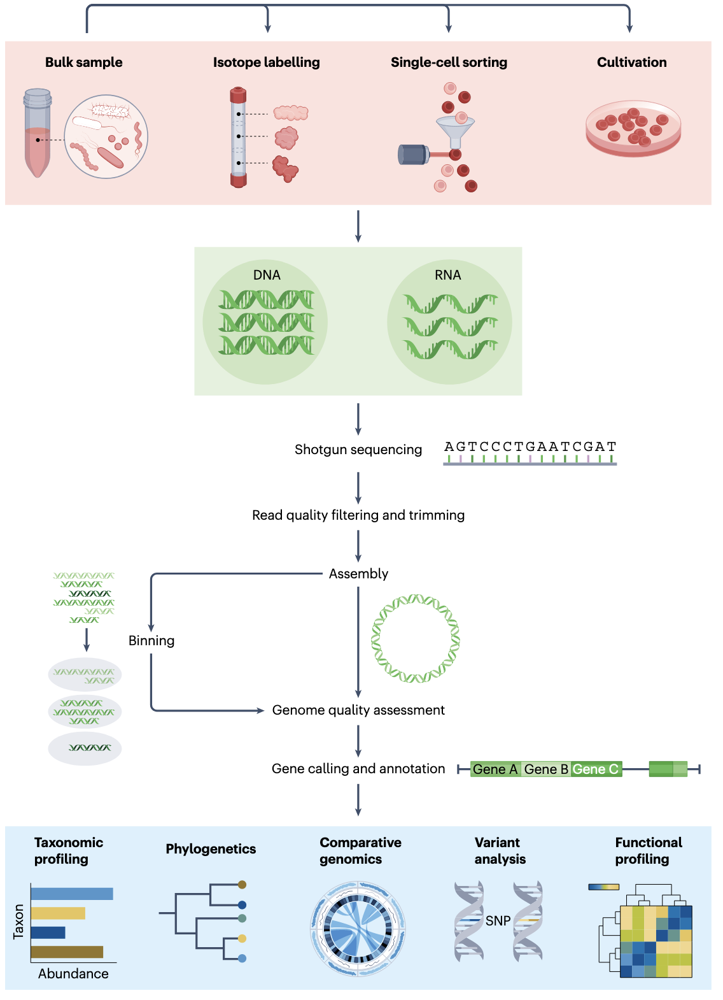
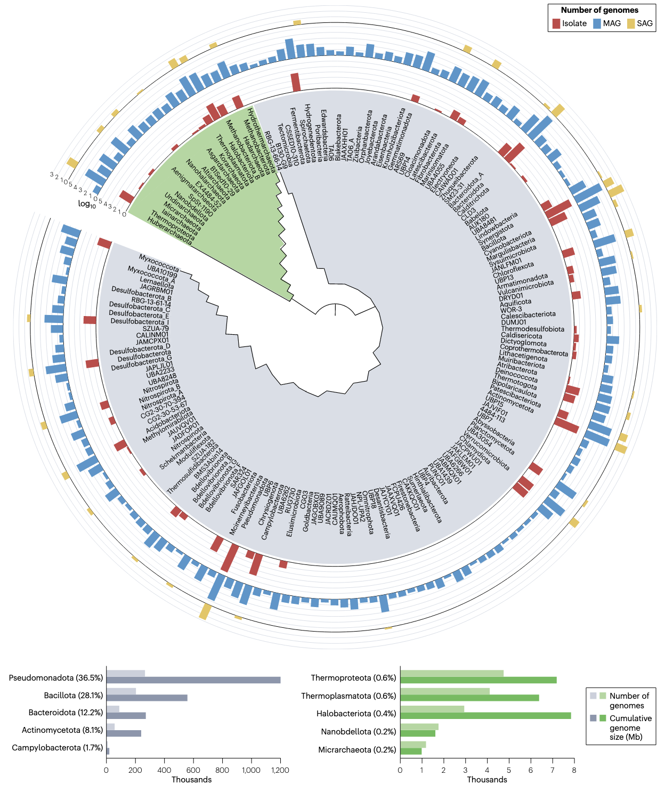
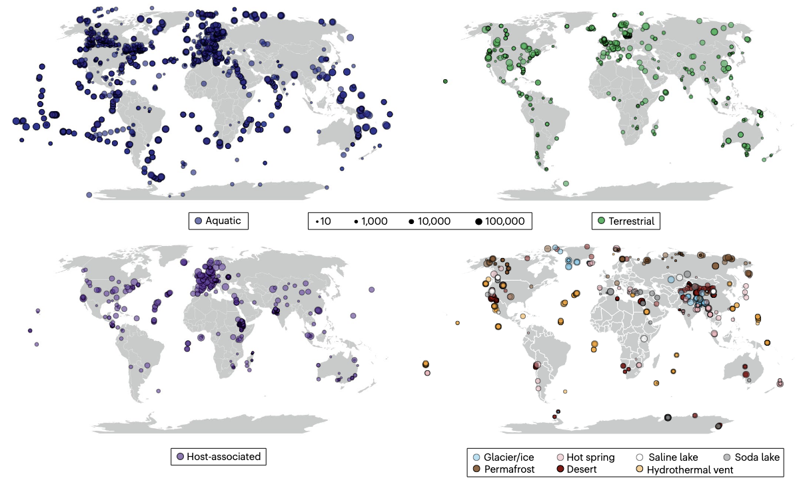
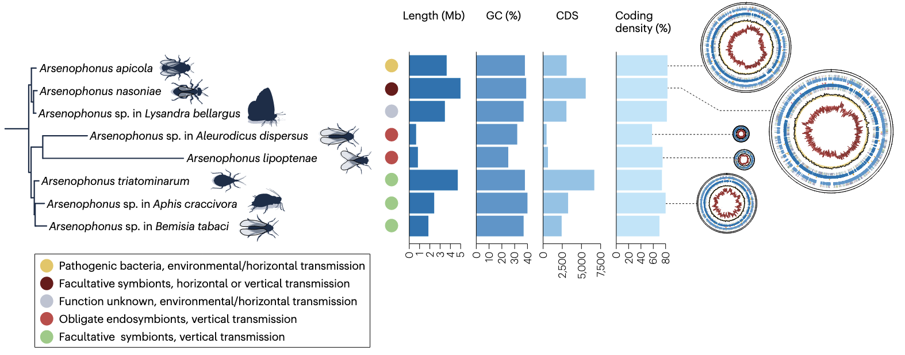

## Introduction

在地球生态系统中，微生物扮演着不可或缺的角色，它们参与关键生物过程，塑造生态系统结构，驱动生物地球化学循环，并对人类健康与环境健康产生深远影响。随着环境样本高通量测序技术的飞速发展，人类对微生物多样性及其功能的认知发生了革命性变化。如今，涵盖地球各大生物群系的海量基因组数据为我们提供了微生物生命的“蓝图”，助力我们从更全面的角度理解不同生态系统中微生物组的结构与功能。

近期发表在《Nature Reviews Genetics》的一篇综述围绕基因组中心方法在微生物研究中的应用展开，梳理相关技术进展、重要发现及未来方向。

1. Szabó, G., Eloe-Fadrosh, E.A., Pett-Ridge, J., and Woyke, T. (2025). A genomic view of Earth’s biomes. Nat. Rev. Genet., 1–19. https://doi.org/10.1038/s41576-025-00888-1.

## 微生物研究的技术发展

微生物研究的技术发展历程，是人类逐步深入探索微生物世界的缩影。早期，科学家主要依赖基因中心（gene-centric）方法，通过对特定基因（如核糖体RNA基因）的测序来研究微生物。1990年，两项发表在《Nature》的研究为这一阶段奠定了基础：Giovannoni等人对马尾藻海浮游细菌的遗传多样性进行了分析，Ward等人则通过16S rRNA序列发现自然群落中存在大量未培养微生物。这些研究初步揭示了微生物世界的丰富性，但受限于技术，无法全面获取微生物的基因组信息。

随着技术的进步，研究逐渐转向基因组中心（genome- centric）方法。1996年，Stein等人成功分离并分析了来自海洋浮游古菌的40千碱基基因组片段，迈出了获取微生物基因组片段的重要一步。2004年成为微生物基因组研究的关键节点，Tyson等人通过环境基因组重建微生物基因组，揭示了微生物群落的结构与代谢特征；同年，Venter等人对马尾藻海进行环境基因组鸟枪法测序，进一步拓展了人类对海洋微生物基因组的认知。

近年来，单细-胞测序和功能谱分析技术的突破，让基因组中心方法更加强大。2017年，Woyke等人阐述了微生物单细胞测序的发展轨迹，该技术能够从复杂环境中分离单个微生物细胞并进行基因组测序，避免了传统培养方法的局限，为研究未培养微生物提供了有力工具。2024年，Agustinho等人和Kim等人分别综述了长读长测序技术在宏基因组研究中的应用，该技术可生成更长的DNA序列读数，提高了基因组组装的完整性和准确性，助力更精准地解析微生物基因组结构。

## 以基因组为中心的研究方法

### 核心技术解析
基因组中心方法涵盖多种关键技术，这些技术相互配合，共同推动微生物研究的深入。
1. **宏基因组组装基因组（MAGs）技术**：该技术通过对环境样本中的宏基因组数据进行组装和分箱，重建微生物的基因组。2013年，Albertsen等人提出差异覆盖分箱方法，利用多个宏基因组样本中基因组覆盖度的差异，将组装得到的基因组片段分配到不同的微生物基因组中，显著提高了MAGs的质量和数量。2021年，Nayfach等人构建了地球微生物组的基因组目录，其中包含大量通过MAGs技术获得的微生物基因组，为全球微生物多样性研究提供了宝贵资源。
2. **单细胞基因组（SAGs）技术**：单细胞分选技术是获取SAGs的前提，常用的方法包括流式细胞分选和微流控分选。流式细胞分选可根据细胞的物理和化学特性快速分离单个细胞；微流控分选则利用微流控芯片实现对单个细胞的精准操控和分离。分离后的单个细胞经过全基因组扩增，获得足够量的DNA用于测序。2017年，Stepanauskas等人改进了单细胞基因组测序技术，提高了基因组的回收率，并实现了对单个微生物细胞和病毒颗粒的整合细胞大小分析。
3. **功能驱动的单细胞基因组技术**：该技术将功能筛选与单细胞基因组测序相结合，能够针对性地获取具有特定功能的微生物基因组。2017年，Doud等人提出了功能驱动的单细胞基因组学新方法；2019年，他们利用该方法从稀有生物群落中发现了降解纤维素的细菌，展示了该技术在挖掘具有特定功能微生物资源方面的优势。

### 技术应用场景

1. **微生物多样性调查**：基因组中心方法能够全面调查不同环境中的微生物多样性，包括细菌、古菌和病毒。2022年，Neri等人通过宏基因组测序扩展了全球RNA病毒组，发现了多个新的噬菌体分支，揭示了病毒世界的巨大多样性。2020年，Call等人综述了全球宏基因组学在病毒研究中的应用，指出宏基因组技术为探索病毒多样性和生态功能提供了前所未有的机会。
2. **微生物功能解析**：通过对微生物基因组的分析，可预测其功能潜力。2023年，Pavlopoulos等人利用全球宏基因组学数据解析了微生物的功能“暗物质”，发现了许多未知的基因功能和代谢途径。2022年，Greening等人研究了微生物对大气微量气体的氧化作用，通过基因组分析确定了参与该过程的关键基因和酶，揭示了微生物在全球大气循环中的重要作用。
3. **宿主相关微生物研究**：基因组中心方法为研究宿主相关微生物提供了有力工具。2020年，Zheng等人和Fan等人分别探讨了微生物组与免疫系统的相互作用以及肠道微生物组在人类代谢健康和疾病中的作用。通过对宿主相关微生物的基因组分析，能够深入了解微生物与宿主之间的共生关系、代谢交流以及微生物对宿主健康的影响机制。

## 进化与功能发现
### 微生物进化研究突破
1. **生命树的重构**：传统的生命树构建主要基于核糖体RNA基因序列，而基因组中心方法通过利用全基因组数据，能够更准确地反映微生物之间的进化关系。2016年，Hug等人基于基因组数据构建了新的生命树，对传统的生命树结构进行了重大修正，揭示了许多新的微生物分支。2021年，Coleman等人通过对大量细菌基因组的分析，构建了一个有根的细菌进化树，为理解细菌的早期进化提供了关键线索。
2. **未培养微生物的进化解析**：大量微生物无法通过传统培养方法获得，基因组中心方法为研究这些未培养微生物的进化提供了可能。2013年，Rinke等人对“微生物暗物质”（指未培养的微生物）进行了基因组分析，揭示了其丰富的系统发育多样性和编码潜力。2015年，Brown等人研究了一个占细菌域15%以上的特殊类群，发现其具有独特的生物学特征和进化历程，挑战了传统的细菌分类和进化观点。
3. **古菌的进化多样性**：古菌是生命的三大域之一，但其进化多样性长期以来未被充分认识。2020年，Baker等人综述了古菌的多样性、生态学和进化，指出基因组研究揭示了古菌在不同环境中的广泛分布和多样的代谢方式。2021年，Tahon等人进一步探讨了古菌多样性和系统发育的扩展，发现了许多新的古菌分支，丰富了我们对古菌进化的理解。

### 微生物功能发现亮点
1. **新颖代谢途径的发现**：基因组分析结合功能验证，不断发现微生物新的代谢途径。2000年，Béjà等人发现了细菌视紫红质，揭示了海洋中一种新的光营养方式，该发现改变了人们对海洋微生物能量代谢的认知。2022年，Delmont等人研究发现，在大部分透光海洋中，异养细菌固氮菌的丰度高于蓝细菌固氮菌，这一发现重新定义了海洋氮循环的关键参与者，为理解海洋生态系统的氮平衡提供了新视角。
2. **极端环境微生物的功能适应**：极端环境（如高温、高盐、低温等）中的微生物具有独特的适应机制。2022年，Shu等人综述了极端环境中的微生物多样性，指出基因组研究发现了这些微生物在极端环境下生存和代谢的关键基因和途径。例如，在高温热泉环境中，微生物通过合成热稳定的蛋白质和酶来适应高温条件；在高盐环境中，微生物则通过积累相容性溶质来维持细胞的渗透压平衡。
3. **微生物与生物地球化学循环的关联**：微生物在生物地球化学循环中发挥着核心作用，基因组研究揭示了微生物参与这些循环的分子机制。2023年，Sieradzki等人通过分析土壤中降解大分子有机氮的酶的表达，确定了影响土壤有机氮有效性的潜在关键微生物，为理解土壤氮循环过程提供了分子水平的解释。2022年，Greening等人研究了微生物对大气微量气体的氧化作用，发现这些微生物通过特定的酶系统将大气中的微量气体转化为自身可利用的能量和物质，参与了全球碳、氮等元素的循环。

## 不同环境中微生物的时空多样性

### 空间多样性
1. **海洋环境**：海洋是地球上最大的生态系统，不同海域的微生物组成和功能存在显著差异。2015年，Sunagawa等人对全球海洋浮游生物的结构和功能进行了研究，发现海洋微生物的分布具有明显的纬度梯度和深度梯度。例如，在表层海洋中，蓝细菌（如原绿球藻和聚球藻）含量较高，它们通过光合作用为海洋生态系统提供大量有机物质；在深海环境中，微生物则主要依赖化能合成作用获取能量，如利用硫化氢、甲烷等无机物进行代谢。2022年，Pachiadaki等人通过单细胞基因组技术绘制了海洋微生物组的复杂性图谱，进一步揭示了海洋微生物在不同空间位置的多样性和功能分化。
2. **土壤环境**：土壤是复杂的异质性环境，微生物的分布受土壤类型、植被、气候等多种因素影响。2018年，Bahram等人研究了全球表层土壤微生物组的结构和功能，发现土壤微生物的多样性在全球范围内存在显著差异，且与气候因素（如温度和降水）密切相关。2023年，Riley等人对热带土壤微生物组进行了兆碱基级别的共组装，获得了大量土壤微生物基因组，为研究热带土壤微生物的空间分布和功能提供了基础。2025年，Kazarina等人从不同降水梯度的土壤深度中恢复了679个宏基因组组装基因组，发现土壤深度和降水梯度对微生物群落组成和功能具有重要影响。
3. **极端环境**：极端环境中的微生物具有独特的空间分布特征。2016年，Eloe-Fadrosh等人在地热泉中发现了一个新的细菌候选门，该门细菌仅存在于特定的地热环境中，体现了极端环境微生物空间分布的特殊性。2024年，Colman等人和Qi等人分别对热泉环境中的微生物进行了研究，发现热泉的地球化学参数（如温度、pH值、化学物质组成）是影响微生物空间分布的关键因素，不同热泉环境中微生物的群落组成和功能存在显著差异。

### 时间动态
1. **短期时间动态**：在短期时间尺度（如一天、一周、一个季节）内，微生物群落会发生快速变化，以适应环境条件的波动。2024年，Tierney等人对短期太空飞行期间宿主微生物组结构和免疫反应进行了纵向多组学分析，发现太空飞行环境在短期内会显著改变宿主相关微生物的群落组成。2023年，Coclet等人研究了高海拔流域土壤生态系统中病毒的多样性和活性，发现雪融和宿主动态在短期内对病毒群落产生重要影响，雪融期病毒的多样性和活性显著提高。
2. **长期时间动态**：长期时间尺度（如几年、几十年）的微生物时间动态研究有助于理解微生物群落的进化和生态适应。2025年，Rohwer等人对淡水湖泊中细菌的生态和进化进行了二十年的研究，发现细菌群落的组成和功能在长期时间内发生了显著变化，且这些变化与湖泊环境的长期演变（如营养水平、气候变迁）密切相关。同年，Zhou等人研究了淡水湖泊中病毒的生态和进化，发现病毒群落的多样性和进化速率在长期时间内呈现出特定的模式，为理解病毒与宿主的长期共进化关系提供了依据。2024年，Oliver等人对门多塔湖二十年的宏基因组时间序列进行了共组装和分箱，获得了大量微生物基因组的时间动态数据，揭示了微生物基因组在长期时间内的变异和进化规律。

## 宿主相关微生物的基因组解析

### 动物宿主相关微生物
1. **人类肠道微生物组**：人类肠道是一个复杂的微生态系统，肠道微生物组与人类健康密切相关。2019年，Integrative HMP研究网络联盟开展了整合人类微生物组项目，通过对人类肠道微生物组的基因组分析，揭示了肠道微生物组与人类疾病（如炎症性肠病、糖尿病等）的关联。2021年，Almeida等人构建了一个包含204,938个人类肠道微生物参考基因组的统一目录，为人类肠道微生物组的研究提供了全面的基因组资源。2024年，Fogarty等人发现人类肠道中一种隐秘质粒是最丰富的遗传元件之一，该质粒可能在肠道微生物之间传递基因，影响肠道微生物的功能和适应性，进而对人类健康产生影响。
2. **昆虫共生微生物**：昆虫与共生微生物之间存在密切的共生关系，共生微生物对昆虫的生存、繁殖和适应环境具有重要作用。2023年，Dharamshi等人研究发现基因获得促进了衣原体的内共生进化，衣原体通过获取宿主或其他微生物的基因，逐渐适应内共生生活方式。2016年，Manzano-Marín等人研究了蚜虫共生菌Serratia symbiotica的基因组缩减过程，发现该共生菌在与蚜虫长期共生过程中，逐渐丢失了大量非必需基因，基因组大小不断缩减，以适应宿主内的生存环境。2020年，Bourguignon等人发现原核生物的基因组缩减与突变率增加相关，这一发现为理解昆虫共生微生物的基因组进化机制提供了新的视角。

### 植物宿主相关微生物
1. **根际微生物组**：根际是植物根系周围的土壤区域，根际微生物组与植物的生长、发育和抗逆性密切相关。2020年，Nuccio等人研究发现根际微生物的生态位分化具有空间和时间调控特征，不同植物根系区域和不同生长阶段的根际微生物群落组成和功能存在显著差异。2021年，Starr等人利用稳定同位素标记结合基因组解析的宏基因组学技术，揭示了根际土壤中潜在的跨域相互作用，发现植物根系分泌物可通过影响根际微生物的群落组成和功能，进而调节植物与微生物之间的相互作用。2024年，Hiis等人发现特定细菌具有降低农田氧化亚氮排放的潜力，通过对这些细菌基因组的分析，确定了参与氧化亚氮还原的关键基因，为开发减少农田温室气体排放的微生物制剂提供了理论基础。
2. **叶际微生物组**：叶际是植物叶片表面和内部的微生物栖息地，叶际微生物组对植物的光合作用、抗病性等具有重要影响。虽然目前针对叶际微生物组的基因组研究相对较少，但已有研究表明，叶际微生物的基因组具有适应叶片特殊环境（如光照、干燥、营养匮乏）的特征。例如，一些叶际微生物通过合成特定的色素来保护自身免受紫外线的伤害，通过产生胞外多糖来增强在叶片表面的附着能力。

## 挑战与未来展望
### 当前面临的挑战
1. **技术局限性**：尽管基因组中心方法取得了显著进展，但仍存在一些技术局限性。在宏基因组组装过程中，由于微生物群落的复杂性和基因组的高度相似性，容易产生组装错误和嵌合序列，影响基因组的质量。长读长测序技术虽然提高了基因组组装的准确性，但测序成本较高，且读长长度和测序深度仍有待提高。单细胞基因组技术面临着基因组扩增效率低、污染率高的问题，导致部分单细胞基因组的完整性较低。
2. **数据分析难题**：随着基因组数据量的急剧增加，数据分析面临巨大挑战。海量的基因组数据需要高效的存储和计算资源，现有的计算平台和分析工具难以满足大规模数据处理的需求。此外，基因组数据的解读也存在困难，如何从海量的基因序列中准确预测基因功能、代谢途径和生态功能，仍需要进一步发展更先进的生物信息学方法和工具。
3. **微生物培养难题**：尽管基因组中心方法减少了对微生物培养的依赖，但仍有大量微生物无法通过现有技术获得其完整基因组，且许多微生物的功能验证仍需要依赖培养技术。目前，微生物培养技术的发展远远滞后于基因组技术，如何提高微生物的可培养性，仍是微生物研究领域的重要挑战。

### 未来发展方向
1. **技术创新**：未来应加大对基因组技术的研发投入，不断改进和创新技术方法。开发更高效、低成本的长读长测序技术，提高基因组组装的质量和效率。改进单细胞分选和基因组扩增技术，提高单细胞基因组的回收率和完整性。发展多组学整合技术，将基因组学、转录组学、蛋白质组学和代谢组学等数据相结合，全面解析微生物的功能和代谢网络。
2. **数据分析方法优化**：加强生物信息学研究，开发更先进的数据分析工具和算法。利用人工智能和机器学习技术，提高基因功能预测、代谢途径分析和生态功能解读的准确性和效率。构建更高效的大数据存储和计算平台，满足大规模基因组数据处理的需求。
3. **跨学科合作**：微生物研究涉及生物学、生态学、地质学、环境科学等多个学科领域，未来应加强跨学科合作，整合不同学科的理论和方法，从更广阔的视角研究微生物的多样性、功能和进化。例如，将微生物基因组学与地球化学相结合，深入研究微生物在生物地球化学循环中的作用机制；将微生物基因组学与医学相结合，探索微生物与人类疾病的关系，开发新的诊断方法和治疗策略。
4. **应用领域拓展**：基因组中心方法在环境治理、农业生产、生物医药等领域具有广阔的应用前景。未来应进一步拓展其应用领域，利用微生物基因组技术开发高效的环境污染物降解微生物制剂，治理土壤和水体污染；培育具有固氮、抗病等功能的微生物肥料，提高农业产量，减少化学肥料和农药的使用；挖掘具有药用价值的微生物基因和代谢产物，开发新的药物和疫苗。

总之，基因组中心方法为微生物研究带来了革命性的变化，极大地推动了我们对地球生物群系中微生物多样性、功能和进化的认识。尽管目前仍面临诸多挑战，但随着技术的不断创新和发展，以及跨学科合作的加强，未来我们将能够更全面、更深入地探索微生物世界，为解决环境、能源、健康等全球性问题提供有力的科学支撑。

