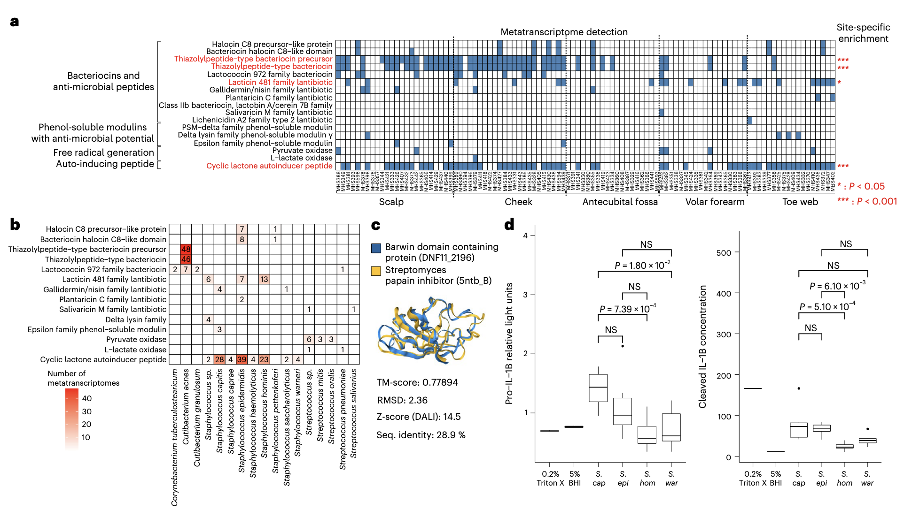

## Introduction

人体皮肤栖息着细菌、真菌、病毒等多种相互作用的微生物，它们对宿主微环境、免疫稳态及健康至关重要。过去，宏基因组测序推动了皮肤微生物组与疾病关联的研究，能识别关键微生物及遗传潜力差异，体外、离体验证也为宿主-微生物互作机制提供了线索。**但宏基因组学仅能估算DNA层面的功能潜力，无法反映活微生物在体内的基因实际表达与通路利用情况——活微生物基因表达受环境调控，存在显著差异。**

**宏转录组学通过检测mRNA反映基因表达，已用于肠道、海洋微生物组研究，却因皮肤微生物生物量低（每平方厘米仅10³-10⁴个原核生物，远低于肠道）、宿主及环境污染严重，在皮肤领域应用受限。** 此前仅有研究针对痤疮丙酸杆菌（单一物种）采用有创取样开展皮肤RNA测序，活检虽能获取更多微生物量却不适用于大规模研究。而皮肤微生物如金黄色葡萄球菌、痤疮丙酸杆菌的“无害定植”与“致病”双重属性，需结合基因表达差异解释（如金黄色葡萄球菌V8蛋白酶转录水平升高与特应性皮炎瘙痒相关），因此开发稳健、无创的皮肤宏转录组学工作流程成为关键。

近期，来自新加坡基因组研究所（Genome Institute of Singapore, ASTAR）和新加坡皮肤研究实验室（ASTAR Skin Research Labs）的研究团队在国际著名期刊《Nature Biotechnology》上发表题为“Skin metatranscriptomics reveals a landscape of variation in microbial activity and gene expression across the human body”的文章。该研究构建了一套适用于低生物量皮肤样本的宏转录组学技术流程，并结合宏基因组数据，对27名健康个体5个不同皮肤位点的微生物表达谱进行了系统分析。

1. Chia, M., Ng, A.H.Q., Ravikrishnan, A., Mohamed Naim, A.N., Wearne, S., Common, J., and Nagarajan, N. (2025). Skin metatranscriptomics reveals a landscape of variation in microbial activity and gene expression across the human body. Nat. Biotechnol., 1–12. https://doi.org/10.1038/s41587-025-02797-4.

可以学习参考一下其中的宏转录组分析流程，文章提供了非常详细的代码：<https://github.com/CSB5/skin_metatranscriptome>

## 研究方法
### 研究设计与样本采集
研究在新加坡基因组研究所开展，经机构伦理审查批准，招募27名21-65岁健康参与者（新加坡籍或永久居民，无皮肤疾病，采样前12小时不洗澡），采集头皮、脸颊、肘前窝、掌侧前臂、趾间5个部位样本，共获取135个宏基因组和135个宏转录组样本。采用FLOQSwabs拭子采样，将拭子内容物保存在DNA/RNA Shield中，分为RNA（约600μL）和DNA（约200μL）提取部分，同时设置未接触皮肤的拭子阴性对照。

### 核酸提取与文库制备
1. **RNA提取（宏转录组）**：采用Direct-zol RNA MicroPrep试剂盒，经bead beating裂解（6.0m/s，3分钟分3次）、DNase两次处理（含RNase抑制剂）及纯化，通过高灵敏度RNA ScreenTape验证质量后，用定制寡核苷酸混合液（含泛真菌、人/细菌rRNA探针）去除rRNA，再用NEBNext Ultra II试剂盒制备文库（随机引物逆转录，14个PCR循环富集），Illumina HiSeq X Ten测序（3500万条2×150bp读长对/文库）。
2. **DNA提取（宏基因组）**：因Direct-zol试剂盒DNA产量低，改用EZ1方法，提取前加入宏基因组模拟群落Spike-in，经bead beating裂解、蛋白酶K处理后，用EZ1 DNA组织试剂盒纯化，NEBNext Ultra II FS试剂盒制备文库（12个PCR循环），Illumina HiSeq X Ten测序（2500万条2×150bp读长对/文库）。

### 数据处理与分析

该研究的数据处理与分析基于标准化 Nextflow 流程框架（代码仓库：https://github.com/Chiamh/meta-omics-nf， 版本 1.0.0，commit 号 642435a），整合多工具链实现从原始测序数据到生物学结论的转化，核心流程分为数据预处理、分类学注释、功能注释、差异表达与互作分析四大模块。

#### 数据预处理与质量控制
1. 原始数据质控与接头修剪
采用 fastp（版本 0.22.0）对 Illumina HiSeq X Ten 产出的 2×150bp 双端读长进行预处理，参数设为默认值：自动检测并切除接头序列，基于滑动窗口（窗口大小 4，平均质量值 20）过滤低质量碱基，移除 N 含量＞10% 的读长，最终保留 Q30≥80% 的高质量读长对，确保后续分析的碱基准确性。
2. 人源序列与 rRNA 去除
宏基因组数据：使用 BWA-MEM（版本 0.7.10-r789）将高质量读长比对至人类参考基因组 hg38，通过 SAMtools（版本 1.13）以参数-f12 -F256提取未比对到 hg38 的读长（即微生物候选读长），排除宿主基因组污染。
宏转录组数据：先通过 STAR（版本 2.7.9a）比对 hg38 去除人源 RNA 读长，再使用 bbduk.sh（BBMap 版本 38.93）结合定制 rRNA k-mer 数据库（涵盖细菌、真菌、人 rRNA 序列）过滤微生物 rRNA 读长，最后用 clumpify.sh（BBMap 版本 38.93）以参数dedupe = t和optical = f去除 PCR 重复读长，避免扩增偏差对表达定量的影响。
3. 样本筛选标准
保留至少含 10,000 个高质量配对读长的样本，进一步移除仍被 Kraken 2 分类为 “智人” 的残留读长，最终仅保留分类为细菌（分类 ID 2）、古菌（分类 ID 2157）、病毒（分类 ID 10239）、真菌（分类 ID 4751）的微生物读长用于后续分析。
#### 物种分类注释
1. 数据库构建
定制 Kraken 2 数据库（总大小 50Gbp），核心序列来源包括：NCBI RefSeq 数据库的细菌、古菌、病毒、真菌基因组及质粒序列，人类基因组 hg38，以及额外补充的马拉色菌属组装序列（从 NCBI 下载，详见补充数据 11），确保对皮肤优势真菌（如限制马拉色菌、球形马拉色菌）的分类准确性。
2. 分类注释流程
采用 Kraken 2（版本 2.1.2）对宏基因组和宏转录组读长进行分类，参数设为--use-names --paired --report-minimizer-data以保留物种名称、双端读长关联信息及最小化子数据；再通过 Bracken（版本 2.6.1）基于 Kraken 2 输出结果校正物种丰度，减少低丰度物种的分类误差，最终输出各样本的物种水平相对丰度矩阵。

#### 功能分类注释
1. 参考数据库与工具链
以皮肤特异性微生物基因目录 iHSMGC（含约 1090 万个非冗余基因）为核心参考，结合 UniRef90 数据库（2021 年 6 月 9 日版本）实现功能注释，具体流程如下：
比对 iHSMGC：用 Bowtie 2（版本 2.4.4）以--very-sensitive模式将读长单端比对至 iHSMGC，筛选覆盖度≥50% 的比对结果，获取已知皮肤微生物基因的功能关联。
未比对读长补注释：对未匹配到 iHSMGC 的读长，使用 DIAMOND（版本 2.0.12）以blastx --id 80 --query-cover 90 --max-target-seqs 1参数比对至 UniRef90，仅保留序列一致性≥80%、查询读长覆盖度≥90% 且目标序列覆盖度≥50% 的结果，确保注释可信度。
2. 直系同源群分组
采用 eggNOG mapper（版本 2.1.6）结合 eggNOG 5.0 数据库（参数-m diamond --go_evidence all），将比对到的 iHSMGC 基因和 UniRef90 聚类序列注释为直系同源群（COG/NOG），并关联 GO 术语与 KEGG 通路信息；在 R 环境中使用 “vegan” 包（版本 2.6-6.1）的rarecurve函数对细菌和真菌直系同源群进行稀释曲线分析，验证测序深度是否足以覆盖功能多样性（通常需≥100 万读长对）。

#### 差异表达与互作分析
1. 微生物基因差异表达分析
跨部位差异分析：以细菌和真菌直系同源群的原始计数为输入，分别采用两种工具控制混杂因素：
MaAsLin2（版本 1.18.0）：使用广义线性混合模型，输入经 aldex2（版本 1.28.1）计算的中心对数比转换计数（1000 个蒙特卡洛实例均值），固定效应设为 “皮肤部位 + 实验类型（RNA/DNA）+ 部位：实验类型”，随机效应为 “参与者 ID”，通过交互项系数量化不同部位的基因表达 log₂倍变化，校正个体内依赖性与基因组拷贝数变异。
DESeq2（版本 1.36.0）：输入原始计数，设计公式为~ subject ID + skin site + assay + skin site:assay，仅保留 DNA 和 RNA 中位数读长计数均≥10 的特征，用poscounts函数分别估计宏基因组 / 宏转录组的大小因子，确保定量准确性。
物种特异性分析：对宏转录组读长≥200,000 的物种，设计公式~ subject + skin site分析体内跨部位差异；比较表皮葡萄球菌体内与体外（对数期、稳定期、渗透压胁迫）表达时，用 limma（版本 3.60.4）的removeBatchEffect函数校正实验批次效应，再通过 PCA 可视化组间差异。
2. 代谢通量与互作分析
代谢通量模拟：结合宏转录组表达数据与基因组规模代谢模型，采用通量平衡分析（FBA）计算表皮葡萄球菌、痤疮丙酸杆菌在不同条件下的代谢反应通量，通过 PERMANOVA（Adonis 函数）检验组间通量差异（如表皮葡萄球菌体内丙酸生成通量高于体外，P<0.001）。
宿主 - 微生物互作：通过基因集变异分析（GSVA）量化样本中人类免疫通路（如 IL-6/JAK/STAT3、Toll 样受体通路）的活性，使用 Spearman 相关性分析关联通路活性与微生物丰度；对微生物 - 微生物互作，将分泌蛋白转录丰度与其他物种 DNA 丰度关联，筛选 FDR<0.1 的显著关联（如限制马拉色菌 DNF11_2196 与痤疮丙酸杆菌丰度负相关，ρ<-0.7）。

## 主要结果
### 稳健的皮肤宏转录组学工作流程建立

优化后的实验流程表现出高稳健性：试点队列（70个样本）文库成功率90%，84%样本达220万微生物读长/样本；rRNA去除后非rRNA读长富集2.5-40倍，物种（索伦森相似性≥0.98）和基因水平（皮尔逊相关系数≥0.99）可重复性高，纵向分析显示个体内基因水平稳定性（中位皮尔逊相关系数≥0.897）显著高于个体间差异（Wilcoxon P<10⁻¹⁰）。

计算流程通过阴性对照过滤污染类群，基于独特基因组匹配比例识别假阳性，功能注释率（81%）显著高于通用流程HUMAnN3（60%，Wilcoxon P<3.1×10⁻⁵）。全队列102对合格文库中，宏转录组非人类读长占比98%（宏基因组仅10%，P<0.05），微生物rRNA残留率2-25%（远低于细胞内80-90%），细菌、真菌基因覆盖均匀，马拉色菌读长80%以上位于编码区，与体外培养RNA-seq数据质量相当。

### 宏转录组与宏基因组揭示的物种活性差异

皮肤宏转录组中“活跃物种”与宏基因组“高丰度物种”存在显著错位：痤疮丙酸杆菌在宏基因组中占主导（除趾间外，中位相对丰度46-90%），但宏转录组贡献仅2-31%；而限制马拉色菌、球形马拉色菌（宏基因组丰度3-8%、0.1-12%）在宏转录组中占比显著（脸颊/头皮23-30%、头皮/肘前窝21-81%），其高活性可能源于真核生物较大的细胞体积。趾间是例外，宏基因组与宏转录组均以人葡萄球菌、表皮葡萄球菌为主。

按物种在样本中的存在比例，将其分为“核心”（>75%样本）、“常见”（50-75%）、“可变”（<50%）类群：宏基因组核心物种较多（如痤疮丙酸杆菌、头葡萄球菌），宏转录组核心物种少（仅痤疮丙酸杆菌、两种马拉色菌），葡萄球菌表现出部位特异性活性（如表皮葡萄球菌在脸颊、人葡萄球菌在掌侧前臂）。同一物种在不同微环境活性差异显著，如痤疮丙酸杆菌在皮脂腺部位（头皮/脸颊）转录活性高于非皮脂腺部位，限制马拉色菌对脂质可用性更敏感。

### 生态位特异性功能与代谢适应

差异表达分析显示，微生物功能随皮肤微环境调整：掌侧前臂细菌上调葡萄糖分解代谢基因（适应干燥、低资源环境），脸颊马拉色菌上调有丝分裂生长基因（利用高脂质）；趾间微生物上调氨基酸代谢、血红素生物合成基因（汗液富含氨基酸，血红素助葡萄球菌定植），且掌侧前臂微生物抗氧化基因表达更高（暴露环境需抗损伤）。

核心生化途径的物种贡献存在差异：除趾间外，马拉色菌主导56%核心途径（高于细菌，P<0.05）；潮湿环境（肘前窝/趾间）葡萄球菌贡献超痤疮杆菌。多数途径个体内由少数物种表达、个体间由多物种驱动（功能可塑性高），如葡萄球菌铁载体A合成由1-2种葡萄球菌在个体内完成，个体间则由多物种驱动；极长链脂肪酸β-氧化仅由马拉色菌完成，半乳糖降解则由细菌、真菌共同参与。

### 关键抗菌功能与微生物互作

皮肤微生物在体内表达多种抗菌物质：AIPs（葡萄球菌群体感应）、乳酸球菌素481（人葡萄球菌/表皮葡萄球菌，抗革兰氏阳性菌）、硫肽（痤疮丙酸杆菌，含未表征的MET_02967399），且分布具部位特异性（如皮脂腺部位富集环状内酯AIPs）。意外发现趾间葡萄球菌表达盐菌素家族假定细菌素（此前仅在嗜盐微生物中发现）。

宿主-微生物互作方面，头葡萄球菌丰度与脸颊IL-6/JAK/STAT3、Toll样受体通路正相关（参与Th17免疫反应），且其菌株上清液可显著提高人角质形成细胞的pro-IL-1B、切割IL-1B水平（P<0.05）。微生物-微生物互作中，限制马拉色菌DNF11_2196蛋白转录丰度与头皮痤疮丙酸杆菌丰度强负相关（Spearmanρ<-0.7），该蛋白结构与链霉菌木瓜蛋白酶抑制剂相似（可能通过抑制细菌蛋白酶发挥作用）；脸颊痤疮丙酸杆菌三酰甘油脂肪酶表达与颗粒痤疮杆菌丰度正相关（提示共生）。

## 讨论总结

研究团队开发了一套稳健的皮肤宏转录组学工作流程，通过优化采样、提取、rRNA去除、污染过滤及功能分类，解决了皮肤微生物生物量低的难题。该流程与宏基因组学联合应用，可实现转录活性标准化并捕捉菌株差异，且基于拭子的无创采样适用于多部位与大规模临床研究，不过在低生物量部位（如肘前窝）仍需优化以减少核酸损失。

计算流程虽提供了重要功能见解，但需进一步与HuMAnN3等工具 benchmarking。当前流程在宿主读长去除、读长去重及样本类型适配（如活检样本）上存在改进空间，且皮肤特异性基因目录虽提升注释率，却可能限制对非皮肤特有微生物功能的检测。

研究核心发现是皮肤宏转录组与宏基因组在微生物活性解读上存在显著差异：皮肤核心微生物通路多由少数物种表达（低α多样性），与肠道宏转录组不同，反映皮肤微生物活性物种占比低；马拉色菌与葡萄球菌因细胞体积或代谢灵活性，在宏转录组中贡献远超其宏基因组占比。此外，结合宏转录组数据的通量平衡分析（FBA），揭示了微生物在体内的独特代谢需求（如表皮葡萄球菌依赖戊糖磷酸途径生成丙酮酸），且发现表皮葡萄球菌或为体内丙酸（调节皮肤免疫）的另一来源。同时，研究还证实皮肤微生物组是未表征抗菌物质的丰富来源，并通过关联分析挖掘出潜在的微生物-微生物、宿主-微生物互作基因（如限制马拉色菌DNF11_2196）。

该研究建立了系统的皮肤宏转录组学采样与分析流程，证实其可捕捉微生物在体内的活性特征（区别于DNA丰度），并识别塑造微生物群落与宿主反应的互作关系。研究生成的健康人群皮肤微生物活性数据，可作为基线，为未来与疾病样本对比、挖掘诊断和治疗靶点提供重要参考。
