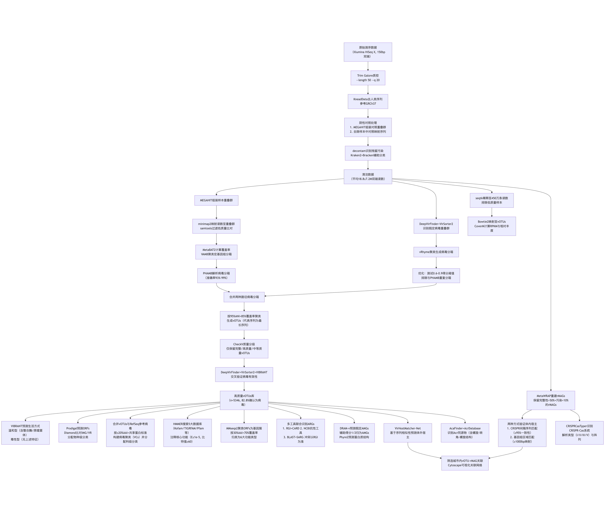
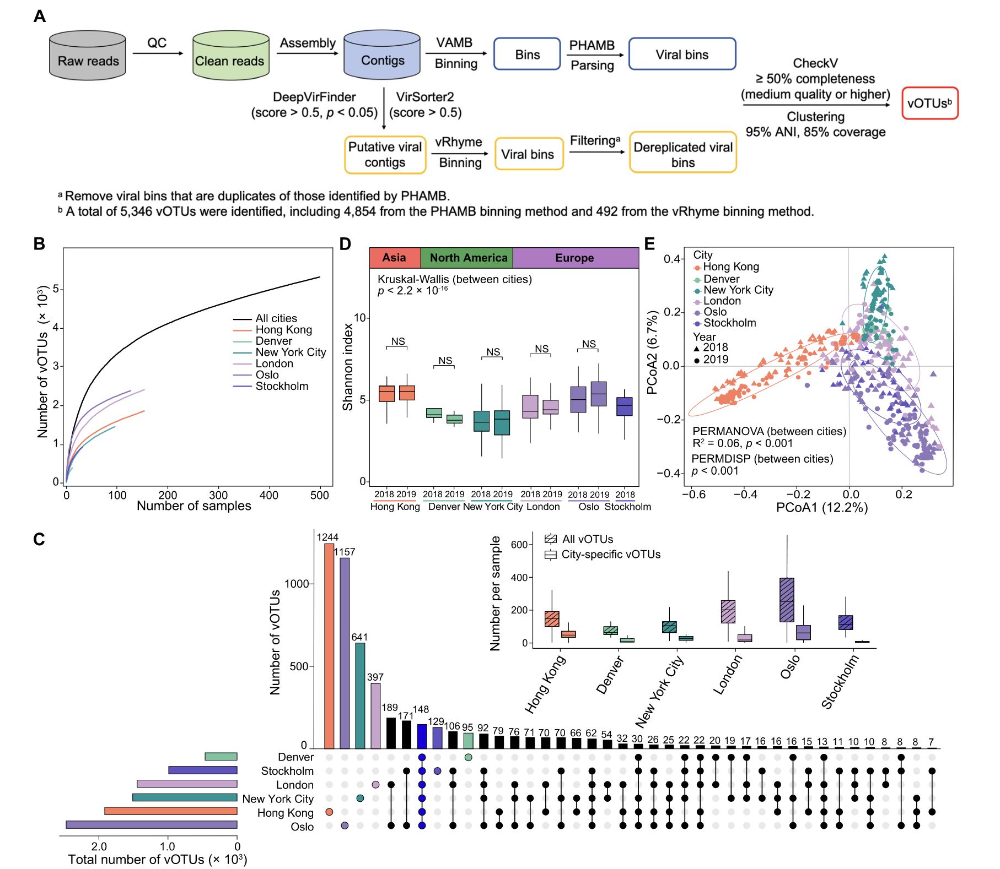
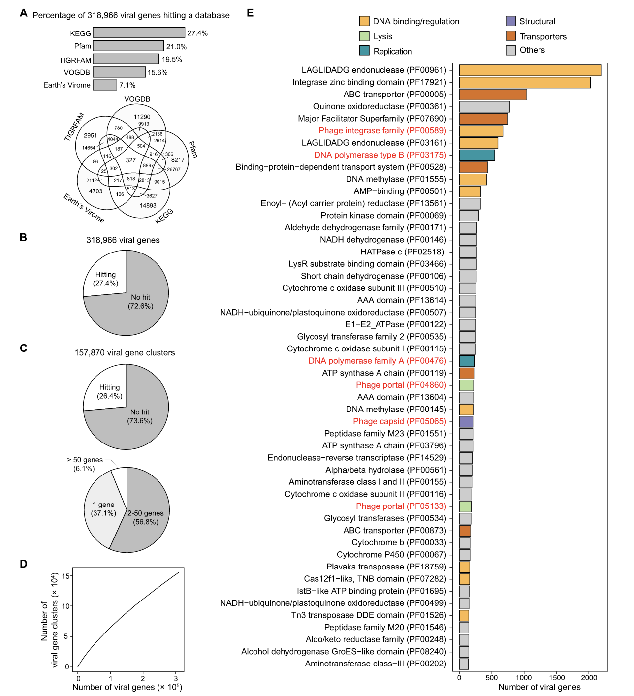
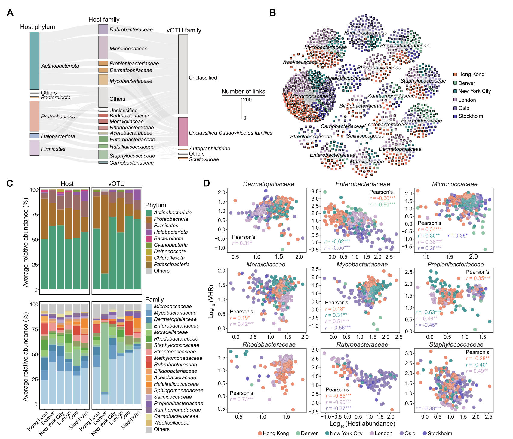
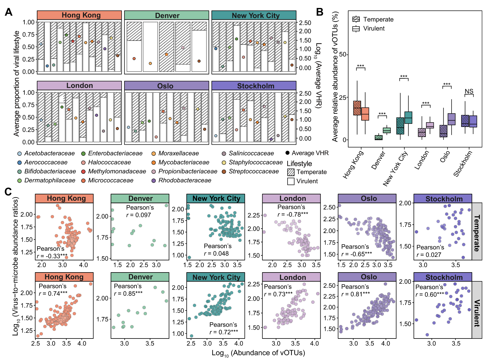
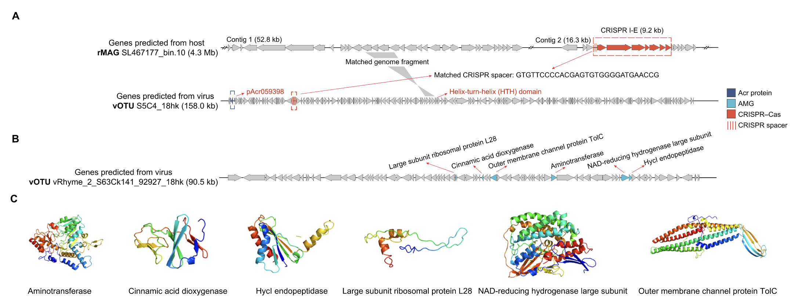

## Introduction

题为“Global biogeography of airborne viruses in public transit systems and their host interactions”的文章近期在《Microbiome》上发表。该研究分析了全球六个城市公共交通系统空气样本的503个宏基因组，旨在明确空气传播病毒的多样性、组成及功能潜力，探究病毒与宿主的相互作用。

1. Lei, H., Du, S., Tong, X., Chan, W.L., Leung, M.H.Y., Bøifot, K.O., Bezdan, D., Butler, D.J., Danko, D.C., Green, D.C., et al. (2025). Global biogeography of airborne viruses in public transit systems and their host interactions. Microbiome 13, 193. https://doi.org/10.1186/s40168-025-02173-z.

**可以学习参考一下其中从宏基因组数据分析病毒的详细流程。**

建筑环境（BEs）空气中虽营养匮乏且受物理、环境条件波动影响，但仍存在大量细菌、真菌和病毒。数据显示，空气传播细菌与真菌平均浓度约为1×10⁵个/立方米，病毒浓度与之相近。不过，目前对细菌和真菌的组成及代谢功能研究较多，对空气传播病毒的认知却十分有限。

过往研究发现，不同室内空间有独特的空气传播病毒群落，人乳头瘤病毒和多瘤病毒较常见；机械通风场所中，病毒还呈现季节性动态变化，说明通风率、室外天气等季节相关因素会影响病毒组成。病毒能依环境调整生活方式，导致自身及宿主丰度波动，尤其毒性噬菌体引发宿主细胞裂解时更为明显。“Kill-the-Winner”（杀死获胜者）和“Piggyback-the-Winner”（搭便车获胜者）等生态模型，可描述病毒与宿主丰度的平衡关系，助力理解病毒捕食策略及相互作用的复杂性。同时，病毒进化出携带辅助代谢基因（AMGs）的能力，噬菌体编码的AMGs能增强或改变宿主代谢以提升自身适应性；而微生物宿主为抵御病毒，进化出CRISPR-Cas系统，病毒则进一步进化出抗CRISPR（Acr）蛋白应对。

在富营养环境中，噬菌体AMGs可调控宿主代谢途径，CRISPR-Cas系统与Acr蛋白也会协同进化。例如，污水处理系统中可见微生物宿主表达噬菌体AMGs，暗示其在污染物去除中起作用；人体肠道内，病毒通过间隔序列与微生物宿主关联，符合“红皇后假说”的协同进化过程。

尽管低营养环境（如海洋、沙漠）中病毒的宿主捕食策略及协同进化已有研究，但建筑环境这类存在持续气流的场景，相关研究仍空白。因此，该研究分析全球六个城市（丹佛、香港、伦敦、纽约、奥斯陆、斯德哥尔摩）公共交通系统空气样本的503个宏基因组，旨在明确空气传播病毒的多样性、组成及功能潜力，探究病毒与宿主的CRISPR-Cas系统和Acr蛋白协同进化，以及病毒生活方式与宿主丰度的关系，并假设病毒生物学特征具有生物地理分布模式，且病毒-宿主相互作用受建筑环境条件影响。

## 研究方法
### 样本采集、基因组DNA提取与宏基因组测序
2018-2019年6-7月，研究人员从六个城市公共交通系统采集503份空气样本。其中丹佛13份来自铁路和公交系统，其余城市样本均来自地铁（香港159份、伦敦76份、纽约96份、奥斯陆127份、斯德哥尔摩32份）。采样在工作日进行，地点建筑特征各异。

采样使用配备驻极体微纤维过滤器的SASS 3100干空气采样器，流量300升/分钟，时间30分钟。采样器置于1.5米高三脚架上，呈45°角朝下倾斜，样本采集后储存于-80°C。同时制备两种阴性对照：现场对照（放置新过滤器但不运行采样器）和实验室对照（对新过滤器提取DNA）。

样本经干冰运输至挪威国防研究机构提取DNA：先将过滤器颗粒物提取到NucliSENS裂解缓冲液，离心分离上清液与沉淀物；沉淀物经酶解和机械裂解释放DNA，用DNeasy PowerSoil试剂盒去除抑制剂后与上清液混合；再用NucliSENS磁性提取试剂试剂盒提取DNA（调整磁性硅悬浮液体积至90μL，孵育20分钟）。

同步处理14个阴性对照和3个阳性对照（ZymoBIOMICS微生物群落标准品），用Qubit 3.0荧光计确定DNA浓度，随后构建测序文库，在HudsonAlpha基因组中心用Illumina HiSeq X系统进行150 bp双端宏基因组测序。

### 病毒生信分析流程

#### 原始测序数据预处理与质量控制
- **原始读数过滤**：使用 `Trim Galore（v0.6.10）` 对 Illumina HiSeq X 产出的 150 bp 双端原始测序数据进行质控，参数设为 `--length 50 --q 20`，即保留长度≥50 bp、质量值≥20 的序列，剔除短片段和低质量片段。
- **人类序列去除**：通过 `KneadData（v0.7.4）` 工具，以 `Genome Reference Consortium Human Build 37` 人类基因组为参考数据库，过滤样本中混杂的人类基因组序列（采用默认参数），避免人类序列对微生物分析的干扰。
- **阴性对照污染剔除**：
  1. 用 `MEGAHIT（v1.1.3）`先组装“现场对照（未运行采样器的新过滤器）”和“实验室对照（仅提取新过滤器DNA）”的序列，得到阴性对照重叠群；
  2. 将样本序列与阴性对照重叠群比对，去除可映射到对照重叠群的污染序列；
- **残留污染识别**：
  1. 用 `Kraken2（v2.1.3）` 对剩余序列进行物种分类注释，`Bracken（v2.8）` 校正分类计数；
  2. 借助 R 包 `decontam（v1.12）` 的“流行度模式”，以 0.1 为概率阈值，识别并通过 Python 脚本 `extract_kraken_reads.py` 去除潜在交叉污染序列；
- **最终清洁数据**：经上述步骤后，每个样本平均获得 **18.8±7.2 百万条双端清洁读数**，用于后续组装。

#### 双路径病毒分箱
- **路径1：宏基因组分箱+病毒解析**
  1. 序列映射与覆盖率计算：用 `minimap2（v2.24）` 将清洁读数比对到样本重叠群（前序步骤中用 `MEGAHIT` 组装），通过 `samtools（v1.6）` 过滤低质量比对结果；
  2. 宏基因组分箱：用 `MetaBAT2（v2.12.1）` 的 `jgi_summarize_bam_contig_depths` 模块计算重叠群覆盖率，再用 `VAMB（v4.1.3）`（默认参数）将重叠群聚类为宏基因组分箱；
  3. 病毒分箱提取：通过 `PHAMB（v1.0.1）` 推荐工作流程，从宏基因组分箱中解析出仅含病毒序列的“病毒分箱”（PHAMB 排除非噬菌体分箱的准确率达 93%-99%，远高于其他工具）。

- **路径2：病毒序列识别+分箱优化**
  1. 假定病毒重叠群识别：用 `DeepVirFinder（v1.0）`（得分>0.5 且 p 值<0.05）和 `VirSorter2（v2.2.4）`（得分>0.5）分别识别样本重叠群中的假定病毒序列；
  2. 病毒分箱生成：用 `vRhyme（v1.1.0）` 对上述假定病毒重叠群进行聚类，生成病毒分箱；
  3. 分箱质量优化：由于 `DeepVirFinder`（准确率 69%-74%）和 `VirSorter2`（准确率 30%-84%）的假阳性率较高，测试 0.6-0.9 共 4 个更高得分阈值，最终保留“不含路径1中 PHAMB 分箱重叠群”的病毒分箱，避免重复。

#### 病毒操作分类单元（vOTUs）构建与质量筛选
- **vOTUs 聚类**：按 **95% 平均核苷酸一致性（ANI）** 和 **85% 比对覆盖率** 标准，对两种路径获得的所有病毒分箱进行聚类，每个聚类中最长的序列作为该 vOTU 的代表序列；
- **质量分级与筛选**：用 `CheckV（v1.0.1）`（默认参数）将 vOTUs 分为“完整”“高质量（完整性>90%）”“中等质量（完整性 50%-90%）”“低质量”“未分类”5 级，仅保留前 3 级 vOTUs（共 5346 个）；
- **有效性验证**：用 `DeepVirFinder`、`VirSorter2`、`VIBRANT（v1.2.0）` 三种工具交叉验证，确认 82.8% 的 vOTUs 为真实病毒序列。

#### 病毒生活方式预测
通过 `VIBRANT（v1.2.0）` 的 `virome` 标记功能判断 vOTUs 生活方式：
- 若 vOTU 含“整合酶类注释”或被识别为“原噬菌体”，则归类为 **温和型病毒**；
- 无上述特征且被 VIBRANT 确认为病毒的，归类为 **毒性型病毒**；
- 未被 VIBRANT 识别为病毒的，标记为“生活方式未知”。

#### 病毒分类学注释
- **物种级分类**：用 `Prodigal（v2.6.3）`（参数 `--p meta`）预测 vOTUs 的开放阅读框（ORFs），通过 `Diamond（v2.6.1）`（参数：`--evalue 1e-5 --max-target-seqs 10000 --query-cover 50 --subject-cover 50`）在 `IMG/VR 数据库（v4.1）` 中搜索同源蛋白，若某 vOTU 中≥20% 蛋白质匹配同一物种，则分配该物种分类；
- **科级分类（病毒聚类 VCs 构建）**：
  1. 合并“所有中等质量及以上 vOTUs”与“NCBI RefSeq 参考病毒基因组（2023 年 5 月，n=16398）”；
  2. 按 **≥20% 平均氨基酸一致性（AAI）且共享≥8 个病毒蛋白质/≥20% 病毒蛋白质** 标准聚类，得到病毒聚类（VCs）；
  3. 若某 VC 中≥20% 参考病毒属于同一科，则为该 VC 分配科级分类；无参考病毒的 VC 标记为“新病毒科”。

#### 病毒丰度计算
- **数据标准化**：用 `seqtk（v1.4）`（参数 `--s 100`）将每个样本的清洁读数稀释至 450 万条（匹配读数最少样本的量），排除 5 个稀释后数据不足的样本；
- **映射与丰度计算**：用 `Bowtie2（v2.5.1）`（`very-sensitive` 模式）将稀释后读数比对到 vOTUs，`CoverM（v0.6.1）`（参数 `--min-read-percent-identity 95`）过滤低一致性比对，再通过 `CoverM` 的 `contig` 模式（参数 `--min-covered-fraction 0.7`）计算每个 vOTU 的 **每千碱基百万映射读数（RPKM）**；
- **相对丰度标准化**：某 vOTU 的相对丰度 = 该 vOTU 的 RPKM / 样本中所有 vOTUs 的 RPKM 总和；某 VC 的相对丰度 = 其包含所有 vOTUs 的相对丰度之和。

#### 病毒功能注释
- **核心功能注释**：用 `HMMER` 软件包的 `hmmsearch` 工具（默认参数），在 `Kofam`、`TIGRFAM`、`Pfam`、`VOGDB`、`地球病毒组数据库` 5 个数据库中搜索 vOTUs 的 ORFs，按 **E 值≤10⁻⁵且比特值≥60** 保留最优匹配，未匹配 ORFs 归为“功能未知”；
- **基因簇聚类**：用 `MMseqs2（v14.7e284）` 按 **30% AAI 和 70% 比对覆盖率** 将 ORFs 聚类为基因簇，基于 `Pfam` 注释将功能分为 DNA 结合/调控、裂解、复制、结构、转运蛋白、其他 6 类；
- **抗生素抗性基因（ARGs）识别**：
  1. 用 `RGI（v5.1.0）`（参数 `--low_quality`）搜索 `CARD 数据库（v3.2.7）`，`NCBI 抗菌药物抗性查找工具（v3.11.14）` 搜索 `NCBI 抗菌药物抗性数据库（v3.11）`，`BLAST-蛋白质`（一致性 80%、覆盖率 70%）搜索 `SARG 数据库（v3.0）`；
  2. 保留 3 个数据库中的独特 ARGs，若亚型注释冲突，以 RGI 结果为准；某 ARG 亚型的相对丰度 = 该城市所有样本中该亚型包含 ARGs 的相对丰度之和；
- **辅助代谢基因（AMGs）预测**：用 `DRAM（v1.4.5）` 的 `DRAM-v` 功能（推荐工作流程）检测假定 AMGs，辅助得分 1 或 2 的基因归为 AMGs，用 `Phyre2（v2.0）`（正常建模模式）预测 AMGs 的蛋白质结构（置信度 82%-100%）。

#### 病毒-宿主关联预测
- **体外宿主预测**：用 `VirHostMatcher-Net`（含 62493 个原核基因组的默认数据集），基于病毒与宿主基因组的序列相似性预测体外潜在宿主；
- **体内宿主验证**：
  1. CRISPR 间隔序列匹配：从样本宏基因组组装基因组（rMAGs，完整性>50%、污染<10%）中提取 CRISPR 间隔序列，用 `BLAST-短核苷酸`（E 值≤10⁻⁵、字长 18、一致性≥95%、错配≤1）比对到 vOTUs，建立“间隔序列来源 rMAG-病毒”关联；
  2. 基因组区域匹配：用 `BLAST-核苷酸`（比特值≥50、E 值≤10⁻⁵、一致性≥96%）将 vOTUs 比对到 rMAGs，映射区域≥1000 bp 的病毒与对应 rMAG 关联；
- **关联筛选**：仅保留“某城市 vOTU 与该城市存在的 rMAG”的关联，用 `Cytoscape（v3.10.0）` 可视化城市级病毒-宿主关联网络。

#### CRISPR-Cas 系统与 Acr 蛋白分析
- **CRISPR-Cas 系统识别**：用 `CRISPRCasTyper（v1.8.0）`（默认参数）从 686 个 rMAGs 中识别 CRISPR-Cas 基因、阵列及亚型（共识别出 I、II、III、V 四种类型，I 型最常见）；
- **Acr 蛋白识别与分类**：
  1. 用 `AcaFinder` 和默认 `AcrDatabase` 从 vOTUs 中识别 Acr 同源物，若病毒重叠群含“螺旋-转角-螺旋结构域蛋白”，则确认为 Acr 蛋白；
  2. 用 `Diamond（v2.6.1）`（E 值≤10⁻⁵、比特值≥60）将 Acr 蛋白比对到 `AcrDatabase`，确定其亚型（主要为 II-C、I-B、I-C 亚型）；
  3. 用 `Mafft（v7.520）` 进行多序列比对，`FastTree（v2.1.11）`（JTT 模型）构建 Acr 蛋白与 339 个实验验证 Acr 参考序列的系统发育树。

#### 统计与可视化分析
- **多样性分析**：用 R 包 `vegan（v2.6.4）` 计算 α 多样性（香农指数、观测物种丰富度）和 β 多样性（布雷-柯蒂斯相异度），通过 `cmdscale` 函数对 β 多样性进行主坐标分析（PCoA），可视化病毒群落差异；
- **差异检验**：两组间差异用 **曼-惠特尼检验**，多组间差异用 **克鲁斯卡尔-沃利斯检验**；用 `vegan` 的 `adonis2` 函数（置换次数=999，方法=“bray”）进行置换多元方差分析（PERMANOVA），评估城市/年份对病毒组成的影响；用 `betadisper` 函数进行置换多元离散度分析（PERMDISP）；
- **相关性分析**：通过 R 包 `ggpubr（v0.6.0）` 的 `stat_cor` 函数计算 **皮尔逊相关系数** 和双侧 p 值，分析病毒丰度与宿主丰度、地理距离的相关性；
- **可视化工具**：除上述 `Cytoscape`、`PCoA` 外，用 R 包 `Rtsne（v0.17）` 可视化 VC 内 vOTUs 分布，用 `FastTree` 构建系统发育树，所有统计检验以 p<0.05 为显著标准。

## 研究结果
### 空气传播病毒的生物地理学特征

分析503个宏基因组，共获得5346个至少中等质量的vOTUs（含249个原噬菌体），其中3084个为高质量或完整vOTUs，82.8%经验证为病毒。这些vOTUs中，34.3%为毒性型，12.9%为温和型，52.8%生活方式未知。

各城市均有特异性vOTUs（数量7-81个），仅148个vOTUs在所有城市存在。不同城市样本α多样性差异显著（克鲁斯卡尔-沃利斯检验，p<2.2×10⁻¹⁶），香港和奥斯陆样本α多样性高于其他城市，北美城市样本病毒多样性低于其他大洲（曼-惠特尼检验，p<0.01）；β多样性分析显示病毒组成按城市和大洲聚类（PERMANOVA，p<0.001），且病毒群落相似性与地理距离多呈负相关（皮尔逊相关系数r<-0.13，p<0.001）。

### 病毒分类与功能特征

58.3%的vOTUs能与已知基因组匹配，95.9%仅能在纲水平分类（主要为有尾噬菌体纲、逆转录病毒纲、乳头多瘤病毒纲），各城市不同纲病毒相对丰度有差异。将vOTUs与参考病毒基因组聚类，得到697个病毒聚类（VCs），117个VCs可分类，最大且最丰富的VC1（含2430个vOTUs）隶属于花椰菜花叶病毒科，在各城市平均相对丰度46.2±26.4%；第二大VC2（含266个vOTUs）隶属于有尾噬菌体纲未分类科。部分VCs在不同城市相对丰度差异显著，如香港样本VC1丰度显著低于其他城市。

功能注释显示，72.6%的病毒基因无法匹配同源序列，常见功能与DNA结合/调控（如LAGLIDADG核酸内切酶）、转运蛋白（如ABC转运蛋白）相关，裂解、结构和复制功能也较普遍。同时，在159个vOTUs中发现326个独特ARGs，74%与高质量vOTUs相关，主要包括汞抗性基因、糖肽类抗生素抗性基因等，部分ARG亚型（如merP、merR）在香港样本中丰度最高，msrA亚型仅在纽约发现，arnA亚型仅在香港一个vOTU中检测到。

### 病毒-宿主相互作用与协同进化

约35.8%的vOTUs可关联到体外宿主（分枝杆菌科最常见），20.1%可关联到体内宿主（微球菌科最常见），且不同城市体内宿主存在差异。多数宿主科的宿主丰度与病毒-宿主丰度比（VHR）显著相关，如丹佛、香港等城市肠杆菌科宿主丰度与VHR呈负相关，除丹佛外其他城市微球菌科宿主丰度与VHR呈正相关。

除香港和斯德哥尔摩外，多数城市毒性型vOTUs丰度显著高于温和型（曼-惠特尼检验，p<0.001），且毒性型vOTUs丰度与病毒-微生物丰度比呈正相关（r=0.60-0.85，p<1.0×10⁻⁴），香港、伦敦和奥斯陆温和型vOTUs丰度与该比值呈负相关（r=-0.78至-0.33，p<3.2×10⁻⁵）。

在CRISPR-Acr相互作用方面，从155个rMAGs中提取1988个CRISPR间隔序列，仅52个可与vOTUs关联，53个rMAGs携带CRISPR-Cas系统（以I型为主），部分为城市特有。同时，在79个vOTUs中识别出155个Acr蛋白，可对抗多种CRISPR-Cas系统，且存在城市特异性Acr蛋白，仅8个Acr蛋白在所有城市存在。

此外，在511个vOTUs中识别出1247个假定AMGs，147个可与体内宿主关联，携带AMGs的vOTUs中53.3%为毒性型，31.9%为温和型。常见AMGs功能包括杂项功能、有机氮转化等，编码核糖核苷酸还原酶的AMGs丰度最高，部分AMGs为城市特有，且部分AMGs可能增强宿主适应性，如外膜通道蛋白TolC有助于去除有毒化合物。

## 讨论

该研究通过分析六个城市公共交通系统空气样本，揭示了建筑环境空气传播病毒的独特特征。研究发现病毒群落存在显著生物地理差异，北美城市病毒多样性较低，可能受气象、环境及交通系统设计影响；大量未分类vOTUs表明建筑环境空气中存在许多新病毒，花椰菜花叶病毒科占主导地位，与其他生态系统常见病毒不同，可能源于多样的微生物来源。

功能上，病毒基因展现出强大的感染、复制和整合能力，且发现多种ARGs，说明空气传播病毒可能是ARGs储存库，存在促进抗生素抗性传播的风险。病毒-宿主相互作用方面，微球菌科是最常见体内宿主，不同城市宿主存在差异，VHR受病毒生活方式影响，在营养匮乏的建筑环境中，毒性型感染是病毒主要生存策略，这与高营养生态系统不同。

CRISPR-Cas系统与Acr蛋白的协同进化有限，可能因毒性病毒占主导、病毒-宿主相遇概率低及数据库局限性导致。而病毒编码的AMGs可能增强宿主对建筑环境的适应性，助力病毒与宿主共存。

不过，研究存在方法学局限性，如病毒识别可能有假阳性/假阴性、样本量和测序深度有待提升、未富集病毒可能影响结果准确性等。未来需优化分析方法、扩大采样范围、开展培养实验，进一步探究病毒生物地理分布、生活方式切换机制及AMGs表达等，以更全面了解建筑环境空气传播病毒。

