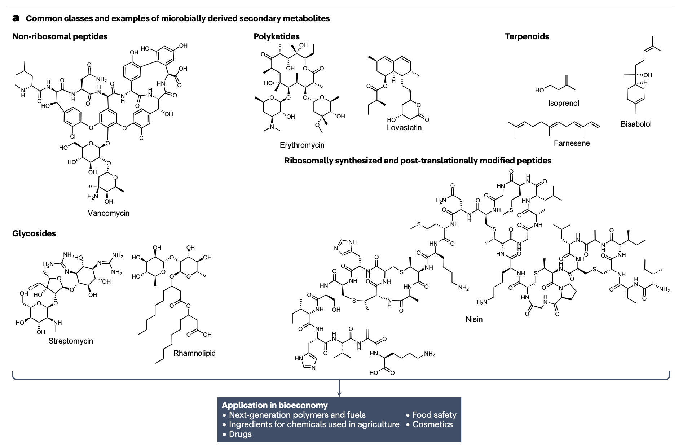
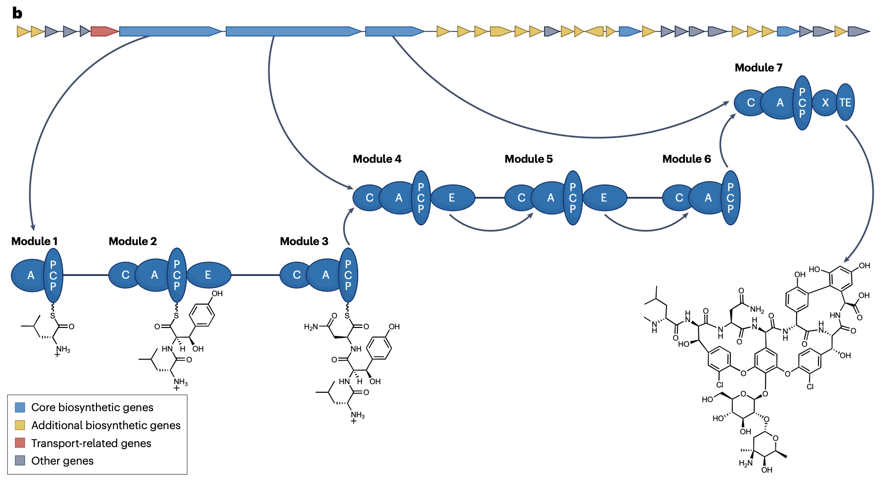
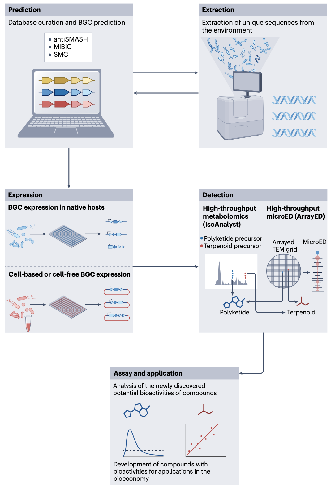
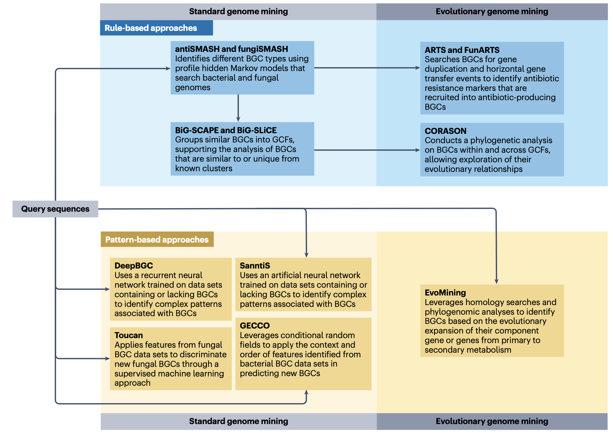
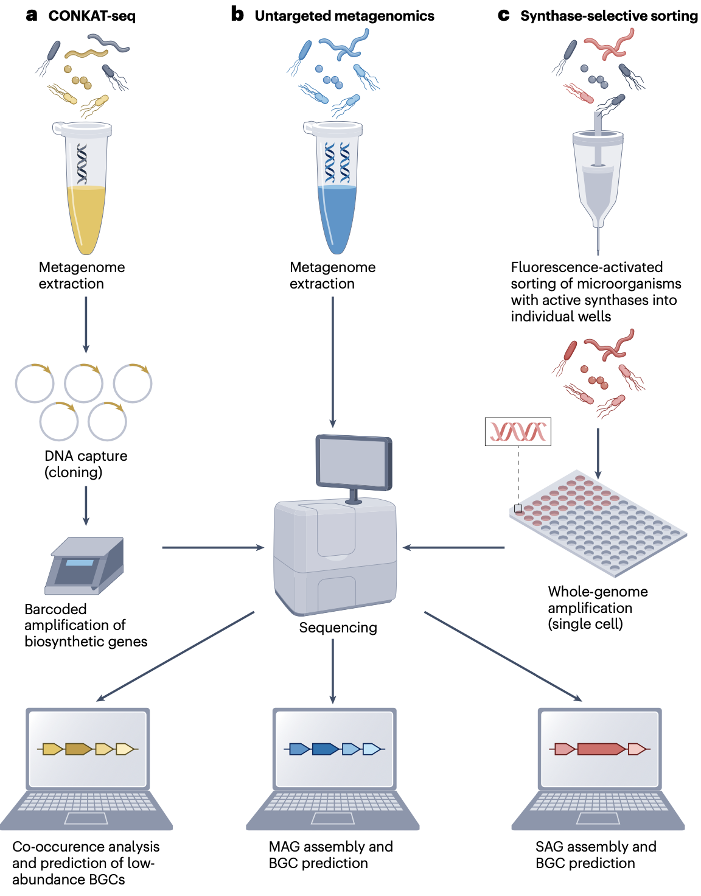
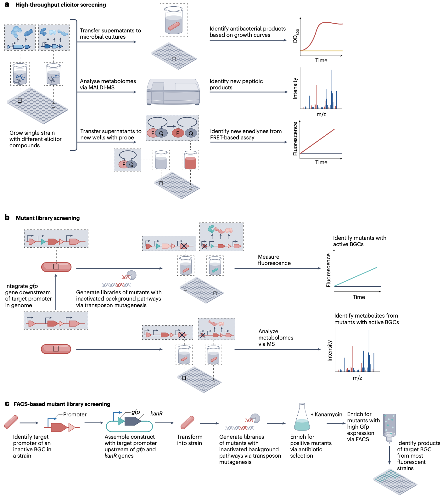

在Nature Reviews Microbiology期刊发表的题为“Microbial secondary metabolites: advancements to accelerate discovery towards application”的综述文章，系统阐述了微生物次生代谢产物研究领域的最新进展，为推动该领域从基础研究走向实际应用提供了全面且深入的参考。

Dinglasan, J.L.N., Otani, H., Doering, D.T. et al. Microbial secondary metabolites: advancements to accelerate discovery towards application. Nat Rev Microbiol 23, 338–354 (2025). https://doi.org/10.1038/s41579-024-01141-y

## 微生物次生代谢产物的核心价值
微生物次生代谢产物是微生物在生长稳定期合成的非必需代谢分子，其功能覆盖微生物竞争、防御、信号传递等多个维度，同时为人类社会提供了丰富的资源储备。

在**人类健康领域**，微生物次生代谢产物是临床药物的重要来源。自20世纪40年代青霉素问世以来，从微生物中分离的抗生素（如链霉素、万古霉素）、抗肿瘤药物（如阿霉素、博来霉素）、免疫抑制剂（如环孢素）等，已挽救数千万生命。据统计，1981-2019年间全球获批的新药中，约34%直接或间接来源于微生物次生代谢产物，其中抗生素类药物占比超过50%。

在**农业领域**，这类分子为绿色植保提供了新路径。苏云金杆菌产生的Bt毒蛋白、链霉菌合成的春雷霉素等，可特异性抑制病虫害且对环境友好，有效减少化学农药残留。2023年相关研究显示，基于微生物次生代谢产物的生物农药市场规模已占全球农药市场的15%，且年增长率保持在8%以上。

在**工业领域**，微生物次生代谢产物可作为生物燃料前体、食品添加剂及化妆品原料。例如，酵母菌合成的萜类化合物可用于生产生物柴油，乳酸菌产生的细菌素可替代化学防腐剂。然而，传统培养依赖型筛选方法仅能覆盖不到1%的可培养微生物，大量次生代谢产物的生物合成潜力被“沉默”。直到基因组测序技术兴起，研究人员发现微生物基因组中存在大量未表征的**生物合成基因簇（BGCs）** ——即负责合成次生代谢产物的基因集合，这一发现重新定义了该领域的研究边界，推动“基因组挖掘”成为主流研究策略。

## 新型生物合成基因簇（BGCs）预测工具的开发与应用
准确识别基因组中的BGCs是发现新次生代谢产物的前提。近年来，基于基因组学与生物信息学的预测工具不断升级，从“基于序列比对”的传统方法转向“整合进化与功能特征”的智能预测，显著提升了BGCs识别的效率与准确性。

### 预测工具的技术迭代
早期BGCs预测工具（如antiSMASH 1.0）主要依赖已知BGCs的保守结构域（如聚酮合酶PKS、非核糖体肽合成酶NRPS的催化结构域）进行序列比对，对新颖或进化距离较远的BGCs识别率较低。而新一代工具通过整合多维度数据，实现了性能突破：
- **整合进化分析**：工具如BiG-SCAPE与CORASON构建BGCs序列相似性网络，结合系统发育分析，可将 BGCs 归类为不同家族并推断其进化关系。例如，2020年发表的研究通过该框架，在1.2万个BGCs中发现了300多个新家族，其中部分家族与抗肿瘤活性相关。
- **引入机器学习**：Hannigan等人2019年开发的深度学习模型，通过训练10万余个已知BGCs序列，可自动提取隐藏的序列特征，对新型BGCs的预测准确率提升至89%，较传统方法提高23%。
- **拓展功能注释**：antiSMASH 7.0（2023年更新）新增转录因子结合位点预测、化学结构预测模块，可同时推断BGCs的调控机制与可能合成的代谢物结构，为后续实验验证提供方向。

### 数据库支撑与资源整合
BGCs预测的准确性高度依赖数据库的完整性。目前，全球已建立多个规模化BGCs数据库，为研究提供基础支撑：
- **MIBiG 4.0**：2024年更新的数据库包含1.5万个已验证功能的BGCs，涵盖抗生素、萜类、生物碱等12类代谢产物，提供基因序列、代谢物结构及生物活性等完整信息。
- **BiG-FAM**：收录超过10万个BGCs，按功能分为2800个家族，支持用户通过序列比对快速定位目标BGCs的同源家族。
- **IMG/M**：整合全球微生物组测序数据，包含从土壤、海洋、人体肠道等环境中挖掘的8.4万个未培养微生物的BGCs，其中84%未在NCBI等传统数据库中收录，为新颖BGCs挖掘提供了巨大资源。

### 预测工具的应用案例
在实际研究中，新型预测工具已展现出强大的发现能力。例如，2023年Klapper等人通过antiSMASH 7.0分析尼安德特人肠道微生物的古基因组，预测并验证了一个合成“古呋喃”的BGCs，该代谢产物具有抗菌活性，为研究古代微生物与人类的共生关系提供了新线索；2024年Ferrinho等人利用BiG-SCAPE，在蓝细菌基因组中发现了20个新的萜类合成BGCs，其中部分代谢产物可用于开发新型抗氧化剂。

## 未表征BGCs的分离技术
大量未表征的BGCs隐藏于未培养微生物或复杂环境样本中，如何高效分离这些BGCs是研究的关键挑战。近年来，基于宏基因组学与单细胞技术的分离方法不断创新，实现了从“不可培养”到“可获取”的突破。

### 宏基因组学驱动的BGCs分离
宏基因组学技术直接提取环境样本（如土壤、海洋沉积物、植物根际）中的总DNA，通过测序与组装获得微生物基因组片段（即宏基因组组装基因组MAGs），进而分离其中的BGCs。该方法无需培养微生物，可覆盖99%以上的环境微生物，显著拓展了BGCs的来源。
- **技术流程**：典型流程包括“样本DNA提取→宏基因组测序（短读长+长读长结合）→MAGs组装→BGCs预测与提取”。例如，2021年Van Goethem等人通过长读长宏基因组测序，从森林土壤样本中组装出120个MAGs，从中分离出45个新的PKS型BGCs，部分可合成新型大环内酯类化合物。
- **关键技术突破**：长读长测序技术（如PacBio SMRT、Oxford Nanopore）解决了传统短读长测序组装不完整的问题，可获得完整的BGCs序列。2022年Waschulin等人利用Nanopore测序分析南极土壤宏基因组，成功分离出一个包含27.9kb的β-内酰胺类BGCs，该基因簇来自未培养的放线菌，合成的代谢产物对耐甲氧西林金黄色葡萄球菌（MRSA）具有抑制活性。

### 单细胞技术介导的精准分离
对于低丰度或难以组装的BGCs，单细胞基因组学技术可实现“单个微生物细胞→基因组→BGCs”的精准分离，避免宏基因组组装中的序列丢失。
- **荧光激活细胞分选（FACS）**：通过标记BGCs的保守结构域（如用荧光探针标记PKS的酮合成酶结构域），分选含有目标BGCs的微生物细胞，再通过单细胞基因组扩增获得完整BGCs。2021年Kim等人利用该技术，从被囊动物共生微生物中分离出一个新的NRPS型BGCs，合成的肽类化合物具有抗寄生虫活性。
- ** synthase-selective分选**：Dzunkova等人2023年开发的改进方法，通过检测BGCs中关键合成酶的活性（如β-内酰胺合酶），分选具有活性的微生物细胞，再结合单细胞测序分离BGCs。该方法在裸鳃类软体动物共生菌中成功分离出一个新的β-内酰胺类BGCs，解决了传统方法中“有基因无活性”的问题。

### 环境适应性分离策略
不同环境中的微生物具有独特的代谢特征，针对性的分离策略可提高BGCs的新颖性：
- **极端环境样本**：从高温热泉、深海热泉、高盐湖泊等极端环境中分离的微生物，其BGCs常合成耐极端条件的代谢产物。例如，2022年从深海热泉微生物中分离的BGCs，可合成耐高温的蛋白酶抑制剂，有望应用于工业酶制剂领域。
- **共生环境样本**：植物根际、动物肠道等共生环境中的微生物，其BGCs多与宿主互作相关，可能合成具有特殊生物活性的分子。2024年研究发现，从玉米根际微生物中分离的BGCs，合成的次生代谢产物可促进植物吸收磷元素，为生物肥料开发提供新靶点。

## 沉默BGCs的激活策略
基因组测序发现的BGCs中，约80%在实验室培养条件下处于“沉默”状态（即不表达或低表达）。如何激活这些沉默BGCs，是挖掘新型次生代谢产物的核心环节。近年来，基于分子生物学与合成生物学的激活技术不断涌现，形成了“靶向调控”与“高通量筛选”结合的多元化策略。

### 靶向调控BGCs的表达开关
通过调控BGCs的转录或翻译过程，解除其沉默状态，是最直接的激活方式：
- **转录调控改造**：CRISPR-Cas9激活系统（CRISPRa）可靶向激活BGCs的启动子区域。2017年Zhang等人利用该技术，在链霉菌中激活了一个沉默的PKS型BGCs，成功合成了新型蒽环类化合物，具有抗肿瘤活性；2022年Ameruoso等人通过CRISPR干扰（CRISPRi）抑制BGCs的负调控基因，在链霉菌中激活了3个沉默BGCs，其中1个合成的代谢产物对真菌具有抑制活性。
- **染色体结构调控**：微生物染色体的三维结构会影响BGCs的表达。2023年Deng等人通过解析天蓝色链霉菌的染色体三维结构，发现某沉默BGCs位于染色质压缩区域，通过基因编辑松弛该区域结构，成功激活BGCs表达，合成了新型大环内酯类化合物。

### 环境与化学诱导激活
通过改变培养条件或添加外源信号分子，模拟微生物自然生存环境，可诱导沉默BGCs表达：
- **OSMAC策略**：即“一株菌多条件培养”，通过改变碳源、氮源、温度、pH等培养条件，激活不同BGCs。2019年Pan等人通过该策略，在一株放线菌中发现了5个新的BGCs，分别在高糖、低温、酸性条件下表达，合成的代谢产物涵盖抗生素、抗氧化剂等类型。
- **外源小分子诱导**：添加微生物间的信号分子（如群体感应分子、抗生素前体）可激活沉默BGCs。2017年Okada等人发现，向链霉菌培养体系中添加AHL类群体感应分子，可激活一个沉默的NRPS型BGCs，合成的肽类化合物具有抗细菌活性；2020年Zhang等人通过添加红霉素前体，诱导链霉菌激活了一个与红霉素合成相关的沉默BGCs，拓展了抗生素合成途径。

### 共培养激活与高通量筛选

微生物在自然环境中常通过种间互作调控代谢，共培养技术可模拟这种互作，激活沉默BGCs；结合高通量筛选，可快速筛选活性代谢产物：
- **种间共培养**：将目标微生物与其他微生物（如真菌、细菌）共培养，通过互作信号激活BGCs。2019年Hoshino等人将放线菌与含分枝菌酸的细菌共培养，激活了6个沉默BGCs，其中2个合成的代谢产物具有抗结核杆菌活性。
- **高通量激活筛选（HiTES）**：Moon等人2019年开发的技术，通过构建微生物突变体库（如转座子突变库），结合高通量质谱筛选，快速定位激活沉默BGCs的突变位点。该方法在放线菌中成功激活了12个沉默BGCs，其中3个合成的代谢产物具有新型化学结构。

## 代谢产物检测与鉴定技术
激活BGCs后，高效检测与鉴定其合成的代谢产物，是连接“基因”与“功能”的关键步骤。近年来，质谱技术、结构解析技术及代谢组学分析的革新，实现了从“微量检测”到“结构解析”的全流程优化。

### 质谱技术
质谱技术是代谢产物检测的核心工具，其灵敏度与分辨率的提升，可实现微量、复杂代谢产物的快速识别：
- **高分辨质谱（HRMS）**：傅里叶变换离子回旋共振质谱（FT-ICR-MS）、轨道阱质谱（Orbitrap-MS）可提供精确的分子质量（误差<1ppm），结合数据库匹配（如GNPS数据库），可快速确定代谢产物的分子式。2022年Petras等人通过Orbitrap-MS分析链霉菌培养物，在1μg样品中检测到5个新的萜类代谢产物，其中1个具有抗炎症活性。
- **串联质谱（MS/MS）**：通过碰撞诱导解离（CID）获得代谢产物的碎片离子谱，结合结构解析算法（如SIRIUS），可推断分子结构。2023年Han等人利用MS/MS技术，解析了一个沉默BGCs合成的烯二炔类化合物结构，该化合物具有强效抗肿瘤活性，且结构与已知烯二炔类药物差异显著。
- **成像质谱（IMS）**：可直接观察代谢产物在微生物细胞或菌落中的空间分布，为BGCs的表达定位提供依据。2024年研究通过基质辅助激光解吸电离成像质谱（MALDI-IMS），发现某放线菌的BGCs合成的代谢产物主要分布在孢子中，推测其功能与孢子防御相关。

### 微晶电子衍射（MicroED）
对于难以结晶或样品量极少的代谢产物，MicroED技术通过电子显微镜对微小晶体（尺寸<1μm）进行衍射分析，可在原子水平解析结构，弥补了传统X射线晶体衍射的不足：
- **技术优势**：MicroED所需样品量仅为X射线衍射的1/1000，且可解析非晶态或微量晶体。2021年Kim等人利用MicroED，从1μg的微生物培养物中解析了一个新型环肽的结构，该化合物由沉默BGCs合成，具有抗真菌活性。
- **高通量应用**：2024年Delgadillo等人开发的MicroED微阵列技术，可同时解析24个微量代谢产物的结构，效率较传统方法提升10倍。该技术在土壤微生物代谢产物筛选中，成功解析了8个新化合物的结构，其中3个具有抑制植物病原菌的活性。

### 稳定同位素标记
通过向培养体系中添加稳定同位素标记的前体（如13C-葡萄糖、15N-氨基酸），追踪标记原子在代谢产物中的分布，可直接证明代谢产物与目标BGCs的对应关系，避免“基因-代谢物”匹配错误：
- **应用案例**：2022年McCaughey等人向链霉菌培养体系中添加13C-丙二酸（PKS合成的前体），通过HRMS检测到标记的大环内酯类化合物，结合基因敲除实验，确认该化合物由目标BGCs合成。
- **技术延伸**：将稳定同位素标记与代谢组学结合，可同时验证多个BGCs的功能。2023年研究通过15N-赖氨酸标记，在一株真菌中验证了2个NRPS型BGCs的功能，分别合成了具有不同抗菌谱的肽类化合物。

## 研究展望

当前，微生物次生代谢产物研究正迎来复兴时期，各类研究工具的不断开发和完善，为推动生物经济发展注入了强大动力。未来，该领域的研究将朝着更广阔、更深入的方向发展。

在基础研究方面，随着基因组学、转录组学、代谢组学等多组学技术的进一步融合，研究人员将能够更全面地揭示微生物次生代谢产物的生物合成机制和调控网络。通过对不同微生物物种的基因组进行深入分析，挖掘更多新颖的 BGCs，探索其进化规律和功能多样性，有望发现更多具有独特生物化学结构和功能的次生代谢产物。同时，对生物合成酶的结构与功能研究将更加深入，通过蛋白质工程技术改造酶的活性、底物特异性和催化效率，为构建高效的次生代谢产物合成体系提供可能。

在应用研究方面，微生物次生代谢产物的应用领域将不断拓展。除了在医药和农业领域的传统应用外，其在能源、环境、食品、化妆品等领域的应用潜力也将逐步被挖掘。在能源领域，利用微生物次生代谢产物合成生物燃料，有望为解决能源危机提供新的途径；在环境领域，一些具有降解污染物功能的微生物次生代谢产物，可用于土壤修复、水质净化等环境治理工作；在食品领域，微生物次生代谢产物可作为食品添加剂、防腐剂等，提高食品的品质和安全性；在化妆品领域，具有抗氧化、保湿、美白等功效的微生物次生代谢产物，将成为天然化妆品原料开发的重要方向。

此外，随着合成生物学技术的快速发展，构建人工微生物细胞工厂，实现微生物次生代谢产物的高效异源合成将成为研究热点。通过对微生物代谢途径进行系统性设计和改造，优化发酵工艺，提高次生代谢产物的产量和纯度，降低生产成本，将推动更多微生物次生代谢产物实现产业化生产，为生物经济的发展提供坚实的物质基础。

然而，微生物次生代谢产物研究也面临着诸多挑战。例如，如何高效激活大量沉默的 BGCs，如何解决复杂次生代谢产物的结构解析难题，如何实现微生物次生代谢产物的规模化、低成本生产等。未来，需要科研人员不断创新研究方法和技术手段，加强多学科交叉合作，共同攻克这些难题，推动微生物次生代谢产物研究持续向前发展，为人类社会的可持续发展做出更大贡献。