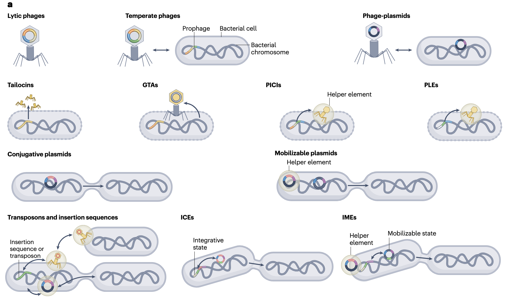
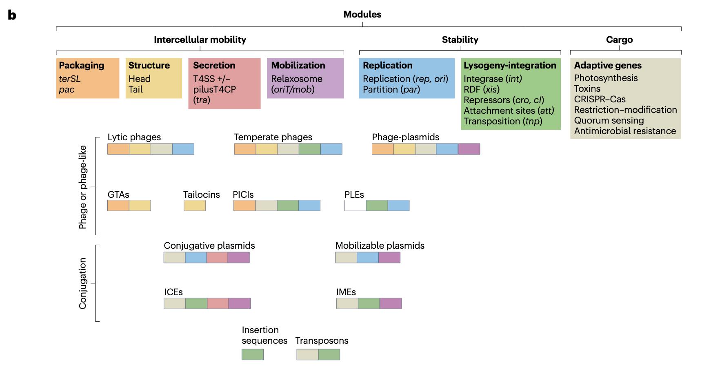
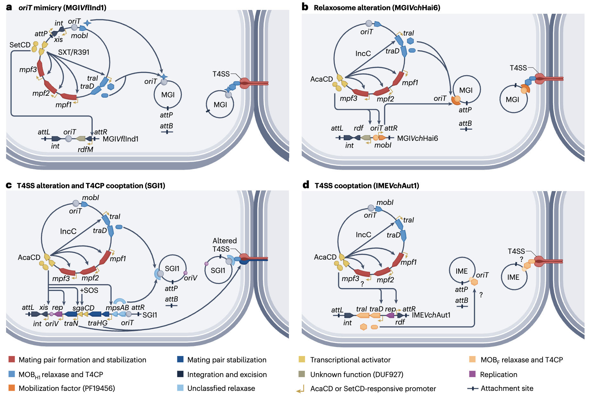
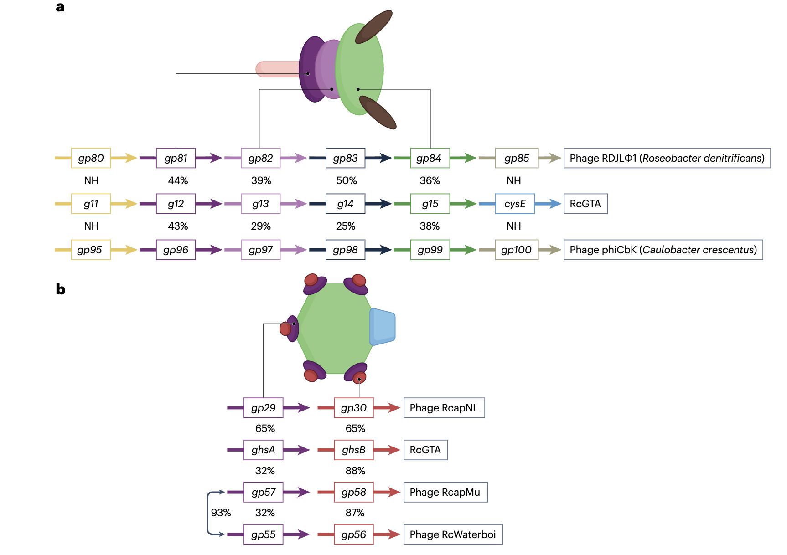
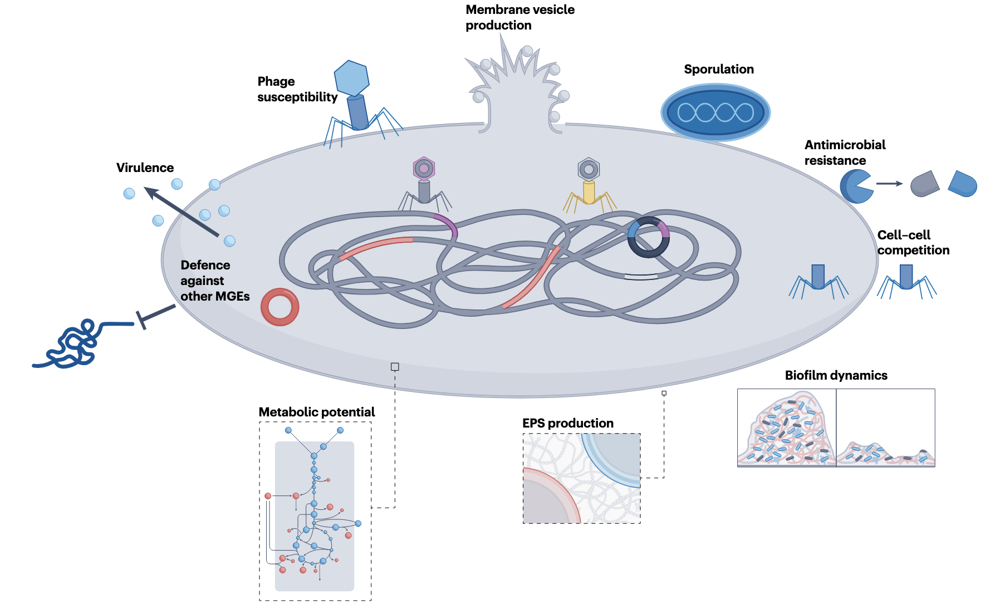

移动遗传元件（Mobile Genetic Elements, MGEs）对包括细菌在内的生物体的生态学与进化过程具有深远影响。过去二十年间，大量新型MGEs被发现，且这些元件目前在不同细菌谱系中呈现普遍存在的特征。随着新型MGEs类别的快速涌现，一系列新的缩写术语随之产生，给相关研究的理解与交流带来挑战。更重要的是，现有研究已明确MGEs之间存在复杂的进化关联与分子互作，这些元件并非独立发挥作用的离散遗传实体。不同类型的MGEs会共享并交换基因片段，同一细胞内共存的MGEs还会以协同或拮抗的方式相互作用，而这些过程均会对宿主生物最终呈现的表型产生显著影响。

Lang, A.S., Buchan, A. & Burrus, V. Interactions and evolutionary relationships among bacterial mobile genetic elements. Nat Rev Microbiol 23, 423–438 (2025). https://doi.org/10.1038/s41579-025-01157-y

该综述文章系统梳理了细菌移动遗传元件（MGEs）的相关研究进展，为理解细菌的生态与进化提供了重要参考。

## 移动遗传元件的类别与特征

细菌MGEs是一类能够在基因组内或不同基因组间移动的遗传物质片段，其形态与功能具有高度多样性。基于移动方式、存在形式及功能差异，目前已鉴定的核心类别包括质粒、噬菌体与前噬菌体、整合性接合元件（Integrative and Conjugative Elements, ICEs）、噬菌体诱导型染色体岛（Phage-Inducible Chromosomal Islands, PICIs）、基因转移因子（Gene Transfer Agents, GTAs）及整合子等。这些元件虽分类不同，但均通过调控基因流动参与细菌的适应性进化，例如抗生素抗性基因的传播、毒力因子的获得及环境适应性性状的调控等。

| **英文名称**                                        | **中文名称**  | **核心特征**                                                                                          | **主要移动或传播机制**                                                                                                 |
| ----------------------------------------------- | --------- | ------------------------------------------------------------------------------------------------- | ------------------------------------------------------------------------------------------------------------- |
| **Insertion sequences (ISs)**                   | 插入序列      | 最简单的可移动遗传元件，仅含编码转座酶的基因以及识别其两侧反向重复序列。转座酶催化DNA在基因组内的位置移动。                                           | 通过保守型（cutout–paste-in）或复制型（copy-out–paste-in 或 cutout–copy-in）机制实现转座。可在细胞内移动，但自身不具备跨细胞传播能力，需依赖如共轭质粒或噬菌体等载体实现。 |
| **Transposons**                                 | 转座子       | 结构比插入序列更复杂，常携带额外基因（如抗生素抗性基因）。分为两类：Class I（复合型）两端由插入序列包夹；Class II（复杂型）含有调控转座酶表达的基因和专属的resolvase基因。 | 通过转座酶介导在基因组中移动，但不具备自我传递能力。                                                                                    |
| **Plasmids**                                    | 质粒        | 自主复制的染色体外遗传元件，可为线性或环状结构，大小与拷贝数差异大。                                                                | 可分为三类：① **共轭质粒**（自我转移能力强）；② **可动质粒**（借助共轭质粒转移）；③ **不可动质粒**（通常体积较大，可能正演化为次级染色体）。                               |
| **Integrons**                                   | 整合子       | 一种基因捕获与表达平台，含有整合酶基因（integrase），可介导基因盒的整合。由整合酶识别 attI 位点并与基因盒的 attC 位点重组，将其整合到启动子下游。               | **可移动整合子**：常含少数基因盒，赋予抗生素或消毒剂抗性，通常由转座子、质粒或整合元件携带；**固着型整合子**：染色体型，可含数百基因盒，构成适应性基因库。存在缺乏整合酶的 CALINs 和 SALINs。    |
| **Phages**                                      | 噬菌体       | 感染细菌的病毒，可为 DNA 或 RNA 基因组（以 DNA 型最常见）。                                                             | 分为**裂解型**与**温和型**两类，后者可进入溶原周期。                                                                                |
| **Prophages**                                   | 前噬菌体      | 温和噬菌体在溶原周期中的基因组状态，可整合入宿主染色体或以复制质粒形式存在。                                                            | 处于静息状态，垂直遗传；当宿主受应激信号（如SOS反应）时可诱导进入裂解周期。                                                                       |
| **Phage-inducible chromosomal islands (PICIs)** | 噬菌体诱导染色体岛 | 一段可作为噬菌体寄生体的染色体 DNA 片段。                                                                           | 在合适的辅助噬菌体存在下，从染色体切除、复制并利用其外壳蛋白形成感染性颗粒，转移至新的宿主。                                                                |
| **Phage–plasmids**                              | 噬菌体–质粒复合体 | 同时具备噬菌体与质粒的特征。作为温和噬菌体功能存在，同时以多拷贝质粒形式维持。                                                           | 可通过噬菌体颗粒水平传播，也可作为质粒垂直遗传。                                                                                      |
| **Gene transfer agents (GTAs)**                 | 基因转移载体    | 类似噬菌体颗粒，但包装的是宿主基因组 DNA 片段而非自身遗传物质。                                                                | 无法自我复制或传播，仅促进宿主基因在细胞间的转移。                                                                                     |
| **Integrative and conjugative elements (ICEs)** | 整合–共轭元件   | 早期称作共轭转座子，整合于宿主染色体中。含有整合酶、接合相关基因等模块。                                                              | 可自我通过接合转移。整合位点由 attL 与 attR 限定，通常经酪氨酸整合酶催化整合/切除。受到SOS反应、抗生素或群体感应信号诱导后，可切出、复制并经共轭系统转移。可携带大量适应性基因。              |
| **Integrative and mobilizable elements (IMEs)** | 整合–可动元件   | 与 ICE 相似但缺乏完整的接合系统。需依赖共轭元件（如共轭质粒或 ICE）的装置传播。                                                      | 通过“劫持”辅助元件的接合系统传播，不同 IME 采用多种独特机制，因此识别较为困难。                                                                   |

### 质粒
质粒是独立于细菌染色体外的环状双链DNA分子，能够自主复制。根据移动能力，可分为接合型质粒与非接合型质粒：接合型质粒携带完整的接合转移基因簇，能通过细菌间的接触直接转移；非接合型质粒则需依赖接合型质粒提供的转移机器实现mobilization（mobilization指遗传元件借助外部辅助系统完成转移的过程）。近年研究发现，质粒的功能多样性远超传统认知，例如在人类肠道微生物组中存在一种高度保守的双基因隐秘质粒，该质粒不仅能介导基因穿梭，还可响应宿主的应激信号。此外，质粒的宿主范围并非固定不变，插入序列（Insertion Sequences, IS elements）的引入可通过调控质粒与宿主基因组的互作，帮助质粒适应新宿主或扩大宿主范围。

### 噬菌体与前噬菌体
噬菌体是一类以细菌为宿主的病毒，根据繁殖方式可分为烈性噬菌体与温和噬菌体：烈性噬菌体感染宿主后立即启动裂解周期，破坏宿主细胞并释放子代噬菌体；温和噬菌体则可整合到宿主染色体中形成前噬菌体，进入溶原周期。前噬菌体在细菌基因组中普遍存在，一项对数千个原核生物基因组的分析显示，多数完整基因组序列中含有前噬菌体，且许多细菌类群的基因组平均携带多个前噬菌体。前噬菌体并非完全被动存在，其可通过多种方式影响宿主表型，例如编码毒力因子（如霍乱弧菌的霍乱毒素基因由丝状噬菌体携带）、调控宿主的抗生素抗性及参与宿主的防御反应等。

### 整合性接合元件（ICEs）
ICEs是一类兼具整合性与接合转移性的MGEs，其核心特征是能够整合到宿主染色体中稳定存在，同时在特定条件下（如DNA损伤应激）可excision（excision指从宿主染色体上切割脱离的过程）并启动接合转移。ICEs的转移依赖自身编码的接合机器，无需依赖其他辅助元件，这与非接合型质粒形成显著区别。SXT/R391家族是ICEs中研究最为深入的类群之一，该家族元件广泛携带抗生素抗性基因，其转移过程受DNA损伤诱导的SOS响应调控。此外，ICEs还可通过与其他MGEs的互作影响基因流动，例如部分ICEs家族元件能触发弧菌属基因组岛的excision与mobilization，进而促进耐药基因的传播。

### 噬菌体诱导型染色体岛（PICIs）
PICIs是一类整合于细菌染色体上的小型遗传元件，其mobilization依赖烈性噬菌体或前噬菌体提供的组装与释放机器。与前噬菌体不同，PICIs自身不编码完整的噬菌体结构基因，需“劫持”噬菌体的衣壳蛋白等组件完成包装与转移。例如，金黄色葡萄球菌中的特定PICIs携带毒休克综合征毒素基因，在噬菌体感染时可被诱导excision，并利用噬菌体的尾部结构实现转移。近年研究发现，部分PICIs还具有调控噬菌体繁殖的功能，例如通过编码抗噬菌体系统抑制噬菌体裂解，同时保障自身的有效转移，形成“寄生-调控”的双重关系。

### 基因转移因子（GTAs）
GTAs是一类结构类似噬菌体但功能特化的MGEs，其核心功能是介导细菌间的基因转移，而非裂解宿主。GTAs由宿主细菌主动产生，包装的DNA片段主要来源于宿主基因组或共存的MGEs，转移过程不依赖宿主细胞裂解。在红细菌中发现的RcGTA是研究最为深入的GTAs，其结构包含与噬菌体类似的头部与尾部，尾部的刺突蛋白可特异性结合宿主的多糖荚膜，保障基因转移的靶向性。值得注意的是，基于机器学习的分析显示，许多此前被鉴定为α-变形菌前噬菌体的元件，实际可能是GTAs，这提示GTAs的丰度与分布可能被显著低估。

## 移动遗传元件间的分子互作机制

细菌细胞内共存的MGEs并非孤立存在，而是通过复杂的分子机制相互作用，这些互作可分为协同型与拮抗型两类，其核心均围绕基因流动调控、资源竞争及宿主适应性展开。

### 协同型互作
协同型互作指不同MGEs通过功能互补或资源共享，提升各自的稳定性与传播效率。典型案例包括非接合型质粒与接合型质粒的互作：非接合型质粒自身不编码接合转移基因，需依赖接合型质粒提供的转移机器（如性菌毛、DNA转移复合物）实现mobilization。例如，沙门氏菌基因组岛1（SGI1）是一类携带多重耐药基因的非接合型元件，其可识别特定接合型质粒的主调控因子，进而启动自身的excision与转移，同时还能重塑该类质粒的接合装置，增强自身的传播效率。

另一类重要的协同互作发生于PICIs与噬菌体之间。PICIs虽无法自主完成包装与转移，但可通过模拟噬菌体的调控信号，“劫持”噬菌体的组装系统。例如，部分PICIs编码与噬菌体DNA包装相关的蛋白，可竞争性结合噬菌体的衣壳蛋白，优先包装自身DNA，同时抑制噬菌体基因组的包装，最终实现以噬菌体为载体的高效转移。此外，GTAs与质粒也存在协同互作，GTAs包装的DNA片段中常包含质粒的基因，可介导质粒基因在不同细菌间的水平转移，尤其在宿主密度较低、接合转移效率受限的环境中，这种协同作用对基因流动至关重要。

### 拮抗型互作
拮抗型互作主要源于MGEs对宿主资源的竞争（如复制机器、转录调控因子）或对自身稳定性的保护，常见机制包括CRISPR-Cas系统介导的干扰、限制性修饰系统的切割及质粒不相容性等。

CRISPR-Cas系统是细菌重要的适应性免疫机制，部分MGEs（如质粒、噬菌体）可编码CRISPR-Cas系统，用于抑制其他MGEs的入侵。例如，携带CRISPR-Cas系统的质粒可通过获取其他MGEs的间隔序列（spacers），特异性识别并切割入侵的噬菌体或竞争质粒的DNA，保障自身在宿主细胞内的稳定存在。反之，部分MGEs也编码抗CRISPR蛋白，可抑制宿主或其他MGEs的CRISPR-Cas系统。例如，特定接合型质粒与ICEs家族元件编码λ Red样重组蛋白，可修复CRISPR-Cas系统造成的DNA双链断裂，同时携带抗I型限制性修饰系统的基因，降低宿主对其的切割作用。

质粒不相容性是另一类典型的拮抗互作机制，指携带相同或相似复制子的质粒在同一宿主细胞内无法稳定共存，最终导致其中一种质粒的丢失。这种机制源于质粒对复制起始位点（oriV）及复制蛋白的竞争，例如部分类型的质粒因共享相似的复制调控区域，在同一宿主中会相互抑制复制，导致不相容性。此外，PICIs与噬菌体的互作也存在拮抗层面，部分PICIs可编码抑制噬菌体裂解的蛋白，例如通过阻断噬菌体的裂解酶活性，抑制宿主细胞裂解，进而减少噬菌体子代的释放，同时保障自身在宿主细胞内的稳定。

## 移动遗传元件的进化关系
细菌MGEs的进化呈现“网状交织”的特征，不同类别元件之间通过基因交换、功能趋同及适应性分化形成复杂的进化关联，其核心驱动力包括水平基因转移、自然选择及宿主-元件协同进化。

### 基因模块的共享与交换

基因模块（指编码特定功能的基因簇，如接合转移模块、DNA包装模块）的共享与交换是MGEs进化的核心机制之一。不同类别MGEs常携带同源的功能模块，例如噬菌体与GTAs共享DNA包装及尾部结构基因，ICEs与接合型质粒共享接合转移模块，这些同源模块的序列相似性提示其可能源于共同祖先或通过水平转移实现交换。

以接合转移模块为例，ICEs的接合基因簇与接合型质粒的对应基因具有高度同源性，且两者的转移机制基本一致，均依赖性菌毛介导的细胞接触与DNA转移复合物的形成。此外，噬菌体与GTAs的头部组装基因也存在显著同源性，例如特定GTAs的头部结构基因与对应细菌噬菌体的基因序列相似性较高，提示GTAs可能起源于噬菌体的功能特化——即噬菌体通过丢失裂解相关基因，保留基因转移功能，形成GTAs。

基因模块的交换还可导致MGEs类别的转化。例如，噬菌体-质粒（phage-plasmids）是一类兼具噬菌体与质粒特征的元件，其携带噬菌体的结构基因与质粒的复制基因，可通过裂解周期实现水平传播，也可通过自主复制稳定存在于宿主细胞内。研究发现，噬菌体-质粒可通过与噬菌体、质粒的基因交换，实现功能转化：例如，获取噬菌体的裂解基因可增强其水平传播能力，获取质粒的接合转移基因则可拓展其转移方式。

### 宿主适应性驱动的进化分化
宿主的生态位与生理特征是MGEs进化分化的重要选择压力，不同宿主细菌的代谢途径、防御系统及生存环境差异，导致MGEs形成宿主特异性的功能适应。

在人类肠道微生物组中，MGEs的进化呈现显著的宿主适应性特征。例如，肠道细菌的质粒常携带与碳水化合物代谢相关的基因，可帮助宿主降解复杂多糖，同时这些质粒的复制起始位点与宿主的代谢状态相关联，仅在宿主获取特定碳源时启动复制，减少能量消耗。此外，肠道中的PICIs与噬菌体的互作也呈现适应性进化，例如部分PICIs编码的抗噬菌体系统可特异性识别肠道优势噬菌体，保障宿主与自身的稳定共存。

在海洋环境中，MGEs的进化则与盐度、温度及营养浓度等环境因子密切相关。例如，海洋细菌的GTAs常携带与光合色素合成、氮循环相关的基因，可介导这些功能基因在不同浮游细菌间的转移，帮助宿主适应海洋中的光照变化与营养波动。此外，海洋噬菌体-质粒的基因组成具有显著的地理聚类特征，热带海域的噬菌体-质粒更倾向携带耐热相关基因，而极地海域的则携带低温适应基因，提示环境因子对MGEs进化的直接选择作用。

### 与宿主防御系统的协同进化
MGEs与宿主防御系统（如CRISPR-Cas、限制性修饰系统）的“军备竞赛”是两者协同进化的核心动力：宿主通过进化防御系统限制MGEs的入侵，而MGEs则通过进化抗防御机制突破限制，形成动态平衡。

CRISPR-Cas系统与MGEs的协同进化最为典型。宿主细菌可通过CRISPR-Cas系统获取MGEs的间隔序列，建立特异性免疫记忆；而MGEs则通过多种机制逃避识别，例如通过基因突变改变CRISPR靶向的原型间隔序列（protospacer）、编码抗CRISPR蛋白抑制Cas蛋白活性，或通过整合到宿主基因组的CRISPR阵列中破坏免疫记忆。例如，霍乱弧菌的PLE（Phage-Inducible Element）是一类抗噬菌体元件，其可编码CRISPR-Cas系统靶向裂解性噬菌体，而噬菌体则通过进化CRISPR抑制蛋白，抵消PLE的防御作用。

限制性修饰系统与MGEs的协同进化也呈现类似特征。宿主通过限制性内切酶切割外源DNA，而MGEs则通过编码甲基转移酶修饰自身DNA，避免被切割。例如，特定类型的质粒携带的甲基转移酶可特异性修饰自身的限制性酶切位点，同时还能抑制宿主限制性内切酶的表达，保障自身的稳定存在。这种“修饰-抑制”的双重策略，是MGEs在宿主防御压力下进化形成的高效适应机制。

## 移动遗传元件对宿主细菌的表型影响

MGEs通过基因转移、表达调控及与宿主基因组的互作，显著改变宿主细菌的表型，包括抗生素抗性、毒力、环境适应性及代谢能力等，这些影响不仅关乎宿主自身的生存，还对生态系统功能与人类健康具有重要意义。

### 抗生素抗性的传播
MGEs是细菌抗生素抗性基因传播的主要载体，其介导的水平基因转移是抗性基因快速扩散的核心机制。不同类型的MGEs在抗性基因传播中发挥不同作用：接合型质粒可通过细菌间的直接接触，实现抗性基因在同一种属或跨种属细菌间的转移；ICEs则可通过整合到宿主染色体中，实现抗性基因的稳定遗传；PICIs与GTAs则可通过噬菌体或类似噬菌体的转移方式，实现抗性基因在远距离细菌间的传播。

例如，编码新德里金属β-内酰胺酶（介导碳青霉烯类抗生素抗性）的基因传播主要依赖接合型质粒与ICEs的互作：携带该基因的质粒可通过与ICEs的基因重组形成共整合质粒，进而借助ICEs的接合机器实现跨种属转移，导致该抗性基因在肠杆菌科细菌中广泛扩散。此外，噬菌体-质粒也可携带抗性基因，通过裂解感染与溶原转化两种方式传播：在抗生素压力下，噬菌体-质粒可启动裂解周期，释放携带抗性基因的子代颗粒，感染敏感细菌；同时，其也可整合到宿主染色体中，实现抗性基因的稳定遗传。

### 毒力因子的调控与表达
MGEs通过携带毒力因子基因或调控宿主毒力基因的表达，显著影响细菌的致病性。许多致病菌的核心毒力因子由MGEs编码，例如霍乱弧菌的霍乱毒素基因由丝状噬菌体携带，该噬菌体整合到宿主染色体后，可通过宿主的转录系统启动毒素表达，导致宿主产生致病性。此外，金黄色葡萄球菌中的特定PICIs携带毒休克综合征毒素、肠毒素等多种毒力基因，在噬菌体诱导下，这些PICIs可被mobilization并转移到其他葡萄球菌菌株中，导致毒力基因的水平传播。

MGEs还可通过调控宿主基因组的毒力基因表达影响致病性。例如，沙门氏菌的SGI1不仅携带耐药基因，还可编码转录调控因子，激活宿主染色体上的Ⅲ型分泌系统基因（与细菌侵袭宿主细胞相关），增强沙门氏菌的侵袭能力。此外，前噬菌体也可通过表观遗传调控影响宿主毒力：部分前噬菌体编码的DNA甲基转移酶可修饰宿主毒力基因的启动子区域，调控基因表达，进而影响细菌的致病性。

### 环境适应性的增强
MGEs通过介导环境适应相关基因的转移，帮助细菌应对复杂的环境压力，例如营养缺乏、氧化应激、重金属毒性等。在土壤环境中，细菌的质粒常携带与重金属抗性相关的基因（如汞抗性基因、镉抗性基因），可帮助宿主在重金属污染土壤中生存；同时，这些质粒还可携带降解农药的酶基因，介导农药降解基因在不同土壤细菌间的转移，促进污染环境的生物修复。

在极端环境中，MGEs的作用更为显著。例如，高温环境中的嗜热细菌，其ICEs携带与热休克蛋白相关的基因，可帮助宿主在高温下维持蛋白质稳定；同时，ICEs的excision与整合受温度调控，仅在高温应激时启动转移，保障抗性基因的高效传播。此外，深海细菌的GTAs携带与压力适应相关的基因（如冷休克蛋白基因、耐压基因），可通过基因转移帮助宿主适应深海的低温、高压环境。

### 代谢能力的拓展
MGEs通过携带代谢相关基因或调控宿主代谢途径，显著拓展细菌的代谢能力。在肠道微生物组中，MGEs介导的碳水化合物代谢基因转移尤为重要：人类肠道细菌自身无法降解所有膳食多糖，需依赖MGEs携带的糖苷水解酶基因（如β-半乳糖苷酶基因、木聚糖酶基因），这些基因通过质粒、GTAs等MGEs在不同肠道细菌间转移，帮助宿主降解复杂多糖，获取能量。此外，肠道细菌的整合子可捕获环境中的代谢基因cassette，例如胆汁酸降解基因，帮助宿主适应肠道内的胆汁酸压力，同时调节宿主的脂质代谢。

在海洋生态系统中，MGEs介导的光合代谢基因转移对浮游细菌的生存至关重要。例如，海洋玫瑰杆菌的噬菌体可携带光合反应中心基因，通过溶原转化将这些基因转移到非光合细菌中，赋予宿主光合能力，进而改变海洋表层的初级生产力。此外，海洋细菌的质粒还可携带氮固定基因，介导固氮基因在不同浮游细菌间的转移，促进海洋氮循环。

## 研究展望与挑战

### 未知MGEs的挖掘与鉴定
现有MGEs的发现主要依赖培养依赖性方法与已知序列的同源比对，导致大量未培养细菌或低丰度MGEs被遗漏。例如，基于宏基因组测序的分析显示，海洋环境中存在大量未被鉴定的“病毒样颗粒”，其中部分可能是新型GTAs或噬菌体-质粒，但由于缺乏参考序列，无法完成分类与功能注释。未来，结合长读长测序技术（如PacBio、Oxford Nanopore）与机器学习算法，可实现对复杂微生物群落中MGEs的完整组装与分类，尤其是对低丰度、结构复杂的MGEs（如巨型质粒、多模块ICEs）的鉴定。

### MGEs互作的动态观测
当前对MGEs互作的研究多基于体外培养与静态分析，无法真实反映体内动态过程。例如，PICIs与噬菌体的互作在不同宿主密度、营养条件下呈现显著差异，但现有研究难以模拟自然环境中的动态变化。未来，通过微流控技术与实时荧光成像，可实现对单个细菌细胞内MGEs互作的动态观测，例如追踪PICIs的excision、噬菌体的组装及基因转移的实时过程，进而揭示MGEs互作的时空调控机制。

### MGEs在生态系统中的功能解析
MGEs在生态系统中的作用仍需深入研究，例如其对微生物群落结构、物质循环及生态位分化的影响。现有研究已发现，MGEs介导的基因转移可改变微生物群落的代谢网络，例如在土壤生态系统中，MGEs携带的降解基因可促进微生物群落对污染物的降解效率，但对其长期生态效应的研究仍较为缺乏。未来，结合宏基因组学、宏转录组学与代谢组学的多组学分析，可揭示MGEs在生态系统中的功能网络，评估其对生态平衡与生物地球化学循环的影响。

### 基于MGEs的疾病防控策略
MGEs介导的抗生素抗性基因传播是临床抗感染治疗的重大挑战，如何通过调控MGEs的转移抑制抗性基因扩散，是未来研究的重要方向。例如，利用质粒依赖性噬菌体可特异性裂解携带耐药质粒的细菌，减少耐药基因的传播；同时，通过CRISPR-Cas系统靶向编辑MGEs的关键基因（如接合转移基因、复制基因），可阻断抗性基因的转移。未来，基于MGEs的疾病防控策略需结合宿主特异性与环境适应性，避免对正常微生物群落的破坏，实现精准防控。

