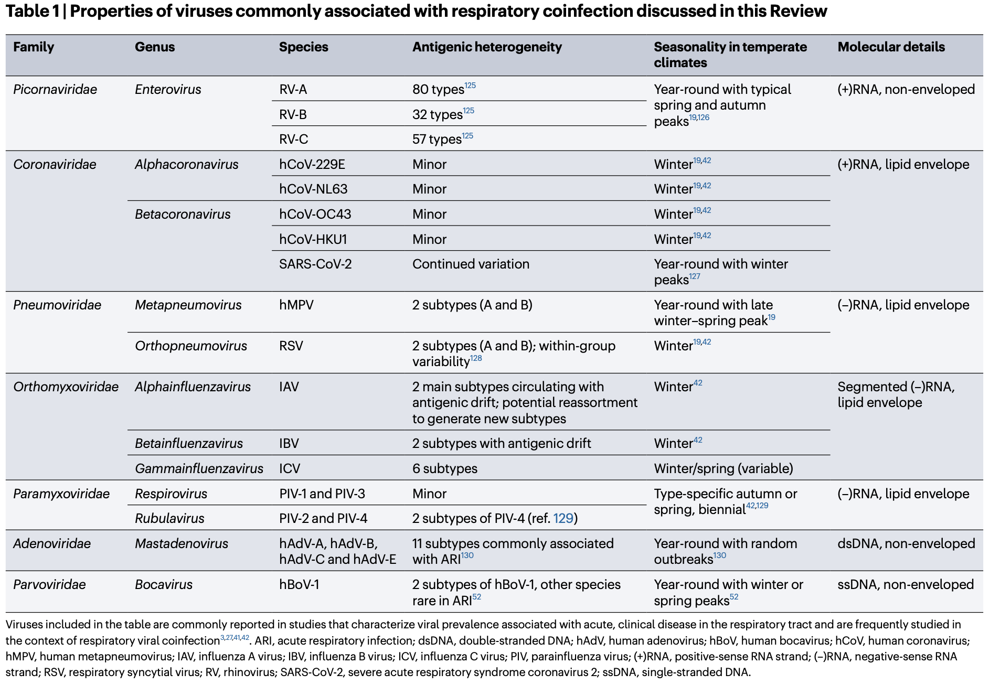
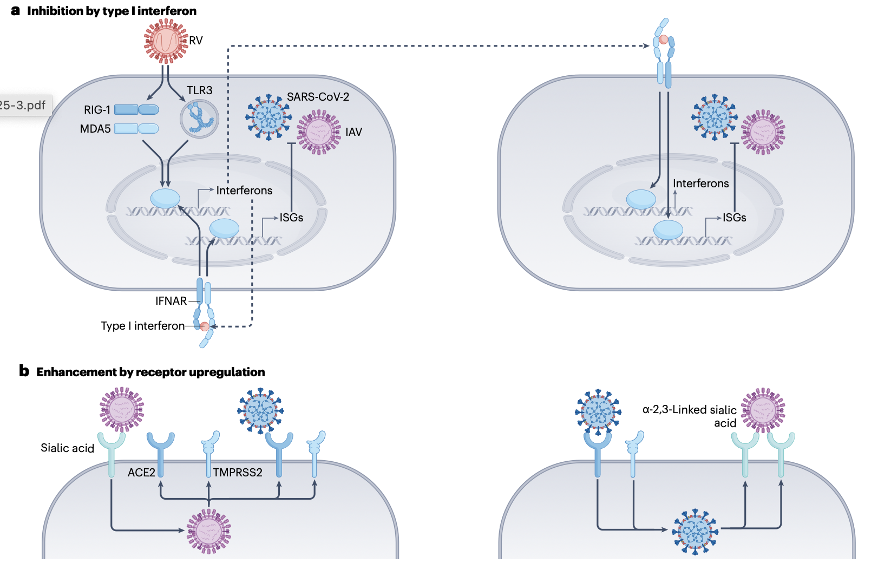
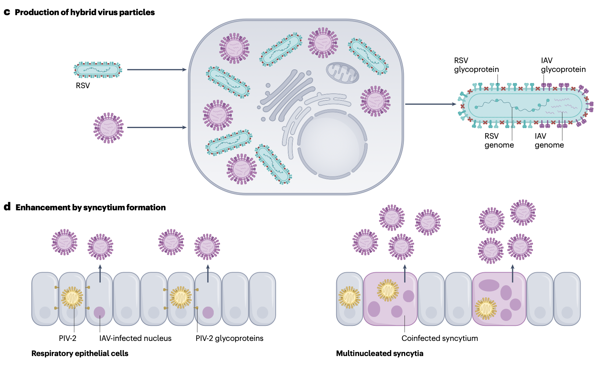
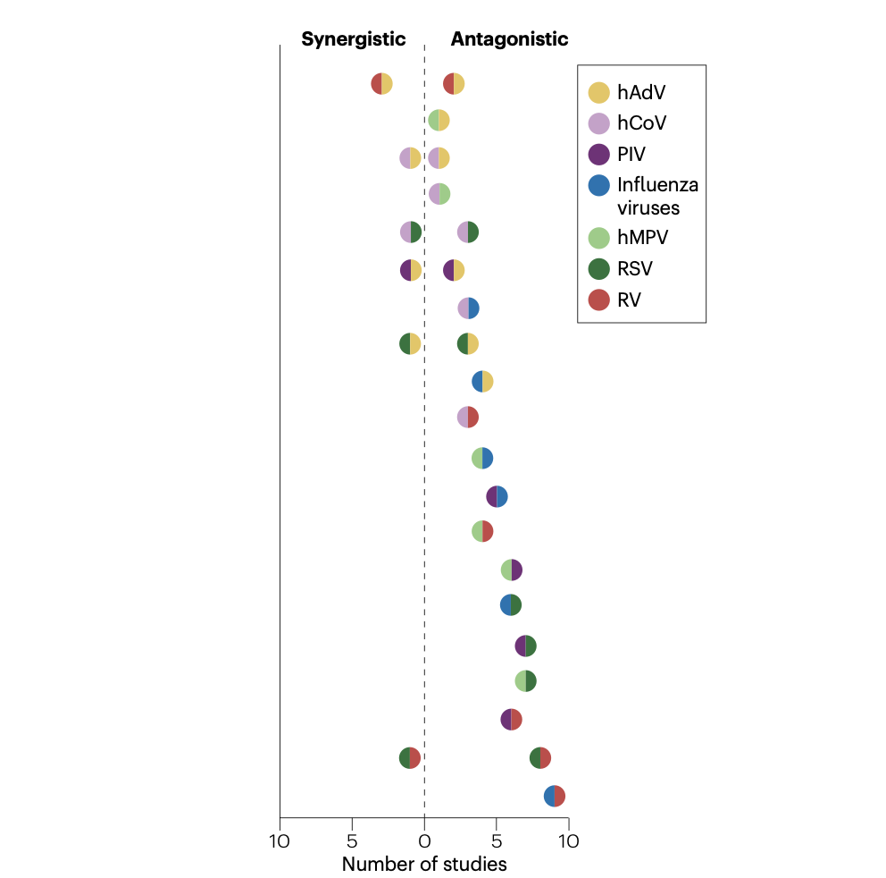
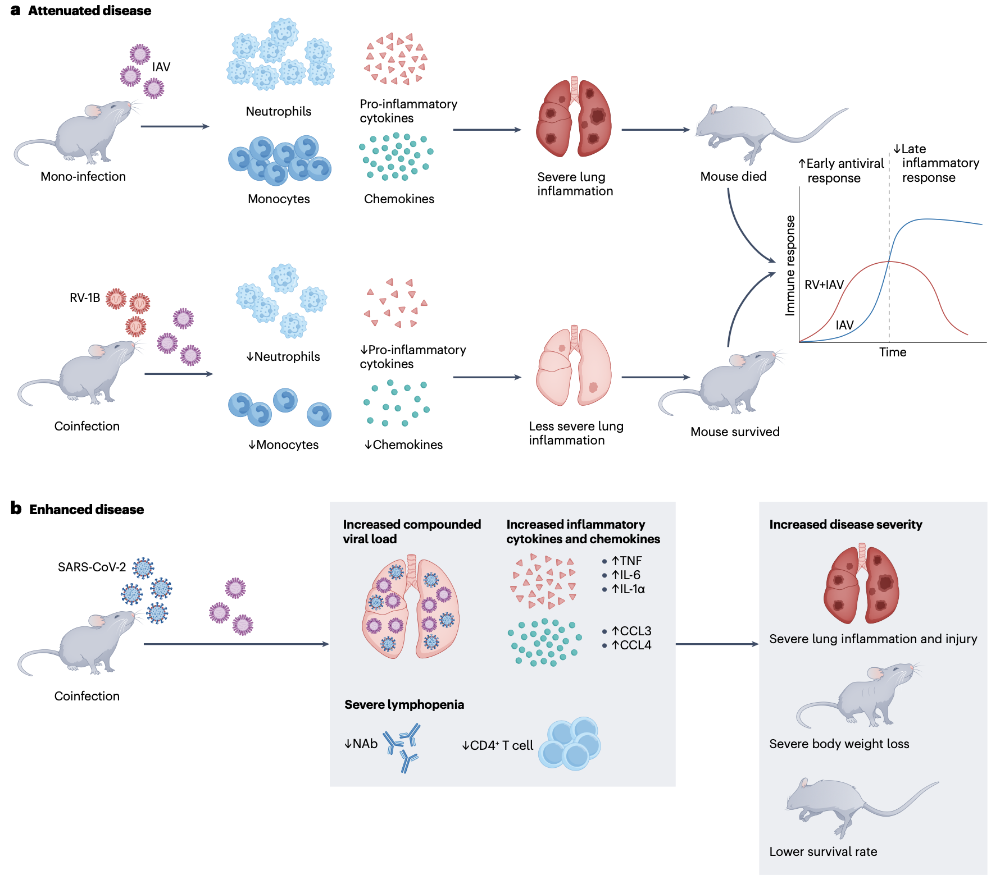

Deol, P., Miura, T.A. Respiratory viral coinfections: interactions, mechanisms and clinical implications. Nat Rev Microbiol (2025). https://doi.org/10.1038/s41579-025-01225-3

该文章系统梳理了呼吸道病毒共感染领域的研究进展，从群体、宿主和细胞层面深入剖析了异源呼吸道病毒间的相互作用，及其对病原体流行率和疾病严重程度的影响，为未来呼吸道病毒感染的防控策略提供了重要参考。

## Introduction

在人类群体中，多种可感染呼吸道的异源病毒共同循环传播。随着针对呼吸道病毒的多重诊断检测技术的出现，人们对个体宿主内病毒共感染现象的认识不断加深。以往，单一病毒感染是呼吸道疾病研究的主流方向，但实际临床中，患者同时感染两种或多种呼吸道病毒的情况并不少见。因此，从群体、宿主和细胞多个层面理解异源呼吸道病毒之间的相互作用，以及这些相互作用对病原体流行率和疾病严重程度的影响，具有至关重要的科学价值和临床意义。

本综述通过总结大量研究成果，揭示了呼吸道病毒之间存在拮抗或协同作用，这些作用会导致病毒在群体中的流行率、在宿主和细胞中的复制情况以及临床病例和动物模型中的疾病严重程度发生改变。深入解析这些相互作用的机制，将为制定更有效的呼吸道病毒感染预防和治疗策略奠定基础。

## 呼吸道病毒相互作用的多层面证据

### 群体层面：病毒流行曲线的变化

在群体层面，不同病毒的流行曲线会因相互作用而发生改变。例如，有研究表明，鼻病毒（Rhinovirus, RV）的活动可能会影响甲型流感病毒的传播进程。2009年甲型H1N1流感大流行期间，挪威和法国的研究发现，鼻病毒的流行在一定程度上延缓了甲型H1N1流感病毒的传播速度和流行规模。此外，在澳大利亚维多利亚州的呼吸道病毒监测中，研究人员通过常规检测数据发现，流感病毒A、呼吸道合胞病毒（Respiratory Syncytial Virus, RSV）与其他呼吸道病毒的循环模式存在关联，一种病毒的流行高峰可能会对另一种病毒的流行周期产生干扰。

不同病毒在群体中的相互作用还体现在季节分布上。正常情况下，多种呼吸道病毒具有特定的季节性流行特征，如流感病毒多在冬春季流行，RSV则在婴幼儿中呈现明显的季节性高发。但当存在病毒间相互作用时，这种季节规律可能被打破。例如，在2022-2023年冬季，美国和欧洲部分地区出现了流感病毒A、RSV、新型冠状病毒（SARS-CoV-2）和人偏肺病毒（Human Metapneumovirus, hMPV）同时流行的“多重流行”现象，这一异常情况与病毒间的相互作用以及公共卫生措施的调整密切相关。

### 宿主层面：病毒共感染对疾病进程的影响
在宿主层面，病毒共感染会显著影响疾病的临床进程和预后。多项针对住院儿童的研究表明，与单一病毒感染相比，病毒共感染可能导致更严重的临床症状和更长的住院时间。例如，在社区获得性肺炎住院儿童中，病毒共感染患者出现呼吸衰竭、需要重症监护的比例更高。同时，病毒共感染还会影响宿主的免疫应答，如单一病毒感染与双重病毒感染的住院婴儿，其γ-干扰素（Interferon-γ, IFN-γ）反应存在显著差异，这种免疫应答的改变可能进一步影响疾病的恢复过程。

然而，并非所有病毒共感染都会导致疾病加重。部分研究发现，某些病毒间的相互作用可能产生保护效应。例如，鼻病毒感染可能会降低后续其他呼吸道病毒感染的严重程度。在小鼠模型中，预先感染鼻病毒能够保护小鼠免受致命性冠状病毒肺部感染的侵害，这种保护作用与干扰素依赖和非依赖机制均有关联。此外，在新型冠状病毒感染患者中，与流感病毒或RSV的共感染对疾病严重程度的影响存在争议，部分研究认为共感染会增加重症风险，但也有研究未发现显著关联，这可能与病毒种类、感染顺序、宿主免疫状态等多种因素有关。

### 细胞层面：病毒复制的相互干扰与增强

在细胞层面，病毒共感染会导致病毒复制出现相互干扰或增强的现象。图展示了细胞共感染过程中病毒干扰和增强的机制。一方面，一种病毒的感染可能会抑制另一种病毒的复制。例如，甲型流感病毒能够通过两波IFIT蛋白（Interferon-Inducible Proteins with Tetratricopeptide Repeats）的表达来抑制RSV的感染；鼻病毒也能在细胞层面抑制流感病毒的复制，这种抑制作用可能与细胞内信号通路的调控以及抗病毒蛋白的表达有关。

另一方面，某些病毒共感染则会促进病毒的复制。例如，人副流感病毒2型（Human Parainfluenza Virus Type 2, PIV2）与甲型流感病毒共感染时，能够增强甲型流感病毒的生长；在人多能干细胞衍生的肺类器官中，SARS-CoV-2与流感病毒的共感染会出现相互促进复制的现象，这种复制增强可能与病毒对细胞代谢的调控、病毒蛋白间的相互作用以及宿主抗病毒免疫应答的抑制有关。此外，有研究发现，流感病毒A与RSV共感染时会产生杂合病毒颗粒，这种杂合颗粒可能具有新的生物学特性，进一步影响病毒的复制和致病性。

## 特定病毒组合的协同与拮抗作用

上图呈现了不同病毒组合间协同或拮抗作用的研究数量分布，清晰反映了当前研究中不同病毒相互作用的关注程度和研究进展。从图中可以看出，流感病毒、鼻病毒、RSV、人腺病毒（Human Adenovirus, hAdV）、人冠状病毒（Human Coronavirus, hCoV）、hMPV等病毒之间的相互作用是研究的重点领域。

### 协同作用的病毒组合
协同作用指两种或多种病毒共感染时，其致病性、复制能力或传播能力大于单一病毒感染的总和。在常见的病毒组合中，RSV与hMPV的共感染是典型的协同作用案例。多项研究表明，RSV与hMPV共感染的婴幼儿，其严重细支气管炎的发生率显著高于单一病毒感染患儿，且病毒载量也更高。在细胞模型中，RSV与hMPV共感染会导致细胞病变效应增强，病毒复制效率提高，这可能与两种病毒对宿主细胞免疫应答的共同抑制以及病毒蛋白的协同作用有关。

此外，流感病毒与SARS-CoV-2的共感染也可能表现出协同作用。在叙利亚仓鼠模型中，SARS-CoV-2与流感病毒共感染会导致更严重、更持久的肺炎，肺部炎症细胞浸润更明显，病毒载量更高。同时，共感染还会影响宿主的免疫应答，如降低中和抗体水平和CD4⁺T细胞反应，从而进一步加重疾病。在人肺泡上皮细胞中，流感病毒与SARS-CoV-2共感染会改变病毒的嗜性，增加病毒对肺泡上皮细胞的感染效率，进而导致更严重的细胞损伤。

### 拮抗作用的病毒组合
拮抗作用指一种病毒的感染会抑制另一种病毒的感染或复制，从而降低其致病性或流行率。鼻病毒与其他多种呼吸道病毒的相互作用多表现为拮抗作用。例如，鼻病毒能够在群体、个体和细胞层面抑制流感病毒的感染。在群体层面，鼻病毒的流行会降低流感病毒的共检测概率；在个体层面，感染鼻病毒后，后续感染流感病毒的风险和疾病严重程度均会降低；在细胞层面，鼻病毒感染会激活宿主的抗病毒免疫应答，诱导干扰素等抗病毒因子的表达，从而抑制流感病毒的复制。

除鼻病毒与流感病毒外，甲型流感病毒与SARS-CoV-2之间也存在拮抗作用。在叙利亚仓鼠中，SARS-CoV-2感染能够干扰流感病毒的复制，降低流感病毒在肺部的载量；在人鼻上皮细胞中，甲型H1N1流感病毒（2009年大流行株）的感染会抑制SARS-CoV-2的复制，而RSV感染则无此效应。这种拮抗作用可能与病毒感染诱导的宿主 innate免疫记忆有关，如SARS-CoV-2感染后，肺泡巨噬细胞会形成抗病毒 innate免疫记忆，当再次受到流感病毒感染时，能够更快、更强地启动免疫应答，从而抑制病毒复制。

## 病毒共感染改变发病机制与疾病结局

### 小鼠模型中的研究发现
在小鼠模型中，不同病毒共感染对疾病结局的影响存在显著差异。一方面，某些病毒共感染会加重疾病 severity。例如，RSV与流感病毒A共感染的小鼠，其肺部炎症反应更剧烈，出现更严重的肺水肿和肺组织损伤，死亡率显著升高。这种疾病加重与病毒复制增强、细胞因子风暴（如肿瘤坏死因子-α、白细胞介素-6等促炎细胞因子大量释放）以及免疫细胞浸润异常有关。

另一方面，部分病毒共感染则会减轻疾病 severity。如前所述，预先感染鼻病毒的小鼠，在后续感染冠状病毒时，其肺部病毒载量降低，炎症反应减轻，生存率提高。此外，感染RSV的小鼠，在后续感染流感病毒A时，也会出现一定程度的保护效应，RSV感染能够通过触发I型和III型干扰素的分泌，保护旁观细胞免受流感病毒的感染，从而降低疾病的严重程度。

### 雪貂模型中的研究发现

雪貂是研究呼吸道病毒感染的理想动物模型，其呼吸道解剖结构和生理功能与人类相似，对多种呼吸道病毒易感。在雪貂模型中，研究人员探究了甲型流感病毒与RSV的相互作用。结果发现，同时感染甲型流感病毒和RSV的雪貂，其呼吸道症状（如打喷嚏、鼻腔分泌物增多）更严重，病毒在呼吸道中的复制持续时间更长，肺部损伤更明显。此外，两种病毒在雪貂呼吸道中的分布存在差异，甲型流感病毒主要在肺部复制，而RSV则在鼻腔和气管中复制，共感染时这种分布模式会发生改变，可能进一步影响疾病的发展。

在SARS-CoV-2与流感病毒共感染的雪貂模型中，共感染会导致更严重的肺部炎症和组织损伤，病毒载量在呼吸道中显著升高，且病毒传播能力增强。同时，共感染还会影响雪貂的体温调节和体重变化，共感染雪貂出现更明显的体温升高和体重下降，恢复时间更长。

### 叙利亚仓鼠模型中的研究发现
叙利亚仓鼠对SARS-CoV-2和流感病毒均易感，是研究这两种病毒共感染的重要模型。在SARS-CoV-2与流感病毒共感染的叙利亚仓鼠模型中，共感染会导致更严重的肺炎，肺部出现更广泛的实变和炎症细胞浸润。同时，共感染还会改变仓鼠的血液学指标，如白细胞计数、淋巴细胞比例等发生显著变化，这些变化可能与疾病的严重程度密切相关。

此外，研究还发现，预先感染流感病毒能够减轻后续SARS-CoV-2感染的疾病 severity。预先感染流感病毒的仓鼠，在感染SARS-CoV-2后，肺部病毒载量降低，炎症反应减轻，这可能与流感病毒感染诱导的 innate免疫记忆有关。这种交叉保护效应为理解病毒间的相互作用提供了新的视角，也为开发广谱抗病毒策略提供了思路。

## 病毒共感染的机制解析

文章从多个角度系统阐述了病毒共感染的机制，主要包括以下几个方面：

### 干扰素介导的抗病毒免疫应答
干扰素是宿主抵御病毒感染的重要免疫分子，分为I型（如IFN-α、IFN-β）、II型（如IFN-γ）和III型（如IFN-λ）。在病毒共感染过程中，干扰素介导的抗病毒免疫应答发挥着核心作用，既可能导致病毒间的拮抗作用，也可能影响疾病的严重程度。

一方面，一种病毒感染诱导的干扰素反应能够抑制另一种病毒的复制。例如，鼻病毒感染能够激活宿主的干扰素信号通路，诱导大量抗病毒蛋白（如IFIT蛋白、Mx蛋白等）的表达，这些蛋白能够干扰流感病毒、SARS-CoV-2等病毒的复制周期，从而抑制病毒的生长。甲型流感病毒感染诱导的干扰素反应也能抑制RSV的复制，这种抑制作用与IFIT蛋白的分阶段表达有关。

另一方面，某些病毒能够抑制宿主的干扰素应答，从而为其他病毒的复制创造有利条件，表现出协同作用。例如，SARS-CoV-2能够通过其编码的多种蛋白（如ORF3b、ORF6等）抑制宿主的I型干扰素应答，降低宿主的抗病毒能力。当SARS-CoV-2与流感病毒共感染时，两种病毒可能共同抑制干扰素应答，导致宿主抗病毒免疫功能进一步减弱，从而促进病毒的复制和疾病的加重。

### 病毒蛋白间的相互作用
病毒蛋白间的直接或间接相互作用也是影响病毒共感染结局的重要机制。不同病毒的蛋白可能通过相互结合、竞争结合宿主细胞因子或受体、调控病毒复制相关信号通路等方式，影响彼此的复制和致病性。

例如，流感病毒的核蛋白（Nucleoprotein, NP）能够与乙型流感病毒的NP发生相互作用，这种相互作用可能影响两种病毒的复制效率，导致乙型流感病毒对甲型流感病毒的复制产生抑制作用。在RSV与SARS-CoV-2共感染的A549-hACE2细胞中，两种病毒的蛋白会导致细胞内稳态发生复杂重塑，影响细胞的代谢、信号传导和凋亡过程，从而改变病毒的复制环境。

此外，病毒蛋白还可能竞争宿主细胞的资源，如核糖体、核酸合成原料等。当两种病毒同时感染一个细胞时，它们会竞争有限的细胞资源，从而影响彼此的复制效率。例如，在细胞内，流感病毒和RSV会竞争核糖体来合成自身的病毒蛋白，这种竞争可能导致其中一种病毒的蛋白合成效率降低，进而抑制其复制。

### 宿主细胞代谢的调控
病毒感染会显著改变宿主细胞的代谢状态，以满足自身复制的需求。在病毒共感染时，不同病毒对宿主细胞代谢的调控可能产生协同或拮抗效应，从而影响病毒的复制和疾病的发展。

一方面，某些病毒共感染会协同调控宿主细胞代谢，为病毒复制提供更有利的条件。例如，SARS-CoV-2与流感病毒共感染时，两种病毒均会促进宿主细胞的糖酵解过程，增加能量供应和代谢中间产物的生成，这些物质能够为病毒的核酸合成和蛋白表达提供原料，从而促进两种病毒的复制。

另一方面，一种病毒对宿主细胞代谢的调控可能会抑制另一种病毒的复制。例如，鼻病毒感染会改变宿主细胞的脂质代谢，减少细胞内某些脂质分子的含量，而这些脂质分子是流感病毒复制所必需的，从而抑制流感病毒的复制。此外，鼻病毒感染还会影响宿主细胞的氨基酸代谢，降低细胞内特定氨基酸的浓度，进而影响其他病毒的蛋白合成。

### 免疫记忆与交叉保护
宿主的免疫记忆在病毒共感染中也发挥着重要作用。既往病毒感染诱导的免疫记忆细胞（如记忆T细胞、记忆B细胞）和抗体，可能对后续感染的病毒产生交叉保护作用，从而影响病毒共感染的结局。

例如，SARS-CoV-2感染后，肺泡巨噬细胞会形成 innate免疫记忆，当再次受到流感病毒感染时，这些记忆巨噬细胞能够更快地激活，释放更多的炎症因子和抗病毒分子，从而抑制流感病毒的复制，减轻疾病的严重程度。鼻病毒感染诱导的免疫记忆也能对后续其他呼吸道病毒感染产生保护作用，这种保护作用不仅依赖于干扰素，还与其他免疫细胞（如T细胞）的激活有关。

此外，疫苗接种诱导的免疫记忆也可能影响病毒共感染的结局。例如，接种流感疫苗后，宿主产生的抗流感病毒抗体和记忆T细胞，不仅能够抵御流感病毒感染，还可能对其他呼吸道病毒（如RSV）产生一定的交叉保护作用，降低病毒共感染的风险和疾病严重程度。

## 临床意义与未来研究方向
### 临床意义
1. 指导临床诊断与治疗

病毒共感染的存在对呼吸道疾病的临床诊断和治疗提出了更高的要求。传统的单一病毒检测方法可能会漏诊共感染情况，导致临床诊断不准确，影响治疗方案的选择。因此，推广和应用多重诊断检测技术（如多重PCR、下一代测序等），能够更全面地检测患者体内的病毒种类，为临床诊断提供更准确的依据。

在治疗方面，针对病毒共感染患者，需要综合考虑不同病毒的致病性和相互作用，制定个体化的治疗方案。例如，对于流感病毒与SARS-CoV-2共感染的患者，在使用抗流感病毒药物（如奥司他韦）的同时，还需要根据SARS-CoV-2感染的情况选择合适的抗病毒药物，避免因药物间的相互作用或病毒间的协同作用影响治疗效果。此外，对于病毒共感染导致的严重炎症反应，合理使用免疫调节剂（如糖皮质激素）可能有助于减轻炎症损伤，但需要严格掌握使用时机和剂量，避免过度抑制免疫功能导致病毒扩散。

2. 优化公共卫生防控策略

病毒共感染的研究成果也为优化公共卫生防控策略提供了重要参考。在呼吸道病毒流行季节，需要密切监测多种病毒的流行趋势，关注病毒共感染的发生情况，及时调整防控措施。例如，在流感和RSV同时流行的季节，应加强对婴幼儿、老年人、免疫功能低下等高危人群的保护，推广流感疫苗和RSV疫苗的接种，降低病毒共感染的风险。

此外，公共卫生措施（如社交距离、口罩佩戴、手部卫生等）对多种呼吸道病毒的传播均有抑制作用。在新型冠状病毒肺炎（COVID-19）大流行期间，这些公共卫生措施的实施不仅有效控制了SARS-CoV-2的传播，也显著降低了流感病毒、RSV等其他呼吸道病毒的流行率。因此，在未来的呼吸道病毒防控中，可将这些非药物干预措施作为常规防控手段，特别是在病毒流行季节，以减少病毒传播和共感染的发生。

### 未来研究方向
1. 深入探索病毒共感染的机制

尽管目前对病毒共感染的机制已有一定认识，但仍有许多关键问题亟待解决。例如，不同病毒组合共感染的具体分子机制、病毒感染顺序对共感染结局的影响、宿主遗传背景和免疫状态在病毒共感染中的作用等。未来需要借助更先进的技术手段（如单细胞测序、蛋白质组学、代谢组学等），从细胞和分子水平深入解析病毒共感染的机制，为开发针对性的抗病毒策略提供理论基础。

2. 开展更多临床队列研究

目前关于病毒共感染的临床研究多集中在特定人群（如婴幼儿、住院患者）或特定地区，样本量相对有限，研究结果的普适性有待进一步验证。未来需要开展更大规模、多中心、长期的临床队列研究，系统分析不同人群、不同地区病毒共感染的发生率、流行特征、危险因素及预后，为制定个体化的临床诊疗方案和公共卫生防控策略提供更充分的证据支持。

3. 开发广谱抗病毒药物和疫苗

针对病毒共感染的特点，开发广谱抗病毒药物和疫苗是未来的重要研究方向。广谱抗病毒药物能够同时抑制多种病毒的复制，适用于病毒共感染患者的治疗；广谱疫苗则能够诱导机体产生对多种呼吸道病毒的免疫保护，降低病毒感染和共感染的风险。目前，基于干扰素、病毒进入抑制剂、病毒复制相关酶抑制剂等靶点的广谱抗病毒药物研究已取得一定进展，基于病毒保守蛋白的广谱疫苗研发也在积极推进中。未来需要进一步优化药物和疫苗的设计，提高其有效性和安全性。

4. 建立病毒共感染的预测模型

建立准确的病毒共感染预测模型，能够帮助临床医生和公共卫生人员提前识别高风险人群，及时采取干预措施，降低病毒共感染的发生和危害。未来需要整合病毒流行数据、宿主临床信息、免疫状态、环境因素等多维度数据，利用机器学习、人工智能等技术构建病毒共感染的预测模型，并通过临床实践不断验证和优化模型性能，为病毒共感染的精准防控提供支持。
