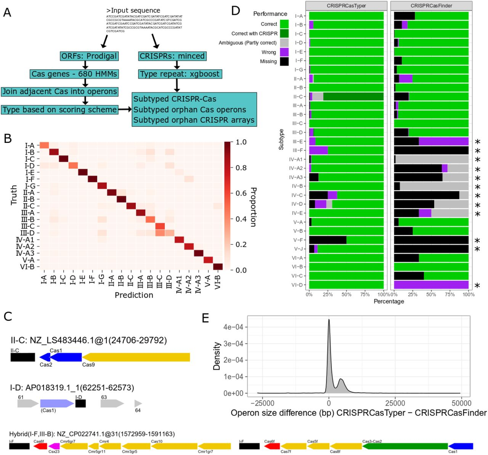

## Introduction

CRISPR-Cas系统是原核生物中广泛存在的适应性免疫系统，通过识别并切割入侵的噬菌体或质粒DNA/RNA，保护宿主免受外源遗传物质的侵害。自被开发为基因编辑工具以来，CRISPR-Cas系统的研究热度持续攀升，而其天然多样性更是为生物技术创新提供了丰富资源——不同类型的CRISPR-Cas系统（如Class 1的I型、III型，Class 2的II型、V型、VI型）具有独特的组成、作用机制和靶向偏好，例如Cas9（II型）适用于DNA编辑，Cas13（VI型）则针对RNA，Cas12（V型）具有 collateral cleavage活性。

然而，解析微生物基因组中的CRISPR-Cas系统面临两大核心挑战：
1. **系统识别的复杂性**：CRISPR-Cas系统由Cas基因（构成功能模块）和CRISPR阵列（含重复序列与间隔序列）组成，不同亚型的基因组成差异大，且部分系统可能缺失关键基因（如“孤儿”Cas操纵子或CRISPR阵列），传统注释工具难以完整识别；
2. **亚型分类的准确性**：早期分类依赖单一特征（如Cas基因或重复序列），易导致误判——例如，相同Cas基因可能对应不同亚型，相似重复序列也可能来自不同系统类型。

发表于The CRISPR Journal的研究“CRISPRCasTyper: Automated Identification, Annotation and Classification of CRISPR-Cas loci”提出了一站式解决方案。该工具整合Cas基因HMM分析、CRISPR阵列检测及机器学习辅助分类，实现了从“基因识别-阵列检测-亚型预测”的全流程自动化，并支持50种CRISPR-Cas亚型（含最新发现的II-C2、II-D、V-M等）的精准分类。本文将简单介绍一下CRISPRCasTyper及其使用方法。

## 文章介绍

CRISPRCasTyper是一款新型自动化软件工具，用于在原核生物序列中识别和分类CRISPR阵列和cas基因座。该工具基于最新的CRISPR-Cas系统分类和命名法（包含39种亚型/变体），采用机器学习方法对CRISPR阵列的直接重复序列进行亚型分类，能够对孤儿和远缘阵列进行分型。该工具提供图形化输出，以彩色基因图谱形式可视化CRISPR和cas操纵子结构，支持通过同线性分析注释部分和新系统。CRISPRCasTyper在包含31种亚型/变体的手动策划数据集上进行了基准测试，中位准确率达到98.6%。



### 工具特点与功能

#### 综合识别与分类能力

CRISPRCasTyper能够识别cas操纵子和相关CRISPR阵列，使用HMMER3针对680个隐马尔可夫模型（HMMs）搜索CRISPR-Cas系统相关基因。工具采用两步过滤过程：Class 2效应蛋白（cas9、cas12、cas13）和III-E gRAMP融合蛋白使用特定优化的E值和覆盖率阈值进行过滤，其余Cas蛋白使用E值 cutoff 0.01、序列和HMM覆盖率均为30%的阈值。

#### 机器学习驱动的重复序列分型

作为创新功能，CRISPRCasTyper使用基于梯度提升决策树的机器学习方法，通过对直接重复序列的典型四核苷酸计数进行分析，实现对CRISPR阵列的亚型分类。该分类器在19种包含至少20个已知重复序列的亚型上，对未见测试数据集的中位准确率达到89%。

#### 图形化输出与可视化

工具提供图形化输出功能，以彩色基因图谱形式展示操纵子结构，有助于识别多样化的cas组件或辅助基因，以及部分和新颖的CRISPR-Cas变体/亚型。基因图谱可以扩展包含低于纳入阈值的HMM匹配，这对于发现孤儿CRISPR阵列周围的新系统特别有价值。

#### 处理复杂系统的能力

CRISPRCasTyper能够解析混合CRISPR-Cas系统，并检测跨越环形序列末端的基因座，避免因环形序列的线性表示而导致基因座被错误分割。此外，工具还提供每个检测到的操纵子的干扰和适应模块的完成百分比。

### 性能基准测试

在与广泛使用的CRISPRCasFinder的比较中，CRISPRCasTyper在识别17种亚型方面表现更优，在其余2种亚型的预测中准确率相当。在这19种亚型中，CRISPRCasTyper的中位准确率为99.5%，而CRISPRCasFinder为93.9%。在所有31种亚型（其中12种在CRISPRCasFinder中缺失）上，CRISPRCasTyper的中位准确率为98.6%。

### 实施与可用性

CRISPRCasTyper通过conda和PyPi在MIT许可证下提供（https://github.com/Russel88/CRISPRCasTyper），并设有网络服务器版本（http://cctyper.crispr.dk）。网络服务器版本包含一个额外模型，每月使用网络服务器用户输入的众包分型重复序列自动重新训练，确保工具的准确率随时间和使用量的增加而提高。

CRISPRCasTyper提供了最新且免费的软件流程，显著改善了跨基因组序列的CRISPR-Cas基因座自动预测能力。其高效的运行性能（典型基因组2-6 Mbp在4线程下运行时间少于1分钟；深度宏基因组组装60-100 Mbp在20线程下运行时间少于10分钟）使其适用于大规模基因组分析项目。该工具特别适用于处理碎片化的宏基因组组装数据，为研究原核生物防御系统的进化多样性和生态功能提供了强大支持。

## CRISPRCasTyper使用教程

官方教程：<https://github.com/Russel88/CRISPRCasTyper>

CRISPRCasTyper是基于Python 3.8开发的开源工具，支持conda和pip两种安装方式，提供命令行接口（CLI），可实现从数据输入到结果可视化的全流程分析。以下为详细使用步骤（基于GitHub官方文档及研究补充材料）。

CRISPRCasTyper包括了以下50个亚型/变体：

I-A, I-B, I-C, I-D, I-E, I-F, I-F (transposon), I-G, II-A, II-B, II-C, II-C2, II-D, III-A, III-B, III-C, III-D, III-E, III-F, IV-A1, IV-A2, IV-A3, IV-B, IV-C, IV-D, IV-E, V-A, V-B1, V-B2, V-C, V-D, V-E, V-F1, V-F2, V-F3, V-F (the rest), V-G, V-H, V-I, V-J, V-K, V-L, V-M, VI-A, VI-B1, VI-B2, VI-C, VI-D, VI-X, VI-Y.


### 1. 准备与安装
#### （1）环境要求
- Python版本 ≥ 3.8
- 依赖工具：HMMER ≥ 3.2（用于Cas基因HMM比对）、Prodigal ≥ 2.6（用于ORF预测）、minced（用于CRISPR阵列检测）、BLAST+（用于重复序列比对）
- 依赖Python包：numpy、pandas、scikit-learn、xgboost、matplotlib、biopython（完整依赖见setup.py）

#### （2）安装方式
推荐使用conda安装（自动解决依赖冲突并下载数据库），pip安装需手动配置数据库。

**方式1：conda安装（推荐）**
```bash
# 创建并激活环境（含所有依赖和数据库）
conda create -n cctyper -c conda-forge -c bioconda -c russel88 cctyper
conda activate cctyper
```

**方式2：pip安装（需手动配置数据库）**
```bash
# 安装Python包
python -m pip install cctyper
# 升级到最新版本
python -m pip install cctyper --upgrade

# 手动下载数据库（含HMM模型、XGBoost重复序列模型）
svn checkout https://github.com/Russel88/CRISPRCasTyper/trunk/data
tar -xvzf data/Profiles.tar.gz
mv Profiles/ data/
rm data/Profiles.tar.gz

# 配置数据库路径（二选一）
# 1. 临时配置（当前终端有效）
export CCTYPER_DB="/path/to/your/data/"
# 2. 永久配置（添加到.bashrc或.zshrc）
echo 'export CCTYPER_DB="/path/to/your/data/"' >> ~/.bashrc
source ~/.bashrc
```

### 2. 输入文件与数据要求
CRISPRCasTyper仅需**1个输入文件**：核苷酸序列的FASTA文件（.fasta或.fa格式），支持以下数据类型：
- 完整基因组（如细菌染色体、质粒）；
- 基因组草图（如scaffold或contig）；
- 宏基因组组装序列（需用--prodigal meta参数）；
- 噬菌体或病毒基因组。

#### 数据预处理注意事项
- **序列格式**：FASTA文件中每个序列需有唯一ID（如>CP000816.1，避免特殊字符）；
- **序列长度**：无严格限制，但短于500bp的序列可能无法检测到完整系统（建议过滤<200bp的contig）；
- ** circular基因组**：若输入为环状序列（如完整质粒），需添加--circular参数，避免末端基因被误判为不完整。

### 3. 核心功能使用
CRISPRCasTyper的核心命令为`cctyper`，基本语法为：
```bash
cctyper [输入FASTA文件] [输出目录] [可选参数]
```

以下为不同场景的常用命令示例：

#### （1）基础分析：完整基因组的CRISPR-Cas解析
以大肠杆菌完整基因组（ecoli_genome.fasta）为例，输出结果到ecoli_output目录：
```bash
# 激活环境
conda activate cctyper

# 运行基础分析
cctyper ecoli_genome.fasta ecoli_output

# 若基因组为环状（如质粒），添加--circular
cctyper ecoli_plasmid.fasta plasmid_output --circular
```

#### （2）宏基因组或短contig分析
宏基因组组装序列通常含大量短contig，需调整Prodigal模式（--prodigal meta）以适配：
```bash
cctyper metagenome_assembly.fasta meta_output --prodigal meta
```

#### （3）RepeatTyper：仅预测CRISPR重复序列亚型
若仅需分析CRISPR重复序列（无需Cas基因），可使用内置的RepeatTyper工具：
```bash
# 输入文件：每行1条重复序列（大写字母），如repeats.txt
# 格式示例：
# GTGTTGTTGGTCATAGCTGATGCTG
# GTTGATGCTGCTGTTGATAGCTGTT

# 运行RepeatTyper
repeatType repeats.txt

# 输出结果：重复序列、预测亚型、概率
# 示例输出：
# GTGTTGTTGGTCATAGCTGATGCTG    I-B    0.91
# GTTGATGCTGCTGTTGATAGCTGTT    II-A    0.87
```

### 4. 结果解读与可视化
CRISPRCasTyper的输出目录含多个文件（仅当有对应数据时生成），核心文件及解读如下：

#### （1）核心结果文件
| 文件名称                | 作用                                  | 关键列解读                                                                 |
|-------------------------|---------------------------------------|--------------------------------------------------------------------------|
| CRISPR_Cas.tab          | 完整CRISPR-Cas位点信息                | Contig（序列ID）、Operon（操纵子ID）、Prediction（共识亚型）、CRISPRs（关联阵列） |
| cas_operons.tab         | 所有Cas操纵子（含孤儿操纵子）          | Start/End（操纵子位置）、Prediction（亚型）、Complete_Interference（干扰模块完整性，%） |
| crisprs_all.tab         | 所有CRISPR阵列（含可疑阵列）          | Consensus_repeat（共识重复序列）、N_repeats（重复次数）、Prediction（关联亚型） |
| crisprs_orphan.tab      | 孤儿CRISPR阵列（无相邻Cas操纵子）      | 同crisprs_all.tab，新增“Trusted”列（是否为高可信度阵列）                   |
| spacers/*.fa            | 间隔序列FASTA文件                     | 每个CRISPR阵列的间隔序列，可用于后续靶标分析（如预测噬菌体靶标）           |

#### （2）结果可视化：自动生成基因图谱


CRISPRCasTyper会自动生成CRISPR-Cas系统的矢量图（.svg格式），便于直接用于论文，图中颜色含义：
- 黄色：干扰模块基因（如Cas3、Cas9）；
- 蓝色：适应模块基因（Cas1、Cas2）；
- 红色：Cas6（负责重复序列加工）；
- 紫色：辅助基因；
- 灰色：未知基因（编号对应genes.tab）；
- 黑白交替块：CRISPR阵列（块数=重复次数）。

示例命令：生成扩展5kb范围的基因图谱
```bash
cctyper genome.fasta plot_output --expand 5000 --redo_typing
```

#### （3）常见问题与解决方案
- **无结果文件生成**：检查输入FASTA格式（是否有唯一ID、序列是否为核苷酸），或降低E-value阈值（--eval 1e-3）；
- **内存不足**：宏基因组数据可拆分输入文件（如用pyfasta拆分contig），或减少线程数（--threads 2）；
- **亚型预测概率低（<0.75）**：视为不确定结果，可手动检查CRISPR重复序列（crisprs_all.tab的Consensus_repeat列）或Cas基因组成（cas_operons.tab的Genes列）。


## References
1. Russel, J., Pinilla-Redondo, R., Mayo-Muñoz, D., et al. (2020). CRISPRCasTyper: Automated Identification, Annotation and Classification of CRISPR-Cas loci. *bioRxiv*, https://doi.org/10.1101/2020.05.15.097824.
2. CRISPRCasTyper GitHub仓库：https://github.com/Russel88/CRISPRCasTyper
3. Makarova, K. S., et al. (2020). Evolutionary classification of CRISPR–Cas systems: a burst of class 2 and derived variants. *Nature Reviews Microbiology*, 18(11), 675-691.
4. Russel, J., et al. (2022). Type IV CRISPR–Cas systems are highly diverse and involved in competition between plasmids. *Nucleic Acids Research*, 50(11), 6255-6267.
