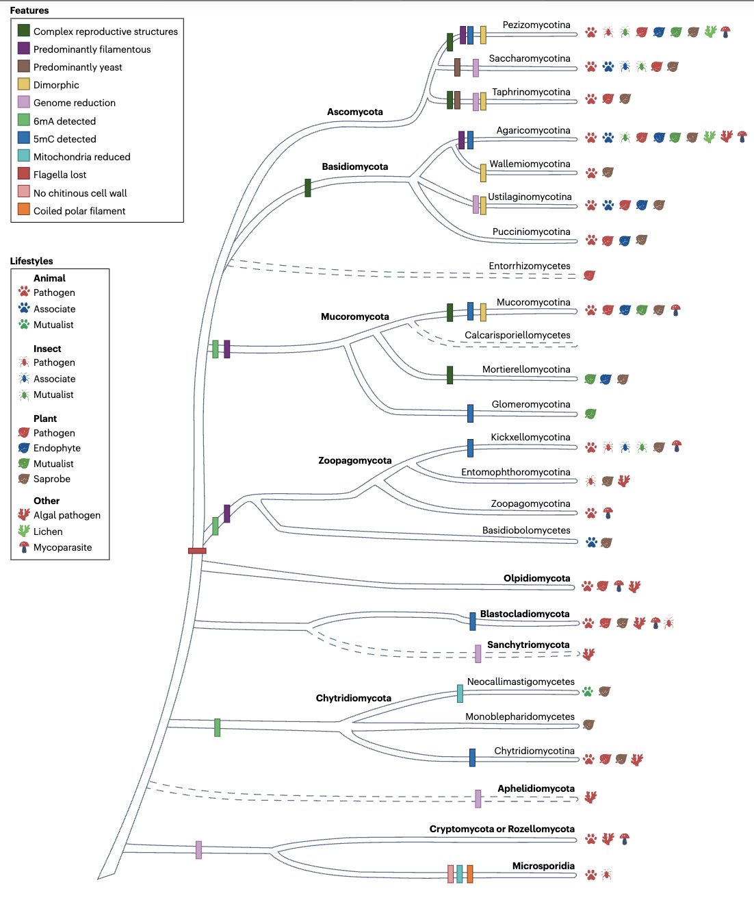
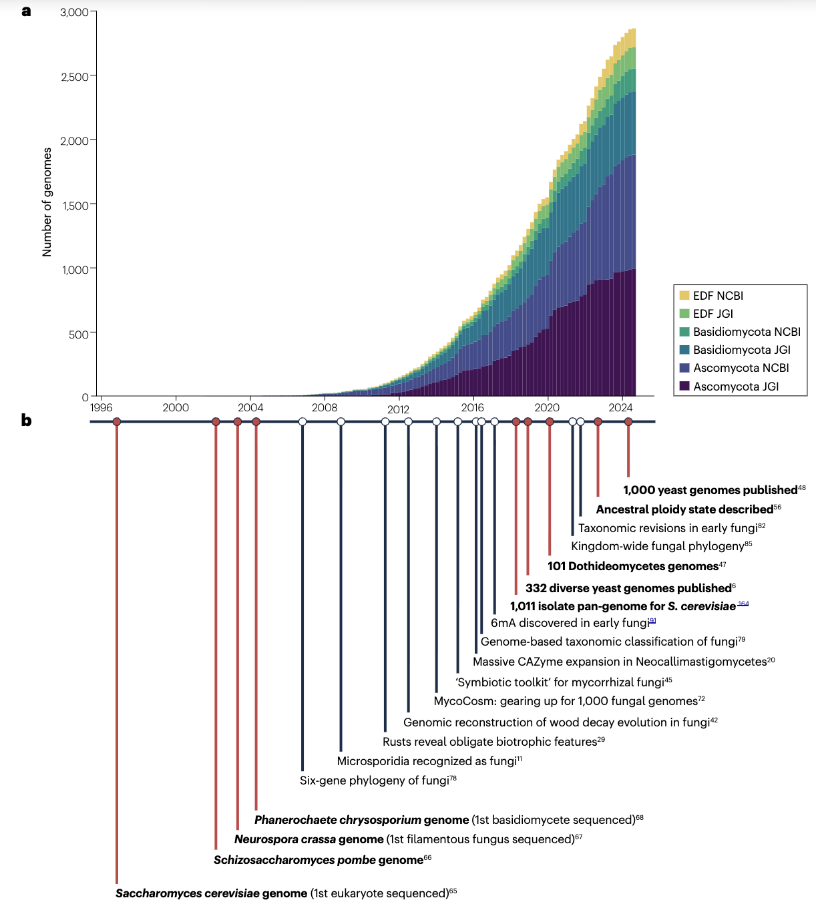
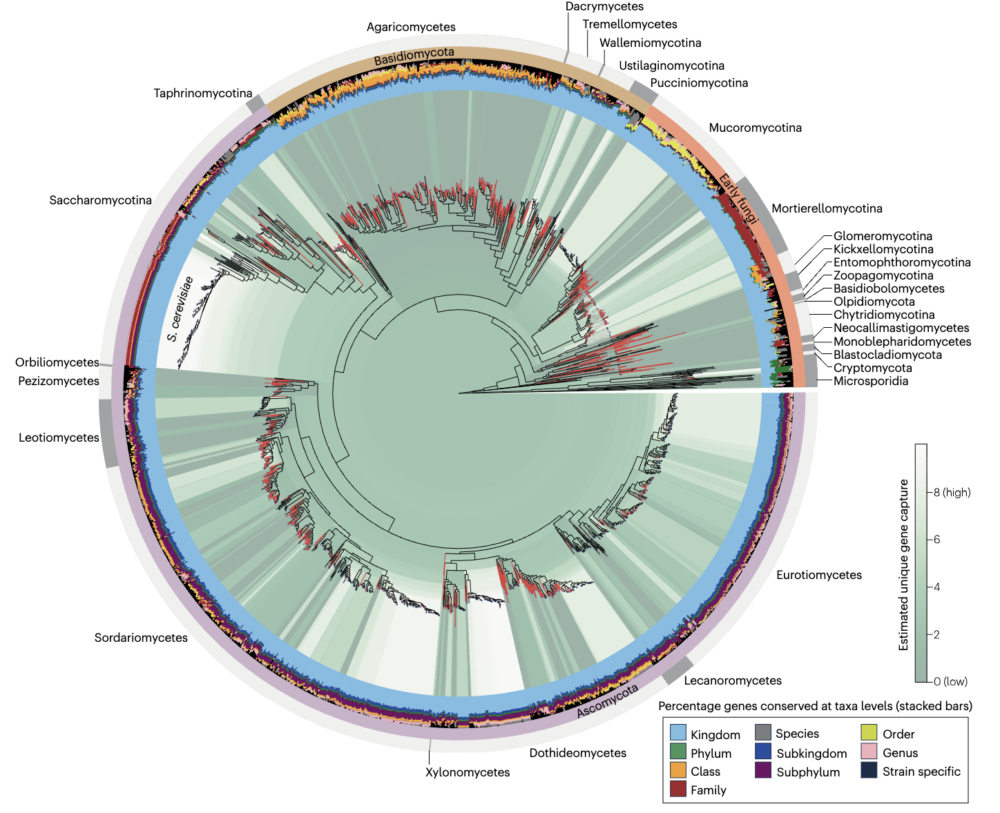
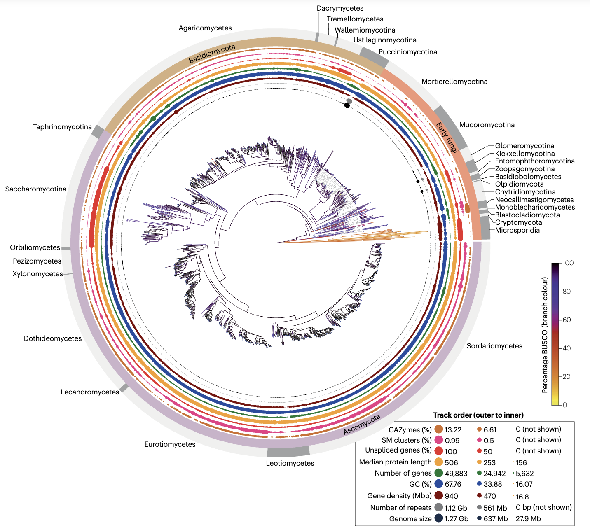

真菌起源于约10亿年前的水生单细胞祖先，现已进化成为地球上最成功的真核生物类群之一，分化出数百万个物种，占据了几乎所有有氧环境。其基因组相对较小且结构简单，重复序列含量低，这使其成为大规模测序和比较基因组学研究的理想模型。

Mondo, S.J., Grigoriev, I.V. A genomic perspective on fungal diversity and evolution. Nat Rev Microbiol (2025). https://doi.org/10.1038/s41579-025-01195-6

这篇综述基于GenBank和MycoCosm平台的基因组数据，构建了覆盖整个真菌界的系统发育框架，探讨了基因组结构的演化规律以及重要的进化转变事件。当前研究仍面临基因组表征偏差和基因功能注释不足等挑战，未来需要加强对功能未知基因的研究，并扩大测序规模以实现10,000个真菌基因组的注释目标。

## 前言

真菌是真核生物中最古老的界之一，其起源可追溯至约18.4亿年前。据估计，真菌界包含220万至620万种物种，但目前仅有约20万个物种被正式命名和描述，显示出巨大的多样性缺口。真菌的系统发育和表型多样性极为丰富：例如，仅酵母亚门（Saccharomycotina）内的遗传差异就超过了人类与蛔虫的差异，甚至超过了整个绿色植物界的差异水平。

真菌系统发育树的基部为微孢子虫（Microsporidia），这是一类最近才被确认为真菌的专性细胞内寄生虫，拥有最小的真核基因组（2-10 Mb），缺乏线粒体和几丁质细胞壁，但具有独特的感染结构——极丝。与其相邻的是隐菌门（Cryptomycota），这类真菌多样性高但研究较少，具有鞭毛和线粒体，但细胞壁成分存在争议。壶菌门（Chytridiomycota）和芽枝菌门（Blastocladiomycota）作为早期分支，产生带鞭毛的游动孢子，多为纤维素和几丁质的降解菌或病原体。

其余真菌门（除Olpidium外）都失去了鞭毛，进化出丝状生长、酵母形态或二态性。双核菌亚界（Dikarya，包括子囊菌门和担子菌门）与陆地植物的多样化协同进化，发展出丰富的共生、致病和腐生关系，并演化出复杂的多细胞结构（如子实体和蘑菇）。非双核菌常被统称为"早期分化真菌"（EDF），但其分类仍存在争议。

真菌在进化过程中保留了渗透营养这一保守特征，但二态性、菌根化和地衣化等特征经历了多次独立进化。它们栖息地广泛，从腐烂有机物到极端环境，能够产生种类繁多的酶和次生代谢产物，具有重要的经济价值，同时也是农业和医疗领域的重要病原体或生物防治剂。

基因组学研究通过分析碳水化合物活性酶（CAZymes）等基因家族，成功地将基因功能与生态适应性联系起来。例如，白腐真菌的植物生物质降解能力与CAZymes基因家族的扩增直接相关，而菌根真菌则显示出相关基因家族的收缩。

真菌基因组通常较小（<50 Mb），但存在显著变异：微孢子虫和酵母亚门基因组极小，而锈菌和丛枝菌根真菌基因组可超过1 Gb。倍性状态多样，包括单倍体、二倍体和双核体（两个单倍体细胞核共存于同一细胞），非整倍体和杂交事件进一步增加了基因组多样性。

测序技术的进步使真菌基因组资源快速增长，自1996年酿酒酵母基因组发布以来，已有大量基因组通过FungiDB、Ensembl Fungi、GenBank和MycoCosm等平台公开。标准化流程和高通量测序中心的建立为比较基因组学研究奠定了坚实基础。

本综述利用多组学数据探讨真菌进化，识别系统发育缺口，重建了1440个基因组的系统发育树，并结合基因组统计数据，分析不同支系的基因组变异特征，讨论当前测序规模和功能注释面临的挑战及未来解决方案。

## 真菌系统基因组学

### 简史

真菌最初被归类为植物，随着DNA测序和系统发育分析技术的发展，其分类体系经历了重大修订。早期分化真菌（EDF）主要为丝状形态，被分为动物菌门（Zoopagomycota）和毛菌门（Mucoromycota）。2006年的六基因系统发育研究揭示了壶菌门并非单系群，随后将其分为隐孢子菌门、壶菌门和芽枝菌门三个独立门。近期研究提出了包含20个门的分类系统，但EDF的分类仍然不稳定，新的分类单元不断被提出。

### 高度多样化的早期分化谱系

EDF的组学数据仍然稀缺，MycoCosm数据库中双核菌基因组数量约为EDF的十倍。然而，EDF包含许多具有独特生物学特性的类群：新美鞭菌纲（Neocallimastigomycetes）生活在厌氧环境中，缺乏线粒体但具有强大的植物生物质降解能力，其CAZymes数量是需氧降解菌的七倍；球囊菌亚门（Glomeromycotina）的丛枝菌根真菌与绝大多数陆生植物形成共生关系，对生态系统功能至关重要；此外，EDF中还发现了具有非规范DNA修饰机制的类群。单细胞测序和轻覆盖测序技术的应用有望改善EDF的分类分辨率和新物种发现。

### 采样缺失

真菌多样性远未得到充分采样。NCBI和MycoCosm的基因组数据存在严重的不对称性：模式生物周边支系代表性强，而Bartheletiomycetes和Entorrhizomycetes等类群缺乏基因组数据。基于约2000个已发表基因组构建的系统发育分析显示，大多数基因在真菌界中是保守的，但微孢子虫、新美鞭菌纲、球囊菌门等支系存在显著的谱系特异性基因富集。

Y1000+等大规模测序项目部分弥补了多样性缺口，如101个座囊菌纲和300个曲霉菌基因组的测序促进了物种重新分类。"千菌基因组计划"旨在提供全真菌界的参考基因组，但仍需要更多数据来覆盖支系内的多样性。对采样不足的支系进行深度测序将为新基因发现提供重要机会，特别是在EDF、担子菌门特定目以及子囊菌门的盘菌纲等类群中。

## 大规模测序阐明真菌进化

### 基因组特征的变化

比较基因组学研究显示，真菌基因库与后鞭毛祖先更为相似，代谢基因丰富且水平基因转移（HGT）发生率较高。基因组结构和内容表现出显著变异：新美鞭菌纲基因组庞大且具有强烈的AT偏好，CAZymes和生物合成基因簇（BGCs）特别丰富；盘菌亚门中BGCs数量最多；基因组压缩的支系（如微孢子虫）表现出基因密度高、内含子少的特征；柄锈菌亚门的锈菌具有最大的基因组，重复序列含量显著增加。

### 基因丢失推动了整个亚门的进化

酵母亚门通过大规模的基因丢失实现了基因组简化。Y1000+项目通过对1000多个基因组的分析表明，酵母共同祖先具有比现存物种更复杂的代谢能力，普遍的基因和性状丢失导致了现代酵母的多样性。类似的基因组简化现象也出现在塔普里菌门和黑粉菌门中，这些支系都倾向于以酵母形态为主。比较基因组学分析将有助于揭示真菌基因组减少的共同机制和生态位特化的遗传基础。

### 水平基因转移

HGT是真菌进化的重要驱动力，影响细胞周期、代谢途径及天然产物合成。例如，某个酵母支系获得了完整的细菌铁载体生物合成操纵子；"星舰"转座子被证明能够介导HGT事件。新美鞭菌纲显示出极高的HGT率，含有大量细菌来源的基因；木霉属和蜜环菌属的HGT主要发生在真菌之间。内共生体也可能通过HGT贡献重要的遗传材料。

### 内共生

毛菌门与细菌内共生体建立了长期密切的关系。例如，Mycetohabitans rhizoxinica为宿主提供强效的次生代谢产物；Candidatus Glomeribacter gigasporarum提高丛枝菌根宿主的生长速率。这些共生关系涉及能量代谢的优化，但也可能操纵宿主的生殖系统。对这些系统的研究揭示了有性生殖的遗传基础，并鉴定出门特异性的交配信息素系统。

### 真菌多细胞的进化

真菌演化出多样化的生殖结构，从气生蘑菇到地下子实体。复杂多细胞性在多个支系中独立出现，包括Taphrinomycotina中的Neolecta属。进化转录组学研究表明，多细胞性主要通过古老真核基因的增选和扩展适应而进化，而非通过基因复制产生新基因。某些基因家族（如F-box蛋白和扩张蛋白样蛋白）的扩张与多细胞性相关，但许多相关基因是古老的真核基因，而一些新出现的小分泌蛋白的功能仍有待阐明。

### 表征功能未知的基因

约一半预测基因的功能未知，其中部分基因在真菌界甚至更广范围内保守，提示它们具有重要功能。MycoCosm平台列出了功能未知的保守基因，并提供生物信息学分析以促进社区研究。CRISPR和RB-TDNAseq等新技术支持大规模的基因-性状关联筛选，特别适用于探索转运蛋白和分泌蛋白等在渗透营养等关键功能中的作用。

## 从多组学角度看真菌进化

### 真菌生命之树的表观基因组转变

表观遗传修饰显著影响基因功能的实现。5-甲基胞嘧啶（5mC）通常与基因抑制相关，但其功能因支系而异：新型隐球菌利用5mC稳定着丝粒区域。EDF广泛利用N6-甲基脱氧腺嘌呤（6mA），这种修饰与基因表达正相关；而在双核菌中6mA水平很低，表明发生了重大的表观基因组重组。组蛋白修饰（如H3K9me3和H3K27me3）和核小体重塑机制也参与调控致病性和代谢过程。

### 基因和通路调控

DAPseq等新技术能够在体外高通量绘制转录因子结合位点，结合RNA测序数据解析基因调控网络。例如在粗糙脉孢菌中，该方法成功揭示了植物生物质降解途径的调控机制。代谢模型目前主要局限于生物技术相关类群，需要扩展到更多真菌类群以全面理解代谢途径的进化历程和工业应用潜力。

### 群体基因组学、适应性进化和泛基因组学

群体基因组学分析揭示了物种起源、迁移历史和适应性进化。例如，酿酒酵母起源于中国，其表型差异主要由拷贝数变异驱动。泛基因组学将基因分为核心基因和附属基因，后者多位于染色体末端或可选染色体上，富含与生态适应相关的基因（如效应子和BGCs）。全属测序项目（如曲霉属300个物种）发现了数百个新的BGCs，这些基因簇对于微生物竞争和生态位适应至关重要。

### 揭示微生物群落中的真菌

真菌在宏基因组数据集中的组装和分箱仍然面临挑战，但EukCC等工具能够改善真核生物序列的分类和提取。宏转录组学可以识别微生物群落中的活跃真菌成员，例如在牛瘤胃中，厌氧真菌提供特定的酶谱与细菌协同降解植物材料；在森林土壤中，不同真菌功能群的比例随生态系统类型变化。当前参考基因组的覆盖不足严重限制了宏转录组学数据的解读，迫切需要扩大基因组测序范围。

## 结论

基因组学彻底改变了我们对真菌进化、多样性和生态功能的理解。进化分析方法揭示了新的谱系、厘清了系统发育关系，并阐明了共生、致病性和多细胞性等关键创新的遗传基础。基因组数据为了解真菌适应不同环境的分子机制提供了前所未有的见解，包括通过基因组简化实现的生态位特化，以及通过内共生和HGT实现的功能扩展。

然而，真菌界的大部分多样性仍未得到探索，超过一半的基因功能未知。JGI提出了测序10,000个基因组的目标，这需要加强对菌根、病原体、内生菌和极端环境真菌等生态类群的研究。菌种保藏中心的菌株测序、单细胞技术和宏基因组组装将有助于填补不可培养物种的空白。社区科学项目和公民科学倡议将在克服培养和专业知识障碍方面发挥重要作用。

大规模测序将提供生物技术所需的基因和通路目录，助力天然产物开发和微生物群落理解。通过高通量方法将基因与性状关联，结合多组学数据，可以训练人工智能预测基因功能，最终实现基因组注释与生态功能的整合，为真菌生物学的全面发展奠定基础。
