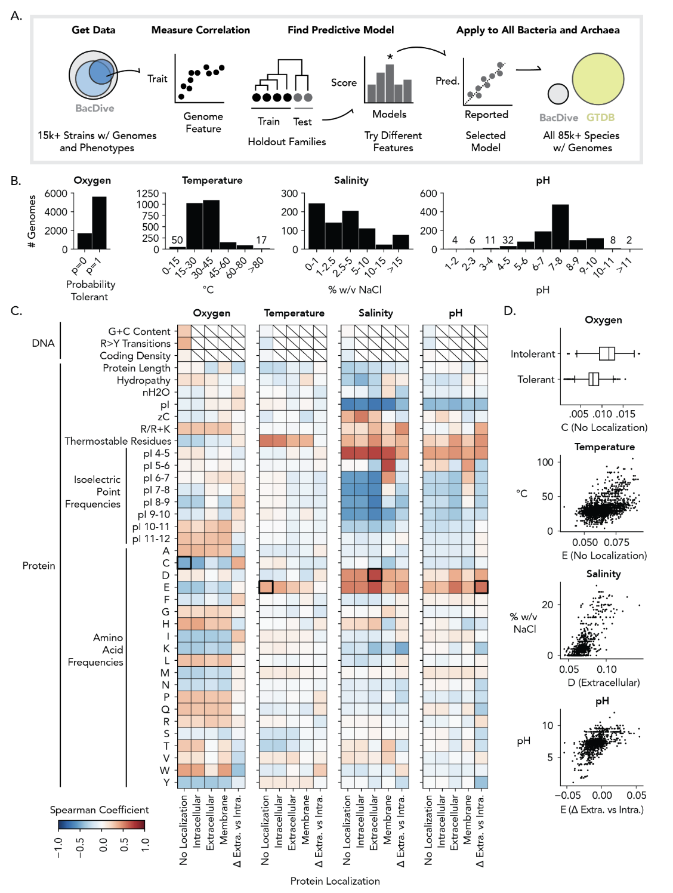
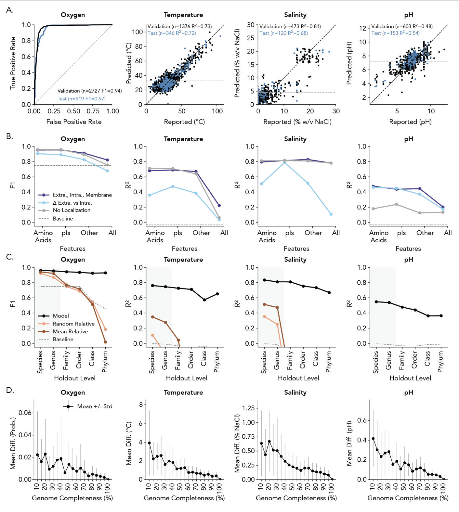
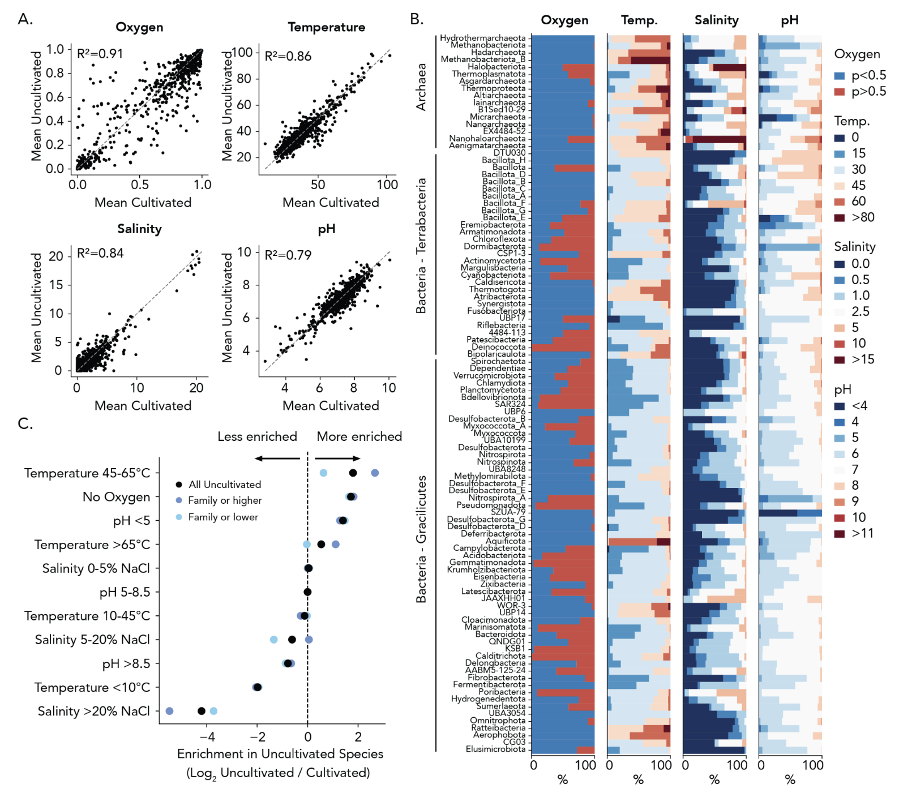
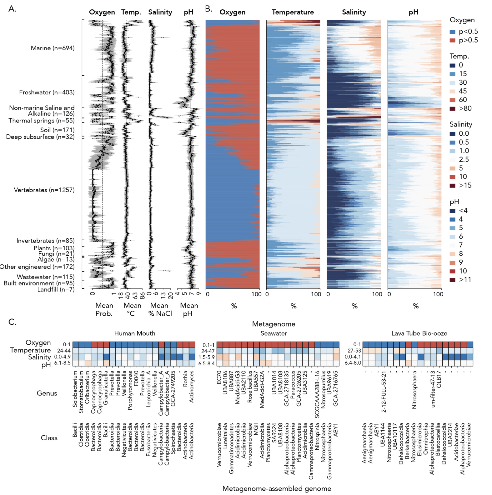

## Introduction

微生物的生长条件（如盐度、pH值、氧气耐受性和温度）是理解其生态功能、代谢特性及应用潜力的关键，但传统实验测定方法耗时且难以覆盖海量未培养微生物。为此，Tyler P. Barnum等研究者开发了**GenomeSPOT**——一款基于基因组序列预测细菌和古菌生长条件的工具，并于2024年3月在预印本平台bioRxiv（doi: https://doi.org/10.1101/2024.03.22.586313 ）发表相关研究。

该工具通过对系统发育多样性微生物分离株的氨基酸组成数据训练统计模型，可快速预测目标微生物的氧气耐受性（分类及概率）、最适/最低/最高温度（℃）、最适/最低/最高盐度（% w/v NaCl）及最适/最低/最高pH值，单基因组预测耗时仅5-10秒。在Genome Taxonomy Database（GTDB）的85205个基因组上测试时，仅0.3%的基因组因蛋白质数量过少（<700个）缺失预测结果，且对多数微生物的生长条件预测具有较高准确性，为微生物生态学研究、环境修复及工业菌株筛选提供了高效工具。

## 文章介绍

### 背景

* 目前微生物学和环境微生物学中，有很大一部分微生物尚未被成功培养（即“不可培养”微生物）。这部分原因在于难以确定其适宜的培养条件（如氧气要求、最适温度、pH、盐度等）。
* 虽然有方法可以通过基因组中注释出的代谢基因来预测碳源或能量代谢方式，但对于诸如氧气耐性、温度、pH、盐度等“培养条件参数”，基于功能基因的预测比较困难，特别是在基因注释不完整或未知功能基因广泛存在的情况下。
* 如果能从基因组层面（不依赖于详细注释）就预测这些培养需求，就能为实验室尝试培养更多微生物提供指导。

鉴于以上挑战，作者尝试探索一种基于 **氨基酸组成频率** 的方法，用以预测微生物的生长条件（氧气耐性、温度、pH、盐度等）。


### 方法



总体方法思路是：从已知可以培养的、具有生长条件注释（氧、温度、pH、盐度等）的微生物样本出发，建立统计/机器学习模型，用氨基酸组成作为特征，预测这些生长条件。然后将模型推广到未知或未培养的微生物或从环境样本中拼装出的基因组（metagenome-assembled genomes, MAGs）。

主要步骤如下：

1. **数据收集**
   收集具有生长条件注释的细菌和古菌的基因组数据（共 15,596 个物种/株）。作者还收集每个物种的氧气耐性、最适温度、最适 pH、盐度等信息。 

2. **特征构建 — 氨基酸组成频率**
   对每个基因组计算其蛋白质编码序列中氨基酸的相对频率（即每种氨基酸在总氨基酸中占比）。
   此外，为改善预测效果，作者还考虑将蛋白质的亚细胞定位（如细胞膜、胞外、胞内等）纳入考量，从而在不同亚定位蛋白中分别计算氨基酸频率（局部化加权）。 

3. **模型训练与交叉验证**
   使用监督机器学习方法（例如分类模型或回归模型，视目标变量而定），将氨基酸频率作为输入特征，预测氧气耐性（分类）、最适温度（回归）、最适 pH（回归）、盐度（回归）。
   在模型训练过程中，作者采取交叉验证或留出验证集来评估模型性能。
   此外，他们还评估在不同基因组完整度（如只用了 10% 的基因组片段）情况下，模型的稳健性。

4. **模型推广与应用**

   * 将训练好的模型应用到所有已有的 85,205 个细菌／古菌（包括未培养的物种），预测它们的生长条件。 
   * 将模型应用于多个环境样本中的 MAG（metagenome-assembled genomes）来预测这些微生物在其环境中的生长条件差异。 
   * 对比不同类别的微生物（培养 vs 未培养；不同环境来源）在预测的条件上的分布差别。

### 主要结果

以下是该研究取得的一些核心结果：

1. **氨基酸频率的预测能力**

   * 作者发现，仅基于氨基酸频率，就能对多个生长条件产生有意义的预测。
   * 例如，仅用两种氨基酸（最可能是某些特定残基）就能以约 88% 的平衡准确率（balanced accuracy）预测微生物是否兼性好氧或厌氧。 
   * 对于氧气耐性的预测，模型可达约 92% 的平衡准确率。 



2. **温度、盐度、pH 的预测性能**

   * 最适温度（optimum temperature）：模型表现良好，R² ≈ 0.73。 
   * 盐度（salinity）：模型也表现不错，R² ≈ 0.81。 
   * pH：预测困难一些，基线模型的 R² 较低。但通过将蛋白质亚细胞定位信息纳入（即分别考虑不同定位蛋白的氨基酸频率），pH 的预测性能显著提升（增加约 0.36 的 R²）。 

3. **对不完全基因组的适用性**

   * 由于该方法不依赖具体的功能基因注释，它可以在基因组不完整的情形下使用。作者实验证明，即使只保留 10% 的基因组（即基因组片段化模拟），模型仍能保持可用的预测性能。 



4. **对全基因组库和未培养微生物的预测**

   * 作者将模型推广到 85,205 个已有基因组物种（包括未培养的物种），预测其氧气耐性、最适温度、pH、盐度等。其结果显示，未培养物种（与已培养物种相比）在预测上更倾向于高温嗜好、厌氧性、酸性等极端条件（即未培养物种可能适应更极端环境）。 
   * 在多个环境样本（包含 MAGs）中进行预测分析时，作者观察到即使同一社区中的不同微生物，其预测的生长条件也可能有显著差异，提示环境中可能存在多个生态位微生物共存。 



5. **方法局限与展望**

   * 对 pH 的预测仍相对弱于温度或盐度预测，需要进一步改进。
   * 虽然方法不依赖注释，但氨基酸组成只是一个间接信号，其与环境适应性之间的关联机制尚不完全清楚。
   * 模型在极端、边缘或少样本类型的微生物上可能存在误差。
   * 未来有可能将这种方法作为指导实验设计的工具，帮助实验室更有效地为未培养微生物设计培养条件。

## 使用教程

GenomeSPOT基于Python开发，支持单基因组/多基因组批量预测，以下为详细使用步骤（参考GitHub仓库：https://github.com/cultivarium/GenomeSPOT）。

### 1. 环境准备与安装
#### 1.1 依赖要求
- **Python版本**：≥3.8.16且<3.12；
- **必需依赖包**（需严格指定版本以确保兼容性）：
  - hmmlearn==0.3.0
  - scikit-learn==1.2.2（核心依赖，版本错误会导致模型失效）
  - biopython≥1.83
  - numpy≥1.23.5
  - pandas≥1.5.3
- **可选工具**：
  - Prodigal（https://github.com/hyattpd/Prodigal）：若仅提供基因组序列，需用其预测蛋白质序列；
  - ncbi-genome-download（https://github.com/kblin/ncbi-genome-download）：从GenBank下载基因组数据。

#### 1.2 安装步骤
1. 克隆GitHub仓库：
   ```bash
   git clone https://github.com/cultivarium/GenomeSPOT.git
   cd GenomeSPOT
   ```
2. 创建并激活虚拟环境（推荐，避免依赖冲突）：
   ```bash
   conda create -n genomespot python=3.8.16
   conda activate genomespot
   ```
3. 安装依赖包：
   ```bash
   pip install .
   pip install -r requirements.txt
   ```

### 2. 运行预测
#### 2.1 输入文件准备
需提供以下两类文件之一（若只有基因组，需先预测蛋白质）：
- 基因组序列文件：FASTA格式（可压缩，后缀为.fna或.fna.gz）；
- 蛋白质序列文件：FASTA格式（可压缩，后缀为.faa或.faa.gz）。

#### 2.2 单基因组预测（示例）
若已拥有蛋白质文件，直接运行以下命令：
```bash
python -m genome_spot.genome_spot --models models \
    --contigs tests/test_data/GCA_000172155.1_ASM17215v1_genomic.fna.gz \
    --proteins tests/test_data/GCA_000172155.1_ASM17215v1_protein.faa.gz \
    --output GCA_000172155.1
```

若仅拥有基因组文件，需先用Prodigal预测蛋白质：
```bash
# 解压基因组文件（若压缩）
gunzip genome.fna.gz
# 预测蛋白质序列
prodigal -i genome.fna -a protein.faa
# （可选）重新压缩基因组文件
gzip genome.fna
# 再运行GenomeSPOT预测
python -m genome_spot.genome_spot --models models \
    --contigs genome.fna.gz \
    --proteins protein.faa \
    --output genome_result
```

#### 2.3 多基因组批量预测
1. **结果合并**：若已完成多个基因组的单独预测，可使用 helper 脚本将结果合并为单个TSV文件：
   ```bash
   python3 -m genome_spot.join_outputs --dir data/predictions --write-to-tsv
   # 输出文件为 all.predictions.tsv，首行是生长条件（如temperature_optimum），第二行是数据类型（如error）
   ```
2. **并行运行**：若有上万基因组，可使用shell命令实现并行（示例：同时运行10个任务）：
   ```bash
   # 定义并行等待函数
   function pwait() {
       while [ $(jobs -p | wc -l) -ge $1 ]; do
           sleep 1
       done
   }
   # 批量运行
   INDIR='data/features'  # 输入特征文件目录
   OUTDIR='data/predictions'  # 输出结果目录
   for FEATURES_JSON in `ls $INDIR`; do
       PREFIX=$(echo $FEATURES_JSON | cut -d. -f1);
       echo $FEATURES_JSON $PREFIX;
       python -m genome_spot.genome_spot --models models --genome-features $INDIR/$FEATURES_JSON --output $OUTDIR/$PREFIX > temp.txt &;
       pwait 10  # 限制同时运行10个任务
   done
   ```

### 3. 结果解读
预测结果以表格形式输出（示例如下），包含5列核心信息：
| 生长条件指标          | 预测值（value） | 误差（error） | 是否新颖（is_novel） | 警告（warning） | 单位（units）   |
|-----------------------|-----------------|---------------|----------------------|-----------------|-----------------|
| temperature_optimum   | 22.953768       | 6.482357      | False                | None            | C               |
| temperature_max       | 31.301471       | 6.199418      | False                | None            | C               |
| temperature_min       | 5.645504        | 6.329401      | False                | None            | C               |
| ph_optimum            | 7.070681        | 0.909382      | False                | None            | pH              |
| ph_max                | 8.993682        | 1.306915      | False                | None            | pH              |
| ph_min                | 5.449215        | 0.923962      | False                | None            | pH              |
| salinity_optimum      | 0.200371        | 1.935106      | False                | None            | % w/v NaCl      |
| salinity_max          | 3.119676        | 2.361246      | False                | None            | % w/v NaCl      |
| salinity_min          | 0               | 1.182744      | False                | min_exceeded    | % w/v NaCl      |
| oxygen                | tolerant        | 0.974255      | False                | None            | probability     |

关键指标解读：
- **value**：连续型变量为具体数值，氧气耐受性为“tolerant”（耐受）或“not tolerant”（不耐受）；
- **error**：连续型变量为RMSE，氧气耐受性为预测概率（>0.75为高置信度）；
- **is_novel**：True表示该基因组特征与98%训练数据差异显著，结果需谨慎；
- **warning**：如“min_exceeded”表示预测值低于合理范围下限，已调整为最小值（如盐度min=0为常见情况，无需过度担忧）。


## References
1. Barnum, T. P., Crits-Christoph, A., Molla, M., Carini, P., Lee, H. H., & Ostrov, N. (2024). Predicting microbial growth conditions from amino acid composition. bioRxiv. https://doi.org/10.1101/2024.03.22.586313
2. GenomeSPOT GitHub Repository. cultivarium/GenomeSPOT. https://github.com/cultivarium/GenomeSPOT
3. BacDive Database. https://api.bacdive.dsmz.de/
4. Genome Taxonomy Database (GTDB). https://gtdb.ecogenomic.org/
5. Hyatt, D., Chen, G. L., Locascio, P. F., Land, M. L., Larimer, F. W., & Hauser, L. J. (2010). Prodigal: prokaryotic gene recognition and translation initiation site identification. BMC Bioinformatics, 11(1), 119. https://doi.org/10.1186/1471-2105-11-119