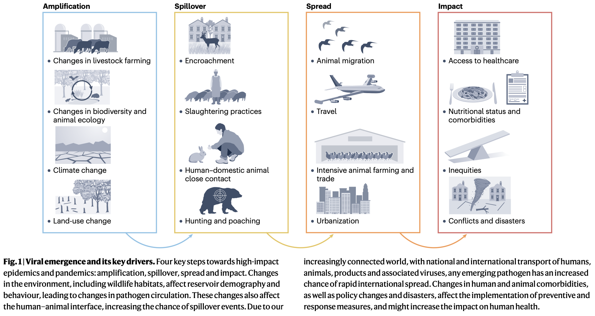
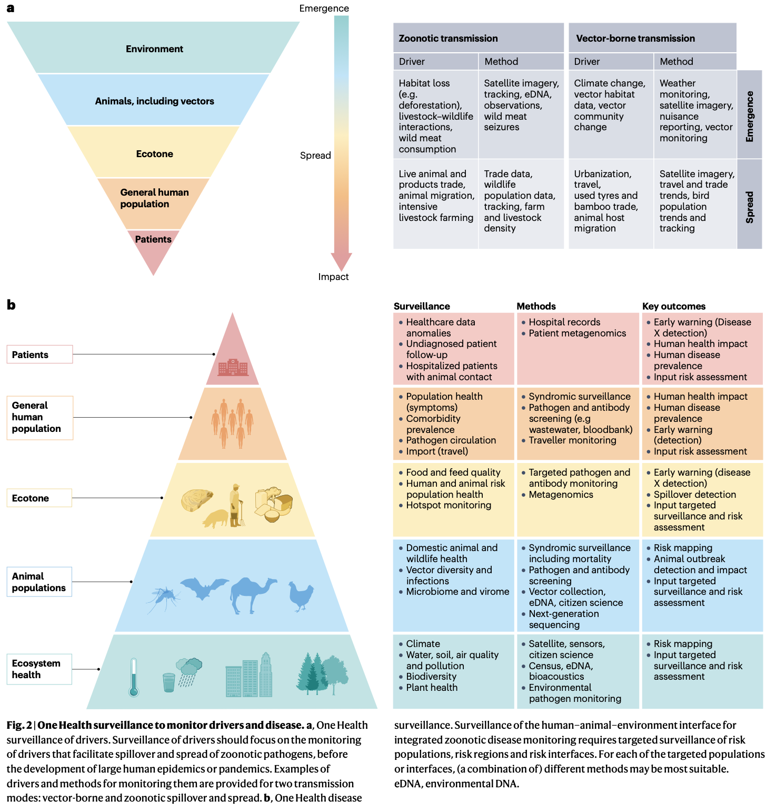

## Introduction

近几十年来，全球经历了多次新发和再发传染病疫情。最显著的是2019年开始的SARS-CoV-2全球大流行。2022年，随着IIb分支猴痘病毒的全球传播，宣布了另一起国际关注的突发公共卫生事件。另一种再发病毒奥罗普切病毒目前正在中美洲和南美洲引发疫情。

自COVID-19大流行以来，一场高致病性H5Nx禽流感疫情在家养和野生鸟类及哺乳动物中持续蔓延。该疫情导致超过3000亿只野生和家养鸟类死亡，至少70种哺乳动物报告感染。

“同一健康”是一个已存在数十年的概念，在2021年由同一健康高级别专家小组更新定义，强调人类、动物和生态系统的健康紧密相连。这一观点在新发传染病领域尤为清晰，共识认为人类与动物及共享生态系统之间相互作用的变化影响微生物和病毒在物种内和物种间的交换。

Sikkema, R.S., Koopmans, M. Viral emergence and pandemic preparedness in a One Health framework. Nat Rev Microbiol (2025). https://doi.org/10.1038/s41579-025-01243-1

当前关于新发传染病的文献和疫情防范计划大多侧重于应对人类疾病暴发。这篇综述的主要焦点是探讨是否有可能通过从根本上理解疾病涌现过程来实现溢出事件的早期预警甚至初级预防。

## 变化作为涌现的驱动因素

### 气候变化
气候变化指的是天气模式的长期转变，如气温升高和降水变化，可导致干旱、热浪、极地冰融和极端天气事件增加。这些事件进而引发更多野火、洪水事件和海平面上升。一项系统性综述评估了这些气候危害对传染病的影响，发现综述涵盖的375种传染病中，218种曾因某种气候危害而加剧。

不同的气候危害并非孤立发生，而是复杂系统的一部分，在人类和动物疾病的其他驱动因素背景下产生直接和间接健康影响。例如，极端天气事件和气温升高会影响水和土壤质量，增加人类感染食源性和水源性疾病的风险。

为应对气候变化采取的措施也会对传染病产生影响。城乡景观正在转型以应对气温升高、降水模式改变及其后续后果。例如，一些国家正在通过湿地恢复和水源缓冲区开发来改善水资源管理。然而，关于此类气候适应措施可能对人类健康造成不利影响的研究非常缺乏，特别是在传染病领域。

### 影响土地利用的因素

#### 农业变化
约71%的地球表面被归类为宜居土地，其中近一半目前用于农业。农业用地增加与世界人口增长及相关作物、肉类、牛奶和鸡蛋需求增加相一致。2022年，全球估计有15.5亿头牛、283亿只禽类和9.8亿头猪。

高数量的养殖动物导致平均养殖规模增大、人与家养动物-野生动物界面增加和普遍的土地利用变化，这些都增加了人畜共患病出现和传播的风险。例如，增加养殖规模和家禽总数增加了新型高致病性禽流感病毒出现的机会。农业用地的持续增加与森林砍伐相关，这本身已被证明是疾病出现的驱动因素。

对病原体溢出特别有意义的是野生动物的商业养殖。一篇2023年的综述显示，全球至少养殖了487种野生动物，导致野生动物病原体的传播和溢出机会大大增加。

#### 城市化
城市化改变当地土地利用，可导致当地气温升高、污染加剧，以及生物多样性和人类-动物-环境界面的变化。通常，城市扩张与生物多样性减少相关，但一些本地和入侵动物物种能适应城市环境，其种群在城市中可能增加。这些动物宿主的存在增加了人畜共患病原体的流行。

约55%的全球人口居住在城市，预计到205年这一比例将增至约68%，导致人口规模和密度增加。全球人口增长预计将主要发生在低收入和中等收入国家，可能在治理薄弱和不稳定的背景下，这将加剧贫困、不平等和贫民窟的进一步扩张。

### 旅行、迁徙和贸易
土地利用变化是疾病出现的关键驱动因素；然而，人口增长、城市化和迁徙旅行是传染病传播的重要驱动因素。迁徙和旅行导致国家内部和国家之间的人类连通性和接触率增加。过去几十年，人类存在和移动的规模和地理模式都发生了巨大变化。

流离失所者的流动通常导致人口分布和接触模式的巨大变化，大型难民营也是已知的传染病暴发热点，原因是人口密度高、来自不同地区的人口涌入、卫生条件差以及营养不良或其他增加严重疾病易感性的合并症高发。

## 基于驱动因素的溢出风险预测

### 媒介传播疾病
对于媒介传播疾病，已经进行了一些研究，试图通过生态位建模和其他统计和建模方法预测特定媒介物种的环境适宜性。全球范围内，许多虫媒病毒的影响与城市化以及伊蚊分布范围的扩大直接相关。因此，有人提议将全球适宜性地图和风险预测纳入城市规划，并针对病毒监测、疾病监测和公共卫生措施。

类似地，对蜱媒疾病发生和地理扩张的风险进行了评估，表明造林和温度以及黄颈鼠的存在影响人类中蜱传脑炎的发生，这又回溯到土地利用变化和气候变化的驱动因素。

### 人畜共患溢出热点
类似的努力试图识别人畜共患溢出的热点区域，许多研究聚焦于蝙蝠。蝙蝠被假设为重要的人畜共患病毒宿主，部分原因是翼手目物种多样性大，加上其丰度和全球分布。预测溢出风险的一种方法是模拟动物宿主分布。

当前科学文献的一个关键差距是缺乏实际的溢出数据，特别是与风险和热点分析相关的数据。尽管SARS样病毒的溢出风险已被广泛讨论，但关于溢出事件的实际定量信息非常稀少。最有可能的是，真实的风险预测需要更精细的信息，涉及当地实践，并结合关于病毒感染和暴露的实验室数据、接触率信息、动物建模和环境驱动因素。

## 同一健康监测

### 生态系统和病原体监测工具
为了更好地模拟和绘制可能的溢出热点图并设计干预措施，需要关于气候、土地利用、人和动物种群结构和移动，以及病原体流行率和暴露情况的详细纵向数据。传统实地数据收集通常耗时、费力且昂贵。因此，大多数创新集中在减少人力投入的新型可扩展采样和识别方法上。

一个例子是使用地球观测数据来监测土地利用、植物物候和气候的变化，具有连续的时空覆盖。此外，卫星数据可用于监测鸟类迁徙，并有可能用于估算野生动物种群规模。其他创新侧重于动物或植物的自动化和高通量检测方法。

关于病原体特征、存在和暴露的高质量数据对于预测模型的开发至关重要。通常，使用个体动物和人类样本来检测病原体存在，但这种方法常常伴随显著挑战。实施环境采样可以规避许多这些缺点。例如，仅通过检测在蝙蝠栖息地下发现的粪便颗粒来研究蝙蝠中的冠状病毒。

### 全社会参与方法
公民科学也越来越多地用于生成关于媒介和动物宿主丰度、水质、空气污染和许多其他人类健康的直接和间接风险因素的数据。志愿者的参与范围可以从由有能力的公民科学家进行系统监测到"大众参与"。

一个例子是"蚊子警报"，这是一项让公民参与监测蚊子种类、叮咬和繁殖地的倡议，在欧洲通过"蚊子警报"应用程序让学校和感兴趣的公民参与。其他地区也实施了使用公民报告来监测媒介和野生动物的类似项目。智能手机也用于支持医疗、兽医和公共卫生实践。

### 风险靶向监测以定位热点区域
为实现对新发人畜共患病原体的真正早期预警、风险评估和预防，可以对风险地区的动物进行病毒监测，以期在出现重大人类疾病之前检测到新型病毒。监测可以针对养殖动物群体；这可能是一种有效的研究和监测策略，因为大量动物通常被高密度饲养，这可能导致病毒广泛扩增，且它们与人类的密切接近和接触增加了溢出机会。

作为一种替代方案，可以监测频繁接触动物的人群是否存在新型和现有的人畜共患病毒，而非直接监测动物。这种方法意味着从预测转向早期预警，但通过瞄准人畜共患病出现的下一阶段，实际检测和识别人畜共患病原体的成功率会高得多。对频繁接触蝙蝠的人群，或在活禽市场或农场工作的人群，进行定期的血清学和病毒学监测组合，可成为评估和量化溢出事件风险的宝贵工具。

## 对防范的影响：早期预警与预防

### 同一健康监测与溢出预防
同一健康监测涵盖了在人类-动物-环境界面进行的监测活动。基于收集到的关于当地疾病出现和传播驱动因素的数据，采取基于风险的方法是合理的。尽管有些方案是针对特定风险人群、地点或时间而制定的，但包含这种基于风险方法的国家级或国际级监测计划非常有限。

根据当前可用的证据，实施此类基于风险的同一健康监测方案似乎是可行的。在建立这些方案时，合作分享挑战、机遇和最佳实践将非常重要。这项工作需要通过跨领域合作并纳入具有成本效益的创新数据流和广谱病原体检测方法，来改变传统的疾病监测。

通过组建具有知识、网络和背景多样性的多学科团队，可以建立更强大的研究团队，共同增进对人与动物界面病毒的理解。该策略与OHHLEP在2021年制定的新"同一健康"定义相一致。

### 障碍
人类行为在传染病预防和控制中至关重要；预防措施的采纳受到行为潜在决定因素的塑造和影响。事实证明，在疾病不存在的情况下，要实现良好的传染病预防措施依从性水平极其困难。例如，尽管马疫苗接种是预防马以及人感染亨德拉病毒的有效且众所周知的干预措施，但在澳大利亚风险地区的疫苗估计接种率仅为12%左右。

对缓解措施采纳的障碍和促进因素的研究有助于更好地实施和沟通这些措施，并提高依从性。个体变量影响缓解措施的实际实施和采纳，以及组织和系统因素。在一些国家因SARS-CoV-2疫情而引入毛皮养殖禁令的情况下，其他国家的政治优先事项偏向于水貂和狐狸养殖及穿毛皮的文化传统，而非公共卫生和动物福利。

### 综合监测与预防的成本
一个关键问题是，投资于改进的同一健康监测是否物有所值。导致大流行的溢出事件成本极高。COVID-19大流行产生了巨大影响，估计导致全球经济下降4.4%。该大流行的总经济损失估计近14万亿美元（2020-2024年）。对未来大流行成本的估计范围在每年301亿美元至5000亿美元之间。

然而，提高防范和同一健康监测也会带来相关成本。例如，一项结合了减少全球野生肉类贸易、森林砍伐和牲畜溢出以及改进监测的措施组合，估计成本在220亿至310亿美元之间。该措施组合旨在显著减少人与动物界面的疾病出现。另一方面，减少森林砍伐每年可产生40亿美元的社会效益，主要是通过减缓全球变暖和生物多样性丧失。

尽管有这些估计，但关于同一健康方法经济效益的证据很少，关于可能改变大流行风险的当前实践的成本效益分析也很少，这些分析考虑了生物多样性、健康和气候的影响。然而，最近一篇关于同一健康预防方法成本效益分析的文献综述发现了成本效益比为正的明确例子，但得出结论认为，这高度依赖于社会、文化、经济、政治和生态环境，需要在各种环境中进行评估。

## 结论
在未来几十年，问题不在于新的溢出事件是否会发生，而在于何时、何地以及发生的频率。然而，我们可以从过去几十年中吸取教训，为改进和风险靶向的任何新发病毒的早期预警做好准备，从而增加成功控制疫情的机会。

用于数据收集和监测的创新方法有助于理解同一健康三元体的所有组成部分，这些部分可能影响溢出事件和疾病出现。此外，许多驱动因素本质上是人为的，这也为调整我们当前的行为及其对人类、动物和环境健康的影响提供了机会，从而预防新的大流行。不同驱动因素之间复杂的相互作用因地区而异，这使得当地的伙伴关系和量身定制的优先事项设定至关重要。

人畜共患溢出的初级预防需要解决促进病原体在动物与人类之间传播的上游驱动因素。基于风险的同一健康监测通过进一步理解溢出路径和识别溢出风险最高的地方，在这一努力中发挥着关键作用。通过整合人类、动物和环境健康部门的数据，这种方法能够在传播发生之前检测到高风险界面。

全球同一健康和大流行防范是共同的责任，需要协作努力。在当前的政治气候下，随着对世卫组织以及国家和国际传染病控制、国际援助和传染病研究资助机制的严重预算削减和支持缺乏，这些努力可能会越来越困难。然而，加速发生的一系列疫情强化了寻找和实施全球战略的必要性，使我们能够与地球上所有其他生物共生。

## Reference
1. Sikkema, R.S., Koopmans, M. Viral emergence and pandemic preparedness in a One Health framework. Nat Rev Microbiol (2025). https://doi.org/10.1038/s41579-025-01243-1
