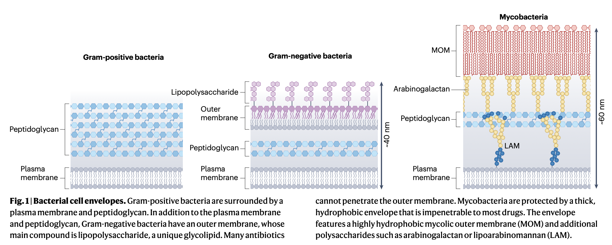
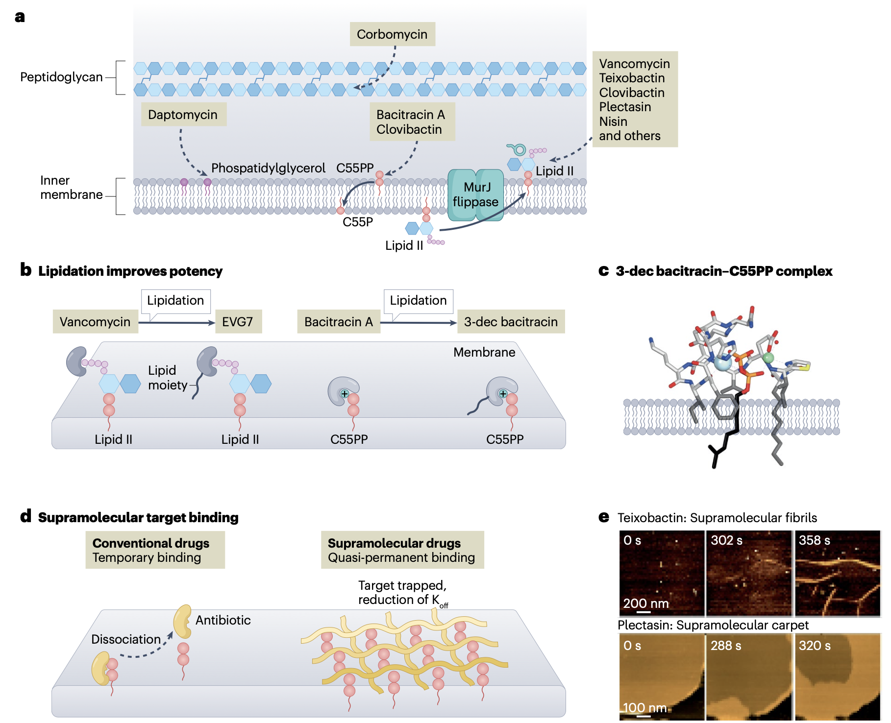
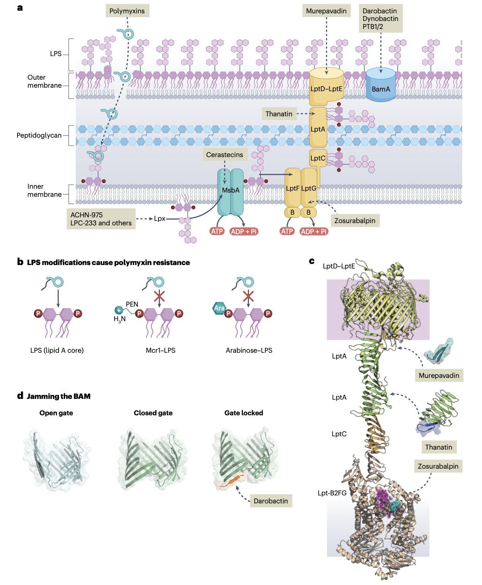
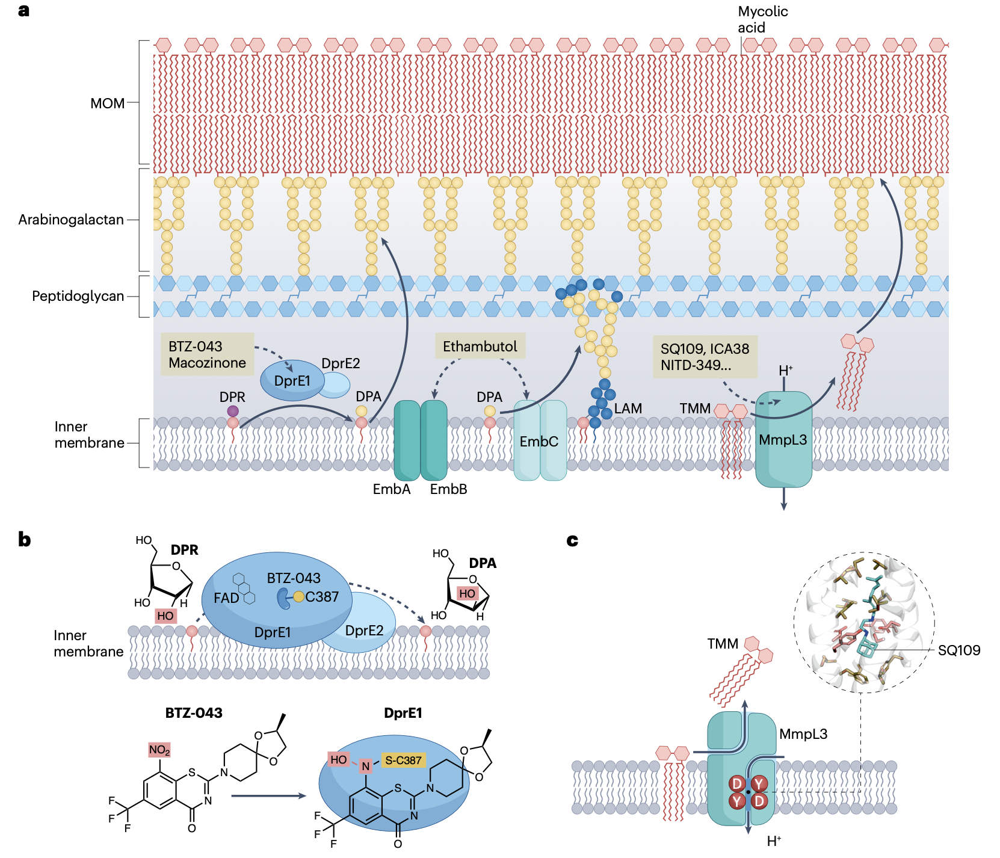

## Introduction

多重耐药菌的出现对全球健康构成严重威胁。这些细菌通常受到复杂细胞膜的保护，使许多抗生素难以穿透，形成重要的治疗障碍。靶向细菌细胞膜长期被认为是一种有效策略，具有规避药物进入和外排耐药机制的潜力。此外，许多独特的细菌膜靶点尚未在临床上得到充分开发，针对这些靶点的新化合物有望拓展抗菌机制空间，降低交叉耐药风险。特别值得关注的是靶向非蛋白质成分（如脂多糖和异戊二烯化肽聚糖前体）的化合物，由于其对耐药性发展的敏感性较低而更具吸引力。

Ntallis, C., Martin, N.I., Edwards, A.M. et al. Bacterial cell envelope-targeting antibiotics. Nat Rev Microbiol (2025). https://doi.org/10.1038/s41579-025-01247-x

本文综述了新近发现的化合物和已建立的膜靶向抗生素，涵盖靶向革兰氏阳性菌、革兰氏阴性菌和分枝杆菌的化合物，为这一临床尚未充分探索的重要治疗途径提供新的见解。

在2024年世界卫生组织发布的细菌优先病原体清单中，分枝杆菌和革兰氏阴性菌被列为最高关注级别：利福平耐药结核分枝杆菌和三种革兰氏阴性菌（碳青霉烯耐药鲍曼不动杆菌和肠杆菌目多重耐药病原体）被归类为"严重威胁"。这些顽固病原体有一个共同特征：它们都受到复杂细胞膜的保护。

从青霉素的发现开始，历史经验表明一些最成功的抗生素直接靶向细菌细胞膜。膜靶向的一个明显优势是药物无需进入细胞内部，这在竞争外排泵和药物降解酶的作用下尤为重要。攻击细胞膜还有其他吸引人的考量：虽然坚固的细胞膜阻止抗生素进入，但构建这些防御结构对细菌而言是一项复杂任务，需要专门的酶机制和必需建筑材料——这些独特成分正是抗生素可以利用的细菌"盔甲裂缝"。过去几十年，抗生素开发主要聚焦于现有抗生素的修饰，这带来快速耐药性发展的风险。细菌膜中的许多靶点仍临床开发不足，针对这些靶点的化合物具有新的化学骨架，可拓宽作用靶点和模式空间，从而降低交叉耐药可能性。此外，作用于非蛋白质膜靶点（如脂质）的抗生素通常更不易产生耐药性，因为这些非基因组编码靶点的修饰需要细菌酶机制的深刻改变。

## 革兰氏阳性菌细胞膜

革兰氏阳性菌感染仍是重要关切，特别是耐甲氧西林金黄色葡萄球菌和耐万古霉素肠球菌，因其在过去二十年中导致的死亡人数增幅最大而成为全球药物开发优先事项。

革兰氏阳性菌细胞膜由质膜和面向外部介质的厚层肽聚糖组成。与人类细胞膜的中性电荷不同，细菌质膜通常富含阴离子脂质。肽聚糖通过复杂酶机制合成，其前体分子脂质II携带一个"肽聚糖单元"。由于肽聚糖对细菌至关重要且具有特异性，许多抗生素靶向其合成或重塑相关的酶和前体分子。

脂质II循环的前体分子是最常见的抗生素靶点之一。这些前体通过十一异戊二烯磷酸锚定在质膜上。由于肽聚糖前体不直接遗传编码，针对它们的抗生素耐药性发展通常非常缓慢。最著名的临床用脂质II结合抗生素是糖肽类，以万古霉素为代表。万古霉素与脂质II五肽的D-Ala-D-Ala末端结合，阻断其掺入肽聚糖。尽管万古霉素1958年投入临床使用，但耐万古霉素肠球菌菌株30年后才被鉴定，耐万古霉素金黄色葡萄球菌的首个报告在其引入40年后才出现。

另一种策略是靶向细胞壁前体不可替代的焦磷酸部分，这可进一步延缓耐药性发展。典型例子是teixobactin，该抗生素与脂质II的焦磷酸-N-乙酰胞壁酸复合，同时其线性N端作为寡聚化支架。对于clovibactin，整合结构生物学再次揭示了超分子杀灭机制，其环状结构可有效结合多个肽聚糖前体。这种多靶点作用进一步降低了耐药频率。

超分子机制的优势在于其卓越的稳定性，显著延长抗生素与靶点接触时间。其次可增强特异性，截短的teixobactin或突变plectasin构建体显示活性显著降低。第三，铸造超分子网状结构干扰天然膜行为，对细菌产生额外压力。

肽聚糖前体仍是新型抗菌剂的有吸引力的靶点。重要任务是将对这些化合物的机制认识转化为临床候选药物。最近对临床用药杆菌肽A的研究显示，其特异性螯合肽聚糖前体C55PP，阻止其去磷酸化和回收入脂质II循环。基于晶体结构研究，合理设计的杆菌肽类似物显示出增强的抗菌活性。

糖肽corbomycin干扰肽聚糖合成和重塑，其结合肽聚糖抑制自溶素活性，从而破坏细胞壁合成。特别有趣的是达托霉素，作为钙依赖性抗生素，其机制仍存争议，但多数研究识别磷脂酰甘油为其主要结合伴侣。化学生物学研究证明磷脂酰甘油头基的立体化学对达托霉素靶点结合至关重要。

## 革兰氏阴性菌细胞膜

革兰氏阴性菌细胞膜由内膜、薄层肽聚糖和外膜组成。外膜是不对称双层，内层为磷脂，外层富含脂多糖（LPS）。LPS是独特的阴离子糖脂，通过二价阳离子桥接。LPS的疏水核心和亲水延伸的组合使得亲水和疏水化合物都难以扩散通过外膜，形成强大的渗透屏障。

### 靶向LPS

少数抗生素能以高亲和力直接靶向外膜LPS。除无需进入细胞外，这些抗生素通常还能透化外膜，使通常无法进入革兰氏阴性菌的抗生素能够进入，开辟额外治疗途径。最重要的LPS结合抗生素是多粘菌素类，其中多粘菌素B和多粘菌素E（粘菌素）用于临床。这些抗生素通常在对MDR病原体唯一敏感的"最后手段"治疗中使用。

多粘菌素抗生素靶向脂质A，破坏LPS分子间的阳离子桥，导致外膜不稳定和透化。最新工作识别出多粘菌素与脂质A结合的三个不同状态：初始瞬时相互作用、抗生素插入膜内、以及超化计量积累。随后抗生素触发大量LPS释放，损害外膜屏障功能，使抗生素能够进入周质空间靶向内膜LPS。

多粘菌素耐药可通过自发功能获得性突变或获得移动粘菌素耐药基因发生。自发耐药通常通过脂质A磷酸基团修饰介导，而这些修饰可能通过稳定外膜而非阻断抗生素结合来发挥作用。

应对耐药策略包括新型联合疗法和多粘菌素类似物开发。Macolacin作为结构不同于多粘菌素B/E的类似物，对获得性或固有耐药菌株均显示活性。同时，在降低肾毒性方面也取得进展，三个多粘菌素类似物已进入I期临床试验。

### 靶向LPS合成和运输

LPS在几乎所有革兰氏阴性菌中的必要性引发了对靶向其合成或运输的兴趣。LPS合成途径，特别是LpxC，已成为新抗菌剂靶点。最新工作聚焦LpxH，基于先前抑制剂研究和新结构研究设计了有效抑制剂。LPS合成后通过MsbA运输，该靶点也受到药物开发关注。

LPS通过Lpt系统从内膜运输到外膜，这一ATP驱动的电梯系统吸引越来越多治疗关注。Murepavadin是靶向铜绿假单胞菌LptD的大环肽。最近，zosurabalpin显示靶向LptB2FG复合体， trapping LPS在转运蛋白内。同时，昆虫宿主防御肽thanatin靶向Lpt系统，破坏LptA相互作用和LptD功能。

### 干扰BAM及其他新蛋白靶点

BamA是β-桶组装机器的核心部分，负责外膜蛋白折叠和插入。Darobactin显示对革兰氏阴性菌良好活性，其肽骨架与BamA侧向门形成β-折叠，阻断底物结合。类似结合模式被dynobactin肽使用。嵌合肽将多粘菌素支架与murepavadin支架结合，后者直接与BamA相互作用。

其他新抗生素包括靶向LolCDE复合体的lolamicin，以及优化型arylomycin G0775，抑制I型信号肽酶。这些开发依赖于积累规则的合理应用，实现革兰氏阴性病原体内的有效积累。

## 分枝杆菌细胞膜

分枝杆菌是主要致死因素，仅结核分枝杆菌每年导致150万人死亡。分枝杆菌感染治疗通常漫长且涉及多药联用，增加不良反应风险。治疗复杂性源于多个挑战，包括某些分枝杆菌为胞内病原体、肉芽肿形成等。所有分枝杆菌共有的复杂性是其巨大的细胞膜，保护菌体免受抗生素进入。

分枝杆菌膜由两个双层界定，内膜含磷脂和分枝杆菌特有的磷脂酰肌醇甘露糖苷糖脂。霉菌酸外膜由霉菌酸组成，这些长链脂肪酸形成极疏水双层。与大肠杆菌相比，某些非结核分枝杆菌菌株对亲水分子的通透性降低十倍以上，这与耐药性增加相关。

霉菌酸作为海藻糖酯穿梭跨膜，最终形成MOM外层，而内层包含与阿拉伯半乳糖酯化的霉菌酸。阿拉伯半乳糖又通过磷酸二酯键与肽聚糖的胞壁酸共价连接。脂阿拉伯甘露糖增强膜结构，该脂聚糖锚定在内膜磷脂酰肌醇甘露糖苷上，发挥局部细胞壁完整性作用。

抗结核药物发现焦点是DprE1，该周质酶催化底栖醇磷酸核糖转化为底栖醇磷酸阿拉伯糖。DPA是活化阿拉伯糖供体，阿拉伯半乳糖和LAM生物合成的关键前体。目前几种DprE1抑制剂正在进行临床试验。BTZ-043利用硝基与DprE1形成共价加合物，最近完成II期临床试验。非共价抑制剂TBA-7371和OPC-167832也进入临床试验。

另一个重要抑制剂是乙胺丁醇，靶向Emb阿拉伯糖基转移酶家族。高分辨率结构显示乙胺丁醇类似结合所有三种Emb蛋白，与DPA阿拉伯糖部分竞争活性位点。

干扰霉菌酸生物合成是既定策略。当前焦点是分枝杆菌膜大蛋白3（MmpL3），该整合膜转运蛋白驱动海藻糖单霉菌酸跨内膜运输。最临床先进的化合物SQ109靶向MmpL3狭窄跨膜口袋，阻断质子转位通路。

此外，肽聚糖及其生物合成是验证靶点。某些靶向质膜肽聚糖前体的药物对分枝杆菌显示良好活性。必需转肽酶LdtMt2是某些β-内酰胺的潜在靶点。肽聚糖合成似乎是结核分枝杆菌药物开发的有吸引力的靶点。

## 结论与展望

细胞膜作用抗生素最近作为治疗途径受到增加关注。这些化合物提供重要优势，因为其靶点可直接从外部接近，规避跨膜挑战。此外，细菌膜中许多独特靶点临床开发不足，针对这些靶点的化合物有望拓宽抗菌机制空间，降低交叉耐药风险。

近年来，在创新药物发现技术推动下，针对MDR细菌的新膜作用化合物发现激增。下一阶段将涉及推进这些有前景的新化合物。对此，我们对许多新发现抗生素具有详细机制和分子理解，这些知识将为药物化学提供重要信息。

然而，对膜靶向药物的分子知识仍然稀缺。获得小药物-脂质复合物数据可能需要整合结构生物学方法的创新。类似地，细胞膜分子结构仍有许多需要了解，这些知识对设计更好药物大有裨益。eNTRy规则的建立成功应用于合理转化仅靶向革兰氏阳性菌的化合物为广谱抗生素。建立类似规则对分枝杆菌高度可取。

总之，细胞膜靶向抗生素为疾病控制提供令人兴奋的途径。创新方法和更深分子见解将是克服当前限制、释放新发现化合物全部潜力的关键。

## Reference
1. Ntallis, C., Martin, N.I., Edwards, A.M. et al. Bacterial cell envelope-targeting antibiotics. Nat Rev Microbiol (2025). https://doi.org/10.1038/s41579-025-01247-x