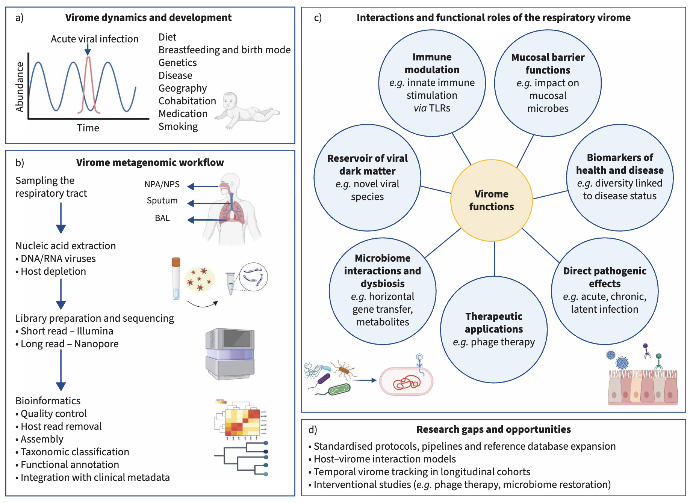
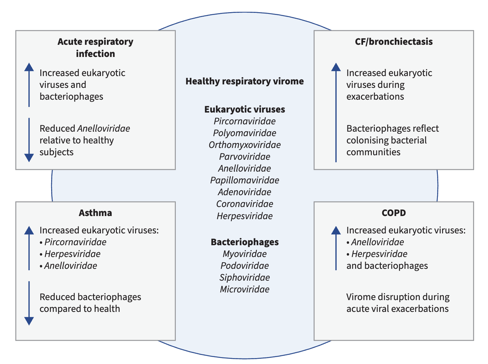

## Introduction

人类微生物组是指栖息在身体不同解剖部位的多种微生物群落，包括细菌、真菌、古菌和病毒。与真菌（真菌组）和细菌（细菌组）一起，这个生态系统的病毒组成部分被称为病毒组（术语表见表1）。病毒组包括感染人类细胞的真核病毒、感染细菌、真菌或古菌宿主的病毒，以及整合的逆转录病毒元件，还有非人类宿主的病毒，如植物病毒，通常通过环境暴露或饮食获得。人类病毒组从出生开始建立，具有时间动态性，并且在丰度、多样性和组成上在不同解剖部位之间表现出异质性。呼吸道病毒组受环境因素影响，包括饮食、地理、年龄、出生方式和母乳喂养。

尽管肺部微生物组研究进展迅速，但呼吸道病毒组的研究仍然稀缺，留下了关于病毒种群如何与宿主免疫和微生物群落在呼吸道健康和疾病中相互作用的空白。对其他身体系统（如肠道）病毒组的研究先于呼吸道。病毒组组成的改变或病毒组失调已与多种疾病相关，如糖尿病、炎症性肠病和恶性肿瘤。

尽管“无菌肺部”的概念早已被推翻，但我们对呼吸道病毒组的理解仍然落后于细菌组。传统的PCR技术彻底改变了我们检测特定已知呼吸道病毒的能力，但主要强化了对致病病毒（如流感、呼吸道合胞病毒和冠状病毒）的狭隘关注。这些病毒在临床上很重要，导致急性呼吸道感染和慢性肺病的病毒性加重，但它们只代表了呼吸道中存在的病毒多样性的一小部分。

宏基因组下一代测序（mNGS）能够无偏倚地检测样本中所有病毒遗传物质，不仅揭示了已建立的病原体，还揭示了在健康和疾病期间存在的共生、短暂或潜伏病毒。这种更广泛的视角揭示了新的和意想不到的病毒组成员，如Anelloviridae，它们在健康个体中高度普遍，但临床意义不确定。区分共生和致病微生物越来越被认为是复杂的，因为它们在健康和疾病中的生态重叠和上下文依赖性作用。宏基因组方法还强调了病毒、其他微生物和宿主免疫系统之间潜在的跨界相互作用，人们对这种相互作用如何调节疾病风险和结果的兴趣日益增长。

SARS-CoV-2大流行促进了全球对病毒监测和测序基础设施的投资，强调了理解不仅单个病毒，还有病毒相互作用、共感染及其对免疫反应和疾病严重性影响的重要性。然而，大部分呼吸道病毒组，尤其是在患有慢性肺病的成人中，仍然未知，病毒组研究在数量和质量上仍然落后于细菌组研究。

超越以病原体为中心的模型，人们越来越有兴趣将呼吸道病毒组概念化为一个动态的生态系统，受宿主、微生物和环境因素影响，具有影响免疫基调、疾病易感性和治疗反应的潜力。本综述探讨了宏基因组方法在表征病毒组方面的潜力，特别关注健康和呼吸道疾病（包括急性呼吸道感染、COPD、哮喘、囊性纤维化和支气管扩张）中的呼吸道病毒组。

Purcell, M., Ackland, J., Staples, K.J., Freeman, A., and Wilkinson, T.M.A. (2025). The respiratory tract virome: unravelling the role of viral dark matter in respiratory health and disease. Eur. Respir. Rev. 34. https://doi.org/10.1183/16000617.0284-2024.

这篇综述评估了当前的见解、临床应用以及病毒组研究中固有的技术和概念挑战，同时强调了新兴机会和未来的发现方向。

**表1 用于表征呼吸道病毒组的术语表**

| 术语 | 描述 |
|------|------|
| 病毒组 | 特定环境中所有病毒的总和，包括真核病毒、噬菌体和病毒衍生的遗传元素 |
| 病毒暗物质 | 宏基因组研究中无法与任何已知参考基因组匹配的病毒序列部分 |
| 噬菌体 | 感染细菌的病毒 |
| 宏基因组下一代测序 (mNGS) | 对样本中所有遗传物质进行高通量测序，无需培养或特异性探针 |
| 元转录组学 | 对样本中所有RNA转录本进行测序，分析基因表达和RNA病毒 |

## 病毒暗物质和噬菌体
表征病毒组仍然具有挑战性，因为从宏基因组研究中回收的大量病毒序列无法与任何已知参考基因组匹配，这种现象称为“病毒暗物质”。根据使用的样本类型、方法和分析流程，这种未分类部分可能占总病毒读长的40-90%。

病毒暗物质源于几个因素，包括病毒的巨大遗传多样性、高突变和重组率、短或碎片化序列的回收，以及公共数据库中环境和宿主相关病毒的代表性有限。其他因素包括缺乏通用标记基因（如细菌中的16S rRNA）、由于技术挑战导致RNA病毒代表性不足，以及低丰度病毒基因组的组装不良。宿主遗传物质的污染可能进一步掩盖检测，而一些病毒作为原噬菌体整合到宿主基因组中，使其难以区分。许多未分类序列可能还包含功能未知的基因或辅助代谢基因，这些基因模仿宿主过程，难以用标准数据库识别。远非微不足道的伪影，病毒暗物质可能反映了一个生物学上重要的病毒多样性库，包括新的真核病毒和以前未表征的噬菌体。

病毒暗物质的大部分被认为是噬菌体组成。这些噬菌体不仅仅是被动实体；它们遗传多样，可能在塑造微生物生态、调节宿主免疫和介导微生物间相互作用中发挥关键作用。虽然呼吸道中的直接证据仍在出现，但来自其他身体部位的研究支持噬菌体可能有助于微生物稳态和失调的假设，强调了它们在呼吸道健康和疾病中的潜在相关性。

**表2 与呼吸道病毒组相关的噬菌体功能总结**

| 功能 | 描述 |
|------|------|
| 调节细菌群落 | 通过裂解和溶原性循环影响细菌丰度和多样性 |
| 基因转移 | 通过转导促进抗生素抗性基因和毒力因子的水平转移 |
| 免疫调节 | 噬菌体颗粒可直接与宿主免疫系统相互作用，调节炎症反应 |
| 屏障保护 | 某些噬菌体可与黏液结合，减少细菌定植 |
| 代谢重编程 | 噬菌体可能携带辅助代谢基因，改变宿主细菌的代谢途径 |

## 宏基因组呼吸道病毒组分析的挑战
mNGS表征样本中所有遗传物质，包括人类、细菌和病毒。虽然这种全面和无偏倚的方法提供了对复杂生态系统的前所未有的洞察，但也引入了显著的技术和分析挑战。研究设计期间做出的关键决策，如采样策略、样本处理、测序平台选择和分析流程，可能影响一系列因素，包括潜在偏差、数据质量、可重复性和下游解释的准确性。

病毒组特别呈现独特的方法学挑战，因为病毒基因组类型（双链DNA、单链DNA、双链RNA和单链RNA）和结构（线性、环状或分段）的多样性。由于呼吸道的解剖和微生物复杂性，采样策略和部位选择可能深刻影响呼吸道病毒组数据的质量、可解释性和情境化。尽管研究人员付出了巨大努力，但仍然缺乏标准化方法，不仅在病毒组特定研究中，而且在呼吸道微生物组研究中也是如此，这些挑战更加突出。

### 呼吸道采样 - 何处、何时以及如何？
加剧mNGS技术和分析挑战的是呼吸道的复杂和动态性质，它由不同的解剖隔室组成。它分为上呼吸道（鼻咽和口咽）和下呼吸道（气管、下呼吸道和肺部），这些部位持续暴露于环境中的微生物。下呼吸道的定植通过微吸入和黏膜迁移发生，通过宿主免疫和黏液纤毛清除达到平衡。因此，肺部微生物组是短暂的，由微生物迁移、消除和生长之间的动态相互作用塑造。下呼吸道中微生物的生长和持久性还取决于当地环境条件，包括温度、氧气可用性、pH值和营养水平，以及宿主因素如咳嗽反射和气道结构。微生物群落组成在不同解剖区域之间变化，具有部位特异性和重叠种群，这增加了选择采样方法、时间和部位的复杂性。病毒种群是否存在类似的时间和空间模式尚不清楚。

呼吸道的不同区域采样可能具有挑战性。病毒趋向性的差异可能影响整个呼吸道检测到的病毒，取决于采样位置。即使在单个解剖部位内，也存在不同的生态位，采样技术的选择可能影响捕获的微生物多样性。非侵入性方法，如鼻咽拭子或洗涤和痰诱导，常用于临床环境，但可能无法准确代表疾病中的下呼吸道。而侵入性采样，包括支气管肺泡灌洗液和保护性标本刷，提供更直接的下气道访问，但这种采样资源密集且侵入性。鉴于气道的连续性，鼻咽采样被认为是下呼吸道的代理，许多呼吸道病毒组研究至今使用这种样本类型进行。

### 宏基因组研究中的污染挑战
呼吸道样本通常产生低微生物生物量，与其他身体部位相比。微生物群落的丰度和多样性在呼吸道远端进一步减少，导致尽管侵入性采样，产量较低。这些因素可能放大污染风险，对生成稳健和可重复的病毒组数据构成主要障碍。污染物可能导致新病毒的误识别。例如，研究报告了最初被认为是新病毒发现的案例，后来追溯到提取试剂的污染。

样本污染可能发生在宏基因组研究的整个过程中。采样期间，下气道标本可能被上气道微生物污染，因为仪器穿过更高生物量的上呼吸道。处理期间，污染物可能源自DNA提取或富集试剂盒（称为“试剂盒组”）、试剂或消耗品、技术人员或机器的处理，或暴露于环境空气。这些污染物可以通过分析解决，通常通过使用阴性对照进行计算机去除。然而，孔和管之间的交叉污染可能导致阴性对照污染（称为“飞溅组”），这可能导致去除真正的低丰度微生物，这些微生物可能是采样生态位的关键生态特征。因此，研究不仅需要考虑精心设计的对照，还需要在整个处理和样本处理阶段考虑实验设计以减少污染。为解决和减轻污染影响，Eisenhofer等人提出了RIDE清单，一个专门为低微生物生物量研究制定的最低标准指南。

**表3 整个工作流程中病毒组研究面临的技术挑战**

| 步骤 | 挑战 |
|------|------|
| 采样 | 低生物量、解剖部位变异、污染风险 |
| 核酸提取 | 病毒颗粒破裂困难、宿主DNA污染、试剂污染 |
| 文库制备 | 扩增偏差、RNA病毒降解、序列偏好性 |
| 测序 | 读长限制、嵌合序列、批次效应 |
| 生物信息学分析 | 数据库不完整、组装错误、病毒暗物质分类困难 |

**表4 宏基因组研究中潜在的污染源**

| 污染源 | 描述 |
|------|------|
| 采样污染 | 上呼吸道微生物污染下呼吸道样本 |
| 试剂污染 | 提取试剂盒、酶、缓冲液中的核酸污染 |
| 环境污染 | 实验室环境、气溶胶、操作人员污染 |
| 交叉污染 | 样本间交叉污染、测序板孔间污染 |

## 研究病毒组的创新方法

为了克服上述挑战，并更深入地探索病毒组的功能，该领域正在不断开发和采用一系列创新的技术与方法。

在湿实验技术层面，长读长测序技术（如Oxford Nanopore和PacBio）的成熟应用，能够产生更长的DNA序列读长，这对于组装完整的病毒基因组、解析复杂的重复区域以及识别病毒群体内的遗传变异（准种）具有巨大优势。靶向富集策略（例如使用探针捕获病毒序列）能够在测序前特异性富集病毒核酸，从而显著提高对低丰度病毒的检测灵敏度，尽管这可能引入一定的偏好性。此外，单细胞病毒组学技术允许研究人员在单个细胞的分辨率下分析病毒感染情况，从而能够精确地将病毒与其特定的宿主细胞（人类细胞或细菌细胞）联系起来，揭示病毒-宿主的相互作用网络。空间转录组/基因组学则能在组织原位保留病毒和宿主细胞的空间位置信息，帮助理解病毒感染在病灶部位的分布模式。

在生物信息学与数据分析层面，新的算法和工具正在不断涌现。机器学习与人工智能方法被用于改进病毒序列的识别和分类，特别是在挖掘“病毒暗物质”方面显示出潜力。多组学整合分析（如将病毒组数据与宿主转录组、蛋白质组或代谢组数据相结合）为系统性地理解病毒如何影响宿主生理和疾病进程提供了强大的视角。

尽管技术进步迅猛，但推动标准化和可重复性仍然是当务之急。研究界正在努力建立针对病毒组研究的报告指南和质量控制标准（如针对低生物量研究的RIDE清单），以期提升整个领域的严谨性。同时，对公共数据库中已有宏基因组数据进行大规模的重新分析，也是一种经济有效且能产生新发现的重要途径。

## 健康呼吸道中的病毒组

我们对健康呼吸道病毒组的认知，目前主要来源于那些在针对各类呼吸疾病的研究中被设置为“健康对照”的个体。这些研究共同描绘出一个多样化且动态的病毒生态系统。

宏基因组分析表明，健康呼吸道中存在的病毒种类十分丰富，主要包括真核病毒和噬菌体两大类别。有趣的是，一些荟萃分析发现，健康个体的呼吸道病毒组多样性可能高于某些疾病状态下的患者，这可能暗示了一种与健康相关的、更复杂的病毒群落结构。在真核病毒中，指环病毒科（Anelloviridae，例如扭矩泰诺病毒TTV）尤为引人注目。它们是在健康儿童和成人呼吸道中普遍存在且通常丰度最高的真核DNA病毒，但其并未被证实会引起任何疾病，因此被广泛视为潜在的“共生病毒”。此外，一些典型的呼吸道病原体（如鼻病毒、腺病毒、季节性冠状病毒等）也时常在无症状个体的样本中被检测到，这可能反映了短暂的、被有效免疫控制的无症状感染或定植状态。

毫无疑问，噬菌体是健康呼吸道病毒组的绝对主力军，其测序读长数往往占据总病毒读长的绝大部分。健康气道中检测到的噬菌体家族主要包括有尾噬菌体目下的肌尾噬菌体科、长尾噬菌体科和短尾噬菌体科等。它们的群落组成在很大程度上是其宿主——细菌群落的“镜像”，因此，呼吸道噬菌体组的结构可能间接反映了肺部细菌生态系统的健康和稳定状态。

### Anelloviridae - 呼吸道共生体？
Anelloviruses是小的、多样化的单链DNA病毒，于1997年首次识别，没有确认的致病性。Anelloviridae家族包括扭矩泰诺病毒（TTV），它们经常在呼吸道样本中检测到，有时代表最丰富的真核DNA病毒。儿童中的纵向采样显示个体在上呼吸道携带独特和持久的“anellome”。Anelloviruses在有和没有急性呼吸道感染或肺炎的儿童中常见检测到，但没有证明因果关系。鼻和血浆样本中的TTV丰度与哮喘和支气管扩张儿童的气流阻塞和疾病严重性相关。在COPD中，TTV在加重期间的痰中普遍存在，增加的TTV负荷与严重COVID-19结果相关。

新兴证据表明Anelloviridae可能调节宿主免疫并有助于慢性疾病轨迹。TTV已被证明在体外刺激炎症细胞因子产生，循环TTV DNA越来越被探索作为免疫能力的生物标志物。Redondoviridae，另一个新的环状DNA病毒家族，也在危重病中以高丰度检测到，与细菌群落变化和疾病严重性相关。健康和呼吸道疾病中的进一步时间宏基因组研究将确定这些新DNA病毒在肺健康和呼吸道疾病发病机制中的作用。

## 呼吸道疾病中的病毒组

### 急性呼吸道感染（ARI）
急性呼吸道感染是研究病毒组动态的一个典型场景。mNGS研究清晰地揭示，在ARI期间，患者呼吸道样本中真核病毒的多样性和总负荷通常显著增加。常见的病原病毒家族，如小RNA病毒科（鼻病毒）、正粘病毒科（流感病毒）、副粘病毒科（RSV、偏肺病毒）、冠状病毒科等，被高效地检测出来。与此同时，指环病毒科病毒也持续存在，并且其丰度与疾病严重程度和宿主免疫状态密切相关，例如在住院的COVID-19患者中往往更高。

除了真核病毒，噬菌体的群落也会在ARI期间发生改变。有研究发现，在反复发生呼吸道感染的儿童中，特定噬菌体（如丙酸杆菌噬菌体）的丰度会升高，并且与某些血清炎症因子相结合，能够预测反复感染的风险。在COVID-19中，噬菌体的总体丰度也被发现与疾病严重性相关。这些发现提示，病毒组作为一个整体（包括真核病毒和噬菌体）的生态失调，可能是急性感染病理过程的一部分，而不仅仅是由单一病原体驱动的。

### 囊性纤维化（CF）和支气管扩张
对于这类以慢性细菌定植、持续炎症和反复急性加重为特征的疾病，病毒组（尤其是噬菌体）的作用尤为关键。研究表明，CF患者的呼吸道病毒组具有高度的个体异质性和不稳定性，与相对健康的个体相比，其核心病毒组特征不明显。CF患者的痰液中富含与慢性定植菌（如铜绿假单胞菌、伯克霍尔德菌）相关的噬菌体。这些噬菌体通过溶原性循环整合在细菌染色体中，不仅可能影响细菌的丰度和行为，更重要的是，它们可以通过转导作用，在不同细菌之间水平转移抗生素耐药基因和毒力基因，从而加速病原体的适应性进化，给治疗带来巨大挑战。病毒组特征已被发现与急性加重的频率相关，使其成为有潜力的预后生物标志物和新型治疗靶点（如噬菌体疗法）。

### 哮喘
病毒感染是诱发哮喘急性加重的明确因素。近年来，研究发现即使在稳定期哮喘患者中，其呼吸道病毒组也与健康人存在差异。例如，成人哮喘患者的痰液样本中可能表现出噬菌体多样性的降低，以及疱疹病毒科等真核病毒的富集，这些变化与哮喘的严重程度和加重风险相关。在儿童哮喘中也观察到类似趋势。一种假说认为，噬菌体多样性的减少可能削弱了其对细菌群落的正常调节能力，从而导致或加剧了细菌菌群失调，进而影响了气道炎症环境。病毒组与宿主免疫系统之间存在着复杂的双向相互作用，其在哮喘不同内型中的具体角色是未来研究的重要方向。

### 慢性阻塞性肺疾病（COPD）
病毒感染是导致COPD急性加重的主要诱因之一。在稳定期COPD中，研究发现其呼吸道病毒组的多样性随着疾病严重程度的增加而呈现下降趋势。吸烟作为COPD的主要风险因素，也被发现会改变病毒组的组成，例如导致靶向变形菌门的噬菌体富集。特别有趣的是，研究不仅关注肺部，还发现COPD患者的肠道病毒组也发生了改变，并且与全身性炎症标志物相关，这提示病毒组可能通过“肠-肺轴”等远程机制参与COPD的全身性炎症和疾病进展。在急性加重期间，病毒组群落会发生剧烈变动，但其中的因果关系和机制仍有待阐明。

## 结论
呼吸道病毒组仍然是气道微生物组中一个表征不足的组成部分，新兴证据表明它在健康和疾病中都发挥着重要作用。虽然研究一致地在气道样本中检测到多样化的真核病毒和噬菌体，但对其功能、宿主相互作用和时间动态的理解仍存在重大空白。病毒暗物质的概念凸显了病毒组中 vast 未分类部分以及当前数据库的局限性。噬菌体可能塑造微生物生态、免疫反应和宿主代谢，但在呼吸道背景下的研究仍然很少。噬菌体作为生物标志物或治疗剂的潜力，特别是在慢性定植和反复加重的环境中，值得更密切的研究。然而，迄今为止的发现受到样本量小、方法差异和不一致报告的限制，使得采样、测序和分析流程的标准化对于实现研究间比较至关重要。

新兴技术，如靶向富集、单细胞病毒组学、长读长测序和空间图谱，以及机器学习和多组学整合，为加深我们对病毒组功能和动态的理解提供了有希望的途径。展望未来，多组学方法，包括元转录组学和宿主反应分析，提供了揭示病毒组在疾病中作用的机制见解的机会。重要的是，这些努力应嵌入更广泛的生态框架中，该框架将病毒组与细菌、真菌和宿主因素整合，以全面捕捉呼吸道健康和疾病的复杂性。从以病原体为中心的检测转向病毒组的生态表征，可能为呼吸医学中的诊断、风险分层和精准治疗开辟新途径。

### 未来研究问题
- 如何标准化和优化宏基因组方法，以全面表征呼吸道病毒组，包括DNA和RNA病毒，并将其与更广泛的微生物组分析整合，跨越不同人群和临床环境？
- 共生病毒和噬菌体在塑造宿主免疫和影响呼吸道感染及慢性肺病发病机制中扮演什么角色？
- 纵向、多组学研究能否在病毒组动态与呼吸道疾病的发作、进展或加重之间建立因果关系？
- 如何应用系统生物学和功能基因组学来模拟病毒组-宿主-微生物组相互作用，并发现新的治疗靶点？

**表5 推动病毒宏基因组学领域进展的创新方法概述**

| 方法 | 描述 | 挑战 | 潜在影响 | 示例工具 |
|------|------|------|----------|----------|
| 长读长测序 | 可产生长读长，有助于病毒基因组完整组装和准种分析 | 错误率相对较高，成本高 | 改善病毒基因组组装和变异检测 | Oxford Nanopore, PacBio |
| 靶向富集 | 使用探针富集病毒序列，提高检测灵敏度 | 需要先验知识，可能引入偏差 | 提高低丰度病毒检出率 | ViroCap, Twist |
| 单细胞病毒组学 | 在单细胞水平分析病毒与宿主相互作用 | 技术复杂，通量低 | 揭示病毒-宿主互作机制 | 10x Genomics, Drop-seq |
| 空间转录组学 | 在组织原位分析病毒分布 | 分辨率限制，数据分析复杂 | 理解病毒在组织中的分布 | 10x Visium, Slide-seq |
| 机器学习 | 应用算法改进病毒识别和分类 | 需要高质量训练数据 | 增强新病毒发现能力 | DeepVirFinder, ViraMiner |

## Reference
1. Purcell, M., Ackland, J., Staples, K.J., Freeman, A., and Wilkinson, T.M.A. (2025). The respiratory tract virome: unravelling the role of viral dark matter in respiratory health and disease. Eur. Respir. Rev. 34. https://doi.org/10.1183/16000617.0284-2024.
