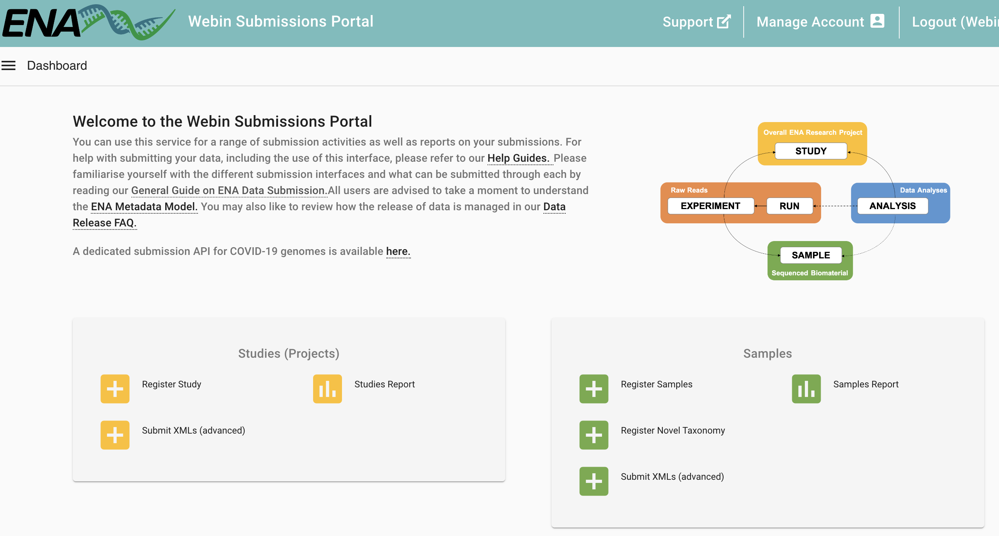
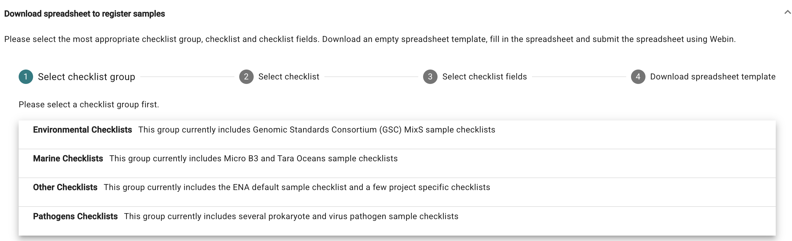
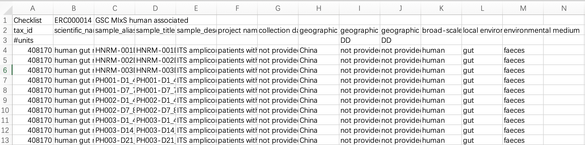
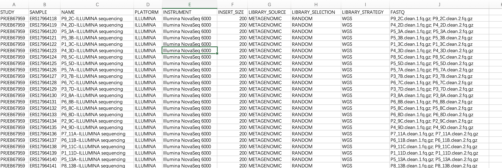
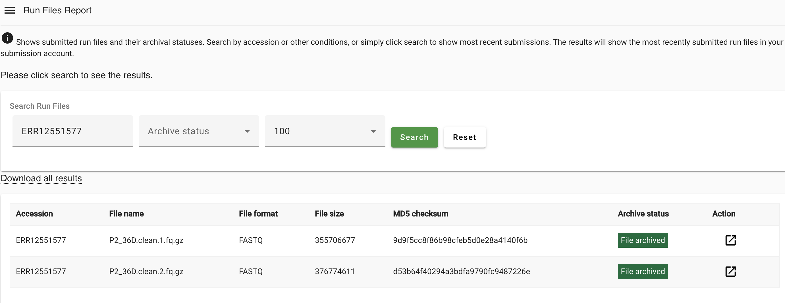

## Introduction

很早之前写了一个上传测序数据到ENA的小教程，但是用的人不多，大部分研究还是直接上传到NCBI，会自动同步到ENA。

但最近因为资金短缺，NCBI各种业务暂停维护，但大家投文章又很着急满足杂志社的数据公开政策，ENA就成了重要的一个选择（上传到国内的CNGB有些杂志和审稿人不认可，唉。。。），所以在此更新一下上传的步骤。

European Nucleotide Archive (ENA) 是一个由欧洲分子生物学实验室 (EMBL) 欧洲生物信息学研究所 (EBI) 维护的公共数据库。ENA 收集、存储和提供核酸序列数据，是全球生物学和生物信息学研究的重要资源之一。以下是 ENA 的几个关键点：

1. **数据收集和存储**：ENA 接收并存储来自全球各地的核酸序列数据。这些数据包括DNA和RNA的序列，以及相关的元数据，如序列的来源、生物学特征和实验信息。

2. **数据访问**：ENA 提供公开访问接口，允许研究人员和公众免费下载和检索数据。用户可以通过网页界面、编程接口 (API) 和批量下载工具访问数据。

3. **数据整合**：ENA 与其他主要的生物序列数据库（如美国的GenBank和日本的DDBJ）合作，确保数据在全球范围内的整合和共享。这种合作被称为国际核酸序列数据库协作 (INSDC)。

4. **数据提交**：研究人员可以向 ENA 提交他们的核酸序列数据。ENA 提供了详细的指南和工具，帮助研究人员提交数据并确保数据的质量和一致性。

5. **用途广泛**：ENA 中的数据被广泛用于各种生物学研究领域，包括基因组学、转录组学、宏基因组学和进化生物学等。

### Submission

由于项目需要，我们要把测序原始数据上传至ENA数据库。在此以宏基因组的双端fastq测序文件的提交流程为例，讲解具体步骤。

官方教程：
<https://ena-docs.readthedocs.io/en/latest/submit/general-guide.html>

在 European Nucleotide Archive (ENA) 提交数据时，现在还是有三种不同的提交方式，每种方式适用于不同类型的数据提交。
根据你的需求，可能需要使用一种或多种提交方式：

1. **交互式提交 (Interactive Submissions)**：
   - **方法**：通过在浏览器中直接填写网页表单，并下载可以离线填写的模板电子表格，然后将其上传到 ENA。
   - **适用场景**：这是最易于访问的提交方式，适合大多数用户，尤其是那些不熟悉命令行或编程的用户。
   - **优点**：操作简单，界面友好，适合初次提交或数据量较少的提交者。

2. **命令行提交 (Command Line Submissions)**：
   - **方法**：使用 ENA 的专用程序 Webin-CLI 进行提交。这个工具可以在提交之前完全验证你的数据，确保数据的准确性和完整性。
   - **适用场景**：适合需要高控制力和数据验证的用户，特别是有一定技术背景的用户。
   - **优点**：提供最大化的控制和数据验证，适合批量提交和大规模数据。

3. **编程提交 (Programmatic Submissions)**：
   - **方法**：通过准备 XML 文档来完成提交，可以使用 cURL 程序或 Webin Portal 将数据发送到 ENA。
   - **适用场景**：适合需要自动化提交的用户，尤其是那些有编程能力并且需要频繁提交数据的用户。
   - **优点**：支持自动化和高效的数据提交流程，适合大规模数据和高频率的提交需求。

我们这里使用的是**1+2方法**，这样是最通用，灵活且方便的流程。
使用网页注册project和sample，再使用Webin-CLI提交数据。

## Install Webin-CLI

使用 Webin-CLI 提交数据到 European Nucleotide Archive (ENA) 需要按以下步骤进行。确保你已经安装了 Java 1.8 或更高版本，并下载了最新版本的 Webin-CLI。

- 步骤 1: 安装 Java

如果你还没有安装 Java，请从以下链接下载并安装 Java 1.8 或更新版本：
[下载 Java](https://java.com/en/download/)

检查版本：

```bash
java -version
```

- 步骤 2: 下载 Webin-CLI

从 GitHub 下载最新版本的 Webin-CLI，现在是9.0.1了（2025-11-11）：
[下载 Webin-CLI](https://github.com/enasequence/webin-cli/releases)

在终端或命令行中使用 `java` 命令运行 Webin-CLI。
运行 Webin-CLI 并显示帮助信息：

```bash
java -jar ~/biosoft/webin-cli-9.0.1.jar -help
```

```bash
java -jar webin-cli-9.0.1.jar [-ascp] [-fields] [-help] [-sampleUpdate]
                              [-submit] [-test] [-validate]
                              [-validateFiles] [-version]
                              [-centerName=CENTER] -context=TYPE
                              [-inputDir=DIRECTORY] -manifest=FILE
                              [-outputDir=DIRECTORY]
                              [-password=PASSWORD] [-passwordEnv=VAR]
                              [-passwordFile=FILE] -userName=USER
```


| 参数                                   | 说明                                                                                                                                                               |
| ------------------------------------ | ---------------------------------------------------------------------------------------------------------------------------------------------------------------- |
| `-context=TYPE`                      | 提交类型。可选值包括：`genome`（基因组）、`transcriptome`（转录组）、`sequence`（序列）、`polysample`（多样本）、`reads`（测序读段）、`taxrefset`（分类参考集）。                                                 |
| `-manifest=FILE`                     | manifest 文件路径（文本文件），其中包含文件路径及元数据字段。                                                                                                                              |
| `-userName`, `-username=USER`        | Webin 提交账户名或邮箱地址。                                                                                                                                                |
| `-password=PASSWORD`                 | Webin 提交账户的密码。                                                                                                                                                   |
| `-passwordFile=FILE`                 | 包含 Webin 账户密码的文件。                                                                                                                                                |
| `-passwordEnv=VAR`                   | 环境变量名，变量中存储 Webin 账户密码。                                                                                                                                          |
| `-inputDir`, `-inputdir=DIRECTORY`   | manifest 文件中声明的文件所在的根目录。默认使用当前工作目录。                                                                                                                              |
| `-outputDir`, `-outputdir=DIRECTORY` | 输出文件的根目录。输出目录的结构为：`<context>/<name>/<validate,process,submit>`。默认使用 manifest 文件所在目录。`<name>` 为 manifest 文件中定义的唯一名称。验证报告（validation reports）将写入 `<validate>` 子目录。 |
| `-centerName`, `-centername=CENTER`  | 仅对于代理账户（broker accounts）是必填项。                                                                                                                                    |
| `-validate`                          | 仅验证文件，不上传、不提交。                                                                                                                                                   |
| `-validateFiles`                     | 所有 manifest 字段变为可选项，仅用于验证测序文件，无需提供元数据。                                                                                                                           |
| `-submit`                            | 验证、上传并提交文件。                                                                                                                                                      |
| `-test`                              | 使用测试提交服务（test submission service）。                                                                                                                               |
| `-ascp`                              | 若系统安装了 Aspera CLI 并在 PATH 中，可使用 Aspera 代替 FTP 上传文件。                                                                                                              |
| `-help`                              | 显示帮助信息并退出。                                                                                                                                                       |
| `-fields`                            | 显示所有或特定 context 支持的 manifest 字段。                                                                                                                                 |
| `-version`                           | 输出版本信息并退出。                                                                                                                                                       |
| `-sampleUpdate`                      | 若样本已存在，则更新该样本信息。                                                                                                                                                 |


- 退出代码（Exit codes）

| 代码  | 含义                     |
| --- | ---------------------- |
| `0` | 成功（SUCCESS）            |
| `1` | 内部错误（INTERNAL ERROR）   |
| `2` | 用户错误（USER ERROR）       |
| `3` | 验证错误（VALIDATION ERROR） |


## Reads submission

准备好软件后，我们就可以开始提交流程了：


### Stage 1: Pre-register Study and Sample

首先进入官网[The European Bioinformatics Institute < EMBL-EBI](https://www.ebi.ac.uk/ena/submit/webin/login)，这里一般实验室有自己的账号，登陆。

我们会进入这个页面：



1. 注册study 

点击Register Study，按要求填写研究名，计划的释放时间（后续也可以更改），保存好我们的project id文件。里面有形如“PRJEB76945”的Project id，我们一般也是把这个id放在文章的data availability里面即可。

2. 注册sample

点击Register Samples，然后“Download spreadsheet to register samples”。



这一步要根据自己数据去下载一个checklist（tsv），用excel打开按要求填好每一个sample的信息，注意不要删掉本来的内容。比如：

- taxid：可在这里查询<https://www.ebi.ac.uk/ena/browser/view/408169?show=tax-tree>。比如我们是环境样本，空气就是Taxon: 655179
- scientific_name：air metagenome
- sample_alias, sample_title, sample_description, project name
- 有些是有填写格式的，比如时间，经纬度要注意

注意看看每一列的说明，关键是Validation，要确保填的内容满足需求，比如“collection date”这列会用下面的正则表达式验证：

```
 (^[12][0-9]{3}(-(0[1-9]|1[0-2])(-(0[1-9]|[12][0-9]|3[01])(T[0-9]{2}:[0-9]{2}(:[0-9]{2})?Z?([+-][0-9]{1,2})?)?)?)?(/[0-9]{4}(-[0-9]{2}(-[0-9]{2}(T[0-9]{2}:[0-9]{2}(:[0-9]{2})?Z?([+-][0-9]{1,2})?)?)?)?)?$)|(^not applicable$)|(^not collected$)|(^not provided$)|(^restricted access$)|(^missing: control sample$)|(^missing: sample group$)|(^missing: synthetic construct$)|(^missing: lab stock$)|(^missing: third party data$)|(^missing: data agreement established pre-2023$)|(^missing: endangered species$)|(^missing: human-identifiable$)|(^missing$) 
```
说明我们要么填严格的时间格式，要么填“not applicable”等等。填完后如下



把这个tsv点“Upload filled spreadsheet to register samples”上传回去，系统会检查有效性，如果有报错就按照要求重新修改下。最后提交好后就有每个sample的ACCESSION了。

### Stage 2: Prepare the Files

首先测序原始fastq文件需要进行压缩(.fq.gz):

```bash
for i in `ls *.fq`
do
echo ${i}
gzip $i -c > ${i}.gz
done
```

#### manifest files

作为提交的一部分，每个刚刚注册的Sample（一个单端测序文件，或一对双端测序文件）都必须使用一个清单manifest文件描述。

manifest文件使用Webin-CLI的`-manifest <filename>`参数指定，每个manifest文件需包含以下内容：

- 通用实验信息
    - Study accession or unique name (alias)
    - Sample accession or unique name (alias)
    - Experiment name
    - Sequencing platform
    - Sequencing instrument
    - Library name (optional)
    - Library source
    - Library selection
    - Library strategy
    - Free text library description (optional)
    - Insert size for paired reads (optional)
- 测序文件，以下的一项
    - BAM file
    - CRAM file
    - Single Fastq file
    - Paired Fastq files
    - Multi-fastq files

单独填写每一个样本的manifest文件比较麻烦，可以用一段简单的R脚本帮助编写：

首先，根据我们之前注册时已经得到的信息整理出一个excel（列名不要改变，FASTQ这列如果是双端就用`; `隔开）：




``` r
# manifest for ENA
fq_submit=readxl::read_excel("Checklist_GSC-MIxS_human_associated_NULL.xlsx")%>%as.data.frame()
dir.create("manifest")
for (i in seq_len(nrow(fq_submit))) {
  df=fq_submit[i,]
  filename=paste0(df[,"SAMPLE"],"_manifest")
  tmp=c()
  for (i in seq_len(ncol(df))) {
    name=colnames(df)[i]
    value=df[1,i]
    if(grepl(";",value))value=strsplit(value,";\\s")[[1]]
    tmp=c(tmp,paste0(name,"\t",value))
  }
  writeLines(tmp,file.path("manifest/",filename),sep = "\n")
}
```

这样会在manifest文件夹下生成每一个样本的manifest文件，内容如下：

```
STUDY   PRJEB67959
SAMPLE  ERS17964118
NAME    P9_2C-ILLUMINA sequencing
PLATFORM    ILLUMINA
INSTRUMENT  Illumina NovaSeq 6000
INSERT_SIZE 200
LIBRARY_SOURCE  METAGENOMIC
LIBRARY_SELECTION   RANDOM
LIBRARY_STRATEGY    WGS
FASTQ   P9_2C.clean.1.fq.gz
FASTQ   P9_2C.clean.2.fq.gz
```

### Stage 3: Validate and Submit Files

终于到了上传的这一步了，ENA建议在上传前先用`-validate`验证清单文件中定义的文件（只验证不提交）。

我们拿一个样本试一试，填自己的用户名和密码，没问题：

```bash
i=ERS17964118_manifest
java -jar ~/biosoft/webin-cli-9.0.1.jar -context reads \
	-userName Webin-XXXXX -password XXXXXXX \
	-manifest ${i} \
	-outputDir test_submit_out \
	-inputDir ./ \
	-validate
```

正式提交，用for循环提交每一个样本(`-submit`也会在提交前验证)：

```bash
for i in `ls manifest/*_manifest`
do
    echo "Processing: $i"
    echo "Start time: $(date +'%Y-%m-%d %T')"
    
    # 执行上传命令，并捕获退出状态码
    java -jar ~/biosoft/webin-cli-9.0.1.jar -context reads \
    	-userName Webin-XXXXX -password XXXXXXX \
    	-manifest ${i} \
    	-outputDir test_submit_out \
    	-inputDir ./ \
    	-submit
    
    # 检查上传是否成功（退出状态码 0 表示成功）
    if [ $? -eq 0 ]; then
        echo "Upload SUCCESS: $i"
        mv "$i" "${i}_done"  # 仅在上传成功后重命名
    else
        echo "Upload FAILED: $i (文件未重命名)"
    fi

    echo "End time: $(date +'%Y-%m-%d %T')"
    echo "----------------------------------"
done
```

上面那个命令validate可以执行并通过，但默认是ftp协议传输，如果你的提交没问题那就跳过下面ascp这部分：

#### -ascp submit
我使用默认的ftp好像有点问题，进度条都没有，应该是我们服务器的问题。

那就试一下`-ascp`参数，但是我之前装好的ascp不能用了，好像是最近aspera改过一次：

```
ascp: /lib/libc.so.6: version `GLIBC_2.28' not found (required by ascp)
ascp: /lib/libc.so.6: version `GLIBC_2.25' not found (required by ascp)
```

没办法，重装，官网下载安装没用，应该是服务器配置不匹配。

只能试试conda，`conda install -c hcc aspera-cli -y`。
虽然很慢，但最后conda安装的可以用。

加上`-ascp`参数，大功告成，上传速度也非常快：

```bash
for i in `ls manifest/*_manifest`
do
java -jar ~/biosoft/webin-cli-9.0.1.jar -context reads \
	-userName Webin-XXXXX -password XXXXXXX \
	-manifest ${i} \
	-outputDir test_submit_out \
	-inputDir ./ \
	-submit -ascp
mv ${i} ${i}_done
done
```

最后，我们可以回到官网页面：[The European Bioinformatics Institute < EMBL-EBI](https://www.ebi.ac.uk/ena/submit/webin/login)。点击左侧的Dashboard，再点击Raw Reads里的Runs Report，就可以查看每一个样本提交状态了，没问题：



在所有文件成功提交后，等到我们设定的释放时间，project就会自动公开，可以搜索到项目页面。但按照我之前上传的经验，大概过几天后（可能后台系统审核什么的），对应的reads才会公开出来。

## Assemblies submission

上传每个宏基因组样本的assembly（Primary Metagenome，Binned Metagenome和MAG）方法也类似，前面的注册Study和Sample相当于我们已经完成了，不过最后的Manifest文件的内容跟raw reads data不太一样。

这里讲一下我们经常会组装得到的contigs和binning得到MAGs上传方法。

### Contigs

所谓“初级宏基因组组装”（primary metagenome assembly）指的是：尚未进行分箱 (binning)，直接从一个样本生境或多个样本生境集合中拼出的宏基因组组装，没有尝试拆分不同物种/分类群。

#### 第 1 阶段：预注册研究和环境样本

每次提交必须关联一个已预注册的研究 (study) 和一个环境样本 (environmental sample)。该样本应当与用于生成你的原始读段 (raw reads) 的样本一致。

在注册环境样本时，请保证选择了适当的环境检查表 (environmental checklist)，并使用一个环境分类号 (environmental taxon)（例如水生宏基因组 aquatic metagenome，tax id: 1169740）
关于研究/样本注册的方法与其他研究/样本注册流程相同。请参考其对应链接。

强烈建议你同时提交并引用用于生成组装的原始读段 (raw reads)。为关联这些读段，请在 manifest 文件中使用 `RUN_REF` 标签。这里填我们上面上传reads时对应样本的run accession即可。

#### 第 2 阶段：准备文件

提交所需的文件通过 manifest 文件指定。使用 `-manifest <filename>` 选项来提供该文件。
一次初级宏基因组组装提交包括以下文件：

* 一个 manifest 文件
* 一个 FASTA 格式的文件

##### Manifest 文件

该 manifest 文件为两列格式，以制表符 (tab) 或任何空白字符分隔：

* 第一列：字段名（field name，大小写不敏感）
* 第二列：字段值 (field value)
  以下是支持的 metadata 字段：
    * `STUDY`：研究 accession 或唯一别名 (alias)
    * `SAMPLE`：环境样本 accession 或唯一别名 (alias)
    * `ASSEMBLYNAME`：唯一的组装名称
    * `ASSEMBLY_TYPE`：填 “primary metagenome”
    * `COVERAGE`：估计的测序覆盖深度
    * `PROGRAM`：拼装程序名称
    * `PLATFORM`：测序平台，或以逗号分隔的多个平台
    * `MINGAPLENGTH`：最小连续 N 长度被视为缺口 (optional)
    * `MOLECULETYPE`：选 “genomic DNA”, “genomic RNA” 或 “viral cRNA” (optional)
    * `DESCRIPTION`：组装的自由文字描述 (optional)
    * `RUN_REF`：逗号分隔的运行 (run) accession 列表 (optional)

以下是支持的文件名字段：

* `FASTA`：以 FASTA 格式提供序列文件

**示例 manifest 内容**：

```
STUDY   TODO  
SAMPLE  TODO  
RUN_REF TODO  
ASSEMBLYNAME   TODO  
ASSEMBLY_TYPE  primary metagenome  
COVERAGE   TODO  
PROGRAM   TODO  
PLATFORM  TODO  
MINGAPLENGTH  TODO  
MOLECULETYPE   genomic DNA  
FASTA  primary_metagenome.fasta.gz
```

#### 第 3 阶段：验证并提交文件

**提交命令**：

注意要通过参数 `-context genome`，其他命令参数一致。

```bash
webin-cli -username Webin-XXXXX -password YYYYYYY -context genome -manifest manifest.txt -submit
```

- 组装名称验证 (Assembly name validation)
    * 匹配正则模式 `^[A-Za-z0-9][A-Za-z0-9 _#-.]*$`（即首字符为字母或数字，后续字符可包括字母、数字、空格、下划线、井号、减号或点号）
    * 不超过 50 个字符
    * 不能包含被拼装生物体的分类学名称
    
- 序列验证 (Sequence validation)
    * 序列名称在一个组装内必须是唯一的
    * 序列长度至少要 20 bp
    * 序列末端不能有 N 字符
    * 序列只能由以下碱基字符组成：‘a’, ‘c’, ‘g’, ‘t’, ‘u’, ‘b’, ‘d’, ‘h’, ‘k’, ‘m’, ‘n’, ‘r’, ‘s’, ‘v’, ‘w’, ‘y’


### MAGs

在 ENA 中，Metagenome-Assembled Genome（MAG）定义为：基于一个或多个已分箱（binned）的宏基因组（metagenome）所得的、单一分类群（single-taxon）组装，该组装被断言为接近一个真实个体基因组（可能匹配已有的纯培养菌株，或者代表一个新发现的菌株）。

MAG 提交按照与纯培养/分离菌株基因组相同的层级处理，并在 INSDC 中以相同方式分布。
由于环境样本中可能存在多个同种的基因组重复，而且 MAG 组装更容易受到污染（contamination）影响，因此我们要求只提交每个物种在其生态系统（biome）中**最高质量、唯一代表**的 MAG。

建议在提交 MAG 前，先提交所有的低一级组装（即先提交原始读段、初级宏基因组组装、分箱结果等）。这样 MAG 提交可以突出显示从分箱宏基因组集合中派生出的“最佳代表”组装，并且确保所用方法具有可复现性。

基因组组装提交（genome assembly submissions）可包括：质粒（plasmids）、细胞器（organelles）、完整病毒基因组（complete virus genomes）、病毒片段／复制子（viral segments/replicons）、噬菌体（bacteriophages）、原核（prokaryotic）和真核（eukaryotic）基因组。
一个 MAG 通常包括以下内容：

* 通用组装信息，例如：研究 (study) accession 或唯名 (alias)、MAG 样本 accession／唯名、组装名称 (assembly name)、组装程序 (assembly program)、测序平台 (sequencing platform)、最小缺口长度 (minimum gap length)、分子类型 (molecule type)、测序覆盖度 (coverage)、自由文本描述 (optional)。
* Contig／Chromosome 序列
* （可选）功能注释 (functional annotation) 
  注：在此文档中，“chromosome”一词可理解为包括细胞器、质粒、病毒片段。

#### 第 1 阶段：预注册研究、样本及低级组装

每次 MAG 提交必须关联一个已预注册的研究 (study) 和一个 MAG 样本 (MAG sample)。
在注册研究 (study) 时，如果你打算提交注释（annotation）内容，需确保在此阶段注册基因座标签前缀 (locus tag prefixes)。
建议你在提交 MAG 前，先提交所有低一级的宏基因组组装和原始读段，以便记录方法并提高可复现性。

每个 MAG 组装提交必须关联一个 MAG 样本。原因在于：MAG 并不是采自环境样本中**全部数据**的组装，将其挂在环境样本下可能引起错误的分类学归属 (taxonomy assignment)。

这些 MAG 样本代表由环境样本派生出来的单个有机体 (organism) 子集，并承载其所有与分类学、方法相关的元数据。

注册时，MAG 样本应尽可能给出具体分类学信息，并使用 Genomic Standards Consortium (GSC) 的 MIMAGs (checklist) 规范。

请确保 MAG 样本正确地引用其派生自哪一个环境样本，例如：

> “This sample represents a MAG derived from the metagenomic sample ERSXXXXX” 
> 如果你仅提交 MAG 而不提交其低级组装或读段，也应注册一个环境样本，并在 MAG 样本中引用该环境样本。

#### 第 2 阶段：准备文件

提交所需的文件通过一个 manifest 文件指定。使用 `-manifest <filename>` 参数。
提交 MAG 所需文件依组装层级 (assembly level) 而定，常见层级为 “Contig assembly” 或 “Chromosome assembly”。

Contig Assembly层级包括：

* 一个 manifest 文件
* 一个 FASTA 文件 **或者** 一个 flat file（EMBL-Bank 格式）
  若序列数少于 2 或多于 1,000,000 会产生错误。若你的组装仅为单一序列且质量很高，应考虑提交为 Chromosome assembly。若未达到完全组装染色体标准但认为质量足够提交为 MAG，也可向帮助台申请标为 ‘single contig’ 组装。

Chromosome Assembly层级包括：

* 一个 manifest 文件
* 一个 FASTA 文件 **或者** 一个 flat file
* 一个 chromosomes list 文件
* 可选 0-1 个 unlocalised list 文件（当有未定位序列时）


序列名在一个提交中必须唯一，并且在 FASTA／flat 文件、chromosome list 文件中应一致引用。

##### Manifest 文件

manifest 文件为两列格式（字段名／值），用制表符或空白分隔。字段名称不区分大小写。
支持的 metadata 字段包括：

* `STUDY`：研究 accession 或唯一别名(alias) 
* `SAMPLE`：MAG 样本 accession 或唯一别名(alias) 
* `ASSEMBLYNAME`：唯一的组装名称 
* `ASSEMBLY_TYPE`：填写 “Metagenome-Assembled Genome (MAG)” 
* `COVERAGE`：估计的测序覆盖度 
* `PROGRAM`：组装程序名称 
* `PLATFORM`：测序平台／多个平台用逗号分隔 
* `MINGAPLENGTH`：视为缺口的最小连续 N 长度 (optional) 
* `MOLECULETYPE`：可选，“genomic DNA”, “genomic RNA”, 或 “viral cRNA” 
* `DESCRIPTION`：组装的自由文本描述 (optional) 
* `RUN_REF`：逗号分隔的运行 (run) accession 列表 (optional) 

支持的文件名字段包括：

* `FASTA`：FASTA 格式序列文件 
* `FLATFILE`：EMBL-Bank 格式 flat 文件 
* `AGP`：AGP 格式文件（如果适用） 
* `CHROMOSOME_LIST`：染色体清单文件（仅 Chromosome assembly） 

**示例 manifest 文件** ：

```
STUDY        TODO  
SAMPLE       TODO  
RUN_REF      TODO  
ASSEMBLYNAME TODO  
ASSEMBLY_TYPE Metagenome-Assembled Genome (MAG)  
COVERAGE     TODO  
PROGRAM      TODO  
PLATFORM     TODO  
MINGAPLENGTH TODO  
MOLECULETYPE genomic DNA  
FASTA        metagenome_assembled_genome.fasta.gz
```

#### 第 3 阶段：验证并提交文件

**提交命令示例**：

注意要通过参数 `-context genome`，其他命令参数一致。

```bash
webin-cli -username Webin-XXXXX -password YYYYYYY -context genome -manifest manifest.txt -submit
```

#### 分配编号 (Assigned accession numbers)

一旦组装提交完成，通过 Webin-CLI 会立即分配一个分析 (analysis) accession，格式为 ERZxxxxxx，提交者可即时获取。
但 ERZ accession 不应用于论文中引用。它主要用于提交者在 Webin 系统中引用其提交。
可用于长期稳定引用的 accession 包括：
    * 研究 accession（如 PRJEBxxxxx） — 在研究注册时分配。
    * 样本 accession（如 SAMEAxxxxxx） — 在样本注册时分配。
    * 基因组组装 accession（如 GCA_xxxxxxx） — 在组装完全处理后分配。
    * 序列 accession(s) — 在组装完全处理后分配。

- 样本与研究验证 (Sample and Study Validation)
    * 一个研究 (study) 与一个样本 (sample) 的配对必须是唯一的（一个组装对象不能重复使用相同研究+样本已被用过）。
    * 样本的分类学归属必须在 NCBI 分类树中为 **物种级别或以下**（species rank 或下一级）或等效级别。
- 组装名称验证 (Assembly name validation)
    * 名称必须满足正则表达式： `^[A-Za-z0-9][A-Za-z0-9 _#-.]*$`（即首字符为字母或数字，后续字符可为字母、数字、空格、下划线、井号、减号或点号）。
    * 长度不得超过 50 字符。
    * 不能包含被组装生物体的分类学名称。
- 染色体名称验证 (Chromosome name validation)
    * 名称必须满足正则表达式： `^[A-Za-z0-9][A-Za-z0-9_#-.]*$`。
    * 长度必须少于 33 字符。
    * 名称中（不区分大小写）不得包含以下任何词： “chr”, “chrm”, “chrom”, “chromosome”, “linkage group”, “linkage-group”, “linkage_group”, “plasmid”。
    * 名称必须在本组装中唯一。
- 序列验证 (Sequence validation)
    * 序列名称在一个组装内必须唯一。
    * 序列长度至少为 20 bp。
    * 序列末端不能有 ‘N’ 字符。
    * 序列只能由以下碱基字符组成： ‘a’, ‘c’, ‘g’, ‘t’, ‘u’, ‘b’, ‘d’, ‘h’, ‘k’, ‘m’, ‘n’, ‘r’, ‘s’, ‘v’, ‘w’, ‘y’。
