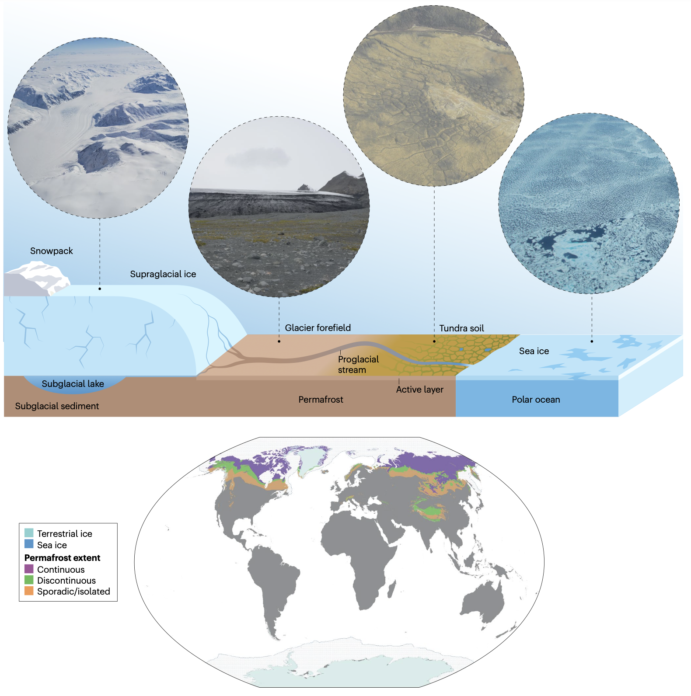
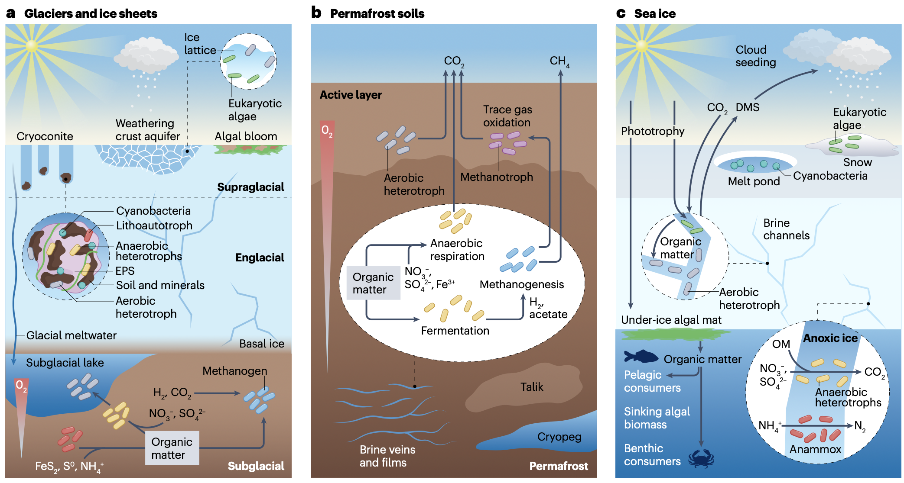
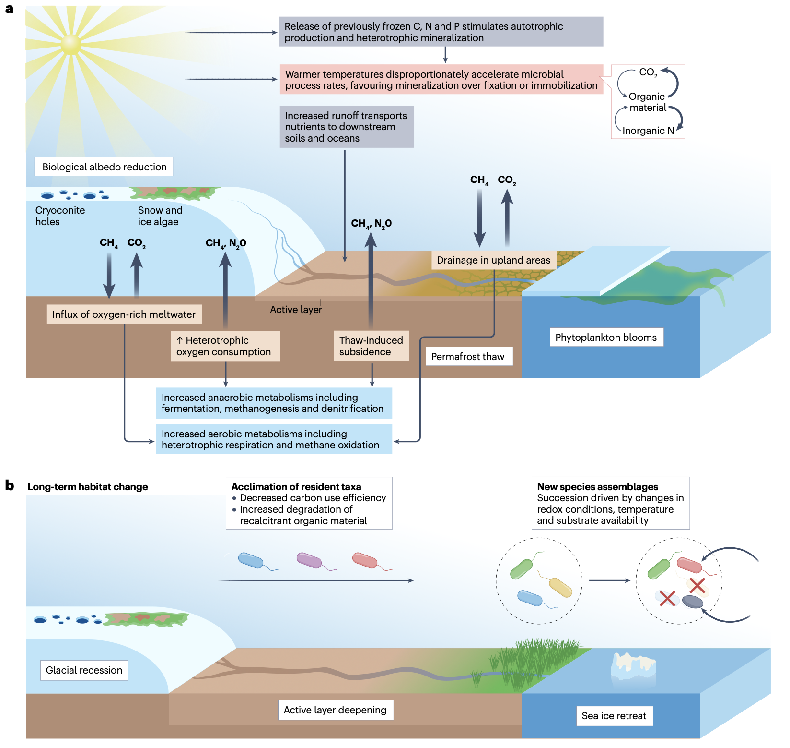
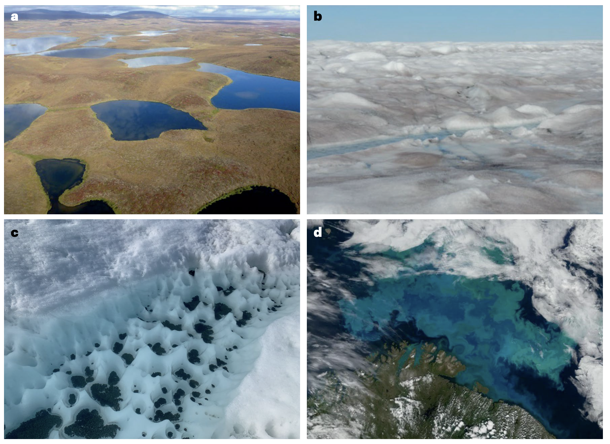

## Introduction

寒冷环境，包括冰川、冰盖、多年冻土和海冰，在地球表面广泛分布，构成了全球冰冻圈的重要组成部分。尽管生命在零度以下的低温环境中面临严峻挑战，但全球冰冻圈却孕育着令人惊叹的微生物多样性。这些微生物群落是冰冻圈生态系统功能的核心驱动者，在其他生物难以存活的极端条件下，主导着关键的生物地球化学循环过程。然而，持续的气候变化，尤其是在极地地区产生放大效应的气候变化，正以前所未有的方式威胁着冰冻圈微生物群落的组成、代谢功能及其赖以生存的冰冻圈生境本身。

Sugden, S., Davis, C.L., Quinn, M.W. et al. Current and projected effects of climate change in cryosphere microbial ecosystems. Nat Rev Microbiol (2025). https://doi.org/10.1038/s41579-025-01251-1

这篇综述旨在系统梳理各类冰冻圈生境的特征，深入解析其微生物群落的独特组成、功能及其对极端环境的适应性机制。在此基础上，本文将重点阐述气候变化如何通过改变底物可用性、酶反应动力学、氧化还原电位等物理化学因子，在短期和长期尺度上影响这些微生物群落，并评估这些生态变化对局部乃至全球生态系统和气候系统的潜在后果。最后，本文将指出现有认知中的关键知识空白，以期为预测和应对未来变化提供科学依据。

> 一个概括性极地生态系统的示意图和照片，其中包括冰盖、冰川及相关的冰川前缘、附近的多年冻土与活性层土壤，以及有海冰覆盖的海洋。这些生态系统共同覆盖了地球表面的相当大部分。地图显示了全球冰盖和冰川的分布、海冰中位最大范围（1981-2010年）以及连续（覆盖90-100%的景观）、不连续（覆盖50-90%的景观）和零星（覆盖<50%的景观）多年冻土的分布范围。

冰冻圈是指地球表层所有以固态水形式存在的组成部分，主要分布于地球的南北两极以及高海拔山区。这些冰冻生态系统并非生命的禁区，而是众多具备独特冷适应生理机制的微生物的家园，它们代表了地球生命在低温环境下的生存极限。随着分子生物学技术，特别是宏基因组学、宏转录组学等组学方法的飞速发展，科学家们得以逐渐揭开冰冻圈微生物世界的神秘面纱，日益认识到它们在全球生物地球化学元素循环（如碳、氮、硫循环）中扮演着不可或缺的角色。

然而，全球气候系统的快速变暖正对冰冻圈造成颠覆性影响。观测数据显示，北极地区的变暖速率远超全球平均水平，这直接导致了冰川与冰盖的加速消融、多年冻土的大范围退化以及海冰覆盖面积的急剧缩减。这些变化不仅改变了微生物生存的物理基质，更通过一系列复杂的反馈机制，影响着整个生态系统的结构和功能。微生物作为冰冻圈食物网的基石，其群落的任何扰动都可能产生自下而上的级联效应，进而影响更高营养级的生物。更值得关注的是，冰冻圈历史上作为重要碳汇的功能可能发生逆转，在微生物作用下释放大量温室气体（如二氧化碳和甲烷），进一步加剧全球变暖。因此，深入理解气候变化背景下冰冻圈微生物生态系统的动态响应，不仅是生态学研究的前沿课题，更是准确预测地球系统未来变化的关键所在。

## 冰冻圈微生物群落

> a, 冰川和冰盖通常分为冰上、冰内和冰下生态系统，它们具有不同的物理和地球化学胁迫因素。在冰上表面，主要的初级生产者包括风化壳中的真核藻类和冰尘穴中的蓝细菌；冰尘穴是由蓝细菌胞外聚合物（EPS）粘结细粒土壤和矿物形成的聚集体。冰上系统的大部分生产力发生在夏季，此时更长的光周期和更温暖的温度支持了季节性藻华和冰尘穴的扩张。冰内生态系统中的微生物活动仍然知之甚少。在冰下系统中，异养和产甲烷群落依赖于遗留有机质、来自冰上融水的养分输入、岩石自养生产以及磨蚀产生的H2来维持。氧气在许多冰下湖泊中支持有氧呼吸，但当水从富氧的湖泊流向下伏沉积物时，微生物呼吸和有限的气体交换耗尽了可用氧气，形成了从有氧到无氧条件的梯度。在这些日益缺氧的沉积物中，来自冰川融水和下伏基岩的氮、铁和硫化合物作为厌氧呼吸和产甲烷作用的替代电子供体和受体。 b, 多年冻土土壤分为季节性融化的活性层（以有氧代谢为特征，例如呼吸和微量气体氧化）和永久冻结的多年冻土层（其中古老冻结的有机质支持使用硝酸盐、硫酸盐或铁作为电子受体的厌氧呼吸）。当其他电子受体不可用时，会发生发酵以及氢营养型和乙酸裂解型产甲烷作用。大多数多年冻土微生物群落栖息在薄卤水脉或称为冷冻盐池的较大包裹体中，这些地方的水因凝固点降低而保持未冻结状态。多年冻土内永久不冻结的土壤层称为融区。 c, 海冰（可能全年存在或每年冻融）在微生物群落组成和功能活动方面也表现出显著的垂直和季节变化。冰下和冰边缘水华发生在早春和夏季，而当光合作用活动更受限且有机质（OM）的异养呼吸消耗了可用氧气时，厌氧代谢（例如反硝化作用、硫酸盐还原和厌氧氨氧化）变得更加普遍。在海冰内部，大多数微生物活动发生在薄卤水通道中，藻类生产为需氧异养生物提供碳。许多海冰藻类和细菌产生二甲硫醚（DMS），它能形成硫酸盐气溶胶从而增强云的形成，而藻类衍生的碳支持下层的远洋生态系统。

### 冰川和冰盖生境

冰川和冰盖是冰冻圈最显著的标志，其微生物栖息地可根据空间位置划分为三个相互关联的子系统：冰上环境、冰内环境和冰下环境。

**冰上环境** 主要包括冰川表层风化壳及其上的积水结构，如冰尘穴。风化壳是冰面因融化再冻结形成的多孔层，其下可能存在含水层。冰尘穴则是由于深色沉积物（冰尘）吸收太阳辐射，局部融化冰体形成的孔洞，被认为是冰川表面生物活性最高的“热点”。生活于此的微生物需要应对强烈的日际和季节间温度波动、高强度的紫外辐射以及水分可用性的剧烈变化。为了适应这种极端环境，它们演化出了诸如合成光保护色素（如类胡萝卜素）和分泌胞外聚合物等策略。在营养极度贫乏的冰上生态系统中，光能自养微生物，包括真核藻类（在风化壳中优势）和蓝细菌（在冰尘穴中优势），作为初级生产者，通过光合作用固定二氧化碳，构成了生态系统能量来源的基础。这些初级生产者支撑着一个包含多种异养细菌、古菌、病毒、真菌以及微型真核生物（如纤毛虫、缓步动物）的复杂食物网。值得注意的是，冰尘穴颗粒内部存在显著的微环境梯度：外部为好氧区，主要进行光合作用和好氧呼吸；而核心部位则可能因微生物呼吸消耗氧气而形成厌氧区，支持发酵和厌氧呼吸等代谢过程。近年来的研究还揭示了病毒在调控冰上微生物群落结构和功能中的重要作用，它们通过裂解宿主细胞影响养分循环，甚至可能通过基因水平转移赋予宿主对环境胁迫的抵抗能力。

**冰内环境** 指冰川冰的内部。由于极低的生物量和难以接近性，冰内微生物群落是冰冻圈中了解最少的之一。一个核心的科学问题是：冰内检测到的微生物究竟是具有代谢活性的存活群体，还是冰川形成时被封存、处于休眠状态的“历史档案”？尽管存在争议，但不同研究均发现冰内群落的组成与冰上、冰下群落存在差异，暗示了可能存在特定的选择性压力或有限的活性。如果存在活性，这些微生物可能依赖于矿物表面的薄层水膜或高盐卤水通道在低温下维持生命活动。

**冰下环境** 包括冰川底部的基底冰、冰下湖和冰下沉积物，是一个永久黑暗、低温的生态系统。该环境的化学条件受上覆冰川融水输入和下伏基岩地质的强烈影响。与直觉相反，冰下环境并非生物学上的荒漠。微生物群落可以利用冰川前进过程中覆盖并封存下来的古老有机质作为能源进行异养代谢。此外，在缺乏光能的条件下，化能自养微生物成为初级生产的主力，它们通过氧化冰川磨蚀作用产生的氢气、或者基岩中的还原性硫化物、铁化物等获取能量，并固定二氧化碳。这些过程不仅支持了冰下微生物群落的生存，还可能导致甲烷等温室气体的产生和释放。冰下湖泊的水体及其沉积物中已发现活跃的微生物生态系统，而冰下排水系统则成为向冰川前缘输送微生物和养分的通道，对下游生态系统具有重要支持作用。

### 陆地环境

与冰川接壤的陆地区域主要受多年冻土和冰川退缩后新暴露的陆地（冰川前缘）主导。

**多年冻土** 是指温度在零度或以下并持续至少两年的土壤或岩层。其上覆的、每年发生季节性冻融的土层称为活性层。多年冻土是一个高度异质性的微生物栖息地，其特性受有机质含量、含冰量、地貌特征（如冰楔多边形）等因素影响。微生物主要存在于未冻结的卤水脉或较大的咸水包体（称为冷冻盐池）中。总体而言，微生物的多样性和丰度通常随土壤深度增加而降低。活性层土壤以好氧异养细菌和甲烷氧化菌等为主。而多年冻土深层则是一个以厌氧环境为主的生态系统，微生物群落由生长缓慢、适应寡营养条件的类群主导，能够利用硝酸盐、硫酸盐、三价铁等作为电子受体进行厌氧呼吸，或进行发酵作用。丰富的有机质（包括易降解和难降解组分）为这些代谢过程提供了底物，其中发酵产物最终可被产甲烷菌利用，产生甲烷。病毒和原生生物捕食者对多年冻土微生物群落的周转和碳循环具有重要的自上而下的调控作用。

**冰川前缘** 是冰川退缩后暴露出的新生地，其土壤发育程度低，有机质贫乏，但富含冰川研磨作用产生的矿物颗粒。演替早期的前缘土壤以能氧化铁、硫等无机物的化能自养菌为主，它们通过产酸等作用促进岩石风化，释放养分。随着时间推移，光能自养微生物（如蓝细菌、藻类）逐渐定殖，固着沙土并为异养微生物提供有机碳源。在缺乏维管植物的早期生态系统中，真菌在稳定新固定的有机碳方面起着关键作用。随着生态系统发育，群落日益复杂，最终可能出现甲烷氧化菌等类群，使较老的前缘土壤成为甲烷的汇。

### 海洋环境

海冰是由海水冻结形成的独特生境，其内部布满高盐卤水通道网络，为微生物提供了生存空间。海冰中的微生物群落呈现出明显的垂直分层和季节动态，与周围海水群落显著不同。真核藻类（特别是硅藻）是海冰初级生产的主要贡献者，其单位体积生产力有时甚至高于开阔海域。这些藻类形成的冰藻垫是极地海洋食物网的重要基础，其固定的碳通过海冰融化支持下层水体生态系统。部分海冰藻类能产生二甲基磺基丙酸酯，可被细菌转化为二甲硫醚，后者对云凝结核的形成有影响，从而可能间接影响气候。藻华过后，异养细菌（如γ-变形菌）大量繁殖，降解藻类残体。冬季，随着光合作用减弱和微生物呼吸耗氧，海冰内部可能形成厌氧微环境，促进反硝化、硫酸盐还原等过程。

### 雪

季节性积雪覆盖是分布最广但最短暂的冰冻圈生境。新雪中的微生物群落主要来源于大气沉降。而长期存在的雪盖（如冰川表面的积雪）则发育出更具特色的群落，其中雪藻往往是优势类群，尤其是在夏季。冬季，依赖于藻类衍生有机碳的真菌和异养细菌的相对丰度增加。雪微生物群落是冰川冰和其他冰冻圈生态系统的重要种源。

**表1：冰冻圈微生物栖息地概览**

#### 冰盖与冰川栖息地
| 栖息地 | 平均温度 | 平均细胞密度 | 优势类群 | 主要代谢方式 | 氧气张力 | 常见研究地点 |
| :--- | :--- | :--- | :--- | :--- | :--- | :--- |
| **冰尘穴** | 0.1 - 0.5 °C | 10⁸ 细胞/克 | 假单胞菌门、蓝细菌门、拟杆菌门、酸杆菌门、放线菌门 | 光能自养、硝化作用、异养 | 好氧，存在缺氧微环境 | 斯瓦尔巴群岛、喜马拉雅山脉、南极半岛、麦克默多干谷 |
| **风化壳含水层** | ~0 °C | 10² - 10⁴ 细胞/毫升 | 真核藻类、蓝细菌门、子囊菌门和担子菌门（真菌）、假单胞菌门 | 光能自养、异养、交叉喂养 | 好氧 | 马塔努斯卡冰川（美国阿拉斯加）、格陵兰冰盖 |
| **冰内冰** | < 0 °C | 10² - 10⁴ 细胞/毫升 | 蓝细菌门、假单胞菌门、装甲菌门、厚壁菌门 | 无直接代谢活动证据 | NR | 斯托冰川（瑞典）、古里亚冰帽（青藏高原） |
| **基底冰** | < 0 °C | 10³ 细胞/克 | 硫/铁循环菌、绿弯菌门、脱硫菌门 | 化能自养、产甲烷作用 | 微好氧 | 马塔努斯卡冰川（美国阿拉斯加）、泰勒冰川（南极） |
| **冰下湖** | < 0 °C | 10⁴ - 10⁶ 细胞/毫升或克 | 硫氧化菌、铁氧化菌、氮氧化菌、乙酸菌 | 化能自养 | 水体有氧，沉积物厌氧 | 默瑟湖和惠兰斯湖（南极）、东沙夫卡特拉湖（冰岛） |

#### 陆地环境
| 栖息地 | 平均温度 | 平均细胞密度 | 优势类群 | 主要代谢方式 | 氧气张力 | 常见研究地点 |
| :--- | :--- | :--- | :--- | :--- | :--- | :--- |
| **活性层土壤** | 季节性融化 | 10⁷ - 10⁸ 细胞/克 | 放线菌门、酸杆菌门、假单胞菌门 | 好氧异养、微量气体氧化、甲烷氧化 | 好氧 | 斯托达伦沼泽（瑞典）、北坡（美国阿拉斯加）、青藏高原、阿克塞尔海伯格岛（加拿大） |
| **多年冻土** | -2 °C 至 -15 °C | 10⁷ - 10⁸ 细胞/克 | 假单胞菌门、放线菌门、发酵菌和产甲烷菌 | 硫酸盐呼吸、铁还原、硝酸盐呼吸、发酵、产甲烷 | 厌氧或微好氧 | 斯托达伦沼泽（瑞典）、北坡（美国阿拉斯加）、青藏高原、阿克塞尔海伯格岛（加拿大） |
| **冷冻盐池** | -6 °C 至 -11 °C | 10⁶ - 10⁸ 细胞/毫升 | 海杆菌属、嗜冷杆菌属、吉里西亚菌属、γ-变形菌纲、放线菌门 | 异养、硫酸盐还原、产乙酸、产甲烷 | 厌氧或微好氧 | 乌特基亚格维克（美国阿拉斯加）、亚马尔半岛（西伯利亚） |
| **冰川前缘土壤** | 季节性融化 | 10⁵ - 10⁷ 细胞/克 | 岩源自养型假单胞菌门、蓝细菌门、放线菌门 | 年轻土壤：化能自养和光能自养；年老土壤：异养 | 好氧 | 丹玛冰川（瑞士）、中洛芬布林冰川（斯瓦尔巴）、欧洲阿尔卑斯山脉、南极半岛 |

#### 海洋环境与雪
| 栖息地 | 平均温度 | 平均细胞密度 | 优势类群 | 主要代谢方式 | 氧气张力 | 常见研究地点 |
| :--- | :--- | :--- | :--- | :--- | :--- | :--- |
| **海冰** | -2 °C 至 -20 °C | 10⁶ 细胞/毫升 | 真核藻类（硅藻）、γ-变形菌门、拟杆菌门、放线菌门 | 光能自养、好氧及厌氧异养 | 好氧，冬季可变为厌氧 | 加拿大北极群岛、楚科奇海、罗斯海 |
| **积雪** | < 0 °C | 10³ - 10⁵ 细胞/毫升 | 真核藻类（绿藻）、γ-变形菌门、拟杆菌门、放线菌门 | 光能自养、利用藻类衍生底物的异养 | 好氧 | 冰岛、斯瓦尔巴群岛和南极的冰川表面 |

## 变暖世界中的冰冻圈

冰冻圈储存着全球巨量的碳和氮养分。例如，多年冻土区储存了约1500 Pg的有机碳，冰川和冰盖也封存了相当数量的碳和养分。气候变化正通过多种途径影响这些储存库的稳定性，并改变微生物主导的生态过程。

> a, 在短时间尺度上，冰冻圈变暖通常将通过从冰川冰、多年冻土和海冰中释放先前冻结的碳、氮和磷来增加底物可用性（灰色）。养分可用性将因向陆地和海洋生态系统增加的径流而进一步增强。变暖也将不成比例地加速酶活性速率（粉色），矿化过程（如异养呼吸和氨化作用）的加速通常快于固定或 immobilization 过程（如自养生产、固氮作用和氮固定作用）。因此，许多冰冻圈生态系统中的生产：呼吸比率将会下降。最后，与变暖相关的地球水文过程可以改变局部氧化还原电位，导致有氧或厌氧生态系统的扩张（蓝色）。在冰下栖息地，富氧融水的流入可以促进有氧条件，但增强的异养活动和减少的大气或水文交换可能耗尽氧气并产生局部厌氧生态系统。类似地，陆地地区融化引起的沉降可能导致土壤饱和和氧气耗尽，而高地的排水则促进更多有氧条件。底物可用性、酶动力学和氧化还原电位的这些变化将进而改变跨冰冻圈栖息地的生态系统功能。例如，更频繁的冰上藻华将降低表面反照率，海洋浮游植物水华将改变季节性碳流，而多年冻土融化将释放有机质供异养降解。这些过程共同将驱动温室气体（CO2、CH4和N2O）从冰冻圈生态系统的通量，使这些气体的许多历史汇变成大气源。 b, 在十年到百年的时间尺度上，随着冰川退缩、海冰后退和多年冻土融化加深活性层，大面积的冰冻圈将会丧失。定居的分类单元可能适应更温暖的温度和改变的底物状况，通常导致碳利用效率降低，因为不稳定有机质的消耗驱动了对顽固底物的依赖增加。冰冻圈栖息地的实质性变化将同时驱动新物种组合的演替，许多耐冷分类单元将被更适应融化后条件的群落所取代。

### 底物可用性增加

变暖直接导致冰和冻土融化，释放出此前被冻结的有机质和营养物质（如氮、磷）。多年冻土融化预计将在本世纪中叶释放出巨量碳库，其中相当一部分易于被微生物快速利用。同时，冰川融水增加将增强向海洋和淡水生态系统输送养分和有机碳的通量。这些新输入的不稳定碳不仅能直接刺激异养微生物的代谢活动，还可能通过“启动效应”加速古老、顽固有机碳的分解。另一方面，养分限制的缓解也会促进冰上、冰下和海洋中的光自养微生物（如藻类、浮游植物）的生长，增加初级生产力，从而为异养微生物提供更多底物。

### 酶活性增强

温度是控制生化反应速率的关键因子。在微生物生理温度范围内，即使小幅升温也能显著提高酶活性，加速有机质分解和养分转化速率。研究表明，极地环境中微生物过程的温度敏感性（通常用Q10值表示）往往更高，意味着这些生态系统对变暖的响应更为敏感。一个重要的现象是，异养呼吸的Q10值通常高于光合碳固定，这将导致许多冰冻圈生态系统的初级生产与群落呼吸之比下降，净碳矿化作用增强，从而向大气释放更多CO2。类似地，在低温下，产甲烷作用的Q10值常常等于或高于甲烷氧化，这意味着变暖可能使甲烷的产生速率超过消耗速率，导致净甲烷排放增加。变暖同样会加速氮的矿化速率，缓解氮限制，但矿化产生的铵态氮在低温下难以被硝化作用迅速转化，而随着温度进一步升高，硝化和反硝化过程可能被激活，影响氮的保存与损失。

### 氧化还原电位转变

气候变化不仅通过温度，还通过改变水文过程（如降水、融水径流）来影响生境的氧化还原状态，进而决定优势代谢类型是需氧还是厌氧，这直接关系到温室气体（CH4、N2O）的产生与消耗。在陆地环境中，多年冻土融化导致的地面沉降（热喀斯特）会形成积水洼地，创造厌氧环境，有利于产甲烷菌的活动。然而，如果环境中存在铁氧化物或硫酸盐等替代电子受体，铁还原菌或硫酸盐还原菌会与产甲烷菌竞争底物，从而抑制甲烷产生。相反，在排水良好的斜坡或高地，融化可能改善通气条件，促进甲烷氧化。在冰下系统中，增加的融水输入可能带来更多氧气，增强甲烷氧化能力。氧化还原条件的改变同样调控着氮循环：厌氧环境利于反硝化作用产生N2O，而好氧条件则利于硝化作用和氮的保留。

### 长期驯化与演替

除了上述对微生物生理活动的短期直接效应，气候变化还将驱动微生物群落发生长期的组成和结构演变，其后果更为复杂且难以预测。短期内观测到的呼吸或产甲烷速率激增，可能随着易分解底物的消耗、或微生物群落适应新的温度条件而逐渐减弱（即出现驯化或适应）。另一种观点认为，变暖引发的异养活动爆发可能导致长期的底物和养分限制，迫使微生物转向利用更顽固的有机质，表现为碳利用效率的下降和降解顽固碳相关酶活性的上升。最根本的变化来自于生境本身的转变：冰川退缩、多年冻土融化和海冰消失，意味着原有的嗜冷微生物群落将被更适应新环境的类群所替代，整个生态系统的功能（如从碳源到碳汇的转变）将发生深刻改变。利用时间序列观测和空间替代法研究这些演替过程，对于预测未来生态系统状态至关重要。

## 局部变化，全球影响

> 许多冰冻圈环境已经表现出响应气候变暖的快速变化。 a, 随着多年冻土融化，先前冻结的碳底物变得可供微生物分解，根据融化后栖息地的氧化还原电位，导致大量的CO2和CH4排放。快速沉降可能导致热喀斯特湖的形成：这些饱和的厌氧栖息地加速了进一步的融化。图像显示了阿拉斯加布鲁克斯山脉正在融化的热喀斯特景观。 b, 变暖的温度也可以促进冰面上藻华持续时间更长、范围更广，例如格陵兰冰盖上图像中显示的导致冰变暗和变色的冰藻华。这些有色群落局部降低了反照率，从而加速了冰川融化。 c, 冰面也可能被冰尘穴覆盖，这进一步降低了反照率。 d, 显示斯堪的纳维亚半岛以北巴伦支海浮游植物水华（蓝绿色）的卫星图像。气候驱动下的海冰后退和变薄、冰川融化和养分输入以及表层水温的升高，正在导致海洋环境中浮游植物水华发生更早、持续时间更长、范围更广。浮游植物动态的这些变化可以使初级生产者和消费者脱钩，并导致有害藻毒素的释放。

### 多年冻土融化

观测显示，全球多年冻土温度持续上升，导致大量有机质解冻并被微生物利用。基于野外观测和室内培养的研究证实，融化后微生物群落中与降解植物源性多糖（如纤维素、半纤维素）相关的基因丰度和表达量增加。放射性碳定年技术证实，被矿化的碳中有相当一部分是古老的封存碳，而非近期固定的碳。这表明融化确实激活了古老的碳循环。同时，氮循环相关基因（如硝化、反硝化基因）的丰度变化也增加了N2O的排放潜力。融化速率和局域水文条件决定了代谢路径：快速融化形成热喀斯特湖，促进厌氧的产甲烷作用；缓慢融化则在排水良好处促进好氧呼吸和甲烷氧化。此外，融化还可能释放出历史上沉积的汞等污染物，其在厌氧环境下可被微生物转化为剧毒的甲基汞，并进入食物链，对生态和人类健康构成风险。

### 生物反照率降低

冰川、冰盖和雪的高反照率（反射太阳辐射的能力）对地球能量平衡至关重要。变暖延长了生长季，改善了冰雪表面的水热和养分条件，促进了富含色素的光合微生物（如雪藻、冰藻）的繁盛。这些微生物产生的色素（如雪藻的类胡萝卜素使其呈红色或绿色）显著降低了地表反照率，增加对太阳辐射的吸收，导致局部升温加速融化，进而形成正反馈循环。在格陵兰冰盖，大规模的冰藻水华已被证明能显著降低反照率，并增加冰川径流量。冰尘穴的扩张也加剧了这一过程。这种生物反照率降低效应是当前冰川物质损失模型中一个日益受到关注但尚未完全量化的因素。

### 浮游植物水华

在海洋冰冻圈，气候变暖导致海冰范围缩减、厚度变薄、表层水温升高，以及冰川融水输入增加营养物质，这些变化共同促使极地海洋的浮游植物水华发生时间提前、持续时间延长、范围扩大。这种物候变化可能导致水华高峰期与浮游动物摄食高峰期出现“错配”，使得大量初级生产未能被更高营养级有效利用，而是沉入深海。另一方面，海冰变薄增加了透光性，促进了冰下藻华的发展，这部分生产力在过去常被低估。更值得警惕的是，变暖可能导致产毒藻类（如某些甲藻）的分布范围扩大和有害藻华发生频率增加，这些藻类产生的毒素可在贝类等生物体内积累，并通过食物链传递，威胁海洋生态系统健康和人类食品安全。藻华后期大量有机质的降解还可能消耗氧气，形成局部缺氧区，对海洋生物造成胁迫。

## 新兴挑战与展望

### 地理分布偏差

当前绝大多数冰冻圈微生物生态学研究集中在少数几个拥有成熟研究基础设施的地区（如斯瓦尔巴群岛、阿拉斯加、瑞士阿尔卑斯山等）。然而，冰冻圈环境具有高度的空间异质性，不同区域（如格陵兰、西伯利亚、青藏高原）的变暖速率、地质背景、生态系统类型差异巨大，基于局部的研究结果难以推广。这种地理采样偏差限制了我们对全球冰冻圈微生物响应模式的全面理解，并给模型预测带来了不确定性。未来需要加强对偏远、代表性不足区域的考察，并积极与当地社区（尤其是原住民）合作，获取更广泛的数据。

### 季节性偏差

由于极端的环境条件和后勤挑战，绝大多数野外工作集中在夏季。我们对微生物在漫长冬季（尤其是极夜期间）的活动知之甚少。然而，冬季是变暖最显著的季节，且越来越多的证据表明，微生物在亚零度条件下仍可保持代谢活性，或在积雪/海冰的隔热下维持高于冰点的微环境。冬季微生物活动对全年碳氮循环通量的贡献可能被严重低估。发展自动观测传感器、利用遥感技术以及开展模拟冬季条件的实验室培养实验，是填补这一知识空白的必要途径。

### 长期操控实验的必要性

横断面调查或短期观测难以捕捉微生物对持续变暖的非线性响应和长期演替趋势。建立长期监测站点，开展原位增温实验（如开顶箱、雪栏操纵）和受控的室内培养模拟，对于揭示微生物群落的适应潜力、识别关键生态阈值（如从碳汇到碳源的转变点）至关重要。整合长期观测数据、实验证据和数学模型，将极大提高我们预测冰冻圈生态系统未来变化的能力。

## 结论

在全球变暖的背景下，冰冻圈这一独特的微生物生命王国正站在急剧变化的十字路口。气候变化通过解冻养分、加速代谢、改变生境氧化还原状态等直接途径，以及驱动群落结构发生根本性演替的长期过程，深刻影响着冰冻圈微生物生态系统的功能。这些变化不仅关系到冰冻圈自身生态过程的稳定性和生物多样性的存续，更通过温室气体释放、海平面上升、反照率变化、水资源重构以及食物安全等链条，产生区域乃至全球性的深远影响。当前的研究仍存在明显短板，特别是地理和季节覆盖度的不足，以及长期动态数据的缺乏。未来需要通过跨学科的合作，结合先进的技术手段和模型模拟，深化对冰冻圈微生物生态系统的理解，从而为应对气候变化、保护极地环境和维系地球系统稳定提供坚实的科学基础。