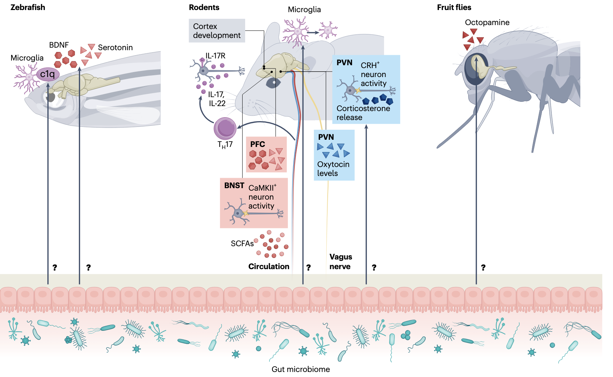
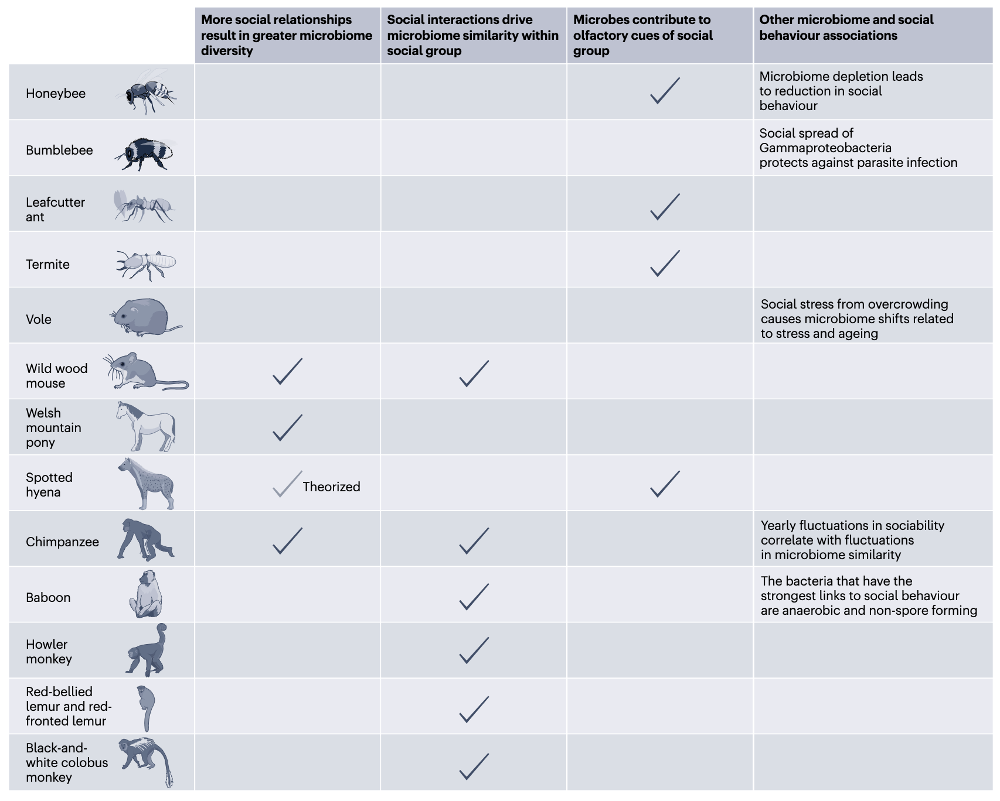
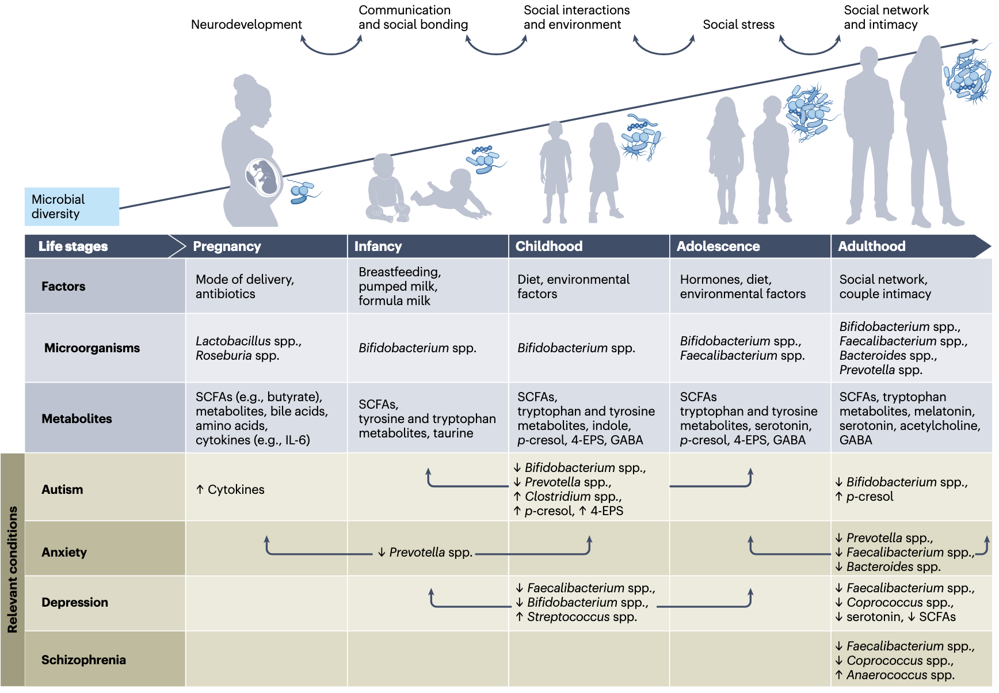

## Introduction

肠道微生物组，即定植于动物胃肠道的复杂微生物群落，对宿主大脑活动和复杂行为具有深远且不可忽视的影响。近年来，跨越从无脊椎动物到哺乳动物乃至人类的研究，无论是在可控的实验室环境还是在自然生态条件下，均已逐步揭示出肠道微生物组参与调控社会行为的精细生物学机制。一个逐渐清晰的核心主题是，肠道微生物组与社会性之间存在着一种双向互动的紧密关系：社会性行为（如群居、理毛、合作）为微生物的传播提供了渠道，反之，微生物组也通过调节宿主的生理状态，主动贡献于社会性的表达与维持。

Griffiths, J.A., Nirmalkar, K., Wu, WL. et al. The gut microbiome shapes social behaviour across animal species. Nat Rev Microbiol (2025). https://doi.org/10.1038/s41579-025-01262-y

这篇综述旨在系统梳理并重点阐述近期文献所揭示的微生物组通过影响早期神经发育、免疫系统功能、下丘脑-垂体-肾上腺轴应激反应以及微生物自身代谢产物等途径，进而影响社会行为的证据链。对介导微生物影响社会行为的细胞与分子通路的研究，已深入至特定脑区（如前额叶皮层、杏仁核、终纹床核）和神经回路（如奖赏通路、社交记忆回路）。研究手段涵盖利用社会缺陷动物模型进行机制探索、在野生环境中进行生态学观察，以及对伴随社会行为受损的人类神经精神疾病（如自闭症谱系障碍、焦虑症）的调查研究。这些多层面、跨物种的研究，有望为改善个体生活质量和社会群体功能开辟新的、基于自然生物学原理的干预途径。

肠道微生物组是地球生命王国中一个极其多样化的组成部分，它几乎殖民了所有动物的胃肠道，跨越不同的生态系统和宿主的整个生命周期。尽管一部分原生微生物在某些条件下可能表现为“条件致病菌”，但压倒性的证据表明，一个健全且平衡的肠道微生物组在宿主的生理过程中扮演着不可或缺的角色，包括营养物质的消化吸收、免疫系统的教育与调控、以及能量代谢的平衡。过去十年间，研究领域的一个重大范式转变是认识到微生物组对遍布全身的神经系统的发育和功能具有显著影响力。肠道与大脑之间存在着密集的双向通信网络，即所谓的“肠-脑轴”。这一轴心涵盖了多种通信途径，包括但不限于免疫系统的激活与调节、迷走神经的信号传导、多种激素的分泌与反馈、以及由微生物产生或修饰后进入循环系统的小分子代谢物。这些信号分子能够穿越生理屏障或通过神经反射，最终影响大脑的高级功能区域，从而显著改变宿主的行為狀態，例如社会交往的动机、应对压力的能力、焦虑和抑郁样行为等。

社会性，即个体倾向于形成群体并在此框架内进行持续互动（如相互梳理、协作捕食或防御、嬉戏、求偶交配、亲代抚育乃至竞争性攻击）的特性，是动物界广泛存在的演化策略。社会群体的形成是一把双刃剑，其收益与成本并存。一方面，紧密的社会互动和庞大的社交网络无疑会加速有害病原体的传播，甚至可能引发群体性的疾病爆发。但另一方面，群居生活也带来了显著的生存优势，例如共同抵御天敌、增加寻找配偶和成功繁殖的机会、更高效地获取食物资源、获得情感支持以及对群体内弱势个体的集体照顾。一般而言，在哺乳动物中，独居物种的寿命往往短于群居物种。人类的社会性更是催生了空前规模的合作行为，从知识技能的代际传递和学习，到大型工程的建造，再到对幼童、病患和老年人口的有组织照护。另一个日益受到关注的潜在积极后果是，社会网络在物种内部（从小的社会群体到整个种群层面）以及在不同物种之间，极大地促进了微生物的传播与共享。

然而，在人类和自由生活的动物中，精确判定微生物社会传播的益处，以及微生物可能存在的、用于增强社会行为以利于自身传播的内在机制，仍然面临挑战。这部分归因于其生存环境的动态多变性和异质性、样本采集和长期行为监测的技术与伦理限制。相比之下，尽管实验室环境简化了自然界的复杂性，但动物模型在研究微生物组与特定社会行为模式相互作用方面提供了无可替代的优势，因为其遗传背景、饮食和环境因素可以得到严格控制。因此，结合实验室动物模型的机制性研究和多样自然生境下的观察性研究，有助于抽丝剥茧，揭示肠道微生物组塑造社会行为质量及其底层神经状态的共同规律。

## 实验室动物模型研究

实验室动物，特别是啮齿类（如小鼠、大鼠）、鱼类（如斑马鱼）和昆虫（如果蝇），是生物医学研究的基石。这主要得益于其已知且均一的遗传背景、种类繁多的物种特异性分子与遗传操作工具、在某些方面模拟人类生理病理过程的能力，以及相对简便的繁殖和饲养条件。在宿主-微生物组研究领域，能够在无菌（即完全缺乏微生物）或拥有明确组成的微生物群落条件下饲养和维持实验动物，为直接探究肠道微生物组如何影响宿主生理和行为提供了强大的实验范式。许多常用的实验室动物物种本身具有高度社会性，例如小鼠和大鼠在自然栖息地会形成复杂的社会等级和行为模式，这些行为的诸多方面可以在实验室设置中得以复现和量化，这使得它们成为研究肠道微生物组与社会行为相互作用的理想模型。

为了精确定量社会行为，研究人员开发了多种标准化的行为学测试。例如，三室社交实验用于评估小鼠对陌生同类的好奇心和社会偏好；社会互动测试记录动物与陌生个体相遇时的主动接近、嗅探时间；攻击性测试衡量领地防卫或资源竞争行为；超声波录音分析则用于解码幼崽与母鼠或成年个体间的交流。大约十年前，首批关于肠-脑轴影响社会行为的开创性研究报道指出，与拥有复杂正常微生物组的对照组相比，无菌小鼠和大鼠表现出显著的社会行为缺陷，如社交互动减少、社交新颖性识别能力下降。尽管也存在相反的报道，但微生物组对社会行为的调节作用已在多个独立研究中得到验证。更重要的是，这种影响并非哺乳动物所特有，在微生物组成迥异的果蝇和斑马鱼中，操纵其微生物组同样能观察到社会行为的改变，提示其背后可能存在某种进化上保守的核心机制。

继这些初步发现之后，近期的研究正逐步深入到细胞和分子层面，试图揭示微生物组施加影响的具体通路。尽管许多发现仍处于初步阶段，且在不同实验室间的重复性有待进一步验证，但一个清晰的图景是：微生物组的变化能够映射到大脑中已知的、与社会行为密切相关的特定区域、神经环路和化学信使的活动上。这表明，社会性这种复杂高级行为的神经生物学基础，可能部分地受到来自外周、甚至源于共生微生物的信号的调控。

>肠道与大脑相互作用并影响社会行为的机制。肠道微生物组（底部）对大脑功能（顶部）具有已知的功能性影响，这些影响塑造了实验室动物（斑马鱼、啮齿类动物和果蝇）的社会行为。常见的机制包括通过小分子（红色）进行信号传导、应激反应和/或激素（蓝色）以及免疫介质（紫色）。这些通路可能独立或协同工作，并且可能因同一生物体的情境或随时间而变化（例如，免疫信号可能随年龄改变）。图中显示了通过循环系统或迷走神经传播进行小分子或免疫细胞运输的已知的肠-脑通信机制和途径，但许多机制仍未完全明确（以问号标示）。BDNF，脑源性神经营养因子；BNST，终纹床核；CaMKII，钙/钙调蛋白依赖性激酶II；CRH，促肾上腺皮质激素释放激素；IL-17R，白介素-17受体；PFC，前额叶皮层；PVN，下丘脑室旁核；SCFA，短链脂肪酸；TH17，CD4+辅助性T细胞17。

### 大脑发育与早期编程

生命早期，尤其是从胎儿期到断奶后的一段时间，是肠道微生物组定植建立的关键窗口期，同时也伴随着大脑最迅速的发育和神经环路的精细雕刻。这一时期任何对微生物组的干扰，例如由于剖腹产分娩、配方奶喂养而非母乳喂养、以及产前、围产期或断奶前后暴露于抗生素，都可能对微生物组的组成和大脑的发育轨迹产生持久甚至不可逆的影响。

研究表明，通过剖腹产出生的小鼠，其肠道中双歧杆菌等有益菌的丰度会降低，并伴随有新生期发声交流的异常以及长大后对社会新异个体偏好性的缺陷。令人惊讶的是，在出生后早期补充特定的益生菌株，如短双歧杆菌，能够逆转这些行为异常。在围产期暴露于广谱抗生素的啮齿类动物，其后代也表现出社会行为缺陷，包括主动社交互动减少、社交动机下降以及幼崽求救叫声的改变。在分子水平上，这些行为变化与大脑前额叶皮层中催产素受体基因和髓鞘形成相关基因的表达下调有关。催产素被称为“爱的激素”，在社会联结、信任和亲社会行为中起核心作用。同时，大脑中的常驻免疫细胞——小胶质细胞，其形态和功能状态也受到早期微生物组的影响。在抗生素处理动物的基底外侧杏仁核（一个处理情绪和社会信息的关键脑区）中，观察到小胶质细胞的激活状态发生改变。

有趣的是，母体本身的微生物组状态甚至能影响胎儿的发育。研究发现，在怀孕母鼠中耗竭微生物组，会影响胎盘功能和胎儿大脑发育，例如丘脑皮层轴突的生长。这种效应可能归因于某些微生物代谢物（如氧化三甲胺）的缺失。更有针对性的研究表明，在妊娠晚期和哺乳期给母鼠使用窄谱抗生素青霉素V，会导致子代出现社会行为异常（包括攻击性增加），并伴随着精氨酸加压素受体1B（另一种与社会行为和应激相关的重要神经肽受体）的表达上调。而口服补充鼠李糖乳杆菌则可以逆转这种行为和解剖上的异常。这种益生菌的有益效应似乎具有跨物种的保守性，在斑马鱼研究中，投喂鼠李糖乳杆菌能增加其大脑中脑源性神经营养因子（BDNF，促进神经元存活和突触可塑性）的水平，并增强血清素能神经传递，最终改变其群聚游动行为。

小胶质细胞在大脑发育过程中负责清除多余的突触，即“突触修剪”，这对于构建高效的神经网络至关重要。而小胶质细胞的成熟和功能发挥需要肠道微生物的“指令”。例如，双歧杆菌等微生物被证明能促进小胶质细胞的正常发育和突触修剪功能。在斑马鱼中的研究直观地显示，早期发育阶段缺乏微生物，会导致前脑小胶质细胞数量减少、神经元分支过度生长，并伴随有社会互动行为的受损。这些缺乏微生物的斑马鱼的小胶质细胞中，补体通路成分C1q（一种标记待修剪突触的分子）的表达水平较低，直接 linking 到了突触修剪的异常。

环境毒素对早期发育的干扰也揭示了微生物组的保护作用。怀孕母鼠暴露于柴油机尾气颗粒（一种常见的环境污染物）后，其雄性后代表现出社会行为缺陷、小胶质细胞过度激活以及多巴胺信号系统功能紊乱。进一步分析发现，这些神经行为异常与母体及子代肠道微生物组组成的改变密切相关，而通过交叉抚育（让未经暴露的母鼠抚养幼崽）可以预防这些有害效应，凸显了早期微生物环境的重要性。

### 应激调控与情绪状态

除了在发育早期的编程作用，微生物组在成年期对个体应激反应的调控同样深刻影响着社会行为。将无菌小鼠或经抗生素处理耗竭了微生物组的小鼠，与拥有正常复杂微生物组的无特定病原体小鼠进行比较，发现在面对诸如引入一个陌生同类等轻度社交应激时，前者往往表现出下丘脑-垂体-肾上腺轴的过度激活。具体表现为下丘脑室旁核中产生促肾上腺皮质激素释放激素的神经元活动增强，导致血液中的主要应激激素——皮质酮（啮齿类）或皮质醇（人类）水平显著升高。这种过高的应激激素水平会抑制探索性行为和社会交往动机。

研究证实，通过先进的化学遗传学技术特异性抑制这些CRH神经元的活性，或者在海马体和终纹床核等脑区敲除糖皮质激素受体，可以挽救无菌小鼠表现出的社交缺陷。这从因果层面证明了微生物组是通过调节大脑的应激反应中枢来影响社会行为的。更有趣的是，通过微生物组测序分析和体内抗生素敏感性筛选，研究人员鉴定出一种特定的细菌——粪肠球菌，将其定植到无菌小鼠肠道后，能够有效恢复正常的社会行为和皮质酮水平。目前，其具体作用机制仍在深入探索中。

微生物组还调节着个体对社会应激的敏感性。经历反复社交挫败应激的小鼠，会表现出一种类似抑郁的状态，伴有胃肠道和大脑的炎症反应，以及肠道微生物组组成的改变。值得注意的是，将来自对应激“易感”小鼠的肠道菌群移植给未经历过应激的“ naïve ”小鼠，会将这种抑郁样表型部分传递给受体小鼠；而移植来自“耐受”小鼠的菌群则无此效应。另一项研究发现，对慢性社交挫败应激具有抵抗力的小鼠，其肠道中双歧杆菌的丰度较高，而外源性补充双歧杆菌可以提高小鼠对应激的抵抗力。甚至人类的研究也提供了线索：将社交焦虑障碍患者的肠道菌群移植给小鼠，会使小鼠对社会性恐惧更加敏感。这些发现强烈提示，至少在啮齿类模型中，微生物组的构成足以调节社会应激反应，这为通过靶向微生物干预来减轻应激负面影响提供了理论依据。

肠道病毒组（所有病毒的集合）在社会应激中也发生变化。一项研究发现，将来自未应激小鼠的病毒组移植给应激小鼠，能够缓解应激引起的皮质酮水平升高、社会行为缺陷和焦虑样行为，并逆转海马体和杏仁核中部分基因的表达异常。随着深度宏基因组测序等技术的进步，病毒组研究成为可能，未来可能会有更多关于病毒与大脑、行为关联的发现。

### 小分子代谢物信号

肠道微生物组影响大脑和社会行为的一个极具吸引力的途径是产生和修饰大量小分子代谢物。短链脂肪酸是膳食纤维经肠道微生物发酵产生的主要终产物，包括乙酸盐、丙酸盐和丁酸盐等。它们除了众所周知的免疫调节和维持肠道屏障功能外，也被发现与社会行为密切相关。

研究发现，SCFAs能够缓解社会应激引起的某些行为异常。更有意思的是，SCFAs可能根据其浓度和作用情境产生不同的行为效应。例如，在耗竭微生物组的小鼠模型中，直接向大脑特定区域（如终纹床核）输注SCFAs，会损害小鼠识别社会新异个体的能力，但并不影响其基本的社交意愿或社会记忆。机制研究表明，SCFAs通过促进线粒体脂肪酸氧化，激活了终纹床核内一类表达钙/钙调蛋白依赖性激酶II的兴奋性神经元。此外，膳食中的某些益生元（如低聚果糖），可以被双歧杆菌和拟杆菌等微生物利用产生SCFAs，补充这类益生元被证明能改善小鼠的社交行为，并增强大脑中的血清素能信号和BDNF表达。

微生物组通过小分子信号影响社会行为的现象在不同生物门类中均有体现，尽管其生理结构差异巨大，但效果却呈现趋同。在果蝇中，章鱼胺（无脊椎动物体内相当于哺乳动物去甲肾上腺素的神经递质）对多种行为有广泛影响。微生物组通过调节章鱼胺的信号通路，进而影响雄蝇的攻击性。与拥有正常菌群的果蝇相比，无菌雄蝇的章鱼胺水平较低，它们对其他雄蝇的攻击性较弱，在与雌蝇求偶竞争中也处于劣势。沃尔巴克氏体是一种常见的细胞内共生菌，通过母系遗传感染许多昆虫。某些致病性沃尔巴克氏体菌株会下调果蝇的章鱼胺生物合成，从而损害其攻击行为。尽管沃尔巴克氏体感染会降低雄蝇的生育力，但它却能通过尚不清楚的机制提高其交配率，并增强其对配偶的辨别能力。

小分子代谢物之所以成为微生物远程调控大脑和行为的重要手段，源于其高度多功能性。它们可以直接穿过血脑屏障或通过迷走神经等途径作用于大脑神经元上的受体，也可以间接通过调节免疫信号、影响少突胶质细胞成熟或血脑屏障完整性等来发挥作用。更重要的是，肠道来源的小分子对大脑和社会行为的影响往往是可调节甚至可逆的，这为通过饮食、益生菌或药物干预来精细调控相关行为、改善健康结局提供了可能。

### 免疫系统介导的通讯

肠道是人体最大的免疫器官，体内约70-80%的免疫细胞驻留于此。肠道微生物组对于哺乳动物免疫系统的正常发育和功能维持至关重要。一个引人注目的现象是，一些能够刺激抗炎反应、对宿主有益的细菌类群，如乳杆菌、双歧杆菌和脆弱拟杆菌，同时也被反复发现在增强社会行为中扮演关键角色。

肠道炎症状态本身就会影响社会行为。研究表明，即使从化学诱导的结肠炎中恢复后，小鼠的社会互动行为也会减少。移植来自人类供体的肠道菌群后，在小鼠受体中鉴定出一些细菌物种（如Blautia和Bacteroides uniformis）与减轻结肠炎病理和改善行为结果相关。直接给小鼠补充这些细菌，不仅能缓解结肠炎严重程度，还能促进 colitis 后小鼠的社会参与。这些发现凸显了肠-脑连接在炎症性肠病等条件下的相关性，微生物组同时影响着胃肠道健康和社会行为。

这种模式甚至延伸到免疫系统与哺乳动物截然不同的无脊椎动物。在果蝇中，一个名为kdm5的组蛋白去甲基化酶的缺失会导致免疫通路紊乱、肠道通透性增加、菌群失调以及社会回避表型。在这种突变果蝇中，典型的益生菌类群（如乳杆菌目、拟杆菌目和双歧杆菌目）的丰度较低。两种不同的微生物干预——抗生素处理或补充植物乳杆菌，都能挽救该品系果蝇的社会行为异常，表明免疫和微生物组共同参与了社会行为的调节。

除了细菌，微生物组中的其他成员也通过免疫途径影响社会行为。定植于小鼠肠道粘膜的某些真菌（如念珠菌、酵母菌），能够通过诱导CD4+辅助性T细胞产生Type 17免疫反应，促进肠道屏障功能。由此产生的IL-17等细胞因子，不仅能保护肠道，还能直接作用于神经元上的IL-17受体，进而增强小鼠的社交行为。这直接将真菌群落（ mycobiota ）纳入到了调控社会行为的微生物网络之中。免疫通路介导微生物信号向大脑传递的观点，建立在微生物调节免疫的广泛证据、免疫细胞在大脑内部或附近影响社会行为的发现、以及记录在案的免疫细胞从肠道向大脑迁移的研究基础之上。

## 自由生活动物的研究

尽管实验室动物研究为揭示机制提供了巨大帮助，但其高度人工化的饲养环境无法复现自然界中演化形成的复杂种群结构和社会互动。对自由生活动物物种的研究，正从生态学角度揭示微生物组与社会动态之间相互塑造的多种方式。

>自由生活动物中社会性与肠道微生物如何相互影响。图中总结了野外跨动物物种的社会性与微生物组组成之间的动态关系，分为四类。左侧：已知或理论上的社会关系数量与肠道微生物组多样性增加之间的关联。左中：既定社会群体内的社会互动导致微生物共享，并且微生物组相似性高于社会联系较弱的个体。右中：已知微生物对嗅觉线索的贡献，这些线索对社会提示和群体识别很重要。右侧：社会行为与微生物组之间的其他关联。

### 社会网络驱动微生物传播

对野生林鼠、狒狒、黑猩猩等社会性动物的研究表明，个体间的社会关联（如共同栖息、理毛、近距离接触）是预测其肠道微生物组相似性的最强因素，其预测力甚至超过地理距离、遗传亲缘关系、年龄或性别。在野生林鼠种群中，即使仅被观察到有过一次互动的个体，其共享的细菌类群也多于从未有过交集的个体。在威尔士山地矮马中，社会结构影响微生物组：雄性个体在群体内联系紧密，而雌性则相对独居；相应地，雌性矮马与雄性的微生物组相似度高于与其他雌性的相似度。黑猩猩在雨季社会互动增加，群体规模扩大，此时个体间的微生物组相似性也更高。令人惊讶的是，社会群体对微生物组的影响甚至强于母子关系。在狒狒中，微生物组组成不仅可由社会群体预测，还与个体在群体内的理毛关系强度相关。这些关联性最强的细菌多为厌氧、不形成孢子的菌群，如放线菌门、双歧杆菌科等，它们对氧气敏感，依赖密切接触传播。从外部新加入群体的雄性狒狒，其微生物组需要数月甚至数年时间才会与群体核心菌群趋同。类似的模式在多种灵长类（如红腹狐猴、黑白疣猴）中均有发现，尽管不同物种的社会行为时间投入差异很大，但社会关联性始终是微生物组相似性的有力预测指标。

### 微生物多样性的益处

通过社会接触传播微生物的一个直接好处是可能获得新的微生物物种，从而增加宿主微生物组的多样性。微生物类群及其功能基因的多样性通常与动物的整体健康相关。拥有更多社会联系的野生林鼠，其肠道中含有更多样化的细菌类群，尤其是那些对氧气敏感的严格厌氧菌。社会互动更频繁的黑猩猩，其肠道微生物组的物种丰富度也更高。在斑鬣狗中，处于群体社会等级上层的雌性个体，其真核肠道微生物群（包括真菌）的丰富度和多样性高于下层个体，这可能源于其在族群内更强的社会连通性。更高的多样性可能增强微生物群落的稳定性和恢复力，从而间接支持宿主更健康的状态，并可能影响其参与社会活动的能量和动机。

### 群体识别与化学通讯

许多社会性动物依靠化学信号进行交流和识别。微生物组是这些信号的重要贡献者。蜜蜂利用表皮烃谱作为识别巢友的化学身份证，而表皮烃的组成受到其肠道微生物组的显著影响。实验表明，用不同菌株的γ-变形菌定植蜜蜂，改变其微生物组，会导致它们被原巢友排斥。类似地，切叶蚁和白蚁也使用 colony-specific 的表皮烃来识别巢友，抗生素破坏微生物组或移植其他群体的菌群会导致识别失败和攻击行为。许多哺乳动物通过气味腺标记进行通讯。这些腺体通常有细菌定植，而且细菌的组成与腺体分泌物中的挥发性代谢物组成相关。例如，斑鬣狗分泌一种群体特异性的糊状物，含有短链脂肪酸和酯类等细菌发酵产物。社会性斑鬣狗气味腺中的挥发性脂肪酸比独居的缟鬣狗更丰富多样，表明细菌介导了社会性动物特有的气味信号。

### 社会联结的特例研究

草原田鼠因其一夫一妻制的配对结合和复杂社会行为而成为研究社会神经生物学的经典模型。近期研究发现，肠道微生物组也参与调控其社会行为。给予活的（而非热灭活的）罗伊氏乳杆菌会降低雌性田鼠的社会亲和力，但对雄性无影响。这种行为变化伴随着大脑神经化学物质的改变：雌性田鼠下丘脑CRH增加，伏隔核CRH受体2表达降低。活的罗伊氏乳杆菌还改变了肠道菌群组成，这些变化与神经化学标记物和行为相关，提示微生物群可能通过影响神经内分泌系统来调节与社会联结相关的情感状态。

### 社会性的潜在代价

高度群居并非总是带来益处。对布氏田鼠的研究显示，社会拥挤会加速衰老相关变化，如端粒缩短、DNA损伤和应激激素水平升高。在高密度饲养条件下，肠道微生物组发生显著改变，包括阿克曼菌减少和产短链脂肪酸菌耗竭。将高密度饲养田鼠的菌群移植给无应激田鼠，会导致后者潜在致病菌（如艰难梭菌）增加，而有益菌（如B. uniformis）减少。相反，接受低密度饲养供体菌群的受体田鼠，其肠道中具有促进肠道健康作用的Muribaculum菌则显著增加。这表明过度拥挤的社会生活对微生物组的负面影响可能与加速衰老和应激有关。

## 人类研究

在人类中，探索微生物组与社会行为的关系更为复杂，但横断面和干预性研究提供了越来越多的证据，支持肠道微生物组从生命早期到老年期都与社会行为密切相关。

>微生物群与代谢物对不同生命阶段社会行为的影响。发生在不同生命阶段的肠道微生物多样性、微生物组成和代谢物产生的变化影响着社会行为的关键方面，包括社会免疫、沟通、社会联结、社会互动和应激反应。孕期：分娩方式（阴道分娩与剖腹产）和抗生素暴露显著影响母体和胎儿的微生物多样性。以乳杆菌和罗斯氏菌为主的微生物产生代谢物，如短链脂肪酸（例如丁酸盐）、胆汁酸、氨基酸和细胞因子（例如IL-6），这些代谢物调节社会免疫和神经发育。婴儿期和儿童期：母乳喂养促进有益微生物（如双歧杆菌）的定植，这些微生物产生代谢物，如短链脂肪酸、色氨酸衍生物、γ-氨基丁酸（GABA）和酚类化合物（对甲酚），有助于早期沟通和社会联结，并影响社会互动。青春期：激素和饮食变化调节微生物群组成，主要以双歧杆菌和Faecalibacterium为主，微生物衍生的短链脂肪酸、血清素和GABA支持应激恢复力和社会认知。成年期：社会网络、夫妻亲密关系、生活方式和同居（包括共享饮食）稳定了微生物组的多样性和成熟度。以拟杆菌和普雷沃菌为主的微生物产生代谢物，如褪黑激素、血清素、乙酰胆碱和GABA，调节情绪健康和亲密关系。还强调了微生物群对伴有社会行为损害的相关神经系统疾病的影响（相关病症）。4-EPS，4-乙基苯硫酸盐。

### 发育与早期生命

微生物对人类社会行为的影响可能始于胎儿期。母体肠道微生物组通过代谢物和免疫信号影响胎儿神经发育，特别是与社会行为相关的神经回路。孕期微生物组发生变化，罗斯氏菌、梭杆菌、瘤胃球菌、艾格特菌科和双歧杆菌等菌群增多，它们调节着短链脂肪酸、胆汁酸、氨基酸等代谢物的产生，以及IL-6等细胞因子的水平，从而影响神经系统的发育和功能。分娩方式是生命早期微生物定植的关键事件。阴道分娩有利于婴儿定植来自母亲阴道的乳杆菌、普雷沃菌和双歧杆菌等菌群，而剖腹产则使婴儿更易获得母亲皮肤表面的葡萄球菌等，这与后续菌群失调风险和社会行为受损风险增加相关。早期喂养方式（母乳、泵出母乳或配方奶）通过影响双歧杆菌等益生菌的定植，进一步塑造婴儿的微生物组，并可能影响其社会行为发展。儿童自闭症谱系障碍常伴有胃肠道症状，其微生物组特征常表现为多样性降低，双歧杆菌、普雷沃菌等有益菌减少，而念珠菌（尤其是白色念珠菌）等真菌的增多与严重行为症状相关。微生物代谢物如短链脂肪酸、对甲酚、4-乙基苯硫酸等也与ASD的社交缺陷、沟通障碍等症状有关。微生物移植疗法通过增加微生物多样性（如普雷沃菌、双歧杆菌），显示出改善ASD儿童胃肠道症状和行为表现的潜力。

### 青春期与成年期

随着大脑成熟和社会角色转变，微生物组也在变化。青少年期微生物组处于过渡阶段，双歧杆菌、梭菌、Faecalibacterium等相对突出。成年后，微生物组趋于稳定、多样和成熟。社会关系，特别是同居和亲密关系，是塑造成人微生物组的重要力量。配偶或同居伴侣拥有更相似的菌群。研究甚至发现，社会微生物共享网络可延伸至朋友、乃至朋友的朋友。饮食模式显著影响微生物组，地中海饮食（富含纤维、多酚）促进拟杆菌、普雷沃菌、罗斯氏菌等有益菌生长，增加短链脂肪酸，与更好的应激恢复力和情绪健康相关。而高脂/高糖饮食则与社会孤立风险增加相关。干预研究表明，补充鼠李糖乳杆菌和长双歧杆菌可降低成人应激激素皮质醇水平，改善焦虑管理和社交行为。一项研究甚至发现，合生元干预能增强健康成年人对社会公平决策的敏感性，这与血清中多巴胺前体酪氨酸水平升高可能有关。

### 衰老与社会孤立

衰老伴随生理功能衰退，老年人常面临社会孤立和孤独感，这对健康有害。衰老过程中，与亲社会表型相关的菌群（如普雷沃菌、双歧杆菌、产短链脂肪酸菌）丰度下降，而与社会功能损害相关的代谢物（如TMAO、对甲酚）水平升高。经历严重孤独的老年人，其微生物组多样性往往较低。微生物组变化可能是衰老相关社会退缩的一个因素，但其间的因果关系及干预策略需进一步研究。

### 精神健康障碍

精神分裂症、焦虑症和抑郁症等疾病常伴有社会功能受损。这些患者通常显示出肠道微生物组的改变，例如精神分裂症患者中厌氧球菌、普雷沃菌可能增多，而普拉氏粪杆菌、粪球菌、拟杆菌等可能减少，这些变化可能影响酪氨酸、色氨酸代谢，神经递质（如GABA、谷氨酸）合成和免疫反应，与社会功能缺陷和抑郁症状相关。焦虑和抑郁患者也常出现特定的菌群紊乱。然而，这些变化是疾病的原因、后果，还是与社会退缩导致的传播减少有关，尚需明确。精神科药物（如抗抑郁药、抗精神病药）本身具有抗菌活性，能重塑菌群，这为研究带来了混杂因素。某些微生物甚至能代谢这些药物，影响其疗效。针对微生物组的干预（如益生菌、益生元、饮食调整）在改善部分患者情绪和社会功能方面显示出潜力，但其对社会行为的确切效果仍需更多高质量临床试验验证。

## 结论与展望

综上所述，大量证据表明，肠道微生物组是调节跨物种社会行为的一个关键环境因素。其作用机制多元且相互交织，涉及对神经发育的早期编程、对应激反应系统的调控、对免疫系统功能的塑造，以及通过产生大量具有生物活性的小分子代谢物进行远程通信。社会行为与微生物组之间存在着一种自我强化的动态循环：频繁的社会互动为微生物的传播与共享提供了理想渠道，促进了微生物组多样性的增加；而一个多样且平衡的微生物组，则可能通过上述多种机制优化宿主的生理状态，增强其社会交往的动机、能力和愉悦感，从而进一步促进社会性行为的表达。

未来的研究重点应包括：
1.  **阐明因果机制**：利用无菌动物、特定菌株定植和基因编辑技术，明确特定微生物及其产物如何因果性地影响社会行为相关的神经回路。
2.  **推进人类研究**：开展大规模、纵向、精心控制混杂因素的人群研究，并设计严格的随机对照试验来验证微生物干预对社交障碍的疗效。
3.  **关注非细菌成员**：深入探索病毒、真菌和古菌在肠-脑轴和社会行为中的作用。
4.  **整合多组学与生态视角**：结合宏基因组学、代谢组学、神经科学和行为生态学，在自然和社会环境中全面理解微生物组-社会行为的相互作用。

对微生物组-社会行为轴的理解，不仅具有基础科学意义，也为开发针对自闭症、社交焦虑、抑郁症等社交障碍相关疾病的创新微生态干预策略提供了充满希望的新途径。
