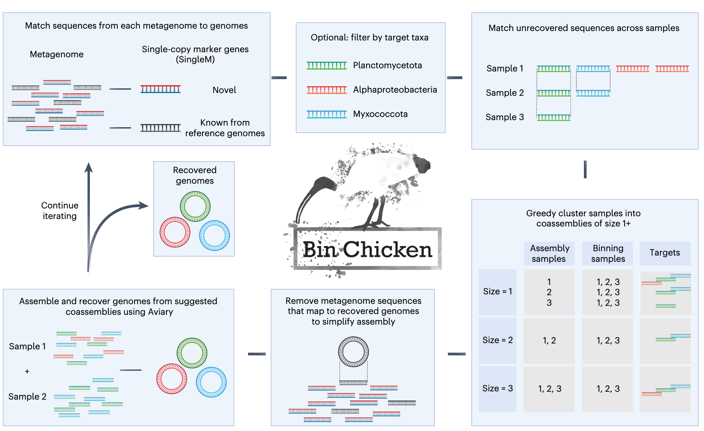
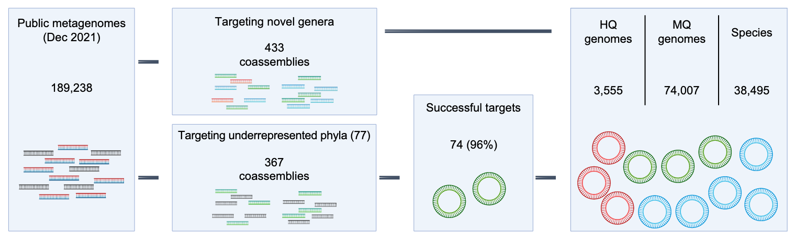
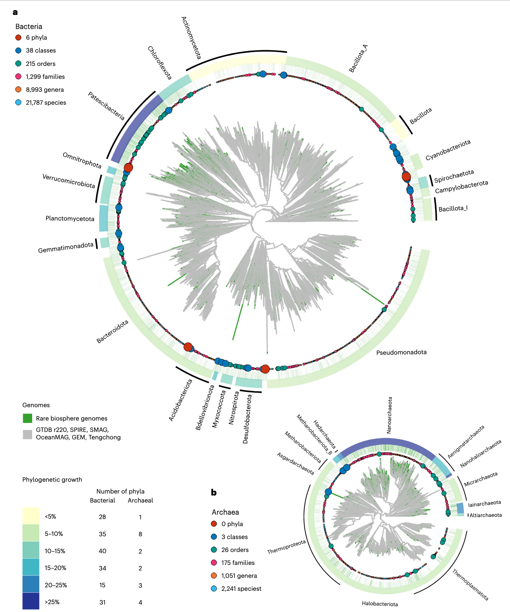
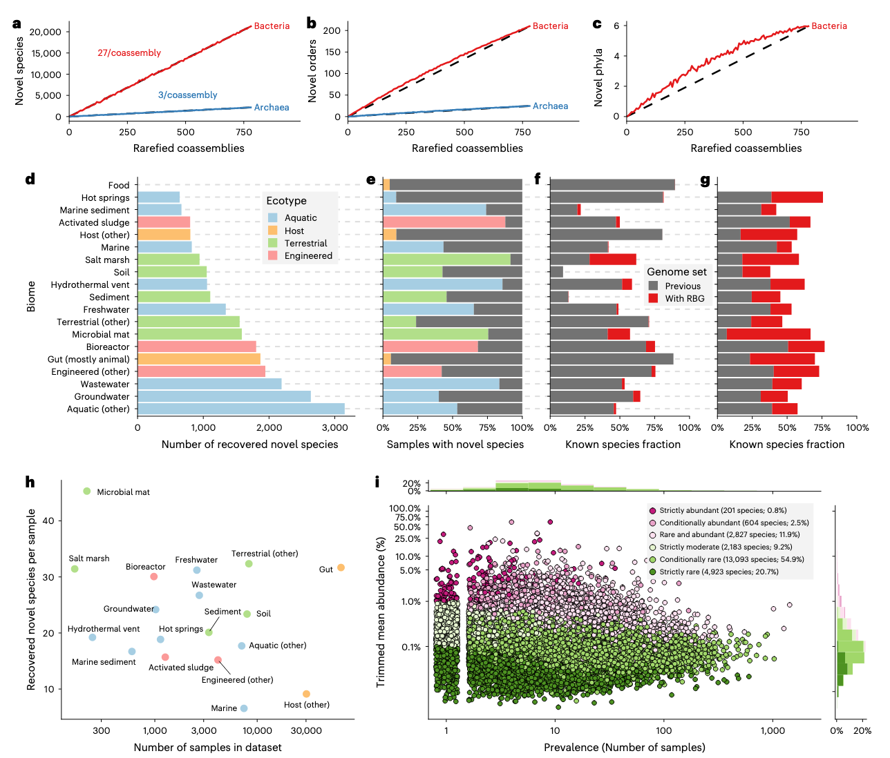

## Introduction

宏基因组学的发展极大地拓展了我们对复杂微生物群落的认知边界。然而，从高度异质性的环境样本中恢复高质量、近乎完整的微生物基因组（即宏基因组组装基因组，MAGs）仍面临显著挑战，尤其在目标物种丰度较低或存在高度近缘菌株的情况下。为应对这一瓶颈，研究者开发了一种名为 BinChicken 的新策略，通过靶向性共组装流程，显著提升了稀有或新颖微生物基因组的回收效率与完整性。

Aroney, S.T.N., Newell, R.J.P., Tyson, G.W. et al. Bin Chicken: targeted metagenomic coassembly for the efficient recovery of novel genomes. Nat Methods (2025). https://doi.org/10.1038/s41592-025-02901-1

## 文章介绍

### 研究背景与挑战

传统宏基因组分析通常依赖于对单个样本进行独立组装，随后通过分箱（binning）步骤将重叠群（contigs）聚类为潜在的基因组单元。该流程在处理高丰度物种时表现良好，但在面对低丰度成员时则常因覆盖度不足而导致组装碎片化，难以获得完整基因组。此外，当多个近缘菌株共存时，组装算法易将它们错误地合并为一个嵌合体，进一步降低 MAG 的准确性。尽管已有多种共组装策略尝试整合多个相关样本以提高覆盖深度，但盲目合并所有样本不仅会引入大量无关序列，增加计算负担，还可能加剧菌株混杂问题。

### BinChicken 方法概述



BinChicken 的核心思想在于“精准共组装”：仅选择那些最有可能包含目标微生物的样本子集进行联合组装，从而在提升目标序列覆盖度的同时，最大限度避免无关背景噪声和菌株混杂。该流程分为三个主要阶段：初步筛选、靶向共组装与精细化分箱。

首先，对所有待分析样本进行轻量级预处理，包括质量控制和初步的短读长比对。利用已有的参考数据库或无参方法（如基于 k-mer 的相似性评估），快速识别出可能含有目标微生物的候选样本。这一步骤的关键在于平衡灵敏度与特异性，确保不遗漏潜在阳性样本，同时排除明显无关的样本。

随后，将筛选出的候选样本进行共组装。在此阶段，BinChicken 采用高效的组装工具（如 MEGAHIT），利用其对大规模数据的良好可扩展性，在保持计算资源可控的前提下完成组装任务。共组装生成的重叠群集合相比单样本组装具有更高的连续性和覆盖深度，为后续分箱奠定基础。

最后，对共组装结果执行精细化分箱。BinChicken 整合多种分箱特征，包括四核苷酸频率、覆盖度谱（来自原始各样本）以及可能的分类学标记信息，利用先进的分箱算法（如 MetaBAT2 或 MaxBin2）生成初步 bins。为进一步提升质量，流程还包括去污染（dereplication）和补洞（gap-filling）等后处理步骤，最终产出高完整度、低污染的 MAGs。

### 主要结果

#### 基因组恢复效率



在应用Bin Chicken到公共宏基因组数据集时，研究团队从1,286个样本的800个共组装组中恢复了**77,562个MAGs**（宏基因组组装基因组），涵盖38,495个物种。与当前最大规模的SPIRE项目相比，Bin Chicken在每个组装样本基础上恢复的新物种数量是SPIRE的**20倍以上**，展现了极高的效率。

#### 分类学新颖性



RBGs（稀有生物圈基因组）的加入使细菌已知系统发育多样性增加了12%，古菌增加了18%。特别值得关注的是，在93个代表性不足的门中，77个建议共组装中的73个门（96%）成功恢复了新物种基因组，证明了Bin Chicken在恢复 underrepresented  lineages方面的卓越能力。


#### 质量评估与比较

通过随机选择30个共组装组与相应样本的单样本组装结果比较，发现共组装平均产生了**39%的额外物种级基因组分箱**。在相同物种的基因组恢复中，共组装基因组的质量比单样本组装高出2.8%（完整性评估），且没有明显增加嵌合现象。

#### 稀有生物圈特征



新发现的RBG物种中，超过75%被分类为条件性或严格稀有物种，90%在恢复样本中的丰度低于1%。这些物种分布广泛，但在宿主相关样本中较为罕见（仅7%），而在水生和工程环境中更为常见。

#### 代谢功能发现

通过聚类5.96亿个蛋白质序列，发现了2.1亿个蛋白质簇，其中RBGs贡献了大量的新蛋白质簇。代谢分析显示，稀有物种倾向于较少的好氧代谢，而富含未知代谢途径，提示稀有物种可能执行与常见物种显著不同的生物学功能。


## 使用教程

BinChicken 官方文档：<https://aroneys.github.io/binchicken/>

### 安装 BinChicken

BinChicken 支持多种安装方式，推荐使用 `pixi` 或 `conda`：

方法 1：通过 Bioconda 安装（推荐）
```bash
# 创建并激活 conda 环境
conda create -n binchicken -c bioconda -c conda-forge binchicken
conda activate binchicken
```

方法 2：从源码安装（适用于开发者）
```bash
git clone https://github.com/AroneyS/binchicken.git
cd binchicken
pixi run postinstall  # 需先安装 pixi
```

> 注：若使用 `pixi`，可通过 `pixi shell` 进入环境，或直接运行 `pixi run binchicken -h` 调用命令。

### 数据库配置

BinChicken 依赖多个大型参考数据库，建议提前手动下载并配置路径。

#### 必需数据库
- **CheckM2 数据库**：用于评估 MAG 质量  
  > 注意：当前 CheckM2 的自动下载存在故障（[GitHub Issue #134](https://github.com/chklovski/CheckM2/issues/134)），需手动下载：
  ```bash
  mkdir -p /checkm2/db/
  wget https://zenodo.org/api/records/14897628/files/checkm2_database.tar.gz/content \
       -O /checkm2/db/checkm2_database.tar.gz
  tar -xvzf /checkm2/db/checkm2_database.tar.gz -C /checkm2/db/
  ```

- **SingleM metapackage**：用于标记基因检测（如 16S、rpoB 等）

#### 可选数据库（仅在使用 `--run-aviary` 时需要）
- **GTDB-Tk 数据库**：用于物种分类注释
- **Metabuli 数据库**：用于 TaxVAMB 分箱器

#### 构建数据库索引

Bin Chicken 为每个子进程使用单独的 conda 环境。运行 `binchicken build` 以创建这些子进程 conda 环境并设置环境变量。这可能需要 30 分钟以上才能完成，具体取决于网速。（我花了好久时间。。。而且没什么进度条）

首次使用前，需运行 `binchicken build` 指定数据库路径：
```bash
binchicken build \
  --singlem-metapackage /path/to/singlem_metapackage \
  --checkm2-db /checkm2/db/CheckM2_database \
  --gtdbtk-db /path/to/gtdb/release \          # 可选
  --metabuli-db /path/to/metabuli_db           # 可选
```

> 提示：也可通过环境变量设置路径（见仓库 `admin/set_env_vars.sh`），或将数据库软链接至 `binchicken/db/` 目录下，由激活脚本自动识别。

### 工作流示例

BinChicken 主要包含三个核心命令：`single`、`coassemble` 和 `iterate`。

- `--cores N`：指定最大 CPU 核心数（默认为 1）
- `--output DIR`：指定输出目录
- `--run-aviary`：在推荐共组装后立即执行 Aviary 组装与分箱
- `--taxa-of-interest "g__Genus"`：限定目标分类单元（如属 *Mucilaginibacter*）
- `--kmer-precluster [always|never]`：对大规模样本启用 k-mer 预聚类以节省内存

#### 步骤 1：单样本初步组装与分箱（生成初始 bins）
```bash
mkdir ~/binchicken_demo && cd ~/binchicken_demo

binchicken single \
  --forward SRR14271365 SRR14271372 ERR2281802 ERR2281803 \
  --sra \
  --cores 16 \
  --output binchicken_single_assembly \
  --run-aviary
```
此步骤下载SRA数据，对每个样本独立运行 Aviary，产出初步 MAGs，用于后续共组装决策。

输出关键文件：
- `binchicken_single_assembly/coassemble/target/elusive_clusters.tsv`：推荐的共组装样本组合
- `binchicken_single_assembly/recovered_bins/`：回收的 MAGs

#### 步骤 2：靶向共组装（基于目标分类群）

假设关注 *Mucilaginibacter* 属：
```bash
binchicken iterate \
  --coassemble-output binchicken_single_assembly \
  --taxa-of-interest "g__Mucilaginibacter" \
  --cores 64 \
  --output binchicken_2_targeting
```
该命令会：
- 分析初始 bins 中未覆盖的 *Mucilaginibacter* 标记基因
- 推荐包含这些基因的样本对进行共组装
- 输出建议列表（`targets.tsv`），但不自动运行组装（除非加 `--run-aviary`）

> 若两个样本（如 SRR14271365 和 SRR14271372）均含目标 OTU，则会被推荐共组装；不含目标的样本（如 ERR2281802/3）将被排除。

#### 步骤 3：多轮迭代共组装（提升回收率）
可进一步扩展至 3 样本共组装：
```bash
binchicken iterate \
  --coassembly-samples 3 \
  --coassemble-output binchicken_2_coassembly \
  --run-aviary \
  --cores 64 \
  --output binchicken_3_coassembly
```
此策略适用于在前两轮仍未充分回收目标基因组的情况，通过增加样本组合复杂度挖掘更稀有的共现信号。


#### 使用自定义基因组作为参考

在 `coassemble` 命令中提供已知基因组，可帮助识别“新颖”序列：
```bash
binchicken coassemble \
  --forward-list samples_forward.txt \
  --reverse-list samples_reverse.txt \
  --genomes-list genomes.txt \
  --run-aviary \
  --output custom_coassembly
```
提供的基因组将用于过滤已知标记基因，使流程聚焦于潜在新物种。

### 注意事项

1. **数据库体积庞大**：CheckM2、GTDB-Tk 等数据库总大小可达数百 GB，请确保磁盘空间充足。
2. **SRA 样本处理**：使用 `--sra` 时，BinChicken 会自动调用 `fasterq-dump` 下载数据，需确保网络畅通。
3. **内存优化**：当样本数 >1000 时，建议启用 `--kmer-precluster always` 以降低内存峰值。
4. **结果解读**：重点关注 `elusive_clusters.tsv` 和 `targets.tsv`，它们决定了哪些样本组合值得投入计算资源进行共组装。

### 测试

BinChicken 提供了示例数据集以供测试，下载github仓库所有数据：

如果从源代码安装，则可以运行测试以确保 Bin Chicken 正确安装。使用单个线程完成子命令测试可能需要 30 分钟以上。使用 64 个线程，手动测试可能需要几天时间才能完成。

```bash
# Test single subcommand
python test/test_single.py
# Test coassemble subcommand
python test/test_coassemble.py
# Test iterate subcommand
python test/test_iterate.py

# Test downloading and coassembly/recovery with Aviary. Results stored in example/test_* directories.
python test/test_manual.py
```

直接试试运行，这样可以检验我们的安装是否成功：
```bash
binchicken single --forward test/data/sample_1.1.fq --reverse test/data/sample_1.2.fq
```

总之，感觉这个软件的安装配置有点麻烦，运行起来也是很慢的（毕竟调用了大量流程），如果有靶向的感兴趣微生物基因组，还是值得尝试的。

## References

1. Aroney, S.T.N. et al. Bin Chicken: targeted metagenomic coassembly for the efficient recovery of novel genomes. *Nature Methods* (2025). https://doi.org/10.1038/s41592-025-02901-1

2. Bin Chicken官方文档：https://aroneys.github.io/binchicken/

3. Bin Chicken GitHub仓库：https://github.com/AroneyS/binchicken

4. Aviary工具：https://github.com/rhysnewell/aviary

5. SingleM工具：https://github.com/wwood/singlem

6. GTDB数据库：https://gtdb.ecogenomic.org/
