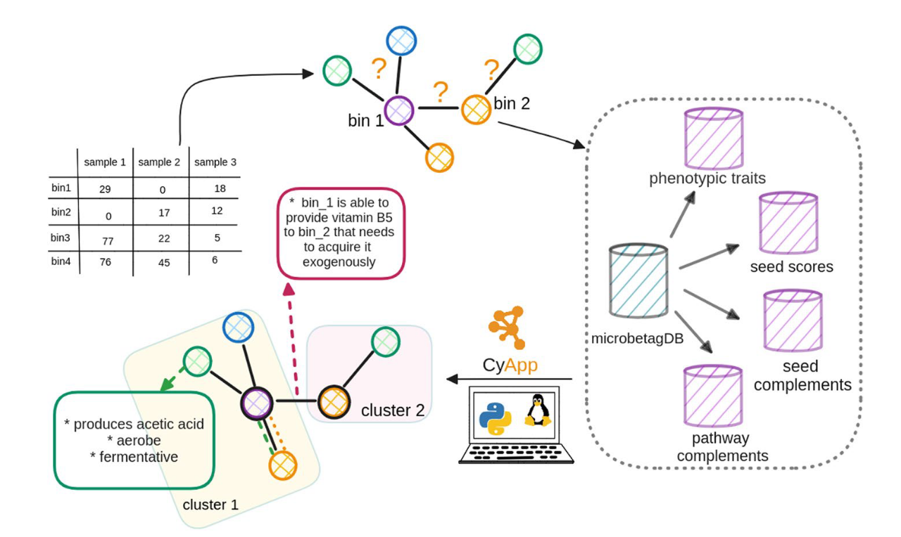
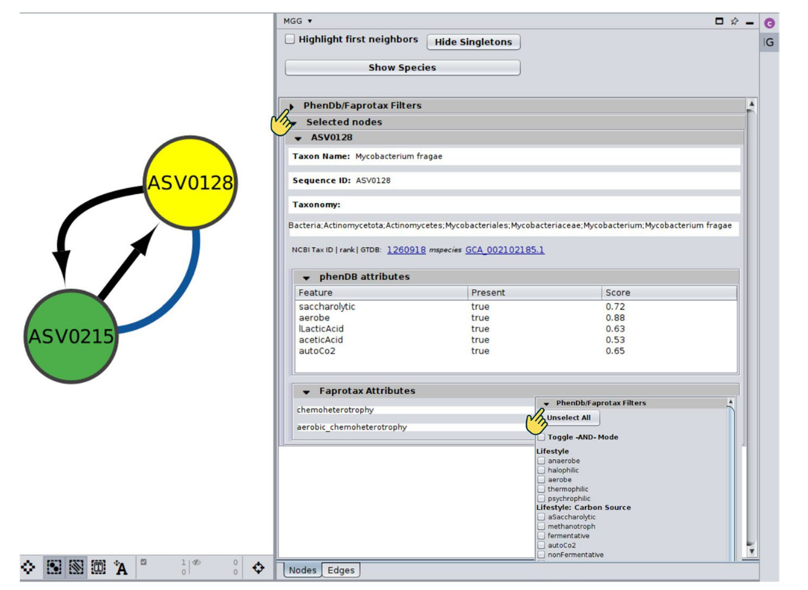
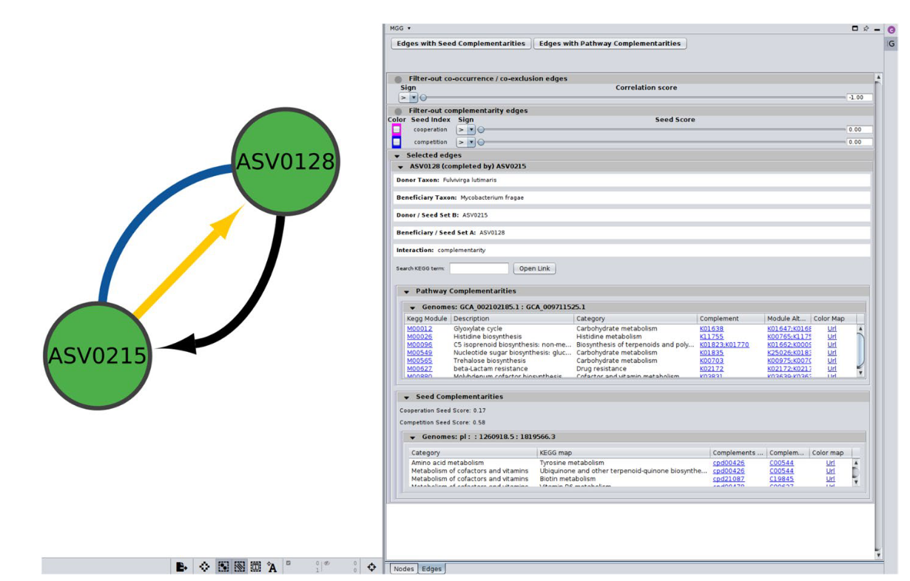
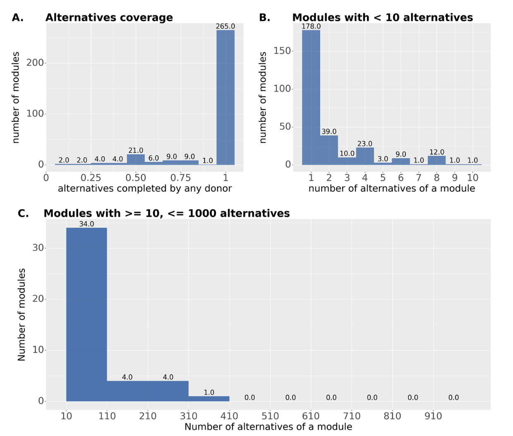
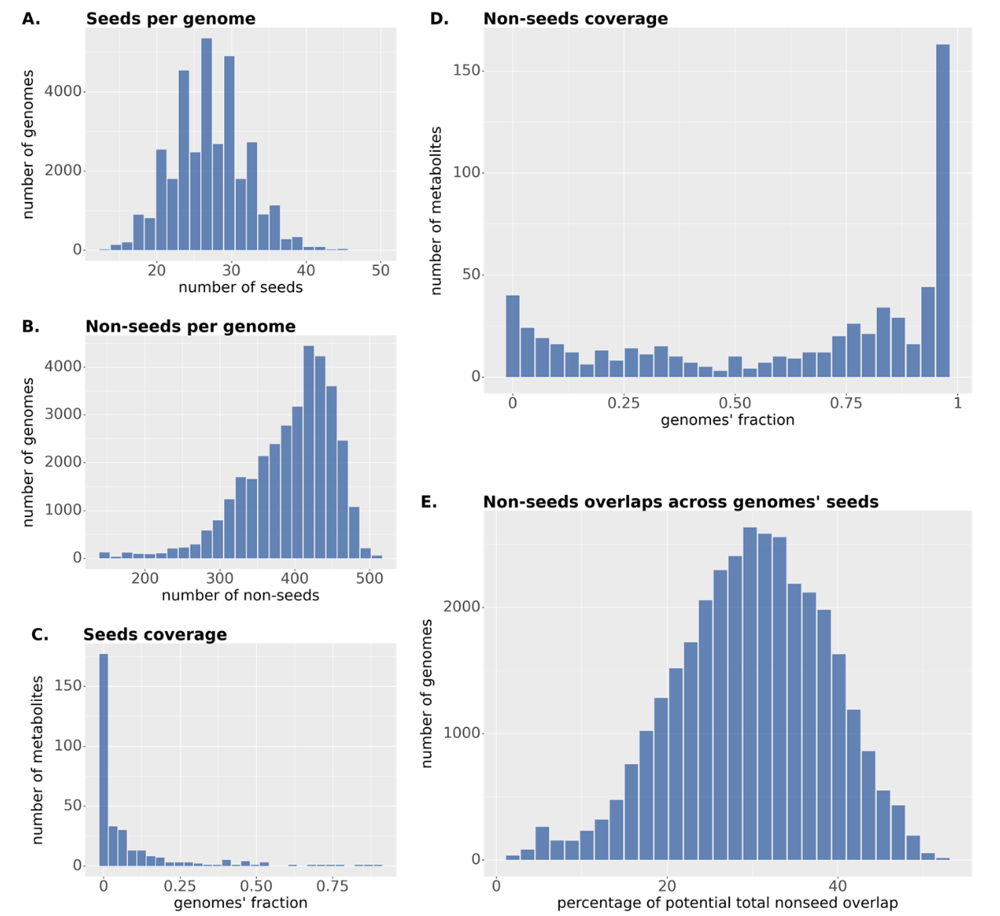
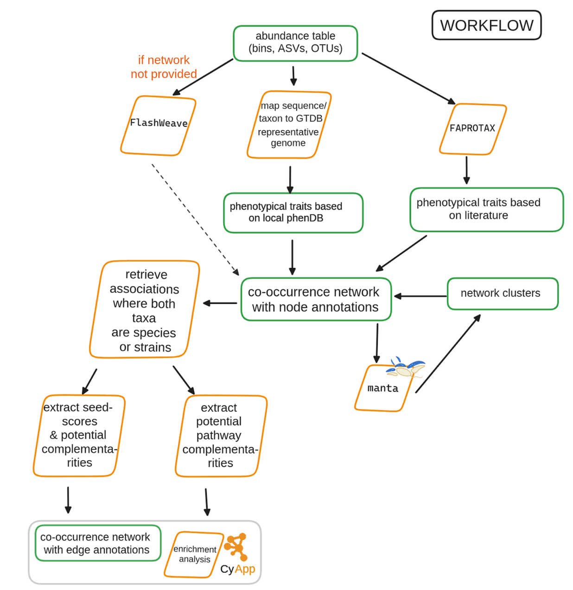
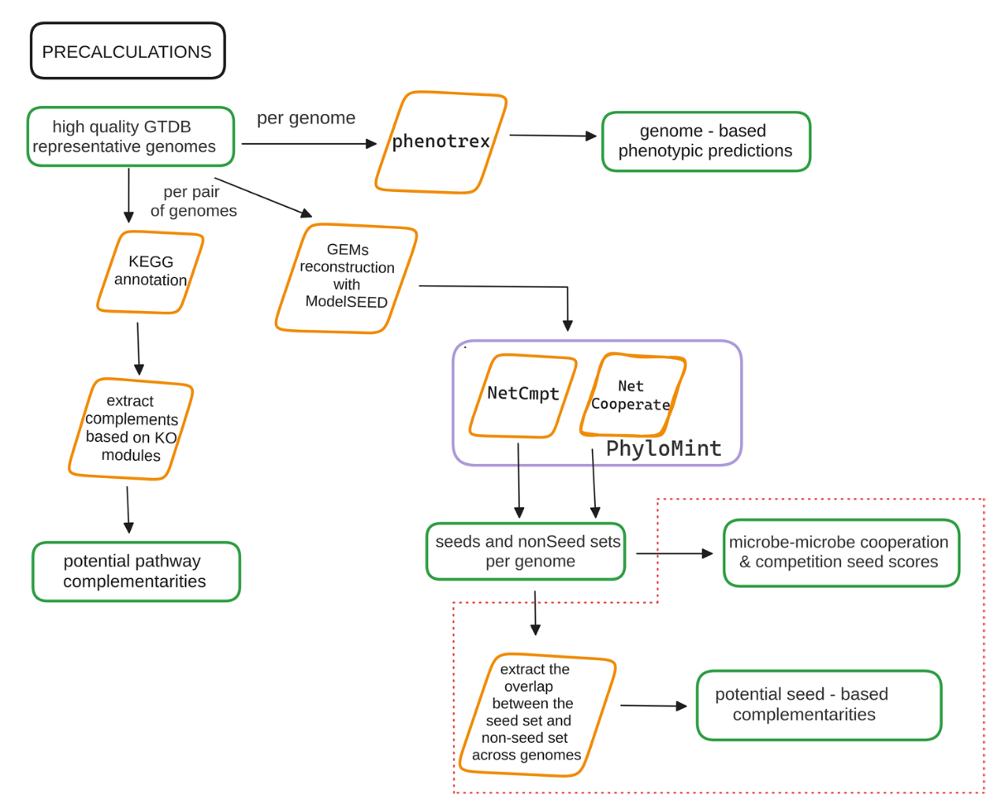
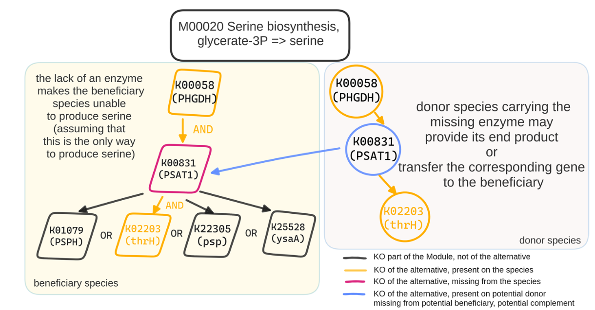
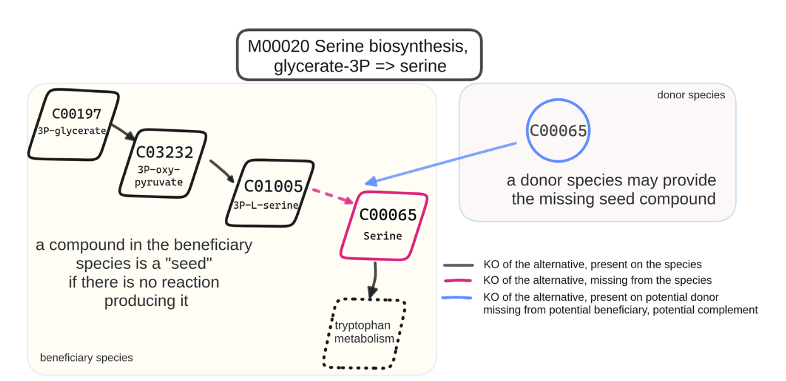

微生物共现网络的推断常常面临准确性低和工具依赖性强的挑战。这里介绍了 **microbetag**，这是一个全面的软件生态系统，旨在对微生物网络进行功能注释。该工具对网络中的节点（代表分类单元）进行表型性状富集，并对边（代表物种关联）进行代谢互补性增强，从而揭示潜在的交叉喂养关系。**microbetag** 的在线版本依赖于 **microbetagDB** 数据库，该数据库包含了 34,608 个已注释的代表性基因组。此外，用户也可以通过其独立版本，利用自定义的基因组或宏基因组组装基因组对网络进行注释。为了便于使用，作者还开发了 **MGG**，一个 Cytoscape 应用程序，为网络的获取、可视化和分析提供了简化的用户友好界面。**microbetag** 能够有效识别已知的代谢相互作用，是一个强大的假设生成工具。

## 背景

绝大多数微生物物种以群落形式存在，而自然的微生物群落通常由数百甚至数千个物种构成。每个物种都拥有独特的生化反应库，并适应于具有特定营养和环境要求的生态位。根据相互作用对相关分类单元净适应性的影响，微生物间的相互作用可分为合作、竞争、寄生、偏利共生和偏害共生等多种类型。除了其他机制，微生物可以通过竞争或交换代谢物进行相互作用，后者包括代谢物的单向或双向交换。

高通量测序技术为了解微生物群落的多样性和组成提供了强大工具。如今，作者不仅能检测到未培养的物种，还能基于其基因组信息预测其功能性状。此外，数千个微生物组样本的组成数据可供获取，使得能够基于大样本集推断物种间的关联。构建微生物共现网络是挖掘此类关联模式的常用方法。目前已有多种网络推断方法，例如基于相似性、相异性和相关性评估的方法，以及能够减少间接边数量的条件依赖性识别方法。

然而，微生物网络推断存在诸多挑战。每种推断方法都有其自身的假设和参数设置，导致最终网络结构存在差异。关联度量方法的选择、数据预处理技术、以及对数据稀疏性和零值膨胀的处理方式，都会影响结果网络。因此，网络推断的结果具有很强的工具依赖性。此外，微生物网络推断还继承了测序数据及其分析过程中的固有问题，所得到的网络往往是一个难以解读的“毛球团”。因此，需要进一步的分析来生成可检验的生物学假设。将网络预测的相互作用与已知相互作用的集合进行比较，突显了其准确性较低的问题。有学者建议通过数据整合来辅助解读网络中的边。同时，网络中的模块通常被认为是群落组成的关键驱动因素，并有多种算法可用于识别这些模块。然而，目前可用于微生物网络的数据整合方法仍然有限。

代谢网络是以数学形式对生物体内生化反应的全面表述。它可以被视为对应菌株的知识库，能够整合基因组、调控和表型信息。近十年来，自动化方法的发展支持了此类重建模型的快速生成。代谢网络拓扑分析的一个关键概念是**种子集**。根据原始定义，种子集是指“代谢网络中存在的、无法由网络中其他化合物合成（因此必须外源获取）、且其存在足以支持网络中所有其他化合物生成的最小化合物子集”。种子集是生物体必需营养素的良好代理指标。基于种子集的概念，已开发出多种基于图论的指标，用于直接根据物种代谢网络的拓扑结构预测物种间的相互作用。种子集和非种子集可用于计算互补性和重叠指数。两个物种间的**代谢互补性**反映了它们通过交叉喂养进行合作的潜力。相反，**代谢竞争**则指两个物种间的代谢重叠导致的竞争关系。分析这些指数有助于揭示可能驱动共现网络中观测模式的代谢相互作用。

为了探究一个物种是否可能从伙伴物种中获益，将分析从网络层面提升至代谢途径层面，检查它们的途径是否互补是很有帮助的。为此，作者采用了一种简单的方法，基于一对物种的 KEGG 同源基因注释和 KEGG 模块数据库，枚举所有可能的互补关系。

本文介绍的 **microbetag** 是一个用于微生物网络注释的软件生态系统。它整合了多种信息来源，以增强对网络所暗示的物种关联的信心，从而在物种对和群落水平上生成可供进一步研究的假设。**microbetag** 作为一个综合平台，通过多个维度提供关于分类单元及其潜在代谢相互作用的信息。其核心思想是**反向生态学** 方法。该方法利用基因组学探索群落生态学，而无需对所涉及分类单元有先验假设。反向生态学框架使得能够预测尚未被充分研究的微生物的生态性状及其与其他物种的相互作用。**microbetag** 通过整合网络中分类单元的表型性状，并将其潜在的代谢相互作用映射到物种关联上，来注释用户的共现网络。**microbetag** 还配有一个图形用户界面，该界面以 Cytoscape 应用程序的形式实现，为用户提供了一个直观的环境来便捷地探索注释结果。其在线版本依赖于预计算的注释，这些注释存储在 **microbetagDB** 数据库中，涵盖了约 35,000 个高质量参考基因组。数据库中的所有注释也可通过应用程序编程接口获取。

## microbetag 工作流程和软件生态系统概述

**microbetag** 整合了四个方面的注释来源——两个针对节点，两个针对边。它可以在两种模式下运行：
*   **在线模式**：用户提供的分类单元被映射到其最接近的 GTDB 代表基因组，以便进行下游注释。
*   **本地模式**：使用用户自定义的基因组作为输入。

在**节点层面**，表型性状的分配基于以下两者之一：
1.  与每个分类单元相关的基因组。
2.  其分类学身份，使用基于文献整理的 FAPROTAX 数据库。

在**边层面**，**microbetag** 通过两种互补的方法推断潜在的代谢相互作用：
1.  **途径互补性**
2.  **种子互补性**

注释后的网络可以通过专用的 Cytoscape 应用程序 **MGG** 进行可视化。**microbetag** 软件生态系统包含五个主要模块：
1.  **microbetagDB**：包含 34,608 个参考基因组及其成对组合的预计算注释。
2.  **Web 服务器**：托管 microbetagDB 和 microbetag 应用程序，用于在线注释共现网络或通过 API 检索注释。
3.  **MGG Cytoscape 应用程序**：提供用户友好界面，便于调用工作流程和研究注释后的网络。
4.  **预处理工作流**：用于处理包含超过 1000 个序列标识符的大型数据集。
5.  **独立版本**：包含预计算步骤和 microbetag 工作流，支持基于用户提供的参考基因组进行注释。

在线注释模式的简化概述如下：用户通过 MGG Cytoscape 应用程序加载丰度表（可选同时加载网络文件），然后向 microbetag 服务器提交任务。如果未提供网络，服务器会使用 FlashWeave 推断一个共现网络。接着，**microbetag** 会用表型性状注释网络的节点，并用潜在的代谢互补性注释网络的边。注释后的网络会作为任务结果返回给用户，并自动加载到 Cytoscape 中。用户随后可以利用 MGG 的功能进一步探索这些注释。

### microbetagDB 资源

目前，**microbetagDB** 包含了超过 34,000 个基因组及其注释。这些基因组大多为细菌分类单元。基于基因组注释，预测了这些基因组超过 30 种表型性状的存在与否。此外，还预计算了约 14 亿个潜在的代谢相互作用。

在 **microbetag** 框架中：
*   **途径互补性**：当供体物种基于其基因组，为受益物种提供其缺失的酶或途径，从而使受益者能够完成一个 KEGG 模块时，即认为存在途径互补性。总共识别出 341,568 个独特的途径互补性，它们构成了已观测到的 1.842 亿个成对途径互补性。
*   **种子互补性**：当受益物种的种子代谢物可由供体物种的代谢网络产生时，即产生种子互补性，表明存在潜在的交叉喂养。利用物种自身可产生的代谢物集（非种子集）和其种子集，计算了合作/竞争分数。目前，**microbetagDB** 包含 33,755 个 GTDB 代表基因组的种子和非种子集，用于在线计算这些基因组任何成对组合的种子互补性。

所有注释均可通过 API 直接从 **microbetagDB** 获取。

### 使用 microbetag 注释网络

**microbetag** 注释流程既可在本地使用自定义基因组执行，也可在线执行。无论哪种方式，注释后的网络都可通过 MGG Cytoscape 应用程序查看。MGG 应用程序极大简化了 **microbetag** 的使用，使得在线分析无需生物信息学技能即可完成。

在最简单的情况下，**microbetag** 只需要一个包含分类学分配的丰度表作为输入。如果用户提供的分类学方案并非 GTDB 或 Silva，**microbetag** 需要先将分类单元映射到 GTDB 代表基因组，这一步可能是工作流中最耗时的环节。网络推断也可能是计算密集型步骤，尤其当丰度表中的分类单元数量很大时。为了支持大型数据集的注释，**microbetag** 提供了独立的预处理工作流。用户可以先将其扩增子数据分配至 GTDB 导向的分类法，和/或在本地重建网络。一旦网络可用且分类学是 **microbetag** 支持的标准格式之一，注释所需的计算时间通常只需几秒到几分钟。注释后的网络以 `.cx2` 格式返回，可在 Cytoscape 中查看。

对于需要使用自定义/本地基因组的研究，**microbetag** 提供了不依赖 **microbetagDB** 的独立版本。在此情况下，用户需要在本地运行 **microbetag** 流程。**microbetag** 会首先执行所有基因组注释步骤，并根据用户设置进行代谢模型重建。完成后，注释网络将保存为 `.cx2` 文件，并可使用 MGG 应用程序在 Cytoscape 中可视化。

MGG 允许用户导入数据、检索注释网络，并通过一系列针对节点和边注释的 CyPanel 来深入研究注释结果。

*   **节点 CyPanel**：当选择一个节点时，节点面板会显示其分类学信息、映射到的 NCBI 分类学 ID 和 GTDB 基因组（如果是在线分析）。根据可用注释，会显示基于基因组的表型性状预测和/或基于 FAPROTAX 的注释。面板顶部提供了一个“控制区”，用户可以根据表型性状组对节点进行过滤，例如显示携带一组性状中至少一个（OR）或全部（AND）的节点。

*   **边 CyPanel**：当选择一条边时，边面板会显示所涉及的两个分类单元的名称、序列 ID 和相互作用类型。对于互补性边，会为每种互补性类型提供子面板。对于途径互补性，会显示被互补的 KEGG 模块、其描述、所属代谢类别、与建议的交叉喂养化合物相关的 KO 列表，以及基于这些添加而完成的模块版本。同时提供一个链接，指向突出显示该模块的彩色 KEGG 图。对于种子互补性，同样会提供一个可折叠表格，显示类别类型和种子化合物相关的 KEGG 图，并列出来自供体的潜在交叉喂养种子化合物。也提供链接指向彩色 KEGG 图，图中会突出显示受益者的相关化合物和可能获取的种子。

此外，MGG 还支持对网络各模块中节点表型性状的富集或耗竭进行分析。模块可以由 **microbetag** 工作流中的 `manta` 算法分配，也可由用户手动或其他聚类算法指定。

## 测试案例：microbetag 对已知相互作用网络预测的互补性

作者使用 Hessler 等人的相关性网络对 **microbetag** 进行了测试。该网络描述了在生物反应器中不同条件下培养的矿山尾矿衍生菌群。该研究中讨论了下述现象：*Variovorax*（一种硫胺素生产者）与一系列硫胺素营养缺陷型菌的共现。作者通过共培养实验测量硫胺素产量验证了网络预测。

作者获得了与网络节点对应的序列 bin 和原始网络。使用 GTDB-tk 将 GTDB 分类学分配给这些 bin 并添加到原始网络中，然后使用 **microbetag** 的在线版本进行注释。此外，也对 bin_55 (*Variovorax*) 及其在原网络中的一级邻居运行了 **microbetag** 的本地版本。

GTDB-tk 将 bin_55 映射到基因组 GCA_001899795.1，将其鉴定为 *Variovorax* sp001899795；总共 16 个涉及的分类单元中有 11 个被成功映射到 GTDB 代表基因组。对于 *Variovorax* 的预测性状，**microbetag** 表明该基因组对应一个需氧菌，能够自养生长，消耗 D-葡萄糖，并产生乙醇和 L-乳酸。同时预测其基因组编码 VI 型分泌系统。

Hessler 等人提出，*Variovorax* 是硫胺素的重要来源，可供给无法自行合成硫胺素的邻近物种。确实，**microbetag** 通过在线版本和本地版本均预测了 *Variovorax* 与其邻居之间存在多个与硫胺素相关的潜在种子互补性。然而，使用研究的 bin 的本地版本不仅返回了在线版本中未能匹配的分类单元的硫胺素支持案例，还发现了三个在原研究中被预测为营养缺陷型但与 *Variovorax* 未显示种子互补性的分类单元。有趣的是，在线版本中发现的两种作为潜在种子互补的 KEGG 化合物，在本地版本中也同样被找到。

在 *Variovorax* 的 15 个邻近分类单元中，有 10 个被标记为潜在的硫胺素受益者。其中 7 个也被 Hessler 等人预测为硫胺素营养缺陷型。唯一一个在两研究中都能匹配且在原研究中被预测为硫胺素自养型的分类单元，在 **microbetag** 中也同样被分类为自养型。有四个分类单元无法在两研究间匹配，而另有三个在原研究中被预测为营养缺陷型，但与 *Variovorax* 之间未显示种子互补性。在某些情况下，邻居之间也发现了潜在的硫胺素相关交叉喂养相互作用。

作者还指出，该 *Variovorax* 菌株的分离株需要添加泛酸才能生长。然而，根据 bin 55 映射到的基因组的 KEGG 注释，它包含了与泛酸盐生物合成相关的完整 KEGG 模块。因此，基于 **microbetag** 的分析，泛酸盐并不在 *Variovorax* 的种子代谢物之列。这凸显了 **microbetag** 方法的一个关键挑战——其定性性质可能忽略了生物体对某些化合物的定量需求，即使这些化合物是生长所必需的。不过，**microbetag** 在 *Variovorax*（作为受益者）与其邻近供体之间鉴定出了其他几种维生素 B 相关化合物的潜在互补性，包括生物素、核黄素和叶酸相关代谢物。

## 使用案例 1：交叉喂养可能解释寡糖存在下丁酸盐产量增加

Cabrera 等人的研究表明，补充铁 combined with 菊粉或短链半乳糖寡糖/长链低聚果糖，与未补充的微生物群相比，会导致婴儿肠道微生物群中双歧杆菌相对丰度更高，乙酸盐、丙酸盐和丁酸盐产量增加，以及微生物组成发生显著变化。这表明，通常因补铁而增加的肠道病原体得到了抑制。

为了进一步分析，作者首先运行 **microbetag** 的预处理步骤，将本研究 16S rRNA 基因测序数据中的 ASV 映射到基于 GTDB 的分类学分配。然后，使用 FlashWeave 推断网络，并用 **microbetag** 进行注释。

**microbetag** 预测了数个分类单元为丁酸盐生产者。有趣的是，大多数涉及丁酸盐生产者的关联是负相关的，这可能反映了它们代表了群落演替的不同阶段。同时，一个丁酸盐生产者 (*Flavonifractor plautii*; ASV0012) 具有多个正相关。**microbetag** 报告显示，*F. plautii* 与其邻居物种 *Eggerthella lenta* (ASV0107) 之间存在若干途径和种子互补性，特别是与辅酶 A 生物合成相关的互补性，而该过程参与了细菌丁酸盐生产途径。具体而言，*F. plautii* 需要外源获取泛酸盐，而 *E. lenta* 能够合成它。

因此，**microbetag** 的分析提出了一个可检验的假设：在体外补充 GOS/FOS 后，婴儿微生物群落中观察到的丁酸盐产量和 *Flavonifractor* 的增加，可能至少部分归因于处理促进的交叉喂养伙伴，这些伙伴补足了丁酸盐生产相关的代谢途径。

## 使用案例 2：对龈下菌斑微生物组数据的 microbetag 节点注释进行富集分析表明模块背后的驱动因素

作者从人类微生物组计划在 Qiita 上的记录中获取了龈下菌斑扩增子数据。相应的 OTU 表包含 373 个样本和 2057 个分类单元，超过了 **microbetag** 在线版本支持的 1000 个分类单元的上限。因此，作者首先使用 **microbetag** 的预处理工具将 OTU 分配至基于 GTDB 的分类学，并使用 FlashWeave 推断共现网络。然后，利用预处理工具的输出，作者逐步注释了网络的节点。接着，使用 **microbetag** 独立工具对网络进行聚类，得到两个模块，分别包含 504 和 822 个节点。对每个模块中的节点表型性状进行了富集/耗竭分析，并使用 Benjamini-Hochberg 方法控制错误发现率。

分析发现，模块 0 显著富集了以下性状：乙酸、需氧菌、厌氧菌、发酵性、L-乳酸和糖分解。而模块 1 则显著富集了 D-乳酸、人类相关、人类肠道、氢气和哺乳动物肠道等性状。此外，模块 1 还富含 *Phocaeicola* 和 *Bacteroides*（产生乳酸和乙酸的分类单元）以及氢气生产者。

这两个模块似乎代表了龈下菌斑微生物组的两种不同状态。模块 0 更接近于平衡的、共生的群落特征，而模块 1 则反映了一种更倾向于生态失调的状态。这一点得到了模块 1 中大量存在 *Veillonella* 代表以及 *Porphyromonas gingivalis*（尽管两个模块中都存在 *Porphyromonas* 菌株，但仅模块 1 包含已知的致病菌株）的进一步支持。需要指出的是，由于部分分类单元注释分辨率限制，*Streptococcus* 对该微环境形成的影响无法从注释中完全评估。值得一提的是，这些观察是在没有进行数据预处理和没有使用样本元数据的情况下得出的。结合研究的元数据与网络模块化和注释，将能带来更深入的见解。

### 互补性统计

在当前版本中，**microbetag** 支持 491 个 KEGG 模块的互补性分析。对这些模块的分析共识别出 23,592 个独特的**替代方案**。每个替代方案是模块的一个子网络，确保该模块的最终产物能够被合成。利用 16,902 个高质量 GTDB 基因组的蛋白质序列文件，总共检索到 1.842 亿个成对途径互补性。理论上存在 2.855 亿种可能的成对互补性，但并非每个基因组对之间都存在互补关系。具体而言，共发现 237,075 个独特的**互补单元**，它们能够完成 6467 个替代方案，总共形成了 341,568 个独特的途径互补性关系。后者是因为同一个互补单元可能同时补足多个模块。

值得注意的是，近15%的互补性与糖酵解模块相关，这在意料之中，因为该模块拥有多达13,440个替代方案。然而，对于绝大多数模块，所有枚举出的替代方案都被发现可以由其他分类单元补足。此外，有3个KEGG模块的替代方案数量超过1000个。

关于种子互补性，分析仅聚焦于与KEGG模块相关的代谢物，共涉及1432种ModelSEED化合物。其中，452种代谢物在至少一个基因组中被鉴定为种子化合物，而545种在至少一个基因组中作为非种子化合物出现。种子和非种子化合物数量的分布均呈现轻微的右偏态。平均每个基因组含有99个种子化合物和333个非种子化合物。大多数化合物只在少数基因组中作为种子存在，仅有81种化合物在超过50%的基因组中作为种子，而270种化合物可由超过75%的基因组自身合成。

潜在交叉喂养的百分比遵循正态分布，平均而言，一个基因组中有3.2%的非种子化合物会出现在其他基因组的种子集中。这表明大多数基因组提供种子化合物的潜力相似。值得注意的是，只有一个基因组（*Ureaplasma diversum* NCTC 246）的数值远低于平均值，该菌株属于包含多种寄生和腐生菌的支原体科。

分析还揭示了最常和最不常作为种子的代谢物。一些必需化合物（如ATP）作为最不常见的种子出现，这从正面验证了流程的合理性。而像cThz-P（硫胺素生物合成中间体）等化合物则是最常见的种子之一，这表明大量细菌分类群是硫胺素或其前体的营养缺陷型。

### 运行时间

**microbetag** 提供多种模块以适应不同数据集的特点。运行时间从秒级到小时级不等，具体取决于所选择的模式和数据规模。

**在线模式**
在线模式适用于小型数据集或已存在网络且分类学为标准格式的情况。
*   对于一个包含120个分类单元和251条边的现有网络，注释过程仅需40秒。
*   对于一个包含78个ASV和84个样本的丰度表（需从头推断网络），注释耗时74秒。
*   分类学映射是主要的耗时环节。将非标准分类学映射到NCBI分类ID会使上述示例的运行时间增加52秒。

**预处理工具**
对于超过1000个分类单元的大型数据集，推荐先使用预处理工具。该工具能生成GTDB注释的丰度表和共现网络，以便后续快速进行在线注释。例如，处理一个包含997个ASV和16个样本的数据集，在15个CPU的计算机上，实际运行时间为3分钟52秒，用户时间为24分钟19秒，表明实现了并行化。使用预处理后的结果进行在线注释，仅需40秒。

**独立版本**
独立版本适用于超大规模网络或需要使用自定义基因组的分析。运行时间差异很大，高度依赖于基因组数量以及是否需要从头进行基因注释和代谢模型重建。例如，注释7个宏基因组bin，仅基因预测和KO注释就需要数小时。使用carveme进行代谢重建比ModelSEED更快、更稳健。

## 讨论

### 潜力与局限性

前述内容展示了 **microbetag** 在解读共现网络方面的潜力及其在生成新假设方面的应用。此外，**microbetag** 还在多个方面使微生物组研究社区受益。**microbetagDB** 本身就是一个丰富的资源库。

然而，作者的方法也面临若干挑战。首先，**microbetag** 继承了其所依赖数据和软件本身的偏差和局限性。功能注释存在其固有的限制。某些功能域拥有更丰富的注释和更全面的描述，而其他域则相对欠缺。在测试案例中，代表 *Variovorax* 菌株的 bin 被映射到一个包含完整泛酸盐生物合成 KEGG 模块的基因组。因此，**microbetag** 无法预测出该菌株需要外源泛酸才能生长这一事实。这凸显了菌株水平变异的重要性，以及基因组潜力与酶的实际表达和合成之间的差异。

除了测序和注释的挑战，还需考虑以下因素：
*   **途径互补性**的准确性受限于 KEGG 模块数据库的完整性以及 KO 注释软件的精确度。而且，途径互补性本身并不能保证细胞内代谢物确实被交换；**microbetag** 不检查代谢物是否能被分泌或吸收。
*   关于**种子互补性**，自动化代谢网络重建本身存在挑战，不同的重建工具各有其局限性。因此，不同的重建方法可能导致不同的代谢网络，从而得到不同的种子集和非种子集。在 **microbetagDB** 中，种子互补性是使用 ModelSEED 和在完全培养基下重建的代谢网络进行预计算的，这可能会限制潜在相互作用的范围，但检索到的相互作用可能更可靠。此外，基于种子集的预测通常未考虑环境因素。当前版本也未检查种子代谢物是否为生长所必需。

因此，必须强调，途径和种子互补性是对**潜在**交叉喂养关系的预测，并不一定反映实际的相互作用。它们应被视为生成假设的工具，而非最终结论。

### 背景与未来工作

**microbetag** 是基于反向生态学方法的工具之一，其目标是从群落成员的基因组中推导出生态学见解，特别是关于相互作用的信息。**microbetag** 通过将基于代谢网络的相互作用预测不仅与微生物网络推断相结合，而且与物种表型性状的系统注释相整合，超越了之前的工具和方法。此外，它使得没有生物信息学技能的研究人员也能利用这些方法。因此，它是一个独特的资源，对所有处理微生物组数据的研究者都具有潜在价值。

在未来，作者计划开发两个主要功能：
1.  整合用户提供的转录组学数据，根据所涉及的 KO 是否表达来增强或降低潜在代谢相互作用的可能性。
2.  整合空间数据，因为细胞间的距离决定了相互作用是否发生。

## 方法

### 包含的基因组

使用GTDB v207的细菌和古菌元数据文件，我们检索了高质量代表性基因组的NCBI基因组登录号，即完整度≥95%且污染度≤5%。共获得34,608个基因组，代表25,294个唯一的NCBI分类学ID（因为存在多个GTDB物种映射到同一个NCBI分类学ID的情况）。所有基因组均使用COG进行注释。对于16,900个具有可用氨基酸序列文件的基因组，这些文件被用于识别基因组对之间的潜在途径互补性。此外，在可用的情况下，会从PATRIC数据库检索相应的注释以用于重建代谢网络。

### microbetag 工作流程

如图所示，microbetag工作流程期望一个代表扩增子或鸟枪法测序数据的丰度表作为输入。如果微生物网络已经存在，用户也可以将其作为输入提供。microbetag工作流程将首先把丰度表中存在的分类单元映射到它们对应的GTDB代表性基因组（如果可能，即提供的分类学达到物种或菌株水平）。如果未提供网络，microbetag将使用FlashWeave构建一个。然后，将使用丰度表通过FAPROTAX进行基于文献的注释。这是Web服务工作流程中唯一不依赖于microbetagDB的注释步骤。网络的节点将使用基于phenotrex预测的表型性状进行进一步注释。连接到在物种或菌株水平被分配的分类单元的边，将使用途径和种子互补性以及种子分数进行注释。最后，将使用manta执行网络聚类，将每个节点分配到一个簇。注释后的网络随后以.cx2格式返回。如果用户的分析不需要，可以跳过任何这些注释步骤。

### 分类学方案和基因组分配

microbetag的在线版本需要将丰度表中的条目分类学映射到其相应的NCBI分类学ID，并在可能的情况下，映射到其最接近的GTDB代表性基因组。支持两种已确立的分类学方案：广泛用于bin和/或MAG分类的GTDB，以及广泛用于扩增子研究的Silva数据库。这两种分类学方案都将其分类学链接到NCBI分类学ID。如果使用了Silva、GTDB或microbetag预处理工具中应用的GTDB特异性16S rRNA数据库，microbetag需要精确的分类学匹配才能将基因组分配给正在研究的序列/分类学。如果两者都未使用，并且丰度表包含少于1000个分类单元，microbetag会将用户提供的分类学映射到NCBI分类学。为此，microbetag利用了fuzzywuzzy库，该库实现了Levenshtein距离度量来获取最接近的NCBI分类单元名称及其相应的NCBI分类学ID；使用高相似度分数以避免假阳性。另外，使用NCBI分类学的节点转储文件，microbetag可以检索用户数据中某个分类单元的子分类单元及其相应的NCBI分类学ID（如果用户要求）。如果用户提供的丰度表分类学已经映射到GTDB分类学，microbetag将有效地将它们与microbetagDB中的相应条目匹配，并返回它们相关的注释。

### 网络推断

当用户未提供微生物网络时，microbetag依赖FlashWeave在线构建一个。microbetag支持注释由任何算法/软件构建的、任何Cytoscape可以加载的格式的网络。

### microbetag 预处理

为了帮助用户将其序列映射到GTDB分类学，使用了细菌和古菌的DADA2格式16S rRNA基因序列来训练DECIPHER包的IDTAXA分类器，并通过microbetag预处理Docker镜像提供。同样，当丰度表包含超过1000个分类单元和/或分类学方案不属于自动映射的范围时，必须提供网络作为输入。microbetag预处理Docker镜像也支持使用FlashWeave推断网络。

### 基于文献的节点注释

FAPROTAX利用一组Tara Ocean样本，通过基于当前文献、培养代表菌株的描述和/或系统微生物学手册将每个分类单元分类到功能组中，来估计细菌和古菌群落的功能潜力。在这种手动整理的方法中，仅当某个分类单元内所有已培养的物种都被证明具有该功能时，才会将该分类单元与功能关联起来。microbetag使用的版本FAPROTAX包含80多个基于7600个功能注释的功能，覆盖了4600多个分类单元。与基于基因内容的方法相反，FAPROTAX基于实验证据估计代谢表型。microbetag调用FAPROTAX的附带脚本，将用户丰度表中包含的样本或所提供网络中存在的分类单元的微生物群落分类学谱转换为推定的功能谱。然后，它解析FAPROTAX的子表，用它们命中的所有功能对用户数据中存在的每个分类单元进行注释。FAPROTAX注释不是microbetagDB的一部分，而是在线计算的。

### 基于基因组的节点注释

phenDB是一个公开可用的资源，支持分析细菌基因组以识别独特的功能性状，例如一个物种是否产生丁醇或具有嗜盐生活方式。它依赖于使用手动整理的数据集训练的支持向量机，基于基因存在/缺失模式进行性状预测。更具体地说，特定性状的模型是使用EggNOG注释的基因组集合进行训练的，其中已知该集合成员是否存在该性状。这些模型用于预测未研究物种中相应性状的存在/缺失。对于microbetagDB，使用phenDB为每个性状提供的基因组重新训练了分类器，以与最新版本的EggNOG和phenotrex软件工具同步。使用Batch Entrez程序从NCBI下载基因组。然后为所有高质量的GTDB代表性基因组生成基因型文件。然后将每个模型用于所有GTDB基因型文件，用性状的存在或缺失对每个文件进行注释。microbetagDB中基因组测试的所有表型性状的列表可在microbetag的文档站点上找到。更新后的模型也可用。图9总结了这些预计算步骤。每个基因组预测存在或缺失的性状的详尽列表见补充文件2：表S1。

### 途径互补性

为了推断潜在的途径互补性，我们依赖于KEGG MODULES数据库中的模块。KEGG模块被定义为KEGG框架内的一个功能单元，代表参与特定生物过程或途径的一组酶和反应。这样的单元由几个步骤组成，每个步骤可能有不止一种分子方式发生。模块的定义是一个逻辑表达式，由KEGG ORTHOLOGY术语组成，这些术语可以通过以下方式相互耦合：途径的连接步骤、分子复合物的组成部分、同一步骤的替代方案，以及复合物的可选实体。情况和应被视为AND逻辑运算符，而情况可以用OR运算符表示。给定一个模块的定义，我们将把定义中提到的KO术语的任何子集视为一个替代方案，该子集对每个步骤恰好有一种执行方式，前提是模块的所有步骤都被覆盖。我们定义，仅当至少一个替代方案的所有KO都存在于其中时，一个基因组才拥有一个完整的模块。在补充信息中，我们展示了一个模块及其替代方案的示例。

在此框架内，使用kofamscan对16,900个具有可用.faa文件的高质量GTDB代表性基因组进行KO注释。然后将每个基因组的KO映射到它们相应的KEGG模块；一个KO术语可能映射到多个模块。使用KEGG API检索所有模块定义，并对其进行解析以枚举它们的替代方案。然后研究每对KEGG注释基因组的潜在途径互补性，即检查缺少某些KO的基因组是否可以从另一个物种的基因组中受益以完成其模块。在这种情况下，基因组B不一定拥有模块x的完整替代方案；只要它拥有基因组A完成其某个替代方案所需的缺失KO，基因组B就在模块x方面潜在地补足了基因组A。借助KEGG途径图谱查看器的图形用户界面，每个互补性都可以在KEGG代谢图中可视化。在这种情况下，供体贡献的KO以蓝绿色显示，而来自受益基因组的KO以红色显示。microbetag通过识别两个分类单元都映射到microbetagDB中已注释基因组的配对来注释微生物网络的边。由于微生物网络通常是无向的，因此关联的两个节点都被视为潜在的供体和受益物种。当多个GTDB代表性基因组映射到同一个NCBI分类学ID时，会考虑所有可能的基因组组合。最后，在此类分类单元对的注释网络中添加两条有向边：一条将物种A视为潜在受益者，物种B视为潜在供体物种，另一条反之亦然。

### 种子分数和互补性

基于一个物种的种子集，已经提出了几种估计两个或多个物种之间代谢相互作用的指标。代谢互补性指数衡量两个微生物物种通过互补彼此生物合成能力而相互帮助的程度。如所述，它定义为物种A的种子化合物中可以被物种B的代谢网络合成的比例，即它们不是物种B的种子。我们将这个集合称为非种子集，它代表了代谢网络可以自行产生的化合物。代谢互补性指数提供了两个物种之间潜在交叉喂养相互作用的上限评估。种子可能是独立的，即它们不能由代谢网络中的任何其他生化反应产生，或者它们可以是相互依赖的，形成种子化合物组。因此，网络的每个强连通分量的大小可以用作化合物作为种子的置信度。代谢竞争指数定义为物种A的种子集与物种B的种子集的交集，经置信度加权和归一化后得到。代谢竞争指数代表两个物种营养谱的相似性。该指数建立了一个物种可能面临来自另一个物种的竞争水平的上限。这些指标已在NetCooperate和NetCmpt工具中分别描述和实现。我们将这两个指标称为“种子分数”。最近发布了PhyloMint工具，支持识别种子和非种子集，并能够随后计算SBML格式代谢网络的种子分数。

在microbetag框架中，使用源自高质量GTDB代表性基因组的代谢网络和PhyloMint工具计算种子分数。使用Model SEED管道通过其Python接口ModelSEEDpy重建代谢网络。后者需要RAST注释的基因组。如果可通过PATRIC数据库获得，则从PATRIC检索注释，否则，通过RASTtk执行RAST注释。由于PhyloMInt未考虑反应可逆性，因此采用了该工具的修改版用于microbetag。识别并存储了PATRIC注释基因组的种子和非种子集，以便microbetag的在线版本可以计算映射到用户数据集的所有基因组对的种子和非种子集之间的重叠。每个代谢网络的种子和非种子化合物被映射到它们相应的KO术语（作为其反应的底物或产物），并且那些与KEGG模块相关的化合物被进一步考虑。聚焦于KEGG模块相关的KO术语作为感兴趣的术语，检索物种A的种子集与物种B的非种子集的重叠。将两个分类单元都映射到至少一个GTDB基因组的微生物网络的边通过列出所有至少有一种种子化合物对受益物种有用的KEGG图谱进行进一步注释。

### 网络聚类

Manta是一种启发式网络聚类算法，可有效聚类加权网络中的节点，利用负边的存在并辨别弱和强的簇分配。microbetag调用manta对微生物网络进行聚类。如果执行了manta，注释网络将继承manta返回的布局。然而，如下所述，如果满足预期的输出格式，MGG GUI可以使用任何网络聚类算法产生的簇。

### MGG Cytoscape 应用程序

我们开发了一个Cytoscape应用程序，以提供一种直接、用户友好的方式来执行microbetag工作流程并可视化microbetag注释的网络。MGG应用程序是基于scNetViz的源代码构建的。在Cytoscape的Apps选项卡下，该应用程序添加了两个菜单项：MGG和MGG富集分析。第一个支持数据导入和在线执行，而后者在加载microbetag注释网络后启用富集分析。通过MGG条目，用户还可以将MGG视觉样式应用于网络。应用后，节点根据其microbetag分类学分配级别进行着色，注释的节点以绿色突出显示。边以蓝色表示正权重，深粉色表示负权重。所有颜色设计都对色盲友好。黑色有向边代表途径和/或种子互补性。通过MGG条目，用户可以启动MGG结果面板——一个出现在Cytoscape界面右侧的双标签面板，一个标签专注于节点，另一个专注于边。可以根据microbetag注释过滤网络节点和边，这些注释可以单独或批量检查。有关MGG功能和使用的更多信息，我们请读者访问microbetag文档页面的相关选项卡。

### 表型性状组

从FAPROTAX和phenDB类注释步骤返回的表型性状被组织成有生物学意义的组。支持的主要组涉及：物种的生活方式；与物种代谢潜力相关的生物地球化学过程；物种预测产生的重要代谢物。这些组的目的是便于对存在的分类单元进行过滤。对此类组中性状的富集分析可以通过MGG Cytoscape应用程序进行。

### 软件架构

Microbetag的流水线可作为Python包使用。为了部署在线版本，构建了一个基于Docker的应用程序。我们使用Docker容器部署microbetag应用程序，这些容器由Docker Compose管理。Docker Compose是一个使用YAML文件配置应用程序所需服务来定义和运行多容器Docker应用程序的工具。同时使用三个Docker镜像的容器：包含microbetagDB的MySQL数据库、nginx Web服务器，以及应用程序本身（包括API和microbetag工作流程）。使用Gunicorn构建了一个应用服务器，该服务器使用Web服务器网关接口协议与Web服务器通信并处理传入的HTTP请求。microbetag是作为一个Flask应用程序实现的；Flask是一个用于开发Python Web应用程序和RESTful API的微型Web框架。API有一个用于执行microbetag工作流程的路由（通过任何Python控制台或Cytoscape MGG应用程序），还有几个其他路由可以快速方便地访问microbetagDB内容，例如存在的基因组、它们基于基因组注释预测的表型性状、特定基因组或NCBI分类学ID之间的途径和种子互补性，以及它们相应的种子分数（如果可用）。microbetag API的详细说明可在文档网站上找到。microbetag Web服务的源代码可在GitHub上找到。

## References
1. Zafeiropoulos, H., Delopoulos, E.I.M., Erega, A. et al. microbetag: simplifying microbial network interpretation through annotation, enrichment tests, and metabolic complementarity analysis. Genome Biol 26, 292 (2025). https://doi.org/10.1186/s13059-025-03769-2
2. https://microbetag.readthedocs.io/en/v1.0.3/index.html
