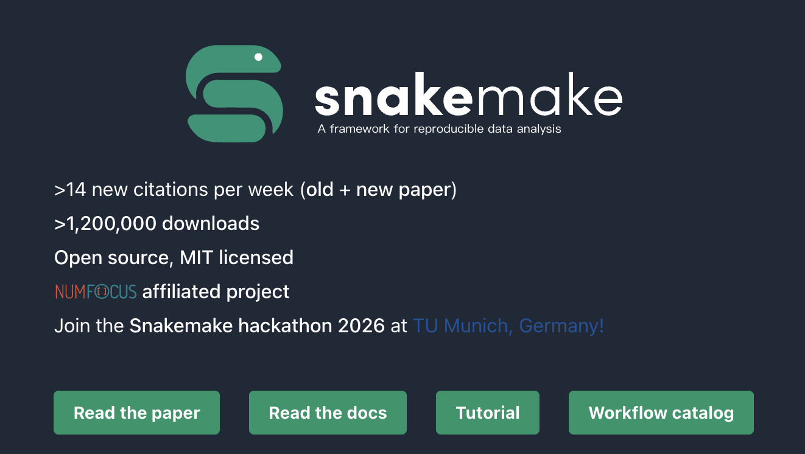

## Introduction

在日常生信科研中，我们会遇到这样的场景：

- 你花一周时间跑完一套 RNA-seq 流程，结果审稿人要求换一个参考基因组；
- 合作者说“你的脚本在我服务器上跑不通”；
- 你不敢删中间文件，因为不知道哪个步骤会用到；
- 想并行跑 100 个样本，但手动提交 100 个作业太痛苦……

这些问题的根源在于：**传统 shell 脚本缺乏对任务依赖、环境隔离、执行调度的抽象能力**。



而 **Snakemake** 正是为解决这些痛点而设计的现代工作流系统。它由德国杜塞尔多夫大学 Johannes Köster 团队开发，自 2012 年发布以来，已成为生物信息学领域事实上的标准之一。

> ✅ **核心优势**：
> - **声明式语法**：你只需描述“输入是什么、输出是什么”，不用关心执行顺序
> - **自动跳过已完成步骤**：修改某一步后，只重跑受影响的部分
> - **原生支持 Conda**：每个步骤绑定独立软件环境
> - **无缝对接 HPC/云平台**：Slurm、PBS、DRMAA、Kubernetes 等
> - **自动生成可视化报告**：含 DAG 图、软件版本、数据血缘

---

## Snakemake 核心概念详解

### 1. Snakefile：流程的“蓝图”

所有规则写在一个名为 `Snakefile` 的文件中（无需后缀），使用 Python 语法子集。

### 2. Rule（规则）

每个 `rule` 定义一个计算单元：

```python
rule my_task:
    input:
        "data/input.txt"
    output:
        "results/output.txt"
    conda:
        "envs/my_env.yaml"
    threads: 4
    resources:
        mem_mb=8000,
        runtime=60  # 分钟
    shell:
        "my_tool --threads {threads} --mem {resources.mem_mb} -i {input} -o {output}"
```

- `{input}`、`{output}`、`{threads}` 等会被自动替换
- `conda` 指向一个 YAML 环境文件，确保工具版本一致

### 3. Wildcard（通配符）

用 `{sample}`、`{group}` 等占位符实现“泛化规则”：

```python
rule align:
    input:
        fastq="data/{sample}.fastq",
        ref="genome.fa"
    output:
        "aligned/{sample}.bam"
```

当目标是 `aligned/A.bam` 时，Snakemake 自动将 `{sample}` 替换为 `A`。

### 4. Dependency Graph（依赖图）

Snakemake 根据 output → input 的链条，自动生成有向无环图（DAG）。例如：

```
plot_quals ← call_variants ← sort_alignments ← map_reads
```

它会智能判断哪些任务已存在、哪些需要运行。

### 5. temp() 与 directory()

- `temp("file.bam")`：标记为临时文件，后续不再需要时自动删除
- `directory("results/")`：标记为目录输出（避免误判）

---

## 实战：构建一个 WGS 变异检测流程

复现 [Snakemake 官方短教程](https://snakemake.readthedocs.io/en/v7.20.0/tutorial/short.html)，加入更详细的解释。

### 第 0 步：准备数据

```bash
mkdir snakemake-wgs && cd snakemake-wgs
wget https://github.com/snakemake/snakemake-tutorial-data/archive/v5.4.5.tar.gz
tar -xzf v5.4.5.tar.gz --strip-components=1 "snakemake-tutorial-data-5.4.5/data"
```

得到：
```
data/
├── genome.fa          # 参考基因组
└── samples/
    ├── A.fastq
    ├── B.fastq
    └── C.fastq
```

### 第 1 步：创建项目结构

```bash
mkdir -p workflow envs notebooks report results/calls results/mapped results/plots
touch workflow/Snakefile
```

### 第 2 步：编写 Snakefile（逐行解析）

```python
# workflow/Snakefile

# 定义样本列表（实际项目建议用 config.yaml）
SAMPLES = ["A", "B", "C"]

# 默认目标：第一个 rule 是入口点
rule all:
    input:
        "results/calls/all.vcf",
        "results/plots/quals.svg"

# 步骤1：比对 reads 到参考基因组
rule map_reads:
    input:
        ref="data/genome.fa",
        reads="data/samples/{sample}.fastq"
    output:
        temp("results/mapped/{sample}.bam")  # 临时文件
    conda:
        "envs/mapping.yaml"   # 指定 Conda 环境
    threads: 8                # 声明需要 8 线程
    shell:
        # 使用 {threads} 动态传参
        "bwa mem -t {threads} {input.ref} {input.reads} | "
        "samtools view -b - > {output}"

# 步骤2：排序 BAM
rule sort_alignments:
    input:
        "results/mapped/{sample}.bam"
    output:
        "results/mapped/{sample}.sorted.bam"
    conda:
        "envs/mapping.yaml"
    shell:
        "samtools sort -o {output} {input}"

# 步骤3：联合变异检测（聚合所有样本）
rule call_variants:
    input:
        fa="data/genome.fa",
        bam=expand("results/mapped/{sample}.sorted.bam", sample=SAMPLES)
    output:
        "results/calls/all.vcf"
    conda:
        "envs/calling.yaml"
    shell:
        "bcftools mpileup -f {input.fa} {input.bam} | "
        "bcftools call -mv - > {output}"

# 步骤4：用 Python 画质量分布图
rule plot_quals:
    input:
        "results/calls/all.vcf"
    output:
        report("results/plots/quals.svg", caption="report/calling.rst")
    conda:
        "envs/stats.yaml"
    notebook:
        "notebooks/plot-quals.py.ipynb"
```

> 🔍 **关键点说明**：
> - `expand()` 函数展开所有样本路径
> - `report()` 标记文件用于生成 HTML 报告
> - `notebook` 支持 `.py` 或 `.ipynb`，Snakemake 会自动注入 `snakemake.input/output`

### 第 3 步：创建 Conda 环境文件

```yaml
# envs/mapping.yaml
channels:
  - bioconda
  - conda-forge
dependencies:
  - bwa=0.7.17
  - samtools=1.9
```

```yaml
# envs/calling.yaml
channels:
  - bioconda
  - conda-forge
dependencies:
  - bcftools=1.9
```

```yaml
# envs/stats.yaml
channels:
  - bioconda
  - conda-forge
dependencies:
  - python=3.9
  - pysam=0.17
  - pandas=1.3
  - altair=4.1
  - altair_saver=0.5
```

### 第 4 步：生成绘图脚本

```bash
snakemake --draft-notebook results/plots/quals.svg --use-conda --cores 1
```

编辑 `notebooks/plot-quals.py.ipynb`，添加：

```python
import pandas as pd
import altair as alt
from pysam import VariantFile

quals = pd.DataFrame({
    "qual": [record.qual for record in VariantFile(snakemake.input[0])]
})

chart = alt.Chart(quals).mark_bar().encode(
    alt.X("qual:Q", bin=True),
    alt.Y("count()")
)
chart.save(snakemake.output[0])
```

### 第 5 步：本地运行与验证

```bash
# 干跑：查看执行计划
snakemake --use-conda -n

# 实际运行（限制 4 核）
snakemake --use-conda --cores 4

# 强制重跑某一步
snakemake --use-conda --forceall results/plots/quals.svg

# 生成交互式 HTML 报告
snakemake --report report.html
```

打开 `report.html`，你会看到：
- 流程拓扑图
- 每个步骤的运行时间、资源消耗
- 软件版本快照
- 嵌入的 SVG 图（可直接下载）

---

## 在 Slurm 集群上高效运行

大多数高校 HPC 使用 **Slurm** 作业调度系统。Snakemake 提供两种方式对接。

### 方式一：原生 Slurm 支持（推荐，v7.0+）

这是最简洁的方式，无需写 sbatch 模板：

```bash
snakemake \
  --slurm \
  --default-resources \
    slurm_account=my_lab \
    slurm_partition=cpu \
    mem_mb=8000 \
    runtime=120 \
  --jobs 100 \
  --use-conda
```

#### 在规则中覆盖默认资源

```python
rule heavy_job:
    output: "big_result.txt"
    resources:
        mem_mb=64000,
        runtime=240,
        slurm_partition="highmem"
    shell: ...
```

#### MPI 任务支持

```python
rule mpi_analysis:
    output: "mpi.out"
    resources:
        tasks=32,
        mpi="srun"
    shell:
        "{resources.mpi} -n {resources.tasks} my_mpi_program > {output}"
```

> 💡 注意：`srun` 是 Slurm 的 MPI 启动器，兼容 OpenMPI、Intel MPI 等

### 方式二：通用集群模式（兼容旧版）

适用于 PBS、SGE 等系统：

```bash
snakemake \
  --cluster "sbatch -p {resources.slurm_partition} -t {resources.runtime} --mem={resources.mem_mb}M" \
  --jobs 50 \
  --default-resources runtime=60 mem_mb=8000 slurm_partition=cpu
```

### 使用 Profile 管理配置

创建 `~/.config/snakemake/slurm/config.yaml`：

```yaml
slurm: true
default-resources:
  - slurm_account=my_lab
  - slurm_partition=cpu
  - mem_mb=8000
  - runtime=120
jobs: 100
use-conda: true
rerun-incomplete: true
```

然后只需运行：

```bash
snakemake --profile slurm
```

---

## 实践建议

1. **使用 Conda 环境**：避免系统依赖污染
2. **样本信息外置**：用 `configfile: "config.yaml"` 管理样本表
3. **模块化 Snakefile**：用 `include:` 拆分大型流程
4. **标记临时文件**：节省磁盘空间
5. **定期生成报告**：方便协作与归档
6. **版本控制整个 workflow 目录**：包括 Snakefile、envs、scripts


Snakemake 不仅是一个工具，更是一种**科研工程化思维**的体现：

- 从“能跑就行” → “可靠可重复”
- 从“手动运维” → “自动化流水线”
- 从“单机脚本” → “集群规模化”

无论是 PI、博士生还是生信工程师，掌握 Snakemake 都将极大提升你的科研效率与成果可信度。

> 📚 官方文档：https://snakemake.readthedocs.io  
> 🐍 GitHub 示例库：https://github.com/snakemake-workflows

