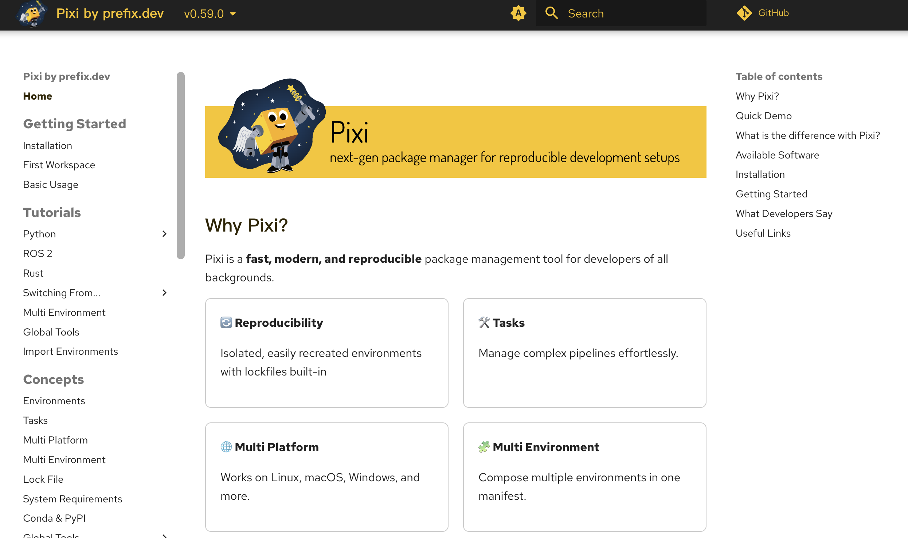
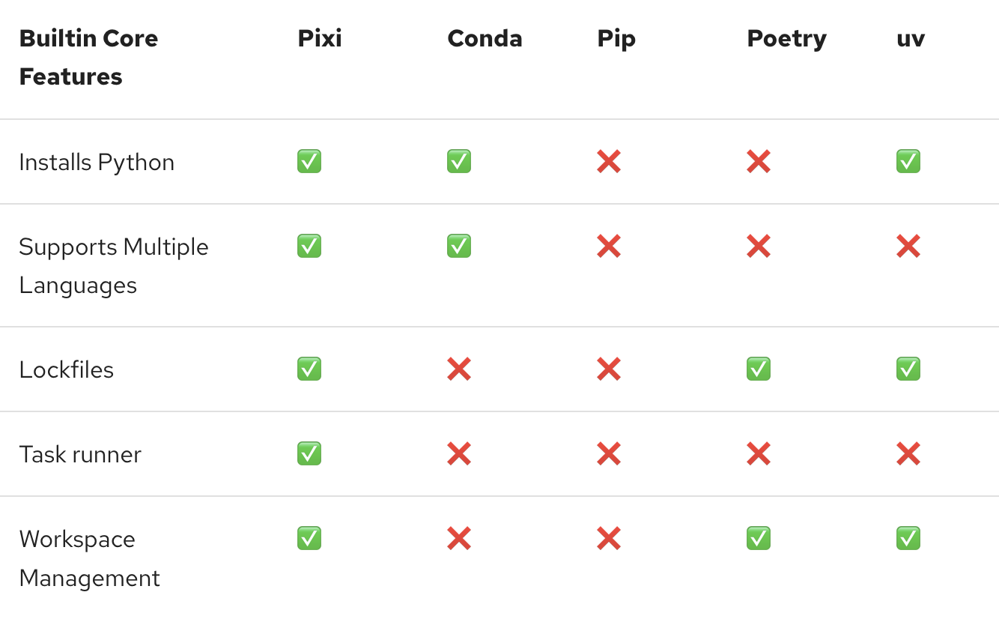

## 什么是 Pixi？



Pixi 是由 [prefix.dev](https://prefix.dev) 开发的一款**快速、可复现、跨语言的包管理与任务运行工具**。它的目标是解决开发者在日常工作中遇到的三大难题：

1. **依赖混乱**：Python、Rust、C++、Node.js 等语言的包分散在不同系统中；
2. **环境不可复现**：今天能跑的代码，明天换台电脑就报错；
3. **脚本管理困难**：测试、构建、部署命令散落在文档或 shell 脚本里。

Pixi 通过一个统一的配置文件 `pixi.toml` 和一个命令行工具 `pixi`，将**依赖管理、环境隔离、任务执行**全部整合在一起，支持 Linux、macOS 和 Windows。

它底层使用 Rust 编写的 [rattler](https://github.com/prefix-dev/rattler) 引擎，解析速度极快，并原生支持：
- **Conda 生态**（如 `python`, `pytorch`, `opencv`, `rust`）
- **PyPI 生态**（通过 [uv](https://github.com/astral-sh/uv) 高速解析）





## 安装 Pixi

✅ 支持平台
- Linux（x86_64 / aarch64）
- macOS（Intel / Apple Silicon）
- Windows（PowerShell 或 CMD）

🔧 安装方法

▶ Linux / macOS
打开终端，运行：
```bash
curl -fsSL https://pixi.sh/install.sh | sh
```

安装完成后，**重启终端**，或手动加载 shell 配置：
```bash
source ~/.bashrc      # 如果你用 bash
source ~/.zshrc       # 如果你用 zsh
```

▶ Windows（PowerShell）
以管理员身份打开 PowerShell，运行：
```powershell
irm -useb https://pixi.sh/install.ps1 | iex
```

安装后关闭并重新打开终端。

> 💡 安全提示：安装脚本开源，可查看 [install.sh](https://github.com/prefix-dev/pixi/blob/main/install.sh) 和 [install.ps1](https://github.com/prefix-dev/pixi/blob/main/install.ps1)。

✅ 验证安装
```bash
pixi --version
```
输出类似：
```
pixi 0.28.0
```

如果命令未找到，请检查 PATH 是否包含 `~/.pixi/bin`（Linux/macOS）或 `%USERPROFILE%\.pixi\bin`（Windows）。

---

## 第一个 Pixi 项目 —— Hello World

我们将创建一个最简单的 Python 项目，打印 “Hello, Pixi!”。

### 步骤 1：初始化项目
```bash
mkdir hello-pixi
cd hello-pixi
pixi init
```

这会生成一个 `pixi.toml` 文件，内容如下：
```toml
[project]
name = "hello-pixi"
version = "0.1.0"
description = "Add a short description here"
authors = []
channels = ["conda-forge"]
platforms = ["osx-arm64"]  # 你的平台可能不同，如 linux-64、win-64
```

> 注意：`platforms` 字段会根据你当前操作系统自动填写，确保环境可复现在相同架构上。

### 步骤 2：添加 Python 依赖
```bash
pixi add python=3.11
```

此时 `pixi.toml` 变为：
```toml
[project]
name = "hello-pixi"
version = "0.1.0"
# ... 其他字段 ...

[dependencies]
python = "3.11"
```

同时生成了 `pixi.lock` 文件——这是**可复现性的核心**，记录了所有依赖的确切版本和哈希值。

### 步骤 3：编写 Python 脚本
创建文件 `hello.py`：
```python
print("Hello, Pixi!")
```

### 步骤 4：运行程序
```bash
pixi run python hello.py
```

输出：
```
Hello, Pixi!
```

✅ 成功！你已在一个完全隔离的环境中运行了 Python 程序，无需全局安装 Python。

> 💡 `pixi run` 会自动激活项目环境，并在其中执行命令。

---

## Pixi 基本命令

| 命令 | 作用 |
|------|------|
| `pixi init` | 初始化新项目，生成 `pixi.toml` |
| `pixi add <package>` | 添加 Conda 包（如 `numpy`） |
| `pixi add --pypi <package>` | 添加 PyPI 包（如 `requests`） |
| `pixi install` | 根据 `pixi.toml` 安装所有依赖（通常自动触发） |
| `pixi run <command>` | 在项目环境中运行命令 |
| `pixi shell` | 进入交互式 shell（环境已激活） |
| `pixi remove <package>` | 移除依赖 |
| `pixi list` | 列出当前环境中的所有包 |
| `pixi global install <tool>` | 安装全局 CLI 工具（如 `gh`, `ripgrep`） |
| `pixi task` | 列出所有定义的任务 |

---

## 理解 `pixi.toml`

`pixi.toml` 是 Pixi 项目的**唯一配置文件**，采用 [TOML](https://toml.io/) 格式（比 YAML 更简单、更安全）。

### `[project]` 段：项目元信息
```toml
[project]
name = "my-data-project"
version = "1.0.0"
description = "Analyzes user behavior data"
authors = ["Alice <alice@example.com>"]
channels = ["conda-forge", "pytorch"]  # 依赖来源仓库
platforms = ["linux-64", "osx-arm64"] # 支持的平台
```

- `channels`：指定包从哪些 Conda channel 安装，默认是 `conda-forge`；
- `platforms`：列出你希望支持的操作系统和架构，影响锁文件生成。

### `[dependencies]`：Conda 依赖
```toml
[dependencies]
python = ">=3.10,<3.13"
numpy = "*"
pytorch = { channel = "pytorch", version = "2.3.*" }
```

支持：
- 简单版本（`"3.11"`）
- 版本范围（`">=3.10,<3.13"`）
- 指定 channel（`{ channel = "pytorch", version = "..." }`）

### `[pypi-dependencies]`：PyPI 依赖
```toml
[pypi-dependencies]
requests = ">=2.28"
fastapi = { version = "^0.100", extras = ["all"] }
```

> ⚠️ 必须显式使用 `--pypi` 参数添加，或手动写入此段。Pixi 不会自动混用 Conda 和 PyPI。

### `[tasks]`：任务定义
替代 Makefile 或 npm scripts：
```toml
[tasks]
test = "pytest tests/"
lint = "ruff check ."
serve = { cmd = "uvicorn app:app", env = { PORT = "8080" } }
docs = { depends_on = ["install"], cmd = "mkdocs build" }
```

- `cmd`：要执行的命令；
- `env`：设置环境变量；
- `depends_on`：声明任务依赖（如先安装再构建）。

运行任务：
```bash
pixi run test
pixi run serve
```

### 多环境支持：`[feature]` 与 `[environments]`

大型项目需要不同环境：

```toml
# 基础依赖
[dependencies]
python = "3.11"

# 开发特性
[feature.dev.dependencies]
pytest = "*"
ipython = "*"

# GPU 特性
[feature.gpu.dependencies]
pytorch = { channel = "nvidia", version = "2.3", build = "cuda12*" }

# 环境组合
[environments]
default = ["dev"]        # 默认环境包含 dev
gpu = ["dev", "gpu"]     # gpu 环境包含 dev + gpu
```

激活特定环境：
```bash
pixi shell --environment gpu
```

---

## 核心概念

### 环境（Environment）
每个 Pixi 项目默认有一个 **default 环境**，但可通过 `environments` 定义多个。每个环境是独立的 Conda 环境，包含特定依赖集合。

- 环境存储在 `.pixi/envs/<name>` 目录下；
- `pixi run` 默认使用 `default` 环境；
- 不同环境可共享部分依赖（通过 feature 复用）。

### 锁文件（`pixi.lock`）
- 自动生成，**必须提交到 Git**；
- 记录每个包的：
  - 精确版本
  - 构建字符串（build string）
  - SHA256 哈希
  - 来源 channel
- 确保 `pixi install` 在任何机器上产生完全相同的环境。

### 全局工具（Global Tools）
安装常用 CLI 工具，不污染系统：
```bash
pixi global install gh==2.45.0 nvim btop ripgrep
```

- 工具安装在 `~/.pixi/envs/global`；
- 自动加入 PATH（通过 trampoline 脚本）；
- 可导出/导入配置：
  ```bash
  pixi global export > tools.toml
  pixi global import tools.toml
  ```

### 工作区（Workspace）
支持 monorepo 结构，管理多个子项目（类似 Cargo 或 Nx）。暂不展开，详见官方文档。

---

## 完整示例 —— 数据科学项目

假设我们要构建一个使用 PyTorch 和 Transformers 的文本分类器。

### 1. 初始化
```bash
pixi init text-classifier
cd text-classifier
```

### 2. 添加依赖
```bash
pixi add python=3.11 pytorch torchvision torchaudio -c pytorch
pixi add --pypi transformers datasets scikit-learn jupyter
```

### 3. 查看 `pixi.toml`
```toml
[project]
name = "text-classifier"
channels = ["conda-forge", "pytorch"]
platforms = ["osx-arm64"]

[dependencies]
python = "3.11"
pytorch = { channel = "pytorch", version = "*" }
torchvision = { channel = "pytorch", version = "*" }
torchaudio = { channel = "pytorch", version = "*" }

[pypi-dependencies]
transformers = "*"
datasets = "*"
scikit-learn = "*"
jupyter = "*"
```

### 4. 定义任务
```toml
[tasks]
train = "python train.py"
notebook = "jupyter lab"
evaluate = "python evaluate.py"
```

### 5. 运行
```bash
pixi run notebook   # 启动 Jupyter Lab
pixi run train      # 训练模型
```

所有依赖自动隔离，无需担心与系统 Python 冲突。

---

## 常见问题与最佳实践

### ❓ 常见问题
- **Q：能否同时使用 pip 和 pixi？**  
  A：不推荐。Pixi 已内置 PyPI 支持，直接用 `--pypi` 即可。

- **Q：`pixi.lock` 能删吗？**  
  A：不能！它是可复现性的保障。团队协作必须提交。

- **Q：如何更新依赖？**  
  A：运行 `pixi update`，或手动修改 `pixi.toml` 后 `pixi install`。

### ✅ 最佳实践
1. 始终提交 `pixi.toml` 和 `pixi.lock`；
2. 使用 `pixi add --pypi` 明确区分 PyPI 包；
3. 将常用命令抽象为 `tasks`；
4. 对 GPU 项目，使用 `feature` 分离 CUDA 依赖；
5. 在 CI 中缓存 `.pixi` 目录以加速构建。

### 下一步学习资源

- 📚 官方文档：https://pixi.sh/dev/
- 💬 Discord 社区：https://discord.gg/kHbw6U7NQW
- 🐙 GitHub：https://github.com/prefix-dev/pixi
- 🧪 示例项目：https://github.com/prefix-dev/pixi/tree/main/examples

Pixi 用简洁的声明式配置，解决了长期困扰开发者的环境管理难题。无论是数据科学家、Web 开发者还是系统工程师，Pixi 都能让开发体验更流畅、更可靠。
