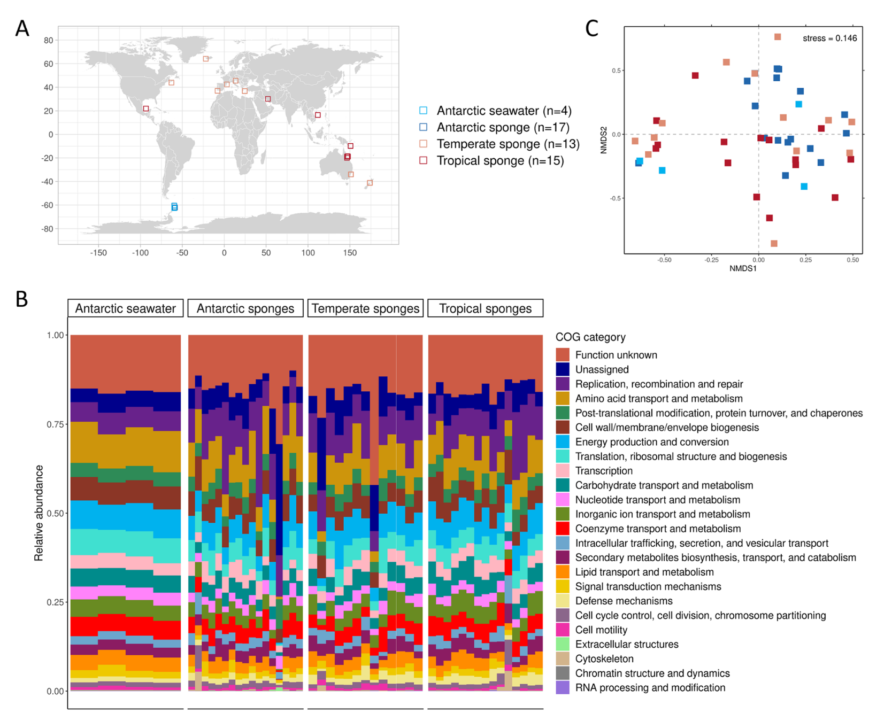
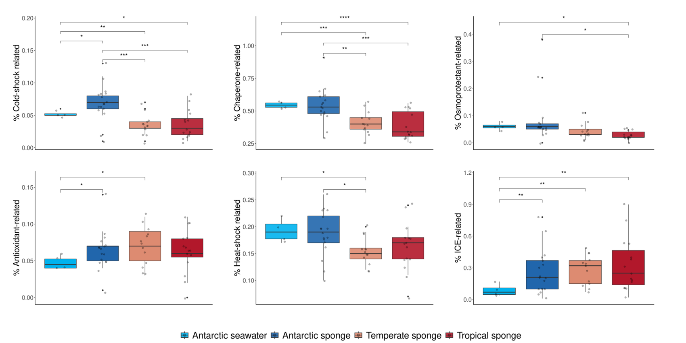
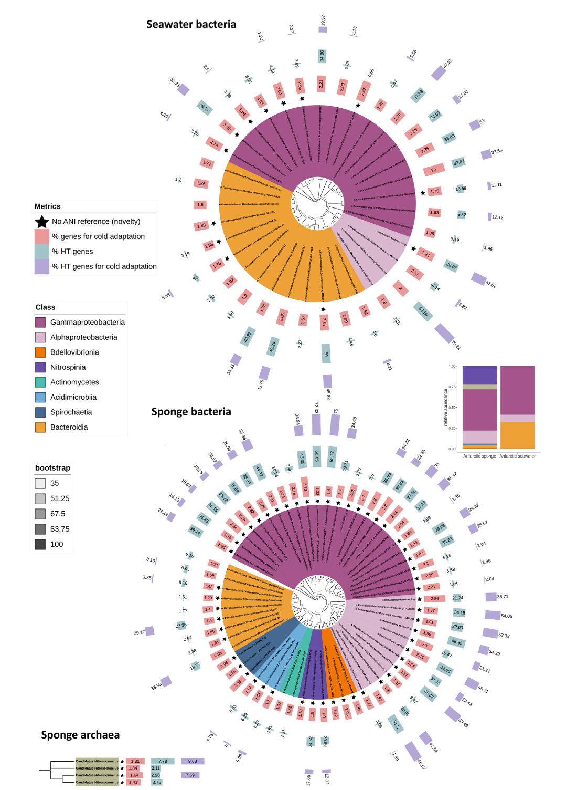
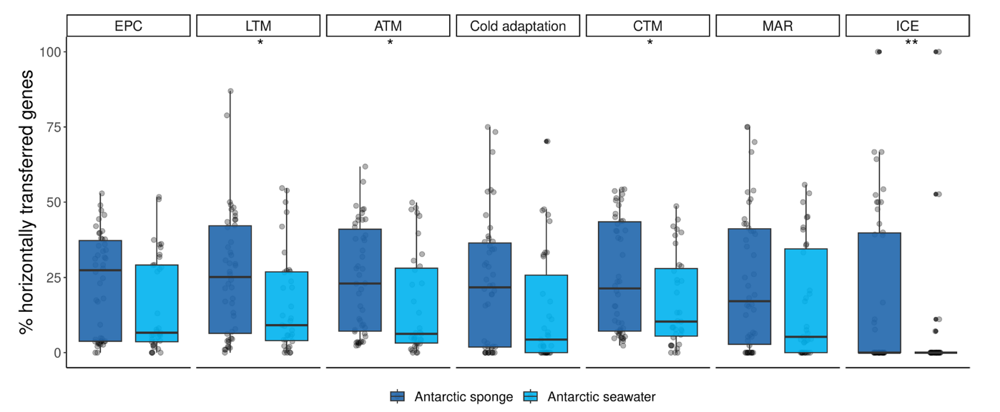
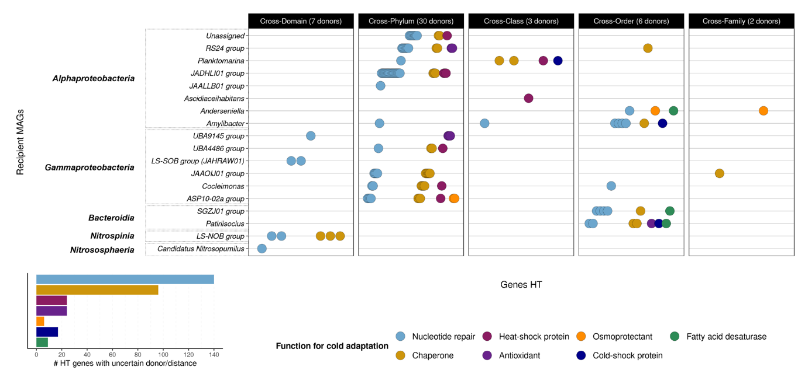
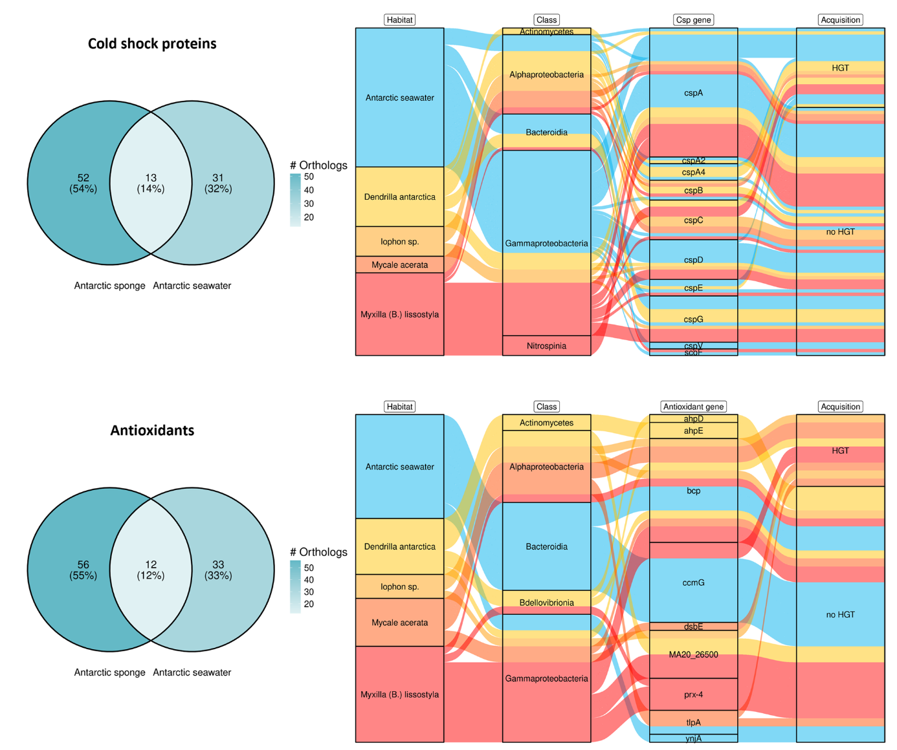

## Introduction

海洋海绵作为海洋生态系统中重要的底栖生物，广泛分布于热带、温带和极地环境。它们与丰富的微生物群落形成密切的共生关系，这些微生物组对宿主的生存和生态功能起着至关重要的作用。南极海绵在极端寒冷环境中繁衍生息，其微生物群落具有独特的组成特征，然而在功能层面的差异研究仍相对不足。本研究旨在系统探讨南极海绵微生物组的功能组成如何区别于其他环境的海绵，特别关注与寒冷适应相关的功能特征，并评估水平基因转移在驱动这些功能适应中的重要作用。

Manrique-de-la-Cuba, M.F., López-Rodríguez, M., Abades, S. et al. Cold adaptation and horizontal gene transfer shape Antarctic sponge microbiomes. Microbiome 13, 243 (2025). https://doi.org/10.1186/s40168-025-02262-z

这篇文章发现南极海绵微生物组呈现出独特的功能特征，其寒冷适应相关基因（包括冷休克蛋白、分子伴侣、热休克蛋白和渗透保护剂等）的比例显著高于热带和温带海绵。与周围海水环境相比，南极海绵微生物组中的抗氧化剂相关基因更为丰富。水平基因转移在南极海绵共生菌中极为普遍，尤其在优势菌群Gammaproteobacteria、Alphaproteobacteria和Bacteroidia中表现突出，对代谢功能和寒冷适应的贡献相当。其中，接合作用主要由整合性接合元件（ICE）介导，是推动南极海绵共生菌中水平基因转移的关键机制。值得注意的是，冷休克蛋白C（CspC）与寒冷适应密切相关，该基因仅存在于Proteobacteria中，且是海绵共生菌中潜在的水平获得基因，而在南极海洋生态系统的自由生活细菌中未见表达。南极海绵微生物组通过水平基因转移机制，展现出更高比例的寒冷环境功能适应能力。这些发现强调了水平基因转移在极端环境中微生物共生进化过程中的重要性，揭示了基因转移策略在极地生态系统适应中的关键作用。进一步探索水平基因转移的动态特征及其在寒冷适应中特定共生菌的功能贡献，将为极地生态系统中微生物进化与宿主-共生菌互作机制提供新的理论依据。

## 背景

海绵作为古老的海洋生物类群，广泛分布于从浅海沿岸至深海生态系统的各种海洋环境中，在温带、热带和极地区域均有其分布记录。它们通过高效过滤海水，将溶解有机质转化为其他生物可利用的形式，在海洋碳、氮和硅循环中扮演着不可替代的角色。此外，海绵还通过提供微栖息地，与细菌、古菌和真核微生物等三大生命域的微生物建立复杂的共生关系，共同促进海洋生态系统的营养循环和能量流动。

在动物-微生物共生体系中，海绵微生物组对宿主健康、发育和环境适应具有至关重要的影响。共生菌不仅为宿主提供必需的营养物质（如维生素合成），还在宿主的防御机制和免疫支持方面发挥着关键作用。海绵相关的细菌和古菌群落在组成和多样性上表现出显著的差异性，这种差异主要受到宿主系统发育背景、细菌丰度分布、生物地理分布特征以及环境因素的综合影响。然而，尽管对微生物群落组成已有相当广泛的研究，不同宿主种类和环境条件下海绵微生物组的功能变异模式和适应机制仍待深入探索。

南极海绵作为南极底栖生物群落中的重要组成部分，对当地生态系统的动态和结构维持具有显著影响。前期研究表明，南极海绵的细菌和古菌微生物组在多样性和群落组成方面都具有独特性。虽然已有研究报道了南极海绵微生物组中存在的寒冷适应功能，但这些功能的具体比例分布特征以及水平基因转移在功能获取中的作用机制尚不明确。

海绵微生物组在组成结构和特定功能上显著区别于周围海水环境，这一特征在南极地区也不例外。海绵共生菌通常富集与共生生活方式密切相关的功能基因，包括CRISPR系统、限制修饰系统、真核样蛋白、移动遗传元件、维生素合成途径、次级代谢及生物活性化合物等。移动遗传元件（包括质粒、转座子、整合子、噬菌体和整合性接合元件）通过促进水平基因转移，使无亲缘关系的物种间能够进行遗传物质交换，为微生物进化提供重要驱动力。水平基因转移能够为细菌和古菌提供新的生物学性状，如抗生素抗性基因和特殊代谢能力，从而促进微生物的生存适应、物种分化及生态位扩张。

研究表明，水平基因转移可能扩大了某些海绵共生菌的代谢能力范围，然而在南极海绵共生菌中，其他重要功能是否也通过该机制获得，这一问题仍有待深入研究。南极生境作为嗜冷和耐冷微生物的重要栖息地，这些微生物进化出了多种功能适应机制以在寒冷环境中维持正常的生命活动。虽然水平基因转移已被证实参与自由生活微生物的寒冷适应功能获取，但其在海绵微生物组特别是南极海绵共生菌中的具体作用和贡献程度仍需进一步探索。

本研究通过比较南极海绵微生物组与热带、温带海绵及其周围海水环境在功能特征上的差异，重点分析寒冷适应相关功能的表现特点，并深入评估水平基因转移在驱动这些功能适应过程中的贡献程度，旨在揭示南极海绵微生物组在极端环境下的适应机制和进化策略。

## 方法

### 南极样品采集与处理
研究团队在南极格林尼治岛智利湾进行了系统的样品采集工作，共获得9个成年海绵样品和4个海水样品。海绵样品通过水肺潜水技术在11-17米深度范围内采集，每个样品单独保存于含天然海水的塑料采样袋中，确保在运输过程中维持原始环境条件。海水样品使用5升尼斯科瓶在海绵采样点约5米外采集，经过150微米孔径滤网预过滤去除大型颗粒物后，储存于酸洗过的样品桶中避光保存。

海绵样品的鉴定工作结合了外部形态特征和微观结构分析。首先通过样品实物和野外拍摄图像观察海绵的颜色、形状、质地和表面特征等外部形态学指标。随后通过光学显微镜和立体显微镜对骨骼成分（包括骨针和海绵硬蛋白纤维）进行详细检测。经过系统的形态学比较和分类学鉴定，确认样品包括Myxilla lissostyla（具光滑骨针和棘状头部）、Mycale acerata（具细长骨针特征）和Iophon sp.（具特殊微型骨针结构）等物种。对于缺乏骨针的海绵种类，主要通过观察海绵硬蛋白网络架构进行物种级鉴定。

### DNA提取与测序分析
海绵样品经过严格的预处理流程，包括三次灭菌海水冲洗和在体视镜下的精细清洁，以去除表面附着杂质和外寄生生物。随后使用无菌手术刀获取约1立方厘米的海绵组织子样品，进一步冲洗去除松散附着的微生物。微生物组分的分离采用组织破碎、梯度过滤和离心分离相结合的方法，确保获得高质量的微生物样品。

DNA提取工作分别针对海绵和海水样品采用优化方案。海绵微生物DNA提取使用DNeasy PowerSoil Pro Kit，按照制造商推荐流程操作。海水样品DNA提取采用CTAB-based protocol，将滤膜剪碎后使用CTAB提取缓冲液进行DNA回收。提取的DNA通过Qubit荧光计进行精确定量，并通过0.8%琼脂糖凝胶电泳评估完整性，所有样品在-20°C条件下保存直至后续分析。

宏基因组测序委托Genoma Mayor专业测序中心完成，使用Illumina HiSeq平台进行150bp双端测序。文库构建和测序流程遵循Comeau等人建立的标准化方案，确保数据质量的一致性和可比性。

### 数据处理与功能注释
从公共数据库SRA中系统收集了热带（15个）、温带（13个）和南极（8个）海绵微生物组的原始测序数据，确保数据来源的多样性和代表性。所有原始测序读数经过严格的质量控制流程，使用FastQC和MultiQC进行质量评估，通过Skewer工具去除接头序列。质量过滤采用BBDuk，剔除平均质量值低于28的低质量读数，确保后续分析的可靠性。

序列组装使用MEGAHIT软件，采用默认参数将质量过滤后的读数组装为contig序列。组装质量通过QUAST进行综合评估，包括contig长度分布、N50值等关键指标。基因预测工作通过Prodigal的宏基因组模式完成，获得完整的核苷酸和氨基酸序列信息。

功能注释采用eggNOG-mapper流程，使用Diamond将氨基酸序列与eggNOG数据库进行比对。为了降低假阳性风险，分析中省略了通过电子推断获得的Gene Ontology术语注释。寒冷适应功能被明确定义为八个主要类别：**抗冻蛋白、抗氧化剂、分子伴侣、冷休克蛋白、脂肪酸去饱和酶、热休克蛋白、核苷酸修复蛋白和渗透保护剂**。代谢功能分析重点关注氨基酸转运与代谢、碳水化合物转运与代谢、能量产生与转换以及脂质转运与代谢等核心功能类别。

### 基因丰度标准化与统计分析
基因丰度计算采用标准化流程，将质量过滤后的读数使用Bowtie 2映射到预测基因序列上，采用敏感模式确保比对准确性。基因覆盖度信息通过BBmap的pileup功能生成，以每千碱基每百万映射reads（RPKM）表示。平均基因组大小（AGS）通过MicrobeCensus估算，用于计算每千碱基每基因组当量（RPKG）的标准化基因丰度。

功能组成分析采用两个互补层面进行：在COG大类水平进行整体功能趋势分析，以及在单个基因水平进行精细分辨率比较。非真核基因的RPKG值在相同COG类别内求和，未注释基因单独归类分析。统计比较采用多变量分析方法，包括Bray-Curtis相异性计算和PERMANOVA检验，确保结果的可信度。

### 宏基因组分箱与进化分析
宏基因组分箱使用metaWRAP流程，同时运行MaxBin和metaBAT算法，通过优化模块整合分箱结果。仅选择完整性≥70%且污染率≤5%的高质量分箱进行后续分析。分箱在各样本中的丰度以基因组拷贝数进行量化，通过重新组装模块进一步改进分箱质量，最终获得高质量的宏基因组组装基因组（MAGs）。

分类学鉴定通过GTDB-Tk完成，采用两种运行模式确保分类准确性。系统发育树构建使用IQ-TREE网络服务器，采用最大似然法并自动选择最佳替代模型。水平基因转移检测使用HGTector2，对预测蛋白序列与NCBI RefSeq基因组进行批量同源性搜索，识别潜在的基因转移事件。

## 主要结果

### 海绵微生物组功能谱显示环境间保守性
研究共分析了来自热带、温带和南极环境的45个海绵微生物组，同时包含4个南极海水微生物组作为环境对照。功能组成在COG大类水平的分析显示，"复制、重组和修复"以及"氨基酸转运与代谢"是三个环境海绵微生物组中最主要的功能类别，分别平均占总注释基因的15.3%和13.7%。相反，"RNA加工与修饰"、"染色质结构与动力学"和"细胞骨架"等相关功能类别丰度最低，平均占比不足1%。

与海水微生物组相比，海绵微生物组显著富集了与共生生活方式相关的功能基因。其中"复制、重组和修复"功能在海绵中的平均丰度（3445 RPKG）显著高于海水环境（548 RPKG），这一差异主要反映了海绵微生物组中移动遗传元件的丰富程度。类似地，"防御机制"功能在海绵微生物组中的表达水平（437 RPKG）达到海水环境（122 RPKG）的3.6倍，体现了CRISPR系统等防御机制在共生环境中的重要性。

基因水平的精细分析揭示了更有趣的现象。虽然不同环境的海绵微生物组在整体功能组成上表现出较高的相似性，但其共享的直系同源基因比例却相对较低。Bray-Curtis相异性分析显示，海绵微生物组间的功能分化程度较弱（ANOSIM检验，p=0.008，R=0.1025），排序分析呈现出分散分布模式。热带和南极海绵微生物组间虽然存在显著差异（PERMANOVA检验，p=0.024），但仅能解释4.82%的功能组成变异，表明环境因素对功能谱的影响相对有限。

### 寒冷适应功能特征凸显南极海绵特异性
针对寒冷适应功能的深入分析揭示了南极海绵微生物组的独特适应性特征。研究人员系统考察了八大类寒冷适应相关基因的分布模式，包括抗冻蛋白、抗氧化剂、分子伴侣、冷休克蛋白、脂肪酸去饱和酶、热休克蛋白、核苷酸修复蛋白和渗透保护剂。经过序列深度标准化处理后，这些功能基因的存在/缺失模式在各环境间呈现均匀分布，未表现出明显的环境或栖息地特异性聚类。

抗冻蛋白基因在整个样本集中极为罕见，仅检测到四个相关基因：一个存在于热带海绵Coscinoderma mathewsi的微生物组中，三个出现在南极海水微生物组中。由于其在序列子抽样后无法保持稳定检测，该功能类别在后续分析中被排除。

南极海绵微生物组展现出明显的功能特征，其冷休克蛋白、分子伴侣、热休克蛋白和渗透保护剂相关基因的比例显著高于其他环境的海绵。具体而言，冷休克蛋白基因在南极海绵中的平均比例为0.085%，较温带海绵（0.062%）高出37%。分子伴侣和热休克蛋白基因也呈现类似趋势，分别比温带海绵高出28%和31%。值得注意的是，三个来自深海的热带海绵样品也显示出某些寒冷适应功能的增强表达，特别是N. huxleyi物种，其寒冷适应功能谱与南极海绵表现出惊人的相似性。

冷休克蛋白是唯一在南极海绵微生物组中比例显著高于海水和其他环境海绵的寒冷适应功能。进一步分析显示，南极和热带海绵微生物组各包含约三分之一环境特有的冷休克蛋白相关基因，这些独有基因在相同环境的海绵个体间共享率普遍低于50%。然而，一个命名尚未标准化的推定冷休克蛋白基因（ID 313603.FB2170_01856）独家存在于60%的南极海绵样品中，可能代表着南极海绵微生物组的特有适应机制。

抗氧化剂功能呈现出独特的分布模式，其在所有环境的海绵微生物组中保持相似比例，但显著高于南极海水环境，这一特征被定义为"海绵微生物组特征"。类似地，编码整合性接合元件机器的基因在海绵微生物组中普遍富集，进一步支持了共生生活方式对特定功能的选择压力。

### 水平基因转移模式揭示适应机制
通过高质量的宏基因组组装基因组（MAGs）分析，研究共从南极海绵样品中获得64个高质量MAGs，从海水样品中获得35个高质量MAGs。系统发育分析显示，南极海绵微生物组包含更为丰富的细菌类群，涉及Gammaproteobacteria、Alphaproteobacteria、Bacteroidia等8个不同类别。相比之下，海水微生物组仅以Gammaproteobacteria、Bacteroidia和Alphaproteobacteria为主。古菌物种Candidatus Nitrosopumulus仅在海绵样品中检测到，主要与Myxilla lissostyla和Iophon sp.两个海绵物种相关联。

水平基因转移分析揭示了显著的栖息地差异。Gamma-和Alphaproteobacteria在所有类群中表现出最高的HT基因数量，且在海绵共生菌中的HT基因比例（平均29%）显著高于自由生活微生物（19%）。这种差异在Bacteroidia类群中同样明显，表明海绵微环境为水平基因转移提供了有利条件。

寒冷适应功能的HT基因分析显示，其在海绵共生菌中的比例与代谢功能相当，表明水平基因转移对这两类功能的贡献程度相似。具体而言，寒冷适应相关HT基因占海绵共生菌总HT基因的15.3%，与氨基酸代谢（16.8%）和碳水化合物代谢（14.7%）处于同一水平。相比之下，自由生活微生物中水平基因转移主要贡献于碳水化合物代谢（22.4%），而对寒冷适应的贡献相对有限（9.1%）。

进一步分析发现，约28%的寒冷适应HT基因来自远缘供体类群，主要涉及Actinomycetes、Gammaproteobacteria和Bacteroidia等类群。这些跨类群转移事件包括细菌门间的基因交换（19%）以及古菌与细菌间的跨域转移（2%），主要涉及核苷酸修复、分子伴侣和热休克蛋白等功能。受体共生菌包括多种Proteobacteria物种、低盐亚硝酸盐氧化细菌群以及Candidatus Nitrosopumulus等多样化类群。

整合性接合元件（ICE）相关基因的分析显示，其在海绵微生物组中的富集程度显著高于海水环境，且大部分ICE基因通过水平基因转移获得。海绵共生菌中HT-ICE的比例平均比自由生活细菌高出13%，这一差异在所有分类群比较中均保持显著。

### 特定功能基因的分布与转移特征

冷休克蛋白和抗氧化剂基因的分布分析揭示了有趣的环境适应模式。超过50%的冷休克蛋白和抗氧化剂基因独家存在于海绵共生菌中，仅有约10%与海水自由生活微生物共享。在特征明确的基因中，这些功能表现出明显的类群限制性分布特征。

冷休克蛋白基因主要存在于与南极海绵相关的Gamma-和Alphaproteobacteria、Bacteroidia、Nitrospinia和Actinomycetes类群中。其中cspB和cspC基因是唯一在所有南极海绵物种中均被检测到的冷休克蛋白基因，尽管其分布仅限于Proteobacteria门，且仅在单个海水细菌MAG中发现。深入分析显示，来自alphaproteobacteria物种的cspC直系同源物中45%通过水平基因转移独家获得，而cspB直系同源物的这一比例为60%，表明这些基因在海绵共生菌中具有特殊的转移和适应历史。

抗氧化剂基因的分布同样呈现类群特异性。研究发现某些抗氧化剂基因仅存在于特定海绵物种的共生菌中，如ahpD和ahpE基因（编码烷基过氧化氢还原酶）仅在与D. antarctica相关的共生菌中检测到。类似地，dsbE基因（参与氧化应激管理）为Mycale acerata特有，而prx4基因（过氧化物氧化还原酶IV）仅发现于Myxilla lissostyla的微生物组中。值得注意的是，所有通过水平基因转移获得的抗氧化剂基因均仅限于海绵共生菌，在自由生活微生物中未见类似现象。

## 讨论

### 功能保守性揭示海绵微生物组的稳定策略
本研究通过对热带、温带和南极海绵微生物组的系统比较，揭示了海绵微生物组功能组成的显著保守特性。尽管不同环境的海绵在物种组成和地理分布上存在明显差异，但其微生物组在核心功能层面表现出高度的一致性。这一发现支持了功能冗余维持生态系统稳定性的理论框架，表明海绵微生物组可能通过保持核心功能集的稳定性来应对环境变化和宿主差异。

特别值得注意的是，南极海绵微生物组在维持核心功能的同时，发展了独特的寒冷适应特征。这种适应性进化可能通过三种主要机制实现：首先，南极海绵栖息地特有的细菌类群可能携带独特的直系同源基因家族，这些基因在海绵环境的选择压力下经历了快速进化；其次，较暖环境中的微生物可能在进化过程中丢失了非必需的寒冷适应基因，而南极环境则有利于这些基因的保留；第三，低温条件可能通过影响基因表达调控，优先保留和优化寒冷适应相关功能。

深海热带海绵中观察到的类似寒冷适应特征进一步表明，这种功能策略并非南极环境特有，而是可能代表冷水环境（包括深海和极地）中海绵微生物组的共同适应方案。这一发现扩展了我们对海绵微生物组环境适应机制的理解，提示功能收敛可能在不同地理区域的相似环境中独立发生。

### 水平基因转移驱动功能创新与适应
研究结果充分证实了水平基因转移在海绵微生物组进化适应中的核心作用。Gamma-和Alphaproteobacteria中高比例的HT基因不仅反映了这些类群在基因获取方面的优势，也凸显了水平基因转移作为微生物快速适应环境变化的重要机制。海绵共生菌中HT基因比例（平均29%）显著高于自由生活微生物，这一差异可能与海绵微环境提供的有利条件密切相关。

寒冷适应功能与代谢功能在HT基因贡献程度上的相似性特别值得关注。这一现象表明，水平基因转移不仅负责传递与环境适应直接相关的功能基因，同样积极参与核心代谢功能的优化和重组。这种全方位的基因转移策略使得海绵共生菌能够快速适应南极环境的特殊挑战，同时维持基本的代谢和生理功能。

远距离水平基因转移事件的发现为理解海绵微生物组的进化动力学提供了新视角。跨门甚至跨域的基因交换表明，海绵微环境可能作为一个高效的"基因交换场"，促进不同类群间遗传物质的流动。整合性接合元件（ICE）的富集和转移进一步强调了接合机制在基因转移中的重要性，特别是对于较大片段DNA的稳定整合和垂直传递。

### 基因特异性分布反映功能生态位分化
冷休克蛋白和抗氧化剂基因的特异性分布模式揭示了海绵微生物组内功能生态位的分化现象。不同细菌类群携带不同的冷休克蛋白同源物，这种分布特征表明海绵微生物组可能通过功能互补而非单一类群 dominance 来实现寒冷适应。例如，cspC和cspB基因主要限于Proteobacteria，而其他冷休克蛋白类型则分布在更广泛的类群中，这种分布模式确保了寒冷适应功能的稳定性和冗余度。

抗氧化剂基因的海绵物种特异性分布进一步支持了功能特化的观点。不同海绵物种的微生物组携带独特的抗氧化剂基因组合，这种特化可能反映了宿主特定环境下的氧化应激挑战，或是与宿主代谢特征相关的适应性进化。例如，D. antarctica特有的ahpD和ahpE基因可能与该物种所处环境的特殊氧化压力相关。

水平基因转移在特定基因获得中的限制性模式也值得深入思考。某些基因（如cspC）仅在海绵共生菌中通过水平基因转移获得，而在自由生活微生物中保持垂直传递，这种差异可能反映了不同生活方式对基因转移的选择性压力。海绵共生环境可能为某些基因的转移和固定提供了独特的选择优势。

## 结论

本研究通过整合宏基因组学和基因组学方法，系统揭示了南极海绵微生物组在寒冷环境适应中的独特策略和进化机制。主要研究结论包括：

首先，南极海绵微生物组通过水平基因转移机制富集寒冷适应相关功能基因，形成区别于其他环境海绵和周围海水的特异性功能特征。这种适应性进化不仅体现在基因数量的增加，更反映在功能组成的系统性优化和重组。

其次，Gamma-和Alphaproteobacteria等优势菌群在基因转移和环境适应过程中发挥关键作用，其高频率的水平基因转移活动为微生物组的快速进化提供了动力来源。这些类群通过整合新基因和优化现有功能，成功适应了南极环境的特殊挑战。

第三，整合性接合元件介导的接合机制是海绵微生物组中基因转移的主要途径，特别是在远距离基因交换中表现突出。这种转移方式有利于较大基因片段的稳定整合和垂直传递，为长期适应提供遗传基础。

第四，特定基因如cspC的海绵共生菌限制性分布和水平获得模式，揭示了宿主环境对基因转移的选择性压力。这种特异性可能反映了海绵共生环境的独特选择优势，或是与宿主互作相关的共进化特征。

本研究为理解极地环境微生物适应机制提供了新的理论框架，强调了水平基因转移在极端环境微生物共生进化中的核心地位。未来研究应结合转录组学、蛋白质组学和培养组学方法，进一步探索基因转移的动态过程、表达调控机制及其生态学意义，为极地生态系统保护和生物技术应用提供科学依据。

