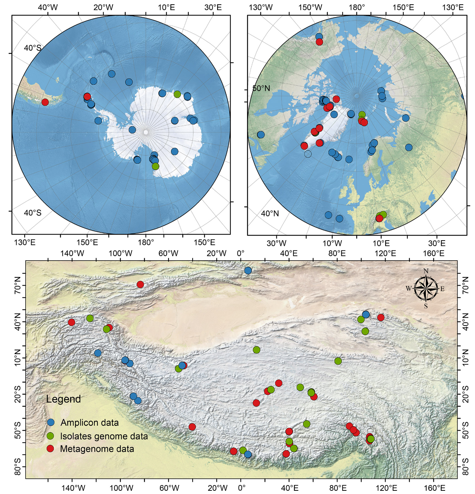
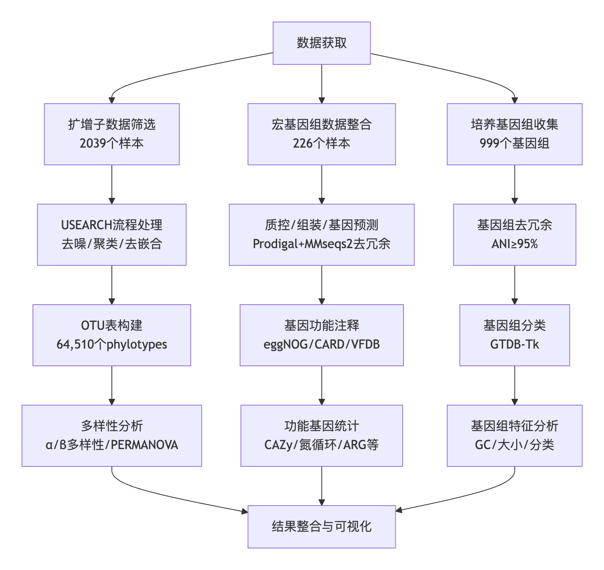
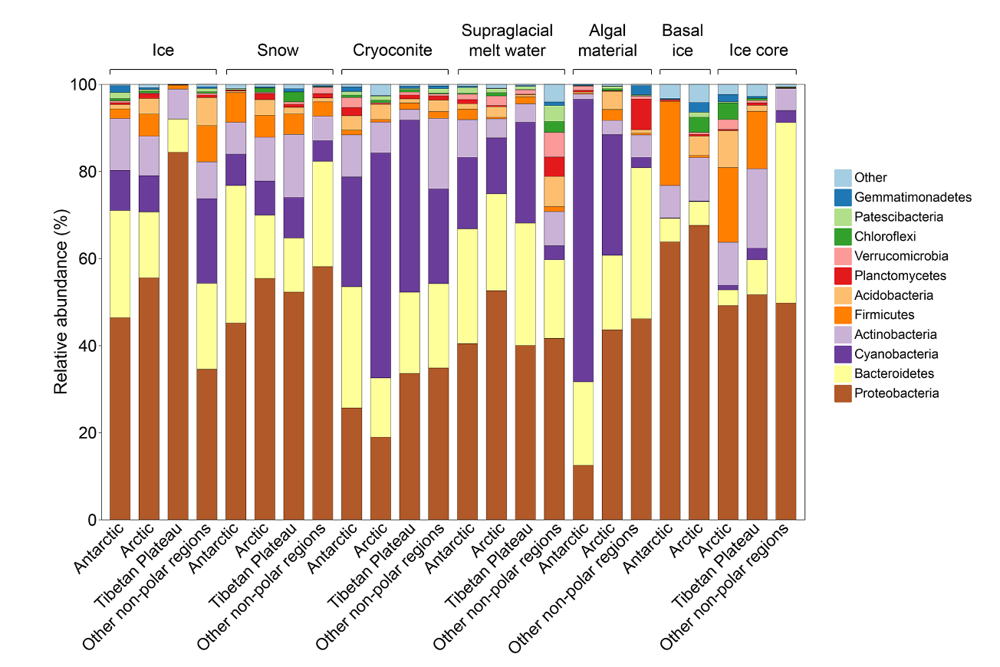
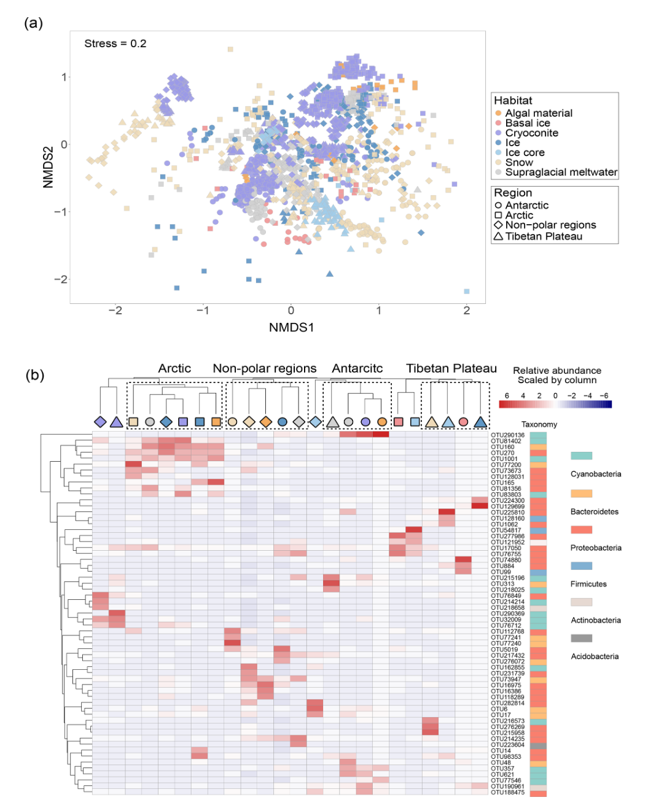
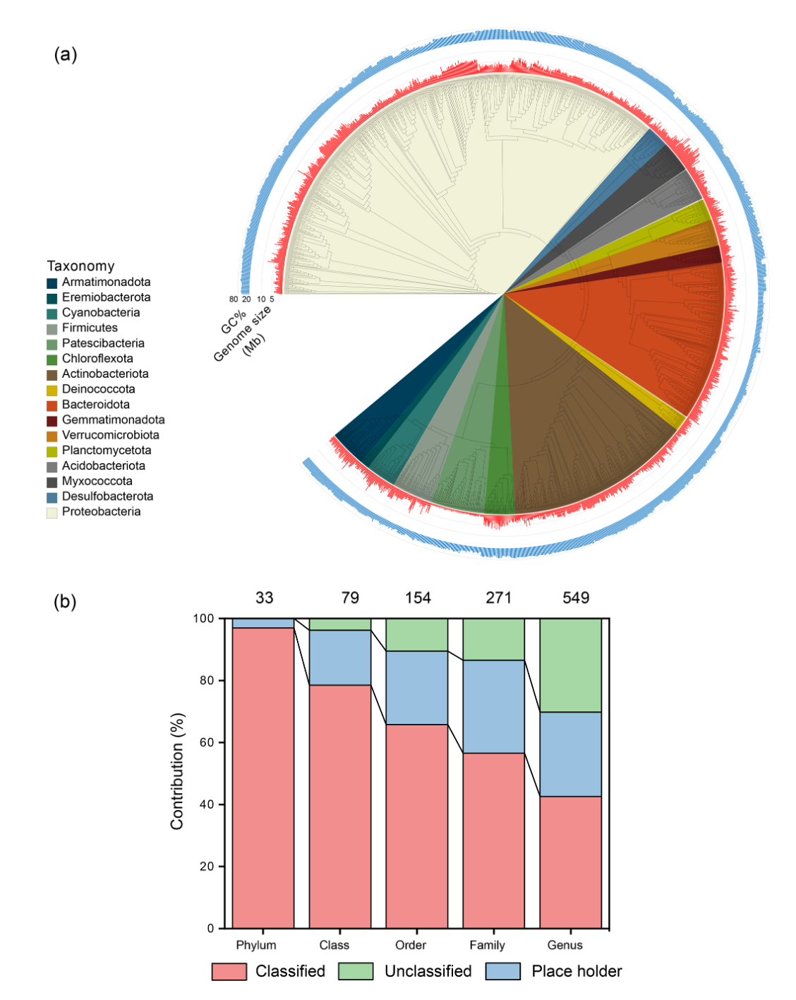
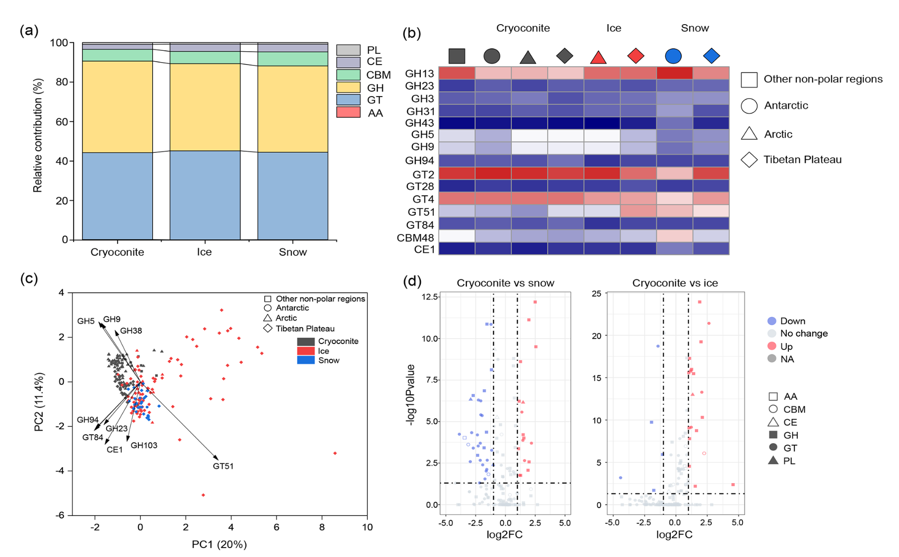
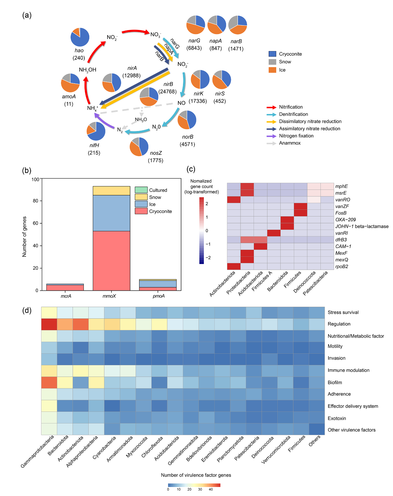

冰川覆盖地球陆地面积的10%，是碳和氮的重要储存库，对下游生态系统的元素循环具有深远影响。微生物（包括细菌、古菌、真菌和藻类）作为冰川生态系统的主要生物群落，驱动着碳、氮等关键元素的生物地球化学转化。

Liu, Y., Hu, S., Yu, T., Luo, Y., Zhang, Z., Chen, Y., Guo, S., Sun, Q., Fan, G., Wu, L., Ma, J., Liu, K., Liu, P., Liu, J., Dong, R., and Ji, M.: A database of glacier prokaryotic genomes and genes for the Three Poles, Earth Syst. Sci. Data, 17, 5165–5179, https://doi.org/10.5194/essd-17-5165-2025, 2025.

这篇研究整合了南极、北极、青藏高原及其他高山冰川的表层（包括冰、雪和冰尘）原核生物（细菌和古菌）数据，构建了一个涵盖2039个扩增子测序样本、999个培养细菌基因组和208个宏基因组的综合数据库。该数据库共包含64510个原核生物扩增子序列变体（phylotypes）、6259万5715个唯一基因及4501个原核生物基因组，较既往研究扩展了35.5%。通过功能注释，揭示了冰川微生物在碳水化合物活性酶、氮循环、甲烷循环、抗生素抗性及毒力因子等方面的功能特征。本数据集为解析冰川微生物的生物地理分布规律、关键功能基因的生态作用以及冰川融化对下游生态系统的潜在风险提供了标准化资源。

## 背景

冰川作为地球冰冻圈的重要组成部分，主要分布在南极、北极和青藏高原（即“三极”）。其储存了全球约四分之三的淡水资源，同时封存了约6 Pg的碳。随着气候变暖，这些碳和氮可能通过冰川径流释放至下游生态系统，进而影响区域生物地球化学循环。在此过程中，微生物是冰川内碳、氮转化的主要驱动者。它们通过适应低温、强紫外线辐射及寡营养等极端环境，参与有机质降解、养分转化和温室气体代谢等关键过程。

冰川生境具有高度异质性，可分为表层、内部和底部生态系统。其中，表层生态系统（包括雪、冰和冰尘孔）因直接暴露于外界环境而具有较高的微生物活性。冰尘孔是由深色碎屑物质在冰面融化形成的圆柱形凹陷，其底部聚集的冰尘为微生物提供了独特的微环境。已有研究表明，冰尘孔是甲烷的源和二氧化碳的汇，其代谢速率分别可达4.60和-1.77 μmol·m⁻²·d⁻¹。此外，光合作用、硝化和反硝化等功能微生物在冰川中广泛存在，进一步凸显了微生物在冰川元素循环中的核心地位。

近年来，冰川微生物中的新兴污染物（如抗生素抗性基因和毒力因子）逐渐受到关注。例如，从斯瓦尔巴冰川融水中分离的溶血性细菌显示出潜在致病性。因此，系统解析冰川微生物的组成与功能，不仅有助于揭示其生态学规律，还可为评估冰川融化带来的生物安全风险提供科学依据。

## 方法

### 数据获取

这篇研究通过系统性数据检索与筛选，整合了多源冰川微生物数据：

- **扩增子数据**：基于关键词“glacier”“snow”“ice”“cryoconite”在NCBI Short Read Archive（SRA）中初步检索到225,378条记录，经人工筛选去除非表层生境（如冰川前缘、冰下沉积物）及非V4区扩增的样本，最终保留2039个样本。
- **宏基因组数据**：通过Web of Science检索“glacier metagenome”相关研究，并筛选原始数据已公开的样本，同时从IMG/M和NMDC数据库补充未发表数据。最终纳入226个宏基因组样本，覆盖南极、北极、青藏高原、安第斯山脉及阿尔卑斯山等区域。
- **培养基因组数据**：从TG2G数据集获取883个青藏高原冰川细菌基因组，另从NCBI基因组数据库下载116个极地冰川分离株基因组，经人工校验后保留999个高质量基因组。

所有数据处理流程均遵循标准化质控标准，确保数据的可比性与一致性。

### 扩增子数据处理

采用USEARCH v11流程对每个测序项目进行序列处理：首先对双端 reads 进行合并与质控（最大期望错误阈值0.5），随后使用mothur比对SILVA数据库（版本128）筛选覆盖V4区的序列。去冗余后，以97%相似度聚类为OTU，并利用SILVA数据库（版本132）进行物种注释。最终去除线粒体、叶绿体及真核生物序列，保留reads数≥5000的样本，构建包含2039个样本和64510个OTU的表格。为平衡测序深度，同时提供未稀释和稀释至5036 reads的两套数据。

多样性分析包括Shannon指数、丰富度（observed species）、均匀度及Good's coverage的计算，并通过Kruskal-Wallis检验比较不同区域和生境的差异。群落结构通过基于Hellinger转换的Bray-Curtis距离进行非度量多维尺度（NMDS）排序，并使用PERMANOVA和PERMDISP分析区域与生境对群落差异的贡献。核心phylotypes定义为在特定生境-区域组合中出现于55%以上样本且平均相对丰度>0.1%的OTU。

### 宏基因组与基因组处理

宏基因组数据经过质控、组装（Megahit）、开放阅读框预测（Prodigal）及去冗余（MMseqs2；参数：-min-seq-id 0.95, -c 0.8），最终获得62,595,715个唯一基因。通过MetaBAT 2、MaxBin 2和VAMB进行基因组分箱，并使用RefineM去除异常contig。保留中等及以上质量（完整度≥50%，污染度<10%）的宏基因组组装基因组（MAG），与培养基因组合并后去冗余（ANI≥95%），并通过GTDB-Tk（版本2.4）进行物种注释。

### 基因功能注释

使用eggNOG-mapper对去冗余基因进行功能注释，包括KEGG直系同源群、碳水化合物活性酶数据库（CAZy）及COG类别。抗生素抗性基因（ARG）通过CARD数据库和RGI（宽松模式）注释，毒力因子则通过VFDB数据库和DIAMOND blastp（e值阈值1×10⁻⁵）比对识别。

## 结果

### 扩增子数据集特征

经质控后保留的2039个样本涵盖冰尘（1077个）、雪/冰（601个）、冰川融水（216个）、冰芯（79个）、藻华雪（34个）及基底冰（32个）等生境。地域分布显示，南极、北极、青藏高原和其他高山区域的样本占比分别为29%、28%、16%和27%。样本来源于66个测序项目，扩增区域包括V3V4、V4和V4V5，通过截取V4区实现数据标准化。

#### 原核生物多样性

Good's覆盖度指数在未稀释和稀释数据中分别为0.98±0.02和0.96±0.02，表明测序深度足以捕获大多数OTU。整体数据集包含64,510个phylotypes。三极冰川（南极、北极、青藏高原）的微生物丰富度（observed species、Chao1、ACE）显著高于其他高山冰川（P<0.05），但Shannon多样性在北极与其他非极地冰川间无显著差异。生境间比较显示，表层融水的多样性最高，其次为雪、冰芯、冰、冰尘、藻华雪和基底冰，反映环境过滤强度的差异。

区域-生境交互分析表明，冰尘的微生物多样性在南极最高，而雪的多样性在青藏高原最突出。冰的多样性在各区域间无显著差异，表层融水在其他高山冰川中多样性最高。引物选择对多样性评估存在一定偏差，例如V4区引物在非极地冰川冰中检测到更高丰富度，而V3V4引物在南极和北极表现更优，提示数据标准化需谨慎。

#### 群落分类组成

共鉴定出53个细菌和古菌门，冰川微生物群落以变形菌门（平均37.8%）、蓝藻门（22.2%）、拟杆菌门（20.3%）和放线菌门（9.2%）为主。在纲水平，优势类群为γ-变形菌纲（22.7%）、氧光细菌纲（22.1%）、拟杆菌纲（22.2%）、α-变形菌纲（13%）和放线菌纲（8.1%）。

#### 群落结构差异

NMDS排序显示不同生境的微生物群落结构显著分离（PERMANOVA，P<0.001）。区域对群落的解释度（R²=0.105）高于生境（R²=0.063），表明地理距离是驱动冰川微生物分布的关键因素。PERMDISP分析显示雪样本的离散度高于冰尘。优势phylotypes的分布呈现明显地理聚集性，未发现跨区域或生境的核心OTU。各生境-区域组合的特有核心phylotypes数量介于9（北极冰）至129（青藏高原表层融水）之间，以γ-变形菌纲（29%）、拟杆菌门（19%）和α-变形菌纲（16%）为主。

### 宏基因组与基因组数据集

从226个宏基因组和999个培养基因组中，共获得4501个高质量基因组（包括3502个MAGs），较既往研究增长35.5%。基因组中位大小为3.46 Mb（范围0.42–10.49 Mb），GC含量为60%。物种注释涵盖33门、79纲、154目、271科和549属，其中77.1%的基因组无法在物种水平分类，表明冰川微生物具有较高的基因组新颖性。去冗余后获得1400个基因组OTU（gOTU），相当于物种水平的分群。

#### 关键功能基因

**碳水化合物活性酶（CAZymes）**  
共注释到1,082,125个CAZyme基因，其中糖苷水解酶（GH）和糖基转移酶（GT）占比最高（分别为45.2%和44.4%），而多糖裂解酶（PL）、碳水化合物酯酶（CE）和辅助活性酶（AA）相对稀少（0.8%、3.1%和0.2%）。GT2、GT4、GH13和GT51家族在所有生境中多样性最高。PERMANOVA分析表明生境对CAZyme组成的影响大于区域（伪F值分别为10.014和5.038）。PCA显示冰尘中GH5和GH9基因富集，30个GH和20个GT家族在冰尘中显著高于冰或雪，提示冰尘具有更强的有机碳分解能力。

**氮循环基因**  
鉴定出138,421个氮循环相关基因，99.3%与硝酸盐还原和反硝化途径相关（如nirB、narB、nirK）。固氮基因（nifH）和硝化基因（hao）仅占0.49%和0.17%，与冰川低氮固定速率报道一致。固氮和反硝化基因主要分布于冰尘，而氨氧化基因（amoA）和反硝化基因（norB、nosZ）在冰中更丰富，反映生境对氮代谢功能的筛选作用。

**甲烷循环基因**  
共识别154个甲烷循环基因，其中可溶性甲烷单加氧酶基因（mmoX）占比61%，主要在冰尘中富集（34.4%）；颗粒性甲烷单加氧酶基因（pmoA-C）在冰中更常见（21.4%）。仅检测到6个甲烷生成基因（mcrA），且集中于冰尘，支持其作为甲烷源的文献证据。

**抗生素抗性基因（ARG）与毒力因子**  
发现1166个ARG（相似度≥80%），主要机制为抗生素外排（44%）和失活（41%），常见抗性靶点为青霉素、四环素和大环内酯类。13%的基因组携带ARG，以变形菌门（48.6%）和厚壁菌门（34.1%）为主。毒力因子基因共66,822个，主要涉及黏附、运动和免疫调节功能，毒素基因仅占0.48%。

## 讨论

这篇研究通过整合多源冰川微生物数据，揭示了“三极”冰川原核生物多样性、群落结构及功能基因的分布规律。结果表明，地理距离是驱动微生物群落构建的主导因素，而生境类型通过资源可用性和环境条件进一步筛选功能特征。冰尘作为高代谢活性区域，其富集的CAZyme和氮循环基因暗示其在碳氮转化中的核心作用；而冰中甲烷氧化基因的多样性则反映了其对寡营养环境的适应策略。

冰川微生物中ARG和毒力因子的检出率较低，但部分基因组携带多重抗性基因，提示需关注冰川融化可能带来的生物安全风险。此外，大量未分类基因组的存在凸显了冰川微生物资源的未知潜力，为后续生物勘探提供了基础。

这篇研究构建的冰川原核生物基因组与基因数据库（4GDB）是迄今覆盖最广、标准化程度最高的冰川微生物资源平台。其整合的多样性数据与功能注释，为解析微生物在冰川元素循环中的作用、预测气候变暖下的生态响应以及评估下游生态系统风险提供了关键数据支持。未来，随着更多数据的纳入，4GDB将持续更新，推动冰川微生物生态学与生物地球化学研究的深入发展。

## 数据可用性

本数据集存储于全球冰川基因组与基因数据库（4GDB，https://nmdc.cn/4gdb/）及国家青藏高原科学数据中心（https://doi.org/10.11888/Cryos.tpdc.300830），遵循CC BY 4.0许可协议开放获取。

