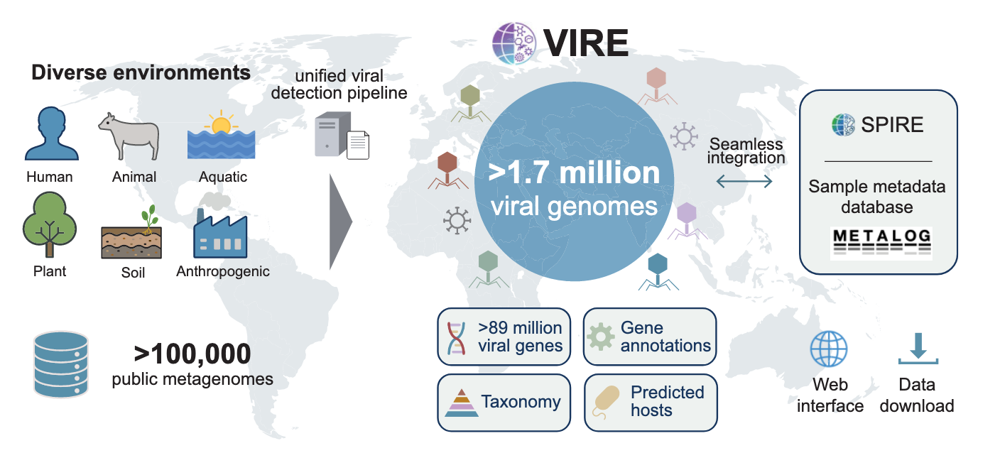
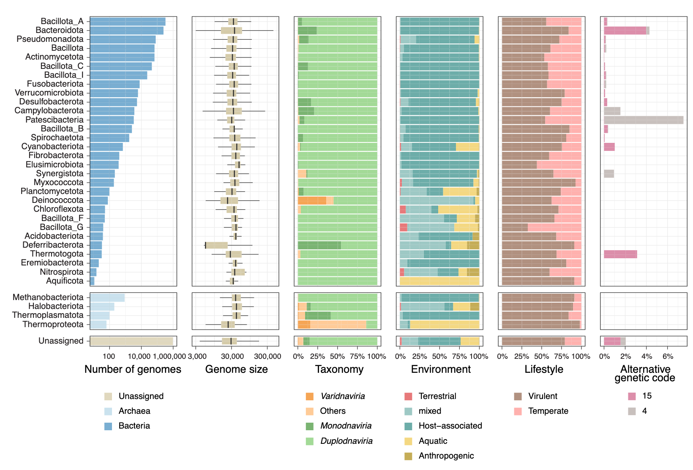
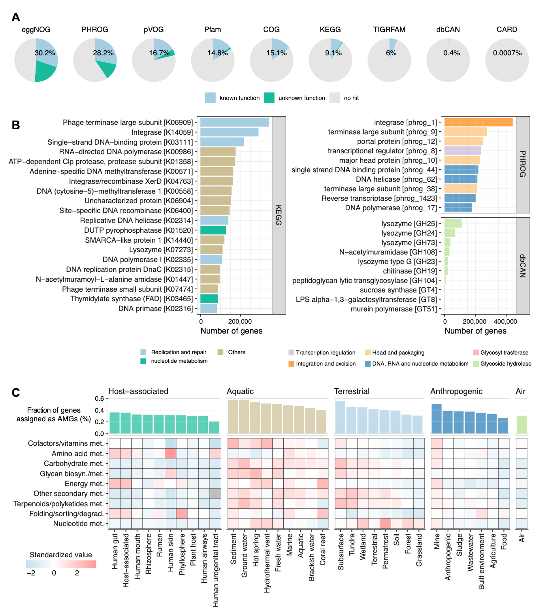

病毒是地球上最丰富的生物实体，然而其全球多样性仍很大程度上未被探索。

Suguru Nishijima, Anthony Fullam, Thomas S B Schmidt, Michael Kuhn, Peer Bork, VIRE: a metagenome-derived, planetary-scale virome resource with environmental context, Nucleic Acids Research, 2025;, gkaf1225, https://doi.org/10.1093/nar/gkaf1225

这篇文介绍了VIRE，一个综合性资源，包含从覆盖多种生态系统（包括宿主相关、水生、陆地和人为环境）的逾10万个公开可用宏基因组中恢复的超过170万个高质量病毒基因组。通过使用统一且可扩展的分析流程，我们系统性地组装了病毒基因组，并提供了详细的分类信息、预测的生活方式以及基于CRISPR间隔序列匹配的宿主注释。VIRE包含超过8900万个预测的病毒开放阅读框，以及来自多个数据库的详细功能注释。重要的是，VIRE与相关的微生物组资源（如SPIRE和Metalog）无缝集成，使用户能够联合探索病毒基因组、宏基因组组装基因组以及相关的环境或临床元数据。VIRE可通过https://vire.embl.de 访问，为在全球尺度上研究病毒多样性、进化和生态学提供了一个开放访问、可扩展的平台。

## 引言

病毒在地球上的数量估计约为10^31个颗粒，使其成为地球上最丰富的生物实体。其中，感染细菌的噬菌体（Bacteriophages）被认为是微生物生态系统的关键参与者。噬菌体塑造微生物群落结构，促进细菌间的水平基因转移，并驱动地球上的生物地球化学循环。

尽管病毒无处不在且具有重要的生态学意义，我们对病毒多样性的理解仍然受到基于培养技术的限制。高通量测序技术，特别是鸟枪法宏基因组学（shotgun metagenomics）的出现，彻底改变了直接从环境样本中探索病毒多样性的方式。在过去的十年中，经过验证的生物信息学流程从广泛的环境中揭示了巨大的、以前未知的病毒基因组多样性，包括人类肠道、海洋和土壤。然而，这些新发现的基因组可能只是地球生态系统中庞大且大部分未被探索的病毒“暗物质”的冰山一角。理解这些环境病毒的遗传和生态多样性对于理解病毒功能、进化以及宿主-病毒动态至关重要。此外，表征自然环境中的病毒库有助于大流行防范，为识别新发人畜共患威胁提供基线数据。

为了编目未培养病毒的多样性，先前的研究已经从宏基因组数据集中开发了专门的病毒基因组数据库。然而，大多数现有资源是环境特异性的（例如，人类肠道、海洋或土壤），只有少数例外。

本文介绍了VIRE（跨生态系统病毒集成资源），这是一个从覆盖多种环境的超过10万个公开可用宏基因组样本中组装的全球尺度病毒基因组资源。VIRE包含通过统一生物信息学流程重建的超过170万个中高质量病毒基因组，使其成为迄今为止最大的病毒基因组数据库。每个基因组都附带丰富的元数据，包括分类学分类、预测的宿主生物、预测的生活方式（裂解性或温和性）以及来自多个功能数据库的基因注释。重要的是，VIRE与互补资源（如SPIRE和Metalog）无缝链接，允许用户分别访问相关的宏基因组组装基因组和手动整理的宏基因组元数据。VIRE为探索全球病毒多样性提供了一个全面且可扩展的平台，是病毒学、微生物组研究和微生物生态学领域的宝贵资源。

## 方法

### 从宏基因组中识别病毒序列

VIRE的核心数据集构建自总共101,623个宏基因组样本，这些样本来源于732个独立的研究。这些数据集中的大部分最初用于SPIRE资源，主要包括从欧洲核苷酸档案（ENA）或序列读取档案（SRA）下载的公开可用的鸟枪法宏基因组，覆盖了广泛的环境样本。数据集通过半自动化过程收集，并经过手动整理以排除某些数据类型，例如来自人工实验系统（如体外模拟群落、实验室小鼠或病原体挑战研究）的数据，以及基于扩增子和分离株来源的序列。此外，专门为病毒样颗粒（VLP）富集的额外病毒组样本（在SPIRE中排除）被纳入数据集。每个宏基因组样本都使用称为microntology的标准化环境本体进行注释，该本体分配了至少一个描述相关微生物群落栖息地的92个术语之一。

使用MEGAHIT v1.2.9对宏基因组 reads 进行组装，生成重叠群（contigs）。对于除新添加样本外的所有样本，我们使用了在构建SPIRE数据库期间已经生成的组装结果，而新添加的病毒组样本在本研究中进行了从头组装。长度超过5 kb的批量宏基因组重叠群和长度超过2 kb的病毒组宏基因组重叠群被使用geNomad v1.5.2和CheckV v1.0.1进行病毒检测。被geNomad判定为病毒分数≥0.7且被CheckV分类为至少中等质量（定义为完整性≥50%且污染<10%）的重叠群被视为推定的病毒基因组。具有CheckV kmer_freq分数≥2（指示可能的串联重复）的病毒序列被排除。为了进一步提高特异性，使用Barrnap筛选细菌核糖体RNA基因（5S、16S和23S核糖体RNA），并去除编码任何这些基因的重叠群。所有数据处理步骤都在Nextflow流程中实现，确保了可重复性和可扩展性。

### 从GenBank和RefSeq收集病毒基因组

为了获得一组具有可靠分类学注释的高置信度病毒基因组，我们从GenBank下载了在国际病毒分类委员会（ICTV）第40版中标记为“完整基因组”并进行分类学注释的病毒基因组。对于分段病毒，如流感病毒，使用十个“N”核苷酸作为分隔符将单个基因组片段连接成单个序列。此外，我们还检索了未包含在上述集合中但在RefSeq中注册为病毒基因组的基因组。这些基因组以与下述宏基因组来源病毒基因组相同的方式进行处理。

### 将病毒序列聚类为种属和属级群组

使用vclust v1.2.2-b687638将所有病毒基因组聚类为种级和属级群组。聚类分别在95%和70%的平均核苷酸一致性（ANI）以及85%的比对分数（AF）下进行，使用Leiden算法，遵循ICTV当前提出的指南。

为每个环境生成稀疏曲线，通过逐步二次抽样不断增加的全病毒基因组数据集比例（10%, 20%, ..., 100%）。对于每个抽样比例，在没有替换的情况下随机抽样基因组10次，并计算产生的种级（>95% ANI）和属级（>70% ANI）簇的数量。然后绘制10次迭代的平均值以生成曲线。

物种发现系数（α）的计算遵循先前描述的方法。简而言之，我们首先从稀疏分析中确定了随着抽样努力连续增加而新发现的物种数量。然后，我们拟合了一个对数-对数线性回归模型，将新发现物种的数量与观察到的累积物种数量相关联，并计算α为回归斜率加一。

为了评估VIRE中基因组的新颖性，我们将VIRE中的病毒基因组与IMG/VR v4中的病毒基因组进行了比较。由于IMG/VR包含低质量基因组，仅包括那些注释为中等质量、高质量或完整的基因组用于比较。使用vclust在ANI > 95%和AF > 85%的阈值下，使用Leiden算法进行聚类。

### 宿主、基因和生活方式注释

为了推断噬菌体宿主，我们采用了一种基于CRISPR间隔序列的方法，旨在最小化假阳性。我们从SPIRE资源中的约120万个MAGs和proGenomes v3数据库中的约100万个分离株基因组中提取CRISPR间隔序列。为了减少错误分箱（misbinning）带来的污染，对来自MAGs的间隔序列应用了额外的过滤：对于每个包含CRISPR位点的重叠群，预测基因并使用DIAMOND v0.9.19.120与SPIRE中代表性物种的参考基因集进行比对。如果少于50%的基因匹配到同一属的任何其他MAG（排除自身），则该间隔序列被丢弃。来自短于10 kb的重叠群的间隔序列也被排除。然后将来自SPIRE和proGenomes的过滤后间隔序列使用BLASTN v2.5.0与病毒基因组序列进行比对，只允许完全匹配或具有单个错配或插入缺失且AF > 95%的比对。当CRISPR间隔序列匹配病毒基因组时，使用基于GTDB版本220的GTDB-Tk分类v2.4.0分配宿主分类。

使用prodigal-gv v2.11.0从鉴定出的病毒基因组中预测蛋白质编码基因，该算法针对病毒基因调用进行了优化。然后使用eggNOG-mapper v2.1.13、MetaCerberus v1.4.0和RGI v5.2.1分配功能注释。这些工具提供了跨多个数据库和功能类别的注释，包括eggNOG直系同源、KEGG直系同源、COG、PHROG、pVOG、Pfam、TIGRFAM、dbCAN和抗生素抗性基因。为了识别辅助代谢基因（AMG），我们使用了先前整理的KEGG直系同源术语集，并计算了分配给AMG的基因相对于每个环境中基因总数的比例。然后根据KEGG数据库按代谢功能类别汇总这些比例。

使用BACPHLIP v0.9.3预测每个噬菌体基因组的生活方式（裂解性或温和性），得分>0.8的被视为温和噬菌体。从geNomad获取每个病毒基因组的遗传密码信息，并用于下游分析。

## 结果

### VIRE中病毒基因组概述

VIRE数据库主要包括从总共101,623个公开可用的批量和病毒组（VLP富集）宏基因组数据集中重建的1,784,510个中等或高质量病毒基因组（定义为至少>50%完整性和<10%污染）。CheckV的质量评估将这些基因组分类为384,035个完整、417,105个高质量和983,370个中等质量基因组。除了这些宏基因组来源的序列外，VIRE还包括从RefSeq/GenBank下载的12,916个病毒基因组。

使用geNomad进行的分类学分类显示，大多数序列（87.2%）属于Duplodnaviria界，该界包括有尾双链DNA噬菌体。其次是Monodnaviria（9.2%），包括单链DNA（ssDNA）病毒；未分类病毒（2.6%）；和Varidnaviria（0.5%），包括巨型病毒。在目水平，Petitvirales、Tubulavirales和Sanitavirales（Monodnaviria）以及Crassvirales和Autographivirales（Duplodnaviria）是最丰富的。使用microntology的环境注释表明，大多数宏基因组来源的病毒基因组（n = 1,410,837, 78.5%）源自宿主相关环境，其中大部分是人类肠道样本（n = 950,399, 52.9%）。其次是来自水生（n = 336,505, 18.7%）、陆地（n = 115,044, 6.4%）和人为环境（n = 56,644, 3.2%）的病毒。这些病毒的平均基因组大小为38.2 kb，鉴定出的最大的宏基因组来源基因组是一个来自牛样本的836.2 kb噬菌体基因组，分类属于Duplodnaviria。该基因组是迄今为止报道的最大噬菌体基因组之一，与先前描述的巨型噬菌体（例如841和852 kb基因组）大小相当。

VIRE中的所有病毒基因组被聚类为种级和属级群组，操作上定义为共享95%和70% ANI的基因组簇，遵循当前ICTV的建议。这产生了706,281个非冗余种级和527,020个属级代表序列。最大的种级簇对应于phiX174，这是一种常用于Illumina测序质量控制的噬菌体基因组。该簇在多种环境中被检测到，包括宿主相关、水生、陆地和人为样本，表明这种对照DNA序列在沉积到公共档案库之前通常未从宏基因组数据集中完全去除。

稀疏分析显示，在所有环境中，种级和属级簇的数量随着额外病毒基因组的增加而持续增加，这与先前的研究一致。为了进一步量化这一点，我们根据先前描述的方法，从拟合到稀疏曲线的幂律指数计算了物种发现系数。物种发现系数通常范围在0到1之间，值越接近1表明稀疏曲线远未饱和，额外采样将继续揭示新物种，而值接近0表明多样性已被大部分捕获，新谱系的发现正在放缓。在我们的分析中，大多数环境观察到高系数值（>0.6）。特别是，热液喷口、苔原和人类气道样本的系数均≥0.8，表明在这些栖息地中，额外的采样努力预计将以几乎未减缓的速率发现新谱系。其他环境，如农业、根际、瘤胃、植物宿主、温泉和空气，也显示出高系数。最低的系数在人类肠道和皮肤中观察到，可能分别反映了其相对较高的采样努力和相对较低的微生物群落α多样性。然而，即使在这些环境中，系数仍高于0.5，表明稀疏曲线仍然远未饱和。这些结果表明，许多环境中的病毒多样性仍然显著采样不足，并突出了持续扩大宏基因组采样努力的必要性。

当我们将VIRE的病毒基因组与迄今为止最大的环境病毒基因组数据库IMG/VR v4的病毒基因组在95% ANI下聚类时，我们鉴定出总共1,011,171个种级簇。其中，56.1%是VIRE独有的。与单独的IMG/VR相比，VIRE有效地将已知种级簇的数量翻了一番。此外，当比较不同环境中VIRE独有病毒基因组的比例时，来自瘤胃、珊瑚礁、建筑环境和废水的样本显示出超过80%的独有基因组未在IMG/VR中表示。相比之下，人类肠道在宿主相关环境中具有最低的独有基因组比例。然而，即使在这个被充分研究的环境中，约42%的基因组也不存在于IMG/VR中。除了人类肠道环境，湿地、地下水和地下水具有较低的独有基因组比例。这些发现表明，VIRE包含了来自广泛环境的新颖病毒基因组，包括被广泛研究的人类肠道。

### 噬菌体基因组的宿主注释

VIRE中噬菌体的宿主注释是使用基于CRISPR间隔序列的预测系统性地进行的，该方法以其高特异性和低假阳性率而闻名。CRISPR间隔序列是从用于VIRE中病毒基因组检测的同一组宏基因组样本衍生的约120万个细菌/古菌MAGs（包含在SPIRE资源中）以及来自proGenomes数据库的额外100万个参考基因组中提取的，构成了迄今为止最大的CRISPR间隔序列集合。这些间隔序列使用严格的匹配标准与病毒基因组进行比对，结果为VIRE数据库中46.8%的所有病毒基因组提供了宿主分配。预测的宿主生物跨越52个门，包括细菌和古菌，并涵盖了GTDB分类法定义的总共2367个属。在至少有一个预测宿主的病毒中，约40.7%被分配给两个或更多宿主属，可能代表了最近研究中报道的广宿主范围噬菌体。按环境分层时，宿主相关样本产生了最高比例的宿主注释病毒（57.4%），其次是人为（13.7%）、陆地（8.5%）和水生样本（3.8%）。分配的宿主分类学与环境中的细菌分类学基本一致。例如，在宿主相关病毒中，最频繁预测的宿主是Faecalibacterium spp.、Bacteroides spp.和Phocaeicola spp.，它们都是人类肠道微生物组中常见且丰富的成员。此外，在门水平上，SPIRE/proGenomes中包含的基因组/CRISPR间隔序列数量与分配给每个门的病毒基因组数量之间存在强正相关。

当根据预测的细菌或古菌宿主门对病毒基因组进行分类时，观察到几种独特的模式。在预测感染拟杆菌门成员的病毒中，4.0%被推断使用遗传密码15而不是标准细菌遗传密码11。这些病毒大多数属于Crassvirales目，这是人类肠道中感染普雷沃菌、拟杆菌和Phocaeicola的优势病毒群。这一观察结果与先前报道一致，表明一些感染这些肠道物种的噬菌体具有替代遗传密码。类似地，预测感染Patescibacteria门（以前称为CPR）的病毒中有7.5%被推断使用遗传密码4。这一发现与先前的一项研究一致，该研究表明某些Patescibacteria谱系，如Absconditabacterales目，利用替代遗传密码，表明噬菌体可能适应宿主特异的翻译系统。虽然大多数宿主分配的病毒被分类为有尾噬菌体（例如，Duplodnaviria内的Caudoviricetes目成员）或ssDNA病毒（Monodnaviria），但预测感染Deinococcota的病毒观察到例外，其中35.9%被分配给Varidnaviria，这是一个也包括真核病毒病毒界。该群包括无尾的Sphaerolipoviridae科成员，已知它们感染Deinococcota门中的Thermus物种并栖息于温泉。此外，预测感染Deferribacterota门的病毒具有较小的基因组大小（中位大小= 5612 bp），这是由于相对较高比例的Monodnaviria（54.5%），它们是具有相对较小基因组（约6 kb）的ssDNA病毒。这些病毒被预测感染栖息于啮齿动物和其他动物肠道的Mucispirillum spp.。

### 病毒基因的功能注释

从约170万个病毒基因组中，总共预测了89,469,781个蛋白质编码基因。这些基因使用多个功能数据库进行了全面注释，包括eggNOG、KEGG、COG、PHROG、pVOG、Pfam、TIGRFAM、dbCAN和CARD。总体而言，这些基因中有40.2%在任何这些数据库中至少有一个匹配。其中，eggNOG产生了最大数量的匹配，所有病毒基因中有51.4%至少有一个eggNOG匹配，包括27.0%被分配到功能特征明确的组。与此一致，eggNOG在数据库中提供了最高数量的独特注释。第二大数量的匹配来自PHROG，这是一个对远缘相关病毒基因家族进行分组的数据库，其中频繁鉴定出有尾噬菌体的标志基因，如整合酶、末端酶大亚基和门户蛋白。从更广泛的KEGG注释中获得了额外的功能见解，其中最常分配的功能包括ssDNA结合蛋白、DNA甲基转移酶和DNA聚合酶。此外，基于dbCAN数据库的注释识别了溶菌酶，这是已知降解细菌细胞膜的病毒蛋白。鉴于此类噬菌体来源的内溶素有潜力作为抗生素的替代品用于抗菌治疗，此类注释可能为基于溶菌酶的治疗方法的合理设计提供有价值的信息。

使用CARD，我们识别了618个被注释为抗生素抗性基因的基因，最丰富的是ACI-1基因，它赋予对头孢菌素的抗性。大多数携带该基因的病毒没有预测的宿主，但先前的研究报道ACI-1由人类肠道中栖息的Negativicutes中的原噬菌体编码。其他检测到的抗性基因包括emrE（来自大肠杆菌）、lnuC和tet(W/N/W)。在携带抗性基因的病毒中，97.2%源自宿主相关样本。鉴于宿主相关噬菌体占VIRE数据集的78.5%，这代表了宿主相关环境中抗性基因的统计学显著富集（Fisher精确检验，P < .01）。然而，8900万基因中只有618个被注释为抗性基因，这一事实与先前的研究一致，这些研究表明噬菌体很少编码抗生素抗性基因。

噬菌体编码辅助代谢基因（AMG），这些基因在感染期间调节其细菌或古菌宿主的代谢功能。我们检查了VIRE中先前整理的一组AMG的分布，发现不同环境中AMG的丰度和类型都存在显著差异。例如，水生病毒显示出比来自其他环境的病毒更高比例的基因被指定为AMG，涵盖了多样的功能类别，特别是辅因子和维生素代谢、碳水化合物代谢和糖代谢。水生环境中AMG的富集是否仅仅反映了在水生系统中进行的大量研究仍有待澄清。相比之下，来自宿主相关样本的病毒，尤其是来自人类肠道、口腔和皮肤的病毒，在与氨基酸代谢和能量代谢相关的AMG中富集，但碳水化合物和糖代谢相关的AMG频率较低。来自地下、苔原和湿地环境的陆地病毒相对于宿主相关病毒，在参与次级代谢产物生物合成和萜类/聚酮化合物代谢的AMG中相对富集。这些发现表明，病毒-宿主相互作用表现出环境特异性的代谢特征，反映了不同栖息地中病毒和微生物群落之间的生态适应。

### 与其他微生物组资源的无缝集成

VIRE中的宏基因组样本使用与我们先前开发的资源SPIRE和Metalog一致的标识符，从而能够跨资源进行无缝交叉引用。SPIRE是一个大规模微生物基因组资源，包含约100万个MAGs，允许用户比较来自相同宏基因组样本的病毒基因组和微生物基因组。Metalog是一个手动整理的宏基因组研究元数据存储库，提供从原始出版物中提取的环境描述符（包括地理坐标）。对于人类肠道样本，Metalog还提供宿主人口统计信息（例如年龄、性别、地理起源）和详细的临床元数据，如疾病状态和药物使用。此外，还提供基于mOTUs和MetaPhlAn的样本分类学谱。通过链接病毒基因组、微生物MAGs、微生物组分类学谱以及环境或临床元数据，VIRE能够以前所未有的深度和背景对微生物生态系统进行大规模、整合性分析。

### 网络界面和可访问性

VIRE可通过vire.embl.de公开访问，用户可以在其中浏览和下载病毒基因组序列及其相关元数据。对于每个病毒基因组，界面提供对基因组序列、关键质量指标（例如geNomad分数、CheckV完整性和污染）、预测基因、功能注释、宿主预测、种级和属级簇分配以及相应的宏基因组和研究元数据的访问。可以根据microntology本体论按环境类别（宿主相关、水生、陆地、工程或人类肠道）或按个别研究探索和下载数据，从而实现针对不同研究需求的灵活访问。通过https://vire.embl.de/contribute欢迎社区贡献、功能请求和错误报告。

### 未来方向

随着公开可用宏基因组数据量的持续增长，VIRE将定期更新以纳入新识别的病毒基因组。计划中的开发包括改进病毒检测算法和基因注释流程，以提高新病毒和功能元件的识别。未来的版本还将整合长读长宏基因组和宏转录组数据集，将范围扩大到包括无尾噬菌体和RNA病毒。与SPIRE和Metalog等配套微生物组资源的持续集成将进一步促进跨生态系统和宿主相关环境的病毒和微生物生态学的全面探索。随着时间的推移，网络平台将得到增强以支持更高级的查询和分析功能，使VIRE成为病毒组研究社区日益强大的工具。

## 讨论

VIRE是一个使用一致且标准化的流程从超过10万个公开可用宏基因组构建的大规模病毒基因组资源。基础宏基因组包括广泛的环境，为在行星尺度上研究病毒多样性提供了综合性资源。VIRE中的每个病毒基因组都附带全面的注释，包括基因组质量指标、分类学分类、预测宿主和基因级功能注释，所有这些都使用最先进的工具和数据库生成。这些特性使VIRE成为一个强大的平台，用于比较病毒组学、宿主-病毒相互作用以及跨不同生态系统的病毒功能探索。

VIRE的一个关键优势是其与其他基于宏基因组的资源（如SPIRE和Metalog）的无缝集成。这种互操作性使用户能够将病毒基因组与来自相同样本的MAGs和整理的环境或临床元数据联系起来，从而能够在生态和宿主背景下对微生物群落进行多维分析。我们预计VIRE将作为一个基础性资源，用于推进我们对病毒多样性、进化和生态作用的理解，并将继续成为更广泛微生物组研究社区的关键资源。