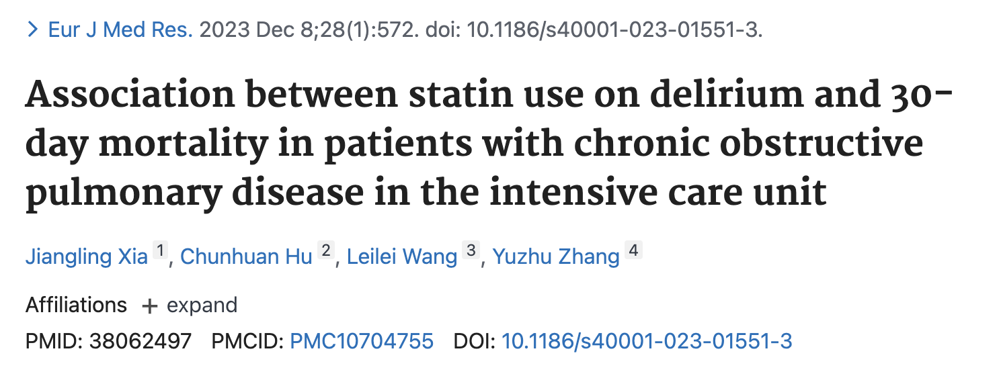

## Introduction

倾向性评分匹配(Propensity Score Matching, PSM)是一种在观察性研究中控制混杂变量的统计方法。它的核心思想是通过计算每个个体接受处理的概率（倾向性评分），然后为处理组中的每个个体在对照组中寻找倾向评分最接近的个体进行匹配，从而构建一个在所有已测量的基线特征上都非常相似的新样本。

在观察性研究中，处理组和对照组的分配往往不是随机的，可能存在选择偏差。例如，重症患者更可能接受某种治疗，轻症患者可能被忽视。如果直接比较两组结果，就会出现"治疗反而有害"的假象。PSM通过模拟随机化过程，让处理组和对照组在观测到的协变量上达到平衡，从而更准确地估计处理效应。

### 1. 倾向性评分的定义

倾向性评分(Propensity Score, PS)定义为：在给定一组协变量X的条件下，个体接受处理的条件概率，即PS = P(T=1|X)。其中T为处理变量（1=接受处理，0=未接受处理），X为所有可能影响处理分配和结果的预处理协变量。

### 2. 核心假设

PSM的有效性依赖于以下三个关键假设：

**（1）条件独立假设(Conditional Independence Assumption, CIA)**
在给定倾向性评分的条件下，处理分配与潜在结果独立。这意味着只要将倾向评分相同的个体进行比较，处理组和对照组就是可比的。

**（2）共同支持假设(Common Support Assumption)**
处理组和对照组的倾向评分分布必须有重叠区域。对于任何一个处理组的个体，都能在对照组中找到具有相似倾向评分的个体进行匹配。

**（3）强可忽略性假设(Strong Ignorability)**
所有影响处理分配和结果的混杂变量都已被观测并纳入模型。这是PSM成立的核心基础，但也是其最大的局限性——无法处理未观测的混杂因素。

## PSM完整操作流程

### 步骤1：数据准备与变量选择

首先需要确定处理变量、结局变量和协变量。协变量的选择应遵循以下原则：

- 同时影响处理分配和结局变量的混杂因素
- 尽量选择发生在处理之前的变量
- 不影响处理分配但对结局有重要影响的变量也应纳入

我们使用经典的lalonde数据集，该数据集评估了一项职业培训项目对1978年收入（re78）的影响。处理组（treat=1）是参与职业培训的人，对照组（treat=0）是未参与的人。由于分组不是随机的，可能存在选择偏差（例如，年龄、教育背景等因素同时影响参与培训和收入），因此需要使用PSM进行调整。

### 步骤2：估计倾向性评分

使用逻辑回归模型估计每个个体的倾向评分：

```r
# 安装必要包
install.packages(c("MatchIt", "cobalt", "dplyr", "tableone", "ggplot2"))
```

```{r message=FALSE}
library(MatchIt)
library(cobalt)
library(dplyr)
library(tableone)
library(ggplot2)

# 加载示例数据
data("lalonde", package = "MatchIt")

# 计算倾向评分
ps_model <- glm(treat ~ age + educ + race + married + nodegree + re74 + re75,
                data = lalonde, family = binomial(link = "logit"))

lalonde$ps <- predict(ps_model, type = "response")
```

### 步骤3：选择匹配方法

常用的匹配方法包括：

**（1）最近邻匹配(Nearest Neighbor Matching)**
为每个处理组个体寻找倾向评分最接近的对照组个体。这是最常用的方法，计算速度快，但对样本顺序敏感。

**（2）卡钳匹配(Caliper Matching)**
在最近邻匹配基础上，设置一个倾向评分差异的阈值（卡钳值），只匹配差异在阈值范围内的个体。卡钳值通常取倾向评分标准差的0.2倍。

**（3）核匹配(Kernel Matching)**
对每个处理组个体使用所有对照组个体进行加权匹配，距离越近权重越高。能充分利用所有样本信息，但可能引入残余偏倚。

**（4）最优完全匹配(Optimal Full Matching)**
将所有样本分配到一系列匹配集中，使各匹配组的全局距离总和最小化。适用于样本量较大且倾向评分分布重叠良好的情况。

### 步骤4：执行匹配

```{r}
# 设置随机种子保证结果可重复
set.seed(123)

# 1:1最近邻匹配
m.out <- matchit(treat ~ age + educ + race + married + nodegree + re74 + re75,
                 data = lalonde,
                 method = "nearest",
                 distance = "glm",
                 ratio = 1,
                 replace = FALSE,
                 caliper = 0.2)

# 查看匹配摘要
summary(m.out)
```

### 步骤5：平衡性检验

匹配后必须检验协变量的平衡性，常用指标包括：

**（1）标准化均值差(Standardized Mean Difference, SMD)**
SMD = (处理组均值 - 对照组均值) / 合并标准差。通常认为SMD < 0.1表示平衡良好，< 0.25表示可接受。

**（2）方差比(Variance Ratio)**
处理组与对照组方差的比值，接近1表示平衡良好。

**（3）经验累积分布函数(eCDF)**
评估协变量整个分布的差异，最大eCDF差异和平均eCDF差异越小越好。

```{r}
# 平衡性检验
love.plot(m.out, stat = "mean.diffs", abs = TRUE, threshold = 0.1)
```


```{r eval=FALSE}
# 可视化检验
plot(m.out, type = "jitter")  # 倾向评分分布散点图
plot(m.out, type = "hist")     # 倾向评分分布直方图
plot(m.out, type = "qq")       # Q-Q图
plot(m.out, type = "ecdf")     # 经验累积分布函数图
```

### 步骤6：提取匹配后数据

```{r}
# 提取匹配后数据
matched_data <- match.data(m.out)

# 查看匹配后样本量
table(matched_data$treat)
```

### 步骤7：估计处理效应

在匹配后的平衡样本上，比较处理组和对照组的结局变量差异：

```{r}
# 连续结局变量
t.test(re78 ~ treat, data = matched_data)

boxplot(re78 ~ treat, data = matched_data,
        main = "Matched Data: re78 by Treatment",
        xlab = "Treatment Group",
        ylab = "re78")
```


```{r eval=FALSE}
# 分类结局变量(如果有的话)
chisq.test(table(matched_data$treat, matched_data$outcome))

# 生存数据(如果有的话)
library(survival)
coxph(Surv(time, status) ~ treat, data = matched_data)
```

## 敏感性分析

由于PSM无法处理未观测的混杂因素，必须进行敏感性分析来评估结果的稳健性。常用的敏感性分析方法包括：

**Rosenbaum边界法**
评估未观测混杂因素需要多大程度地影响处理分配概率，才能推翻研究的主要结论。

```r
# Rosenbaum边界敏感性分析
library(rbounds)
rbounds(matched_data$outcome, matched_data$treat, gamma = seq(1, 2, by = 0.2))
```

当Γ值（未观测混杂的强度）达到某个阈值时，如果p值仍小于0.05，说明结果对未观测混杂是稳健的。

## PSM的优缺点

### 优点

1. **直观易懂**：匹配的概念非常容易理解
2. **有效减少偏倚**：能显著减少已测量混淆变量造成的偏倚
3. **数据可视化**：匹配后的数据更接近随机试验的数据结构
4. **适用广泛**：在医学、经济学、社会学等多个领域都有应用

### 局限性

1. **无法控制未观测变量**：只能平衡已测量的混杂因素，对未测量的混杂因素无能为力
2. **可能损失样本量**：严格的匹配标准可能导致大量样本被排除
3. **对模型设定敏感**：倾向评分模型的自变量选择会影响评分质量
4. **"均衡性"不等于"随机性"**：PSM只能使已测量的变量达到均衡，而随机对照试验能使已测量和未测量的变量都达到均衡

### 案例：他汀类药物对COPD患者谵妄的影响

一项发表在European Journal of Medical Research的研究使用PSM评估他汀类药物对慢性阻塞性肺疾病患者谵妄和30天死亡率的影响。研究纳入2725例患者，通过PSM平衡了年龄、性别、疾病严重程度等基线特征。匹配后，他汀类药物使用者的谵妄发生率和30天死亡率显著降低，且结果经过敏感性分析验证是稳健的。




倾向性评分匹配是观察性研究中控制混杂变量的有力工具，但使用时需要注意：

1. **精心选择协变量**：确保纳入所有可能影响处理分配和结果的混杂因素
2. **充分评估平衡性**：匹配后必须检验协变量的平衡性，确保SMD < 0.1
3. **进行敏感性分析**：评估结果对未观测混杂的稳健性
4. **结合其他方法**：当PSM效果不佳时，可考虑双重差分法(DID)、工具变量法(IV)等其他因果推断方法
5. **透明报告**：详细报告倾向评分模型设定、匹配方法、平衡性检验结果和敏感性分析结果

通过正确使用PSM，研究者可以在非随机数据中模拟随机对照试验的效果，获得更可靠的因果效应估计，为临床决策和政策制定提供科学依据。
