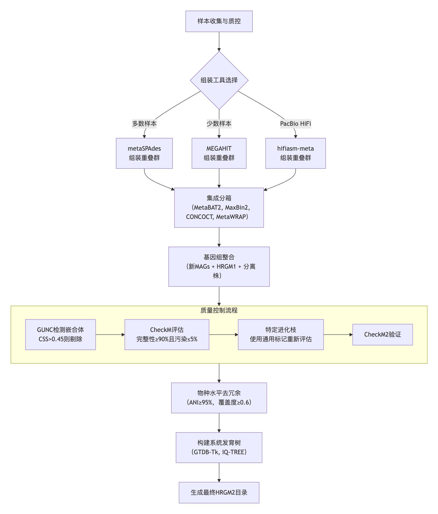
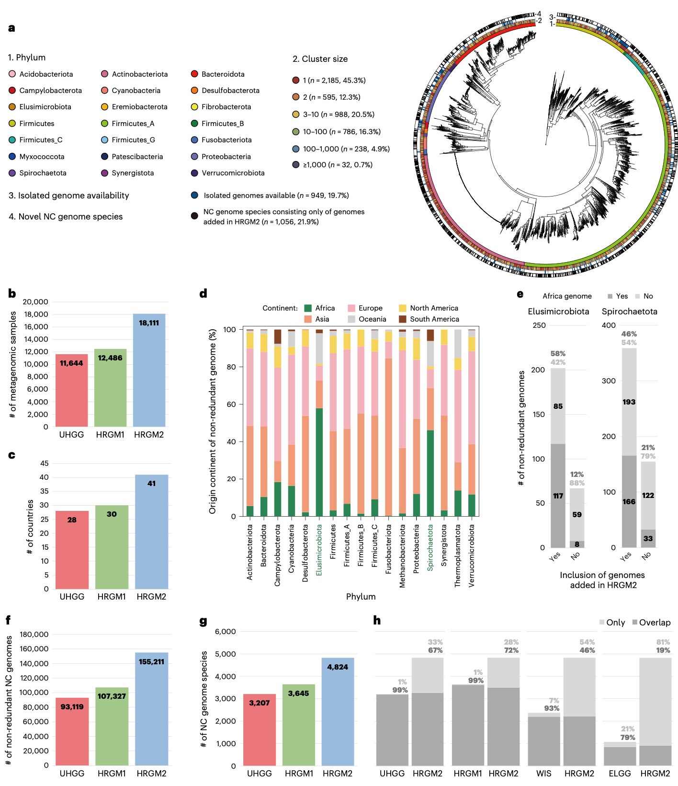
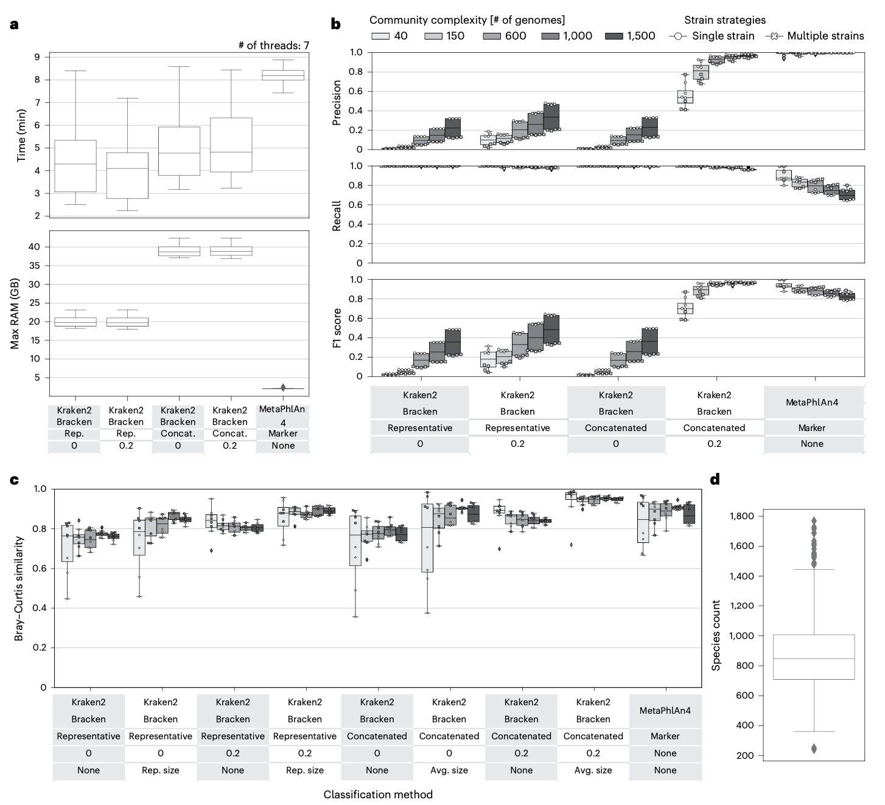
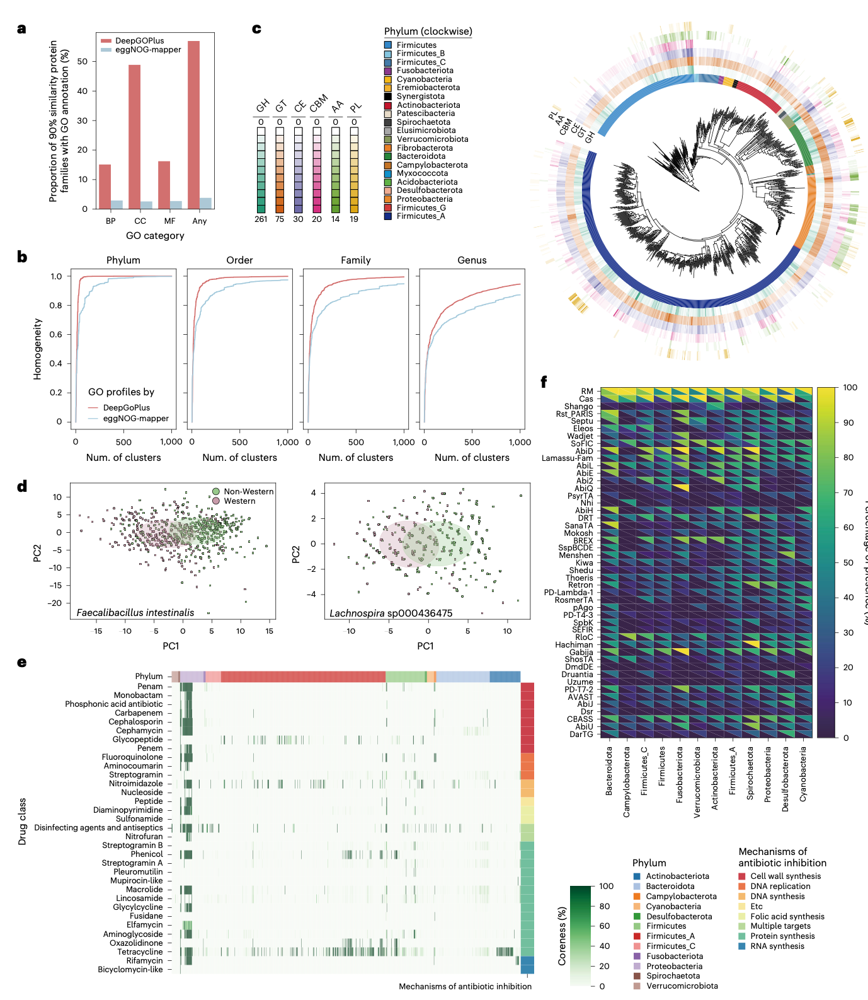
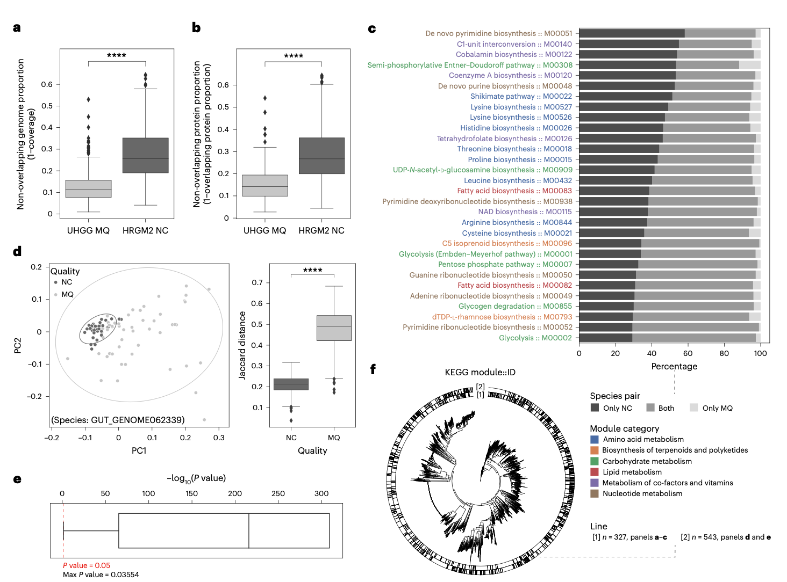
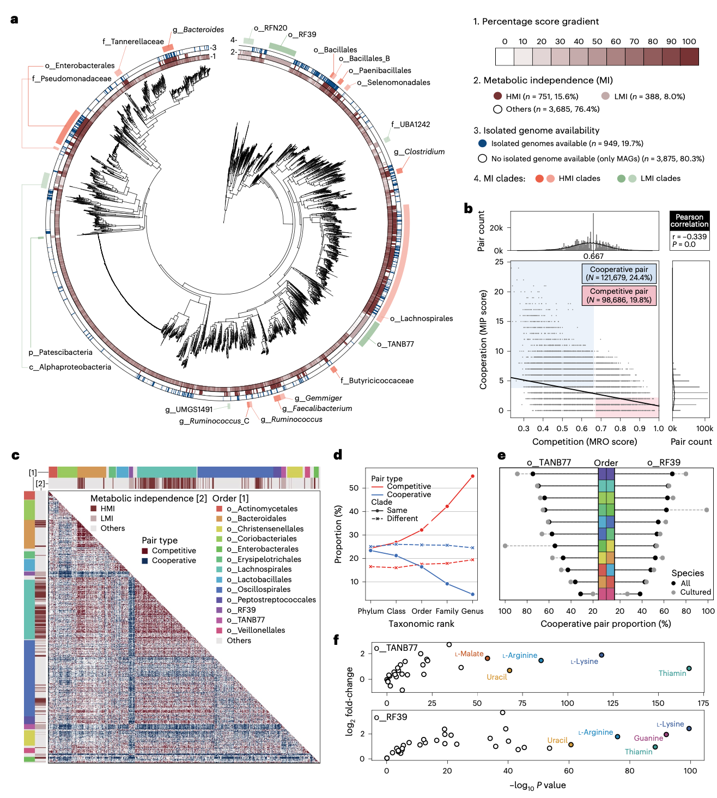
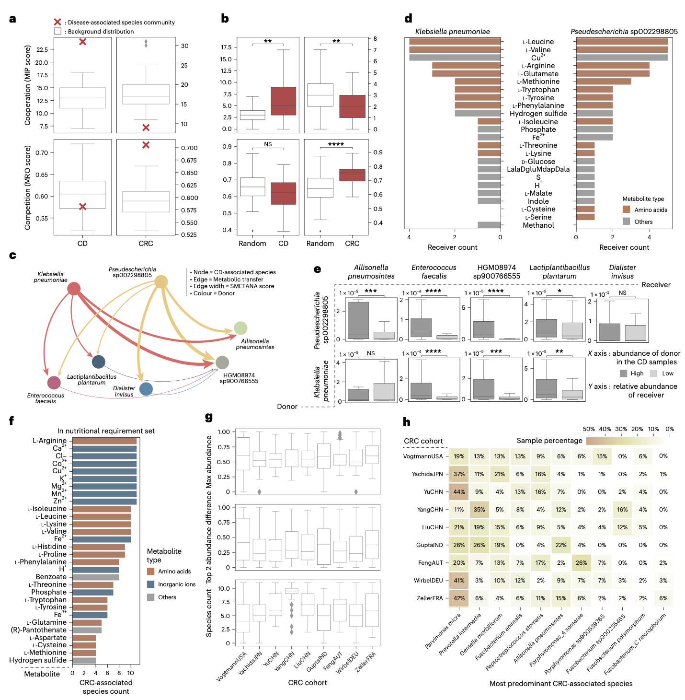

人类肠道微生物组研究依赖于全面的基因组目录，然而现有资源存在地理多样性不足和基因组质量不高的问题。许多目录包含中等质量的宏基因组组装基因组（MQ MAGs），这些基因组可能缺失高达50%的基因组区域，从而扭曲功能分析结果。

Ma, J., Kim, N., Cha, J.H. et al. A human gut metagenome-assembled genome catalogue spanning 41 countries supports genome-scale metabolic models. Nat Microbiol (2025). https://doi.org/10.1038/s41564-025-02206-1

这篇研究介绍了增强版的人类参考肠道微生物组（HRGM2）资源，这是一个包含近完整MAGs（≥90%完整性，≤5%污染率）和分离株基因组的目录。HRGM2包含来自41个国家、4,824个原核物种的155,211个非冗余近完整基因组，与统一人类胃肠道基因组（UHGG）目录相比，基因组数量增加66%，物种多样性提升50%。该资源显著改善了基于DNA的物种分析、菌株异质性解析以及人类肠道抗性组调查。通过独家使用这些高质量基因组，HRGM2提升了代谢能力评估的可靠性，支持全微生物群的高置信度自动化基因组尺度代谢建模，并揭示了疾病相关的微生物代谢互作。

## 背景

基因组解析宏基因组学通过从鸟枪法测序数据中组装未培养微生物的基因组，产生了宏基因组组装基因组（MAGs），彻底改变了微生物组研究。这一进展使得数千种人类肠道微生物物种得以编目，其中超过80%的物种尚未被培养。尽管计算方法不断进步，但由于肠道微生物群中群落多样性高，存在许多密切相关的物种，导致许多MAGs不完整或被污染，从而使得准确重建变得复杂。因此，质量控制至关重要，通常将MAGs过滤为中等质量（≥50%完整性，≤5%污染率）或近完整（NC）基因组。

大多数人类肠道微生物组的基因组目录主要由MQ MAGs构成，许多物种缺失高达50%的基因组区域。例如，UHGG目录包含204,938个非冗余基因组，其中97,157个（47.4%）为MQ MAGs。在4,644个物种簇中，只有3,207个（69%）包含NC MAGs或分离株基因组（统称为“NC基因组”）。依赖不完整的基因组可能导致不正确的生态或功能推断。MQ MAGs中缺失的基因会扭曲系统发育距离和泛基因组分析。此外，在基因组分类数据库（GTDB）中，仅由MQ MAGs组成的UHGG可靠簇中只有56%在物种水平上得到注释，而包含至少一个NC MAGs的簇则有85%得到注释。这表明仅含MQ的簇不太可能代表定义明确的物种。这些局限性凸显了需要建立一个完全由高完整性基因组构建的肠道微生物组目录，以支持更准确可靠的分析。

当前人类肠道微生物组基因组目录的另一个局限性是地理和人群偏差。例如，UHGG目录主要由来自西方国家和中国的数据主导。人类参考肠道微生物组（HRGM）目录通过添加来自韩国、日本和印度的数千个MAGs，部分解决了这个问题。然而，许多地区仍然代表性不足。纳入这些地区的MAGs可能会揭示肠道微生物组新的生态和功能见解。

## 方法

### 数据收集与宏基因组组装

研究人员收集了5,625个来自31个人类肠道宏基因组数据集的鸟枪法测序样本，这些样本未包含在UHGG或之前的HRGM（HRGM1）中。使用Trimmomatic去除接头序列和低质量碱基，然后使用Bowtie2比对并去除人类基因组污染序列。大部分样本使用metaSPAdes进行从头组装生成重叠群，少数样本使用MEGAHIT。对于PacBio HiFi测序样本，使用Minimap2去除人类污染，并使用hifiasm-meta进行组装。

### 基因组分箱与质量控制

采用集成方法进行基因组分箱。对每个样本，使用三种工具（MetaBAT2、MaxBin2.0和CONCOCT）进行分箱，然后使用MetaWRAP的分箱优化模块合并结果。将新样本组装的基因组与HRGM1中的基因组、以及来自Broad Institute-OpenBiome微生物组库（BIO-ML）和人类肠道微生物生物库（hGMB）的分离株基因组进行整合。

为构建高质量的HRGM2目录，研究人员严格筛选近完整（NC）基因组。首先使用GUNC检测基因组嵌合性，排除clade分离分数（CSS）大于0.45的基因组。随后使用CheckM的谱系特异性工作流程评估基因组的完整性和污染率，筛选完整性≥90%且污染率≤5%的基因组作为NC基因组。对于完整性可能被低估的进化枝，使用通用细菌或古菌标记集重新评估。属于Patescibacteria门的基因组使用CPR标记集重新评估。最终通过CheckM2验证了重新评估策略的有效性。

### 物种水平去冗余与系统发育分析

使用平均核苷酸一致性（ANI）阈值95%和覆盖度阈值0.6，对NC基因组进行物种水平聚类。为每个物种簇指定一个具有最高基因组完整度得分（S = 完整性 - 5×污染率 + 0.5×log10(N50)）的代表性基因组。在物种簇内使用ANI 99.9%和覆盖度0.81进行去冗余，得到非冗余NC基因组集。使用GTDB-Tk对每个物种的代表性基因组进行 taxonomic 注释，并基于通用标记基因的多序列比对，使用IQ-TREE构建系统发育树。

## 结果

### HRGM2中人类肠道微生物组NC基因组的独家编目

研究人员最终确定的HRGM2目录包含155,211个非冗余NC基因组，代表肠道微生物组中的4,824个原核物种（4,798个细菌和26个古菌）。由于从短读长MAGs中恢复核糖体RNA区域存在困难，只有7,348个基因组（4.73%）符合高质量（HQ）标准（要求NC基因组包含5S、16S和23S rRNA，以及至少18种氨基酸的tRNA）。具体而言，只有2.08%的短读长MAGs达到HQ标准，而HiFi长读长MAGs的这一比例为89.6%。

### HRGM2改善了非洲样本中富集门的代表性

HRGM2包含来自41个国家18,111个鸟枪法宏基因组样本的基因组，比UHGG和HRGM1的样本数量多1.5倍，国家数量多1.4倍。更广泛的数据集改善了对采样不足区域的代表性。HRGM2纳入了来自非洲1,000多个样本的10,855个MAGs，比UHGG和HRGM1中非洲的1,168个非冗余NC基因组增加了9.3倍。这一扩展使研究人员能够观察到两个在非洲样本中富集的微生物门：Elusimicrobiota和Spirochaetota。丰度分析证实，这些门在非洲样本中的流行度和丰度均高于非非洲地区，支持了基因组解析的观察结果。这些门与非洲样本的关联表明，纳入地理多样化的样本可以提高人类肠道微生物组地理模式的分辨率。

### HRGM2增强宏基因组读段分类

仅考虑NC基因组，HRGM2包含155,211个来自4,824个物种的基因组，分别比UHGG和HRGM1至少增加了1.45倍和1.32倍。因此，UHGG和HRGM1中99%的包含至少一个NC基因组的物种簇（“含NC基因组物种”）也存在于HRGM2中。此外，HRGM2捕获了其他主要目录中的大多数含NC基因组物种，即使这些目录未被纳入HRGM2。HRGM2还增加了1,056个UHGG中未发现的含NC基因组物种。相比之下，UHGG的4,644个物种中只有3,207个（69%）包含NC基因组。值得注意的是，在UHGG中仅由MQ MAGs组成的1,437个物种中，66%只包含一个MAG，这可能无法可靠支持该物种在人类肠道中的存在。对于UHGG和HRGM2共享的3,186个含NC基因组物种，HRGM2平均为每个物种提供2.1倍多的NC基因组。

研究人员评估了使用人类肠道基因组目录对宏基因组读段进行分类的效率。将2,624个未用于UHGG或HRGM2目录的宏基因组样本与两个目录进行比对。大多数读段同时比对到UHGG和HRGM2，但HRGM2在所有分类层级上都显示出更高的分类率。UHGG分类率较低可能是由于MQ基因组中存在缺失区域。当按大洲对样本进行分组时，HRGM2在所有区域始终显示出比UHGG更高的属级分类率。这些结果表明，HRGM2提高了跨不同地理人群的分类分类率。

### 基于标记的物种水平分类分析对快速进化物种存在局限性

微生物组基因组目录的一个常见用途是对宏基因组样本进行无组装（assembly-free）的分类分析。主要存在两种方法：基于DNA的方法和基于标记基因的方法。基于DNA的方法使用全基因组序列对读段进行分类，通常使用快速的k-mer比对工具如Kraken2，并常与Bracken结合进行物种水平细化。基于标记基因的方法使用物种特异性标记基因进行分类，MetaPhlAn是一个广泛使用的工具。可以轻松地为任何基因组目录构建自定义的Kraken2数据库，这就是为什么UHGG等资源会为其代表性基因组提供此类数据库。相比之下，构建MetaPhlAn数据库需要提取物种特异性标记，过程更费力且较少得到支持。

为了比较基于HRGM2的DNA法和标记基因法在物种水平分析上的表现，研究人员构建了Kraken2和标记基因数据库。对于Kraken2，研究人员生成了两个版本：一个使用代表性基因组，另一个使用每个物种簇的拼接基因组。研究人员还按照MetaPhlAn4的方法构建了一个物种特异性标记数据库，为4,824个物种中的4,209个（87.3%）识别了标记基因，其中3,007个物种找到了超过200个标记基因。然而，在HRGM2和UHGG系统发育中显示出过度分散的Collinsella属遇到了困难。771个Collinsella物种中有584个未能识别出标记基因，占缺乏标记基因物种的95%。这可能反映了快速物种形成，存在高密度的单核苷酸变异（SNV），但基因水平的分化有限。这些结果凸显了基于标记的分析方法对于快速进化进化枝的局限性，降低了物种水平分类的准确性。

### 基于HRGM2的DNA法物种分析优于基于标记的方法

为了评估物种分析准确性，研究人员使用了基于HRGM2基因组的模拟宏基因组样本。为了测试物种复杂性的影响，研究人员生成了包含40、150、600、1,000和1,500个物种的样本，每个物种包含一个或多个菌株。研究人员评估了两个Kraken2数据库（一个使用代表性基因组，另一个使用每个物种的拼接基因组）和一个基于物种特异性标记基因的MetaPhlAn4数据库。由于较长的基因组增加了读段比对的机会，研究人员检查了基因组大小标准化对分析准确性的影响。研究人员还测试了排除Kraken置信度分数低于0.2的读段的影响，因为模糊读段可能会扭曲丰度估计。

在计算效率方面，基于Kraken2的分析流程比MetaPhlAn4快约两倍，但需要更多内存。在物种分析准确性方面，MetaPhlAn4显示出最高的精确度，而使用代表性基因组或无置信度阈值的Kraken2流程精确度最低。然而，使用拼接基因组和置信度阈值的Kraken2流程达到了与MetaPhlAn4相似的精确度，尤其是在物种数超过600的样本中。这些结果表明，纳入物种泛基因组和减少假阳性是提高基于Kraken2的物种分类精度的关键，尤其是在高物种复杂性下。

与精确度不同，所有基于Kraken2的流程的召回率都接近完美，而MetaPhlAn4的召回率要低得多，并随着物种复杂性的增加而下降。这表明使用全基因组序列在物种检索方面比标记基因具有明显优势。MetaPhlAn4召回率的降低，尤其是在复杂群落中，可能是由于更多物种缺乏特定的标记基因，例如Collinsella属中的物种。

平衡精确度和召回率的F1分数显示，在物种数超过600的样本中，使用拼接基因组和置信度阈值的Kraken2流程表现最佳，而在物种数为40或150的较简单群落中，MetaPhlAn4表现更好。菌株复杂性的影响很小。Bray-Curtis相似性进一步支持了在基于HRGM2的分析中，使用拼接基因组、基因组大小标准化和置信度阈值的Kraken2流程的优越性能。对1,160个健康肠道样本的分析显示，89%的样本含有超过600个物种。鉴于这种高复杂性，具有上述增强功能的Kraken2流程提供了最准确的物种谱。这些发现强调了在评估物种分析方法时需要考虑分类学复杂性。

### HRGM2增强肠道微生物群菌株异质性解析

全球尺度的微生物组研究强调了微生物物种内群体遗传学的价值，这是对物种水平分析的重要补充。虽然宏基因型分析将宏基因组读段与参考基因组比对，但使用预先识别的SNV可以实现更高效的分型，从而能够大规模探索亚种水平变异。SNV数据库是通过每个物种内的基因组比对构建的。HRGM2中扩展的NC基因组集合增加了可检测的种内SNV，提高了菌株水平异质性的分辨率。由于大多数工具推荐使用NC基因组而非MQ基因组以获得更好的SNV检测效果，研究人员比较了在不同NC基因组数量阈值下符合基于SNV分析的物种数量。HRGM2始终比UHGG保留更多符合条件的物种。在拥有≥10个非冗余NC基因组的物种中，HRGM2在82%的情况下检测到更多SNV，表明亚种水平变异的分辨率得到提高。

为了研究跨地理区域的亚种遗传结构，研究人员分析了1,787个公开可用的肠道宏基因组样本（1,169个来自亚洲：印度、日本、中国；618个来自欧洲/美国：奥地利、意大利、德国、法国、美国）。使用GT-Pro，研究人员对412个拥有≥50个NC基因组且具有足够流行度的物种进行了SNV分型，然后计算了来自欧洲/美国和亚洲的菌株之间的成对系统发育距离。使用置换多元方差分析（PERMANOVA）评估地理分层，显著性定义为P < 0.01且伪F > 30。该分析确定了83个物种（约20%），主要来自Firmicutes_A，具有清晰的亚种水平地理分离。基于前20个分层物种SNV的系统发育树显示，HRGM2有助于更全面地探索与宿主相关因素相关的亚种遗传结构。

### HRGM2增强微生物蛋白功能注释

为了构建人类肠道微生物组的蛋白质目录，研究人员从155,211个非冗余NC基因组中预测了蛋白质编码序列。通过在100%、95%、90%、70%和50%同一性阈值下进行聚类来减少冗余，分别得到约87.0、18.2、12.4、6.5和3.9百万个聚类。

利用HRGM2基因组和蛋白质，研究人员进行了功能注释。研究人员应用了基于直系同源性的eggNOG-mapper，用于京都基因与基因组百科全书（KEGG）直系同源（KO）、基因本体论（GO）、蛋白质家族（PFAM）、碳水化合物活性酶（CAZyme）和直系同源簇（COG）注释。由于eggNOG-mapper的GO覆盖率较低，研究人员采用了基于深度学习的DeepGOPlus进行GO预测。与eggNOG-mapper相比，DeepGOPlus将生物过程、细胞组分和分子功能注释的覆盖率分别提高了5.2倍、18.7倍和5.9倍。假设同一分类进化枝内的物种具有相似功能，研究人员通过测量按GO术语谱聚类的基因组的分类学同质性来评估注释准确性。DeepGOPlus的GO谱显示出比eggNOG-mapper更高的分类学同质性。

CAZymes在肠道中通过将各种碳水化合物（包括膳食纤维、淀粉和多糖）分解成影响宿主健康的短链脂肪酸而发挥关键作用。此外，一些CAZymes可以降解保护肠上皮免受病原体侵害的黏蛋白。使用dbCAN3进行的CAZyme注释显示，Verrucomicrobiota和Bacteroidota门平均拥有最多的CAZyme家族。在较低分类水平上分布差异更大。鉴定出拥有最多糖苷水解酶（GHs）的属，这些酶对碳水化合物降解至关重要；在厚壁菌门中，Paenibacillales目的属表现出高GH丰度，而在Firmicutes_A中，Robinsoniella、Murimonas和Hungatella占主导地位。

考虑到饮食对CAZyme活性的影响，研究人员假设物种内存在与饮食相关的分化。确实，研究人员发现了几个在西方和非西方国家之间具有明显CAZyme谱的物种。Faecalibacillus intestinalis表现出最强的分化，非西方菌株富含GH1、GH140、GH128和GH55——这些酶与纤维降解相关。

### HRGM2支持可靠调查人类肠道抗性组和噬菌体防御系统

肠道细菌进化出了对抗抗生素和病毒的防御系统，其中许多通过水平基因转移传播。由仅含NC基因组组成的HRGM2能够可靠分析核心和附属基因组中的抗性基因分布。核心基因组中的基因表明垂直遗传，而附属基因组中的基因则表明水平基因转移。

使用RGI，研究人员预测了1,042个拥有≥10个NC基因组的物种中的抗性基因，重点关注拥有≥5个物种的门。研究人员量化了每个物种中携带特定抗性基因的基因组比例。结果证实了先前的发现：变形菌门物种通常携带多个抗性基因，特别是用于抗生素外排的基因。

放线菌门显示出对四环素和利福霉素的谱系特异性抗性，例如青春双歧杆菌携带rpoB突变导致利福霉素抗性，而Collinsella携带Tet(Q)导致四环素抗性。在拟杆菌门中，大多数抗性基因发现于附属基因组中。

研究人员识别出在核心基因组中具有多种抗性类型的物种，表明其高传播潜力。这些物种主要来自埃希氏菌属、沙门氏菌属、克雷伯氏菌属和肠杆菌属，它们都属于变形菌门。在该门之外，来自厚壁菌门的表皮葡萄球菌（MRSE）和金黄色葡萄球菌（MRSA）分别携带10种和6种抗性类型，而来自Firmicutes_A的BX12 sp014333425携带5种。

基于NC基因组的HRGM2还能够可靠地分析抗性基因流行率最高的抗生素。四环素抗性最为常见，在1,042个携带抗性基因的物种中的561个（53.8%）中检测到，其次是林可酰胺和大环内酯类抗性，在278个（26.7%）物种中检测到。

最后，研究人员检查了噬菌体防御系统。大多数系统（排除RM和Cas系统）位于附属基因组中。例外情况包括拟杆菌门核心基因组中的Shango和Rst_PARIS系统。其他系统在各门中广泛分布。

### MQ基因组可能导致不可靠的肠道微生物群代谢谱

HRGM2与UHGG的一个关键区别在于其独家包含NC基因组。在UHGG中，只有66%的物种包含NC基因组，并且204,938个非冗余基因组中有55%是MQ MAGs。按中位数计算，每个物种簇中55%的基因组是MQ的，表明代表性和泛基因组质量低于HRGM2。不完整的MQ基因组可能导致功能分析中出现假阴性。为了评估这一点，研究人员分析了327个在UHGG中仅由MQ基因组代表、但在HRGM2中拥有至少一个NC基因组的物种。比对同种的代表性基因组显示，89%的MQ基因组与NC基因组重叠，但26%的NC基因组区域在同种MQ基因组中缺失。聚类蛋白质组分析也产生了类似的结果。基因组和蛋白质分析均揭示了MQ基因组相对于NC对应物缺失的内容。

为了评估MQ基因组中缺失区域如何影响功能分析，研究人员预测了每个代表性基因组的KEGG模块，并识别了仅在NC基因组中发现的同种对功能。氨基酸、辅因子、维生素和核苷酸代谢的核心生物合成模块在MQ基因组中经常缺失，表明代谢谱分析中存在假阴性。

随后，研究人员比较了物种内MQ和NC基因组的功能谱，分析了543个UHGG物种（每个物种拥有≥10个非冗余的MQ和NC基因组）。基于基因簇的功能距离在MQ基因组中显著更高，MQ基因组显示出更大的变异性，而NC基因组具有一致的功能谱。这种模式在所有测试的物种中都被观察到，并与先前来自GTDB数据库的发现一致。这些结果表明，NC基因组之间的功能变异反映了菌株间的生物学差异，而MQ基因组之间的变异主要是技术性的。分析物种的系统发育分布表明，这种偏差并不局限于特定的进化枝。这些发现支持了在肠道微生物组参考目录中独家使用NC基因组的必要性。

### HRGM2提供肠道微生物群代谢能力的可靠图谱

人类肠道中的大多数原核物种仍未培养，部分原因是代谢依赖性。理解代谢能力有助于阐明微生物相互作用和定植。最近的一项研究使用33个KEGG模块（主要与必需代谢物生物合成相关）估算了“代谢独立性”，并且这些模块在粪便微生物群移植后成功定植的物种中富集。拥有这些模块中大部分的物种被归类为具有高代谢独立性（HMI），而缺乏这些模块的物种被称为具有低代谢独立性（LMI）。使用这个框架，研究人员评估了HRGM2中的肠道微生物物种。

如前所述，MQ基因组常常低估代谢能力，经常将物种错误分类为LMI。相比之下，完全由NC基因组组成的HRGM2减少了使用33个KEGG模块进行分析时的这种低估。在4,824个HRGM2物种中，751个（15.6%）为HMI，388个（8.0%）为LMI。与HRGM2相比，许多基于MQ基因组的UHGG物种拥有更少的KEGG模块，导致HMI分类更少，LMI分类更多。这证实了包含MQ基因组的目录倾向于低估代谢能力。

与先前的研究一致，HMI物种比LMI物种拥有更大的基因组。HMI物种在放线菌门和拟杆菌门中被发现，而LMI物种在厚壁菌门和Patescibacteria门中富集。代谢独立性也与分离株基因组的可用性相关（98.7%的LMI物种未被培养），可能是由于对外部代谢物的依赖。

研究人员识别出15个HMI进化枝，主要由HMI物种组成，以及两个LMI进化枝（例如，o_RFN20, o_RF39, f_UBA1242, o_TANB77, g_UMGS1491）。另一个LMI进化枝，Patescibacteria门，拥有小基因组（约1 Mbp），大部分未被培养，并且显示出有限的代谢潜力，表明其寄生生活方式。这些未被充分研究的LMI进化枝可能也依赖于寄生，共培养可能有助于它们的分离。

### HRGM2支持全肠道微生物群的基因组尺度代谢建模

理解微生物之间的代谢相互作用可能有助于阐明其生理学。对这些相互作用的建模对于个性化营养和医疗保健正变得至关重要。代谢建模主要依赖于基因组尺度代谢模型（GEMs），它代表了一个生物体的完整代谢网络。GEMs最初是为具有完整基因组的可培养物种重建的，但最近已为数千种肠道细菌菌株开发了GEMs。MAGs的兴起使得通过自动化GEM重建进行大规模代谢建模成为可能，尽管高基因组完整性仍然至关重要。

通过独家使用NC基因组，HRGM2成为通过自动化流程构建高质量GEMs的理想资源。使用CarveMe，研究人员为4,824个代表性物种基因组生成了GEMs。为了评估质量，研究人员比较了来自UHGG和HRGM2的同种MQ-NC基因组对及其代谢内容。虽然MQ模型中的大多数GEM元素（代谢物、反应、基因相关反应）也存在于NC模型中，但NC GEMs始终包含更多未被MQ模型捕获的独特元素。值得注意的是，基因相关反应在独特元素比例上显示出最大差异。这些结果表明，MQ衍生的GEMs质量较低，并可能在下游功能分析中导致假阴性。

使用代表性基因组的GEMs，研究人员使用SMETANA在“全局”模式下分析了肠道微生物之间的代谢相互作用。该工具估算代谢资源重叠（MRO），指示基于营养需求的竞争潜力，和代谢相互作用潜力（MIP），指示基于可交换代谢物的合作潜力。为了验证预测，研究人员使用了31个肠道细菌群落，这些群落在定植抵抗艰难梭菌的背景下，对肺炎克雷伯菌菌株Kp-2H7表现出不同的抑制效果。与抑制效果较弱的F13混合菌株相比，抑制效果更强的F18混合菌株预计与Kp-2H7具有更低的MIP和更高的MRO。尽管由于样本量小而未达到统计学显著性，但趋势符合预期。这些结果支持了基于HRGM2的GEMs在预测微生物代谢相互作用方面的实用性。

研究人员分析了在全球各国最普遍的1,000个健康人类肠道物种之间的代谢相互作用。发现MRO和MIP之间存在显著的负相关。基于MRO和MIP值，121,679个物种对（MIP > 3 且 MRO < 0.667）被定义为合作性（24.4%），而98,686个物种对（MIP < 3 且 MRO > 0.667）被定义为竞争性（19.8%）。

研究人员随后绘制了1,000个物种之间的合作和竞争相互作用图。HMI物种倾向于与其他HMI物种竞争，LMI物种与其他LMI物种竞争。来自同一目的物种之间主要是竞争关系。对进化枝内部和跨进化枝的成对相互作用分析表明，同一进化枝内的物种对主要是竞争性的，这与早期研究一致。这种模式在更精细的分类水平上加剧，反映了密切相关的物种之间代谢相似。

## 讨论

HRGM2资源通过整合来自41个国家的多样化地理样本并严格筛选近完整基因组，在人类肠道微生物组参考目录构建方面取得了重要进展。与以往目录相比，该资源不仅显著提升了基因组数量（增加66%）和物种多样性（增加50%），更重要的是通过独家采用NC基因组确保了功能分析的可靠性。研究证实，基于DNA的物种分析在复杂微生物群落中优于传统标记基因方法，而高质量的基因组数据为解析菌株异质性、抗性组分布和代谢互作网络提供了坚实基础。尽管HRGM2在基因组完整性和地理覆盖度方面已有显著提升，未来仍需通过长读长测序技术进一步改善基因组质量，并扩大对西亚、北非等代表性不足区域的采样，以构建真正全面的人类肠道微生物组参考图谱。
