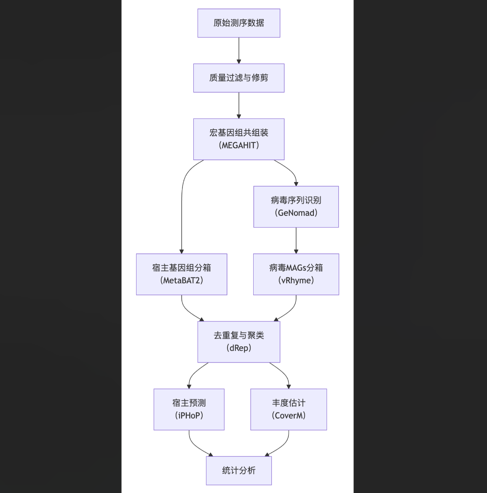
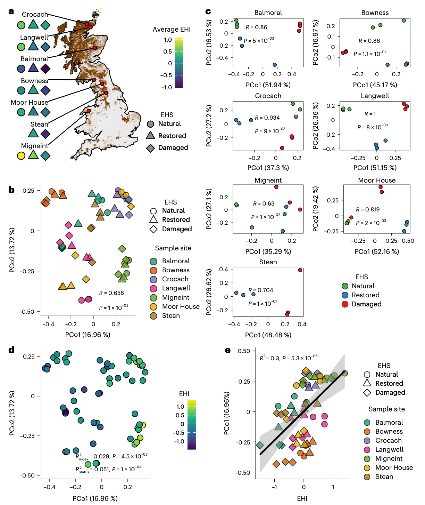
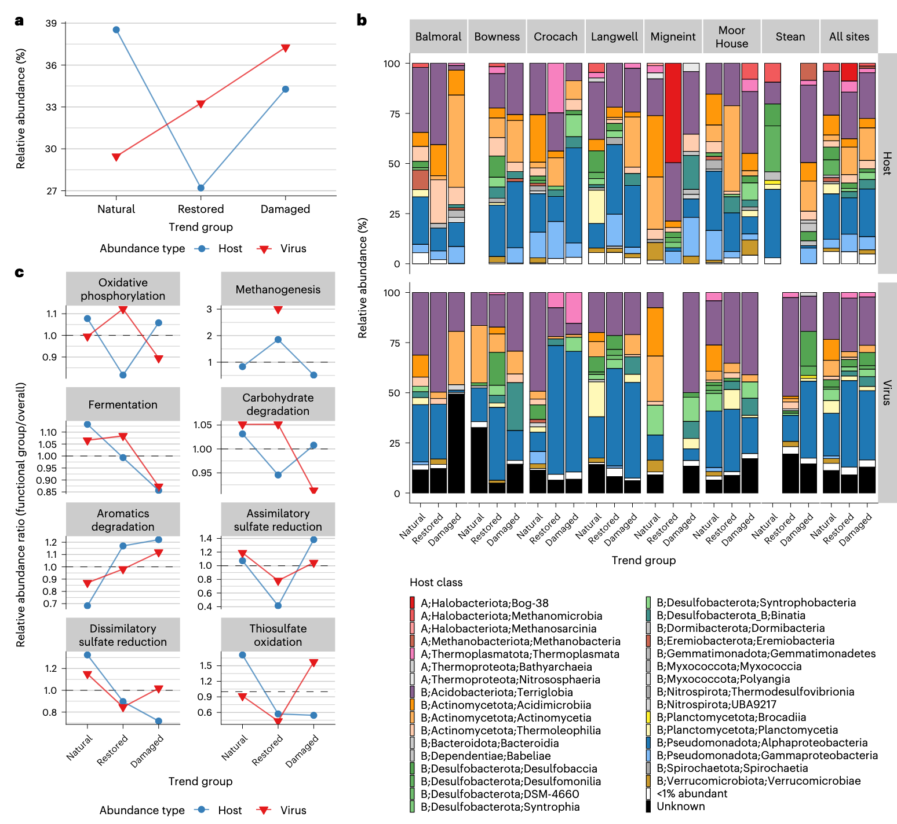
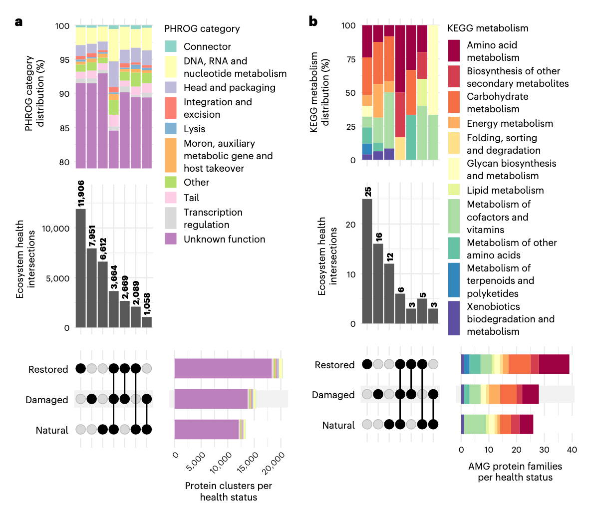
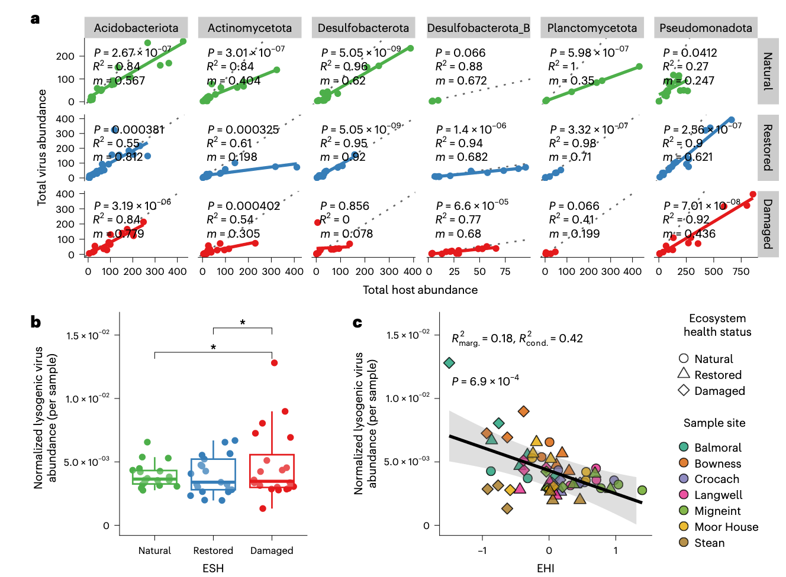
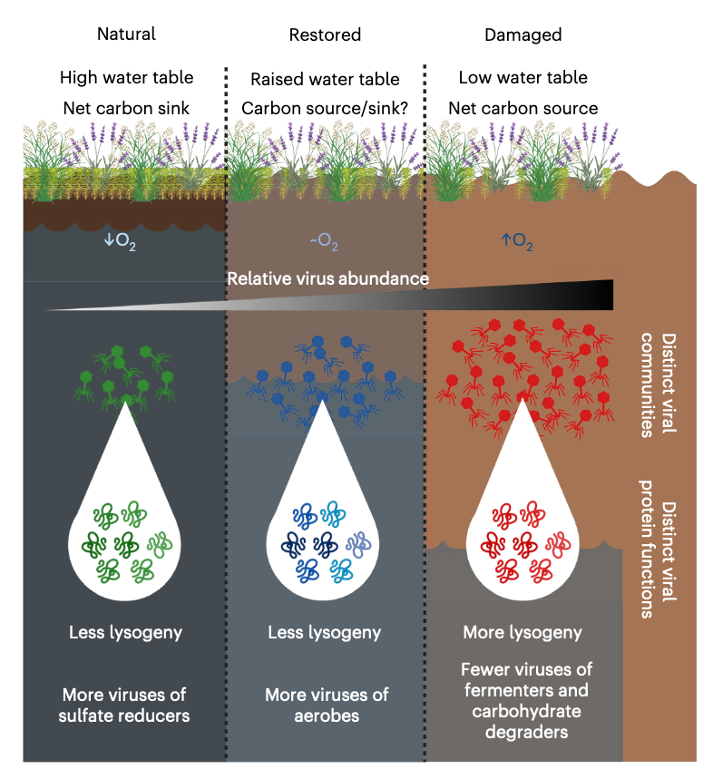

泥炭地储存了地球土壤碳的三分之一，但由于人类活动的影响，正从碳汇转变为碳源。恢复工作旨在逆转这一趋势，但病毒对泥炭地恢复的影响尚不明确，尽管病毒是微生物组和生态系统功能的重要调节因子。

Kosmopoulos, J.C., Pallier, W., Malik, A.A. et al. Ecosystem health shapes viral ecology in peatland soils. Nat Microbiol (2025). https://doi.org/10.1038/s41564-025-02199-x

本研究通过对英国七个泥炭地的土壤宏基因组进行测序，分析了自然、受损和恢复三种生态系统健康状态下的病毒群落。研究发现，病毒多样性和群落结构受地理和生态系统健康的共同影响。病毒广泛分布，但表现出生态系统健康特异的地方性和功能适应，凸显了其对恢复的敏感性。病毒与宿主的动态关系从稳定的“搭便车赢家”模式到与关键好氧菌、硫酸盐还原菌、碳水化合物降解菌和发酵菌的脱钩动态。这些发现将病毒定位为泥炭地生态系统恢复的动态驱动因子，并为增强碳固存和加速气候缓解提供了潜在路径。

## 背景

泥炭地是全球重要的生态系统，是最大的陆地碳库。尽管仅覆盖地球表面的3%，但其储存的碳占全球土壤碳的三分之一，这主要归因于缺氧、积水土壤中未分解有机质的积累。然而，泥炭地对环境干扰敏感，如土地利用变化、气候变化和其他人为活动导致的排水和干燥。当泥炭地退化时，它们从碳汇转变为碳源，以CO₂形式释放储存的碳，加剧全球气候变化。恢复工作通常侧重于再湿润，旨在通过恢复维持泥炭地碳储存的自然水文条件来逆转这些效应，但土壤碳储存和功能的结果多变，凸显了需要更好地理解恢复过程。土壤微生物组是碳保留和损失的关键调节因子，恢复成功可能依赖于在恢复水文的同时重建重要的微生物过程。尽管微生物在泥炭地功能和全球生物地球化学中至关重要，但病毒在泥炭地生态和恢复中的作用仍知之甚少。

土壤病毒现在被认为是微生物组中无处不在的成员，是营养循环的有效调节因子，这在海洋环境中已有体现。泥炭地病毒的研究尚处于起步阶段，但先驱研究表明病毒可以强烈影响碳循环。例如，一项关于永久冻土融化的泥炭地研究显示，病毒群落对环境变化有强烈响应：当永久冻结的“沼泽”过渡到更湿润、融化的“芬地”时，病毒群落组成从“土壤样”病毒转变为“水样”组合。这些发现表明，泥炭地土壤病毒不是被动的旁观者，而是生态系统功能的动态、主动驱动因子。然而，对其与微生物组和泥炭地健康相互作用的全面理解仍缺乏。

随着泥炭地日益成为缓解气候变化和保护生物多样性的恢复目标，理解病毒动态如何影响微生物过程对于预测和改善恢复结果至关重要。研究人员假设：（1）不同恢复水平的泥炭地拥有独特的病毒组合；（2）病毒种群反映了跨生态系统状态的宿主变化，包括代谢背景；（3）受损地点增加的微生物活性有利于“搭便车赢家”动态，促进溶原性并偏爱快速生长的宿主。通过检查病毒群落、微生物宿主和环境因素之间的关系，本研究增强了对病毒在泥炭地中生态和功能作用的理解。

## 方法

### 土壤采样与宏基因组测序
研究人员于2021年5月至10月期间，在英国七个高地泥炭地采集土壤样品。每个地点均包含三种生态系统健康状态（EHS）的区域：近自然参照（自然）、因排水或侵蚀受损（受损）以及通过阻塞排水沟进行再湿润修复的（恢复）。使用标准土壤钻或俄罗斯泥炭钻，在每个EHS区域内沿10米样线按5米间隔采集三个重复样品（共66个样品），样品取自去除地表植被后的表层（0-10厘米）土壤。大多数修复区域的修复时间在采样前10年以内。受损和恢复区域的样品采集点距离排水特征2米。所有样品的总群落DNA使用DNeasy PowerSoil Pro试剂盒从0.25克均质土壤中提取，并利用Illumina NovaSeq平台进行测序。

### 环境参数分析
测量了土壤氧浓度（0-5厘米和5-10厘米深度的平均值）、湿度（重量法）、pH值（泥炭与去离子水1:5混合）以及总碳和总氮含量。对于部分缺失的环境参数数据，采用线性混合效应模型（以EHS为固定效应，地点为随机截距）进行估算，以确保后续分析包含所有样品。

### 宏基因组数据处理流程

### 病毒与宿主基因组分析
从宏基因组组装中识别病毒序列使用ViWrap流程，该流程整合了GeNomad进行病毒序列识别和vRhyme进行病毒宏基因组组装基因组（vMAGs）的分箱。宿主宏基因组组装基因组（MAGs）使用MetaBAT2分箱获得。所有vMAGs和宿主MAGs均使用dRep进行去重复和物种水平聚类。病毒与宿主的关联关系使用iPHoP工具进行预测（置信度阈值≥90%）。通过将过滤后的测序读长回贴到去重复后的代表基因组上，使用CoverM计算修剪平均基因组覆盖度，以估计病毒和宿主的相对丰度。

### 功能注释与统计分析
病毒编码的蛋白质使用Pyrodigal-gv预测。使用MMseqs2将蛋白质序列聚类，并使用HMMER搜索比对多个数据库（包括PHROGs和KEGG KOfam）进行功能注释。辅助代谢基因（AMGs）的鉴定采用保守策略，结合功能注释和基因组上下文信息以避免假阳性。群落结构分析基于Bray-Curtis相异矩阵进行主坐标分析（PCoA），并使用相似性分析（ANOSIM）和置换多元方差分析（PerMANOVA）检验组间差异。病毒和宿主基因组的差异丰度分析使用DESeq2 R包进行。病毒与宿主丰度关系、溶原性病毒比例等均通过线性模型或线性混合效应模型（以地点为随机效应）进行统计检验。

## 结果

### 英国泥炭地中的病毒群落

研究人员从英国七个泥炭地采集了土壤样品，涵盖了生态系统健康状态的梯度：近自然（未排水/未干扰参考，以下简称自然）、受损（排水/侵蚀）和恢复（先前受损，然后再湿润）。受损泥炭地可能已排水数十年，尽管确切持续时间未知。恢复年龄因地点而异，但均在采样前10年内。与自然地点相比，受损地点土壤更干燥、更富氧，且群落范围生长速率更高。恢复地点显示出恢复迹象，但在化学上仍与自然泥炭地不同。

研究人员对土壤样品的群落DNA进行了测序，并通过组合每个采样地点和EHS的三重复测序读长文库，产生了22个高质量组装。从宏基因组共组装中识别出3,177个病毒支架，这些支架被分箱成2,281个病毒宏基因组组装基因组。这些基因组去重复后聚类成1,548个病毒物种级簇，使用病毒物种级代表基因组进行下游分析。

### 生态系统健康状态间的环境差异

跨地点的主成分分析显示，EHS通常反映了环境参数的组成。PCA载荷表明总碳、pH和氧浓度是最强的参数，湿度、总氮和电导率也重要，支持了EHS在构建泥炭地土壤中的作用。地点特异性效应强，如地点内单独PCA所示，其中环境变量的相对影响不同。为捕捉跨地点和EHS的复杂变异，先前为每个样品计算了生态系统健康指数，该指数结合了泥炭化学、氧、湿度和植被，提供了一个整体的、连续的泥炭地生态系统健康度量，有效反映了所有样品的变异。

虽然EHS在地点内对样品进行了分组，但分离程度各异，表明当地环境条件重要。这与这些地点跨越气候梯度且退化和恢复水平不同的事实一致。然而，与自然对比相比，受损泥炭地的土壤更少积水、更富氧且更酸性，而恢复泥炭地的土壤显示出缓解迹象。总体而言，这些结果表明，虽然地点水平差异显著，但EHS捕捉了跨泥炭地地点的有意义的环境变异。同样，EHI的变化提供了在给定泥炭地内比较不同EHS区域时跟踪生态系统健康相对改进的有用手段。

### 地理和生态系统健康构建泥炭地环境变异

为检查病毒群落组成的驱动因子，研究人员进行了主坐标分析，发现地理是主要构建因子。尽管在PCoA中样品主要按地理起源分组，EHS对群落结构的影响在单独分析地点时变得更加明显。在地点内，观察到样品按EHS强烈分离，除了Stean地点，其缺乏自然参考样品可能降低了效力。除了整体EHS分组外，研究人员将先前计算的每个样品的EHI映射到PCoA上，发现EHI也显著影响病毒群落结构，独立于EHS。EHI还与病毒群落PCo1强烈正相关，提供了进一步证据表明生态系统健康是驱动病毒群落结构的重要因素。宿主群落组成也显著影响病毒群落结构，但这并未掩盖样品地点和生态系统健康的独立效应。

### 泥炭地土壤包含地方性和共享病毒种群的混合

考虑到地理和生态系统健康对跨地点环境变异构建的强烈影响，研究人员检查了已识别病毒物种的地方性程度。大多数病毒基因组在多个样品地点的土壤宏基因组中检测到。然而，54%的病毒物种是单个EHS地方性的（在所有地点中仅发现于自然、受损或恢复土壤之一），而46%是共享的。研究人员还评估了识别的病毒基因组主要是新颖的还是已在发表的土壤病毒数据库中表示。通过收集三个最大且最新的土壤病毒数据库的基因组集合，发现本研究中更多病毒与其他数据库的病毒形成属级基因组簇，而不是与本研究中其他病毒形成簇。因此，许多病毒基因组在属水平上与来自其他生态系统的已知土壤病毒基因组聚类，表明并非所有病毒都是泥炭地独有的。这些结果表明，英国泥炭地的土壤病毒与其他土壤共享病毒谱系核心，同时存在大量局部地方性病毒。

### 病毒在生态系统健康状态间差异丰富

在确定生态系统健康显著塑造病毒群落后，研究人员接下来识别了在EHS间差异丰富的病毒。使用DESeq2，研究人员创建了生态系统健康“趋势组”用于功能定性分析。宿主基因组也在EHS间差异丰富，并被聚类成趋势组。跨所有地点，受损富集病毒的比例大于恢复富集病毒和自然富集病毒的比例。这与宿主的趋势形成对比，表明受损泥炭地在差异丰富组中拥有更大比例的富集病毒。总之，病毒物种在EHS间的差异丰富表明环境健康强烈影响病毒种群大小，这些大小在自然、恢复和受损泥炭地土壤间强烈变化。

### 病毒在生态系统健康状态间的丰度与主要宿主类群不一致

研究人员检查了每个EHS内宿主类水平的差异丰富细菌和古菌MAG及其预测病毒的相对丰度。宿主的相对丰度在不同地点间变化很大。总体而言，感染Desulfobacterota和Planctomycetota的病毒从自然到恢复趋势组的丰度下降。这与感染Pseudomonadota宿主，特别是Alphaproteobacteria的病毒增加相吻合。Alphaproteobacteria和Desulfobacterota的病毒代表了6.6%的受损富集病毒。这些发现表明，跨EHS的病毒和宿主动态不一致，表明病毒对环境变化的响应可能依赖于宿主可用性以外的因素。

### 泥炭地关键生物地球化学功能中的病毒和宿主动态

鉴于不同EHS的泥炭地在化学上不同，研究人员探索了感染具有关键生物地球化学功能微生物的病毒是否在EHS间变化，以及这些变化是否反映了整体病毒和宿主丰度趋势。研究人员计算了每个EHS组内感染具有八种代谢功能宿主的病毒的相对丰度， normalized by 该趋势组内整体病毒丰度。对预测宿主进行了类似计算。在八种代谢功能中，几个关键趋势突出。对于氧化磷酸化，病毒丰度从自然土壤增加到恢复土壤，但从恢复到受损再次下降。宿主丰度相反，从自然到恢复下降。对于发酵，病毒丰度在自然和恢复土壤间保持稳定，但在受损土壤中显示下降，伴随宿主丰度的类似下降。碳水化合物降解显示微小变化，病毒丰度在自然和恢复土壤间稳定，在受损土壤中轻微下降，宿主丰度有微小波动。对于同化和异化硫酸盐还原，从自然到恢复土壤，病毒丰度下降，伴随其宿主的更大下降。从恢复到受损土壤，感染具有这些功能宿主的病毒增加。尽管同化硫酸盐还原宿主从恢复到受损土壤显示70%的主要增加，异化硫酸盐还原宿主在同一过渡中下降25%，与其病毒观察到的模式形成对比。硫代硫酸盐氧化观察到类似模式。这些百分比变化反映了基于聚合比率的描述性趋势，未进行零假设检验。这些模式表明，虽然病毒和宿主动态通常一致，但具有特定代谢功能宿主的富集，如氧化磷酸化和硫循环，有时可能与感染它们的病毒富集在不同EHS间分歧。

### 病毒蛋白在生态系统健康状态间功能独特

为评估EHS间病毒功能差异在蛋白水平，研究人员聚类了所有地点的蛋白编码病毒基因，并检查了它们在EHS间的分布。三个最大组是单个EHS独特的蛋白簇，表明每个EHS的土壤拥有编码具有独特功能蛋白的病毒。这种适应程度显著大于先前在基因组水平观察到的。这些模式表明，跨EHS存在共同的病毒基因组池，但其功能潜力局部适应其特定环境条件。尽管存在这些功能区别，跨交集的功能类别分布保持一致。因此，虽然病毒在蛋白水平特化，但它们在所有EHS间执行类似高级功能。总体而言，结果表明病毒蛋白功能精细调整到其环境，即使更广泛类别保守。

研究人员还关注了病毒辅助代谢基因及其在EHS间的分布。AMGs是宿主衍生的具有代谢功能的蛋白，为病毒提供进化和适应度益处。与全蛋白结果类似，最大交集对应于单个EHS独特的KEGG蛋白家族，强化了这些病毒基因组编码的代谢功能在不同环境条件间独特的观点。同样，高级KEGG代谢类别在主要交集间的分布 largely 相似，类别如“碳水化合物代谢”、“辅因子和维生素代谢”和“氨基酸代谢”有良好代表。然而，与仅自然和仅恢复样品相比，仅受损样品中能量代谢基因比例有小增加，预测功能涉及硫代谢、甲烷代谢和氧化磷酸化。这种微妙转变可能指示功能适应，受损、富氧土壤中的病毒可能在其宿主中更积极参与与电子传递相关的过程，为其自身利益。总之，病毒蛋白和AMGs在EHS间高级功能不独特，但它们局部适应特定恢复背景。

### 病毒-宿主感染动态随生态系统健康状态变化

病毒依赖其宿主复制，但其模式和速率变化。为此，研究人员接下来使用生物信息学预测的病毒-宿主对的基因组丰度调查了病毒-宿主感染动态。跨EHS的总病毒丰度和总宿主丰度间的线性回归揭示了随门变化的复杂相互作用。值得注意的是，虽然这些回归的斜率在每个门内随EHS变化，但所有斜率一致小于1。例如，在Acidobacteriota中，自然土壤中的斜率为0.567，恢复土壤中为0.812，受损土壤中为0.719，表明在门水平，宿主基因组通常比其相关病毒基因组更丰富。这种模式暗示在高宿主密度下的慢性或非裂解感染模式，称为“搭便车赢家”动态，其中病毒通过非致死复制策略（如溶原性，涉及整合到宿主基因组）与其宿主共存。这种模式也在其他优势门的病毒和宿主中观察到，但这些关系的强度易受EHS变化影响。

### 跨生态系统健康状态的谱系特异性溶原性和诱导转变

虽然“搭便车赢家”动态在英国泥炭地土壤中盛行，但跨EHS的温和（以下简称溶原性）和主动复制病毒丰度模式突出了病毒-宿主相互作用的显著转变。研究人员总共识别了297个溶原性病毒，占所有识别病毒的13%，并分析了它们在每个样品中的丰度。溶原性病毒丰度模式在不同地点间变化，聚合所有地点时其原始平均丰度无显著差异。然而，当按每个样品中总病毒种群标准化溶原性病毒丰度时，发现溶原性病毒的比例在自然和恢复土壤中显著低于受损土壤。这表明溶原性病毒在受损土壤中对整体病毒群落的贡献更 substantial。此外，当建模标准化溶原性病毒丰度作为EHI的函数同时考虑地点水平变异时，观察到显著负相关。这表明溶原性病毒的相对丰度随泥炭地退化增加。总之，这些发现表明，随着泥炭地从自然状态转变为受损状态，溶原性病毒的复制增加。

研究人员旨在通过计算病毒-宿主丰度比率来识别样品中主动复制的病毒。研究人员认为病毒-宿主比率超过10的病毒为“主动”。使用此阈值，在46个样品中识别出51个主动病毒。这代表了所有具有宿主预测且非零病毒和宿主丰度的病毒的10%。在51个主动病毒中，27个也被预测为溶原性，占所有预测溶原性病毒的9.1%。因此，这些主动溶原性病毒可能在土壤采样时经历了近期诱导。其中，26%在自然土壤中主动，41%在恢复土壤中，67%在受损土壤中。研究人员还发现EHS对病毒-宿主比率有显著影响，但影响随宿主家族变化。总之，这些结果支持观察，即整体病毒基因组丰度和溶原性病毒基因组比例在受损土壤中增加，其中一部分病毒可能经历比自然和恢复泥炭地中更大的诱导和复制。

## 讨论

泥炭地是世界最大的陆地碳库，但日益受到栖息地破坏的威胁，从碳汇转变为碳源。由于泥炭地碳循环主要由土壤微生物驱动，理解环境损害和恢复如何影响土壤微生物组对于管理泥炭地和缓解其碳排放至关重要。本研究显示，泥炭地生态系统健康的恢复显著塑造了病毒群落组成，富集了感染特定微生物谱系和功能群的病毒，选择了独特的病毒蛋白功能，并改变了病毒-宿主种群动态，增进了对环境变化如何影响土壤病毒及其在全球碳循环中作用的理解。

研究发现，病毒丰度和组成通常与其微生物宿主在EHS间分歧，而不是反映宿主种群。这种脱钩，在碳和硫循环宿主中尤其显著，表明病毒响应受宿主可用性以外的因素影响，可能由营养转变或土壤化学变化等环境压力因子，或影响感染易感性的宿主生理响应。同时，病毒蛋白显示局部适应生态系统健康，在受损土壤中检测到独特的代谢功能，包括涉及甲烷代谢、氧化磷酸化和硫代谢的AMGs。然而，宏基因组方法仅捕获潜在功能，需要功能测定或转录组学来阐明这些病毒适应对生态系统恢复的影响。

恢复还改变了病毒复制策略，在受损土壤中溶原性增加和一部分病毒活性增加。这与“搭便车赢家”动态一致，并与显示受损泥炭地具有更高微生物生长速率和种群大小的微生物研究一致，且环境变化可诱导病毒生活方式转换。这些结果突出了土壤病毒群落对环境干扰的敏感性，并表明病毒复制策略的转变可作为宿主种群密度和EHS在经历恢复的泥炭地中的指标。微生物宏基因组方法通常偏向于细胞内状态的病毒，但尽管有此限制，当前生物信息学工具可以从宏基因组中恢复大多数环境病毒，并日益提供可靠的宿主范围预测。

随着泥炭地为缓解气候变化而恢复，理解病毒-宿主相互作用不仅对预测微生物响应至关重要，而且对识别病毒对宿主种群和代谢的调节如何影响碳储存和其他生态系统功能的恢复至关重要。研究发现表明，病毒不仅跟踪宿主种群，而且主动响应与退化和恢复相关的环境条件。此类响应可能影响微生物周转速率、代谢活性和生物地球化学循环，正如在其他土壤生态系统中一样，所有这些对泥炭地作为净碳汇的功能至关重要。因此，病毒可能在塑造恢复轨迹中扮演未被充分认识的角色。未来研究应通过功能和实验方法验证这些发现，特别关注病毒对关键微生物功能群的影响。将病毒群落动态整合到恢复监测中将增强评估和增强泥炭地生态系统恢复的能力。

