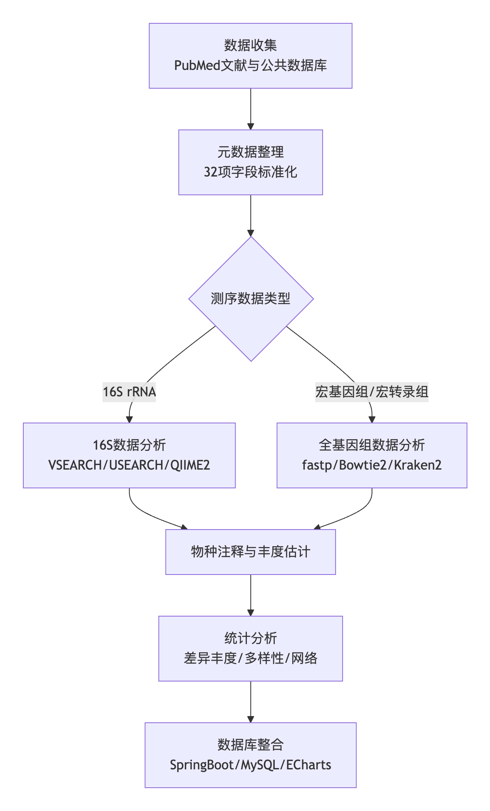
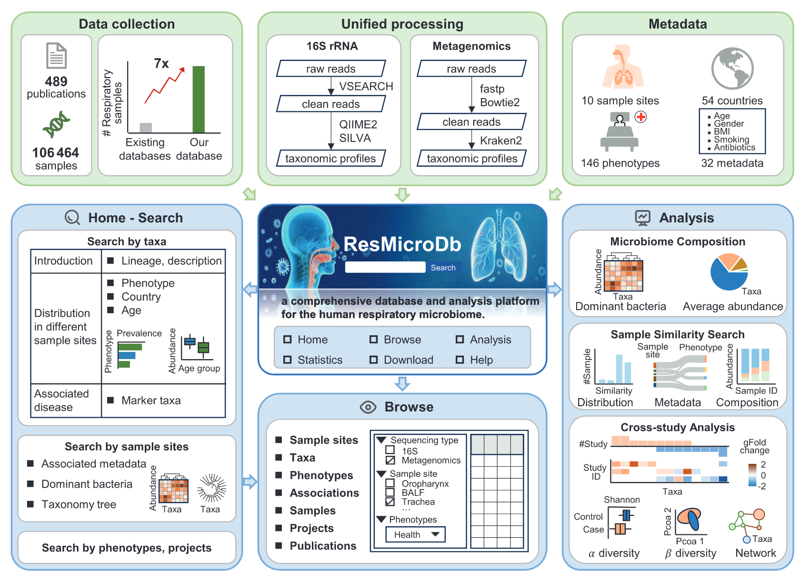
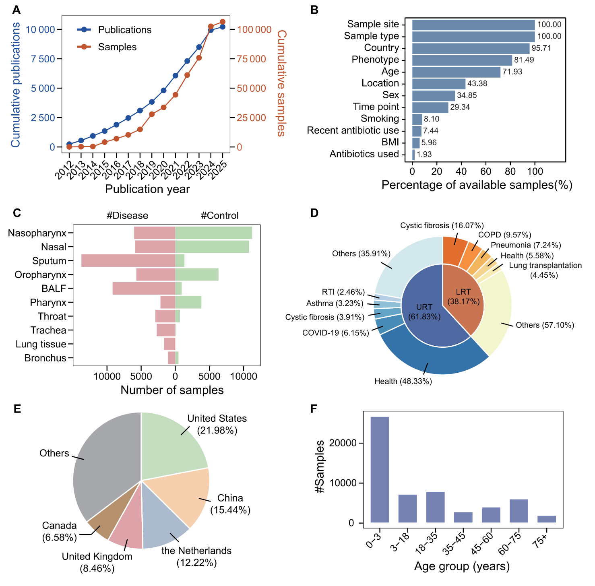
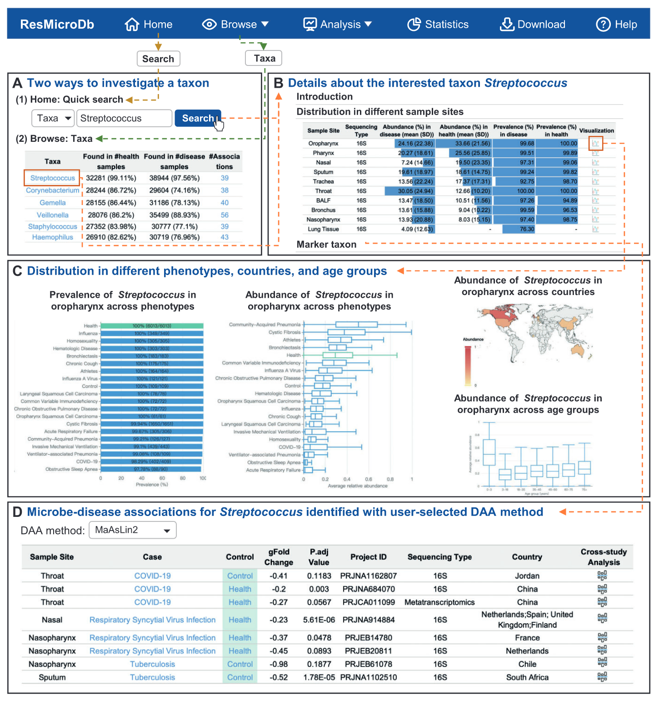
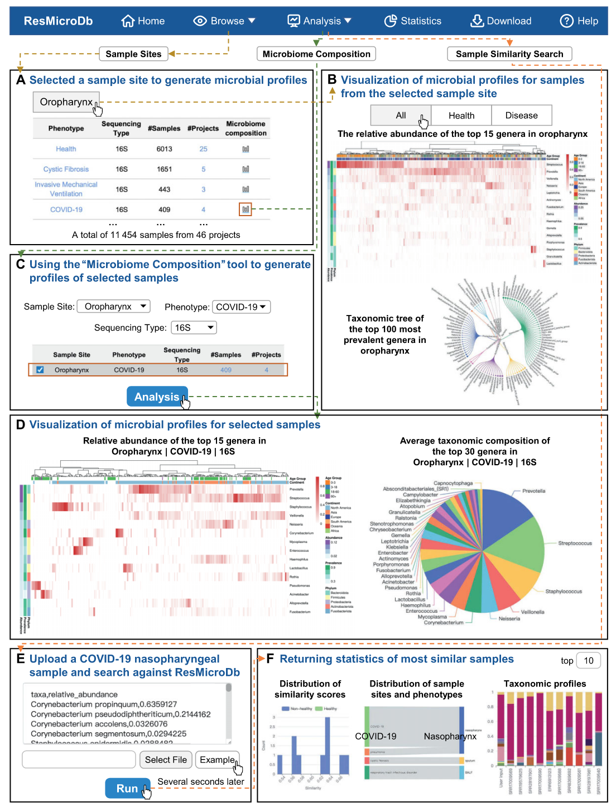
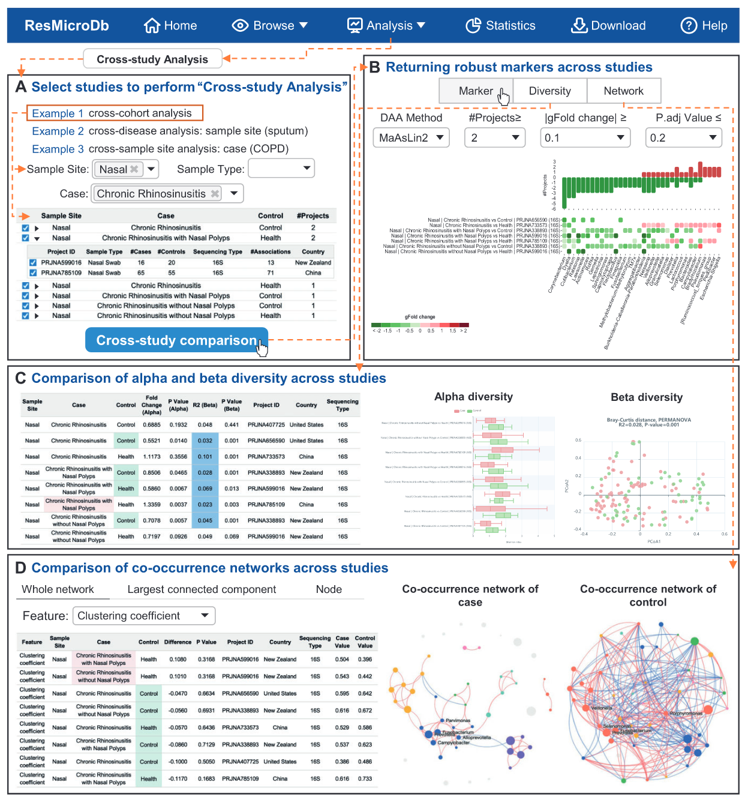

呼吸道微生物组在维持人体健康中扮演着重要角色。尽管相关文献和公共数据快速增长，目前仍缺乏大规模、高质量注释的呼吸道微生物组数据库。ResMicroDb整合了来自514个项目的106,464个样本，覆盖10个采样部位、72种样本类型和146种表型，并提供了标准化分析流程生成的物种注释谱、手动整理的32项元数据字段，以及基于132项病例对照研究鉴定的11,908条微生物-疾病关联。平台还集成了微生物组成可视化、样本相似性搜索和跨研究分析三大工具，支持用户深入探索呼吸道微生物组的分布特征与健康关联。ResMicroDb旨在推动呼吸道微生物组的基础研究与临床转化，可通过https://resmicrodb.cncb.ac.cn免费访问。

发表文章： Ji, X., Qian, Q., Zhang, H., Cai, Q., Zhang, K., Xiao, J., Jiang, X., and Li, M. (2025). ResMicroDb: a comprehensive database and analysis platform for the human respiratory microbiome. Nucleic Acids Res., gkaf1194. https://doi.org/10.1093/nar/gkaf1194.

## 背景

呼吸道疾病是全球公共卫生的重要负担。慢性阻塞性肺疾病（COPD）和下呼吸道感染分别位列全球死因第四和第五位，2021年分别导致约352万和245万死亡。宏基因组测序技术的进步揭示了呼吸道微生物组的多样性及其在免疫调节和炎症控制中的关键作用。传统认为无菌的下呼吸道实际上栖息着动态的微生物群落，其组成受疾病、年龄、吸烟、抗生素使用等因素影响。微生物组失调与哮喘、肺炎、COPD和COVID-19等疾病的易感性和进展密切相关。例如，COVID-19患者入院时链球菌丰度较高与预后良好相关，表明呼吸道微生物组可作为预后生物标志物。

截至2025年1月31日，PubMed已收录超过1万篇呼吸道微生物组相关论文，公共数据量逾10万样本。现有多部位微生物组数据库（如mBodyMap、HumanMetagenomeDB和BugSigDB）虽包含部分呼吸道数据，但样本量有限、解剖部位注释粗糙，且宿主信息不完整。这些局限性凸显了构建高质量呼吸道微生物组专用数据库的迫切性。

## 方法

### 数据收集
通过PubMed检索关键词“human”及特定呼吸道部位（如“oropharynx”“lung”），筛选出10,586篇文献，经人工审核后保留489篇。从NCBI SRA、ENA和CNCB GSA下载原始测序数据，最终整合106,464个样本（90,338个16S扩增子、12,799个宏基因组、3,327个宏转录组样本）。

### 元数据整理
手动标准化来自NCBI、EBI和CNCB BioSample数据库的元数据，核对原始文献与补充材料的一致性，最终生成32个字段，包括采样部位、样本类型、表型、年龄、性别、吸烟史等。表型名称通过EFO、MONDO、DO等本体数据库进行标准化映射。

### 数据处理流程
采用统一流程进行物种注释：  
1. **16S数据**：使用VSEARCH进行序列合并、去噪和嵌合体去除，生成ASV；通过QIIME2和SILVA数据库（v138）进行物种分类。  
2. **宏基因组/宏转录组数据**：使用fastp质控、Bowtie2去除宿主和载体序列、SortMeRNA去除rRNA，Kraken2和Bracken进行物种注释及丰度估计。  
3. **统计分析**：针对132项病例对照研究，通过MaAsLin2等五种方法进行差异丰度分析，计算α多样性（Shannon指数）和β多样性（Bray-Curtis距离+PCoA），并构建共现网络（SparCC算法）。

## ResMicroDb数据库概览

ResMicroDb（https://resmicrodb.cncb.ac.cn/）是一个致力于人类呼吸道微生物组研究的综合数据库和分析平台。该数据库整合了来自514个项目的106,464个样本，跨越10个呼吸道部位和146种表型，以及31个经过整理的元数据字段。数据库还包括从132个病例对照研究中识别出的11,908个微生物-疾病关联。ResMicroDb具有用户友好的Web界面，用于查询、浏览、可视化和分析呼吸道微生物组数据，提供三个集成的分析工具：微生物组组成可视化、样本相似性搜索和跨研究分析。

## 平台功能与应用

### 微生物组成可视化

用户可通过"Browse"模块按部位、表型或测序策略查询微生物群落结构。平台支持多种可视化方式，包括热图、网络图、主成分分析（PCA）和散点图等。例如，口咽部样本中以链球菌、普雷沃菌为主，且群落结构受采样部位影响最大（PERMANOVA，R²=0.20）。平台还提供交互式三维散点图，允许用户探索数据的多维度关系。

### 样本相似性搜索

该工具支持用户上传新样本，通过Bray-Curtis等距离指标与数据库比对，推断其采样部位或健康状态。测试中，16S样本平均查询时间低于6.5秒，准确性在示例中达75%。该功能对于临床样本的快速诊断和来源推断具有重要意义。

### 跨研究分析

平台提供基于微生物互作网络的NetMoss算法，通过评估微生物网络模块的变化来鉴定可靠的疾病标志物。该算法可以有效减少批次效应，鉴别出更多可靠的疾病标志物，挖掘出一些丰度尚未改变但在微生物互作网络中已被扰动的关键微生物类群。例如，在结直肠癌研究中，NetMoss方法成功识别出68%的疾病相关微生物，而传统的统计检验法仅识别出32%。

## 快速物种搜索及其在呼吸道部位和表型中的分布

ResMicroDb支持快速物种搜索功能，用户可以通过输入物种名称快速查询其在各呼吸道部位和表型中的分布情况。例如，搜索"韦荣氏球菌属"（Veillonella），结果显示该菌属在口腔、咽部、呼吸道和消化道中广泛分布，是这些部位的常见菌群。韦荣氏球菌属是革兰氏阴性厌氧性微小球菌，直径约0.3-0.5μm，初期培植为革兰氏阳性，过夜转为阴性。该菌属能发酵丙酮酸、乳酸、苹果酸等，从乳酸产生乙酸、丙酸、CO₂和H₂。在慢性鼻窦炎研究中，韦荣氏球菌属被鉴定为风险因素（OR: 1.258, 95% CI: 1.037–1.527, p=.019）。

## 不同呼吸道部位和表型的微生物组组成探索

ResMicroDb提供了丰富的可视化工具，帮助用户探索不同呼吸道部位和表型的微生物组组成差异。通过主坐标分析（PCoA）和热图等可视化方法，可以直观地展示样本间的相似性和差异性。例如，在慢性鼻窦炎（CRS）研究中，发现CRS患者与健康对照在鼻腔微生物组组成上存在显著差异。CRS患者中放线菌门相对丰度显著降低，而某些致病菌如莫拉克斯菌属、嗜血杆菌属和假单胞菌属可能扮演致病角色。此外，真菌和病毒也被认为是CRS发病的重要影响因素。

## 通过"样本相似性搜索"工具推断新样本特征

"样本相似性搜索"工具是ResMicroDb的核心功能之一，它允许用户上传新的呼吸道样本数据，通过与数据库中已有样本的相似性比较，快速推断新样本的采样部位、健康状态或疾病类型。该工具基于Bray-Curtis距离、Jaccard距离等多样性指数，结合机器学习算法，能够实现高精度的样本分类。在实际应用中，该工具已成功用于呼吸道感染病原体的快速鉴定和疾病类型的辅助诊断。

## 通过"跨研究分析"工具进行差异分析

"跨研究分析"工具采用先进的NetMoss算法，通过整合多个独立研究的微生物组数据，识别与疾病相关的可靠生物标志物。该算法通过评估微生物互作网络模块的变化，能够发现那些丰度变化不明显但在网络结构中发生显著扰动的关键微生物。例如，在结直肠癌的跨研究分析中，NetMoss方法从7项独立研究中整合了2,742个肠道微生物数据集，成功识别出68%的疾病相关微生物，显著优于传统基于丰度的方法。该工具还支持多种统计分析方法，包括差异丰度分析、相关性分析和网络分析等，为呼吸道疾病的机制研究和临床转化提供有力支持。

## 讨论

ResMicroDb是首个专注于人类呼吸道微生物组的大规模数据库，其样本量、注释深度和分析功能均显著超越现有资源。通过统一流程处理数据，有效减少了技术偏差；手动整理的元数据支持跨研究可比性；微生物-疾病关联的系统鉴定为标志物挖掘提供了基础。平台工具的设计兼顾探索性分析与临床转化需求，例如相似性搜索可用于样本来源推断，跨研究分析有助于发现稳健的疾病相关微生物特征。

未来发展方向包括：  
1. 扩展数据类型（如ITS、18S、长读长测序）；  
2. 整合功能数据（代谢组、蛋白组）；  
3. 构建呼吸道专用参考基因组目录；  
4. 开发呼吸道微生物健康指数。这些改进将进一步提升数据库在机制研究和临床应用中的价值。

## 结论

ResMicroDb通过整合大规模数据、标准化分析流程和多功能探索工具，为呼吸道微生物组研究提供了全面资源。其数据覆盖广泛、注释规范，支持用户从群落结构、标志物识别到跨队列比较的多维度分析。随着数据更新和功能扩展，ResMicroDb有望在呼吸道疾病的预防、诊断和治疗策略开发中发挥关键作用。
