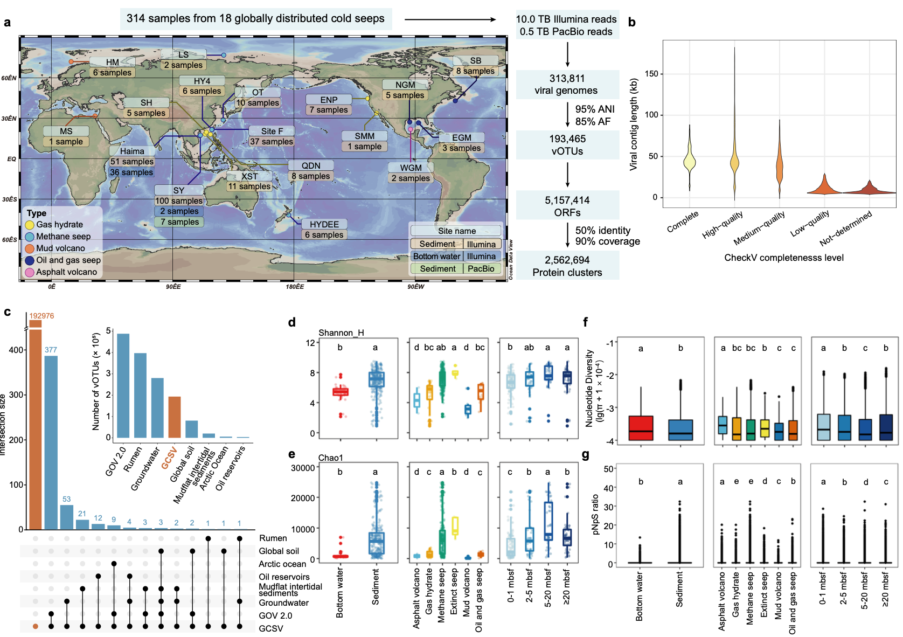
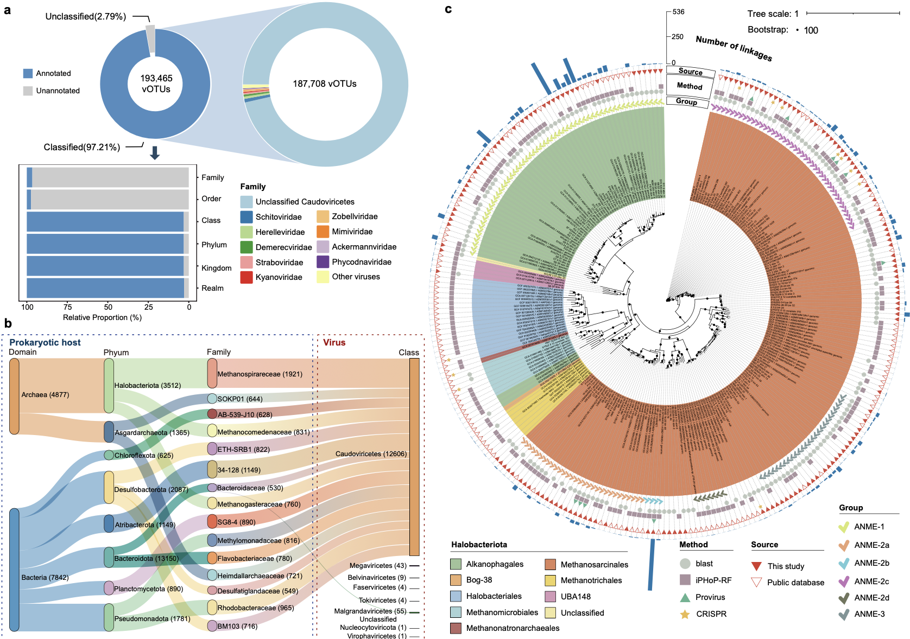
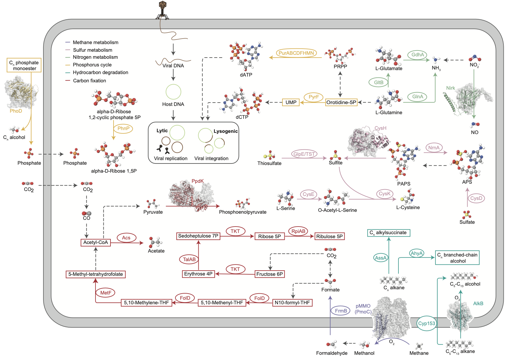
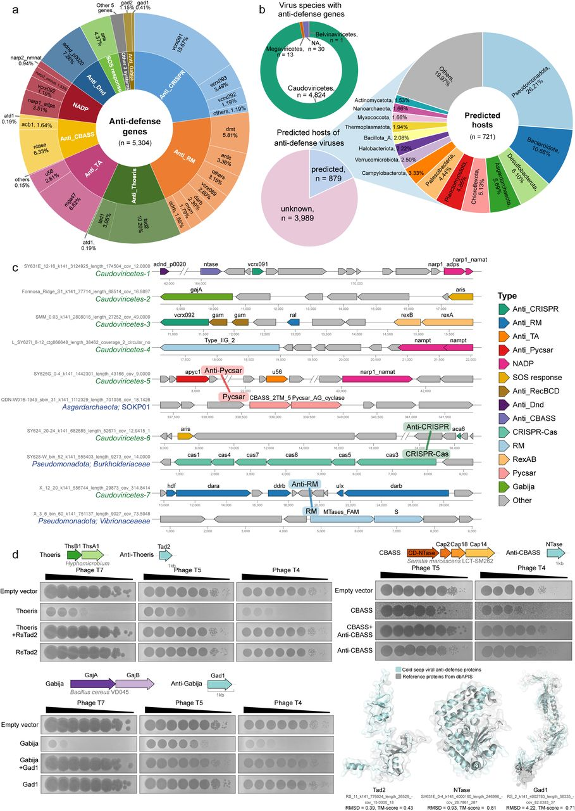
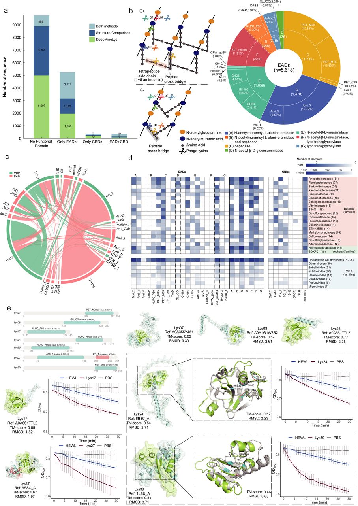

深海冷泉是全球分布的化能生态系统，孕育着多样的化能合成微生物群落，然而其病毒群落的研究仍处于初步阶段。

1. Liu, X., Guo, X., Xue, L., Lu, Z., Wang, J., Liao, J., Liu, L., Chen, Y., Peng, Y., Han, Y., et al. (2025). A global atlas of deep-sea cold seep viruses uncovers extensive genomic novelty, pervasive viral dark matter, and biotechnological potential. Preprint at bioRxiv, https://doi.org/10.64898/2025.12.10.692286 https://doi.org/10.64898/2025.12.10.692286.

这项研究构建了全球冷泉病毒组（GCSV），这是一个包含来自18个冷泉位点、314个宏基因组的193,465个物种水平病毒操作分类单元（vOTUs）和超过五百万个病毒蛋白质的综合目录。超过99%的vOTUs相对于现有环境病毒组具有独特性，揭示了一个由低微多样性和强纯化选择塑造的异常新颖的病毒库。

## 背景

病毒是微生物生态系统的核心组成部分，塑造宿主种群动态、介导基因交换并影响不同环境中的代谢通量。尽管在海洋病毒学和其他可及环境的研究中取得了重大进展，但全球病毒圈的很大部分仍未被充分表征，尤其是在深海。对深海生态系统的宏基因组调查一致揭示了异常高的病毒新颖性，大多数基因与已知序列缺乏可检测的同源性。这种普遍存在的病毒暗物质表明，深部地下环境蕴藏着独特的病毒谱系和功能。

冷泉为研究深海微生物和病毒过程提供了一个易于处理的场景。甲烷和其他碳氢化合物的持续释放支持了密集的化能合成群落，这些群落主要由介导甲烷氧化、硫和氮转化以及有机碳周转的古菌和细菌群主导。尽管先前的研究表明冷泉沉积物中含有多样且分类学新颖的病毒，但它们与宿主生理学的相互作用、对沉积物地球化学的响应以及对主要代谢途径的潜在贡献仍未得到充分表征。

## 结果

### 最大的冷泉病毒组具有异常的新颖性和高度的基因组稳定性

GCSV目录包含193,465个非冗余vOTUs，其中包含3,538个完整基因组、5,226个高质量基因组和14,134个中等质量基因组。与来自其他生态系统（如潮间带泥滩沉积物、土壤、地下水、全球海洋病毒组等）的病毒数据集相比，仅有0.25%的GCSV vOTUs存在物种水平重叠，证明了冷泉病毒群落异常的新颖性和生态独特性。冷泉病毒种群表现出低基因组水平微多样性，核苷酸多样性（π）均值为2.62 x 10^-4，平均SNP密度仅为每kb 0.71个SNPs。在基因水平上，冷泉病毒基因表现出强纯化选择，大多数基因的pN/pS比值小于0.05，Tajima's D值为强负值。这些结果表明冷泉病毒种群经历了强大的进化约束，主要由纯化选择塑造。

### 广泛的未分类病毒多样性及显著的古菌病毒组成

尽管97.02%的GCSV vOTUs被分配到了某个谱系，但仅有3.43%能够被解析到目或科水平，凸显了冷泉病毒在更精细分类等级上仍未被充分表征。96.00%的vOTUs被归类为有尾病毒纲（Caudovircetes）。宿主预测将41,976个vOTUs（21.70%）与假定宿主相关联。细菌是主要的预测宿主，涉及104个门。古菌病毒-宿主关联占所有关联的20.80%，涉及8,729个vOTUs（4.51%）和15个古菌门。在古菌中，盐杆菌门（Halobacteriota）是最常见的预测宿主，其中包括166个厌氧甲烷氧化古菌（ANME）基因组。GCSV包含了3,741个与ANME相关的病毒。与阿斯加德古菌门（Asgardarchaeota）和DPANN谱系（如谜古菌门Aenigmarchaeota和纳米古菌门Nanoarchaeota）相关的病毒也很普遍。与其他环境（如土壤、地下水、淡水湖）相比，冷泉蕴含着不成比例的高丰度古菌病毒。

### 普遍存在的病毒暗物质及生态适应的标志基因

从GCSV中的193,465个vOTUs中预测出516万个蛋白质，进一步聚类为256万个非冗余vPCs。通过结合基于结构和序列的注释方法，共有879,660个vPCs获得了至少一个注释，但仍有65.8%未被表征，代表了普遍存在的病毒暗物质。在病毒标志基因中，鉴定出12,625个主要衣壳蛋白（MCPs），其中2,796个代表性MCPs被明确归属于三种典型折叠：单果冻卷（SJR）、双果冻卷（DJR）和HK97-like。大多数MCPs（2,503个）采用HK97-like折叠。终止酶大亚基（TerL）由15,143个vPCs代表，显示出经典的双结构域组织。尽管MCPs和TerLs保留了保守的结构折叠和催化特征，但与参考蛋白相比，这两种蛋白在理化性质和氨基酸组成上均表现出显著差异。MCPs和TerLs都显著更亲水，这主要由酸性残基的富集所驱动。MCPs显示出显著的甘氨酸富集和脯氨酸耗竭，从而增强了局部可塑性以对抗低温诱导的刚性。TerLs表现出显著较低的相对突变性，表明在极端条件下存在强纯化选择以保持保守。

### 扩展且功能多样的辅助代谢基因谱系

通过严格过滤标准，在GCSV中鉴定出7,154个辅助代谢基因（AMGs），涵盖341个基因家族，由4,260个vOTUs编码。在KEGG二级水平上，大多数AMGs主要与辅因子和维生素代谢、聚糖代谢、碳水化合物代谢、能量代谢和氨基酸代谢相关。检测到12个与甲烷代谢相关的AMGs，包括编码颗粒状甲烷单加氧酶亚基的pmoC。冷泉病毒还携带参与非甲烷烃降解的AMGs，以及参与碳固定途径的AMGs。此外，冷泉病毒携带参与多种元素循环的AMGs，包括硫代谢、氮代谢和磷代谢相关的基因。

### 针对多层原核免疫的广泛病毒抗防御武器库

在整个数据集中，预测有5,304个vPCs编码抗防御基因，涵盖13个不同的系统。这些vPCs包含来自15,031个vOTUs的18,927个蛋白质。在所有抗防御系统中，抗CRISPR、抗限制修饰系统和抗Thoeris系统最为丰富。抗防御元件在病毒基因组中分布不均，鉴定出368个携带多个抗防御系统的vOTUs。病毒-宿主关联分析揭示了879对涉及编码抗防御的病毒的病毒-宿主对。在这些对中，151对显示出病毒抗防御基因与宿主防御系统之间的直接对应关系。病毒基因组内部也检测到防御基因，有78个vOTUs同时编码防御和抗防御系统。实验验证证实了所选抗防御基因（RsTad2、Gad1、NTase）能够有效中和其对应的防御系统（Thoeris、Gabija、CBASS）的功能活性。

### 新颖多样的病毒溶菌酶及其抗菌应用潜力

从GCSV中通过结构比对和DeepMineLys鉴定出15,710个溶菌酶。其中5,953个携带高置信度的溶菌酶结构域。结构域水平分析揭示了冷泉病毒溶菌酶中显著的催化多样性和结构域组合。大多数序列编码至少一个EAD，其次是同时包含EAD和CBD的溶菌酶。EAD涵盖20个结构域家族，分为7个催化类别。CBD多样性较低，代表7个家族。分类学映射揭示了溶菌酶结构域的明显谱系依赖性分布。实验测试证实了七种纯化的溶菌酶对测试菌株具有可检测的水解活性和抗菌效果，部分溶菌酶的活性达到或超过了基准溶菌酶（HEWL）。结构分析表明，部分溶菌酶的EADs与已知参考蛋白存在分歧，可能增强了其在低温高压条件下的酶学性能。

## 讨论

GCSV目录代表了迄今为止最大的深海病毒资源之一。分析揭示了冷泉病毒生态系统具有异常新颖、进化受限、代谢影响深远且深度卷入病毒-宿主冲突的特点。GCSV的非凡新颖性凸显了冷泉是未描述病毒谱系的主要储存库。尽管具有高度的基因组新颖性，冷泉病毒表现出显著的低微多样性和强纯化选择，表明其进化是由长期基因组稳定性驱动的。这里揭示的广泛病毒蛋白暗物质揭示了根本不同的病毒基因库和全新分子机制的潜力。GCSV还提供了病毒功能塑造冷泉生物地球化学的系统级视图。冷泉病毒还编码了深海生态系统中已知的最广泛的抗防御武器库之一。具有先前未识别结构域的溶菌酶的发现进一步强调了冷泉病毒的生物技术价值。

GCSV为生态学、进化论和生物技术研究提供了一个广泛而基础性的资源。这些病毒基因组富含新颖的生化途径，并受到极端环境压力的塑造，极大地扩展了已知病毒圈的边界，并将冷泉确立为先前被忽视的病毒创新和生态影响中心。未来，将该资源与多组学分析、实验验证和功能表征相结合，对于将这些基因组见解转化为实际应用以及全面了解病毒在深海化能合成生态系统中的作用至关重要。

## 方法

### 样本采集与宏基因组测序

本研究整合了来自全球18个冷泉位点的314个样本的宏基因组数据，包括38个底层水短读长宏基因组、269个沉积物短读长宏基因组和7个沉积物长读长宏基因组。总数据集包含0.5 Tb的PacBio HiFi长读长数据和10 Tb的Illumina短读长数据。所有样本均按照标准环境微生物组研究协议进行采集、保存和运输，确保DNA质量完整性。

### 数据预处理与质量控制

原始测序数据经过严格的质量控制流程。使用Fastp（v0.23.2）进行质量过滤，去除低质量碱基（Q<20）、接头序列和长度小于50 bp的reads。对于短读长数据，采用Trimmomatic（v0.39）进行进一步修剪。质控后的reads使用FastQC（v0.11.9）评估质量，确保所有样本的Q30碱基比例大于90%，GC含量在合理范围内。

### 宏基因组组装

质控后的reads使用MEGAHIT（v1.2.9）进行从头组装，参数设置为k-mer范围21-141，步长10。对于长读长数据，使用Flye（v2.9）进行组装，最小重叠长度设置为5000 bp。组装后的contigs使用MetaQUAST（v5.2.0）评估组装质量，包括N50、最大contig长度、总组装大小等指标。仅保留长度大于1 kb的contigs用于后续分析。

### 病毒基因组识别与质量控制

病毒基因组的识别采用了三种互补的病毒识别流程：geNomad（v2.0.0）、VirSorter2（v2.2.4）和VIBRANT（v1.2.1）。每个流程使用默认参数运行，geNomad采用end-to-end模式，VirSorter2使用"virome"数据库，VIBRANT使用"prokaryotic"模式。从任一工具预测为病毒的contigs被合并，去除冗余后进入下一步分析。

### vOTUs聚类与质量评估

使用CheckV（v1.0.1）评估病毒基因组质量，包括完整性、污染度和质量等级。在95%平均核苷酸同一性（ANI）和85%比对分数（AF）下，使用dRep（v3.4.0）将病毒重叠群聚类为vOTUs。聚类参数设置为：最小ANI 95%，最小AF 85%，最小contig长度1000 bp。最终获得193,465个非冗余vOTUs，包括3,538个完整基因组、5,226个高质量基因组和14,134个中等质量基因组。

### 病毒蛋白预测与vPCs聚类

使用Prodigal（v2.6.3）预测病毒蛋白，参数设置为"-p meta"以优化宏基因组数据的预测。预测的蛋白质序列使用MMseqs2（v14.7e284）在50%序列同一性和90%覆盖率下聚类为病毒蛋白簇（vPCs）。聚类采用easy-cluster模式，e值阈值1e-3，最小覆盖度0.9。最终获得516万个蛋白质，聚类为256万个非冗余vPCs。

### 功能注释

蛋白功能注释结合了基于结构的方法和基于序列的方法。基于结构的方法使用ProstT5语言模型生成蛋白质结构嵌入，然后使用Foldseek（v8.6b）在PDB数据库中进行结构比对，e值阈值1e-3。基于序列的方法使用eggNOG-mapper（v2.1.12）和enVhogDB进行功能注释，e值阈值1e-5，覆盖度阈值0.5。注释结果整合后，使用InterProScan（v5.63-95.0）进行结构域预测。

### 宿主预测

宿主预测使用iPHoP（v1.2.0）流程，该工具整合了基于CRISPR间隔区、tRNA匹配、蛋白质序列相似性和系统发育信号的多重方法。预测参数设置为：最小置信度0.5，最小覆盖度0.5。宿主预测结果经过手动检查，去除低置信度关联。

### 辅助代谢基因（AMGs）鉴定

AMGs使用DRAM-v（v1.4.4）和VIBRANT（v1.2.1）进行预测。DRAM-v使用"viral"模式，VIBRANT使用"prokaryotic"模式。预测结果经过基因组背景过滤，仅保留在病毒基因组中具有典型病毒基因背景的AMGs。最终鉴定出7,154个AMGs，涵盖341个基因家族。

### 抗防御基因鉴定

抗防御基因使用AntidefenseFinder（v1.0）和同源性搜索进行鉴定。AntidefenseFinder使用默认参数，涵盖13个抗防御系统。同源性搜索使用BLASTp（v2.13.0+），e值阈值1e-5，覆盖度阈值0.5。预测结果经过手动检查，去除假阳性。

### 溶菌酶鉴定

溶菌酶通过结构比对和DeepMineLys（v1.0）进行识别。结构比对使用Foldseek在PDB数据库中进行，搜索已知溶菌酶结构。DeepMineLys使用基于深度学习的模型预测溶菌酶活性。最终鉴定出15,710个溶菌酶，其中5,953个携带高置信度的溶菌酶结构域。

### 实验验证

部分抗防御基因和溶菌酶的功能通过异源表达和活性测定进行了实验验证。抗防御基因在大肠杆菌BL21(DE3)中表达，使用Ni-NTA亲和层析纯化。溶菌酶活性通过浊度法测定，使用溶壁微球菌作为底物。抗菌活性通过最小抑菌浓度（MIC）测定，使用革兰氏阳性菌和革兰氏阴性菌作为测试菌株。

