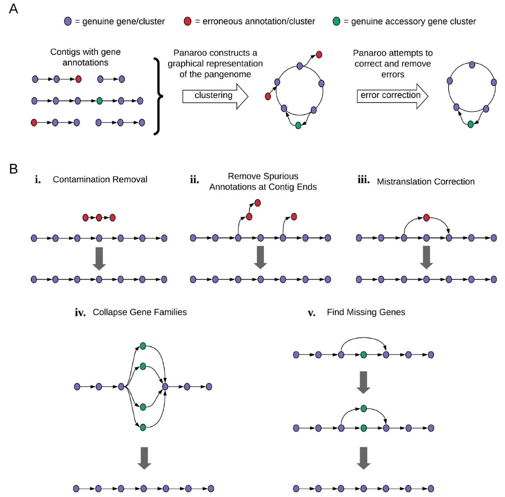

## Introduction

Panaroo是一个用于微生物泛基因组分析的高效工具，专门设计用于处理来自不同菌株的基因组注释数据。该工具通过图论方法整合和校正基因注释，能够有效识别和纠正注释错误、检测结构变异，并重构准确的泛基因组。Panaroo支持多种输入格式（GFF3、GenBank等），提供严格、中等和敏感三种运行模式，适应不同质量数据的需求。主要功能包括基因聚类、缺失基因重发现、并行处理、核心基因组对齐等。与传统工具相比，Panaroo在保持高精度的同时，显著提高了对注释错误的鲁棒性，特别适用于大规模微生物基因组比较研究。

## 文章介绍

### 研究背景与问题陈述

微生物基因组学研究经常涉及多个菌株的比较分析，传统的泛基因组分析工具（如Roary）在处理大规模数据集时面临诸多挑战。注释软件（如Prokka）在不同基因组中可能对相同基因序列产生不一致的注释，导致基因聚类错误。此外，基因组组装碎片化、测序错误和污染等问题进一步增加了分析的复杂性。Panaroo的开发旨在解决这些挑战，通过创新的图论算法提供更准确的泛基因组表征。

### 研究方法与技术路线



Panaroo采用多阶段处理流程，核心算法包括：

1. **初始基因聚类**：使用CD-HIT进行保守聚类，默认参数为98%序列相似性和98%长度差异阈值
2. **图构建**：将基因聚类表示为图结构，节点代表基因家族，边代表基因组中的相邻关系
3. **图校正**：通过多种启发式方法识别和校正注释错误，包括：
   - 末端基因修剪：移除低支持度的末端簇
   - 边缘过滤：基于支持度阈值清理可疑连接
   - 长度异常值检测：处理长度异常的基因注释
4. **基因重发现**：在注释缺失的基因组区域搜索可能存在的基因
5. **并行化处理**：支持多线程加速，提高大规模数据集处理效率

### 主要发现与创新点

Panaroo的主要创新体现在以下几个方面：

1. **智能错误校正**：通过图论方法系统识别和校正多种类型的注释错误，显著提高聚类准确性
2. **灵活的运行模式**：提供strict、moderate、sensitive三种模式，适应不同数据质量需求
3. **基因重发现功能**：能够检测和恢复被注释工具遗漏的基因，提高基因检测灵敏度
4. **结构变异分析**：内置结构变异检测功能，可直接从泛基因组图中识别基因组重排事件
5. **可视化支持**：生成兼容Cytoscape的图文件，便于结果可视化和解释

### 研究意义与贡献

Panaroo为微生物比较基因组学研究提供了更可靠的分析工具，特别是在处理大规模、多样化数据集时表现出色。其准确的基因聚类和错误校正能力有助于发现真实的基因含量差异，为病原菌进化研究、功能基因组学和疫苗设计等领域提供更可靠的数据基础。工具的开源特性也促进了方法的透明性和可重复性。

## 使用教程

### 安装部署

#### 环境要求
- Python 3.9或更高版本（Bioconda目前推荐使用3.9）
- 至少4GB内存（大型数据集需要更多）
- 足够的磁盘空间存储中间文件和结果

#### 依赖安装

**Conda安装（推荐）**
```bash
# 创建并激活环境
conda create -n panaroo python=3.9
conda activate panaroo

# 使用conda安装
conda install -c conda-forge -c bioconda -c defaults 'panaroo>=1.3'

# 或使用mamba加速安装
conda install mamba -c conda-forge
mamba install -c conda-forge -c bioconda -c defaults 'panaroo>=1.3'
```

**手动安装**
```bash
# 安装系统依赖
sudo apt-get install cd-hit mafft  # Ubuntu/Debian系统

# 安装Python包
pip3 install git+https://github.com/gtonkinhill/panaroo

# 或从源码安装
git clone https://github.com/gtonkinhill/panaroo
cd panaroo
python3 setup.py install
```

#### 可选依赖
- Prokka：用于基因组注释
- PRANK/Clustal：替代MAFFT进行多序列比对
- MASH：用于质量控制和参考数据库比较

### 基本使用方法

#### 快速开始
```bash
# 创建结果目录
mkdir results

# 基本运行命令（使用Prokka生成的GFF文件）
panaroo -i *.gff -o results --clean-mode strict
```

#### 处理RefSeq格式文件
RefSeq注释文件可能包含不符合预期的注释，如包含提前终止密码子的基因：
```bash
panaroo -i *.gff -o results --clean-mode strict --remove-invalid-genes
```

#### 运行模式选择
```bash
# 严格模式（默认）- 去除可能的污染，保留大多数感兴趣基因
panaroo -i *.gff -o results --clean-mode strict

# 敏感模式 - 保留稀有质粒，可能包含更多假阳性
panaroo -i *.gff -o results --clean-mode sensitive
```

#### 输入格式支持
Panaroo支持多种输入格式：
- 标准GFF3文件
- 包含文件路径列表的文本文件
- 分隔的GFF和FASTA文件
- GenBank格式文件（.gbk, .gb, .gbff）

### 进阶应用

#### 多序列比对生成
```bash
# 对核心基因（≥98%菌株中存在）进行比对，使用Clustal，10线程
panaroo -i *.gff -o ./results/ --clean-mode strict -a core --aligner clustal --core_threshold 0.98 -t 10

# 生成所有基因簇的比对
panaroo -i *.gff -o ./results/ --clean-mode strict -a pan --aligner mafft -t 8
```

#### 基因家族聚类参数调整
```bash
# 使用更宽松的家族聚类阈值（50%相似性）
panaroo -i *.gff -o ./results/ --clean-mode strict -f 0.5
```

#### 处理旁系同源基因
```bash
# 默认情况下分离旁系同源基因，可选项合并它们
panaroo -i *.gff -o ./results/ --clean-mode strict --merge_paralogs
```

#### 基因重发现参数优化
```bash
# 在1000nt半径内搜索，要求至少50%序列匹配
panaroo -i *.gff -o ./results/ --clean-mode strict --refind_prop_match 0.5 --search_radius 1000

# 关闭基因重发现功能
panaroo -i *.gff -o ./results/ --clean-mode strict --refind-mode off
```

#### 数据预处理和质量控制
```bash
# 使用panaroo-qc进行质量检查
panaroo-qc -t 3 --graph_type all -i *.gff --ref_db refseq.genomes.k21s1000.msh -o results
```
参考 mash 数据库可以从 <https://mash.readthedocs.io/en/latest/tutorials.html> 下载

#### 一致性注释生成
```bash
# 使用Prodigal创建训练文件
prodigal -t prodigal_training_file -c -m -g 11 -p single -q -i input_file.fasta > /dev/null

# 使用训练文件运行Prokka
prokka --prodigaltf prodigal_training_file input_file.fasta
```

### 参数详解

#### 核心参数说明
- `--clean-mode`：运行模式，影响错误校正的严格程度
- `--threshold`：初始聚类序列相似性阈值（默认0.98）
- `--family_threshold`：基因家族聚类阈值（默认0.7）
- `--core_threshold`：核心基因组定义阈值（默认0.95）

#### 不同模式的默认参数
| 参数 | 严格模式 | 中等模式 | 敏感模式 |
|------|----------|----------|----------|
| min_trailing_support | max(2, ⌈0.05N⌉) | max(2, ⌈0.01N⌉) | 2 |
| trailing_recursive | ∞ | ∞ | 1 |
| remove_by_consensus | True | False | False |

### 常见问题与解决方案

#### 安装问题
**问题1**：Python版本兼容性错误
```bash
# 解决方案：创建指定版本的环境
conda create -n panaroo python=3.9
```

**问题2**：依赖包冲突
```bash
# 解决方案：使用干净的conda环境
conda create -n panaroo --no-default-packages python=3.9
```

#### 运行错误
**问题1**：无效基因注释错误
```bash
# 解决方案：启用无效基因过滤
panaroo -i *.gff -o results --remove-invalid-genes
```

**问题2**：内存不足
```bash
# 解决方案：减少线程数，使用更严格过滤
panaroo -i *.gff -o results --clean-mode strict -t 2
```

#### 性能优化
- 大型数据集（>100基因组）建议使用8-16线程
- 敏感模式需要更多内存和计算时间
- 预处理阶段使用panaroo-qc识别潜在问题

## 输出文件详解

### 主要输出文件

#### gene_presence_absence.csv
基因存在/不存在矩阵，格式与Roary兼容。包含每个基因簇在各样本中的存在情况，合并的注释用分号分隔，含终止密码子的基因添加"_stop"后缀，长度异常基因添加"_len"后缀。

#### gene_presence_absence.Rtab
二进制版本的基因存在/不存在矩阵，便于统计分析。

#### final_graph.gml
最终泛基因组图，可使用Cytoscape可视化或NetworkX进行进一步分析。包含基因注释和基因组特异性信息。

#### struct_presence_absence.csv
基因组重排事件的存在/不存在矩阵，可通过`--min_edge_support_sv`参数调整检测阈值。

#### pan_genome_reference.fa
线性参考基因组，包含数据集中所有基因。注意：旁系同源基因簇仅出现一次以避免多映射问题。

### 序列文件

#### combined_DNA_CDS.fasta
包含所有注释和重发现基因的核苷酸序列，使用Panaroo内部命名，可通过gene_data.csv文件转换为原始名称。

#### combined_protein_CDS.fasta
与上述文件对应的蛋白质序列。

### 比对文件

#### core_gene_alignment.aln
核心基因多序列比对文件，包含至少达到`--core_threshold`阈值菌株中存在的基因。

#### core_gene_alignment_filtered.aln
过滤后的核心基因组比对，推荐用于构建系统发育树。使用BMGE过滤异常基因，默认基于Tukey异常值检测自动调整。

## References
1. Tonkin-Hill, G., MacAlasdair, N., Ruis, C., Weimann, A., Horesh, G., Lees, J.A., Gladstone, R.A., Lo, S., Beaudoin, C., Floto, R.A., et al. (2020). Producing polished prokaryotic pangenomes with the panaroo pipeline. Genome Biol. 21, 180. https://doi.org/10.1186/s13059-020-02090-4.
2. https://gthlab.au/panaroo/