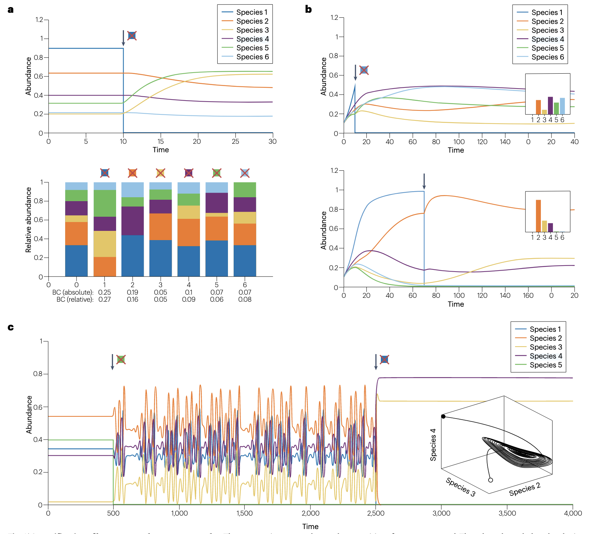
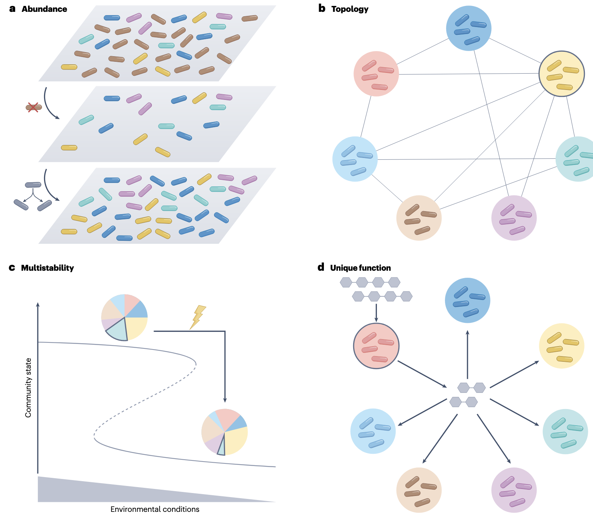
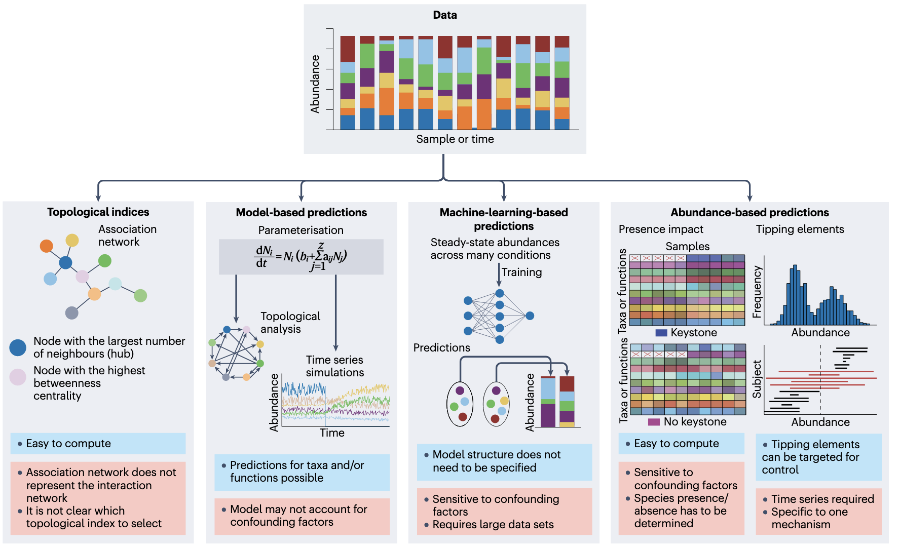
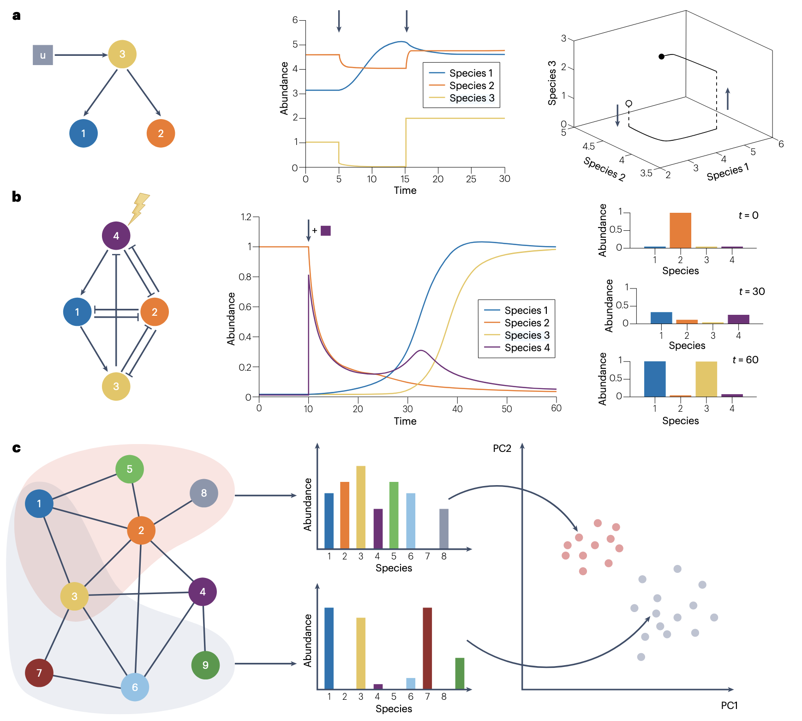

自关键类群(Keystone)概念提出五十余年来，尽管其定义多样，但核心共识在于这些类群或功能对维持群落组成具有超乎比例的重要性。

1. Garza, D.R., Gonze, D., and Faust, K. (2026). Keystone concept revisited: insights into microbial community dynamics and control. Nat. Rev. Microbiol., 1–13. https://doi.org/10.1038/s41579-025-01266-8.

这篇综述基于Paine最初的定义，探讨了微生物关键类群的机制、预测方法、实验验证及其在群落调控中的应用，并提出了基于代谢模型的新预测策略。

## 引言

“关键石”（Keystone）是拱顶结构的核心构件，其存在保障了整体的稳定性。Paine于1969年将这一概念引入生态学，定义关键物种为“其活动与多度决定群落结构与持久性的种群”。随着微生物生态学在实验与理论上的进步，尤其是微生物互作识别与动态模型的发展，关键概念再次受到关注。1996年，Paine与合作者修订定义，强调关键物种的影响应远超其丰度预期。在微生物生态学中，这一定义被进一步细化为“高度连接、在时空上独立于丰度对群落结构与功能产生显著影响的类群”。

本文采用更贴近Paine原始理念的定义：**关键类群或功能是指其丰度变化（增加、减少或移除）对群落分类或功能组成的影响显著强于其他类群或功能**。此定义中，功能丰度可通过编码基因读数或代谢通量衡量。该定义摒弃了将丰度作为关键属性的先决条件，其合理性将在机制部分详述。

然而，这一定义面临多个理论挑战。生态系统本质上是动态的，而关键隐喻隐含静态假设。为评估某类群是否关键，需比较扰动前后群落的稳态组成，但实际群落可能因长暂态过程而难以达到稳态，或存在极限环、混沌吸引子等复杂动态行为，使组成比较失去意义。此外，关键影响的“显著程度”缺乏生物学意义上的明确阈值。定义还涉及类群或功能的分组问题（如功能群或代谢途径），且不要求扰动必须发生在稳态。值得注意的是，关键属性具有群落与环境特异性，且早期优先效应也可能赋予某些类群关键属性。

相关概念包括核心类群（通常根据出现频率定义）、强互作物种（SIS）以及转折元素（tipping elements）。强互作物种指与其他物种存在强相互作用的类群，在弱互作背景下，其存在与否可决定群落演替轨迹，从而表现为关键类群。转折元素则指具有多稳态的类群，其扰动可引发群落向替代稳态转换。

## 如何预测关键类群与功能

### 关键属性的形成机制

关键属性的形成主要源于四种机制，它们在生态网络中以不同方式赋予特定类群或功能以超常影响力。

**丰度机制**：高丰度本身可成为一种关键机制。例如，阴道微生物群常由单一乳酸杆菌物种（如L. crispatus）主导，其通过产酸抑制其他微生物，一旦缺失将导致群落组成剧变，并与细菌性阴道病相关。在此，丰度并非干扰因素，而是关键作用的核心。丰度机制也体现在生物量竞争上，如生物膜形成可物理性排斥其他类群。值得注意的是，基于相对丰度的分析方法可能低估丰度的真实生态影响，因为优势类群的移除可能释放资源，提高其他类群的绝对生物量，而不改变其相对比例，这种总生物量的变化对生态系统韧性至关重要。

**拓扑机制**：此类机制源于类群或功能在生态或代谢网络中的特殊位置。枢纽类群或功能因其与大量其他节点相连（即高度数），扰动会产生连锁反应。例如，某些类群通过释放质子（酸化）或氧气（抑制严格厌氧菌）等代谢物广泛改变环境，或作为病原体改变宿主环境，从而成为枢纽。在代谢网络中，具有高中介中心性的功能（即参与多个途径的酶）形成瓶颈，也可通过拓扑分析识别为关键功能。拓扑机制与丰度机制紧密耦合，丰度可作为互作强度的乘数。反之，类群也可能仅因高丰度而成为枢纽，通过占据空间引入负相互作用。

**转折元素机制**：如前所述，转折元素类群在扰动下可触发群落向替代稳态转换，这是多稳态的结果。多稳态本身与网络中存在正反馈环路以及非线性动力学相关。

**独特功能机制**：提供独特且对群落稳定性至关重要的功能的类群或功能群（如降解复杂聚合物为单体、土壤固氮、结肠乳酸消耗）可成为关键。这本质上是拓扑机制的特例，但因更易于识别而单独强调。多个类群可能携带同一关键功能，其具体由哪个类群实现可能取决于优先效应、初始丰度和环境因素。

### 关键预测方法及其局限性

预测方法主要分为三类，各有其优势与局限。

**拓扑指数法**：这是微生物生态学中最常用的方法，即从丰度数据推断微生物关联网络，然后通过网络分析识别具有特定拓扑特征（如高度数枢纽）的类群。该方法假设观测到的丰度模式由微生物互作形成，但群落动态可能是中性的（即非互作驱动），此时丰度本身可能是比任何拓扑指数都更合适的关键性指标。即使互作存在，两个核心问题依然存在：拓扑属性是否与关键性有生物学关联？我们能否从通常精度较低的推断网络中可靠地检测这些属性？

人工数据评估显示，结合度数、中介中心性等拓扑特征的机器学习方法可在有利条件下达到较高预测准确率。然而，网络推断工具在识别预定义枢纽方面表现不佳，且拓扑属性与模拟移除实验评估的关键性相关性弱。微生物代谢可塑性导致的网络快速重连进一步挑战拓扑指标的稳定性，因为依赖类群在首选营养耗尽时可能切换底物。

在代谢网络中，拓扑指数（尤其是中介中心性）也用于识别关键反应。但需注意避免通过高连接辅因子（如ATP）产生生物学无意义的捷径。

**模型驱动预测方法**：此类方法先参数化一个能重现观测数据的群落模型，然后进行模拟以识别关键类群或功能。例如，参数化广义Lotka-Volterra模型后模拟物种移除效应；或使用深度学习直接从数据学习稳态组成与类群组合的映射，从而预测移除特定类群后的群落组成。这种方法避免了模型构建，但需要大量训练样本，并假设数据处于稳态、无多稳态且环境恒定。

代谢模型，特别是结合流量平衡分析的基因组尺度代谢模型，可以考虑每个群落成员的代谢。它们能识别向其他成员提供必需代谢物的关键类群，或通过模拟逐一移除类群或功能来检查关键性。代谢模型能处理因资源层次结构导致的网络重连，但受限于基因注释质量、FBA的不现实假设以及无法描述非代谢物介导的互作。

**丰度驱动预测方法**：这类方法完全避免了网络推断或模型参数化的挑战。

“经验存在-影响”法通过比较包含或不包含每个类群的样本集来量化群落组成差异。其优点是不受互作网络推断假设的影响，但弱点包括需要大量样本、要求测序深度足够以可靠判断类群存在与否、以及假设环境恒定。如果环境可变，类群存在与否可能与不同环境相关，而非群落变化的因果驱动因素。

另一种方法基于类群丰度跨样本的分布形状来识别转折元素。思路是，如果这些类群属于替代稳态，其丰度分布应是双峰的，并且在时间序列中，当丰度接近转折点时波动应更剧烈。此方法也需要大量样本，且需时间序列数据来区分多稳态与环境驱动的替代状态。尽管是数据最密集的方法，但它对混杂因素的稳健性更强，不过仅限于检测由多稳态机制产生的关键类群。

## 实验启示

### 关键类群的实验验证

实验上，关键物种通常通过“留一法”在合成群落中进行识别：逐一排除某个物种组装群落，并在允许达到稳态的条件下监测剩余物种的丰度。如前所述，物种的影响可能取决于其被改变或移除的时间点。然而，鉴于在微生物群落中分别靶向每个物种的挑战，关键性的实验证据通常来自合成群落的“留一”实验，例如人源化肠道、小鼠肠道和植物叶圈微生物群落。

对合成小鼠肠道群落的系统“留一”实验表明，稳态下移除群落与原始群落的组成差异，与一个由物种相对丰度及其与其他物种互作强度组成的评分呈正相关。在植物叶圈群落中也发现了类似关系。这为“物种在互作网络中的出度是其关键性的指标”提供了一些实验证据，支持了前述拓扑指数。但需注意，这是在真实互作网络中观察到的，而非从丰度数据推断的、通常是无向的关联网络。

少数实验研究支持关联网络属性也可指示关键性。例如，一个关联网络中具有高中介中心性的Variovorax类群被预测可向无法自行合成硫胺素的相邻节点提供硫胺素，且这种交叉喂养得到实验观察（尽管未进行“留一”实验验证关键地位）。另一研究中，影响宿主环境的病原物种在植物叶圈微生物组的关联网络中形成枢纽，且其强影响力得到实验确认（但未系统测试其他类群的影响）。

在宿主相关群落中，关键类群也可能赋予宿主益处。在玉米幼苗根际合成群落的系统“留一”实验中，Enterobacter cloacae被确定为关键物种，并比其他成员更能有效保护宿主免受真菌病原体侵害。此外，在拟南芥叶际微生物组中，关联网络中的枢纽属性与可遗传性建立了联系，这可能意味着宿主主动选择有益的关键类群。

在人类肠道微生物组数据中，多种技术预测了关键类群。当按群落组成对大量粪便样本分组时，会出现被称为肠型的聚类，其富集于不同的类群。有趣的是，肠型特异性类群常被识别为关键候选者。这表明，在替代群落类型间差异丰度的类群倾向于被识别为关键类群。

### 关键功能的识别

如前所述，关键功能可通过构建群落尺度代谢网络并识别高中介中心性、低度数的反应来预测。在一项研究中，从污水处理厂的宏转录组和宏蛋白质组数据推导出代谢网络，尽管基于宏基因组的代谢潜力在不同季节间差异不大，但几个关键功能候选者的表达具有季节特异性。关键物种被预测为关键功能的携带者。在相关应用中，通过将帕金森病患者粪便样本的宏基因组数据映射到参考基因组，并从AGORA资源库获取对应的GEM，构建了患者特异性微生物群落的代谢模型。该工作旨在识别在帕金森病中起超大作用的类群和功能，而非严格预测关键类群。

为有针对性地操纵目标功能，可对菌株进行基因改造，或抑制相关酶。此外，可通过改变功能提供或消耗的代谢物浓度来间接研究某些功能的作用。另一种策略是减少或移除执行目标功能的所有类群，这会影响其他功能，因此不如直接靶向功能精确，但更可行。由于在群落中系统操纵功能实验上不可行，Box1等预测技术可用于指导实验。

## 关键类群与群落调控

当操纵群落以执行特定任务时，核心问题不再是哪些类群或功能对群落组成改变最大，而是应靶向哪些以实现所需的群落组成或行为。目标类群或功能不一定与关键类群或功能相同。但在许多情况下，关键类群是控制群落的理想杠杆。

控制可在组装、瞬态或稳态阶段实施。例如，在健康和农业应用中，常需要将稳态群落转向更健康或更高产的组成。对此，可直接操纵靶类群，或通过代谢物间接操纵。最近的研究引入了一个控制框架，用于识别最小靶类群集以及如何扰动它们以将群落驱动到期望状态。对于具有不同健康影响的替代稳态微生物群落，另一种策略是靶向转折元素以达到更健康的状态。在此类多稳态群落中，添加一个不属于原始群落的物种也可能诱发状态转换。

在其他应用中，可引入关键类群以引导发展中的群落朝向更优的终态。例如，预测为土壤微生物群关联网络中枢纽的关键物种，作为早期定殖者接种到经火灭菌的土壤中，导致了比接种其他物种更多样化的群落。因此，在组装时包含或排除枢纽物种对最终群落组成有强烈影响，这意味着这些枢纽物种扮演了前述的强互作物种角色。通过引入关键类群在组装或瞬态阶段修改生态系统通常比在稳态时更容易。这也是健康应用中在进行微生物组治疗前用强扰动“重置”生态系统的动机。

## 讨论与展望

十多年前，Cottee-Jones和Whittaker就讨论了关键类群定义的局限性，这些定义通常过于模糊，未能充分区分关键类群与其他生态概念。尽管他们批评的是宏观生态学中的关键概念，但问题在微生物生态学中同样存在。本文旨在提供一个足够精确的定义，但这种精确性也带来了技术难题，如前所述的定义阈值问题。然而，按影响程度排序后关键候选者的分布形状本身已具信息量。此外，根据本文采用的定义，关键性是针对特定群落的。但在实际中，局部群落是元群落的一部分，且其环境可能多变。

“留一”实验是确定单一群落中关键类群的有效方法。但在由具有不同类群组合的、相互作用的局部群落组成的元群落中，此方法显得不足，因为它需要分别应用于每个局部群落，或应用于所有类群的并集，这可能不完整或缺乏生物学意义。在元群落中识别关键类群的问题与群落动态是否具有普适性相关。在普适性情况下，类群在不同局部群落间形成相同的互作。然而，由于微生物具有资源层次结构并能根据竞争者策略灵活切换底物，互作很可能因局部群落而异。在此背景下，应用先前提出的、无需系统测试所有组合即可识别对期望群落特性有贡献的类群的方法可能有所帮助。

为确保一个关键类群不特定于某个群落及其被检测时的条件，不仅需要在其元群落背景下测试，还需跨越不同的生物学相关环境进行验证。同样，类群或功能的关键性可能因在组装、瞬态或稳态时被改变而不同。高通量培养技术的最新进展使得在不同环境和类群组合下系统进行“留一”或类群移除实验变得更加容易。关键类群的高通量实验鉴定也将提供训练机器学习预测方法所需的数据。此外，这些数据将为目前缺乏的不同预测方法的比较评估开辟道路。未来，不同预测方法得到的关键性排名可以整合到一个整体排名中。

总之，已有50多年历史的关键概念仍然充满力量，并持续启发新的方法和实验。然而，关键预测方法存在弱点，需要实验验证。
