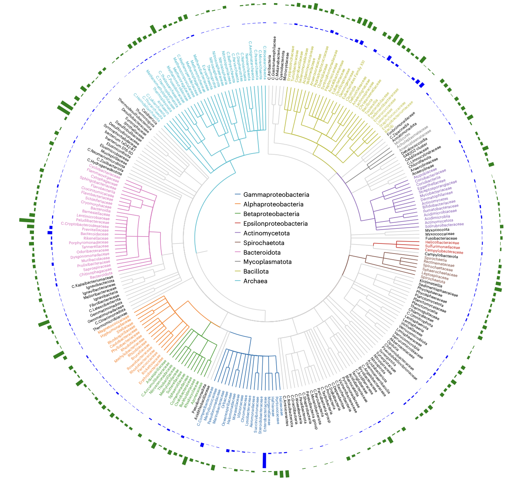
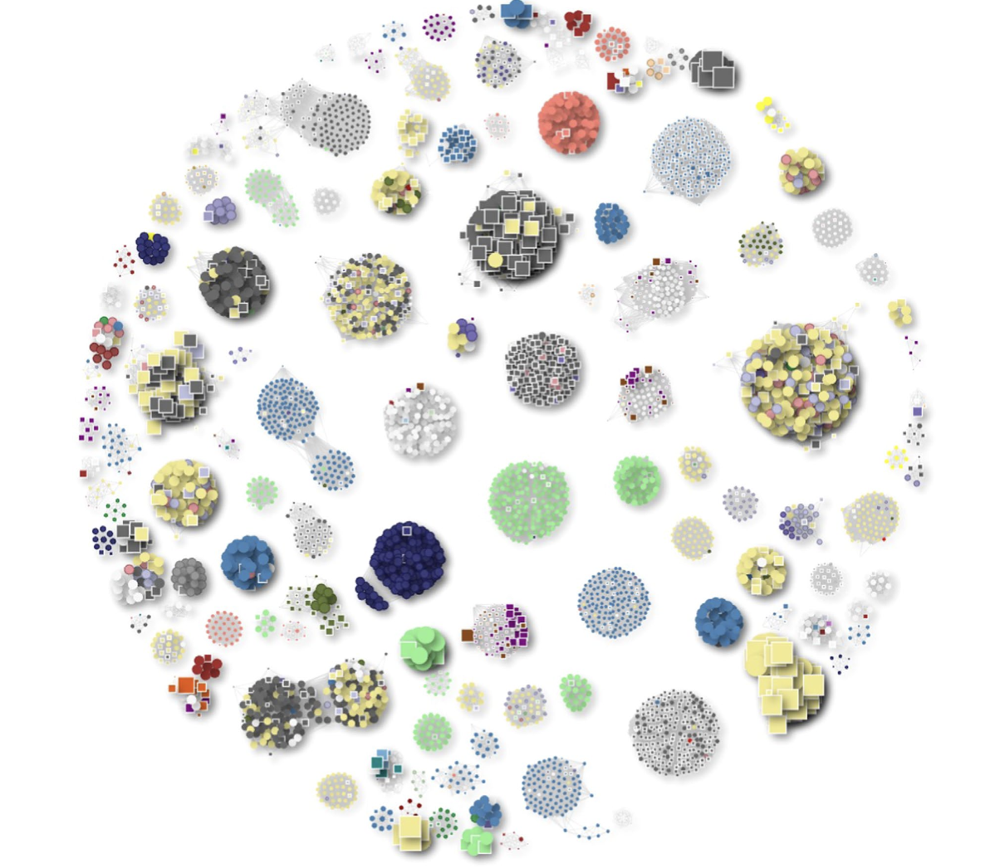
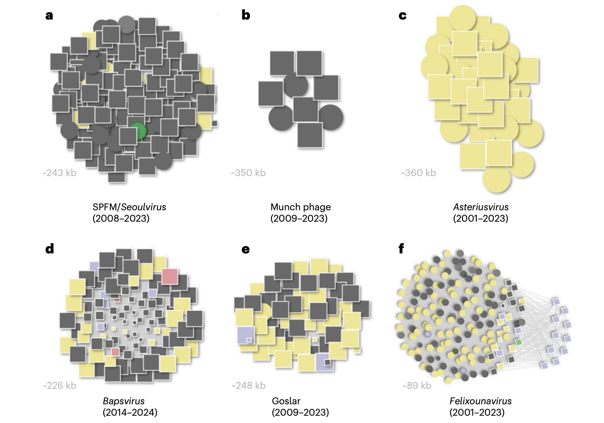
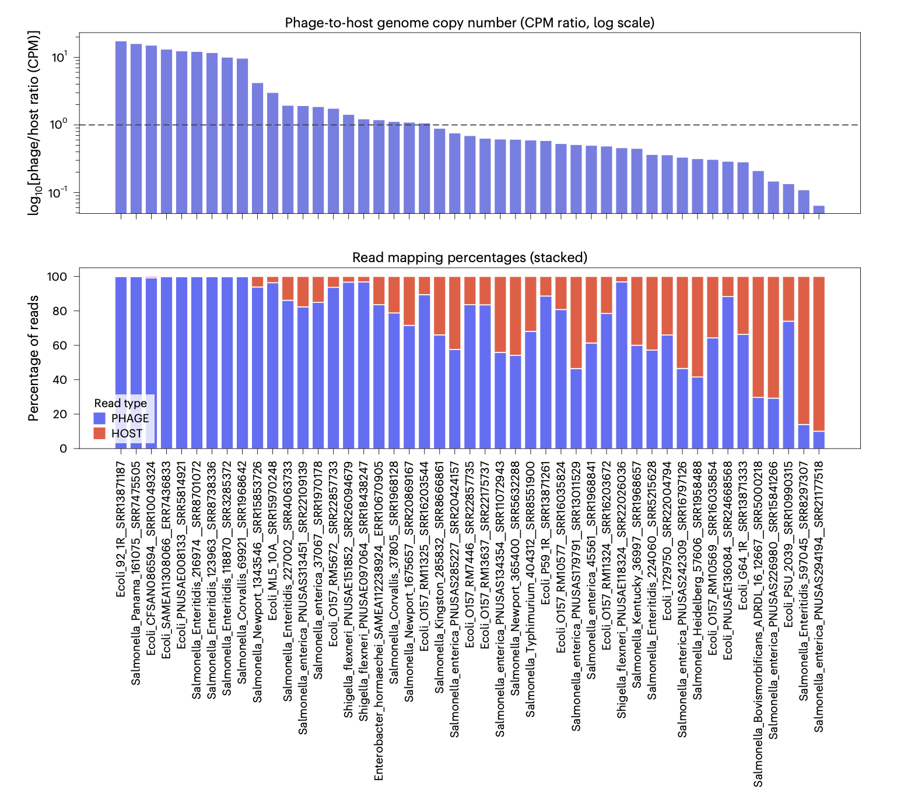
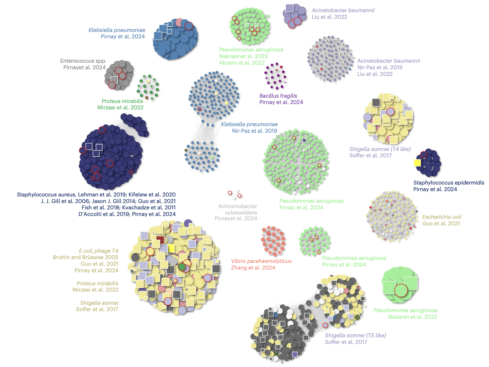
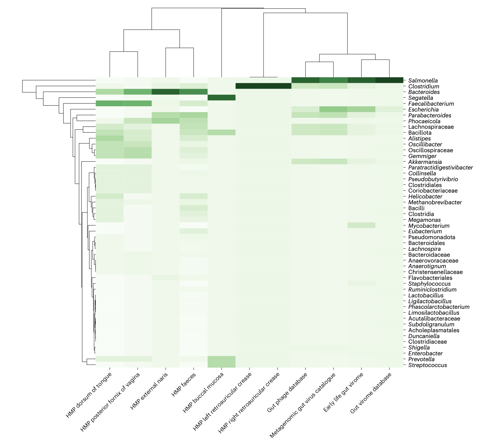

来自Nature Microbiology 的一篇文章，研究人员通过分析来自1,226种细菌的360万个基因组组装，意外发现了119,510个完整的裂解噬菌体基因组，这些被称为细菌组装相关噬菌体序列（BAPS）。这一发现挑战了传统上认为只有温和噬菌体才能存在于细菌基因组数据中的观点，并揭示了噬菌体生物学中未被探索的持久性状态。

Perfilyev, A., Gæde, A., Hooton, S. et al. Large-scale analysis of bacterial genomes reveals thousands of lytic phages. Nat Microbiol 11, 42–52 (2026). https://doi.org/10.1038/s41564-025-02203-4

## 背景

噬菌体根据其生活方式传统上分为两类：温和噬菌体（能够整合到宿主染色体中形成原噬菌体）和裂解噬菌体（快速复制并杀死宿主）。根据这一二元框架，细菌基因组测序数据中预期仅包含温和噬菌体，因为裂解噬菌体在感染过程中会消灭宿主细胞，从而不应在测序样本中留存。然而，越来越多的证据表明，噬菌体与宿主之间的相互作用存在连续性，包括载体状态和伪溶原性等中间状态。这些状态可能在营养限制、低宿主密度或宿主防御机制抑制噬菌体复制等亚优条件下出现。尽管以往认为这些状态罕见且仅限于温和噬菌体，但近期研究提示，即使是强毒力噬菌体也可能采取类似持久性策略，在条件允许时才进入裂解性感染。

## 方法

为识别细菌基因组组装中的完整裂解噬菌体序列（BAPS），研究人员开发了一套综合生物信息学流程。该流程基于NCBI的RefSeq数据库，筛选并分析了360万个细菌基因组组装。初步过滤后，对长度超过5,000 bp的contig进行噬菌体可能性预测。研究人员开发了机器学习工具Phager，该工具基于生物学特征（如基因组成和序列特征）而非序列相似性来评估contig是否为噬菌体基因组，从而能够识别高度分化或未被充分代表的噬菌体。通过该流程，从细菌组装中提取了350万个推定噬菌体来源的contig。

这些contig随后与参考数据库进行比对，以区分细菌、质粒或噬菌体序列。最终，通过筛选整合酶、转座酶等溶原性标记，并保留编码大亚基终止酶（terL）的contig，鉴定出119,510个裂解噬菌体、146,575个温和噬菌体及602,285个质粒。噬菌体序列进一步基于平均核苷酸一致性（ANI）进行聚类，以区分裂解和温和类型。

## 结果

### BAPS的分布与宿主范围

BAPS contig在细菌基因组序列中的分布广泛。通过将每个BAPS的细菌宿主映射到系统发育树，发现裂解噬菌体基因组存在于多种来源的细菌组装中。相关元数据证实，含有BAPS的细菌分离自人类、动物、食品、临床和环境样本，涵盖水生、陆地、废水和工业环境，且收集自全球多个地理区域。

在细菌类群中，Gammaproteobacteria含有最高数量的BAPS（占总数的33%，39,755/119,510），这主要反映了Enterobacteriaceae（尤其是大肠杆菌和沙门氏菌）在公共数据集中的过度代表。BAPS在Bacillota门中也较为常见（占25%）。多个临床重要的革兰氏阳性菌科（如葡萄球菌科、链球菌科、肠球菌科和梭菌科）均含有一定比例的BAPS。此外，即使在测序努力有限的环境类群（如Alphaproteobacteria中的玫瑰杆菌科和醋酸杆菌科）中也检测到BAPS，表明该现象跨越多种生态背景。

### 巨型噬菌体类群的扩展

研究重点关注了Enterobacteriaceae中的BAPS，特别是在沙门氏菌和大肠杆菌中鉴定了六个不同的裂解巨型噬菌体谱系。其中，Seoulvirus（属于Chimalliviridae科）是最大的BAPS簇，研究人员鉴定了300多个先前未描述的Seoulvirus基因组（239–242 kb），使其已知多样性扩展了一个数量级以上。这些噬菌体是特征明确的裂解病毒，具有抗沙门氏菌的治疗潜力。

此外，研究还发现了一个新的巨型噬菌体属，命名为Bapvirus，包含247个BAPS基因组（约220–249 kb）。尽管与Seoulvirus的序列相似性较低（ANI 15–40%），但它们保持保守的基因组结构和同线性。系统遗传学分析支持将Bapvirus归类为Chimalliviridae科中的一个独立属。

其他扩展的噬菌体属包括Munchvirus（与已知噬菌体Munch相关的巨型噬菌体，数量增长三倍）、Asteriusvirus（感染大肠杆菌的巨型噬菌体，从少数基因组扩展到189个BAPS）以及Felixounavirus（114个BAPS contig，已知具有沙门氏菌生物防治潜力）。

### Goslarvirus的丰度变异

针对孤儿噬菌体Goslarvirus（此前仅有一个代表成员），研究人员通过BAPS流程鉴定了237个匹配的contig。这些contig是一组全球分布的推定裂解噬菌体，感染致病性革兰氏阴性Enterobacteriaceae，从水、人类、牛、猪、鸡和倭黑猩猩等多种环境和宿主中回收。通过读段映射分析55个代表性组装，发现噬菌体与宿主基因组的读段比例存在显著变异：在某些样本中，Goslarvirus读段占主导（如沙门氏菌Newport 134356中99.2%的读段映射到噬菌体基因组），而在其他样本中噬菌体序列比例极低（如沙门氏菌enterica PNUSA中仅0.6%）。这种变异可能反映了感染动态、污染或DNA提取方案的差异。

### BAPS的治疗与微生物组相关性

研究人员评估了66个已公开基因组的治疗用裂解噬菌体与BAPS数据集的关系。其中55个（83%）至少与一个BAPS contig匹配（Mash距离≤0.2），39个（59%）具有高度相似的对应序列（Mash距离≤0.05）。这些治疗用噬菌体包括针对大肠杆菌的T4噬菌体、志贺氏菌的Mosigiviruses和Tequatroviruses、铜绿假单胞菌的多个噬菌体簇以及用于治疗金黄色葡萄球菌感染的噬菌体。BAPS中治疗相关噬菌体的存在表明，这些噬菌体在自然细菌动态中是人类和动物暴露的一部分，支持其安全性。

此外，在人类微生物组数据集（如MGV、GPD、ELGV、GVDv1和HMP）中检测到近2,000个BAPS contig，大多数匹配的contig具有高ANI（>96%）。多个BAPS噬菌体在多个目录中一致出现，支持其在人类微生物组中的生态相关性。

## 讨论

细菌组装中存在完整裂解噬菌体基因组挑战了长期以来的假设，即此类数据集中仅保留温和噬菌体。传统的观点认为，与细菌染色体一同检测到的噬菌体是原噬菌体，其处于潜伏状态且可能被诱导。而本研究鉴定的裂解噬菌体基因组并未整合，而是在同一基因组项目中与细菌contig一同组装。研究人员排除了污染或测序伪影的可能性，因为相同的噬菌体类型出现在独立的测序中心和地理区域，且大多数组装来自纯化分离物的单克隆群体。因此，最简明的解释是这些裂解噬菌体可能在细菌细胞内或与细胞相关持久存在而不整合或裂解，反映了受宿主防御或环境条件影响的更广泛载体样状态。

BAPS数据集为了解Chimalliviridae科中巨型噬菌体的生物学和进化提供了具体见解。这些噬菌体构建chimallin蛋白的核样壳以保护其DNA免受宿主防御系统攻击，并可能通过微管蛋白样PhuZ丝定位。PhuZ并非Chimalliviridae噬菌体的核心组分，其中一些已丢失编码该蛋白的基因。本研究极大地扩展了Chimalliviridae内的噬菌体数量，特别是在Seoulvirus属中，并鉴定了新的Bapvirus属（同样缺乏phuZ同源物）。这些组中的噬菌体在细菌组装中常见，表明它们可能进入允许持久存在而不破坏宿主的载体样状态。

裂解噬菌体在细菌基因组中的发现对噬菌体治疗具有意义。已知治疗用噬菌体在细菌分离物中的存在表明它们自然发生，并可能已成为人类或环境微生物群的一部分，支持其安全性和生态兼容性。许多BAPS噬菌体与临床试验中已测试的噬菌体相同或密切相关，这表明细菌菌株本身或合成的BAPS可能提供先前未描述的治疗用噬菌体来源。裂解噬菌体在载体样状态中的持久性可能对治疗反直觉，但为了解何时以及为何发生生产性复制或被抑制提供了机会。

## 结论

本研究通过大规模分析细菌基因组组装，揭示了超过10万个完整裂解噬菌体基因组的存在，这些BAPS显著扩展了已知噬菌体的多样性，并挑战了噬菌体生活方式的传统二分法。研究发现表明，裂解噬菌体可能通过持久性状态与细菌基因组共存，这为理解噬菌体-宿主相互作用提供了新的视角。此外，BAPS中治疗相关噬菌体的存在支持其自然发生和安全性，为噬菌体治疗资源的开发提供了宝贵资源。未来的研究需要进一步探索裂解噬菌体如何在不整合的情况下与细菌基因组关联，识别促进持久性的宿主和环境因素，并评估其对细菌进化和生理的影响。
