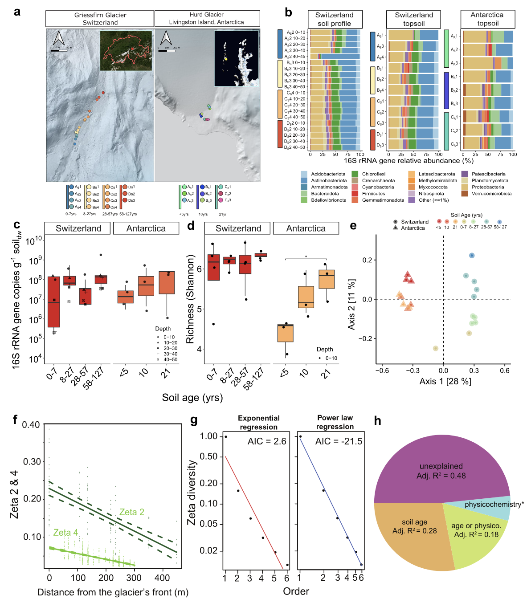
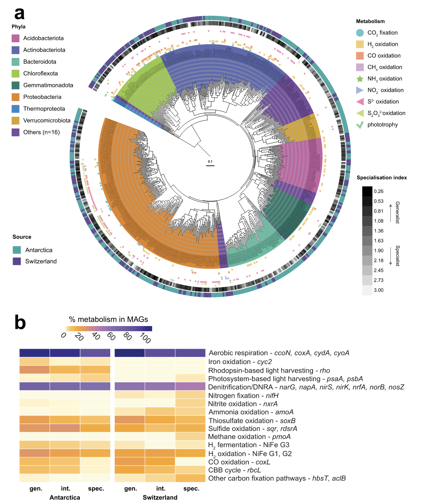
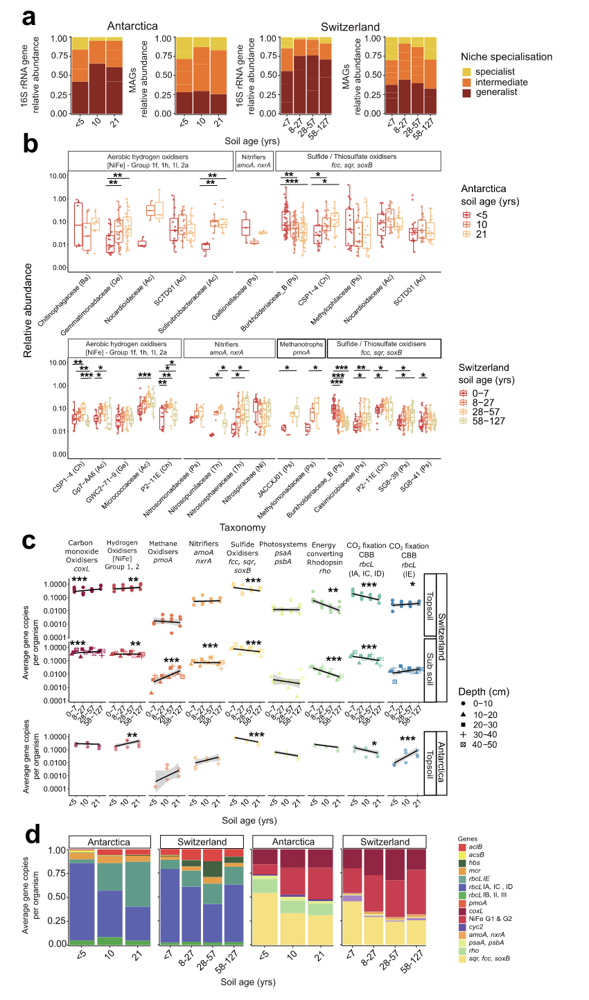
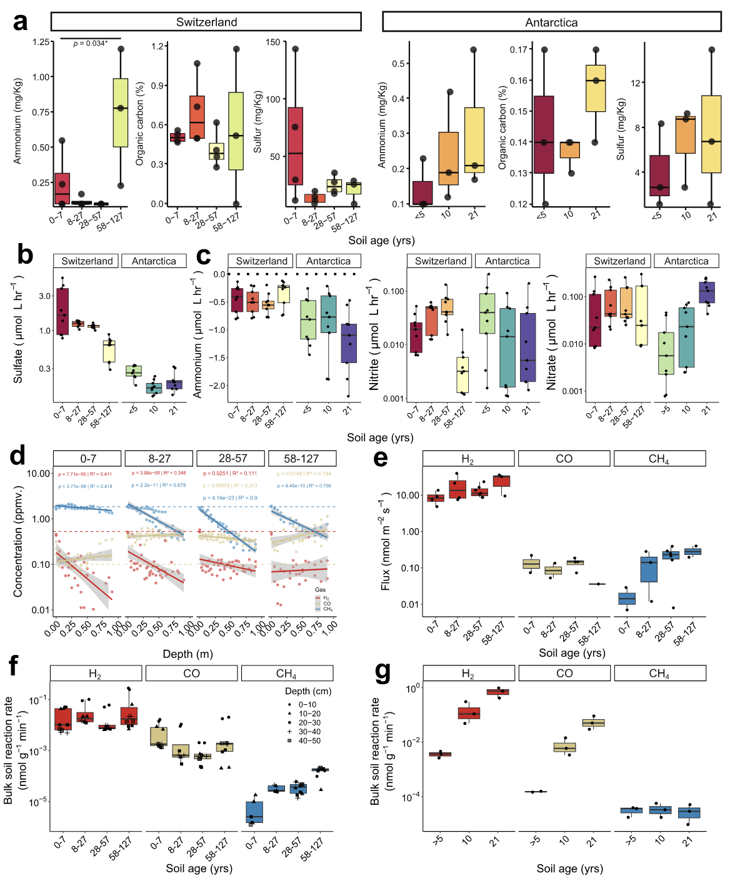

## 摘要

Ricci, F., Bay, S.K., Nauer, P.A. et al. Metabolically flexible microorganisms rapidly establish glacial foreland ecosystems. Nat Commun 16, 11634 (2025). https://doi.org/10.1038/s41467-025-66734-4

生态学核心问题之一是新的生态系统如何形成。这篇研究通过整合定量生态学、宏基因组学和生物地球化学测量，揭示了南极海洋性冰川和瑞士高山冰川前缘微生物定植的功能基础。研究发现，栖息地generalist和机会种在两条冰川前缘快速定植，并沿土壤年代序列持续存在。这些微生物是代谢灵活的化能营养好氧菌，能够利用有机和无机化合物（包括大气痕量气体和硫底物）获取能量和碳，从而克服贫营养条件。它们与代谢受限的后期定植 specialist（如蓝细菌、氨氧化古菌、专性捕食和共生细菌）共存。对589个物种水平宏基因组组装基因组（MAG）的分析表明，早期定植与代谢灵活性密切相关。野外和实验室生物地球化学测量证实，代谢灵活微生物的活动在冰川前缘迅速启动。这些发现表明，冰川前缘土壤的初级演替是由自给自足的代谢灵活性细菌驱动的，它们介导化能合成初级生产，并为后续定植创造了更适宜的环境。

## 背景

几乎没有预先存在生命的环境可作为天然实验室，用于理解复杂群落如何建立和繁衍。先锋微生物（即初级定植者）建立此类系统，发挥初级生产、养分循环、风化和解毒等关键作用，从而提高可居住性并支持多种物种的次级定植。一旦微生物群落建立，隐花植物、维管植物和动物有时可以定植。随着时间的推移，微生物群落的组装受随机性（包括通过空气和水流的扩散）和确定性（包括生物和非生物因素的选择）过程相互作用的控制。由于先锋生态系统通常受碳和能量限制，初级生产者尤为重要。因此，大多数经典研究集中在光合微生物，如蓝细菌。初级生产者还包括化能合成微生物，它们利用岩屑底物（如NH₄⁺、Fe²⁺、S²⁻）和痕量气体（如H₂、CO、CH₄）驱动有氧呼吸和碳固定。虽然光合微生物常受光照和水可用性的代谢限制，但许多化能合成微生物具有高度灵活性，例如根据波动环境条件和资源可用性交替使用无机和有机底物，因此可能更好地耐受许多先锋生态系统的严酷多变条件。大气营养（即利用大气痕量气体驱动有氧呼吸和碳固定）的发现表明，大气可能是微生物先锋的可靠能量供应，使它们在生态系统建立期间能够持续进行初级生产。迄今为止，多项研究调查了微生物群落在定植和演替过程中的组成变化和生态动态，但使微生物能够定植的功能特征和生物地球化学过程仍未解决。

冰川前缘是研究生态系统形成的理想系统。随着人为全球变暖加速的陆地冰川退缩产生的前缘逐渐被定植。这些前缘的初级演替可通过年代序列方法（假设空间替代时间）进行研究，其中远离退缩冰川前缘的地点代表增加的土壤年龄。最近冰退的土地对微生物定植者是严酷环境，通常具有低有机碳和氮、高辐射和大幅温度波动的特点，这对定植施加了强大的选择压力。这些压力在生命边缘地带（如南极大陆）可能尤为极端。在此类系统中，早期定植过程涉及在生存物理化学压力和利用可用资源之间进行权衡。初始定植者可能来自各种来源：例如，冰栖微生物可以在冰退土壤中持续存在，而其他微生物可以通过空气或水流传输。无论其起源如何，选定的微生物迅速定植并介导新暴露土壤中的生物地球化学循环，促进次级定植。先前研究已开始使用宏基因组学深入了解支持微生物定植的功能策略。例如，它们表明初级定植者通过多种策略克服前缘的氮限制，包括同化无机氮、降解有机氮化合物和固氮。虽然某些生物地球化学过程在年代序列中保守，但后期演替阶段可能导致其他代谢的出现，如硝化。尽管有这些新兴知识基础，我们对驱动微生物定植和后续演替的生态动态、功能特征和生物地球化学活动之间的关系，包括先锋微生物的代谢广度和不同初级生产策略的作用，仍缺乏统一理解。

最初为植物群落发展的生态理论提供了检验定植和演替动态的定量框架。一个核心理论是，栖息地generalist（即能够耐受广泛环境条件和资源可用性的生物）是早期定植者，而 specialist 类群（即表现出较窄栖息地偏好和更严格资源需求的生物）通常在演替期间增加。这一概念与基于特征的框架一起，提供了从功能角度检验微生物初级演替的基线。然而，需要注意的是，微生物通常表现出比植物和动物更大的代谢灵活性，许多能够同时（混合营养）或交替使用多种碳和能源。大多数还能在资源限制下通过持续利用痕量气体或阳光（通过视紫红质和光系统）收集能量来满足能量需求，同时处于休眠或缓慢生长状态。因此，微生物群落可能不遵循经典宏观生态演替动态，因为其高度灵活性可能从早期到晚期演替阶段提供生态优势。考虑到这些因素，研究人员假设冰川前缘的主要先锋将是代谢灵活的细菌，它们通过利用大气痕量气体保存能量和固定碳来克服营养限制。

## 方法

本研究通过整合基因和基因组中心宏基因组学、生物地球化学测量和生态理论，提供了对两个冰川前缘定植的群落和功能动态的系统级理解。研究重点放在两个对比地点：南极利文斯顿岛赫德冰川（偏远的海洋性冰川，终止于南大洋）和瑞士格里斯菲尔恩冰川（高山冰川）。研究人员对地表前缘土壤进行了采样，覆盖了自冰退以来21年（南极）和127年（瑞士）的年代序列，并对瑞士土壤进行了深度剖面（0至50厘米）采样。地球化学分析显示前缘土壤具有低有机碳和氮、低盐度和碱性pH值。因此，正如预期，这些新冰退土壤是高度贫营养的，尤其是南极地点，因此对微生物定植具有挑战性。然而，复杂的微生物群落甚至栖息在最远冰退的土壤中。研究设计不允许追踪存在微生物的起源，但潜在来源包括雪和空气传播、冰川融水输送和沉积，以及冰退暴露的冰下微生物。通过定量PCR测量微生物丰度（16S rRNA基因拷贝数）显示，沿瑞士和南极年代序列，每克干土的基因拷贝数增加了两个数量级。类似地，微生物丰富度沿年代序列增加，南极土壤从最近冰退到更成熟土壤显示出最显著增加。两个地点的微生物组成（基于β多样性排序）不同，地点位置和土壤年龄具有强分化。定植后，研究人员在演替后期观察到群落相似性增加，这与先前在南极前缘的观察一致。这些模式表明前缘微生物群落可能响应共同的演替动态。

两个冰川前缘的群落以常见土壤门为主，尤其是变形菌门和放线菌门，这与先前对退缩冰川的研究一致。这在更细分辨率上也有所反映，变形菌门和放线菌门占两个地点最丰富和最广泛ASV的三分之二和一半。瑞士样品还包含两个高丰度古菌ASV，隶属于已知含有嗜冷氨氧化菌的硝化球菌科。还检测到多样的光合蓝细菌，涵盖147个ASV，但它们在两个前缘的相对丰度较低；一个例外是一个瑞士表土，其中来自丝状属Tychonema的单个ASV占群落的2.6%，表明这些栖息地 specialist 可以在某些已建立的土壤中繁盛。一致地，来自蓝细菌和微藻类的叶绿素a在两个冰川的前缘最小，但随土壤年龄逐渐增加。类似地，一些甲烷氧化菌存在但占据率低。南极前缘还具有高但可变水平的专性捕食菌Bdellovibrionota和专性共生菌Patescibacteria，这支持了先前在南极土壤中的观察。为了证实这些推断，研究人员计算了每个属的专业化指数，基于其相对丰度在样品中的变异系数。这证实了具有广泛占据度的栖息地generalist与具有狭窄分布的栖息地 specialist 以及具有中间专业化的类群共存。

使用Zeta多样性来理解沿瑞士冰川前缘的群落更替模式和驱动因素。这种新的基于发生率的指标比较了多个地点之间共享的平均分类单元数量，随着地点数量（Zeta下降）或距离（Zeta衰减）增加。Zeta多样性以中等速率下降，两个地点之间共享ASV平均为23%，四个地点之间为6.6%，双向比较的距离衰减系数比四向比较高阈值。这些Zeta多样性和栖息地专业化计算表明，栖息这些前缘的大多数微生物是经历快速更替的栖息地 specialist，但与许多栖息地generalist共存，这些generalist在样带上持续存在且比例过高。此外，Zeta下降最符合幂律回归，表明确定性而非随机因素主要驱动了采样时这些地点的组成。变异分配分析表明群落更替强烈受土壤年龄、土壤物理化学以及这些因素的相互作用驱动。总体，这些发现表明两个冰川前缘通过确定性过程被微生物快速连续定植，可能与冰川退缩过程中的养分负荷、微生物相互作用和土壤稳定等因素有关。

## 结果

### 微生物快速且确定性地定植前缘年代序列

微生物丰度沿年代序列显著增加，南极和瑞士地点每克干土的16S rRNA基因拷贝数增加了两个数量级。微生物丰富度也随年代序列增加，南极土壤从最近冰退到更成熟土壤显示出最显著增加。微生物组成在两个地点间差异显著，并受土壤年龄强烈影响。定植后，群落相似性在演替后期增加，表明共同的演替动态。群落以变形菌门和放线菌门为主，同时存在低丰度的蓝细菌、甲烷氧化菌、专性捕食和共生细菌。Zeta多样性分析表明，大多数微生物是栖息地 specialist，但与持续存在的generalist共存。群落更替主要受确定性因素驱动，尤其是土壤年龄和物理化学性质。

### 代谢灵活性微生物驱动冰川前缘定植

从南极和瑞士冰川前缘分别组装了367和222个物种水平的MAG，涵盖了17和19个门，平均捕获了33%和10%的读长。基于读长映射到表土宏基因组计算每个MAG的专业化指数，将MAG分类为栖息地generalist或 specialist。MAG分类与基于扩增子的分类基本一致，清晰区分了栖息地generalist和 specialist。generalistMAG比 specialist MAG编码更多基因和签名代谢基因，支持代谢灵活性增强生态位宽度从而促进微生物栖息地通用性的假设。

基于MAG的代谢注释表明，两个前缘主要受能量而非氧化剂和氮供应限制。几乎所有细菌MAG预测介导使用有机化合物作为电子供体和氧气作为电子受体的呼吸，大部分群落还能够进行一个或多个反硝化步骤。微生物还有能力从无机和一碳化合物输入电子，包括硫化物、硫代硫酸盐、氨、亚硝酸盐、铁，以及大气痕量气体氢气、一氧化碳和甲烷。约8%的MAG预测介导碳固定，主要使用化能合成谱系的RuBisCO，表明许多是自给自足的初级生产者，使用大气气体和岩屑底物的电子增加系统有机碳库。尽管产氧光合作用能力最小，但8%的MAG预测通过使用视紫红质或光系统II收集光进行光异养生长。只有四个MAG编码固氮酶，表明这些土壤更受碳限制而非氮限制。

栖息地generalist和 specialist 在两个冰川的能量和碳获取策略上不同。例如，通过卡尔文-本森-巴沙姆循环进行碳固定的RuBisCO基因在栖息地generalist中丰富4.5倍，且几乎完全与化能合成细菌相关。这些RuBisCO编码generalist中，54%、37%和29%能够氧化硫化合物、大气H₂和大气CO。与 specialist 相比，generalist MAG氧化无机化合物的能力大大增强，尤其是CO（26倍），以及H₂、硫化物、硫代硫酸盐、铁和基于视紫红质的光收集。这与栖息地generalist是代谢灵活、通常自给自足的微生物，具有持续收集能量和介导化能合成能力的假设一致。相反，光合作用、甲烷氧化和硝化基因主要由代谢受限的栖息地 specialist 编码。

### 生态和功能不同的微生物随土壤年龄在丰度上变化

基于扩增子和宏基因组数据，研究人员绘制了栖息地generalist和 specialist 随土壤年龄的相对分布。虽然generalist和 specialist 的绝对丰度在演替期间增加，但它们的相对比例发生变化。基于扩增子数据集，栖息地generalist在所有样品中丰富，但在初始暴露土壤中形成群落的较低比例，并在所有其他土壤中占主导地位。对于MAG数据，栖息地 specialist 在初始定植期间最富集。这些观察与初始假设相反，因为预计栖息地generalist驱动初始定植，而栖息地 specialist 在最老土壤中最占优势。虽然在最老土壤中观察到栖息地 specialist 的相对丰度略有增加，但它们的比例在最年轻土壤中总体最高。然而，这些观察仍与更广泛的宏观生态理论一致：根据对Grime理论的最近修改，早期定植的 specialist 可能是机会主义者，通过利用冰退期间释放的可用资源适应新环境，但在后期演替阶段被耐压generalist和后期定植 specialist（包括竞争者）竞争排除。

这些预测得到特定类群随年龄变化的分析支持。变形菌门栖息地 specialist 主导新暴露土壤，例如，一个Methylotenera MAG和一个SURF-13 MAG在南极最早土壤中占群落的1.9%和1.5%，但在更成熟土壤中占群落不到0.1%。这些类群在早期土壤中也定量更丰富。在瑞士土壤中观察到类似模式，来自多个伯克霍尔德菌科属的MAG在最早土壤中丰富，但在最老土壤中最小或未检测到。重要的是，这些机会性初级定植者仍然代谢灵活，能够使用岩屑底物和通常大气氢气支持岩石异养和有时岩石自养生长。后期定植的栖息地 specialist，例如氨氧化菌和上述甲烷氧化菌，显示相反趋势并填补其他定植者未利用的代谢生态位。相比之下，主导的栖息地generalist也存在，但通常相对丰度适度增加，绝对丰度在每个年代序列中大幅增加；这些趋势对于最丰富的放线菌门和绿弯菌门谱系尤为显著，每个预测为代谢灵活。

前缘演替期间generalist与 specialist 分布的这种转变也反映在能量和碳获取基因的差异上。基于使用宏基因组短读长的群落范围分析，栖息前缘的大多数微生物细胞能够使用无机电子供体，包括硫化物、H₂、CO和/或铵，具有相当大的基于视紫红质的光收集和碳固定能力。与主要由机会性早期定植者编码一致，能够进行硫化物氧化的群落比例随土壤年龄强烈一致下降，而氢化酶和CO脱氢酶随土壤年龄适度增加，这与它们主要与耐压栖息地generalist相关一致。视紫红质和光系统基因也随土壤年龄下降，表明光收集可能适应初始定植，尽管这是比岩石营养更不常见的策略。碳固定途径随土壤年龄在两个前缘发生变化。典型化学岩石自养生物的RuBisCO谱系在两个前缘最早土壤年龄中占主导，并且基于基因组解析分析，主要由硫化物氧化变形菌门和代谢灵活绿弯菌门编码。相反，典型大气营养生物的IE型RuBisCO完全由多样放线菌门MAG编码，并在更建立的土壤中占主导。随机森林分析强调，自冰退以来的土壤年龄是这些基因分布的关键驱动因素，尤其是硫化物氧化，符合该过程在贫碳土壤早期定植中的关键作用，以及其他因素如pH和养分浓度。使用瑞士样品，研究人员还检查了代谢基因水平随土壤深度的变化；虽然岩屑和气态能源预测在整个土壤剖面中重要，但正如预期，光养基因下降，厌氧代谢基因随深度大幅增加。

### 前缘微生物群落在定植期间氧化大气和岩屑底物

基于土壤物理化学分析，铵、硫化合物和有机碳以足够量存在，支持高亲和力先锋微生物的岩石营养和有机营养生长；这些化合物水平低，尤其是在南极前缘，除了最靠近瑞士高山冰川的富硫土壤，先前研究表明硫化合物由于冰川风化和融水输送而积累。与这些观察一致，瑞士和南极土壤在好氧微宇宙测定中氧化硫化物；速率在靠近冰川前缘的土壤中最高，符合其富含硫化物氧化变形菌门和瑞士地点升高的底物可用性。反映冰川前缘存在高亲和力硝化菌，微宇宙实验证实铵在好氧条件下被前缘群落氧化成亚硝酸盐和硝酸盐。铵氧化成硝酸盐在整个瑞士前缘以相似速率发生，符合存在能够进行完全硝化的硝化螺菌科栖息地generalist。相比之下，亚硝酸盐在早期南极土壤的微宇宙中积累，但在后期土壤中转化为硝酸盐，符合宏基因组预测，即亚硝酸盐氧化和完全硝化细菌与演替后期相关。这些发现共同表明，岩屑能源被前缘微生物用于支持好氧呼吸和可能初级生产，硫化物氧化可能作为初始定植的特别重要驱动因素。

为了检验大气痕量气体对生态系统建立关键的假设，研究人员还分析了瑞士土壤中痕量气体的原位水平和通量（物流限制阻止了南极土壤的等效分析）。H₂、CO和CH₄在土壤-大气界面以典型大气平均混合比存在，并在1米深度以可变水平存在；多种因素影响这些气体的原位水平，包括土壤中的气体交换和扩散速率、生物消耗以及非生物和生物生产过程，尽管H₂和CH₄的急剧深度相关下降表明被氢营养型和甲烷营养型消耗。一致地，整个前缘年代序列的原位H₂消耗速率增加，从早期到晚期冰退土壤平均增加3倍，符合基因和基因组中心数据。相比之下，CH₄吸收在后期演替阶段建立，从早期到晚期冰退土壤平均增加17倍，支持先前测量和观察到的甲烷氧化菌及其标记基因分布。与先前对有机土壤的调查一样，尽管CO脱氢酶广泛分布和高离体CO氧化活性，研究人员未观察到CO水平或通量的清晰趋势，通量室内的非生物生产可能掩盖趋势。这些发现支持痕量气体在这些贫营养环境中是重要能源，H₂氧化作为早期建立的、generalist相关特征出现，而CH₄氧化作为后期建立的、 specialist 相关特征。

为了帮助解决大气痕量气体在多大程度上支持前缘发展，研究人员使用离体微宇宙测量了瑞士和南极样品中的氧化。总体，瑞士和南极土壤在痕量气体消耗中显示不同趋势，瑞士冰川的氧化速率通常随土壤深度下降。对于瑞士样品，CH₄氧化随土壤年龄大幅增加，而H₂和CO氧化在整个年代序列以一致速率发生。相比之下，南极土壤的氧化速率随土壤年龄增加，部分由演替期间H₂和CO氧化剂绝对丰度增加驱动。尽管先前研究表明前缘可以是甲烷的汇，但这是这些群落中H₂和CO吸收的首个证据。基于这些结果，研究人员调查了微生物群落是否可以依赖H₂、CO和CH₄满足其能量需求。为此，使用热力学模型计算基于每克干土检测的痕量气体氧化剂数量，从块体痕量气体氧化可产生的每个细胞功率。虽然速率在气体和地点间变化，但每个细胞的平均功率在支持群落中所有细胞维持的范围内。对于某些细胞，从痕量气体氧化衍生的功率足以支持混合营养或大气营养生长。总之，这些发现表明痕量气体在支持新陆地生态系统的定植和后续发展中具有主要作用。

## 讨论

尽管地理位置和物理化学性质不同，南极海洋和瑞士高山冰川前缘的初级定植者在功能能力上非常相似。最丰富和活跃的生态系统工程师似乎是多才多艺的化能合成细菌，而非光合微生物，它们通过氧化大气和岩屑底物克服能量限制。这些发现突出了代谢灵活性在塑造新生态系统定植和演替中的核心作用。一方面，代谢灵活性为机会主义 specialist 提供了快速利用冰川退缩释放的各种资源的能力。另一方面，这种灵活性也为栖息地generalist提供了适应生态系统发展不同阶段发生的广泛物理、化学和生物变化的能力。在两个冰川中，广泛选择了同时或交替使用有机、岩屑和大气电子供体的微生物。类似动态似乎影响栖息两个前缘的微生物的定量生态、代谢能力和生物地球化学活动。关键差异包括南极年代序列上微生物丰度和多样性的更显著增加，以及光养在南极土壤中和氨基和硫基岩石营养在瑞士土壤中可能更强的作用。这些发现的收敛表明冰川前缘的微生物群落组装主要不是随机的，而是确定性的，生态和过程建模也支持这一点。沿冰川年代序列的物理化学条件和生物相互作用之间的动态相互作用导致群落的环境过滤，转变 specialist-generalist动态以使代谢多才多艺的栖息地generalist与更受限的栖息地 specialist 共存。一致地，研究人员观察到随时间增加组成稳定性，这也在其他已建立的冰川前缘微生物群落中观察到。

除了加深对初级演替生态动态的认识外，通过应用宏观生态理论到微生物系统，本研究还揭示大气痕量气体氧化是微生物建立新生态系统的重要但先前被忽视的手段。这通过广泛宏基因组、通量和活性测量以及理论模型得到确认。研究人员还提供了代谢灵活性与微生物栖息地通用性相关的首个定量证据。需要注意的是，虽然栖息地通用性是一个连续分布，但本研究主要关注该分布的上四分位数和下四分位数；未来研究应通过应用连续分析或更细百分位数分类探索跨全通用性谱系的微生物分布和能力。此外，虽然研究人员在两个 不同冰川前缘观察到类似发现，但这些发现在多大程度上预测其他前缘的定植，以及其他生态系统（如火山土壤、陨石、火后恢复）中的初级和次级演替，尚不清楚。未来工作还需要解缠微生物来源以及初始定植期间扩散与选择的相互作用。然而，考虑到当前全球冰川消退的前所未有速度和前缘扩张，这些发现是及时的。定植和演替最早阶段的微生物动态对这些环境的最终命运至关重要，因为它们发展成充满生物多样性并驱动全球相关生物地球化学循环的动态生态系统。
