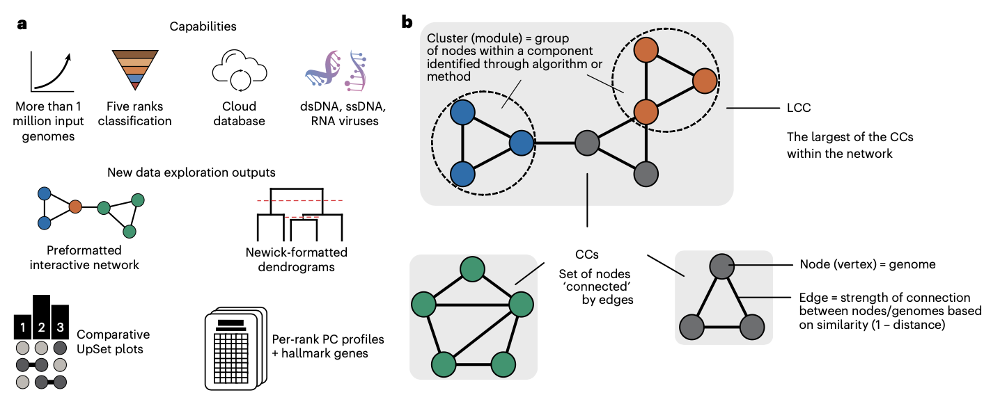
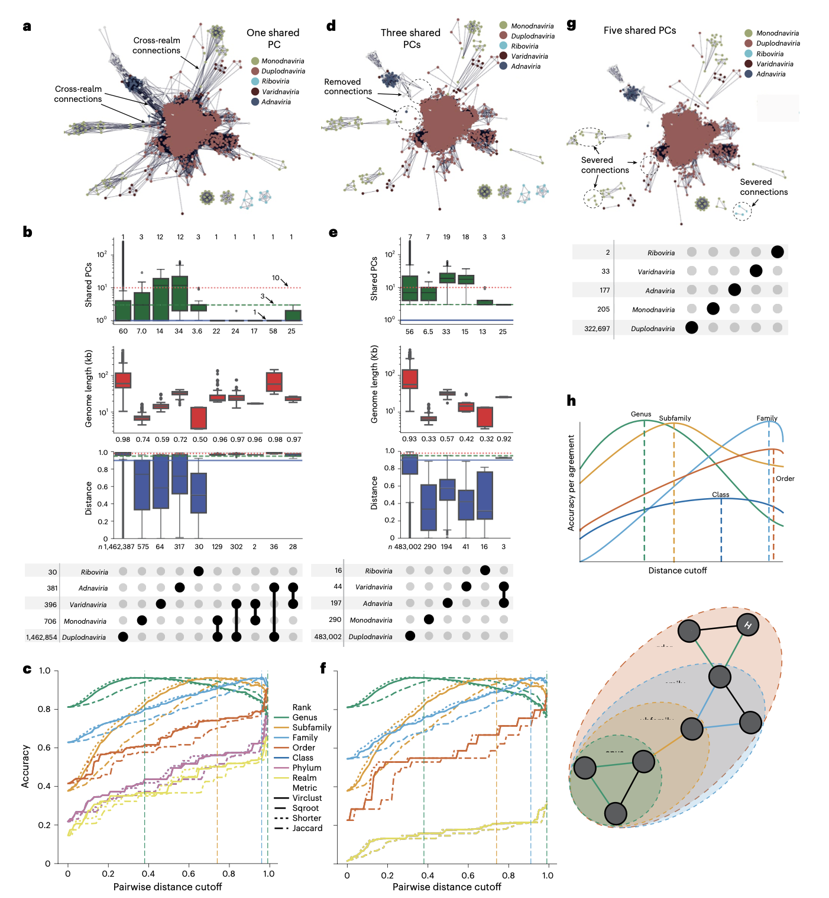
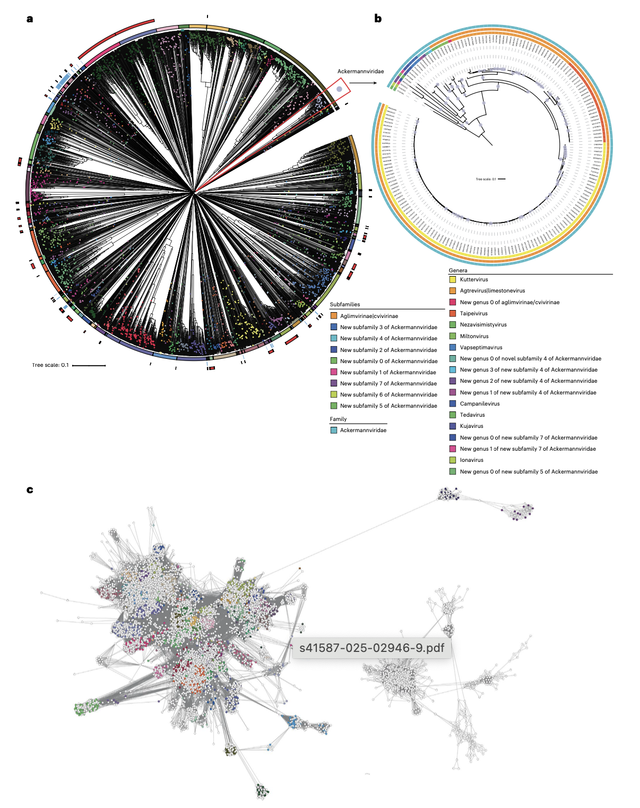
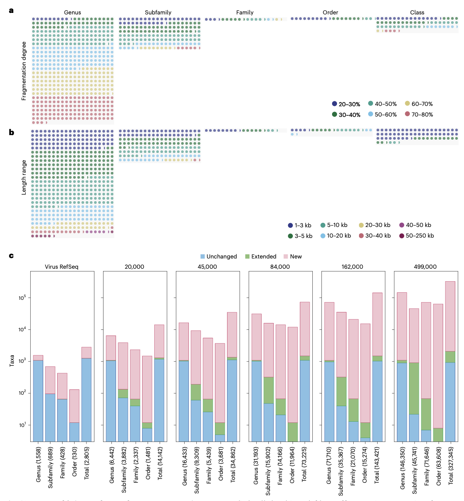

## Introduction

vConTACT3是病毒基因组聚类和分类分配工具的最新版本，代表了病毒分类学领域的重大突破。该工具通过整合基因共享网络拓扑结构与自适应距离优化，实现了从属到目级别的准确层次分类。研究团队通过分析超过6000万种参数组合，为六个病毒领域和三个宿主域优化了特定领域的分类阈值，使vConTACT3在已知病毒分类中达到95%以上的准确率。



该工具不仅能准确分类已知病毒，还能为先前未鉴定的病毒创建新的分类单元，解决了现代病毒发现研究中基因组碎片化带来的挑战。vConTACT3的应用已为数万个未分类分类单元提供了快速、自动和系统的分类分配，显著推动了病毒分类学的发展。

## 文章介绍

### 研究背景与问题陈述

病毒生态基因组学的快速发展极大地扩展了我们对病毒圈的认识，但现有的分类工具缺乏足够的分辨率，无法扩展到现代发现型数据集或分类先前未知的序列空间。国际病毒分类委员会（ICTV）最近提供了15个分类等级，但目前没有全球性的调查评估这些数据在多大程度上支持这种15级结构的需求。

当前病毒分类面临三个主要挑战：不同病毒领域的进化速率差异导致无法使用单一划分标准；分类等级应用不一致；以及现有工具无法系统创建新分类单元来处理未知病毒序列空间。虽然存在一些基于标志基因或蛋白质家族的分类工具，但它们大多依赖于参考基因组，无法创建新的分类单元。

### 研究方法与技术路线

vConTACT3完全重新设计了之前的vConTACT流程，主要改进包括：

1. **网络拓扑优化**：移除了产生属级簇的ClusterONE算法，将簇扩展到网络中的最大连接组件（LCC）
2. **自适应距离优化**：通过分析6000万种参数组合，为不同病毒领域和宿主域确定最佳分类阈值
3. **多层次分类**：实现了从属到目级别的层次分类，覆盖四个官方认可的病毒领域

研究团队使用NCBI RefSeq数据库中的约20,000个基因组，涵盖六个病毒领域和三个宿主域，评估了八种病毒分类等级的分类准确性。通过四种距离度量、八种蛋白质聚类同一性、100个成对距离截断值和25个不同最小共享基因值的组合，全面优化了领域和等级特定的截断值。


### 主要发现与创新点



vConTACT3在多个方面表现出色：

**分类准确性**：对11,318个原核病毒基因组的评估显示，在属、亚科、科、目、纲和门等级的平均准确率分别为97.6%、98.7%、100%、100%、90.6%和90.6%。对13,524个真核病毒基因组的评估也显示出类似的高准确率。

**跨领域分类能力**：vConTACT3成功扩展到了Duplodnaviria、Monodnaviria、Adnaviria和Varidnaviria四个病毒领域，超越了之前仅限于尾状dsDNA噬菌体的限制。

**基因组碎片处理**：通过体外碎片化实验证明，vConTACT3能够正确将部分基因组片段放置到适当的分类等级中，其中65.8%的片段能够准确分类到属级。

### 研究意义与贡献

vConTACT3的推出标志着病毒分类学进入了一个新阶段。该工具不仅能够准确复制已知病毒的ICTV分类，还能识别需要修订的分类截断区域，并为从已知病毒推断到当前未知的病毒圈广阔区域提供了统计基础的系统框架。



与ICTV成员共同开发的vConTACT3已被证明是系统形式化分类提案的基础，有助于阐明病毒圈中具有挑战性区域的关系，并自动为公共数据库中数万个未充分分类的病毒提供多等级分类分配。



## 使用教程

### 安装方法

- **Python版本**：3.10或更高版本（低于3.12）
- **操作系统**：Linux x86_64、Apple Intel Macs（Apple Silicon需特殊处理）
- **依赖工具**：MMSeqs2（独立安装）
- **内存要求**：根据数据集大小调整，大型数据集建议16GB以上


**方法一：使用Bioconda/Mamba创建新环境（推荐）**
```bash
# 创建新环境
mamba create --name vcontact3 python=3.10
mamba activate vcontact3
mamba install -c bioconda vcontact3
```

**方法二：在基础环境中安装**
```bash
# 确保基础环境Python版本符合要求
mamba install -c bioconda vcontact3
```

**方法三：使用pip从源码安装**
```bash
git clone https://bitbucket.org/MAVERICLab/vcontact3.git
cd vcontact3
python -m pip install .
```

**方法四：使用requirements文件安装**
```bash
git clone https://bitbucket.org/MAVERICLab/vcontact3.git
cd vcontact3
mamba install -c bioconda --file requirements.txt
pip install .
```

**MMSeqs2安装**：
由于MMSeqs2不在PyPi中，需要单独安装：
- Linux：按照官方说明安装系统版本
- Apple Silicon：下载OSX-universal二进制文件并添加到$PATH

**ANI功能支持**（v3.1.0+）：
```bash
pip install vclust
```

#### 数据库准备

vConTACT3需要参考数据库执行分类任务：

```bash
# 查看可用数据库版本
vcontact3 prepare_databases --list-versions

# 下载最新数据库到指定目录
vcontact3 prepare_databases --get-version latest --set-location ./db
```

这个我服务器下载的挺慢的，还是在自己电脑下载了再传上去吧，比如<https://zenodo.org/records/10035619>下载v220版本，只需要在运行时制定路径即可：`-d v220/`

### 输入文件格式

vConTACT3支持两种输入模式：

**1. 核苷酸序列模式（推荐）**
- 输入：FASTA格式的核苷酸文件（.fna）
- 工具自动进行基因预测

**2. 蛋白质序列模式**
- 输入：FASTA格式的蛋白质文件（.faa）
- 需要额外提供映射文件：
  - `--gene2genome`：蛋白质ID到基因组ID的TSV映射
  - `--len-nucleotide`：基因组ID到核苷酸长度的TSV映射

### 基本运行命令

**标准运行（使用默认参数）**：
```bash
vcontact3 run --nucleotide genomes.fna --output results_dir
```

**指定数据库版本**：
```bash
vcontact3 run --nucleotide genomes.fna --output results_dir \
    --db-domain "prokaryotes" \
    --db-version 228 \
    --db-path /path/to/download/location
```

#### 核心参数说明

| 参数 | 说明 | 默认值 |
|------|------|--------|
| `--nucleotide` | 输入核苷酸FASTA文件路径 | 必需 |
| `--output` | 输出目录路径 | `vConTACT3_results/` |
| `--threads` | 使用的CPU核心数 | 所有可用核心 |
| `--db-domain` | 指定域：archaea, bacteria, prokaryotes, eukaryotes | prokaryotes |
| `--db-version` | 数据库版本号 | 最新版本 |
| `--db-path` | 数据库文件或目录路径 | 自动下载最新 |

### 进阶应用

#### 大规模数据集优化

**内存优化配置**：
```bash
vcontact3 run --nucleotide large_dataset.fna \
    --output optimized_results \
    --threads 16 \
    --reduce-memory \
    --breaks 5
```

**多层级分类分析**：
```bash
vcontact3 run --nucleotide diverse_genomes.fna \
    --output multi_level_results \
    --db-domain "prokaryotes" \
    --target-rank order family genus \
    --target-members 3
```

#### 特定病毒领域分析

**真核病毒分析**：
```bash
vcontact3 run --nucleotide eukaryotic_viruses.fna \
    --output eukaryote_results \
    --db-domain "eukaryotes"
```

**古菌病毒分析**：
```bash
vcontact3 run --nucleotide archaeal_viruses.fna \
    --output archaea_results \
    --db-domain "archaea"
```

#### 高级输出配置

**网络可视化导出**：
```bash
vcontact3 run --nucleotide genomes.fna \
    --output visualization_results \
    --exports graphml cytoscape d3js \
    --breaks 3
```

**蛋白质簇分析**：
```bash
vcontact3 run --nucleotide genomes.fna \
    --output profile_results \
    --exports profiles \
    --target-rank family genus \
    --target-members 2
```

### 输出结果解读

#### 主要输出文件

**1. 分类分配文件** (`final_assignments.csv`)
- 包含每个基因组的预测分类信息
- 基因组统计信息（长度、蛋白质数量）
- 参考分类与预测分类对比

**文件结构示例**：
```csv
Genome,GenomeName,Reference,Size_Kb,realm_reference,realm_prediction,...,genus_reference,genus_prediction
genome_001,environmental genome HF-0,False,10.5,np.nan,Duplodnaviria,...,np.nan,Herellevirus
```

**2. 性能指标文件** (`performance_metrics.csv`)
- 各病毒领域和分类等级的准确率指标
- 聚类质量评估指标

**3. 网络文件** (`networks/`目录)
- GraphML、Cytoscape、D3js等格式的网络文件
- 用于可视化基因共享网络

**4. 蛋白质簇谱** (`pc_profiles/`目录)
- 基因组×蛋白质簇的存在/缺失矩阵
- SVG热图和CSV表格文件

#### 目录结构
```
vConTACT3_results/
├── final_assignments.csv
├── performance_metrics.csv
├── networks/
│   ├── part1.graphml
│   ├── part1.cyjs
│   ├── part1.d3.json
│   └── *.cosmo_data.csv
└── pc_profiles/
    ├── rank_family-name.csv
    └── rank_family-name.svg
```

### 常见问题与解决方案

#### 安装问题

**问题1：Apple Silicon安装失败**
```
错误信息：'/usr/bin/clang' failed with exit code 1
```
**解决方案**：
```bash
pip3 install --upgrade pip
python3 -m pip install --upgrade setuptools
# 或使用Rosetta终端
```

**问题2：TreeStyle导入错误**
```
ModuleNotFoundError: No module named 'TreeStyle'
```
**解决方案**：
```bash
python -m pip install PyQt5
```

#### 运行问题

**问题3：内存不足**
**解决方案**：
```bash
# 使用内存优化模式
vcontact3 run --reduce-memory --nucleotide genomes.fna --output results_dir

# 增加物理内存或使用高性能计算节点
# 大型数据集建议32GB+内存
```

**问题4：运行结果不一致**
**描述**：重复运行相同数据集得到略有不同的结果

**原因**：MMSeqs2聚类的非确定性特性

**说明**：虽然具体分类名称可能变化，但基因组间的分类关系保持一致

**问题5：D3js导出缓慢**
**解决方案**：
```bash
vcontact3 run --breaks 5 --nucleotide genomes.fna --output results_dir --exports d3js
```

#### 数据库问题

**问题6：数据库路径错误**
**解决方案**：
```bash
# 验证数据库路径
vcontact3 prepare_databases --list-versions
vcontact3 prepare_databases --get-version latest --set-location ./correct_db_path

# 运行指定数据库路径
vcontact3 run --nucleotide genomes.fna --db-path ./correct_db_path --output results_dir
```

#### 性能优化建议

**大型数据集处理**：
- 使用`--breaks`参数分割大型网络
- 增加`--threads`数量充分利用多核CPU
- 在高性能计算节点上运行

**内存管理**：
- 监控内存使用情况，适时使用`--reduce-memory`
- 避免同时运行多个内存密集型任务

## References
1. Bolduc, B., Zablocki, O., Turner, D. et al. Machine learning enables scalable and systematic hierarchical virus taxonomy. Nat Biotechnol (2025). https://doi.org/10.1038/s41587-025-02946-9
2. https://vcontact3.readthedocs.io/en/latest
