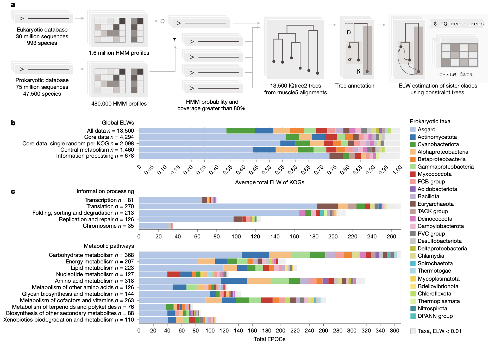
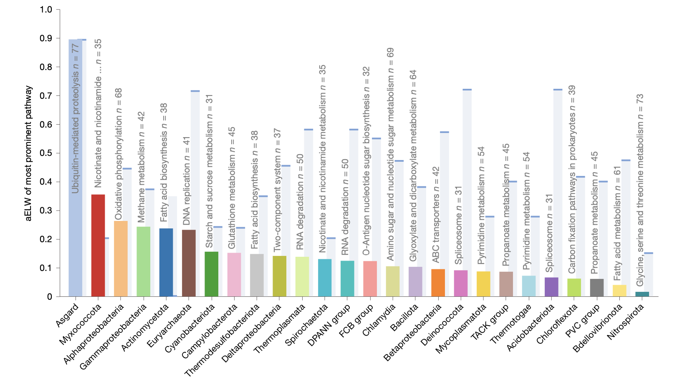
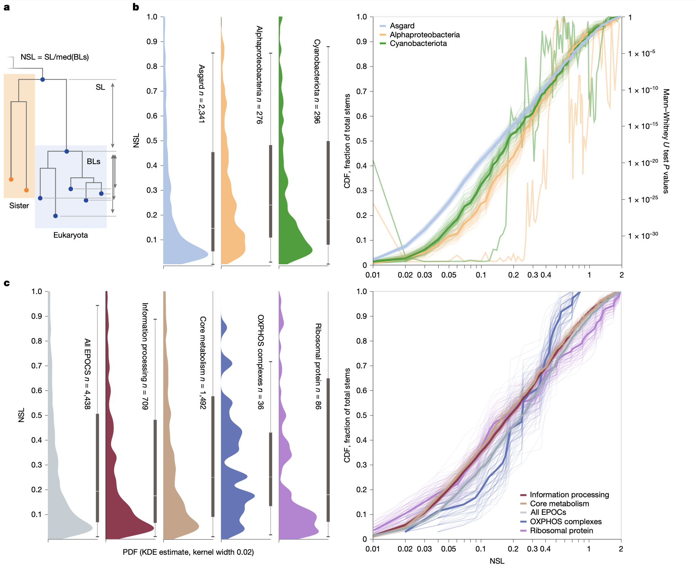
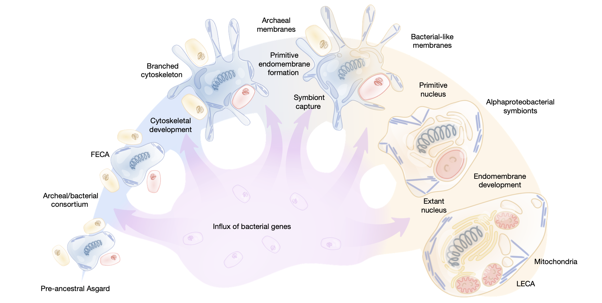

## Introduction

真核细胞的起源是进化生物学的关键问题之一。研究证实，最后一个真核生物共同祖先（LECA）已经拥有线粒体——一种源自α-变形菌的内共生细胞器，而阿斯加德古菌（目前归类为Promethearchaeota门）的发现则为了解真核生物的演化提供了重要线索。

Tobiasson, V., Luo, J., Wolf, Y.I. et al. Dominant contribution of Asgard archaea to eukaryogenesis. Nature (2026). https://doi.org/10.1038/s41586-025-09960-6

这篇最新的Nature文章在严格的统计框架内，通过系统发育树进行进化假设检验，全面分析了追溯至LECA的核心真核基因的起源。结果显示，阿斯加德古菌对大多数保守真核功能系统和通路的起源做出了主要贡献。α-变形菌的贡献有限，主要涉及能量转化系统和铁硫簇生物合成，而其他细菌门类的祖先贡献则分散在真核功能谱中，没有清晰一致的规律。这些发现支持了一个真核生物起源模型：真核细胞组织的关键特征在通向LECA的阿斯加德谱系中演化，随后捕获了α-变形菌内共生体，并在内共生事件前后通过从其他细菌中大量但零散地水平获取基因而得到补充。

## 背景

真核细胞因其复杂的组织结构而与古菌和细菌（统称原核生物）截然不同。这种组织复杂性的标志性特征包括其同名的细胞核、内膜系统、精细的细胞骨架以及从α-变形菌内共生体演化而来的能量转化细胞器——线粒体。早期的真核生物起源模型设想了一个无线粒体的原始真核生物，其在演化相对晚期阶段捕获并驯化了α-变形菌。然而，后续研究并未发现初生的无线粒体真核生物，尽管许多真核生物次生性地丢失了线粒体。因此，LECA很可能已经同时拥有线粒体和其他真核细胞组织的标志性特征。这些发现为线粒体内共生触发了细胞重组从而产生真核细胞复杂性的演化场景提供了支持。

系统基因组学分析表明，可追溯至LECA的真核核心基因是源自古菌和多种细菌的混合体，并且在早期研究中，细菌来源的基因在数量上超过了古菌来源的基因。古菌来源的基因主要存在于信息处理系统（复制、转录和翻译）中，而明显细菌来源的基因则构成了真核基因组的操作组成部分，特别是编码代谢酶。对阿斯加德古菌（目前为Promethearchaeota界下的Promethearchaeota门）的发现和研究彻底改变了真核生物起源的研究领域，阿斯加德古菌包含了已知最接近真核生物的古菌亲属。保守基因的系统发育分析不断将真核生物的分支推向阿斯加德古菌系统树的更深处。最新的此类分析将阿斯加德古菌纲Heimdallarchaeia目内的Hodarchaeales目确定为真核生物的可能姐妹群。随着阿斯加德古菌序列数据的持续涌入，真核生物在阿斯加德古菌内的确切亲缘关系仍然是一个移动的目标。值得注意的是，阿斯加德古菌编码、表达和使用除核心信息处理组件之外的多种真核生物标志蛋白的同源物，特别是细胞骨架蛋白和参与膜重塑的蛋白。此外，这些阿斯加德古菌基因在LECA之前经历了广泛的复制和亚功能化，表明它们在真核生物起源中扮演了重要角色。

## 结果

### 真核蛋白质的起源

考虑到覆盖3950个独特KOG的所有13,500个EPOC的ELW值的全局分布，单一最大的平均ELW（aELW，此处称为“关联”）是与阿斯加德古菌的关联。在较低水平上检测到与蓝藻菌、放线菌门、β-变形菌纲和α-变形菌纲的进一步关联，以及与许多其他细菌群的微量关联。由于分析的范围、MSA质量和系统树拓扑结构的多样性在EPOC间存在差异，部分EPOC对所有支系均显示较低的ELW值，表明这些情况下的数据不足以分辨其真核生物祖先。排除这些最大ELW < 0.4的低质量EPOC，得到了一个覆盖2100个KOG的4290个EPOC的稳健核心集，提高了结果的可靠性。该核心集涵盖了广泛的信息处理系统、普遍存在的代谢途径和转运蛋白，以及调控和看家蛋白。将分析限制在这些具有广泛分类学覆盖度的、分配良好的真核生物家族中，增加了全局的阿斯加德古菌关联，其在超过4000个独特数据点（覆盖2000个独特KOG）中占据了所有似然权重的50%。

为了确保这些结果基于稳健的序列簇，研究人员执行了额外的簇退火步骤。简而言之，从初始簇衍生的谱图开始，使用贪心集合覆盖方法对HMM-HMM搜索结果进行聚类。然后，通过为每个簇构建系统发育树并识别共享短成对距离的叶节点集（表明存在独立的支系）来进一步划分这些超簇。这些退火后的支系随后用于EPOC构建。此外，研究人员使用基因组分类数据库（GTDB）分类学重建了完整数据集，以验证检测到的真核-原核关联未因使用NCBI分类学而受到实质性影响。尽管由于分类学标签的重映射（例如，β-变形菌纲并入γ-变形菌纲）或更严格的退火EPOC定义限制了数据范围，特定分类群的相对贡献有所变化，但阿斯加德古菌与真核生物主导关联的关键观察结果在不同的聚类、分类学和真核生物范围定义下均保持独立。由于强烈的阿斯加德古菌关联在数据的两种表征中都很明显，所有后续分析均基于上述核心EPOC集。

平均共享KEGG本体论的EPOC的ELW分数，揭示了阿斯加德古菌与核糖体、RNA和DNA聚合酶、Ras样GTP酶，以及泛素介导的蛋白质降解和蛋白酶体等其他功能系统和通路的强烈关联。这些发现验证并扩展了先前的观察结果，将阿斯加德古菌关联扩展到核心代谢网络的大部分。相比之下，显著的α-变形菌关联相对有限，主要包括参与氧化磷酸化和Fe-S簇生物合成的蛋白质，在线粒体代谢途径中的关联较弱。因此，研究人员观察到阿斯加德古菌与真核生物在不同生物学功能和通路之间的整体关联远比之前描述的更强，尽管真核核心代谢与广泛细菌门类之间的关联在累积上仍然相当可观。还观察到蓝藻菌（质体的已知内共生体）对LECA后真核生物的巨大影响具有显著关联。然而，驱动这种蓝藻关联的途径与叶绿体的光合作用能力无关，而是表现出与几种代谢途径的广泛关联，没有明显的趋势，类似于对其他细菌分类群的观察。因此，研究人员得出结论，这种蓝藻信号很可能源于前LECA事件，并与后来叶绿体的贡献不同。

### 真核生物起源中的阿斯加德古菌主导性
与阿斯加德古菌对真核生物起源的主要贡献一致，研究人员观察到阿斯加德古菌蛋白质与多种细胞功能存在一致且强烈的关联。在先前的工作中，最强的阿斯加德古菌痕迹被注意到遍布信息处理系统，与DNA和RNA处理以及蛋白质表达、运输和信号传导存在明确的蛋白质关联。在此，研究人员确认并扩展了阿斯加德古菌与基因组复制和转录的关联，并进一步检测到阿斯加德古菌在核苷酸切除修复、错配修复和同源重组中的显著痕迹。其他众所周知的关联，如核糖体蛋白，被扩展到包括翻译因子、共翻译插入机制的组件、蛋白质靶向和氨酰-tRNA生物合成。因此，所有参与信息处理的核心真核生物蛋白质组似乎几乎完全源自阿斯加德古菌。

研究人员进一步检测到阿斯加德古菌的关联远远超出了信息处理系统，包括阿斯加德古菌对参与核质运输以及下游蛋白质分选、糖基化和靶向的蛋白质机器的显著贡献。内质网相关的N-连接聚糖生物合成和转移，包括胞质和腔内的单糖基转移酶，以及寡糖转移酶复合体的核心，都与阿斯加德古菌密切相关。高尔基体中与糖基化成熟相关的酶未在我们的核心数据中回收，可能是因为真核生物中结构域的广泛多样化限制了它们的分类学范围和LECA中的明显存在。真核生物糖基化机制的阿斯加德连接进一步包括糖基磷脂酰肌醇（GPI）锚的合成，这些锚在翻译后将靶向蛋白锚定在膜上，此处被明确检测为阿斯加德来源。研究人员还检测到负责启动GPI锚合成的七亚基（UDP-GlcNAc）转移（GPI-GnT）-单糖基转移酶复合体以及GPI锚成熟所需组件的阿斯加德起源，以及转酰胺酶复合体和负责将蛋白质转移到成熟GPI锚上的因子。

对于真核生物起源具有首要重要性的是细菌型脂质生物合成途径的来源，因为所有涉及古菌宿主的二元共生发生场景都需要膜从古菌脂质向细菌脂质的转变。尽管观察到阿斯加德古菌与整体代谢网络的大部分存在关联，但与脂肪酸合成和降解相关的途径显示出广泛的aELW值分布，表明其镶嵌性高于平均水平。由于在核心数据中对最可能的祖先强制执行最小ELW为0.4，这种镶嵌性被解释为单独的、各自可能的祖先，跨途径内的EPOC进行平均，而不是组成EPOC的普遍不确定性。全局aELW值支持这些途径的阿斯加德起源，但也观察到与放线菌门和α-变形菌纲的关联。然而，在相邻的内质网定位的鞘脂代谢途径（真核生物中一类重要的衍生质膜脂质）中观察到更高的阿斯加德aELW。先前的研究强调了该途径在细菌和真核生物中可能的趋同起源，但此处研究人员检测到其与阿斯加德古菌的全局关联。进一步值得注意的是内质网相关的甲羟戊酸途径，将乙酰辅酶A转化为甲羟戊酸并进一步转化为法尼基和二磷酸香叶酯，研究人员也发现其与阿斯加德古菌相关。在真核生物中，甲羟戊酸是类异戊二烯合成所必需的，而类异戊二烯又是甾醇、类胡萝卜素和萜类化合物的前体单位，由甲羟戊酸途径在内质网腔中合成。在古菌中，类异戊二烯是醚连接膜脂质的前体，因此与膜生物发生密切相关。总之，研究人员在广泛的细胞功能和代谢途径中检测到阿斯加德关联，并注意到古菌脂质合成与真核生物类固醇前体代谢之间的关系。在涉及细菌脂质生物合成的途径中检测到明显较弱的阿斯加德信号，表明其具有复杂的进化历史。

### 特定的α-变形菌痕迹
与线粒体在真核生物能量代谢中的核心作用一致，并且正如最近对中心碳代谢的报道，研究人员观察到α-变形菌与线粒体定位的代谢途径之间存在主要的明确关联。除了线粒体翻译系统的组件外，最显著的α-变形菌关联体现在参与氧化磷酸化和相关醌合成的复合体中。在这些核心能量转化功能之外，研究人员仅检测到稀疏的贡献。铁硫簇（ISC）生物合成途径的核心组件是α-变形菌来源的，因此，研究人员发现4Fe-4S ISCA平台，以及IBA57和Fe-S簇结合铁氧还蛋白-1和2，与α-变形菌相关。然而，2Fe-2S前体支架ISCU显示出与多种原核生物（包括α-变形菌）的镶嵌关联，以及较弱但清晰可检测的阿斯加德关联。此外，半胱氨酸NFS1和上游含硫氨基酸（半胱氨酸和蛋氨酸）生物合成途径是阿斯加德相关的。因此，α-变形菌与Fe-S合成的关联主要局限于4Fe-4S的合成及其整合到氧化磷酸化复合体中。在线粒体之外，α-变形菌与Fe-S代谢的关联停止。在这里，ISC插入依赖于胞质靶向复合体CIA，该复合体由CIAO1、CIAO2B和MMS19组成。对于CIA组件CIAO1和CIAO2B，研究人员观察到与阿斯加德的明确关联，而MMS19未在数据中检测到。总之，这些观察结果表明，α-变形菌对真核生物起源的贡献主要集中在与线粒体相关的功能上。

### 来自其他细菌的稀疏贡献

尽管分析大大扩展了阿斯加德古菌对真核生物起源的贡献，并揭示了有限但一致的α-变形菌关联，但也检测到了其他细菌的贡献。对于某些生物学功能，这种“多样化”的细菌成分占了aELW的大部分，并且大约三分之一的KOG（2100个中的600个）和EPOC（4290个中的1580个）分析显示其最强关联既不是阿斯加德古菌也不是α-变形菌。然而，与α-变形菌和氧化磷酸化及Fe-S代谢之间有限但功能相关的关联形成鲜明对比的是，与多样化细菌相关的EPOC显示出很少的功能趋势，反而在大多数代谢功能中表现出低水平的关联。尽管蓝藻菌和放线菌门与α-变形菌相比表现出更强的全局aELW，但这种关联源于跨不连续途径的几个小贡献，而不是特定的功能相关贡献。为了强调这一趋势，在多样化的细菌分类群中，只有α-变形菌和粘球菌门与包含超过20个EPOC且aELW大于阿斯加德古菌的KEGG途径相关。具体而言，氧化磷酸化显示出最强的α-变形菌关联。对于粘球菌门，最强的关联是烟酸代谢途径。然而，这些与核苷酸相关的关联似乎仅限于作用于核苷糖的磷酸酶和磷酸核糖基转移酶，特别是5'和3'核苷酸酶，并且在功能范围上比α-变形菌关联的途径有限得多。先前的研究强调了粘球菌门与真核生物中类固醇生物合成的联系。在此，研究人员观察到粘球菌门与二萜类生物合成（甲羟戊酸途径的下游和类固醇合成的上游）存在清晰但狭窄的关联，尽管对分类学范围的标准限制了核心数据中下游类固醇途径的表征。

尽管在途径水平上观察到与多样化细菌的特定关联很少，但个体蛋白质家族可能存在显著关联的可能性仍然存在。为了评估这一点，研究人员考虑了核心EPOC的一个更严格的子集，要求真核生物外群包含至少15个分类学支系以确保功能中心性，并要求原核生物姐妹分类群具有至少20个序列且ELW > 0.7以确保强关联。在满足这些标准的130个独特EPOC中，有33个被发现与多样化的细菌谱系相关，主要是放线菌门和FCB群细菌。其余97个EPOC被发现是阿斯加德来源的。具有显著细菌起源的33个EPOC涵盖了广泛的细胞功能，从主要促进子超家族转运蛋白到脂肪酶，再到核心糖代谢和心磷脂合成的组件。再次，研究人员观察到这些细菌贡献没有明确的功能趋势。因此，尽管单个蛋白质关联各自显著，但似乎没有任何途径是从任何单一细菌分类群衍生而来的。相反，研究人员将这些与多样化细菌的弥散关联解释为几种细菌贡献的迹象，每种贡献的功能范围有限，可能源于孤立的HGT事件而非额外的内共生。

### 祖先茎干长度分析

研究人员尝试使用系统树茎干长度分析来推断核心真核基因的获取时间，最初由Pittis和Gabaldon实施，以线粒体作为测试案例。由于LECA之后经过的时间对所有基因都是相同的，有人提出基因树中的相对茎干长度与从原核生物供体获取基因到LECA所经过的时间成正比。使用这种方法，Pittis和Gabaldon发现α-变形菌来源的蛋白质的茎干明显短于古菌来源的蛋白质，这与真核生物起源的“线粒体晚获”场景一致。原始茎干长度定义为从第一个真核生物共同祖先（FECA）（由真核生物和最可能的原核生物姐妹门的最后共同祖先代表）到LECA的距离。为了解释进化速率的差异，该原始茎干长度通过除以从LECA到单个真核生物叶子的中位分支长度进行归一化。

在整个数据集的真核生物茎干长度集合（5850个茎干）中，研究人员观察到一个广泛的分布，其尖锐的最大值接近0.05，高度 reminiscent of previous findings。在分析中，短于0.3的α-变形菌茎干（占所有茎干的70%）显著长于阿斯加德起源的茎干，但长于0.35的α-变形菌茎干反而平均短于阿斯加德茎干，显示出一种不明显但可重复且具有统计学意义的关系。蓝藻菌起源的茎干遵循类似但较弱的趋势。因此，尽管α-变形菌来源基因具有全局较短茎干长度的观察仅适用于长于0.35的茎干，但研究人员有效地重现了Pittis和Gabaldon的发现，他们主要分析了该范围内的茎干。当研究人员将分析限制在核糖体蛋白和氧化磷酸化复合体的组件上，即分别具有众所周知且易于识别的古菌和α-变形菌祖先的基因时，上述趋势得到进一步强化。与将茎干长度作为获取时间度量的概念相反，研究人员观察到假定在线粒体共生发生期间同时获取的氧化磷酸化复合体的归一化茎干长度存在超过两个数量级的方差。总之，这些发现表明，即使归一化的茎干长度也主要由基因获取时间以外的因素决定，至少在此处分析的漫长进化时间尺度上是如此。

跨基因功能类别的茎干长度分布比较提示了对这些观察结果的可能解释。遗传信息处理的茎干短于平均水平，这与这些基因是新生真核生物谱系中存在时间最长的基因的预期相悖。研究人员提出，决定基因相对茎干长度的另一个主要因素可能是获取后为适应新生物环境而必需的进化量。从阿斯加德祖先继承的基因已经预适应了进化中的原始真核生物的细胞环境，而从根本不同的细菌来源获取的基因必须在获取后进行实质性适应，从而增加了它们LECA前茎干的表观长度，这至少部分得到了研究人员对来自多样化细菌的长茎干的普遍观察的支持。

## 讨论

真核生物起源的重建是一个移动的目标，阿斯加德古菌的发现和不断扩展的探索惊人地证明了这一点，它彻底改变了该领域。尽管如此，原核和真核基因组测序的最新进展以及宏基因组学的进步为理解真核生物的系统基因组起源创造了前所未有的机会。在这项工作中，研究人员利用了这种扩展的基因组集合，将其与最大灵敏度的HMM谱图-谱图搜索相结合。然后，在一个专注于使用约束树检验进化假设的统计框架内，对初步映射到LECA的核心真核基因进行了全面的系统发育分析。

许多先前的研究，尤其是早期的研究，证明了核心真核基因集的明显嵌合起源，其中细菌贡献在数量上超过了古菌贡献，后者主要局限于信息处理。阿斯加德古菌的发现和探索通过证明参与各种细胞过程和系统（如膜重塑和细胞骨架）的许多基因具有明显的阿斯加德起源，部分改变了这一观念。事实上，阿斯加德古菌中存在精细的细胞骨架随后已通过实验证明。本研究通过证明追溯至LECA的大多数基因可能具有阿斯加德起源，以及近所有真核细胞功能系统的主要阿斯加德关联，显著扩展了阿斯加德古菌在真核生物祖先中的主导地位。仅在少数代谢途径中，检测到的细菌贡献超过了阿斯加德古菌。最显著的细菌贡献不出所料地来自α-变形菌，并构成了电子传递链、ISC代谢和线粒体翻译系统的核心组件。然而，尽管显著且功能连贯，但与阿斯加德相比，α-变形菌的贡献相对较小，并且值得注意的是几乎完全局限于线粒体功能。其他细菌门的贡献，尽管累积上相当可观，并且在选定的案例中对单个EPOC有强力支持，但未能显示出任何一致的功能趋势，除了粘球菌门与核苷酸、核苷糖和类固醇前体合成之间存在显著但有限的关联。

这些发现与一个真核生物起源场景最为兼容，在该场景中，阿斯加德FECA已经拥有真核细胞的许多标志性特征，包括细胞骨架和内膜系统，正如一些先前模型所假设的那样。在这种场景下，线粒体获取是一个相对较晚的事件，对新兴真核生物的基因组成做出了有限但功能关键的贡献。其他细菌贡献似乎是零散的，可能源于从阿斯加德古菌祖先到LECA的进化路径中从多样化细菌持续但非特异性捕获基因。许多阿斯加德古菌的互养生活方式有利于从细菌大量流入基因，增强了原核基因组嵌合基因组成的一般趋势。大部分细菌基因获取可能发生在原始真核生物谱系出现之前，并且更多发生在从FECA到LECA的路径上。因此，一些核心真核基因，虽然近端从阿斯加德祖先继承，但可能最终是细菌起源的，由阿斯加德古菌携带进入FECA。因此，研究人员没有获得另一个共生事件贡献于真核生物起源的迹象。

真核生物如何获得细菌型膜仍然是一个未解决的问题。尽管研究人员观察到阿斯加德古菌与整体代谢网络的大部分存在关联，但与膜脂生物合成相关的酶的祖先似乎很复杂且可能是镶嵌的，在本分析中仍未解决。然而，相邻系统和途径（如GPI锚、鞘脂和类异戊二烯的合成）的阿斯加德亲和性表明，真核生物脂质生物合成和修饰能力的实质性组成部分是从阿斯加德祖先留存下来的。如果一个古菌细胞是真核细胞进化所依赖的主要支架，那么用细菌膜替换古菌膜一定发生在真核生物起源的早期阶段，通过混合膜阶段进展。具有混合细菌-古菌膜的存活细菌已在实验上被设计出来，尽管通常伴随着显著的适应性下降，证明了这种场景的可能性。膜替换甚至可能早于线粒体内共生，发生在阿斯加德古菌早期捕获参与膜生物发生的细菌酶之后。

理解真核生物起源的一个关键问题是细胞核的起源——真核细胞普遍存在的同名细胞器。分析支持位于细胞核中的信息处理系统几乎完全起源于阿斯加德祖先。然而，鉴于核膜是内质网的延伸，因此是细菌型的，而核孔主要由来源不确定的重复蛋白质组成，作为膜结合区室的细胞核起源仍然是一个未解决的问题，必须与膜替换问题结合解决。

这项工作的结论受到一些注意事项的限制，主要源于已测序古菌和细菌基因组的偏向性和仍然有限的采样。特别是，目前几乎所有可用的阿斯加德古菌基因组都是不完整的宏基因组组装，除了少数几个闭合环状基因组，这不可避免地导致了对阿斯加德古菌对真核生物起源贡献估计的不确定性。这同样适用于α-变形菌，既因为测序偏向性（许多已测序的α-变形菌基因组来自基因组成减少的共生体和寄生虫），也因为线粒体的祖先显然属于当前已知的α-变形菌多样性之外。其他细菌门的采样甚至更严重不足，可能导致低估了它们对真核生物进化的贡献。例如，鉴于有限的基因组信息，很难排除研究人员仅捕获了来自粘球菌门的主要信号的一部分，粘球菌门被提议为真核生物起源的互养场景中的伙伴之一。此外，尽管主导的核心阿斯加德贡献在本工作使用的两种聚类方法下是完全稳健的，但其他分类群的关联性较低，表明一旦这些分类群的基因组集合扩展，结果可能会发生变化。基于泛基因组的方法来排除晚期HGT对祖先推断的影响，可能会忽略来自狭窄或严重采样不足的支系的贡献，并且可能不足以补偿跨多样化真核生物分类群的广泛和持续的HGT。最近的一份初步报告，使用更宽松的核心泛基因组构建标准，提出了比此处观察到的更大的细菌贡献，可能是由于晚期HGT。在未来，扩大原核基因组多样性的采样以及水平转移检测技术的进一步改进可能会对真核生物起源模型进行实质性修改。然而，研究人员认为阿斯加德古菌的主导贡献（这项工作的主要发现）很可能保持不变。

## 方法

### 数据获取与处理
研究人员利用2023年11月从美国国家生物技术信息中心（NCBI）GenBank获取的47,545个完整原核生物基因组，构建了一个包含7500万个原核生物蛋白质序列的数据库（prok2311），并补充了从63个阿斯加德古菌基因组组装中提取的蛋白质。初始真核生物数据库由EukProt v.3中993个物种的3000万个序列组成，并使用mmseqs2进行清理以去除原核生物污染物。为了准确推断LECA中基因的起源，必须排除仅存在于狭窄物种亚群中的基因，这些基因可能源于LECA之后真核生物之间的水平基因转移或谱系特异性丢失。为了避免此类事件影响分析，研究人员为每个指定的原核和真核生物分类学类别重建了“软核心”泛基因组。这些泛基因组仅包含在prok2311中细菌和古菌每个类别至少50%的物种中存在的基因（2070万个），以及在真核生物中每个类别至少20%的物种中存在的基因（1270万个），确保推断仅基于广泛存在的蛋白质家族，而不反映谱系特异性的HGT。

### 系统发育分析与同源簇鉴定
为了识别原核和真核蛋白质家族之间的紧密联系，研究人员使用定制的、级联的序列-谱图聚类流程，分别构建了原核生物和真核生物的隐马尔可夫模型（HMM）数据库。该流程基于mmseqs2聚类，然后进行多步数据简化和多序列比对（MSA）程序，使用diversified muscle5比对和HH-suite生成HMM谱图。使用HHblits将生成的真核生物HMM对原核生物数据集进行查询，以识别同源蛋白质序列集。每个真核生物簇序列及其所有显著的原核生物匹配构成一个独立的集合，以下称为真核-原核直系同源簇（EPOC）。每个EPOC包含一组独特的真核生物蛋白质。这些EPOC用于系统发育树构建、注释和进化假设检验。最终的EPOC包含1090万个原核生物序列和174万个真核生物序列，分别映射到各自非冗余泛基因组数据集的52%和14%。

为了推断每个EPOC中数据所支持的真核生物蛋白质最可能的原核生物祖先，研究人员没有直接依赖系统发育树拓扑结构，而是使用了一种基于约束树的进化假设检验的概率方法。在构建初始主树之后，进行了进一步的约束树计算，详尽抽样最接近真核生物分支的所有原核生物姐妹支系的排列，并获得一组可能的姐妹支系模型的预期似然权重（ELW）。鉴于ELW度量类似于模型选择置信度，此处将其视为抽样原核生物支系是真核生物支系最近姐妹支系最佳估计的概率比例。对于每个EPOC，该分析动态地考虑了长支异常值，并且能够解析真核生物并系，将EPOC内每个已解析的真核生物支系单独处理以进行下游分析。最终数据包括使用KEGG直系同源群（KOG）生成的谱图注释的13,500个EPOC，每个EPOC均包含使用muscle5生成的MSA、使用IQtree2推断的最大似然树以及所有候选原核生物姐妹支系的关联ELW值。原核生物祖先分析仅针对那些包含多于五个不同分类学标签（至少一个来自Amorphea，一个来自Diaphoretickes——这两个庞大的真核生物支系被认为源自真核生物进化中的第一次或第二次分化）的真核生物支系进行。因此，虽然未尝试明确重建LECA基因集，但这些支系代表的基因，鉴于其广泛的分类学分布，很可能在LECA中已有祖先。
