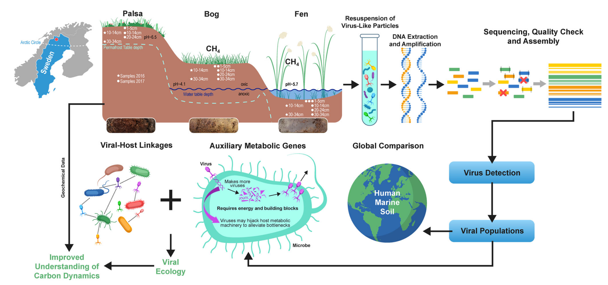
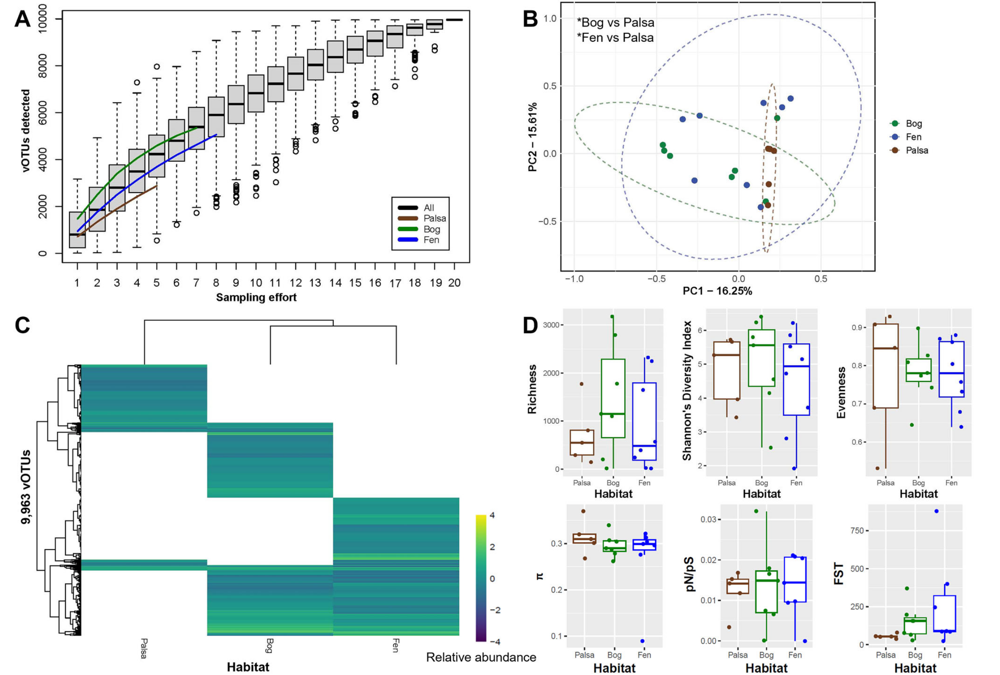
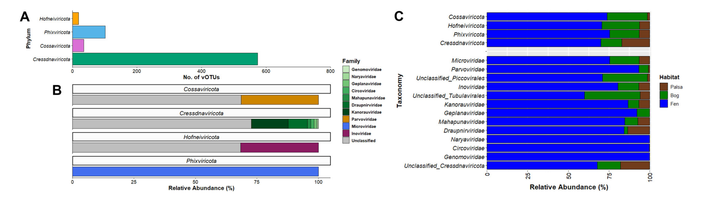
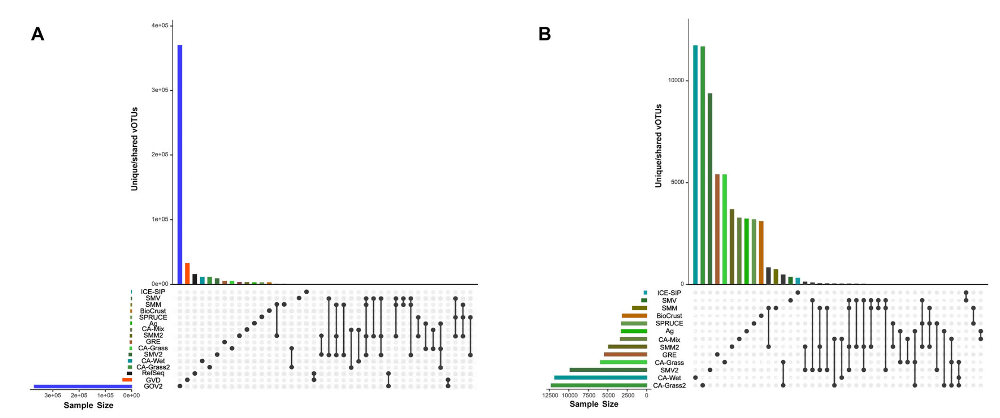
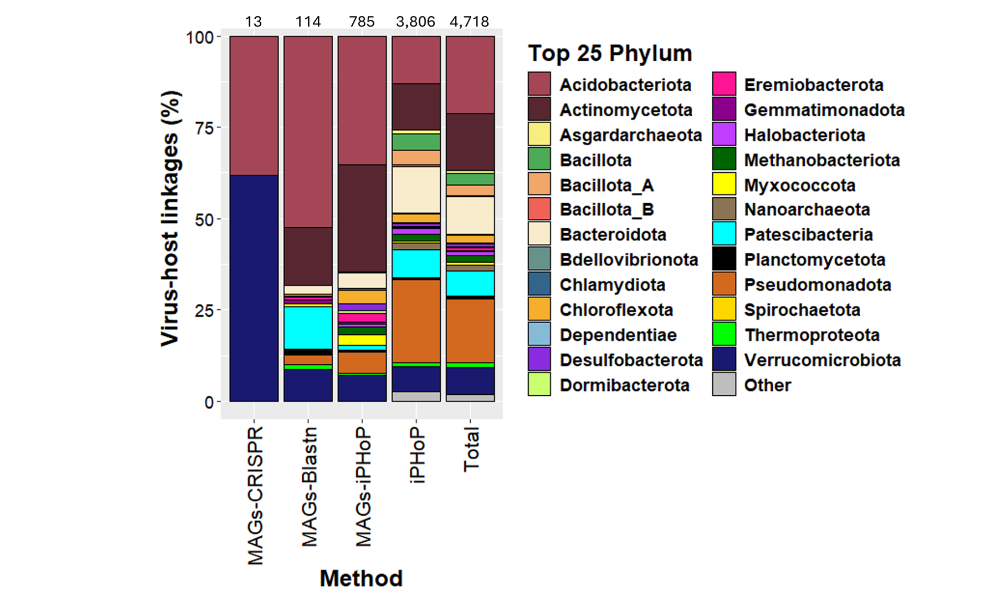
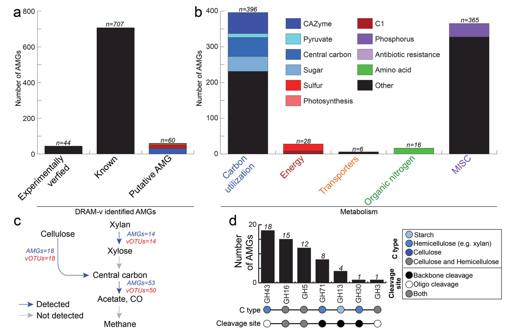

## Introduction

人为驱动的气候变化正加速北极多年冻土融化，可能通过增强微生物活动释放大量储存的碳。尽管微生物的作用日益受到关注，但病毒在其中的贡献仍知之甚少。

Trubl, G., Roux, S., Borton, M.A. et al. Population ecology and biogeochemical implications of ssDNA and dsDNA viruses along a permafrost thaw gradient. Nat Commun 17, 375 (2026). https://doi.org/10.1038/s41467-025-67057-0

这篇研究沿多年冻土融化梯度（包括完整冻土、部分融化的沼泽和完全融化的芬诺）采集20个样本，应用优化的病毒颗粒富集和工作流程，鉴定出9,963个病毒种群（vOTUs），其中99.9%相对于其他土壤病毒为新发现。38%的vOTUs预测可感染9个古菌和36个细菌门类，包括关键碳循环类群。基因组分析揭示了来自658个vOTUs的811个推定辅助代谢基因（AMGs），近半数参与碳处理，如糖苷水解酶和短链脂肪酸代谢相关基因。病毒和AMG的功能多样性随融化程度增加而升高，表明病毒可能在多年冻土融化过程中参与更广泛的微生物代谢过程。

## 背景

土壤是地球生命的基础，作为温室气体的源和汇，在地球能量交换中扮演关键角色。北极地区储存了全球约50%的土壤碳于多年冻土中，使其成为最大的陆地碳库。多年冻土正以每年约1厘米的速度融化，暴露出巨大的碳库供微生物降解。微生物将复杂大分子降解为更易利用的单体，进而通过发酵、呼吸和产甲烷等代谢过程导致气态碳损失，或吸附到土壤基质中。尽管已有大量研究通过非培养技术解析冻土生态系统中的微生物组，但对病毒作用的了解仍非常有限。

病毒是土壤微生物组的重要组成部分，每天裂解约三分之一的微生物，在全球范围内释放碳和营养盐。除细胞裂解外，病毒还通过携带辅助代谢基因（AMGs）重编程宿主代谢，影响碳循环。然而，由于土壤中微生物复杂度高，病毒信号检测困难，其在土壤中的生态功能远未明晰。病毒靶向的宏基因组调查（病毒组）通过物理化学方法分离病毒样颗粒，可提高病毒检测分辨率。尽管在斯托达伦沼泽等自然融化梯度站点已观察到病毒群落的显著变化，但对病毒调控的碳代谢广度及其随冻土融化的变化规律仍存在认知空白。

## 方法

### 样本采集与病毒组生成
研究在瑞典北部斯托达伦沼泽连续两年（2016和2017年7月）沿多年冻土融化梯度（帕尔萨：完整冻土；沼泽：部分融化；芬诺：完全融化）采集20个样本，涵盖多个深度。病毒颗粒采用优化的重悬浮缓冲液从泥炭样本中解吸，经0.2微米滤膜过滤后，使用DNeasy PowerSoil试剂盒提取DNA，并辅以热裂解步骤。为全面捕获病毒多样性，研究人员比较了两种建库方法：Nextera XT（主要扩增dsDNA）和Accel-NGS 1S Plus（可同时捕获ssDNA和dsDNA）。最终生成的40个文库经Illumina HiSeq平台测序。

### 病毒序列鉴定与生态学分析
测序数据经过包括读长纠错、去重复和SPAdes组装在内的优化流程处理。病毒contigs通过VirSorter2和geNomad鉴定。dsDNA病毒contigs在95%平均核苷酸一致性和85%比对比例下聚类为vOTUs，并使用CheckV评估质量。ssDNA病毒通过标记基因（主要衣壳蛋白MCP和复制相关蛋白Rep）鉴定。病毒相对丰度通过读长回帖计算，并基于Bray-Curtis相异性进行主坐标分析等生态学分析。

### 宿主预测与AMG注释
病毒宿主通过CRISPR spacer匹配、核苷酸相似性比对以及集成宿主预测工具iPHoP进行预测。辅助代谢基因使用DRAM-v进行注释，并针对该系统的碳循环关键基因定制数据库进行功能富集分析。

## 结果与讨论

### 不同建库方法的病毒信号回收比较
研究人员系统比较了Nextera和Accel两种建库方法在病毒contig回收和覆盖度偏差方面的表现。两种方法回收的病毒contig数量在样本间保持一致。在宽松的覆盖度阈值下，Accel试剂盒的表现显著优于Nextera，而在严格阈值下两者性能相似。非度量多维标度分析表明，病毒组主要按样本而非建库方法聚类，且方法间存在显著重叠，表明建库方法间的差异小于每种方法内部的变异性。

### 病毒种群的特征与生态学

通过合并文库，研究共获得9,963个ssDNA和dsDNA vOTUs，包括9,233个dsDNA vOTUs和730个ssDNA vOTUs。积累曲线表明vOTU丰富度随样本量增加而趋于平台期，表明采样深度足够。β多样性分析显示病毒群落结构具有明显的栖息地特异性，栖息地类型解释了群落组成变异的显著部分（R²=0.163, p<0.05）。帕尔萨的病毒群落与沼泽和芬诺显著不同，而沼泽与芬诺之间无显著差异。绝大多数vOTUs（69%）为单一栖息地特有，其中沼泽特有vOTUs最多（2,413个）。沼泽的病毒总丰度最高，芬诺次之，帕尔萨最低。病毒丰富度和读长回帖量在所有栖息地的表层和中层深度普遍较高。

ssDNA vOTUs的分类分析显示，Cressdnaviricota门占主导（574个vOTUs，79%），其次是Phixviricota（102个，14%）。基于标准化读长计数的相对丰度分析表明，ssDNA vOTUs主要分布在芬诺（74%），其次是沼泽（19%）和帕尔萨（7%）。

### vOTUs的全球比较

与全球病毒数据集（海洋、人类肠道和其他土壤）的比较显示，超过99.8%的vOTUs为生物群落特异性，仅有一个vOTU在三种环境中共享。聚焦土壤内部的比较，本研究的vOTUs有99.9%相对于其他土壤为新发现，仅有4%的vOTUs与既往斯托达伦沼泽数据集共享。这种高度的遗传新颖性凸显了土壤病毒的地方性特征以及采样策略和空间异质性的影响。

### 土壤病毒的生态系统影响推断

通过CRISPR spacer和核苷酸相似性匹配，研究将部分vOTUs与斯托达伦沼泽的1,529个宏基因组组装基因组关联，预测了病毒与宿主的关系。利用iPHoP工具，研究人员将宿主预测范围扩大到41个细菌和古菌门，使38%的vOTUs（3,806个）关联到推测宿主。这些互作中，124个vOTUs与产甲烷古菌相关，243个与甲烷氧化菌相关，显著扩展了对这些关键功能类群病毒侵染的认识。

功能分析鉴定了658个vOTUs携带的811个推定AMGs。这些基因功能广泛，涉及碳利用（48%）、有机氮代谢（2%）、能量代谢（3.5%）等。值得注意的是，参与碳循环的AMGs尤其丰富，包括59个糖苷水解酶（GHs，属于9个家族）参与纤维素和半纤维素降解，以及45个与单糖降解和短链脂肪酸代谢相关的基因。AMGs及其功能多样性随融化程度增加（帕尔萨29%，沼泽31%，芬诺40%），与微生物和植物化合物多样性的变化趋势一致。

特别值得关注的是，研究鉴定出六个携带天冬氨酸消旋酶（racD）的vOTUs，该酶可能通过促进微生物坏死质稳定化而影响长期碳储存。此外，许多AMGs与甲烷生成和氧化的关键步骤相关，表明病毒可能直接影响冻土生态系统的温室气体通量。

## 结论

气候变化驱动的多年冻土融化正在将斯托达伦沼泽从低生产力的干燥帕尔萨转变为更湿润、微生物和植物多样性更高的芬诺栖息地。本研究在该融化梯度上表征了数千个新颖的ssDNA和dsDNA病毒种群，揭示了病毒多样性、病毒-宿主关联以及AMG功能多样性均随冻土融化而增加。这些病毒携带的AMGs支持复杂碳水化合物降解和易分解碳化合物的下游处理，表明病毒参与了微生物碳降解途径的早期和晚期阶段。对参与甲基营养和乙酸转化的AMGs的检测，结合这些代谢途径在沼泽中的生态重要性，突出了病毒在调节生态系统生物地球化学循环中的潜在作用。这些发现强调了将病毒过程整合到生态系统尺度生物地球化学模型中的必要性，特别是考虑到泥炭地和多年冻土在全球碳循环中的重要性以及本土病毒携带碳循环基因的普遍性。
