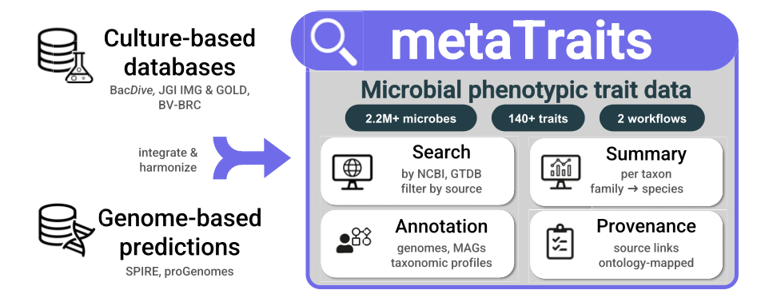
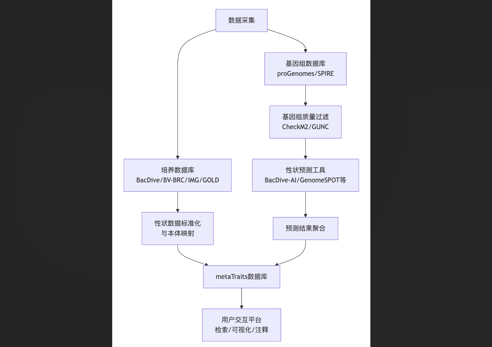
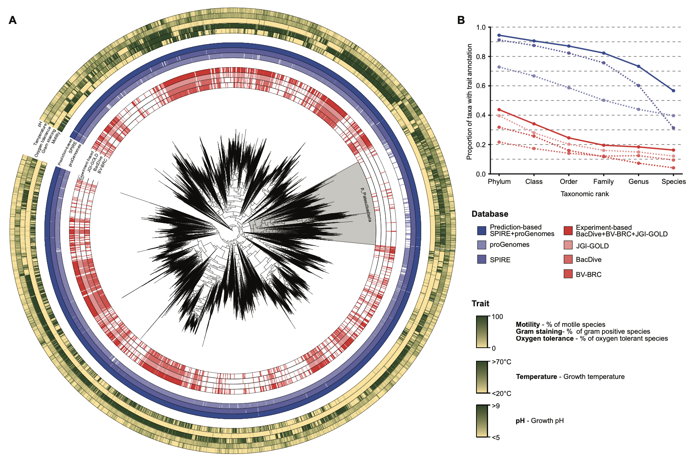
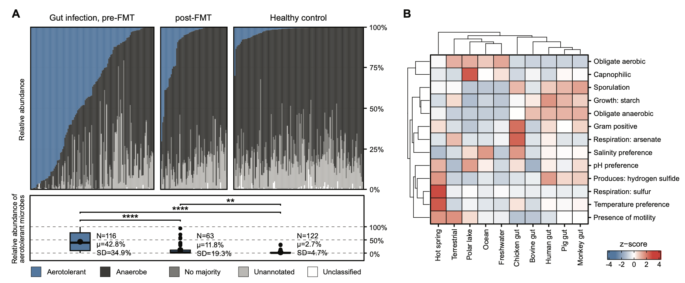

微生物表型性状是理解其生态功能、生理特性及环境适应的关键，然而相关数据长期分散于多个数据库，且难以覆盖大量未培养微生物。有时候我们想知道一些微生物的表型形状如细胞形态（如形状、大小和革兰氏染色）、生理特性（如运动性和孢子形成）、代谢与酶活性、环境偏好（如温度、盐度和氧耐受性）以及生活方式类别等，需要手动查询并整理。

metaTraits作为一项统一的资源，整合了培养来源的性状数据与基因组预测结果，覆盖超过220万微生物基因组及140余种标准化性状，显著提升了微生物性状数据的可及性与互操作性。最近发表在了NAR上。

网址：<https://metatraits.embl.de/>

我试了一下目前查询功能经常报错，但是我们可以直接下载提供的NCBI/GTDB各个层级的注释结果，结果是jsonl文件，可以用代码方便读取和批量查询整理，还是很不错的。

## 背景

微生物表型性状的知识为了解其功能、生态学及其在环境和人体相关生态系统中的相互作用提供了重要基础。性状信息已被用于生态建模、研究人类与肠道微生物的共分化、表征全球微生物栖息地、探索疾病背景下功能性微生物组的动态变化，以及揭示微生物菌株共享网络中性状与生物地理和社会模式之间的联系。尽管其应用广泛且重要性突出，微生物表型性状数据仍分散于多个以培养为基础的数据库中，限制了大规模生物学分析的全面性。

现有主流性状数据库（如BacDive、BV-BRC、JGI IMG和GOLD）在数据模型和标准化方面存在差异，导致跨资源整合困难。此外，绝大多数原核生物多样性尚未被培养，现有数据库难以覆盖此类微生物。虽然计算预测方法（如BacDive-AI、GenomeSPOT等）能够从基因组序列推断性状，但尚未有资源系统性地整合培养来源的性状数据与基因组预测结果。metaTraits应运而生，旨在通过整合多源数据与预测工具，构建一个覆盖全面、标准统一的微生物性状数据库。

## 数据库构建

### 公共数据库表型性状整合

metaTraits从BacDive、JGI IMG、GOLD和BV-BRC等主要公共数据库中整合微生物表型性状信息，涵盖生理特性、环境偏好、形态特征及代谢活性等。数据通过API或表格元数据文件采集，并经过人工重编码、单位统一及命名标准化处理，以确保一致性。在分离菌株数据库中，metaTraits共收录了涉及17159个物种（GTDB分类）的118万条性状观测记录。

### 基于基因组的表型性状预测

为弥补未培养类群的数据缺口，metaTraits系统性地整合了基于BacDive-AI、GenomeSPOT、MICROPHERRET和Traitar等工具的基因组预测结果。这些预测覆盖了proGenomes3中的90万余个高质量分离基因组，以及SPIRE中的110万余个中高质量MAGs，总计生成超过2.07亿条性状预测。通过纳入环境来源的MAGs，数据库显著扩展了对稀有类群（如Patescibacteria和Nanoarchaeota）的性状覆盖范围。

### 数据标准化

为提高数据的可解释性与机器可读性，性状名称均映射至标准化词汇表，主要基于微生物表型本体论（OMP），并辅以MICRO、SNOMED和基因本体论（GO）等术语。分类信息通过taxonkit工具统一至NCBI和GTDB系统，支持两者间的高精度交叉引用（平均一致率达99%以上）。

## 数据库内容

### 网站功能

metaTraits网站（https://metatraits.embl.de）提供基于NCBI或GTDB分类系统的数据检索与探索功能，用户可根据研究需求筛选数据来源。性状数据按分类层级聚合，数值型性状以中位数汇总，分类性状以类别比例呈现。当某一类群内性状一致性达到85%以上时，系统自动生成摘要标签；若一致性不足，则标记为“无稳健多数”。所有性状估计均链接至原始数据源，确保透明性与可验证性。

### 用户数据注释流程

metaTraits提供两种注释流程：  
1. **基因组注释流程**（porTraits）：基于Nextflow的工作流，支持用户提交基因组或MAGs文件，通过Prodigal基因预测、eggNOG-mapper功能注释及多工具性状预测，生成标准化性状注释。该流程可通过网站界面或云端工作流管理器直接运行。  
2. **微生物群落注释流程**：解析常用分类分析工具（如mOTUs、MetaPhlAn等）的输出结果，将分类单元映射至性状数据库，实现群落水平性状谱注释。

## 应用场景

metaTraits支持多种研究应用：  
1. **快速分类性状表征**：尤其适用于16S rRNA扩增子数据的研究，可在属级水平汇总性状信息。  
2. **性状分布与进化分析**：用户可比较特定菌株性状在系统发育背景中的典型性，或通过性状-系统发育树叠加分析性状进化模式。  
3. **群落性状注释**：通过注释微生物群落的性状分布，揭示环境或健康状态下的功能差异。例如，艰难梭菌感染患者肠道微生物组中需氧微生物比例显著升高，而在粪便移植后恢复至接近健康状态。  
4. **跨数据库整合**：与SPIRE、GMGC等资源联动，支持多组学层面的综合分析。

未来，metaTraits将通过纳入新预测工具、更新基因组目录及增强外部数据库互操作性，进一步拓展性状驱动型微生物组研究的边界。

## References
1. Daniel Podlesny, Chan Yeong Kim, Shahriyar Mahdi Robbani, Christian Schudoma, Anthony Fullam, Lorenz C Reimer, Julia Koblitz, Isabel Schober, Anandhi Iyappan, Thea Van Rossum, Jonas Schiller, Anastasia Grekova, Michael Kuhn, Peer Bork, metaTraits: a large-scale integration of microbial phenotypic trait information, Nucleic Acids Research, Volume 54, Issue D1, 6 January 2026, Pages D835–D841, https://doi.org/10.1093/nar/gkaf1241
2. https://metatraits.embl.de/
