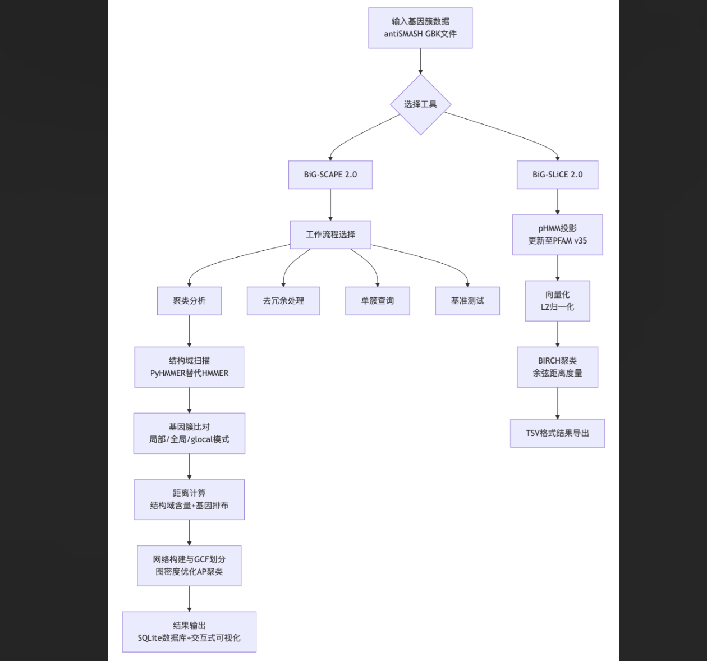
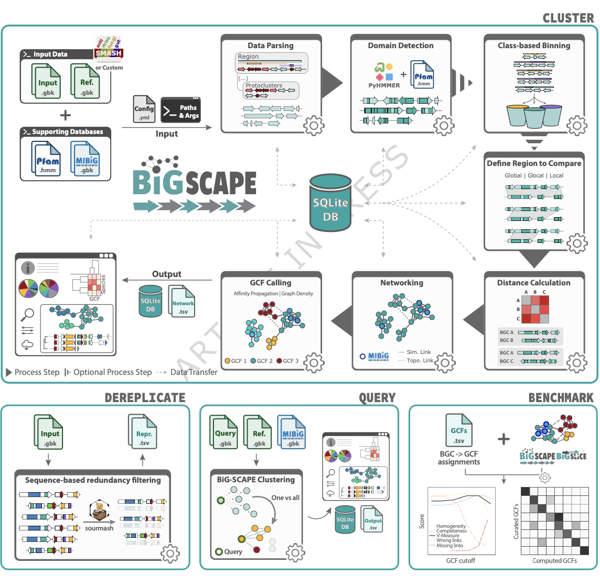
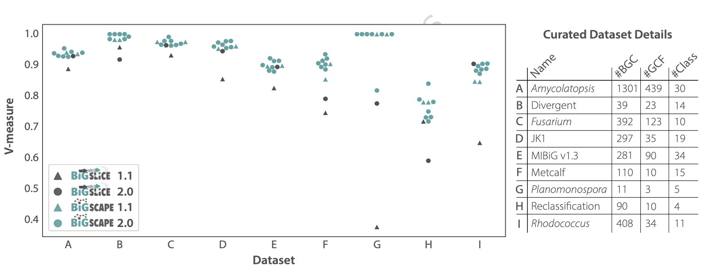
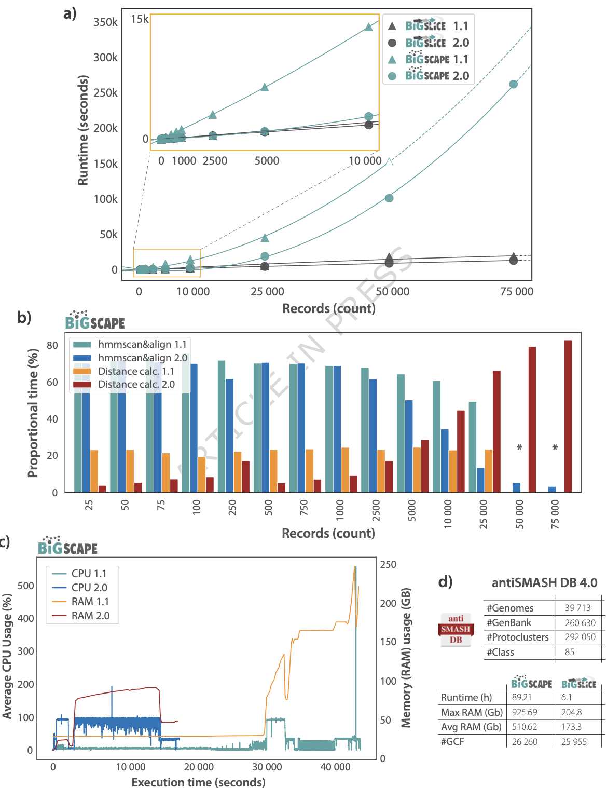

## Introduction

微生物代谢基因簇（MGCs）编码着参与特殊代谢物合成或分解的基因，这些代谢物在生态位适应、微生物组相互作用以及药物开发中具有关键作用。随着高通量测序技术的快速发展，基因组挖掘已从单个基因组分析扩展到数十万个宏基因组组装基因组（MAGs）的大规模研究。然而，海量数据对基因簇比较分析工具的计算效率和准确性提出了更高要求。

Draisma, A., Loureiro, C., Louwen, N.L.L. et al. BiG-SCAPE 2.0 and BiG-SLiCE 2.0: scalable, accurate and interactive sequence clustering of metabolic gene clusters. Nat Commun (2026). https://doi.org/10.1038/s41467-026-68733-5

BGC相似性聚类和勘探引擎（BiG-SCAPE）及其超线性聚类引擎（BiG-SLiCE）是目前广泛使用的基因簇家族（GCFs）划分工具。BiG-SCAPE通过Pfam结构域压缩和多重距离度量实现交互式相似性网络分析，而BiG-SLiCE采用谱隐马尔可夫模型（pHMM）投影和分区聚类算法，适用于超大规模数据集。为应对不断增长的数据规模和日益复杂的分析需求，研究团队对这两个工具进行了全面升级。

## 方法

### BiG-SCAPE 2.0架构更新
BiG-SCAPE 2.0进行了代码库重构，采用模块化设计和SQLite数据库管理数据流，显著提升代码可读性和可维护性。工具新增四种工作流程：核心聚类流程（BiG-SCAPE Cluster）、去冗余流程（BiG-SCAPE Dereplicate）、查询流程（BiG-SCAPE Query）和基准测试流程（BiG-SCAPE Benchmark）。去冗余流程整合sourmash工具进行基于序列相似性的冗余过滤，查询流程支持单基因簇与大规模数据集的快速比对。

### 算法优化
在基因簇比对方面，BiG-SCAPE 2.0引入真正的局部比对模式，并优化核心基因引导的最长公共子序列（LCS）查找策略。新增三种延伸策略（Legacy Extend、Simple Match Extend、Greedy Extend）以处理不同复杂度的结构重排。聚类阶段引入图密度分析（阈值≥0.85），通过调整偏好参数抑制过度分裂，提升GCF划分的生物学合理性。

### BiG-SLiCE 2.0改进
BiG-SLiCE 2.0将距离度量从欧氏距离替换为余弦相似度，缓解了核糖体合成后修饰肽（RiPPs）等稀疏向量聚类灵敏度不足的问题。同时更新pHMM数据库至PFAM v35和antiSMASH v8标准，并通过代码优化将运行速度提升25-50%。

### 基准测试框架
研究团队收集9个手工校正的GCF数据集，利用V-measure指标（兼顾同质性和完整性）评估聚类准确性。性能测试采用antiSMASH DB v4.0b2的随机子集，在16核服务器上对比各版本工具的运行时和资源消耗。

## 结果

### 准确性显著提升
基准测试显示，BiG-SLiCE 2.0在多数数据集上V-measure平均提升17%，其中RiPPs数据集（G组）提升达106%，证明余弦距离有效平衡了不同BGC类别的聚类灵敏度。BiG-SCAPE 2.0在所有数据集上均保持或超越前代准确性，其局部比对模式在高度相似的糖肽NRPSs数据集（H组）中表现突出。

### 性能优化成果
BiG-SCAPE 2.0运行速度提升2-8倍，内存占用降低50%，可处理数据集规模扩大3倍。在1万条基因簇记录规模下，其运行时与BiG-SLiCE相当。资源分析表明，PyHMMER库的引入使HMM扫描耗时占比从40%降至15%，距离计算成为主要瓶颈。BiG-SLiCE 2.0在6.1小时内完成26万条antiSMASH DB记录的处理，峰值内存占用仅175 GB。

### 大规模数据分析
对antiSMASH DB v4.0（含26万个基因簇）的分析显示，BiG-SCAPE 2.0（原型簇记录）与BiG-SLiCE 2.0分别生成26,260和25,955个GCFs，结果高度一致。这表明尽管两者算法差异显著，但均支持“绝大多数天然产物化学多样性尚未被探索”的结论，且原型簇分析可有效规避antiSMASH区域边界预测的偏差。

## 讨论

### 工具定位互补性
BiG-SCAPE 2.0适用于需要精细交互分析的中小规模数据集，其多参数调节和网络可视化功能支持深度数据探索。BiG-SLiCE 2.0则面向超大规模聚类任务，兼顾速度与准确性。新兴工具IGUA虽在中等数据集上速度领先，但理论可扩展性及预计算GCF映射功能不及BiG-SLiCE。

### 生物学意义启示
聚类参数的敏感性分析表明，不存在适用于所有数据集的“最优参数”。例如，局部比对模式对结构微变异的识别能力更强，而全局模式更适合边界明确的数据集。这提示用户需根据研究目标定制分析策略，而非仅依赖默认参数。

### 技术演进方向
未来工作可能探索MMseqs2基于序列聚类与向量聚成的融合方案，以兼顾计算效率与功能性。此外，工具生态的整合（如BiG-FAM数据库、NPLinker平台）将进一步强化从基因簇发现到产物预测的分析管道。

## 结论

BiG-SCAPE 2.0和BiG-SLiCE 2.0通过算法创新、工程优化和功能扩展，为大规模代谢基因簇分析提供了高效、精准的解决方案。其升级不仅提升了工具的计算性能，更通过模块化设计保障了软件可持续性。这些进展将助力微生物次级代谢多样性研究从基因簇识别向生态系统尺度的进化与功能解析迈进。
