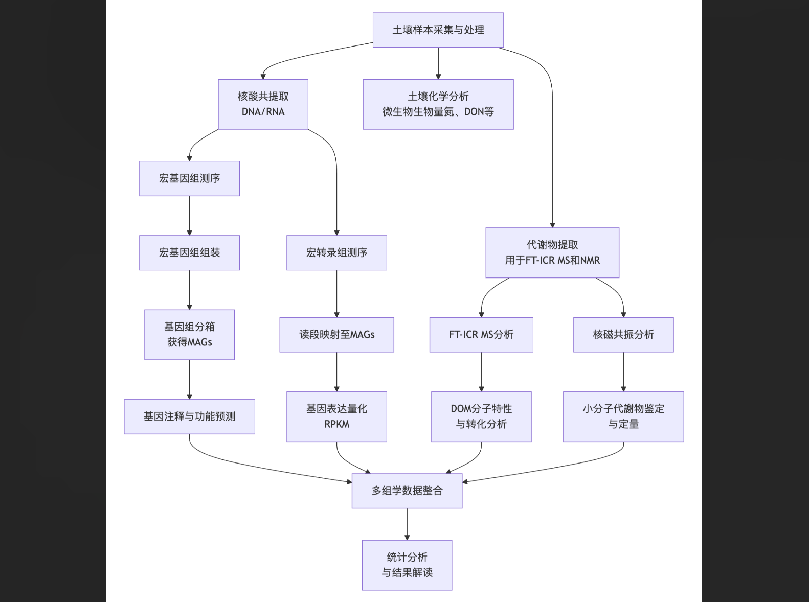
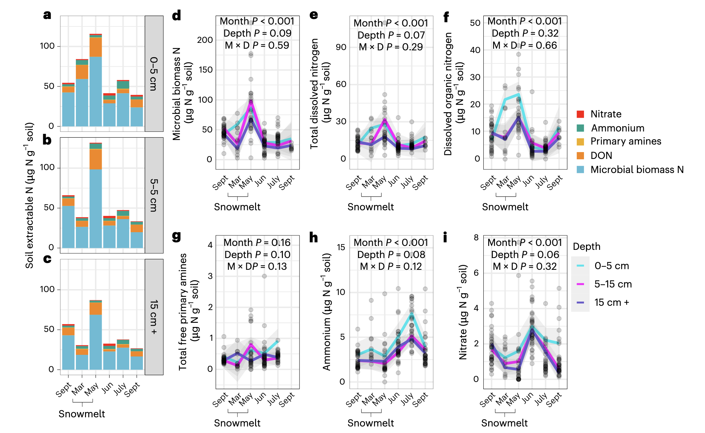
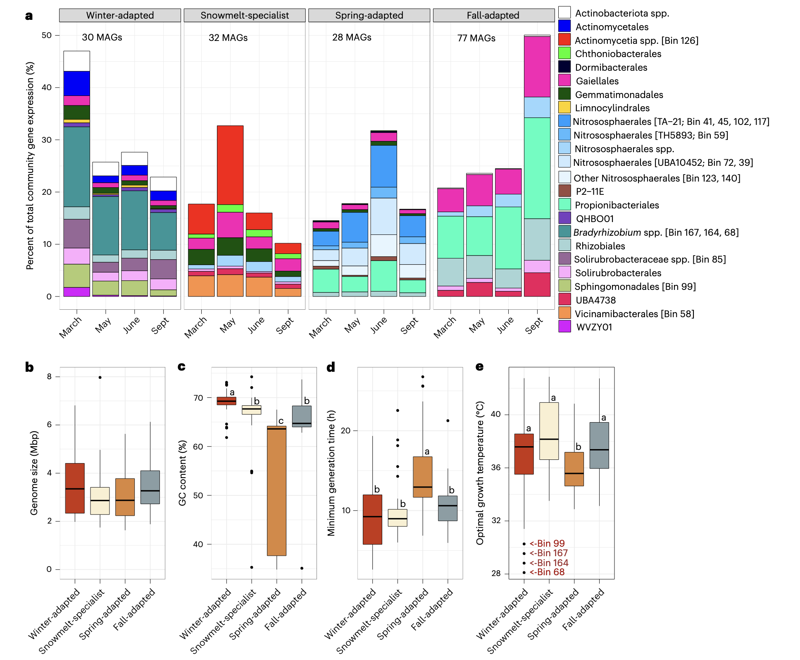
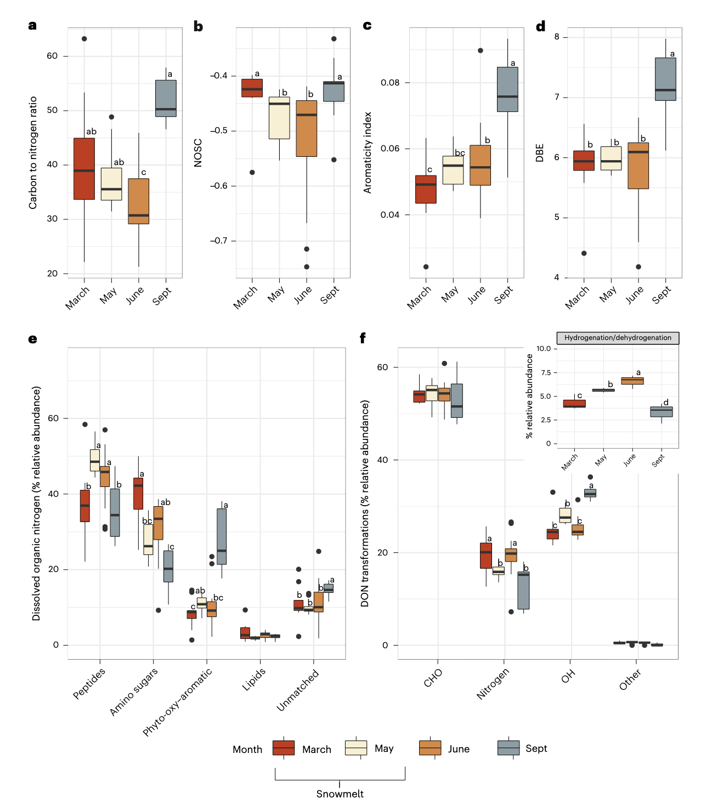
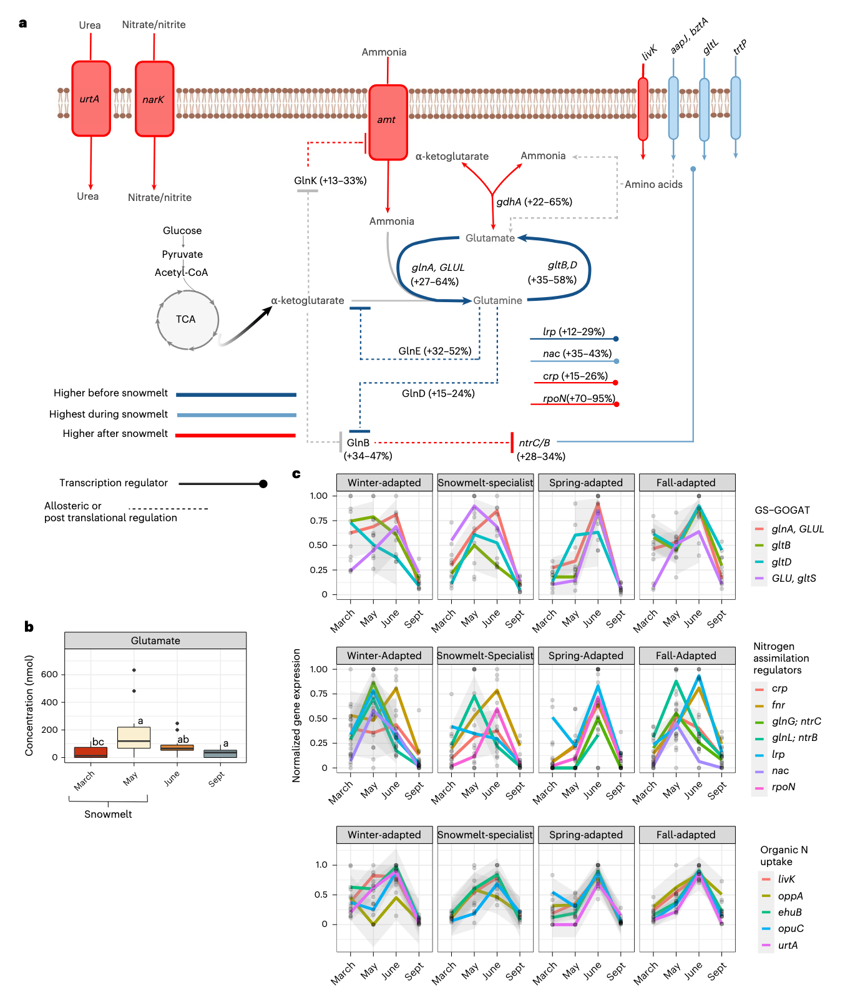
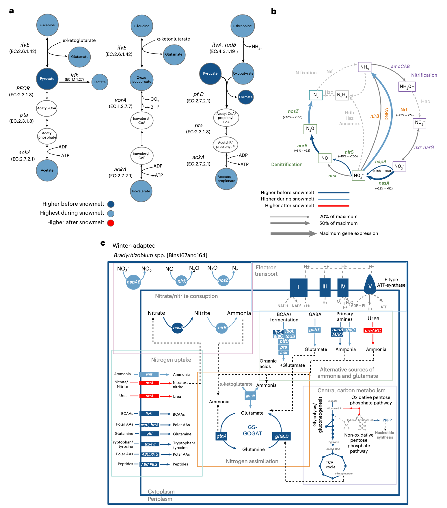
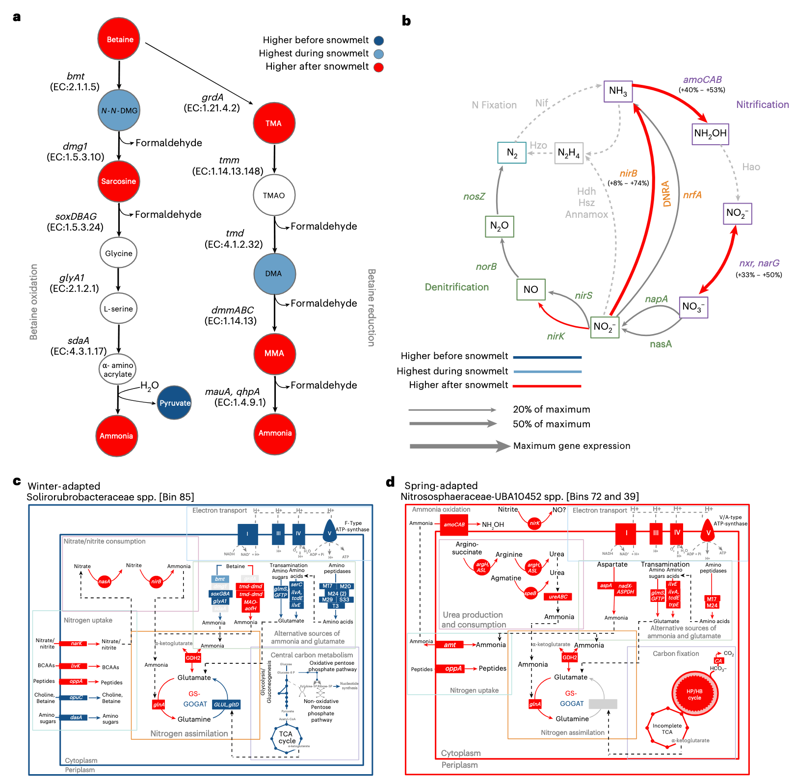

## Introduction

融雪是高海拔流域氮素河流输出的主要时期，也是一个关键的生物地球化学热点时刻。融雪标志着从冬季到春季的过渡，伴随着土壤温度升高和植物初级生产力增加。这些环境变化也引发了土壤微生物组的季节性演替。例如，在季节性积雪的生态系统中，融雪期间会发生显著的微生物水华，固定土壤氮，随后微生物生物量崩溃，导致土壤氮脉冲式释放。尽管在不同生态系统类型中均观察到此现象，但驱动土壤微生物水华的代谢过程尚不明确。融雪后从流域输出的无机氮主要来源于微生物硝化作用，这意味着与融雪相关的土壤微生物水华和崩溃对生态系统氮输出具有贡献。全球气温升高正在减少冬季积雪，改变融雪的季节时间和速率，从而导致流域功能改变。目前，预测积雪减少如何影响流域氮输出仍具挑战性，部分原因是驱动融雪相关微生物水华和崩溃的微生物过程尚不清晰。

全球土壤每年周转约240太克氮，其中大部分土壤氮为高分子量有机氮。有机氮的降解被公认为土壤氮动员的限速步骤。尽管有此共识，微生物氮转化在模型中常被简化为涉及无机氮物种的少数几个氧化还原反应，有机氮转化或被忽视，或仅在微生物氮循环模型中隐含表示。这部分是因为土壤有机氮库结构多样且难以表征。有机氮的吸收、同化和矿化也由多种代谢系统协调，这些系统受不同环境信号调控。因此，这些过程是土壤微生物组的涌现特性，难以在复杂群落中归因于特定的分类群。历史上曾使用模式生物和体外研究来描述氮降解和同化的微生物过程，但最近的宏基因组和宏转录组分析也揭示了自然土壤中有机氮循环过程的环境多样性和分布。

Sorensen, P.O., Karaoz, U., Beller, H.R. et al. Multi-omics reveals nitrogen dynamics associated with soil microbial blooms during snowmelt. Nat Microbiol (2026). https://doi.org/10.1038/s41564-025-02213-2

这篇研究聚焦于科罗拉多河上游流域高海拔地区（海拔2750至4000米）的融雪期，结合基因组解析的宏基因组学和宏转录组学，以识别融雪期间和之后动员土壤氮的代谢过程。研究人员还表征了低分子量氮代谢物、溶解有机氮库的分子特性和转化。先前研究表明，融雪在时间上区分了三个不同的土壤生态位，这些生态位以土壤微气候、生物相互作用和生态学上不同的微生物为特征。本研究假设，占据这些不同土壤生态位的土壤微生物具有不同的代谢能力，用于降解、同化和利用不同氮源进行生长和能量产生。通过整合多组学数据集，研究人员发现，在整个融雪时间段内，不同的分类群通过其独特的氮循环活动相互关联。这些发现增进了我们对高海拔流域微生物氮循环的理解，并对预测生态系统对全球变化导致的积雪损失的响应具有更广泛的意义。

## 方法

### 土壤收集和孔隙水采样
东河流域位于科罗拉多州甘尼森县。海拔范围从2750到4000米。冬季积雪通常持续4-6个月，随后是干旱的夏季。年最低日平均气温出现在1月，最高日平均气温通常出现在7月。年降水量约为1200毫米，其中大部分（>80%）在冬季以降雪形式落下。在过去50年中，最大年积雪深度为465厘米，融雪日期每十年提前约3.5天。

土壤和土壤孔隙水采集于东河干流附近的一个山坡位置。该地点植物组成是以多年生丛生禾草、杂草和灌木为主的混合山地草甸群落。采样地点包含在一个约80米x100米的区域内，该区域位于东河洪泛区边缘上坡100米处。土壤是该地点排水良好的廷顿系列砂质壤土。土壤剖面约0.5米深，主要是按深度未分异的A层。

土壤样本在2016年植物衰老后开始，在6个日期采集。当没有积雪时，使用连接滑锤的2.5厘米直径土壤探针采集土壤样本。土壤探针的开放面允许在现场将土壤样本分成三个离散的深度增量。在3月和5月，挖掘雪坑至土壤表面以采集积雪下的土壤。每个土壤核心每个深度的约10克子样本立即在现场用干冰闪冻，并存档用于宏基因组学和代谢组学分析。土壤核心的其余部分分配给物理和生化表征，并在4°C下储存不超过7天直至实验室分析。

土壤温度、土壤体积含水量和水势从2016年10月开始连续测量。陶瓷杯张力计于2016年10月安装在每个样地的地表下25厘米、50厘米和150厘米处。在5月，使用插入土壤特定深度的1/4英寸不锈钢管采集土壤孔隙水。土壤孔隙水用60毫升气密注射器采样，通过0.2微米过滤器过滤，并储存在预抽真空的60毫升玻璃血清瓶中。在6月，通过施加负压过夜使土壤孔隙水扩散到溶析仪杯中，并在施加真空后24小时内对张力计进行采样。3月和9月采集的土壤孔隙水在实验室中使用土壤水提取方法从存档的冷冻土壤中提取。

### 土壤化学性质、微生物生物量和氮库
微生物生物量氮使用氯仿熏蒸提取法测量。溶解无机氮使用微孔板读数仪测量为铵+硝酸盐。溶解有机氮计算为总溶解氮与无机氮之差。最后，总游离伯胺氮使用荧光微孔板读数仪进行荧光测量。

### 溶解有机物的FT-ICR MS和1H-NMR表征
代谢组学数据在能源部环境分子科学实验室收集。可提取的溶解有机物从冻干土壤的2克子样本中提取。使用21T FT-ICR MS通过电喷雾电离表征溶解有机物的分子特性。使用在线软件FT-MS R Exploratory Data Analysis计算每个样品中每种化合物的碳氮比，估计双键当量，碳的名义氧化态和芳香性。所有化合物基于多个元素化学计量分类规则分为生化化合物类别。通过计算每个样品中检测到的所有化合物之间的成对质量差，并将这些质量差与1255个常见生化转化的精确质量参考列表进行比较，推断溶解有机氮库的转化。对用于FT-ICR MS的相同提取物进行1H-NMR。使用Chenomx NMR Suite 8.3、HMDB和自定义内部数据库对1D 1H光谱进行手动处理、分配代谢物标识和定量。

### 文库制备和测序

DNA和RNA从每个田间采集的土壤样本的5-7个技术重复中共同提取。使用AllPrep DNA/RNA迷你试剂盒完成DNA和RNA的分离。

宏基因组和宏转录组测序文库在能源部联合基因组研究所生成。使用Illumina NovaSeq测序仪对宏基因组和宏转录组文库进行测序。配对的宏基因组和宏转录组数据可在GOLD研究ID Gs0135149下获取。

### 宏基因组组装、分箱和注释
使用metaSPAdes组装器对经过质量控制的宏基因组读段进行组装。使用ggKbase中的自动化分箱算法对每个组装体进行宏基因组分箱。使用DASTool从每个宏基因组样本中选择最佳的分箱集合。使用IMG注释流程对重叠群和预测的开放阅读框进行注释，并使用microTrait进行MAG基因组特征推断。

为了将RNA读段映射到MAGs，以两种方式分别映射经过质量控制的RNA读段。使用bbmap进行映射，其中多个映射位置被随机解析。使用bbmap计算的每千碱基每百万映射读段值用于进一步分析。

### 统计分析
使用R进行统计分析。使用双因素方差分析评估提取土壤氮库在不同时间、土壤深度及其交互作用上的差异。使用置换多元方差分析评估MAG丰度或活性在不同采样日期或土壤深度上的差异程度。使用层次聚类将MAGs分类为微生物响应组。使用“rstatix”包中的非参数Dunn检验确定微生物氮循环特征或含氮小分子代谢物浓度在不同采样日期是否存在差异。

## 结果

### 微生物生物量是融雪前后氮的控制点

微生物生物量氮是最大的可提取氮库，在所有采样日期占所有可提取土壤氮总和的66-77%。积雪和融雪也影响了其他土壤氮库的大小。例如，与3月深冬积雪下相比，5月融雪期间的微生物生物量氮和溶解有机氮分别增加了2.5倍和2倍。6月土壤变为无雪后，微生物生物量库大小下降了70%，溶解有机氮也表现出类似的下降。微生物生物量崩溃后，研究人员观察到铵和硝酸盐分别增加了2倍和3倍。土壤深度不是影响土壤氮库对融雪响应的统计学显著因素。研究人员假设融雪后的土壤氮脉冲来源于微生物生物量崩溃后释放的固定氮。为验证这一假设，接下来确定了维持生物量水华的微生物、氮底物和代谢过程。

### 积雪和融雪控制四个微生物响应组的活性

研究人员在所有采样日期共重建了496个宏基因组组装基因组。其中167个MAGs子集通过了质量检查（完整性大于75%，污染小于25%）。将转录本映射到每个MAG的所有开放阅读框，并在每个日期求和以计算总基因组表达。冬季积雪及随后的融雪引起了微生物组成和活性的变化。基因组覆盖度和总基因组基因表达的相异距离在所有采样日期之间均存在统计学差异。采样月份解释了MAG基因组覆盖度18%的变异或总MAG基因表达45%的变异，而土壤深度对MAG覆盖度或基因表达变异的解释不足10%。由于土壤深度不能解释氮储量、MAG覆盖度或活性的显著变异，研究人员将不同土壤深度的重复样本合并，用于后续的MAGs、转录组和代谢组分析。

研究人员使用层次聚类将MAGs分类为微生物响应组，并确定每个MAG最丰富的日期或每个MAG代谢最活跃的日期。这样做是为了（1）根据操作将MAGs分类为与积雪、融雪和积雪消失相关的微生物响应组，以及（2）测试生物体的丰度或代谢活性与氮吸收和利用的代谢特征相关的程度。大多数MAGs（167个中的139个）表现出总基因表达对融雪的响应变化。大多数（139个MAGs中的77个）被归类为“秋季适应型”，该响应组在9月植物衰老后的总基因表达比3月最大积雪深度时集体增加了2倍。相反，“冬季适应型”MAGs在3月最深冬季积雪下的总基因表达比9月植物衰老后增加了近一倍。

最活跃的冬季适应型MAGs在3月占总群落基因表达的30%至60%，且基因表达由少数生物体主导。该组包括三个慢生根瘤菌属MAGs（占总群落表达的8-20%）、一个单独的Solirubbrobacterales MAG（占总群落表达的3-9%）和一个Allosphingosinicella MAG（占总群落表达的3-29%）。冬季适应型MAGs具有最高的GC含量。3月代谢最活跃的冬季适应型MAGs也具有最低的预测最适生长温度，这意味着在一年中最冷的时候积雪下存在生长选择。

融雪专家型MAGs在融雪期具有最高的基因表达，并且两个融雪专家型MAGs相对于其丰度表现出不成比例的高活性。例如，放线菌纲物种在5月占总相对群落基因表达的8-24%，但基于基因组覆盖度的相对丰度仅为1-2%。春季适应型响应组主要由属于四个属的9个古菌MAGs主导（全部属于硝化球形菌目）。这些古菌MAGs在6月占总群落基因表达的23%。春季适应型生物具有最低的GC含量、最长的预测世代时间和最低的预测最适生长温度。

### 溶解有机氮在融雪期间和之后变得更芳香化

在微生物群落动态分析的基础上，研究人员接下来研究了这些微生物响应组如何促进溶解有机氮的降解。溶解有机氮化学计量学和分子特性的变化与微生物组成和活性的变化一致。例如，溶解有机氮库中的碳氮比和碳的名义氧化态在9月植物衰老后或3月积雪下最高，但在5月融雪期间下降。融雪期间名义氧化态的降低意味着微生物水华期间不饱和、热力学有利的溶解有机氮被消耗，导致更还原、热力学不利的溶解有机氮积累。植物衰老后溶解有机氮的芳香性指数表明存在高度缩合的芳香族化合物。在3月融雪前，溶解有机氮库主要由非芳香族溶解有机氮化合物组成，这些化合物在微生物水华期间和之后变得越来越芳香化。因此，在融雪期间和之后，溶解有机氮库变得更还原、更芳香化，并且相对于碳积累了更多的氮。

溶解有机氮的组成和转化反映了其化学计量和分子特性的变化。在此背景下，研究人员将“转化”定义为导致官能团（例如，含氧/氢或含氮官能团）丢失或获得的化学修饰，这可显著改变分子结构和生物有效性。植物氧化芳香族类溶解有机氮化合物在9月植物衰老后最常被检测到。相比之下，3月时氨基糖类化合物的相对丰度比9月高2倍。研究人员还观察到，与9月相比，3月冬季适应型MAGs降解几丁质或回收肽聚糖的酶基因表达量增加了高达16倍，这与之前的发现一致。这些模式共同表明，植物凋落物成分在冬季积雪开始前约占溶解有机氮化合物的40%，而微生物生物量的降解是冬季和融雪前氨基糖类化合物的来源。

此外，研究人员检测到103种不同的导致含氮单体丢失或增加的转化。这些溶解有机氮转化的频率在微生物固氮作用最强的融雪期下降。同时，研究人员观察到，与融雪开始前相比，融雪期间丝氨酸内肽酶、金属内肽酶、酰胺水解酶和核酸酶的基因表达高出4到30倍。涉及氧、氢或其组合丢失或增加的溶解有机氮转化（例如，“加氢/脱氢”）在5月融雪期间也显著增加。总的来说，这些发现表明，融雪期间溶解有机氮库主要被内肽酶、酰胺水解酶和核酸酶活性转化。这些酶活性可能驱动了“氧/氢”型转化，并与肽类和芳香族类溶解有机氮比例增加同时发生。微生物水华和溶解有机氮组成的变化与代谢活性的变化相一致，尤其是在冬季适应型和融雪专家型响应组中。

### 氨同化与生物量水华不同步

接下来，研究人员研究了溶解有机氮的变化如何影响微生物氮同化策略。通过谷氨酰胺合成酶-谷氨酸合酶途径从氨同化氮的基因表达受到融雪的强烈影响，控制有机氮吸收的转录调节因子和转运蛋白也是如此。大多数核苷酸中的氮来源于谷氨酰胺中的酰胺键，而所有氨基酸生物合成的主要氨基来源于谷氨酸。因此，谷氨酰胺和谷氨酸的产生对生物量生产至关重要，研究人员预计谷氨酰胺合成酶-谷氨酸合酶途径在微生物水华期间表达最高。谷氨酸是所有含氮小分子代谢物中浓度最高的，并且在3月和5月之间显著增加。正如预测的那样，谷氨酸生产的时间趋势与融雪期间发生的微生物生物量生产的时间趋势相关。

然而，谷氨酰胺合成酶-谷氨酸合酶途径的基因表达在3月冬季积雪下比5月融雪期间高27-58%，这表明通过谷氨酰胺合成酶-谷氨酸合酶途径的氨同化在积雪下更为活跃。不同微生物响应组之间通过谷氨酰胺合成酶-谷氨酸合酶途径进行氮同化的基因表达也存在差异，这与每个组最大代谢活性时期相对应。这表明与积雪和融雪相关的微生物响应组之间存在氮同化途径和底物的生态位分化。

与谷氨酰胺合成酶-谷氨酸合酶相反，NRII-NRI双组分调节系统和氮同化控制转录因子的基因在5月融雪期表达更高。ntrC/B加nac的最大基因表达时间在微生物响应组之间也不同。NRII-NRI双组分调节系统在氮限制生长期间被激活，其特征是外部氨可用性低和细胞内谷氨酰胺浓度低。NRII-NRI双组分系统加上Nac形成了一个调节子，控制着超过75个在氮限制生长期间利用有机氮源的基因表达。冬季适应型和融雪专家型MAGs在5月融雪期具有NRII-NRI双组分系统加Nac的最大基因表达，表明有机氮的吸收和降解有助于在融雪期间推动微生物水华。

融雪后的基因表达模式表明，土壤微生物组在积雪消失后普遍从氮限制转为碳限制。例如，通过谷氨酸脱氢酶的氨同化基因表达在6月积雪消失后增加了22-65%，这与铵和硝酸盐的脉冲同时发生。RNA聚合酶σ因子、氮调节PII-1和PII-2蛋白以及转录因子cAMP受体蛋白的表达在6月也观察到显著增加。PII-1和PII-2蛋白具有RNA聚合酶σ因子依赖的启动子，并通过失活NRII-NRI双组分系统加Nac来增加氨同化。Crp的高基因表达也是低碳氮底物化学计量比的指标，激活碳分解代谢物抑制并增加芳香族底物的降解，这与6月芳香族溶解有机氮降解潜力增加一致。

### 氨基酸和硝酸盐呼吸为融雪期微生物水华提供能量

在微生物水华期间观察到高浓度的支链氨基酸（亮氨酸、异亮氨酸和缬氨酸），以及短一个碳原子的α-酮酸（如丙酮酸）。支链氨基酸和短一个碳原子的α-酮酸同时出现表明，厌氧氨基酸降解（类似Stickland氧化反应）是融雪期间的重要代谢过程。氨基酸转氨是Stickland氧化反应的第一步，产生可直接用于生物合成或进一步脱氨生成氨的谷氨酸，研究人员在5月和6月观察到转氨酶基因表达升高。支链氨基酸的转氨也产生丙酮酸，在缺氧条件下可通过丙酮酸-铁氧还蛋白氧化还原酶脱羧产生乙酰辅酶A，研究人员在融雪期间观察到丙酮酸-铁氧还蛋白氧化还原酶的基因表达。因此，代谢物和基因表达数据表明，支链氨基酸的厌氧降解是微生物水华期间可用于氮同化的谷氨酸或氨的来源。

高浓度的有机酸可能通过竞争途径影响了硝酸盐消耗，例如融雪期间的反硝化 versus 异化硝酸盐还原成铵。乙酸、丙酸或其他厌氧代谢产物可以作为反硝化或异化硝酸盐还原成铵的电子供体，然而，当不可发酵的有机电子供体（如乙酸）丰富且还原有机碳与硝酸盐的比率高时，异化硝酸盐还原成铵更受青睐，这与研究人员在融雪期间观察到的条件相似。通过异化硝酸盐还原成铵途径呼吸支消耗硝酸盐的最高基因表达也在融雪期间观察到，意味着通过异化硝酸盐还原成铵的硝酸盐保留。

与呼吸性异化硝酸盐还原成铵相反，亚硝酸盐还原为一氧化氮或一氧化二氮的最高基因表达发生在3月深积雪下和有机酸积累之前。研究人员承认，仅凭基因表达模式无法定量确定融雪期间硝酸盐的归宿。然而，观察到的基因表达模式支持在同一野外地点和相同时期进行的硝酸盐天然丰度同位素研究，该研究显示融雪期间发生了强烈的硝酸盐还原信号。观察到的反硝化相关基因表达模式也与气体通量测量结果一致，表明土壤一氧化二氮通量在融雪开始前最高，而融雪期则是一氧化二氮消耗的高峰期。

冬季适应的慢生根瘤菌MAGs是冬季积雪下代谢最活跃的分类群。冬季适应的慢生根瘤菌属在冬季积雪下对氨基酸（包括丙氨酸、2-氧代异己酸、异戊酸等）和肽具有高基因表达，以及对伯胺（D-氨基酸脱氢酶、单胺氧化酶）氧化脱氨具有高基因表达。通过谷氨酰胺合成酶-谷氨酸合酶途径进行氮同化的基因表达以及通过氧化磷酸化产生ATP的基因表达在融雪前也最高。这些基因表达模式表明，冬季适应的慢生根瘤菌在融雪前利用有氧代谢产生能量并以氨的形式同化氮。

冬季适应的慢生根瘤菌在5月对氨基酸转氨的高基因表达（苏氨酸脱水酶、支链氨基转移酶、谷氨酸-丙酮酸转氨酶等），以及丙酮酸甲酸裂解酶、磷酸乙酰转移酶和乙酸激酶的高基因表达，表明氨基酸的厌氧降解是生物合成氮的重要来源，并在融雪期间产生有机酸。其他可发酵底物，如碳水化合物，也可能在融雪期间是有机酸的来源。冬季适应的慢生根瘤菌MAGs在5月微生物水华期间对硝酸盐还原、一氧化氮还原和一氧化二氮还原具有高基因表达。总的来说，这些基因表达模式意味着冬季适应的慢生根瘤菌物种利用氨基酸厌氧降解产生的氮进行有机氮同化，并在融雪期间通过反硝化产生能量。这一结果突出了该生物体在微生物水华期间协调有机和无机氮转化以获取能量和生长的能力。

### 生物量释放的渗透调节剂是融雪后氨的来源

甜菜碱和其他甲基化胺在6月生物量崩溃前后具有高浓度。观察到的甲基化胺包括甜菜碱分解代谢两条途径的特征性降解产物：由甜菜碱-高半胱氨酸甲基转移酶启动的氧化途径，或经由三甲胺并起源于甜菜碱类似Stickland还原的降解途径。与甜菜碱氧化降解相关的基因在3月融雪开始前表达更活跃，而与还原性甜菜碱降解相关的基因在6月融雪后表达更活跃。

一个高活性的冬季适应型Solirubrobacteraceae MAG在所有生物体中具有最高的甜菜碱降解基因表达。该MAG在3月表现出最高的氧化甜菜碱降解基因表达，在6月表现出最高的还原甜菜碱降解基因表达。此外，这个冬季适应型Solirubrobacteraceae MAG在3月积雪下对产生氨基酸单体的氨肽酶也具有高基因表达，同时对产生谷氨酸的转氨酶也具有高基因表达。因此，该冬季适应型Solirubrobacteraceae MAG很可能利用来自氧化甜菜碱降解的氨和来自氨基酸转氨的谷氨酸作为冬季积雪下生物合成和生长的氮源。

研究人员在6月融雪后观察到的硝酸盐脉冲与氨和亚硝酸盐氧化相关基因的高表达同时发生。例如，与氨或亚硝酸盐氧化相关的基因在6月积雪消失后比5月表达量高40-53%（氨单加氧酶）或33-50%（亚硝酸盐氧化还原酶）。这些模式与氨氧化春季适应型硝化球形菌目总基因表达增加2倍同时发生。含铜亚硝酸盐还原酶的基因表达在6月融雪后增加，但这不太可能导致一氧化氮排放增加。这是因为大多数NirK转录本映射到春季适应型硝化球形菌目，并且古菌中NirK同源物的基因表达未被观察到会增加一氧化氮排放。细胞质亚硝酸盐还原酶（NADH依赖）大亚基和小亚基的基因表达在6月也比5月融雪期高8-52%。这表明通过发酵性异化硝酸盐还原成铵途径具有土壤硝酸盐保留的潜力，可能限制融雪后的氮淋失损失。

## 讨论

本研究整合了基因组解析的宏基因组学、宏转录组学和代谢组学，以确定在融雪后微生物种群规模崩溃后推动融雪相关土壤微生物氮的氮来源。积雪及随后的融雪影响了四个微生物响应组的总代谢活性及其氮循环特征的基因表达。氮同化途径的基因表达表明，从氨同化的氮在融雪前对生物合成很重要。相比之下，有机氮单体在融雪相关的微生物水华期间被吸收和降解用于生长。氮同化最大基因表达的时间在微生物响应组之间也不同，意味着与融雪开始相关的氮底物和同化途径存在生态位分化。

多条证据表明，对于经历季节性积雪的生态系统，应重新审视冬季“缓慢”土壤氮循环与夏季“快速”土壤氮循环之间的区别。首先，研究人员观察到在积雪下最活跃的微生物（冬季适应型或融雪专家型MAGs）具有比春季适应型MAGs更快的预测生长速率。研究人员承认，由于积雪下土壤温度的限制，冬季原位生长速率将慢于预测生长速率。其次，研究人员观察到融雪期间参与细胞分裂、肽聚糖合成和回收的内肽酶基因表达很高，这意味着微生物生物量的高周转率。第三，溶解有机氮库的分子特性，如在融雪期间变得更还原和更芳香化，是微生物溶解有机氮处理水平增加的指标。这些结果共同挑战了冬季“缓慢”土壤氮库的概念，该概念认为土壤氮在冬季仅通过微生物生物量一次或两次。相反，融雪期间溶解有机氮储量的增加似乎与细胞分裂、生物量周转和芳香族溶解有机氮的降解有关。因此，整个冬季土壤氮循环的幅度和速率应与融雪相关微生物水华的规模成正比。

本研究还暗示气候变暖可能影响山区生态系统融雪期间和之后的土壤氮循环。例如，在未来35至60年内，美国西部预计将出现少雪或无雪的冬季。冬季积雪减少将增加冬季土壤冻结，并限制融雪期间融雪入渗或地下水向上涌入表层土壤。如果冻结的土壤限制了冬季适应型生物（包括分解植物凋落物的腐生真菌或积雪下活跃的雪霉）的活性，那么融雪相关的水华可能会变小，冬季土壤氮吸收减少。一些高山植物也在积雪下获取氮，目前春季土壤氮循环的物候时间与植物打破冬季休眠期很好地耦合。较早的融雪可能导致土壤氮动员和春季植物氮需求的时间不同步，并通过土壤氮循环微生物群落间接影响植物生产力。

氨氧化古菌的代谢活性在融雪后增加了2倍，并与显著的土壤硝酸盐脉冲同时发生。这些结果突出了春季适应型古菌在植物生长季节开始时增加土壤氮动员的重要作用。与此同时，一些冬季适应型生物具有从渗透调节剂（如甜菜碱）或裂解微生物生物量释放的核苷酸中矿化氮的高潜力。研究人员先前表明，融雪后甜菜碱降解产生的挥发性伯胺与铵和硝酸盐的产生有关，支持了冬季适应型生物降解甜菜碱为融雪后氨氧化菌提供铵源的假设。要定量确定甜菜碱降解对氨氧化的贡献程度，需要使用同位素示踪剂，而腐生真菌活性增加或病毒捕食也为春季硝化作用提供了氨源。

研究人员认为，高硝化基因表达产生的硝酸盐在融雪后立即被保留在土壤中，这与观察到的异化性和同化性硝酸盐还原成铵基因表达的高潜力一致。土壤氮的回收和再矿化反映了一个“封闭”的土壤氮循环，该循环提供了充足的氮以满足植物生长季节植物和微生物的生长氮需求。由于土壤硝酸盐脉冲的时间发生在融雪导致的土壤饱和达到最大之后，融雪后产生的大量硝酸盐不太可能通过消退的地下水位输送到地下。因此，携带源自微生物硝化作用同位素特征的河流硝酸盐可能来源于更深处的地下或经历更频繁地下水侵入和周期性河流淹没的洪泛区蜿蜒河道。

