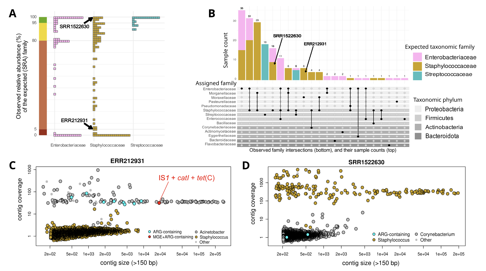
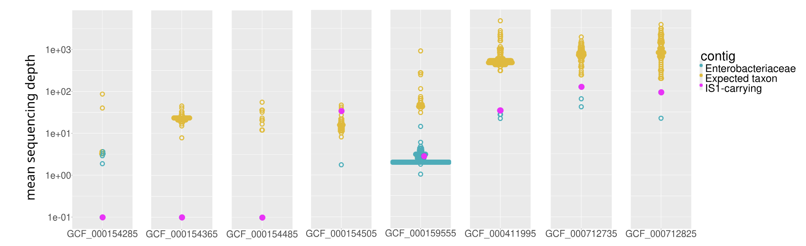

## Introduction

水平基因转移通过移动遗传元件在细菌物种间传播抗生素抗性基因，是临床耐药性扩散的重要机制。Ellabaan等人开发了一种两步预测方法：首先基于已知ARG-MGE对的基因组邻近性预测潜在的新宿主范围，然后利用SRA数据库中的原始测序数据验证预测结果。该研究报道了高达66%的验证率，包括多个跨门水平的ARG转移事件，如典型的葡萄球菌基因blaZ在肠杆菌科分离株中的检测。

然而，公共基因组数据库中普遍存在的污染问题可能严重影响此类预测研究的可靠性。随着测序数据量的快速增长，确保数据质量对于准确推断基因转移事件变得至关重要。

- Godron, N., Ruppé, E. & Leclercq, S.O. Genome contamination may lead to an overestimation of horizontal gene transfer inferences. Nat Commun 17, 1219 (2026). https://doi.org/10.1038/s41467-026-69064-1
- 期刊：Nature Communications （IF 15.7）
- 发表时间：2026年2月2日

这篇研究对Ellabaan等人2021年发表的抗生素抗性基因传播预测研究进行了重新评估。研究人员下载了原始研究中用于确认新ARG传播的所有182个SRA测序数据，通过严格的生物信息学分析发现，其中绝大多数样本存在严重的基因组污染问题。在62个肠杆菌科、97个葡萄球菌科和23个链球菌科的SRA数据中，分别有67%、91%和22%的样本被污染。进一步分析显示，所有在葡萄球菌科和链球菌科中检测到的水平转移基因均源于细菌污染或实验室诱导的定向整合，而非自然发生的基因转移事件。

## 方法

### 数据获取与质量控制

研究人员从NCBI SRA数据库下载了Ellabaan研究中用于确认新ARG传播的所有182个测序数据。使用Trimmomatic v0.38进行质量修剪，参数设置为LEADING:20、TRAILING:20和SLIDINGWINDOW:15:20。随后利用MetaPhlAn 4.0.2对修剪后的reads进行物种分类鉴定，使用mpa_vJun23_CHOCOPhlAnSGB_202403数据库，该数据库排除了物种间共享的DNA材料如质粒。

### 序列组装与基因检测

采用与原始研究相同的流程进行序列组装，使用blastN以90%相似度阈值在组装结果中查询预测的ARG和MGE。利用Kraken v2.1.2的细菌数据库（2022年2月版）进行重叠群分类鉴定。通过比对用于组装的原始reads评估每个重叠群的测序深度，以确定其来源物种。

## 结果

### 污染程度评估

分析显示，Ellabaan研究中用于确认新ARG传播的SRA数据集存在严重污染问题。在62个预期为肠杆菌科的样本中，41个（67%）被污染；97个葡萄球菌科样本中，88个（91%）被污染；23个链球菌科样本中，5个（22%）被污染。

污染模式主要包括三种类型：37个基因组（占污染样本的28%）在reads中检测到两个甚至三个不同门的细菌，丰度均超过5%；另外37个基因组（28%）的主要物种与SRA元数据中标注的家族不一致，丰度超过95%；其余9个（7%）为门内污染，如肠杆菌科与摩根菌科之间，或厚壁菌门内的污染。

### ARG携带重叠群的来源分析

关键发现是，在所有被污染的SRA数据中，携带ARG的重叠群其测序深度与污染菌的深度范围一致，而非预期物种。以葡萄球菌科样本ERR212931为例，原始研究报道了一个携带氯霉素乙酰转移酶catI和移动遗传元件IS1的重叠群，认为这是跨门水平基因转移的证据。

然而，重新分析显示该重叠群长度为19125 bp，除IS1和catI外还携带四环素抗性基因tet(C)，经分类鉴定属于不动杆菌属。其测序深度为31×，与其它不动杆菌属重叠群深度相似，而所有葡萄球菌属重叠群的测序深度均低于15×。这表明该重叠群极不可能源自葡萄球菌分离株。

### 移动遗传元件宿主范围的重评估

研究人员重点分析了IS1元件，该元件在原始研究中是预测变形菌门ARG跨门传播的主要贡献者。IS1在19个非变形菌门基因组中被检测到，其中仅4个显示明确的元件整合证据。对其余8个基因组的分析发现，IS1携带重叠群的测序深度持续低于预期物种范围，其中4个还检测到深度与IS1重叠群相似的肠杆菌科重叠群。这些观察结果与在污染SRA运行中的发现一致，表明检测到的IS1拷贝极不可能属于被测序物种。

## 讨论

本研究揭示了公共基因组数据库中污染问题对水平基因转移推断的严重影响。Ellabaan研究中报道的绝大多数跨门ARG转移事件实际上源于样本污染而非自然发生的基因转移。即使在污染水平低于5%的样本中，污染菌的序列仍可能被组装成重叠群，导致错误的基因归属推断。

问题不仅限于确认分析阶段，还可能影响预测阶段中移动遗传元件宿主范围的确定。原始研究中预测的274个可跨物种转移的MGE，其可靠性需要重新评估。近年来发展的基因组数据库污染排查工具，如AllTheBacteria和FCS-GX，以及长读长测序技术的应用，有助于改善此类问题。

Ellabaan等人提出的基于MGE-ARG关联性预测抗生素抗性基因传播范围的方法具有创新性，但公共数据库中的序列污染水平严重影响了研究结果的可靠性。本重新评估表明，原始研究中报道的绝大多数水平基因转移事件均为假阳性结果，源于数据污染问题。

这一案例强调了在利用公共基因组数据进行进化推断时进行严格质量控制的重要性。未来类似研究应当整合系统性的污染检测步骤，并结合元数据审慎分析，以确保基因归属推断的准确性。只有通过高质量的数据和严谨的分析方法，才能准确揭示抗生素抗性基因在细菌种群中的传播动态。