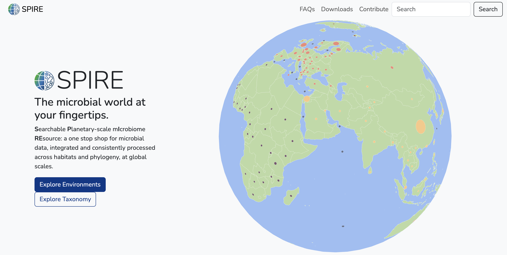
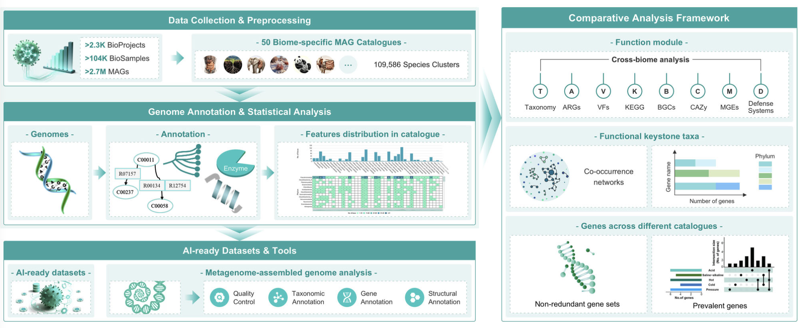
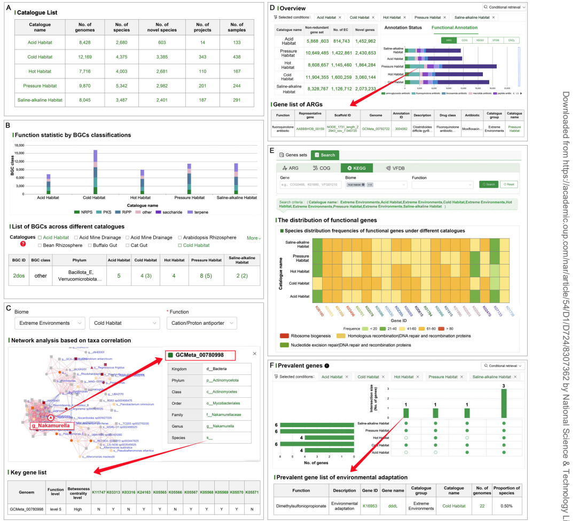

## Introduction

生命世界由微生物主宰，它们驱动生物地球化学循环，作为动植物共生体支撑宏观生命，并代表了已知生命的绝大部分多样性。然而，绝大多数微生物多样性仍属“生物暗物质”：尽管宏基因组技术可直接从测序数据中研究微生物，但绝大多数微生物难以实验室培养，且微生物基因编码的功能空间仅有一小部分被表征。尽管测序数据呈指数增长，但主要微生物栖息地仍研究不足，几乎每个新测序的宏基因组都会增加“新”物种和数千个功能未知的“新”基因。

现有资源如QIITA、MGnify等主要聚焦于提供大型基因或基因组目录、功能与分类分析，或协调异构数据，但通常局限于单一微生物栖息地或将不同栖息地数据隔离。SPIRE和gcMeta旨在弥补这一空白，通过整合全球多样本、统一分析流程，提供跨环境、跨物种的比较分析框架，推动微生物多样性、功能和适应性的行星尺度研究。

- SPIRE是一个可搜索的行星尺度集成微生物组资源，其首版整合了来自739项研究的99,146个宏基因组样本，基于16 Tbp的宏基因组组装数据，包含了11.6万个中高质量宏基因组组装基因组（MAG）和350亿个预测蛋白质序列。这些MAG与高质量参考基因组共同形成133,402个物种水平聚类，其中78,804个利用现有工具无法在物种水平分类。
- gcMeta则集成超过270万个MAG，构建了50个生物群落特异性MAG目录，包含109,586个物种水平聚类，其中63%为未表征类群，并注释了超过3.17亿个基因。两者均提供多层次功能注释、分类分析工具，并支持与其他生物资源互操作，极大促进了微生物比较基因组学与生态学研究。

| 特征 | SPIRE | gcMeta |
|------|-------|--------|
| **开发国家/机构** | 欧洲分子生物学实验室（EMBL，欧洲多国） | 中国科学院微生物研究所（中国） |
| **数据规模** | 99,146个样本，116万MAGs，350亿蛋白序列 | 超过270万MAGs，3.17亿基因 |
| **物种水平聚类** | 133,402个（78,804个未分类） | 109,586个（69,248个新物种） |
| **官网** | https://spire.embl.de/ | https://gcmeta.wdcm.org/ |

## 方法

### SPIRE数据库构建

SPIRE核心数据集通过半自动流程结合三个数据源构建：欧洲核苷酸档案（ENA）中符合特定标准的样本、JGI的IMG/M资源中的样本以及手动选择的特定研究样本。经过数据过滤与去重后，最终数据集包含99,146个宏基因组样本。

样本背景数据通过ENA注释字段、IMG/M元数据表以及匹配出版物进行整合，并使用新开发的包含92个术语的“微本体”进行手动注释。该本体采用多标签系统描述微生物栖息地和生活方式。

宏基因组序列处理通过Nextflow流程实现，包括使用NGless进行质量修剪和过滤，使用MEGAHIT进行组装，使用Prodigal预测开放阅读框（ORF）。MAG的分箱通过metaBAT2完成，并经过严格质量过滤（CheckM2完整性≥50%，污染≤10%）。MAG通过两步流程映射至proGenomes3参考基因组或聚类为新物种水平聚类。功能注释通过eggNOG-mapper等进行。

### gcMeta数据库构建

gcMeta收集NCBI SRA中截至2024年8月的公共宏基因组数据集，使用BBDuk进行接头去除和质量修剪，宿主相关样本使用Bowtie2去除宿主序列。组装使用SPAdes或MEGAHIT，分箱使用MetaWRAP，质量过滤后保留完整性≥50%且污染≤10%的MAG。此外，从IMG/M、MGnify、SPIRE和mOTUs等外部资源补充MAG。样本使用GOLD五级层次进行生物群落分类。物种水平聚类使用dRep在95%平均核苷酸一致性和30%最小重叠下完成。功能注释涵盖 taxonomy、ORF、代谢途径、抗生素抗性基因（ARG）、毒力因子（VF）、移动遗传元件（MGE）和防御系统等。

## 结果

### SPIRE资源概览

SPIRE整合了99,146个样本，覆盖从极地到极地的纬度范围，约200个国家和地区。样本中68%被注释为“宿主相关”，17%为水生样本，13.5%为陆地样本，10.3%来自人为或受人类影响的环境。从16 Tbp的组装数据中，获得了11.6万个中高质量MAG，其中30.9万个MAG未映射到已知参考基因组，形成了92,134个新的物种水平聚类。这些聚类被分类为178个不同门，其中79,782个聚类在物种水平未分类，表明SPIRE涵盖了大量先前未描述的微生物多样性。

### gcMeta资源概览

gcMeta集成了超过270万个MAG，构建了50个生物群落特异性MAG目录，包含109,586个物种水平代表性MAG，其中69,248个（63%）为新物种，以及超过3.17亿个基因，其中7490万个为新基因。海洋海水目录包含最多物种（128,151个MAG，13,907个物种）。不同生物群落的基因集比较显示，酸性矿山排水目录中超过35%基因为新基因，而人类阴道目录中新基因比例最低（约9%）。功能基因比较发现，与环境相关的目录相比，宿主相关目录中与elfamycin抗生素相关的ARG比例较低；与水杨酸抗生素相关的ARG在淡水栖息地中明显占优；宿主肠道中与免疫调节相关的VF更占主导，而极端环境和植物根际中与运动性相关的VF比例较高。

### 案例研究：极端环境比较分析

gcMeta对极端环境（酸性、寒冷、炎热、高压、盐碱）的五种MAG目录进行了比较分析，共获得2,680、4,375、4,003、5,342和3,487个物种水平代表性基因组，涵盖147个细菌门和19个古菌门，其中超过60%为新物种。对次级代谢物生物合成基因簇（BGC）的分析揭示了五种栖息地中共有55,145个推定BGC，寒冷栖息地中萜烯簇占主导，可能有助于光捕获和氧化应激中和；而热、压力和盐碱栖息地中富含核糖体合成和翻译后修饰肽（RiPPs），可能参与群体感应、渗透调节和细胞代谢。功能关键类群分析发现，寒冷栖息地中一种来自Nakamurella（放线菌门）的新物种编码多个阳离子/质子逆向转运蛋白，赋予强大的Na+(K+)/H+转运能力以维持细胞内渗透平衡和pH稳定性。非冗余基因集比较显示，每种栖息地均包含超过20%的新基因，寒冷栖息地新基因比例最高（25.7%），而酸性栖息地注释功能酶的比例最高（13.8%）。

## 讨论

SPIRE提供了迄今为止最大规模的一致处理的宏基因组、新生成的MAG和可分析的微生物物种聚类集合，结合高度策展和多种数据模式的集成，是研究微生物多样性和功能最全面的资源。其覆盖广泛的栖息地和地理范围，支持真正的“行星尺度”微生物组分析。gcMeta通过整合全球宏基因组样本和MAG数据，提供了最大的生物群落特异性MAG目录集合，建立了跨目录比较框架，用于微生物群落、关键类群和功能库的比较，同时揭示了大量未知物种和新基因。

两者均通过精心策展的元数据、基因组和基因，提供了用户友好的访问、搜索、浏览、分析和下载工具。它们填补了“序列发现”和“功能利用”之间的空白，实现了微生物资源的系统挖掘和生态过程的精确调控。值得注意的是，SPIRE中大量未分类物种可能部分源于gtdb-tk分类器的保守参数设置（偏向特异性而非敏感性），但这表明其覆盖了先前未表征的巨大多样性。

## 结论

SPIRE和gcMeta作为全球微生物组资源的重要代表，通过整合海量数据、统一分析流程、提供丰富注释和比较分析功能，极大地推动了微生物组研究。SPIRE侧重于行星尺度的多样性探索和资源整合，而gcMeta强调跨生物群落的比较分析和功能挖掘，特别是关键类群鉴定和AI就绪数据集构建。两者均持续更新，未来将扩展数据覆盖、增强功能挖掘、引入新工具，并深化与其他资源的集成。这些资源将为科学研究、生态保护、工业生物技术和新基因挖掘提供强大支持，助力揭示微生物世界的奥秘。

## Reference
1. Thomas S B Schmidt, Anthony Fullam, Pamela Ferretti, Askarbek Orakov, Oleksandr M Maistrenko, Hans-Joachim Ruscheweyh, Ivica Letunic, Yiqian Duan, Thea Van Rossum, Shinichi Sunagawa, Daniel R Mende, Robert D Finn, Michael Kuhn, Luis Pedro Coelho, Peer Bork, SPIRE: a Searchable, Planetary-scale mIcrobiome REsource, Nucleic Acids Research, Volume 52, Issue D1, 5 January 2024, Pages D777–D783, https://doi.org/10.1093/nar/gkad943
2. Yan Sun, Qi Chen, Guomei Fan, Qinglan Sun, Qing Zhou, Jiaqing Zhang, Jingyi Nie, Juncai Ma, Linhuan Wu, gcMeta 2025: a global repository of metagenome-assembled genomes enabling cross-ecosystem microbial discovery and function research, Nucleic Acids Research, Volume 54, Issue D1, 6 January 2026, Pages D724–D733, https://doi.org/10.1093/nar/gkaf1115
