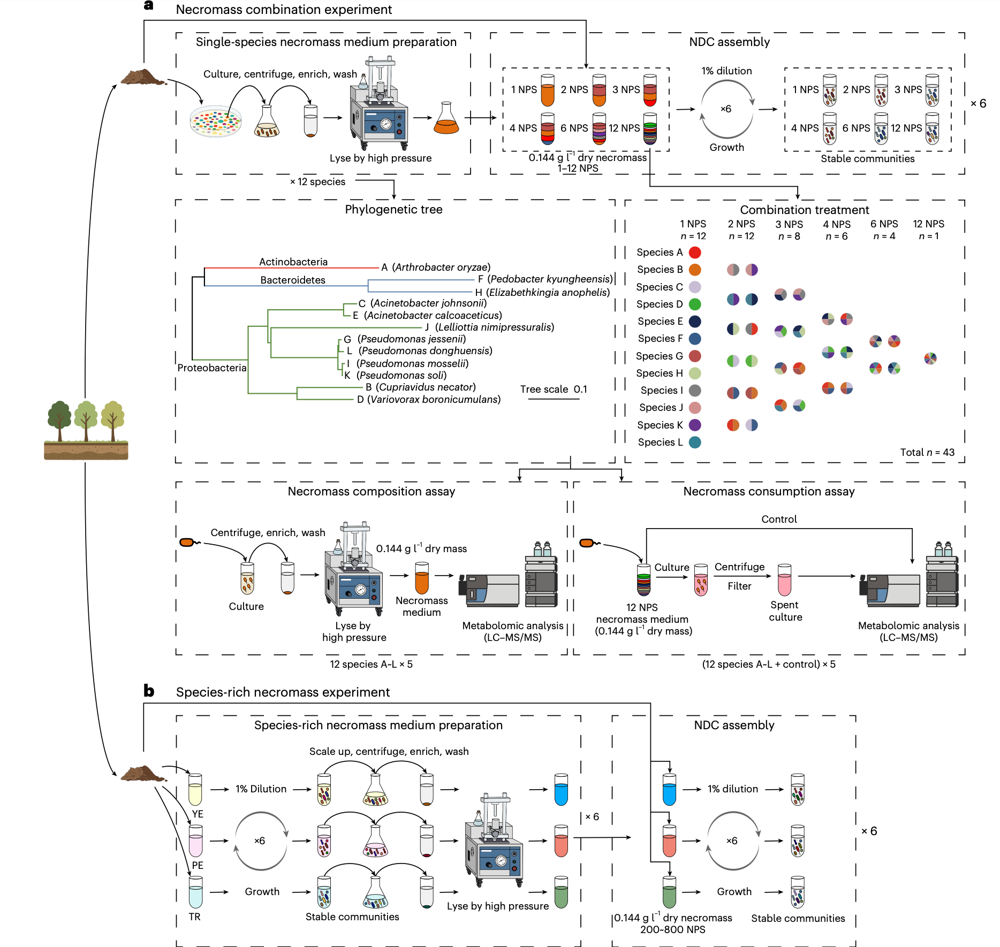
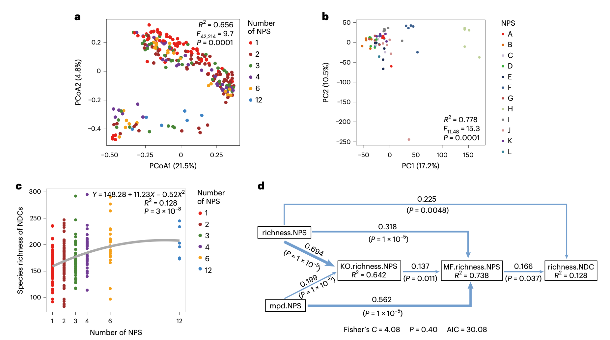
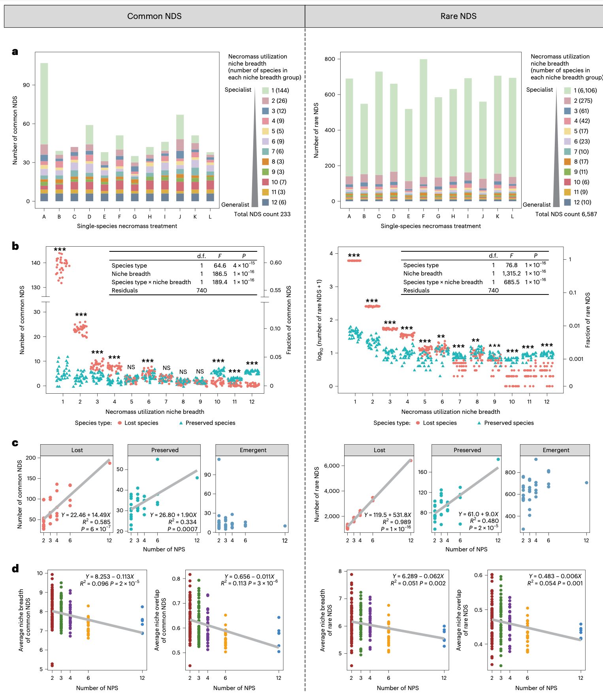
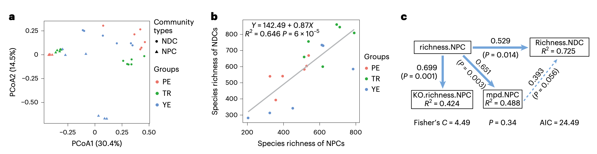

## Introduction

细菌残体是细菌死亡后释放的细胞物质，含有丰富的营养成分，如氨基糖、脂质、蛋白质、多糖和核酸等。由于其低C/N比和高含量的有机氮、磷，细菌残体被视为细菌的高质量营养底物。在贫营养的自然环境中，细菌残体循环可能为细菌提供额外的资源生态位，但其对细菌多样性维持的潜在影响尚未被系统研究。根据生态位理论，物种共存的数量受限于限制性资源的数量。细菌残体循环可能通过资源分配机制促进多样性维持，但其前提条件包括：（1）不同细菌物种产生化学组成独特的残体；（2）细菌在利用不同残体时表现出差异化的偏好和效率。

- Hao, YQ., Li, BH., Chen, JY. et al. Bacterial necromass recycling promotes diversity maintenance in bacterial communities via resource partitioning. Nat Ecol Evol (2026). https://doi.org/10.1038/s41559-025-02967-2
- 期刊：Nature Ecology & Evolution （IF 14.2）
- 发表时间：2026年1月28日

## 方法

研究设计包括两个独立实验：残体组合实验和物种丰富残体实验。

### 残体组合实验
研究人员从森林表土样品中分离出12种细菌物种，涵盖3个主要门类和8个不同属。通过高压破碎法制备单物种残体培养基，并将其随机组合成不同物种丰富度的残体处理（1、2、3、4、6和12种物种）。每个处理设置6个重复，共43种残体组合。土壤悬浮液接种到这些残体培养基中，经过6次传代培养（每48小时转移1%菌液），获得稳定的残体分解群落（NDCs，necromass-decomposing communities）。

### 物种丰富残体实验
从同一地点采集第二份土壤样品，通过在不同营养介质（胰蛋白胨、蛋白胨No.3和酵母提取物）中培养土壤细菌群落，获得18个自组装残体产生群落（NPCs，necromass-producing communities），其物种丰富度范围为204-791种。这些NPCs的残体被制备成培养基，并用于培养NDCs，实验流程与残体组合实验一致。

### 数据分析
通过16S rRNA扩增子测序分析群落组成，利用液相色谱-质谱联用（LC-MS/MS）技术表征残体的代谢组学特征。统计分析方法包括主坐标分析（PCoA）、结构方程模型（SEM）和零模型检验，以验证资源分配机制。

## 结果

### 不同残体组合支持独特的细菌群落

研究发现，不同残体组合维持的NDCs在物种组成上存在显著差异（PERMANOVA，F42,214 = 9.71，P = 0.0001），其组成差异与残体产生组合的组成异质性、系统发育距离和功能基因组成差异呈正相关。代谢组学分析进一步表明，12种单物种残体具有物种特异性的代谢组学特征，其中70.2%的注释代谢物在物种间存在显著丰度差异。此外，不同细菌物种在利用残体时表现出差异化的偏好，仅消耗12物种残体培养基中14.8%-24.2%的代谢物。

### NDCs物种多样性随NPS多样性增加而增加

在残体组合实验中，NDCs的物种丰富度与NPS数量呈正相关但逐渐饱和的二次关系（图2c）。结构方程模型显示，NPS数量及其系统发育距离通过功能基因多样性和代谢组学特征多样性间接促进NDCs丰富度。在物种丰富残体实验中，NDCs丰富度与NPCs丰富度呈线性正相关，每个额外NPS平均支持0.87个更多物种。

### NDCs的组装规则

通过分析物种在单物种残体中的出现情况，研究发现78.1%的常见物种（相对丰度≥0.1%）仅在少于4种单物种残体中出现，表明大多数物种为残体利用的专性菌。随着NPS数量增加，共存物种的平均生态位宽度和重叠度显著下降，支持资源分配机制。广义物种（生态位宽度大）在多物种残体中保存率较高，但狭义物种（生态位宽度小）因数量优势成为多样性增加的主要贡献者。

### 物种丰富残体实验重现主要结果

在物种丰富残体实验中，NDCs的物种丰富度与NPCs丰富度呈线性正相关，每个额外NPS平均支持0.87个更多物种。NDCs的组成与对应NPCs显著不同，87.0%-94.2%的NDCs物种在对应NPCs中不存在。结构方程模型显示，NPCs丰富度对NDCs丰富度具有直接正向效应，而系统发育距离的影响不显著。

### 排除NPS的补充分析与全数据集分析结果一致
为排除残体中残留DNA的潜在影响，研究人员进行了补充分析，从NDCs中去除对应的NPS序列。分析结果显示，过滤后的数据与全数据集分析结果在质量上一致，证实了主要结论的稳健性。特别值得注意的是，11个NPS中的大多数在利用其他物种残体时比利用自身残体获得更高丰度，表明它们确实是真正的残体分解菌。

## 讨论

本研究通过两个独立实验证实了细菌残体循环对细菌多样性维持的促进作用，并揭示了资源分配是其中的关键机制。研究发现，细菌残体循环通过提供多样化的营养生态位，支持了土壤中丰富的细菌残体分解菌群（necrobiome）的存在。与以往关注代谢交叉喂养（cross-feeding）的研究不同，本研究强调残体循环作为一种独立的多样性维持机制，其效果在自然土壤中可能更为显著，原因包括：（1）不同死亡途径产生的残体化学组成差异；（2）土壤中残体的空间异质性分布；（3）自然群落更高的功能多样性。

此外，研究发现残体循环可能驱动细菌群落的时间周转，促进时间生态位分配。尽管研究主要聚焦土壤微生物生态，但残体循环在海洋、地下水等多种生态系统中普遍存在，其机制可能具有普适性。未来的研究需进一步探讨自然环境中残体循环的复杂过程，如矿物结合有机质的形成与再循环。
