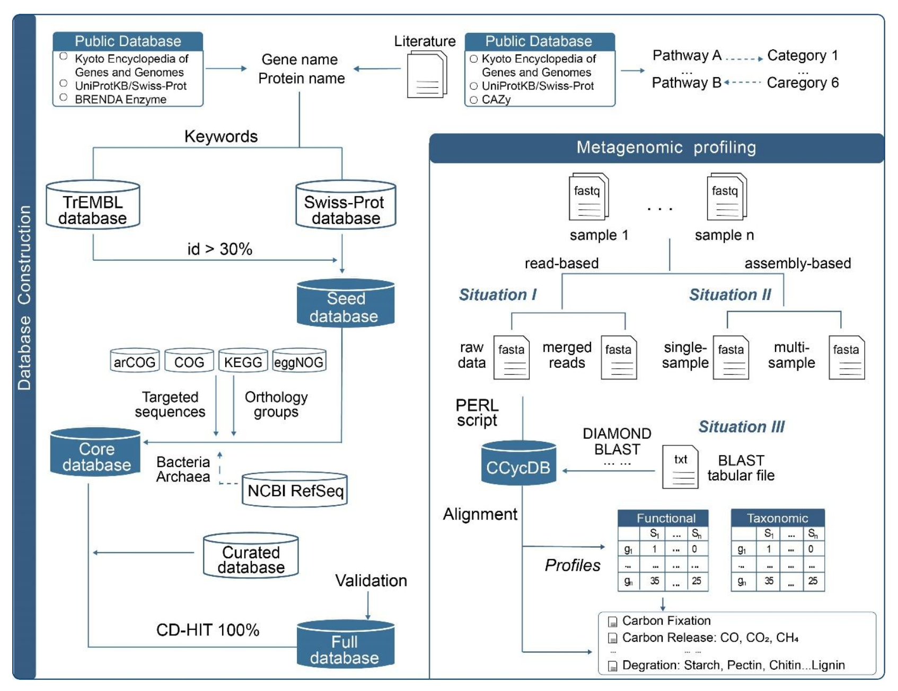
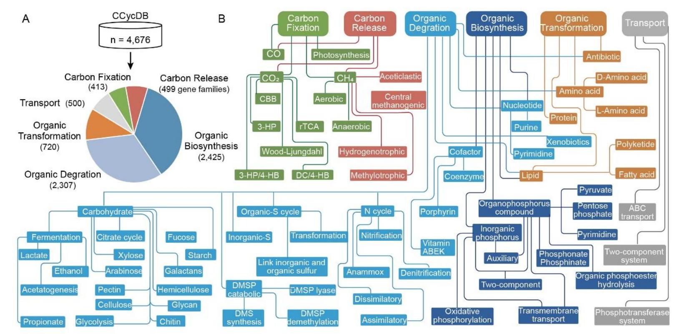

## Introduction

生物地球化学循环是维持地球生命系统稳定的基础，其中微生物群落通过代谢活动驱动碳固定与释放、氮转化、磷活化、硫氧化还原及甲烷产生与消耗等关键过程。随着高通量测序技术的普及，宏基因组学已成为研究环境微生物功能多样性的主要手段。然而，现有通用型同源基因数据库存在功能注释模糊、特定循环基因覆盖不全、同源序列干扰等问题，难以满足元素循环研究的精准需求。
针对这一挑战，研究人员系统性地构建了CNPS与甲烷循环功能基因数据库系列，包括NCycDB（氮循环）、PCycDB（磷循环）及相应的碳、硫、甲烷循环数据库。这些数据库采用统一的高标准构建框架，通过人工审校、多数据库整合、同源序列控制等技术，显著提升了功能基因注释的准确性与特异性。

以下是针对氮（N）、磷（P）、硫（S）、甲烷（CH₄）及维生素B12（VB12）循环的专门化数据库及其官方下载地址汇总表。这些数据库通常以开源形式发布在 GitHub 平台，供科研人员下载使用。

| 数据库名称 | 全称 | 主要功能 | 官方网址/下载地址 |
| :--- | :--- | :--- | :--- |
| **CCycDB** | Carbon Cycling Database | 用于环境微生物组碳循环过程的全面分析，包含4676个基因家族，覆盖碳固定、碳释放、有机合成、降解和转化等多个环节。|https://github.com/ccycdb/ccycdb.github.io |
| **NCycDB** | Nitrogen Cycling Database | 用于宏基因组中氮循环基因（子）家族的快速准确分析，涵盖固氮、硝化、反硝化等过程。 | https://github.com/qichao1984/NCyc  |
| **PCycDB** | Phosphorus Cycling Database | 用于磷循环基因的快速分析，包含139个基因家族，覆盖10个磷代谢过程。 | https://github.com/ZengJiaxiong/Phosphorus-cycling-database  |
| **SCycDB** | Sulfur Cycling Database | 用于硫循环途径宏基因组分析的功能基因数据库，包含207个基因家族。 | https://github.com/qichao1984/SCycDB  |
| **MCycDB** | Methane Cycling Database | 用于环境微生物组甲烷循环过程的全面分析，包含298个基因家族。 | https://github.com/qichao1984/MCycDB  |

我们以2026年最新发表的CCycDB碳循环数据库预印本为例：

## 方法

### 数据库构建框架
CCycDB采用三阶段标准化构建流程：

**种子数据库构建**：基于UniProt、BRENDA等权威数据库，通过关键词检索获取目标功能基因序列，按30%相似度阈值聚类，剔除异常序列。

**核心与全数据库构建**：整合arCOG、COG、eggNOG、KEGG等四大同源数据库，纳入同源序列作为阴性对照，解决"小数据库"导致的假阳性问题。同时集成SCycDB、PCycDB、MCycDB等专业数据库，完善碳循环与其他元素循环的耦合关系。

**质量控制**：采用CD-HIT工具以100%相似度剔除冗余序列，保留代表性序列构建最终数据库。

### 功能与分类注释

支持基于reads和组装contigs两种数据处理模式。通过DIAMOND、BLAST等工具进行序列比对，生成功能基因丰度表和分类学信息。引入同源基因家族作为阴性对照，显著降低假阳性注释率。

## 结果

### 数据库规模与结构

CCycDB包含4676个基因家族，划分为六大功能类别：
- 碳固定：413个基因家族，涵盖CO、CO₂、CH₄固定三大途径
- 碳释放：499个基因家族，涉及CO、CO₂、CH₄释放过程
- 有机合成：2425个基因家族，覆盖12个一级子类别
- 有机降解：2307个基因家族，按底物类型划分15个子类别
- 有机转化：720个基因家族，针对难降解有机物
- 转运蛋白：500个基因家族，涉及多种转运系统

### 性能验证
在人工构建数据集测试中，CCycDB的准确率达99.6%，F1分数0.99，显著优于KEGG（72.84%）和eggNOG（84.10%）。特异性、精确度和召回率等指标均表现优异，假阳性率低于1%。

### 环境应用
在海洋表层、深层叶绿素最大层、中深层水体、水产养殖、森林土壤、红树林沉积物和永久冻土等七种生境的宏基因组分析中，CCycDB成功揭示了碳循环功能基因的显著生境特异性差异。红树林沉积物中检测到最多的碳循环基因家族（2700±46个），而海洋表层和森林样本相对较少。分类学分析显示，不同生境中主导碳循环的微生物类群存在显著差异。

## 讨论
CCycDB通过人工审校和同源序列控制，解决了传统数据库存在的功能注释模糊问题。例如明确区分了pmoA与amoA、psrA与phsA等同源基因，避免了功能注释混淆。数据库涵盖多种关键碳循环基因，包括RuBisCO、CODH、DMSP裂解酶等，并整合了CAZy数据库信息，完善了碳水化合物代谢相关注释。

该数据库还考虑了碳循环与其他元素循环的耦合机制，如DMSP代谢途径同时涉及碳和硫循环。通过精准的功能基因注释，CCycDB为解析微生物群落对环境变化的响应机制提供了可靠工具。

这个课题组还构建了针对氮、磷、硫、甲烷循环以及维生素B12合成的专门数据库，形成了一个完整的元素循环功能基因数据库体系：

## 其他元素循环数据库

随着宏基因组测序技术的飞速发展，针对特定元素循环的功能基因数据库已成为解析微生物生态功能的关键工具。除了本文构建的CCycDB外，针对氮（N）、磷（P）、硫（S）、甲烷（CH₄）等关键元素的循环过程，研究人员已开发了一系列专门化的数据库。这些数据库通过手动整理和严格筛选，极大地提高了宏基因组注释的准确性和覆盖率，为深入理解微生物驱动的生物地球化学循环提供了有力支撑。

### 氮循环数据库（NCycDB）
氮是构成生命体的基本元素之一，其循环过程涉及固氮、硝化、反硝化等多个关键环节。NCycDB是一个手动整理的综合性数据库，专门用于宏基因组数据中氮循环基因（子）家族的快速准确分析。该数据库包含了68个基因（子）家族，覆盖了8个氮循环过程（如硝化、反硝化、固氮等），提供了84,759条代表性序列（95%一致性阈值）。为了解决“小数据库问题”导致的假阳性分配，NCycDB还识别并包含了1,958个同源基因家族。应用NCycDB分析全球海洋采样数据发现，氮循环基因家族的结构和组成与纬度和温度呈最强相关性。

### 磷循环数据库（PCycDB）
磷是能量代谢和遗传物质的关键组成部分，微生物在磷循环中扮演着溶解无机磷和矿化有机磷的重要角色。PCycDB是一个全面且准确的磷循环数据库，涵盖了139个基因家族和10个磷代谢过程。该数据库的一个显著特点是纳入了以往被忽视的磷循环基因，例如编码磷酸盐不敏感磷酸酶的*pafA*基因、磷酸盐相关基因（*ptxABCD*）以及新型的2-氨基乙基膦酸转运蛋白基因（*aepXVWPS*）。PCycDB在模拟基因数据集上的注释准确率高达99.8%，特异性为99.8%，相比其他数据库具有更高的覆盖率和准确性。

### 硫循环数据库（SCycDB）
硫是地球生物圈中的必需元素，微生物驱动的硫循环对于生态系统功能至关重要。SCycDB是一个手动整理的硫循环功能基因数据库，旨在对宏基因组中的硫循环功能基因和分类群进行准确分析。该数据库包含207个基因家族和585,055条代表性序列，隶属于52个门和2,684个属的细菌/古菌。为了减少假阳性序列分配，SCycDB还纳入了20,761个同源基因家族。应用SCycDB分析不同生境（淡水、温泉、海洋沉积物和土壤）发现，硫还原相关的基因家族和微生物在海洋沉积物中丰度较高，而硫氧化和二甲基硫丙酸（DMSP）转化相关的基因在土壤中丰度较高。

### 甲烷循环数据库（MCycDB）
甲烷是一种重要的温室气体，其循环过程与碳、氮、硫等元素的生物地球化学循环紧密耦合。MCycDB是一个手动整理的数据库，用于全面分析环境微生物组中的甲烷循环过程。该数据库包含298个甲烷循环基因家族，覆盖10个甲烷代谢途径，拥有610,208条代表性序列。MCycDB涵盖了来自NCBI RefSeq数据库的参考序列，涉及48个细菌门和5个古菌门。应用MCycDB分析不同环境样本发现，产甲烷相关的基因家族在温泉沉积物中丰度较高，而在淡水中较低；好氧甲烷氧化相关的基因在永久冻土和泥炭地中丰度较高。

这些专门化的数据库与CCycDB共同构成了一个强大的工具集，使得研究人员能够从宏基因组数据中更精确地挖掘微生物在元素循环中的功能潜力，为理解全球生物地球化学循环的微生物机制提供了重要的数据基础。

## References
1. Zhou, J. et al. CCycDB: an integrative knowledgebase to fingerprint microbially mediated carbon cycling processes. 2026.01.28.702190 Preprint at https://doi.org/10.64898/2026.01.28.702190 (2026).
2. Zeng, J. et al. PCycDB: a comprehensive and accurate database for fast analysis of phosphorus cycling genes. Microbiome 10, (2022).
3. Qian, L. et al. MCycDB: a curated database for comprehensively profiling methane cycling processes of environmental microbiomes. Mol. Ecol. Resour. 22, 1803–1823 (2022).
4. Yu, X. et al. SCycDB: a curated functional gene database for metagenomic profiling of sulfur cycling pathways. Mol. Ecol. Resour. 21, (2020).
5. Tu, Q., Lin, L., Cheng, L., Deng, Y. & He, Z. NCycDB: a curated integrative database for fast and accurate metagenomic profiling of nitrogen cycling genes. Method. Biochem. Anal. 35, 1040–1048 (2019).
