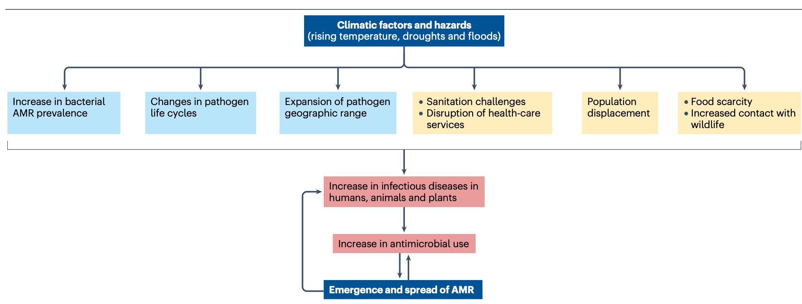
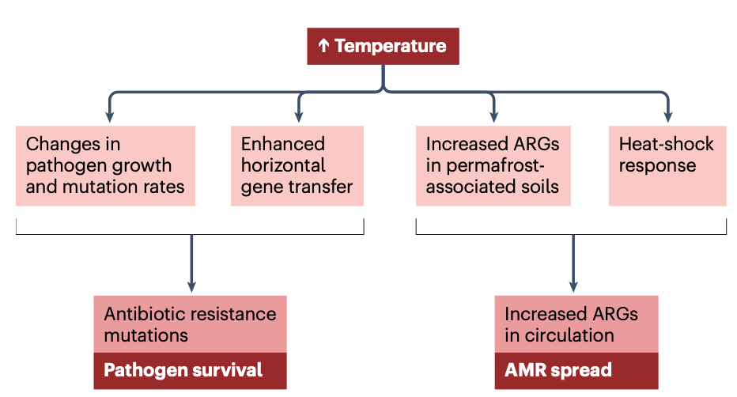
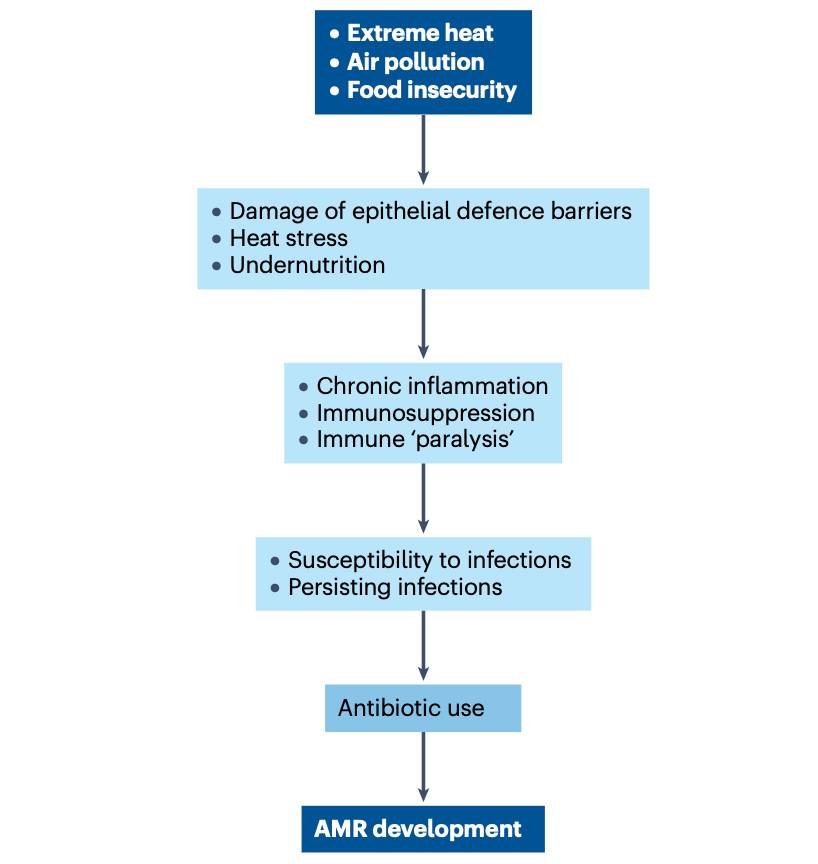

## Introduction

气候变化与抗菌药物耐药性（AMR）均为全球公共卫生重大挑战。现有证据表明，气温升高和极端天气可通过多种途径影响AMR：包括增加感染性疾病负担从而推高抗菌药物需求、促进病原体适应性进化、加速耐药基因水平转移等。然而，当前研究多呈现生态学相关性，因果机制尚未完全阐明。

- Kalanxhi, E., Laxminarayan, R. Climate change and antimicrobial resistance. Nat Rev Microbiol (2026). https://doi.org/10.1038/s41579-026-01285-z
- 发表时间：2026年2月6日

本文系统梳理了气候-AMR关联的科学证据，强调需通过加强监测、改善卫生基础设施和优化抗菌药物使用等综合策略应对这一双重威胁。

AMR每年导致约770万细菌感染相关死亡，其中约六分之一直接归因于耐药感染。侵袭性真菌感染年发病650万例，相关死亡达380万例，且抗真菌耐药性问题日益突出。尽管AMR存在自然发生机制，但抗菌药物滥用显著加速其进程。与此同时，气候变化引发的环境剧变（如高温、洪涝、永久冻土融化）正重塑病原体与宿主的相互作用模式。研究表明，58%的人类致病性疾病对气候变化敏感，通过千余种传播途径（媒介传播、水源性、气源性等）加剧疾病负担。气温升高与耐药菌检出率的正相关性已在多项研究中得到验证，但社会经济因素与气候因素的交互作用使因果推断复杂化。

## 传染病发病率与传播

### 气温升高增加细菌感染率

气候因素显著影响病原体生态分布。对全球百万个微生物群落测序分析显示，88%的样本含人类致病菌，其丰度与气温、降水等气候参数密切相关。革兰阴性菌血流感染呈现明显温度依赖性：气温每升高10°C，大肠杆菌、肺炎克雷伯菌等感染发生率显著增加。地域分析表明，靠近赤道地区及医疗支出较低的国家的感染负担更重，提示气候与卫生系统的协同影响。

### 温度对细菌耐药性的影响

气温升高不仅增加感染风险，还直接关联耐药性发展。美国数据显示，环境温度每升高10°C，主要病原菌耐药率上升2.2%-4.2%。中国研究发现，年平均气温升高1°C与第三代头孢菌素耐药肺炎克雷伯菌检出率增加4.7%相关。值得注意的是，温度-耐药性关系呈非线性特征：大肠杆菌对氟喹诺酮类耐药性在27°C时达峰值（增加256倍），42°C时反而下降。社会经济因素显著调节该关联，低收入地区的气候-AMR效应更为显著。

### 细菌对温度与抗生素的双重应激反应

温度应激与抗生素应激存在分子机制重叠。热休克蛋白DnaK在耐碳青霉烯类鲍曼不动杆菌中高表达，且高温预处理可增强细菌对链霉素的耐受性。研究表明，细菌为适应高温进化出的RNA聚合酶突变，可同时导致对利福平的交叉耐药，提示气候适应可能驱动AMR进化。

### 极端天气加剧疾病传播

洪涝、干旱等灾害破坏供水与卫生设施，导致人口流离失所和医疗系统崩溃。2018年津巴布韦霍乱疫情中，241例患者有240例对头孢曲松耐药，溯源发现与先前伤寒疫情中广谱头孢菌素的过度使用直接相关。干旱导致水源性病原体浓度升高，而洪涝促进污水中的耐药基因扩散，形成环境-人类传播闭环。

### 气候变化改变病原体季节性与媒介分布

气候变暖使疟疾、登革热等媒介传播疾病向高纬度扩张，欧洲和北美将成为新发区域。病毒性呼吸道感染季节紊乱导致抗生素误用，而寄生虫病地理范围扩大增加宿主继发细菌感染风险。农业领域，热浪导致牲畜代谢紊乱和免疫抑制，水产养殖因环境压力和高密度养殖面临耐药病原体传播风险。

## 抗菌药物使用增加

### 医疗卫生领域抗生素使用

2016-2023年全球抗生素使用量增长10.6%，预计2030年将再增52.3%，其中37%为不合理用药。气候变化通过改变疾病流行模式（如流感季节延长）加剧抗生素滥用。低收入国家面临双重困境：耐药革兰阴性菌感染激增，却缺乏新型抗生素可及性。非洲11国研究显示，医疗机构使用的抗生素中90%集中于WHO基本药物目录的10%，反映药物选择严重受限。

### 动物健康领域抗生素使用

集约化养殖推动抗生素需求，目前动物用药占全球总量的70%，预计2030年达10.75万吨。水产养殖抗生素用量2017-2030年将增长33%，其中93.8%集中于亚太地区。全球模型证实动物抗生素使用与人类AMR显著相关，水产养殖耐药菌与临床分离株存在基因同源性。

## 气温升高与细菌耐药性

### 细菌突变率

温度直接影响突变率：40°C环境下大肠杆菌对环丙沙星和利福平的耐药突变率显著高于37°C。机制研究表明，热应激激活易错DNA聚合酶，而温度适应相关的RNA聚合酶突变可同时介导热耐受和抗生素耐药。

### 水平基因转移

质粒介导的耐药基因水平转移是AMR扩散关键途径。30°C时新德里金属β-内酰胺酶基因在沙门氏菌间的接合转移效率最高，显示温度存在最优区间。温度升高促进临床相关病原体接合效率，但效应受供体-受体相容性及环境因素调节。

### 环境中的耐药基因

水温升高导致黄河中ARGs丰度增加但多样性下降。永久冻土融化释放的ARGs在热喀斯特湖中富集，形成新的环境耐药库。冻土微生物中检出高比例氨苄西林耐药菌株，提示气候变化正在激活古老耐药基因库。

## 抗真菌耐药性

### 真菌病原体传播与耐药

侵袭性真菌感染年死亡370万例，耳念珠菌和曲霉菌耐药率分别达30%-60%和50%-100%。人体37°C体温原是抗真菌天然屏障，但气候变暖促使真菌进化出热耐受性。美国山谷热流行区预计2100年将扩大一倍，而治疗药物耐药性持续上升。

### 耳念珠菌的适应性进化

耳念珠菌耐受42°C高温的特性使其在气候变暖背景下迅速扩散，2015年已在三大洲形成独立进化支。热耐受性虽不直接导致耐药，但增强环境存活能力，配合农业唑类杀菌剂使用，形成"环境选择-临床传播"恶性循环。

### 农业抗真菌药物使用

唑类农药与临床抗真菌药物作用机制相同，导致环境曲霉菌耐药株向人类传播。土壤中分离的烟曲霉可耐受40°C高温，其唑类耐药性在慢性肺曲霉病患者中检出率显著升高，证实环境-临床耐药传播途径。

## 气候变化与宿主相关因素

### 免疫系统影响

极端高温和空气污染破坏上皮屏障功能，诱发慢性炎症，增加耐药感染易感性。气候相关免疫失调导致哮喘、自身免疫病等需长期使用抗生素的疾病激增。动物实验表明，免疫抑制本身即可导致抗生素治疗失败，与经典耐药机制无关。

### 极端天气与营养不良

干旱和洪涝造成粮食减产，全球1.49亿儿童面临急性营养不良。营养不良引发肠道屏障功能障碍和免疫缺陷，增加感染频率和抗生素使用时长。小鼠模型证实，营养不良可诱发"免疫麻痹"，使耐甲氧西林金黄色葡萄球菌感染风险倍增。

### 社会经济因素

人口密度与经济发展水平显著调节气候-AMR关联。欧洲研究显示，控制人均GDP和政府治理指标后，温度-AMR相关性消失。中国基于2000万份临床分离株的分析表明，抗生素用量、颗粒物污染和人口密度是AMR主要驱动因素，气候参数无独立影响。冲突地区因卫生系统崩溃，AMR负担尤为严重。

## 缓解措施

### 降低感染发生率

改善供水和卫生设施可年预防25万例AMR相关死亡，儿童疫苗接种可再减少18万例。这些措施在冲突和气候移民群体中效果最为显著。需关注排放责任与气候危害的错配：最不发达国家仅贡献3.8%的温室气体，却承担最严重气候后果。

### 优化抗生素使用

推广快速诊断技术可减少抗生素误用，尤其在极端天气期间的疫情控制中发挥关键作用。基于气候预测的废水基因组监测可建立AMR早期预警系统。低收入国家需平衡抗生素管控与可及性，减少50%全球用量仅能降低AMR 2.1%，而结合卫生系统改善的综合策略效果提升至5.1%。

### 可持续农业保障粮食安全

消除营养不良可显著增强人群抗感染能力。可持续农业实践、动物疫苗接种及抗生素替代品应用，可减少人畜共患病传播风险。需制定全球农药使用指南，评估交叉耐药风险，尤其关注唑类农药与临床抗真菌药物的协同效应。

## 结论

气候变化通过增强病原体热耐受、促进耐药基因水平转移、加剧人畜共患病传播等多途径恶化AMR危机。现有证据多为生态学研究，难以控制社会经济混杂因素，且缺乏剂量-效应关系验证。永久冻土融化释放的古老耐药基因、农业抗生素残留导致的土壤耐药库扩张等新型风险尚未量化。未来需开展跨物种（寄生虫、真菌）、跨地域（特别是冲突地区）的多层次研究，解析宿主年龄、性别、免疫状态等调节因素。尽管气候-AMR关联机制复杂，改善卫生基础设施、扩大疫苗接种、提升诊断能力等基础干预措施具有明确效益，应作为应对双重危机的优先行动。
