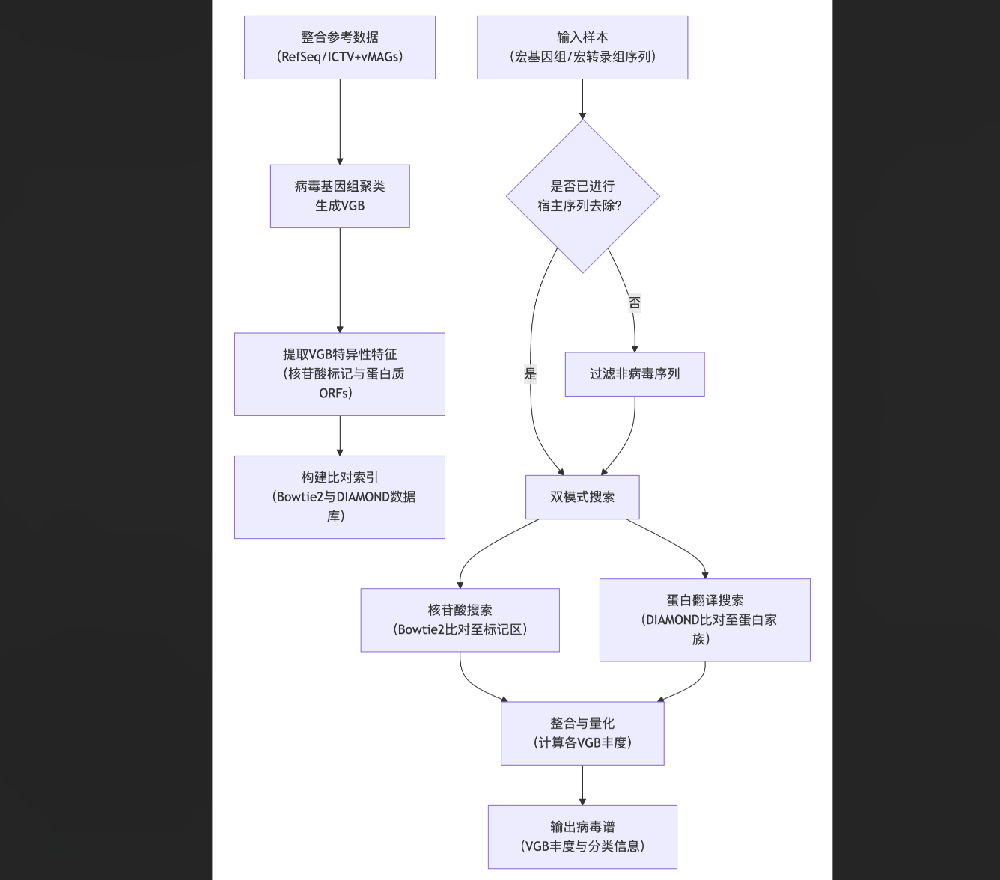
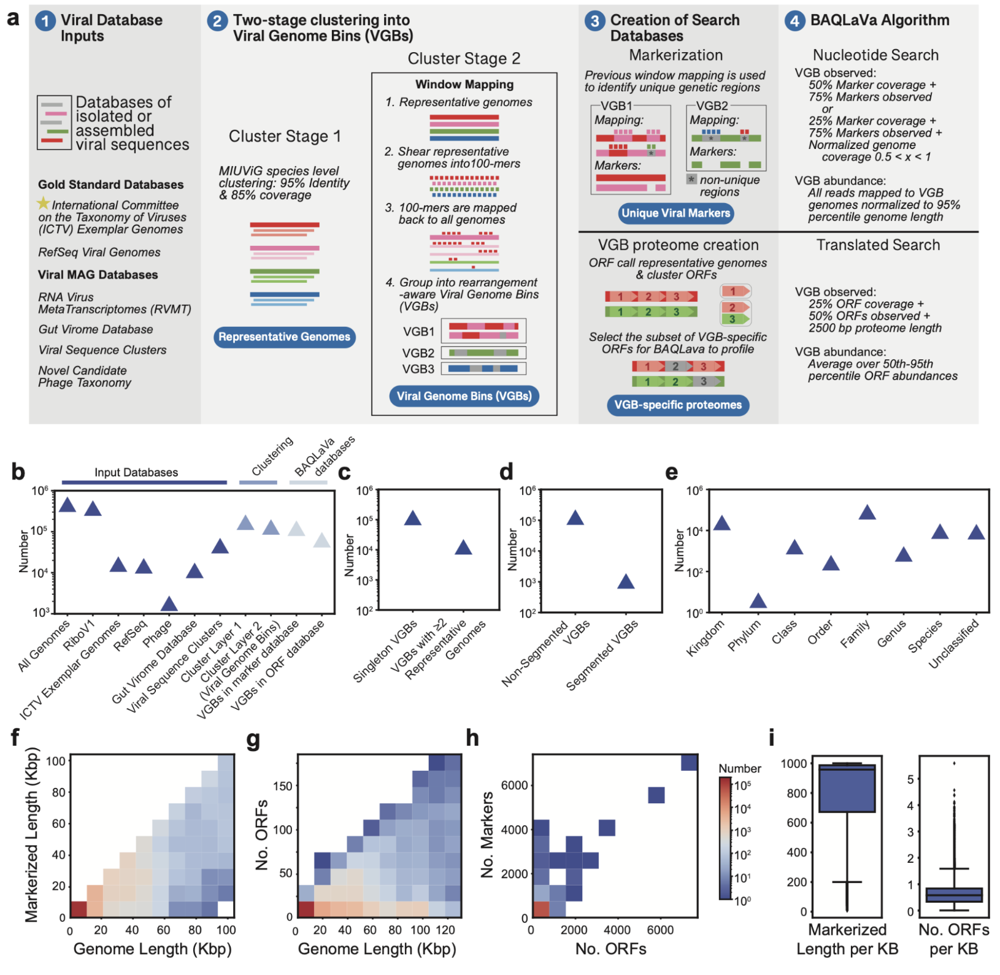
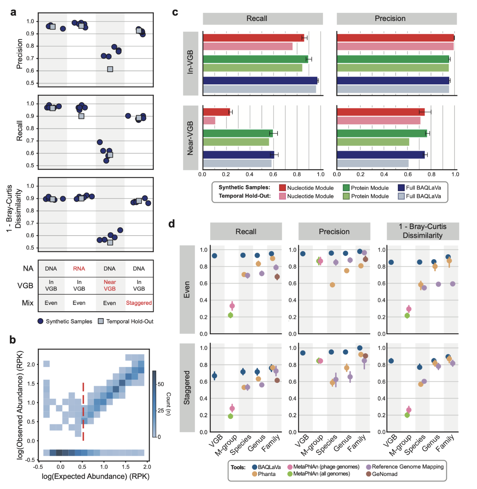
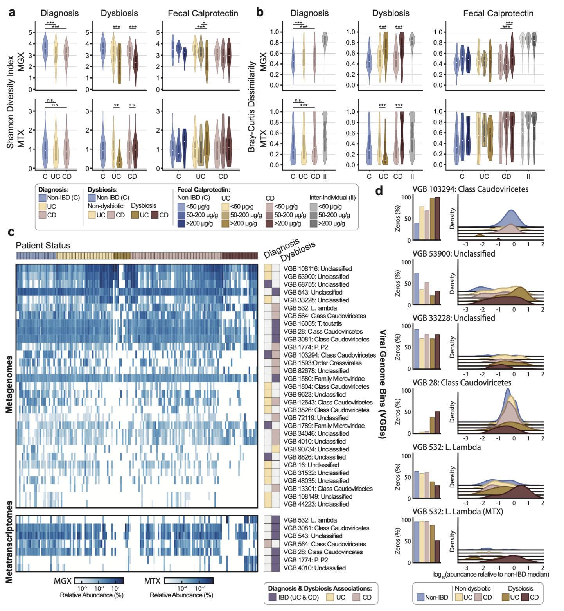
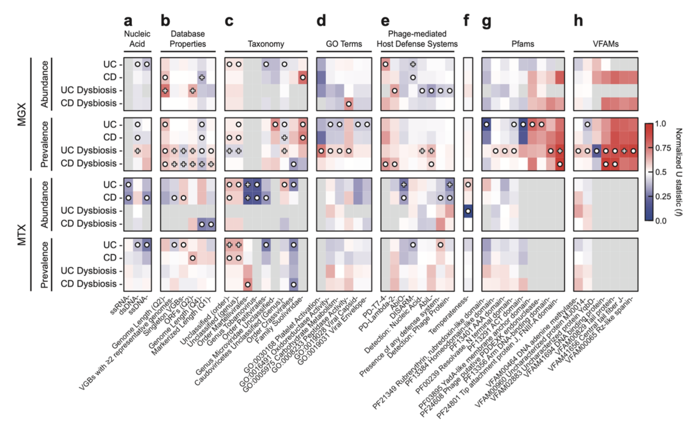
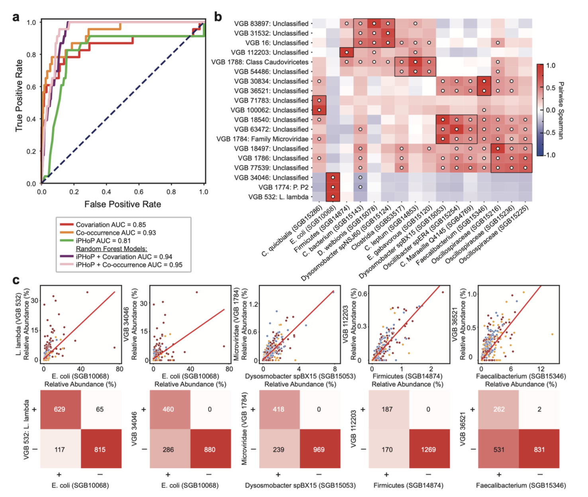

## Introduction

病毒是许多微生物生态系统中最丰富的生物实体，通过捕食、水平基因转移以及调节宿主代谢和适应性，在塑造群落结构和功能方面发挥着关键作用。噬菌体和真核病毒都已被证实与多种人类疾病（如炎症性肠病、糖尿病和结直肠癌）相关。然而，由于病毒基因组小、缺乏通用标记基因、测序数据中细菌序列占比高等生物和技术挑战，对复杂微生物群落中病毒进行准确的检测和定量仍十分困难。尽管宏基因组组装病毒基因组和分类方法有所发展，但大多数已知方法存在覆盖度有限、依赖计算密集型组装流程或分类分辨率低等局限。为了满足对高灵敏度、高特异性病毒谱分析的需求，作者开发了BAQLaVa算法，它整合了大规模病毒参考数据库，可直接从宏基因组或宏转录组数据中对病毒进行物种级量化，为病毒组流行病学和病毒-宿主相互作用的系统性分析提供了可扩展的框架。

Enhanced multi-omic viral profiling from microbial community sequencing with BAQLaVa
Jordan S. L. Jensen, Sagun Maharjan, Philipp C. Münch, Jiaxian Shen, Bailey Bowcutt, Jack T. Sumner, Xochitl C. Morgan, Kelsey N. Thompson, Long H. Nguyen, Eric A. Franzosa, Curtis Huttenhower
bioRxiv 2026.02.11.705346; doi: https://doi.org/10.64898/2026.02.11.705346

Curtis Huttenhower 课题组是哈佛大学陈曾熙公共卫生学院（Harvard T.H. Chan School of Public Health）及布罗德研究所（Broad Institute）下属的顶尖计算生物学实验室。该课题组致力于通过开发创新的生物信息学工具（如著名的 **bioBakery** 平台和 **HUMAnN** 软件）来解析微生物群落的功能，特别是在人类健康与疾病（如炎症性肠病 IBD、癌症、糖尿病）中的作用。他们深度参与了美国国立卫生研究院（NIH）的人类微生物组计划（HMP）及后续的 HMP2 项目，旨在将微生物组科学转化为精准的诊断标志物和潜在的治疗干预手段。

## 方法
BAQLaVa的构建与应用主要包括参考数据库构建、分析流程优化、性能验证以及在人肠道微生物组数据中的应用。其核心流程可归纳为下图所示的关键步骤：

### 构建综合病毒数据库
作者首先整合了NCBI RefSeq和国际病毒分类委员会（ICTV）的参考基因组以及多个大规模病毒基因组资源，形成一个包含超过17万个病毒基因组的初始集合。通过基于序列相似性的两阶段聚类流程，这些基因组被划分为127,366个病毒基因组簇。最终，121,932个VGB（95.7%）具有至少500 nt的独特核苷酸标记序列，63,786个VGB（50.1%）编码了VGB特异性蛋白，总共可用于检测122,099个VGB。

### BAQLaVa工作流程设计
BAQLaVa通过双搜索策略对宏基因组和宏转录组序列进行分析。核苷酸搜索使用Bowtie2将测序读段比对到VGB特异性核苷酸标记区域，以实现高特异性检测。翻译搜索使用DIAMOND将读段比对到VGB特异性蛋白质开放阅读框，以捕获更多样化的病毒序列。每种模式检测到的VGB丰度独立计算，最终的VGB总丰度取两者中的最大值，确保任一模式的高置信度检测均能被捕获。

### 验证与基准测试
研究团队使用来自独立数据集的合成病毒组样本对BAQLaVa进行系统优化和评估。这些样本涵盖了DNA与RNA病毒、在库与近库基因组以及均匀或阶梯式丰度分布等多种场景。他们还利用另一组在BAQLaVa数据库构建后提交至GenBank的基因组构建了时间保留样本，以评估算法对新基因组的泛化能力。性能评估指标包括召回率、精确度以及与真实组成的Bray-Curtis差异度。

### HMP2队列数据应用与统计分析
研究人员将BAQLaVa应用于HMP2炎症性肠病多组学数据库的1,626个宏基因组和816个配对宏转录组样本，以研究IBD相关的病毒动力学。他们计算了香农指数和观察到的丰富度来衡量α多样性，使用Bray-Curtis相异度评估β多样性（群落稳定性）。使用MaAsLin 3识别与疾病诊断或菌群失调状态显著相关的VGB。为了探究病毒特征与疾病的关联，研究人员为VGB注释了核酸类型、基因组长度、ORF数量等属性，以及Pfam、VFAM结构域、基因本体论术语和抗防御系统等信息。通过性状富集分析比较了特定性状VGB与所有其他VGB在效应值上的分布差异。

### 基于丰度相关的噬菌体-宿主关系预测
为了评估利用丰度相关性预测宿主关系的可行性，研究人员将BAQLaVa病毒谱与MetaPhlAn 4的细菌/古菌物种级基因组谱配对，使用Spearman相关性（协变）和Fisher精确检验（共现）两种方法。他们在一个由NCBI Virus注释的23对已知噬菌体-宿主关系上进行基准测试，并将相关性信号与iPHoP预测相结合，使用随机森林分类器评估整合模型的性能提升。

## 结果

### BAQLaVa以高准确度分析病毒
在合成病毒组基准测试中，BAQLaVa在所有测试条件下均表现出高准确度。对于数据库内（in-VGB）病毒，其平均召回率和精确度均超过90%（DNA病毒：召回率97.6%±0.9%，精确度95.9%±1.0%；RNA病毒：召回率97.0%±1.4%，精确度97.8%±1.6%）。对于近库（near-VGB）病毒（与参考序列存在一定差异），BAQLaVa仍能恢复部分最接近的类群分配（召回率61.0%±5.6%；精确度75.1%±3.3%）。在时间保留样本上，对于数据库内病毒，BAQLaVa保持了高准确度；对于近库病毒，性能虽有所下降，但仍能进行有意义的最邻近分配。定量分析表明，BAQLaVa能够检测到覆盖度低至0.5倍的病毒，而这类低丰度病毒通常会被依赖组装的工具所遗漏。

### 核苷酸与翻译搜索模式在病毒分析中具有互补性
两种搜索模式展现出不同的优势。核苷酸搜索对数据库内病毒具有极高的特异性（精确度接近100%），但对近库病毒的召回率较低。翻译搜索则显著扩展了检测范围，对数据库内和近库病毒均保持了高召回率，同时维持了高精确度。这表明两种模式相辅相成：核苷酸搜索可提供高特异性检测，而翻译搜索则大大提高了对未知或多样化病毒的敏感性。

### BAQLaVa优于其他病毒分析方法
在与短读长分析工具、直接比对ICTV基因组以及组装依赖的分类工具的比较中，BAQLaVa在所有分类级别上均展现出最优性能。在均匀分布的样本中，BAQLaVa的召回率和精确度显著高于次优方法。在阶梯式丰度样本中（超过三分之一的病毒覆盖度低于1倍），BAQLaVa依然保持了最高的召回率和精确度。此外，其计算性能和内存占用与主流的宏基因组分析工具相当。

### BAQLaVa分析的病毒多样性变化与炎症性肠病微生物失调同步
在HMP2队列的宏基因组数据中，克罗恩病和溃疡性结肠炎患者的病毒α多样性显著低于非IBD对照。在菌群失调状态下，病毒多样性进一步下降。在宏转录组数据中，溃疡性结肠炎患者菌群失调样本的α多样性同样显著降低。纵向分析表明，IBD患者的病毒β多样性（个体内时间变异性）高于对照，表明病毒群落的时间稳定性下降。与先前研究结论不同，本研究发现病毒多样性在IBD期间与细菌多样性同步下降，而非增加，这可能是由于BAQLaVa的高敏感度揭示了更全面的病毒群落图谱。

### IBD中的病毒生物标志物与已知细菌丰度变化紧密关联
研究发现了与IBD诊断或菌群失调显著相关的多个VGB。主要模式是病毒类群的广泛耗竭，尤其是那些以梭菌纲为预测宿主的病毒。同时，也有一小部分病毒在IBD中富集，例如与大肠杆菌噬菌体相关的类群。在配对分析中，部分VGB在宏基因组（DNA水平）和宏转录组（RNA水平）中显示出协同的丰度和转录活性变化。

### IBD相关病毒的功能与表型特征揭示了其在炎症肠道中的适应性
性状富集分析揭示了不同病毒类群在IBD中的特异性反应。单链RNA病毒在IBD诊断中显著耗竭。对于双链DNA病毒，有尾病毒目在基因组丰度上广泛减少，但其转录活性却有所增加。菌群失调状态下，多个特征与溶原性向裂解性转换的假说相符，包括噬菌体编码的流产感染抗防御系统（如AbiL和PD-λ-2）、整合酶相关DNA结合结构域以及DNA腺嘌呤甲基化酶等基因的富集，表明在肠道炎症期间存在广泛的噬菌体诱导和加剧的病毒竞争。

### 丰度相关性对噬菌体-宿主关系预测具有信息价值
研究发现，仅基于丰度协变或共现关系，就能对已知的噬菌体-宿主对进行高精度预测，其性能与最先进的集成预测工具iPHoP相当。将相关性信号与iPHoP预测结合，能进一步提升预测性能。通过应用HAIIA方法，研究人员发现了已知的噬菌体-宿主关系，并为未表征的病毒推断了合理的宿主。

## 讨论
BAQLaVa通过整合病毒参考数据库与大规模病毒基因组集合，并采用双搜索策略，实现了对表征和未表征病毒的高分辨率、高准确度检测。其基于参考的设计支持跨队列和研究的标准化、可复现的病毒组分析。应用于HMP2数据，BAQLaVa揭示了IBD中病毒多样性的普遍降低以及病毒-细菌群落的协同动态，解决了先前关于炎症期间病毒多样性变化的一些矛盾观点。

该方法也存在一些局限性。例如，VGB聚类策略可能需要进一步优化以减少过度聚类的可能。此外，非ICTV基因组的分类学分配仍部分依赖于来源数据库的注释，缺乏统一标准。尽管如此，BAQLaVa为病毒组流行病学和病毒生态学研究提供了一个可扩展、标准化的基础分析框架，其广泛覆盖的病毒内容和功能分析能力，有望推动对病毒在健康和疾病中作用的深入理解。