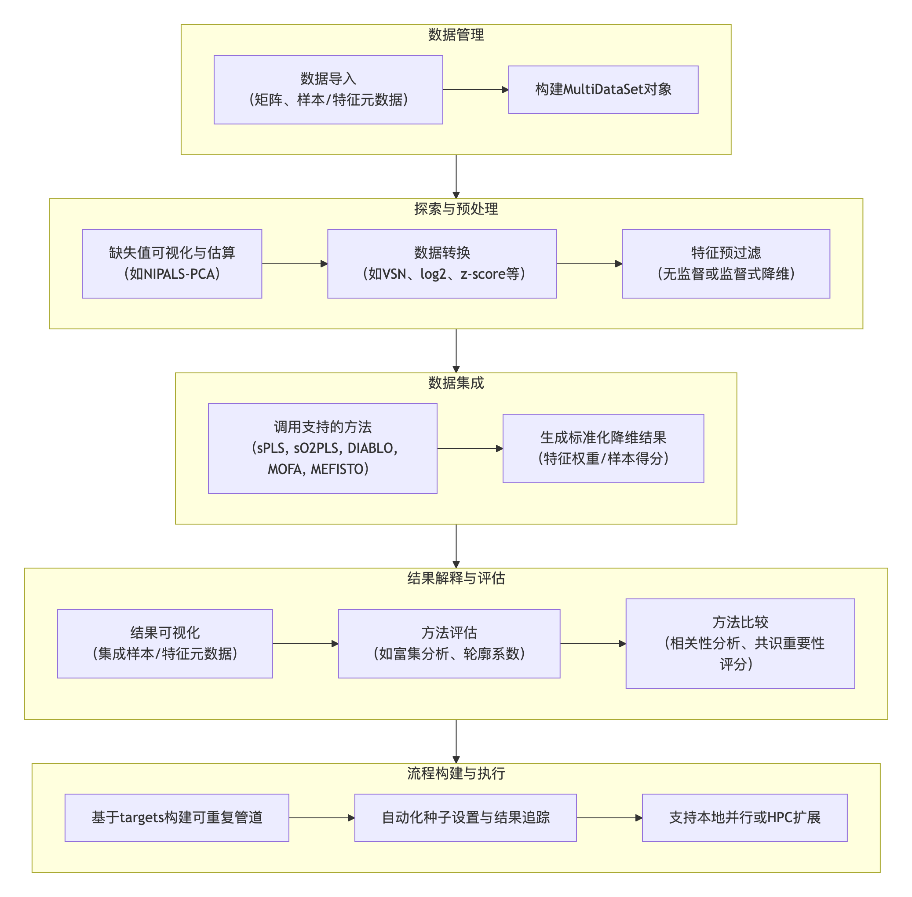
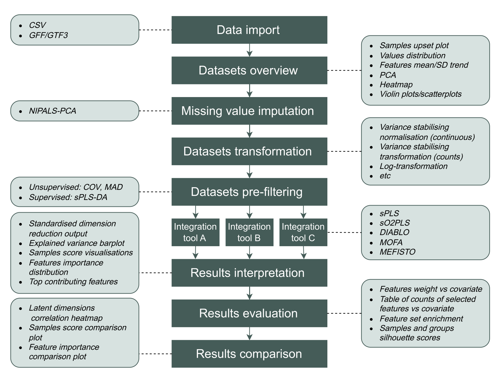
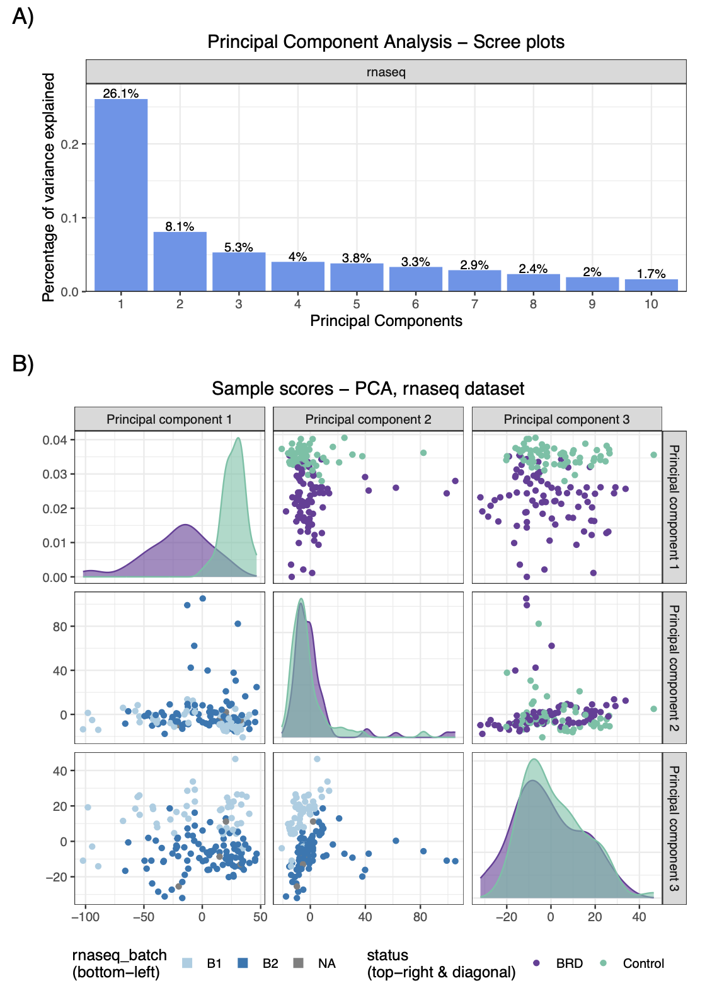
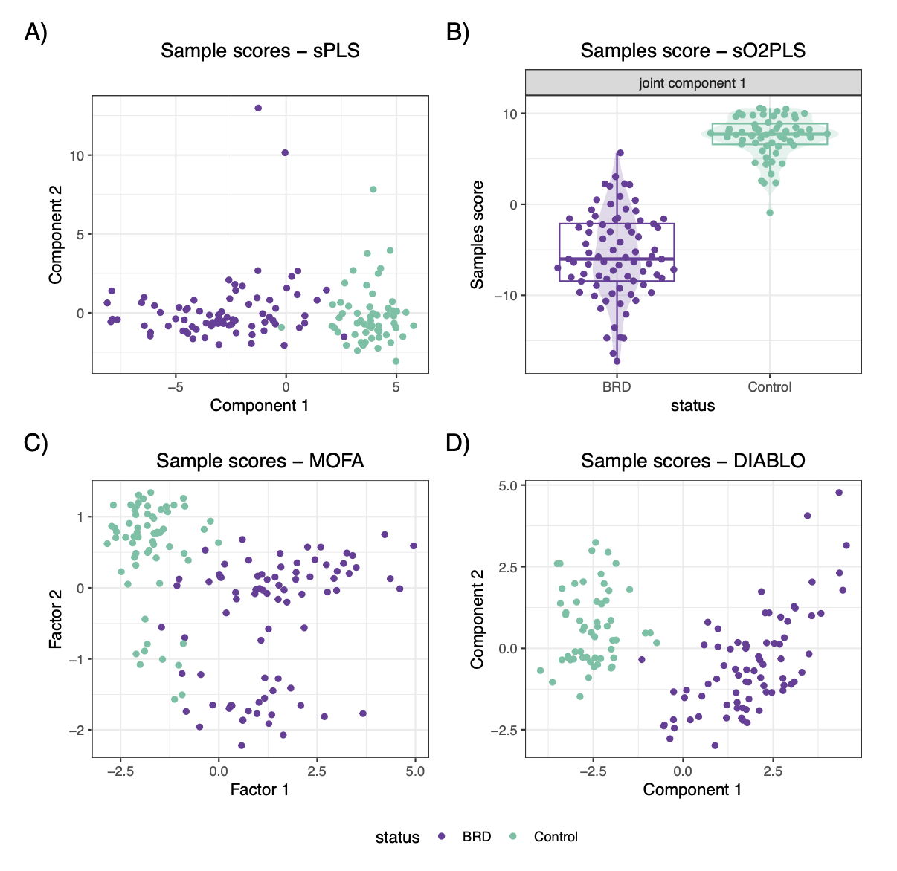
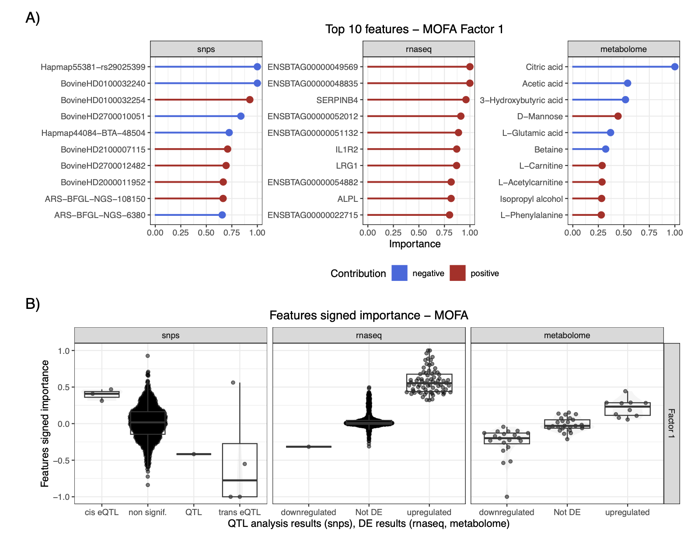
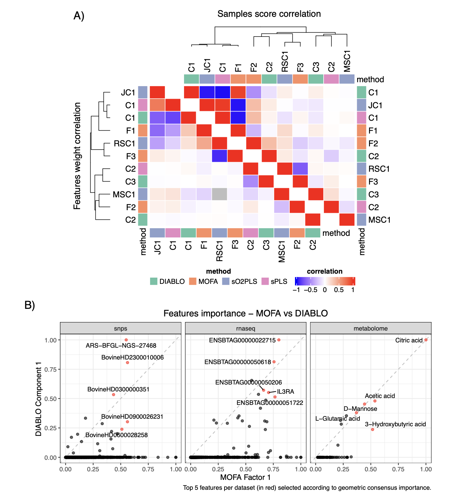
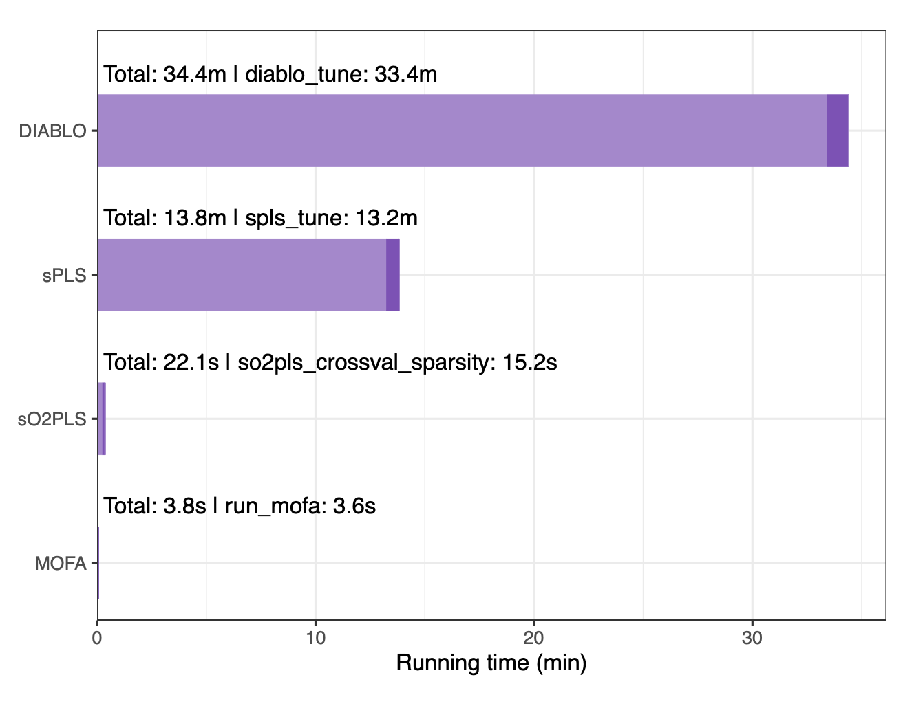

## 引言
过去二十年中，针对同一组生物样本获取多个组学层面（如基因组、转录组、蛋白组或代谢组）数据的多组学研究呈爆炸式增长。这推动了专门用于这些数据集集成分析的统计学方法的发展，旨在从跨越不同组学层的数据中提取潜在的生物学过程见解。这些方法大多已实现为软件工具或软件包。然而，比较研究指出，由于缺乏“金标准”，不同方法的表现会因具体生物场景、组学数据类型、样本与特征数量等因素而存在差异。因此，在分析多组学数据时，尝试并比较多种集成方法对研究者而言是有益的。但不同工具在实现上（尤其是输入数据和元数据所需的格式，以及结果的输出格式）缺乏标准，给其应用与比较带来了巨大困难。为填补这一空白，研究人员开发了moiraine (Multi-Omics Integration Reproducible Analysis in R) 包，旨在促进不同多组学集成工具在任何多组学数据集上的应用、评估和比较。

- Olivia Angelin-Bonnet, Lindy Guo, Roy Storey, Susan Thomson, Moiraine: an R package to construct reproducible pipelines for the application and comparison of multi-omics integration methods, Bioinformatics, 2026;, btag070, https://doi.org/10.1093/bioinformatics/btag070
- 期刊：Bioinformatics （IF=5.4）
- 发表时间：2026年2月15日

## 实现
moiraine包的功能涵盖了多组学集成分析的典型步骤，包括数据导入、探索与预处理、集成、结果解释与比较。其核心流程与功能架构如下：

### 数据导入与存储
用户可为每个待集成的组学数据集导入测量值矩阵、样本元数据（如处理组、采样日期）和特征元数据（如基因描述、化合物化学式）。moiraine支持csv文件，以及用于基因/转录本信息的GFF/GTF文件。所有数据集及其关联信息被存储在一个`MultiDataSet` R对象中，便于后续分析步骤的统一传递。

### 数据预处理
该包提供了一系列可视化和诊断工具用于数据概览，例如评估缺失值比例、通过Upset图展示不同数据集间的样本重叠情况等。对于含有缺失值的数据集，可以使用非线性迭代偏最小二乘法主成分分析进行估算。此外，moiraine集成了多种数据转换方法，以满足不同类型数据的需求。在特征预过滤方面，支持基于中位数绝对偏差或变异系数的无监督方法，以及基于稀疏偏最小二乘判别分析的监督方法，以保留与特定样本结果最相关的特征。

### 数据集成
moiraine目前支持来自三个R包的五个集成方法：`mixOmics`包中的sPLS和DIABLO、`OmicsPLS`包中的sO2PLS，以及`MOFA2`包中的MOFA和MEFISTO。这些方法代表了有监督和无监督、可处理两个或更多组学数据集的多种策略。moiraine负责从`MultiDataSet`对象生成每种方法所需的输入格式，并提供辅助函数简化参数设置。

### 集成结果的格式转换与可视化
上述所有集成方法都通过构建潜在维度（即各数据集中特征的加权组合）进行降维。moiraine将这些方法的结果统一转换为一个标准化的降维输出格式，包含：1) 特征对每个潜在维度的权重或贡献度表格；2) 样本在每个潜在维度上的得分或坐标表格。并计算每个特征在每个维度上的重要性评分。基于此标准化输出，用户可以生成一致的可视化结果，并轻松地将样本或特征元数据信息融入图中以辅助解读。

### 方法评估与比较
moiraine提供了多种方式评估集成结果。例如，可以将特征权重与自定义的特征标签（如来自单组学分析的差异表达结果）进行对比绘图，或进行功能集（如GO术语、KEGG通路）富集分析。对于两种集成方法的结果，可以通过绘制它们所构建的潜在维度在样本得分和/或特征权重上的相关性来进行比较。更重要的是，moiraine引入了一个共识重要性评分，用于汇总不同集成方法的结果，以获得对组学特征的稳健优先级排序。该评分基于特征的重要性评分（而非原始权重）进行计算，并支持使用多种聚合函数（如算术平均、几何平均、L2范数等），以突出不同整合结果中的不同重要性模式。

### 构建可重复与可扩展的分析管道
为确保分析的可重复性，moiraine利用`targets` R包将分析脚本转化为计算管道。管道中的每个步骤（称为一个“目标”）通过其输入和输出相互链接，可以可视化为有向无环图。`targets`包能自动判断目标的执行顺序，并监控代码和输入文件的变化，仅重新运行受影响的过时目标，从而确保分析结果始终与所用代码和数据同步，同时节省计算时间。每个目标会自动分配并记录一个随机种子，保证即使涉及随机计算（如交叉验证），同一管道在不同机器上也能得到完全相同的结果。此外，管道可以轻松配置为在本地并行运行或分发到高性能计算集群（如SLURM）上执行，以处理大规模多组学数据。

## 应用案例
为展示moiraine的功能，研究团队使用了一个公开的、关于肉牛呼吸道疾病的多组学数据集。该数据集包含来自80头患病动物和63头对照动物的基因组学（SNP）、转录组学（RNA-seq）和代谢组学（NMR）数据。

### 数据准备与探索
使用moiraine对转录组数据进行方差稳定转换，对代谢组数据进行对数转换，并使用NIPALS-PCA估算基因组和代谢组数据中的缺失值。为降低数据维度，分别对基因组和转录组数据集进行了稀疏PLS-DA分析，以选择最能区分对照组和感染组动物的特征（各保留1000个特征）。数据探索阶段，通过Upset图发现三个组学数据集共有的样本为135个。对转换后（未过滤）的数据进行PCA分析，快速揭示了各数据集的主要趋势，并发现了转录组数据中存在可能影响分析结果的批次效应。

### 多组学集成结果
使用moiraine支持的四种方法（sPLS、sO2PLS、MOFA和DIABLO）分析了该多组学数据集。参数调优后，各方法构建的潜在维度数量分别为2、7、15和4个。所有方法构建的第一个（或前两个）潜在维度都能将感染样本与对照样本区分开。

以MOFA为例，研究人员展示了区分对照组与感染组动物的第一个潜在维度（Factor 1）中贡献度最高的特征，并将其与原始单组学研究结果进行了比较。结果表明，集成分析结果与单组学分析结果基本一致，但也识别出一些在原始研究中未被强调的特征，这些特征可能在其他组学数据的协同变化下才显现出与疾病的关联。对MOFA结果的基因集富集分析表明，Factor 1优先考虑了与角化、丝状蛋白活性及炎症反应相关的转录本。

### 集成结果比较
研究人员比较了不同方法构建的前几个潜在维度在样本得分和特征权重上的相关性。结果显示，各方法的第一个潜在维度在样本趋势上高度相似，但驱动这些趋势的特征排序并不完全一致，部分原因是方法本身进行的特征选择（除MOFA外）会将大多数特征的权重置零。此外，比较了MOFA和DIABLO对代谢组数据特征的重要性评分排序，发现二者高度一致（如柠檬酸、乙酸和D-甘露糖得分最高），但对某些SNP和转录本的评分存在差异，这反映了有监督（DIABLO）与无监督（MOFA）方法目标的不同。研究还比较了使用两种不同特征预过滤方法（监督式sPLS-DA vs. 无监督MAD筛选）后MOFA的结果，发现虽然前两个因子非常相似，但后续因子差异显著，这凸显了选择合适的预处理方法对集成结果的重大影响。

### 计算效率
整个分析管道在具有4个CPU和16.4GB内存的系统上运行了约2.2小时。最耗时的步骤是sPLS-DA进行特征预过滤以及DIABLO和sPLS的交叉验证调参。特征预过滤是资源最密集的步骤之一，但强烈推荐在集成前执行，因为它不仅能减少后续步骤的计算负担，还能通过降低数据噪声和不平衡性来改善集成结果并降低过拟合风险。在不同集成工具中，DIABLO最慢（主要耗时于交叉验证），而sO2PLS和MOFA则非常快（均小于1分钟）。

## 讨论
moiraine是一个用于构建可重复多组学集成分析管道的R包。它使用户能够导入任意类型和数量的组学数据集及元数据，进行检查、转换和预过滤，并方便地应用多种集成方法，而无需担心数据格式转换问题。该包将集成结果转换为标准化的降维输出格式，支持结合元数据进行一致的可视化和解读。其核心创新在于能够对来自不同集成方法的结果进行形式化比较（包括模式检测和特征排序），并计算共识重要性评分以整合不同方法的结果，实现对组学特征的稳健优先级排序。通过基于`targets`包的模块化设计，moiraine确保了分析的可重复性、可定制性和可扩展性，用户能够访问所有中间结果，并轻松将流程扩展到高性能计算环境。

未来，moiraine的发展方向包括支持更多的集成方法、扩展对更多专业数据格式的导入支持、提供更多结果解释与评估功能，以及优化计算密集型步骤（如`mixOmics`方法中的稀疏性交叉验证）以提高效率。通过moiraine，研究人员希望鼓励用户在其数据上测试并比较不同的集成方法，以确保其研究发现的稳健性。

