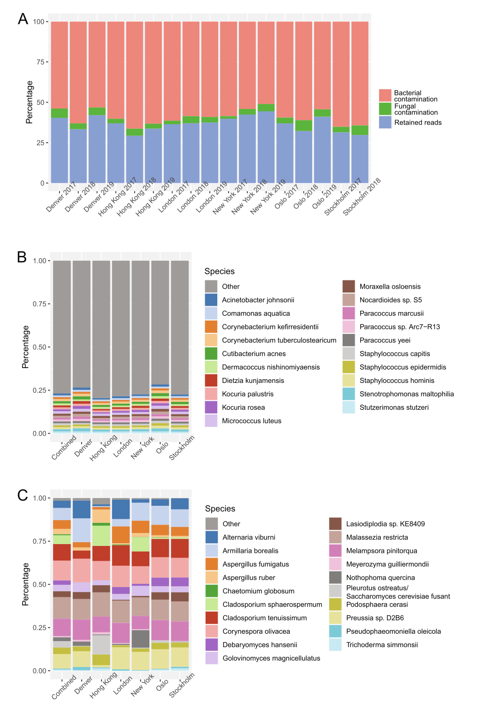
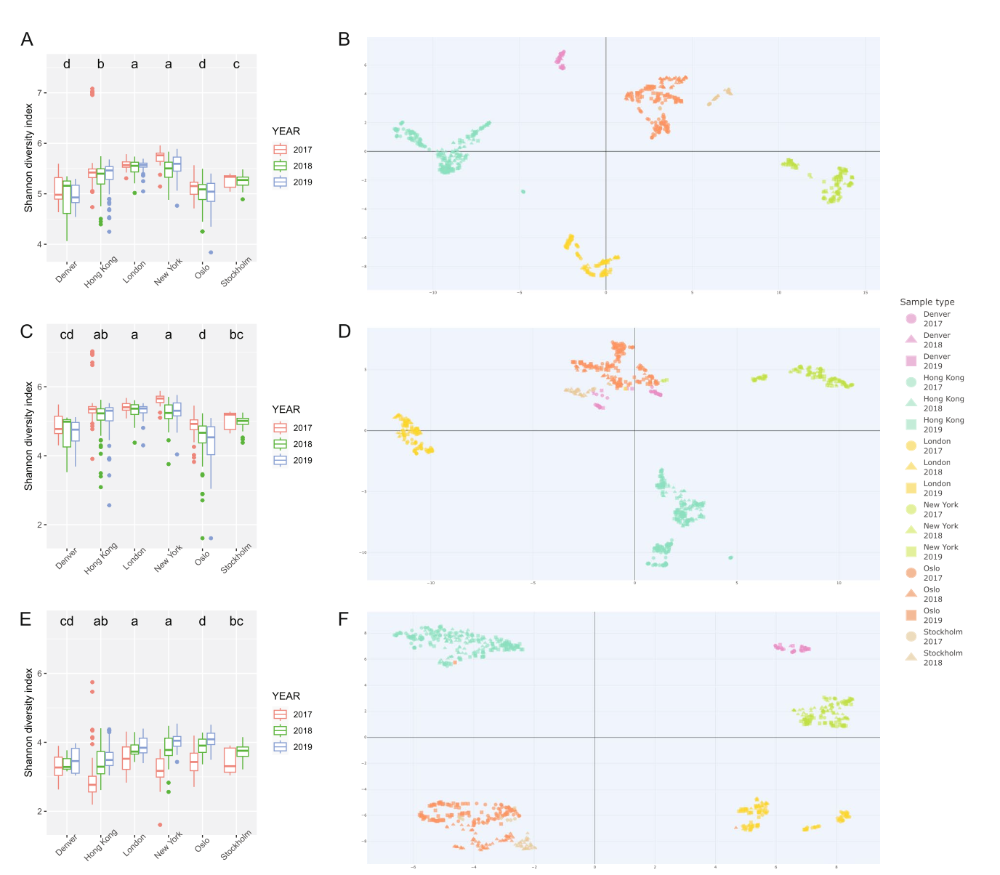
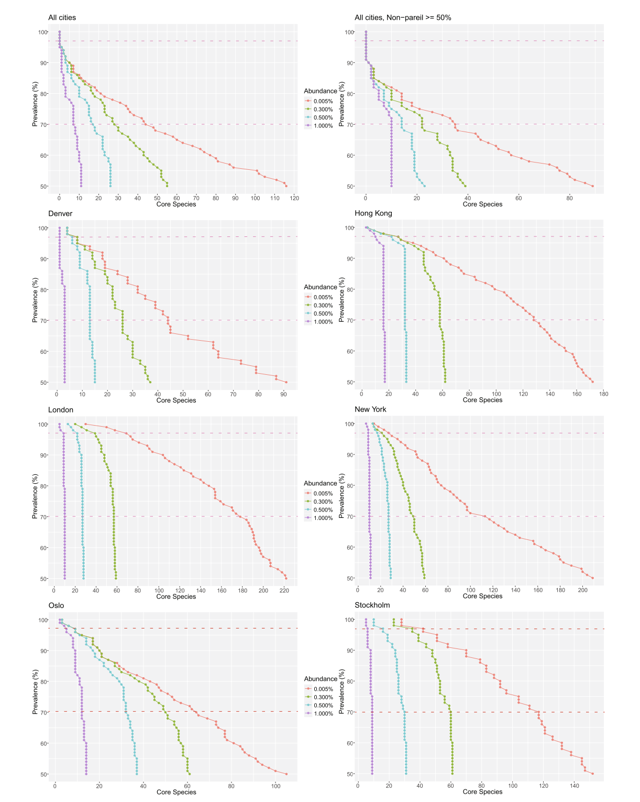

## 引言
气溶胶微生物群落的多样性极其丰富，包含无数原核和真核物种，其中以细菌、真菌和病毒为主。尽管近年来越来越多的研究关注生物气溶胶，尤其是在SARS-CoV-2大流行期间，但气溶胶群落在物种水平上的群落结构和多样性依然难以捉摸。公共交通系统的微生物组因其对公共卫生的重要性而备受关注，仅地铁一项在2019年全球日均载客量就估计达1.9亿人次。

环境DNA高通量测序技术的进步推动了基于扩增子和鸟枪法宏基因组学的地铁表面微生物组研究。然而，公共交通工具气溶胶微生物的群落结构和物种多样性研究仍不充分。从空气中回收的生物量相对较低以及相关的基因组处理是主要障碍。目前，气溶胶研究主要聚焦于单个城市，难以推断空间效应。为数不多的跨城市比较研究提示可能存在城市特异性的群落结构。此外，时间研究表明气溶胶的多样性和浓度具有动态性，随季节和昼夜周期波动，但尚未有研究探讨其年际变化周期。对细菌的研究偏见也限制了真菌气溶胶的研究，同时考虑细菌和真菌组分的研究很少。此外，参考数据库的偏差、低生物量样本中外源污染物的影响，以及测序深度不足、读段分类参数宽松等问题，都阻碍了物种水平多样性解析的准确性。

- Orr, R.J.S., Brynildsrud, O., Bøifot, K.O. et al. Spatial and temporal patterns of public transit aerobiomes. Microbiome 14, 64 (2026). https://doi.org/10.1186/s40168-025-02303-7
- 期刊：Microbiome （IF=12.7）
- 发表时间：2026年1月19日

因此，本研究的主要目标是考察公共交通气溶胶的物种多样性，特别是其空间和时间组成模式。利用为期三年的年际时间序列和大规模采样方案，研究人员首次系统研究了细菌和真菌物种的这种变化。次要研究目标包括：评估环境和人为因素对微生物组结构的影响；确定全球和本地层面是否存在公共交通气溶胶“核心”微生物组；并强调强大的生物信息学流程对于识别和去除低生物量样本中外源污染物的重要性。

## 方法

### 空气采样
研究团队在2017年至2019年夏季，连续三年从六个全球城市的公共交通枢纽采集空气样本，总计750份。采样使用SASS3100高容量驻极体过滤器空气采样器，在特定重复地点进行，采样时间为30分钟。同时记录了温度、相对湿度、客流量以及采样点是否露天或地下等元数据。采样过程中采取了严格的无菌操作，并设置了现场阴性对照。滤膜在-80°C保存直至DNA提取。

### DNA提取、文库制备与测序
DNA提取遵循针对驻极体滤膜优化的裂解方案。除了空气样本，还同时处理了现场阴性对照、实验室阴性对照以及阳性对照（ZymoBIOMICS微生物群落标准品）。提取的DNA经Qubit定量后，送至测序中心进行建库（使用Qiagen GeneRead DNA Library Prep Kit I）和Illumina双端测序。

### 生物信息学分析
对原始测序数据进行质控（FastQC）。为获得高分辨率物种水平分类，使用Trimgalore对读段进行修剪，设置长度为130 bp、质量阈值为Phred 30。使用Bowtie2比对并移除映射到人类基因组（GRCh38）的读段。使用Nonpareil 3估计每个样本的平均宏基因组覆盖度和序列多样性。使用Kraken2对完整NCBI非冗余蛋白数据库进行跨界（域和界）水平分类。为进行物种水平分类，构建了一个包含古菌、细菌、病毒和真菌完整基因组的Kraken2/Bracken核苷酸数据库（FBAV）。读段使用该数据库进行分类，置信度设为0.1，最小命中组为4，并应用0.005%的总读段阈值以进一步减少假阳性。

### 外源污染物去除
通过汇总阴性对照样本的分类报告，确定了污染性分类单元（taxon），定义为在至少两个阴性样本中出现且总读段数超过10,000的物种。这些污染物分类单元从空气样本的读段计数表中被移除。对于核心微生物组计算，仅当某分类单元在空气样本中的出现率显著高于在阴性对照样本中的出现率时（使用双样本比例Z检验），才被计入。

### 读段计数归一化与多样性分析
为进行多样性比较，将读段计数归一化至每样本一千万条。随后进行对数转换并添加伪计数1。使用香农多样性指数计算α多样性，使用Tukey诚实显著差异检验比较组间差异。使用均匀流形近似与投影分析β多样性，并迭代评估城市间样本交叉污染的可能性。使用多元方差分析评估城市、年份、温度、湿度、客流量及地面因素对微生物组成的影响。

### 分类学读段丰度与核心微生物组
使用GRIMER可视化相对分类读段丰度。根据先前研究定义，计算了全球和本地层面的“核心”（在>97%的样本中出现）和“亚核心”（在70-97%的样本中出现）公共运输气溶胶微生物组。为了检验低测序深度（低覆盖度）对全球核心分析的影响，该分析仅在Nonpareil估计覆盖度>50%的样本子集上重复进行。

## 结果

### 数据概览与污染物去除
在质量修剪阶段，空气样本平均去除了15.4%的读段。从空气样本中映射到人类基因组的读段平均占24.0%（范围0.75-94.6%）。阴性对照样本平均仅有4.6%的读段映射到人类基因组。污染去除流程识别并移除了总计290个污染性分类单元（265个细菌和25个真菌物种），这些污染物平均占空气样本中分类读段的62.7%。去除污染物后，从所有样本中共鉴定出3577个物种，其中细菌2560种，真菌956种。

### 多样性分析
香农α多样性指数显示，城市内物种多样性在三年采样期内保持稳定，但城市间存在显著差异。其中纽约的物种多样性最高，丹佛最低。城市间差异主要源于细菌多样性，真菌多样性则相对恒定。UMAP分析的β多样性结果显示，样本按城市呈现清晰的聚类模式，年份的影响较小，这表明夏季月份的基础气溶胶生态位在年际间相对稳定。统计分析（MANOVA）证实，城市是影响微生物群落结构最重要的因素，其次是地面情况（地上/地下）和年份。细菌和真菌组成与湿度也显示出显著相关性。

### 分类学组成
在更高分类水平上，公共交通气溶胶微生物组以细菌为主，占总分类读段的74.4%，真菌占25.3%，古菌和病毒均低于1%。丹佛和奥斯陆的真菌读段比例（分别为36.6%和38.0%）高于其他城市，而香港的细菌读段比例最高（84.0%）。在物种水平上，前20个最丰富的物种仅占总多样性的27.6%，表明气溶胶微生物组丰富且分布均匀。没有单一物种在全球范围内占主导地位。玫瑰单胞菌（*Roseomonas mucosa*）是相对丰度最高的物种（3.5%），而黑粉菌（*Ustilago bromivora*）是最主要的真菌物种（2.2%）。不同城市的优势物种存在差异，例如玫瑰单胞菌在香港丰度最高（8.0%），而黑粉菌在丹佛丰度最高（24.7%）。

### 核心微生物组
在全球层面，没有物种在>97%的样本中出现，因此不存在全球“核心”公共运输气溶胶微生物组。然而，存在一个“亚核心”，包含44个物种（43个细菌和1个真菌物种）。当分析仅限于高覆盖度（>50%）样本时，亚核心物种数量减少至35个，但物种丰度有所增加。在更同质化的本地环境中，每个城市都存在一个独特的本地核心微生物组。本地核心的物种数量从丹佛的8个到伦敦的69个不等，并以细菌为主，真菌数量从丹佛的1种到斯德哥尔摩的5种不等。这些本地核心反映了各城市生态位的独特性，例如被农田环绕的丹佛，其核心微生物组包含植物和土壤相关的细菌和真菌物种。

## 讨论
本研究对全球六个城市公共交通气溶胶进行了为期三年的夏季采样和深度宏基因组测序，揭示了其物种多样性的时空模式。城市是塑造微生物群落结构和多样性的最主要因素，地理上接近的城市（如奥斯陆和斯德哥尔摩）显示出更相似的微生物组特征。人口密度与细菌物种丰富度呈正相关。年际变化对夏季气溶胶多样性影响有限，表明其季节性波动可能大于年际波动。

没有发现全球普遍存在的核心物种，这反驳了先前在地铁表面微生物组研究中提出的全球核心假设。相反，每个城市都存在一个本地核心微生物组，这与其独特的生态位（如周边环境、人类活动水平）相符。物种相对丰度分析表明，公共运输气溶胶具有丰富的多样性，没有单一物种在全球占主导地位。

本研究强调了在低生物量研究中，强大的生物信息学流程对于识别和去除外源污染物的至关重要性。研究人员识别并排除了一系列常见污染物（如人类皮肤相关细菌*Cutibacterium acnes*、*Micrococcus luteus*），这些物种在未充分去除污染物的研究中常被误报为优势组分。严格的外源污染物去除是解析真实生物学信号的关键步骤。

尽管本研究提供了高分辨率的数据集，但仍存在一些局限性。例如，采样仅限于夏季和白天，可能遗漏了低丰度物种。不同城市的样本数量存在差异，且数据库偏差可能影响分类结果。此外，短读长宏基因组测序在物种水平分类上的固有局限性也需要谨慎解读低丰度分类单元。
