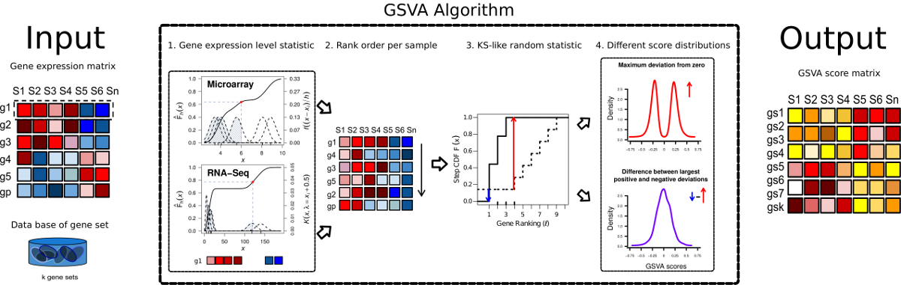

```{r setup, include=FALSE}
options(width=80)
knitr::opts_chunk$set(collapse=TRUE,
                      message=FALSE,
                      comment="",cache = TRUE)
showtext::showtext_auto()
library(BiocStyle)
```


## 快速开始

翻译自官方教程：<https://bioconductor.org/packages/release/bioc/vignettes/GSVA/inst/doc/GSVA.html> 。

`r Biocpkg("GSVA")` 是一个作为 https://bioconductor.org 项目一部分分发的 R 包。要安装该包，请启动 R 并输入：

```{r library_install, message=FALSE, cache=FALSE, eval=FALSE}
install.packages("BiocManager")
BiocManager::install("GSVA")
```

安装 `r Biocpkg("GSVA")` 后，可以使用以下命令加载它。

```{r load_library, message=FALSE, warning=FALSE, cache=FALSE}
library(GSVA)
```



给定一个基因表达数据矩阵，我们称之为 `X`，其行对应于基因，列对应于样本，例如这个从随机高斯数据模拟而来的矩阵：

```{r}
p <- 10000 ### 基因数量
n <- 30    ### 样本数量
### 从标准高斯分布模拟表达值
X <- matrix(rnorm(p*n), nrow=p,
            dimnames=list(paste0("g", 1:p), paste0("s", 1:n)))
X[1:5, 1:5]
```

给定一个存储在例如 `list` 对象中的基因集集合，我们称之为 `gs`，这里通过无放回均匀随机采样基因到 100 个不同的基因集中来模拟：

```{r}
### 采样基因集大小
gs <- as.list(sample(10:100, size=100, replace=TRUE))
### 采样基因集
gs <- lapply(gs, function(n, p)
                   paste0("g", sample(1:p, size=n, replace=FALSE)), p)
names(gs) <- paste0("gs", 1:length(gs))
```

我们可以如下计算 GSVA 富集分数。首先，我们应该为所需的方法论构建一个参数对象。这里我们通过调用函数 `gsvaParam()` 来说明 @haenzelmann2013gsva 描述的 GSVA 算法，但其他参数对象构造函数也可用；详见下一节。

```{r}
gsvaPar <- gsvaParam(X, gs)
gsvaPar
```

构造此参数对象的 `gsvaParam()` 函数的第一个参数是基因表达数据矩阵，第二个是基因集集合。在此示例中，我们将表达数据和基因集分别以基础的 R _matrix_ 和 _list_ 对象形式提供给 `gsvaParam()` 函数，但它也可以接受不同的专用容器，这些容器便于访问和操作分子及表型数据及其相关元数据。

其次，我们使用参数对象作为第一个参数调用 `gsva()` 函数。`gsva()` 函数的其他附加参数包括 `verbose`（用于控制进度报告）和 `BPPPARAM`（用于通过 `r Biocpkg("BiocParallel")` 包进行并行计算）。

```{r}
gsva.es <- gsva(gsvaPar, verbose=FALSE)
dim(gsva.es)
gsva.es[1:5, 1:5]
```

## 简介

基因集变异分析 (GSVA) 通过将输入的基因×样本表达数据矩阵转换为相应的基因集×样本表达数据矩阵，从而提供通路活性的估计。生成的结果表达数据矩阵随后可用于经典的差异表达、分类、生存分析、聚类或相关性分析等方法，进行通路中心的分析。人们还可以在通路与其他分子数据类型（如 microRNA 表达或结合数据、拷贝数变异 (CNV) 数据或单核苷酸多态性 (SNPs)）之间进行样本间的比较。

GSVA 包为以下方法提供了实现：

* _plage_ [@tomfohr_pathway_2005]。基因表达通路水平分析 (PLAGE) 对样本的表达谱进行标准化，然后，对于每个基因集，对其基因执行奇异值分解 (SVD)。第一右奇异向量的系数作为样本间通路活性的估计返回。注意，由于 SVD 的计算方式，其奇异向量的符号是任意的。

* _zscore_ [@lee_inferring_2008]。z-score 方法对样本的表达谱进行标准化，然后，对于每个基因集，如下组合标准化值。给定一个基因集 $\gamma=\{1,\dots,k\}$，其在特定样本中每个基因的标准化值为 $z_1,\dots,z_k$，则该基因集 $\gamma$ 的组合 z-score $Z_\gamma$ 定义为：

  $$
  Z_\gamma = \frac{\sum_{i=1}^k z_i}{\sqrt{k}}\,.
  $$

* _ssgsea_ [@barbie_systematic_2009]。单样本 GSEA (ssGSEA) 是一种非参数方法，它计算每个样本的基因集富集分数，作为基因集内和基因集外基因表达秩的经验累积分布函数 (CDF) 的归一化差值。默认情况下，GSVA 包中的实现遵循 [@barbie_systematic_2009, online methods, pg. 2] 中描述的最后一个步骤，即通过除以计算值的范围来归一化通路分数。可以使用 `gsva()` 函数调用中的参数 `ssgsea.norm` 来关闭此归一化步骤；详见下文。

* _gsva_ [@haenzelmann2013gsva]。这是该包的默认方法，与 ssGSEA 类似，是一种非参数方法，它使用基因集内和基因集外基因表达秩的经验 CDF，但它首先计算一个表达水平统计量，该统计量将具有不同动态范围的基因表达谱带到共同的尺度上，并以不同的方式组合这些经验 CDF 的信息以提供富集分数。

有兴趣的用户可以在上述引用的相应文章中找到关于这些方法如何工作的完整技术细节。如果您在任何出版物中使用其中任何一种方法，请使用给定的参考文献引用它们。

## GSVA 功能概述

GSVA 包的核心函数是 `gsva()`，它以*参数对象*作为其主要输入。有四个类别的参数对象对应于上面列出的方法，并且可能具有不同的附加参数进行调整，但它们都至少需要以下两个输入参数：

1. 一个标准化的基因表达数据集，可以通过以下容器之一提供：
   * 一个表达值的 `matrix`，行对应基因，列对应样本。
   * 一个 `ExpressionSet` 对象；参见 `r Biocpkg("Biobase")` 包。
   * 一个 `SummarizedExperiment` 对象；参见 `r Biocpkg("SummarizedExperiment")` 包。
2. 一个基因集集合；可以通过以下容器之一提供：
   * 一个 `list` 对象，其中每个元素对应于由基因标识符向量定义的基因集，元素名称对应于基因集的名称。
   * 一个 `GeneSetCollection` 对象；参见 `r Biocpkg("GSEABase")` 包。

使用专用容器（如 `ExpressionSet`、`SummarizedExperiment` 和 `GeneSetCollection`）提供输入数据的一个优点是，当表达数据和基因集来自不同的标准命名法（例如，_Ensembl_ 与 _Entrez_）时，`gsva()` 函数将自动映射基因标识符（内部调用 `r Biocpkg("GSEABase")` 包中的 `mapIdentifiers()` 函数），前提是输入对象包含适当的元数据；参见下一节。

如果输入的基因表达数据以 `matrix` 对象提供，或者基因集以 `list` 对象提供，或者两者都是，那么用户有责任确保两个对象包含遵循相同标准命名法的基因标识符。

在实际计算发生之前，`gsva()` 函数将应用以下过滤器：

1. 丢弃输入表达数据矩阵中具有恒定表达的基因。

2. 丢弃输入基因集中未映射到输入基因表达数据矩阵中基因的基因。

3. 丢弃在应用上述过滤器后不符合最小和最大尺寸的基因集，默认情况下最小尺寸为 1，最大尺寸没有限制。

如果由于应用这三个过滤器而使得没有基因或基因集剩余，`gsva()` 函数将提示错误。此阶段出现此类错误的一个常见原因是表达数据矩阵和基因集之间的基因标识符不属于相同的标准命名法并且无法映射。这可能发生是因为要么输入数据未使用上述一些专用容器提供，要么这些容器中允许软件成功映射基因标识符的必要元数据缺失。

`gsva()` 函数采用的方法由其作为输入接收的参数对象的类决定。使用 `gsvaParam()` 函数构造的对象运行 @haenzelmann2013gsva 描述的方法，但可以通过参数构造函数 `plageParam()`、`zscoreParam()` 或 `ssgseaParam()` 进行更改，分别对应简介中简要描述的方法；另见其相应的帮助页面。

使用 `gsvaParam()` 时，用户可以额外调整以下参数，其默认值覆盖了大多数用例：

* `kcdf`: GSVA 算法的第一步通过跨样本估计 CDF 来计算表达统计量，从而将基因表达谱带到共同的尺度。GSVA 执行此估计的方式由 `kcdf` 参数控制，该参数接受以下四个可能值：(1) `"auto"`，默认值，让 GSVA 自动决定估计方法；(2) `"Gaussian"`，使用高斯核，适用于连续表达数据，例如对数尺度的微阵列荧光单位以及 RNA-seq 的 log-CPMs、log-RPKMs 或 log-TPMs 表达单位；(2) `"Poisson"`，使用泊松核，适用于整数计数，例如来自 RNA-seq 比对的数据；(3) `"none"`，将在没有核函数的情况下直接估计 CDF。

* `kcdfNoneMinSampleSize`: 当 `kcdf="auto"` 时，此参数决定在最小样本量为多少时 `kcdf="none"`，即跨样本表达水平的经验累积分布函数 (ECDF) 的估计直接进行，不使用核；参见之前的 `kcdf` 参数。默认 `kcdfNoneMinSampleSize=200`。

* `tau`: 定义随机游走中尾部权重的指数。默认 `tau=1`。

* `maxDiff`: GSVA 算法的最后一步从两个 Kolmogorov-Smirnov 随机游走统计量计算基因集富集分数。此参数是一个逻辑标志，允许用户指定两种可能的方式来进行此计算：(1) `TRUE`，默认值，其中富集分数计算为最大正和负随机游走偏差的量级差。此默认值对仅在一个方向上一致性激活其基因的基因集给予较大的富集分数；(2) `FALSE`，其中富集分数计算为随机游走距零的最大距离。这种方法产生的富集分数分布是双峰的，但它可以对那些并非仅在一个方向上一致性激活其基因的基因集给予较大的富集分数。

* `absRanking`: 仅在 `maxDiff=TRUE` 时使用的逻辑标志。默认情况下，`absRanking=FALSE`，这意味着使用修正的 Kuiper 统计量计算富集分数，取最大正和负随机游走偏差的量级差。当 `absRanking=TRUE` 时，使用原始的 Kuiper 统计量，通过该统计量将最大正和负随机游走偏差相加。

* `sparse`: 仅当输入表达数据存储在稀疏矩阵（例如，`dgCMatrix` 或在 `dgCMatrix` 中存储表达数据的 `SingleCellExperiment` 对象）中时使用的逻辑标志。在这种情况下，当 `sparse=TRUE`（默认）时，将应用 GSVA 算法的稀疏版本。否则，当 `sparse=FALSE` 时，将使用经典的 GSVA 算法。

通常，上述参数的默认值适用于大多数分析场景，这些场景通常包含某种归一化的连续表达值。

## 基因集定义和容器

基因集构成了一种简单而有用的定义通路的方式，因为我们只使用通路成员定义，而忽略分子相互作用的信息。基因集定义是任何基因集富集分析的关键输入，因为如果我们的基因集未能捕获我们正在研究的生物过程，我们很可能无法从基于这些基因集的分析中找到任何相关见解。

基因集有多种来源，最流行的是 https://geneontology.org 和 https://www.gsea-msigdb.org/gsea/msigdb。有时基因集数据库可能不包含我们需要的基因集。在这种情况下，我们应该要么策划自己的基因集，要么使用从数据中推断它们的技术。

R 中最基本的基因集数据容器是 `list` 类对象，如前面的快速开始部分所述，我们在那里定义了一个存储在名为 `gs` 的列表对象中的基因集集合：

```{r}
class(gs)
length(gs)
head(lapply(gs, head))
```

使用 Bioconductor 生物体级包（如 `r Biocpkg("org.Hs.eg.db")`），我们可以轻松构建一个包含定义为带有注释的 Entrez 基因标识符的 GO 术语的基因集集合的列表对象，如下所示：

```{r, message=FALSE}
library(org.Hs.eg.db)

goannot <- select(org.Hs.eg.db, keys=keys(org.Hs.eg.db), columns="GO")
head(goannot)
genesbygo <- split(goannot$ENTREZID, goannot$GO)
length(genesbygo)
head(genesbygo)
```

更复杂的基因集容器是 `r Biocpkg("GSEABase")` 包中定义的 `GeneSetCollection` 对象类，它还提供了 `getGmt()` 函数来导入 https://software.broadinstitute.org/cancer/software/gsea/wiki/index.php/Data_formats#GMT:_Gene_Matrix_Transposed_file_format_.28.2A.gmt.29 文件（例如 https://www.gsea-msigdb.org/gsea/msigdb 提供的文件）到 `GeneSetCollection` 对象。实验数据包 `r Biocpkg("GSVAdata")` 提供了这样一个对象，其中包含 https://www.gsea-msigdb.org/gsea/msigdb C2 精选基因集旧版 (3.0) 的集合，可以如下加载。

```{r, message=FALSE}
library(GSEABase)
library(GSVAdata)

data(c2BroadSets)
class(c2BroadSets)
c2BroadSets
```

`r Biocpkg("GSEABase")` 的文档包含 `GeneSetCollection` 类及其相关方法的描述。

## 从 GMT 文件导入基因集

基因集的一个重要来源是 https://www.gsea-msigdb.org/gsea/msigdb https://software.broadinstitute.org/cancer/software/gsea/wiki/index.php/Data_formats#GMT:_Gene_Matrix_Transposed_file_format_.28.2A.gmt.29。在 GMT 格式中，每行存储一个基因集，包含以下由制表符分隔的值：

  * 唯一的基因集标识符。
  * 基因集描述。
  * 一个或多个基因标识符。

因为每个不同的基因集可能由不同数量的基因组成，所以 GMT 文件中的每一行可能包含不同数量的制表符分隔值。这意味着 GMT 格式不是表格格式，因此不能直接用 R 基础函数（如 `read.table()` 或 `read.csv()`）读取。

我们需要一个专门的函数来读取 GMT 文件。我们可以在 `r Biocpkg("GSEABase")` 包中找到这样的函数 `getGmt()`，或者在 `r Biocpkg("qusage")` 包中找到 `read.gmt()`。

GSVA 也提供了这样一个名为 `readGMT()` 的函数，其第一个参数是可能的压缩 GMT 文件的文件名或 URL。下面的调用说明了如何通过提供其 URL 来读取来自 MSigDB 的 GMT 文件，具体来说是对应于 C7 免疫学特征基因集集合的文件。注意，我们还加载了 `r Biocpkg("GSEABase")` 包，因为默认情况下，`readGMT()` 返回的值是该包中定义的 `GeneSetCollection` 对象。

```{r, eval=FALSE}
library(GSEABase)
library(GSVA)

URL <- "https://data.broadinstitute.org/gsea-msigdb/msigdb/release/2024.1.Hs/c7.immunesigdb.v2024.1.Hs.symbols.gmt"
c7.genesets <- readGMT(URL)
```

```{r, echo=FALSE, message=FALSE, warning=FALSE}
library(GSEABase)
library(GSVA)

gmtfname <- system.file("extdata", "c7.immunesigdb.v2024.1.Hs.symbols.gmt.gz",
                        package="GSVAdata")
c7.genesets <- readGMT(gmtfname)
c7.genesets
```
默认情况下，`readGMT()` 返回一个 `GeneSetCollection` 对象，但可以通过设置参数 `valueType="list"` 切换到 `list` 对象。它还会尝试找出基因集中使用的标识符类型，并在结果对象中设置相应的元数据。但是，这也可以通过参数 `geneIdType` 或在调用 setter 方法 `gsvaAnnotation()` 时手动设置：

```{r, eval=FALSE}
gsvaAnnotation(c7.genesets) <- SymbolIdentifier("org.Hs.eg.db")
```
此操作实际上也可以用于 `list` 对象，它将通过 R 属性添加元数据，随后 `gsva()` 函数将能够读取该属性。要了解可用的不同基因标识符元数据构造函数类型，请查阅 `r Biocpkg("GSEABase")` 包中 `GeneIdentifierType` 的帮助页面。

https://software.broadinstitute.org/cancer/software/gsea/wiki/index.php/Data_formats#GMT:_Gene_Matrix_Transposed_file_format_.28.2A.gmt.29 规范规定不允许重复的基因集名称。因此，https://bioconductor.org/packages/GSEABase 包中的 `getGmt()` 函数在发现重复基因名称时会提示错误，而 https://bioconductor.org/packages/qusage 包中的 `read.gmt()` 函数则会以列表形式（带有重复的元素名称）默默接受它们。

GSVA 的 `readGMT()` 函数按如下方式处理重复的基因集名称。默认情况下，`readGMT()` 会警告用户存在重复的基因集名称，并在返回的对象中仅保留重复基因集的第一个出现。我们可以使用一个来自 MSigDB 数据库的旧 GMT 文件来说明这种情况，该文件恰好具有重复的基因集名称，其一个小子集存储在 `r Biocpkg("GSVAdata")` 包中。

```{r, message=FALSE, error=TRUE}
fname <- system.file("extdata", "c2.subsetdups.v7.5.symbols.gmt.gz",
                     package="GSVAdata")
c2.dupgenesets <- getGmt(fname, geneIdType=SymbolIdentifier())
c2.dupgenesets
```
我们可以看到 `getGmt()` 提示错误。下面我们可以看到 `readGMT()` 不会发生这种情况，并且默认情况下，除了第一个出现的重复基因集外，所有重复的基因集都已被移除。

```{r}
c2.dupgenesets <- readGMT(fname, geneIdType=SymbolIdentifier())
c2.dupgenesets
any(duplicated(names(c2.dupgenesets)))
```
`readGMT()` 函数中的参数 `deduplUse` 允许应用其他策略来处理重复的基因集名称，有关此参数的完整详细信息，请参阅 `?readGMT` 的帮助页面。

## 批量微阵列和 RNA-seq 数据中的通路活性量化

在此，我们通过使用两个源自相同生物样本的此类数据集来说明 GSVA 如何在微阵列和 RNA-seq 数据中提供通路活性的类似量化。更具体地说，我们将使用来自 HapMap 个体的淋巴母细胞系 (LCL) 的基因表达数据，这些数据已使用两种技术进行分析 [@huang_genome-wide_2007,@pickrell_understanding_2010]。这些数据构成了实验包 `r Biocpkg("GSVAdata")` 的一部分，相应的帮助页面包含了数据如何处理的具体信息。我们开始加载这些数据，并验证它们确实包含相同基因和样本的表达数据，如下所示：

```{r, message=FALSE}
library(Biobase)

data(commonPickrellHuang)

stopifnot(identical(featureNames(huangArrayRMAnoBatchCommon_eset),
                    featureNames(pickrellCountsArgonneCQNcommon_eset)))
stopifnot(identical(sampleNames(huangArrayRMAnoBatchCommon_eset),
                    sampleNames(pickrellCountsArgonneCQNcommon_eset)))
```

```{r, echo=FALSE}
### until the updated GSVAdata goes through the build system
### remove duplicated rows
fnames <- featureNames(huangArrayRMAnoBatchCommon_eset)
mask <- duplicated(fnames)
huangArrayRMAnoBatchCommon_eset <- huangArrayRMAnoBatchCommon_eset[!mask, ]
pickrellCountsArgonneCQNcommon_eset <- pickrellCountsArgonneCQNcommon_eset[!mask, ]
```
接下来，对于当前的分析，我们使用来自 MSigDB 基因集 v3.0 C2 集合的典型通路子集。这些对应于来自 KEGG、REACTOME 和 BIOCARTA 的以下通路：

```{r}
canonicalC2BroadSets <- c2BroadSets[c(grep("^KEGG", names(c2BroadSets)),
                                      grep("^REACTOME", names(c2BroadSets)),
                                      grep("^BIOCARTA", names(c2BroadSets)))]
canonicalC2BroadSets
```
此外，我们用两个由性别特异性表达基因组成的基因集扩展这个基因集集合，它们也构成了 `r Biocpkg("GSVAdata")` 实验数据包的一部分。这里我们使用 `r Biocpkg("GSEABase")` 包中的构造函数 `GeneSet` 来构建我们将添加到 `GeneSetCollection` 对象 `canonicalC2BroadSets` 的对象。

```{r}
data(genderGenesEntrez)

MSY <- GeneSet(msYgenesEntrez, geneIdType=EntrezIdentifier(),
               collectionType=BroadCollection(category="c2"),
               setName="MSY")
MSY
XiE <- GeneSet(XiEgenesEntrez, geneIdType=EntrezIdentifier(),
               collectionType=BroadCollection(category="c2"),
               setName="XiE")
XiE

canonicalC2BroadSets <- GeneSetCollection(c(canonicalC2BroadSets, MSY, XiE))
canonicalC2BroadSets
```
我们现在首先使用归一化的微阵列数据，然后使用归一化的 RNA-seq 整数计数数据来计算这些基因集的 GSVA 富集分数。请注意，执行后者唯一需要的是设置参数 `kcdf="Poisson"`，默认情况下它是 `"Gaussian"`。但是请注意，如果我们的 RNA-seq 归一化表达水平是连续的，例如 log-CPMs、log-RPKMs 或 log-TPMs，则 `kcdf` 参数的默认值应保持不变。

```{r, results="hide"}
huangPar <- gsvaParam(huangArrayRMAnoBatchCommon_eset, canonicalC2BroadSets,
                      minSize=5, maxSize=500)
esmicro <- gsva(huangPar)
pickrellPar <- gsvaParam(pickrellCountsArgonneCQNcommon_eset,
                         canonicalC2BroadSets, minSize=5, maxSize=500,
                         kcdf="Poisson")
esrnaseq <- gsva(pickrellPar)
```
我们将评估微阵列和 RNA-seq 数据之间的基因表达谱如何相关，并将这些相关性与通路水平上得出的相关性进行比较。为了比较两种技术的基因表达值，我们将首先使用 `r Biocpkg("edgeR")` 包中的 `cpm()` 函数将 RNA-seq 整数计数转换为表达值的 log-CPM 单位。

```{r}
library(edgeR)

lcpms <- cpm(exprs(pickrellCountsArgonneCQNcommon_eset), log=TRUE)
```
我们计算先前 log-CPM 值的基因表达谱与微阵列 RMA 值之间的 Spearman 相关性。

```{r}
genecorrs <- sapply(1:nrow(lcpms),
                    function(i, expmicro, exprnaseq)
                      cor(expmicro[i, ], exprnaseq[i, ], method="spearman"),
                    exprs(huangArrayRMAnoBatchCommon_eset), lcpms)
names(genecorrs) <- rownames(lcpms)
```
现在计算从微阵列和 RNA-seq 数据得出的 GSVA 富集分数之间的 Spearman 相关性。

```{r}
pwycorrs <- sapply(1:nrow(esmicro),
                   function(i, esmicro, esrnaseq)
                     cor(esmicro[i, ], esrnaseq[i, ], method="spearman"),
                   exprs(esmicro), exprs(esrnaseq))
names(pwycorrs) <- rownames(esmicro)
```
下面的图 \@ref(fig:compcorrs) 显示了这些相关性的两个分布，我们可以看到 GSVA 富集分数提供的微阵列和 RNA-seq 数据之间的一致性，与基因水平表达单位之间观察到的一致性相当。

```{r compcorrs, echo=FALSE, height=500, width=1000, fig.cap="微阵列和 RNA-seq 数据衍生的基因和通路表达谱相关性值比较。"}
par(mfrow=c(1, 2), mar=c(4, 5, 3, 2))
hist(genecorrs, xlab="Spearman correlation",
     main="基因水平\n(RNA-seq log-CPMs vs 微阵列 RMA)",
     xlim=c(-1, 1), col="grey", las=1)
hist(pwycorrs, xlab="Spearman correlation",
     main="通路水平\n(GSVA 富集分数)",
     xlim=c(-1, 1), col="grey", las=1)
```

最后，在图 \@ref(fig:compsexgenesets) 中，我们比较了由性别特异性表达基因组成的两个基因集的实际 GSVA 富集分数。具体来说，一个基因集 (XIE) 由女性中逃脱 X 染色体失活的基因形成 [@carrel_x-inactivation_2005]，另一个基因集 (MSY) 由位于 Y 染色体雄性特异区域的基因形成 [@skaletsky_male-specific_2003]。

```{r compsexgenesets, echo=FALSE, height=500, width=1000, fig.cap="从微阵列和 RNA-seq 数据获得的由性别特异性表达基因组成的两个基因集的 GSVA 富集分数比较。"}
par(mfrow=c(1, 2))
rmsy <- cor(exprs(esrnaseq)["MSY", ], exprs(esmicro)["MSY", ])
plot(exprs(esrnaseq)["MSY", ], exprs(esmicro)["MSY", ],
     xlab="RNA-seq GSVA 分数", ylab="微阵列 GSVA 分数",
     main=sprintf("MSY R=%.2f", rmsy), las=1, type="n")
fit <- lm(exprs(esmicro)["MSY", ] ~ exprs(esrnaseq)["MSY", ])
abline(fit, lwd=2, lty=2, col="grey")
maskPickrellFemale <- pickrellCountsArgonneCQNcommon_eset$Gender == "Female"
maskHuangFemale <- huangArrayRMAnoBatchCommon_eset$Gender == "Female"
points(exprs(esrnaseq["MSY", maskPickrellFemale]),
       exprs(esmicro)["MSY", maskHuangFemale],
       col="red", pch=21, bg="red", cex=1)
maskPickrellMale <- pickrellCountsArgonneCQNcommon_eset$Gender == "Male"
maskHuangMale <- huangArrayRMAnoBatchCommon_eset$Gender == "Male"
points(exprs(esrnaseq)["MSY", maskPickrellMale],
       exprs(esmicro)["MSY", maskHuangMale],
       col="blue", pch=21, bg="blue", cex=1)
legend("topleft", c("女性", "男性"), pch=21, col=c("red", "blue"),
       pt.bg=c("red", "blue"), inset=0.01)
rxie <- cor(exprs(esrnaseq)["XiE", ], exprs(esmicro)["XiE", ])
plot(exprs(esrnaseq)["XiE", ], exprs(esmicro)["XiE", ],
     xlab="RNA-seq GSVA 分数", ylab="微阵列 GSVA 分数",
     main=sprintf("XiE R=%.2f", rxie), las=1, type="n")
fit <- lm(exprs(esmicro)["XiE", ] ~ exprs(esrnaseq)["XiE", ])
abline(fit, lwd=2, lty=2, col="grey")
points(exprs(esrnaseq["XiE", maskPickrellFemale]),
       exprs(esmicro)["XiE", maskHuangFemale],
       col="red", pch=21, bg="red", cex=1)
points(exprs(esrnaseq)["XiE", maskPickrellMale],
       exprs(esmicro)["XiE", maskHuangMale],
       col="blue", pch=21, bg="blue", cex=1)
legend("topleft", c("女性", "男性"), pch=21, col=c("red", "blue"),
       pt.bg=c("red", "blue"), inset=0.01)
```
我们可以看到微阵列和 RNA-seq 单样本 GSVA 富集分数在这些基因集中相关性非常好，雄性特异性基因集的 $\rho=0.80$，雌性特异性基因集的 $\rho=0.79$。雄性和雌性样本在其相应的基因集中显示出更高的 GSVA 富集分数。

## 示例应用

### 分子特征识别

在 [@verhaak_integrated_2010] 中，通过表征不同的基因水平表达模式，识别了胶质母细胞瘤 (GBM) 的四种亚型——前神经型、经典型、神经元型和间充质型。使用来自 @cahoy_transcriptome_2008 从小鼠模型衍生的四种脑细胞类型特异性基因集特征（星形胶质细胞、少突胶质细胞、神经元和培养的星形胶质细胞），我们通过使用 GSVA 将基因表达测量值转化为这四个基因集的富集分数，复制了 @verhaak_integrated_2010 的分析，而不考虑样本亚型分组。我们首先快速浏览一下数据，这些数据是 `r Biocpkg("GSVAdata")` 包的一部分：

```{r}
data(gbm_VerhaakEtAl)
gbm_eset
head(featureNames(gbm_eset))
table(gbm_eset$subtype)
data(brainTxDbSets)
lengths(brainTxDbSets)
lapply(brainTxDbSets, head)
```

使用 `mx.diff=FALSE` 计算 `brainTxDbSets` 中包含的基因集的 GSVA 富集分数，如下所示：

```{r, results="hide"}
gbmPar <- gsvaParam(gbm_eset, brainTxDbSets, maxDiff=FALSE)
gbm_es <- gsva(gbmPar)
```

图 \@ref(fig:gbmSignature) 显示了在四种 GBM 亚型的样本中获得的上述基因集的 GSVA 富集分数。正如预期的那样，_神经元_ 类与神经元基因集和星形胶质细胞基因集相关。_间充质_ 亚型以间充质和小胶质细胞标志物的表达为特征，因此我们期望它与星形胶质细胞基因集相关。_前神经_ 亚型显示少突胶质细胞发育基因的高表达，因此少突胶质细胞基因集在该组中高度富集并不奇怪。有趣的是，_经典型_ 组与星形胶质细胞基因集高度相关。总之，所得的 GSVA 富集分数准确地再现了 @verhaak_integrated_2010 的分子特征。

```{r gbmSignature, height=500, width=700, fig.cap="跨按 GBM 亚型分组的 GBM 样本的来自小鼠模型的细胞类型脑特征（y 轴）的 GSVA 分数热图。"}
library(RColorBrewer)
subtypeOrder <- c("Proneural", "Neural", "Classical", "Mesenchymal")
sampleOrderBySubtype <- sort(match(gbm_es$subtype, subtypeOrder),
                             index.return=TRUE)$ix
subtypeXtable <- table(gbm_es$subtype)
subtypeColorLegend <- c(Proneural="red", Neural="green",
                        Classical="blue", Mesenchymal="orange")
geneSetOrder <- c("astroglia_up", "astrocytic_up", "neuronal_up",
                  "oligodendrocytic_up")
geneSetLabels <- gsub("_", " ", geneSetOrder)
hmcol <- colorRampPalette(brewer.pal(10, "RdBu"))(256)
hmcol <- hmcol[length(hmcol):1]

heatmap(exprs(gbm_es)[geneSetOrder, sampleOrderBySubtype], Rowv=NA,
        Colv=NA, scale="row", margins=c(3,5), col=hmcol,
        ColSideColors=rep(subtypeColorLegend[subtypeOrder],
                          times=subtypeXtable[subtypeOrder]),
        labCol="", gbm_es$subtype[sampleOrderBySubtype],
        labRow=paste(toupper(substring(geneSetLabels, 1,1)),
                     substring(geneSetLabels, 2), sep=""),
        cexRow=2, main=" \n ")
par(xpd=TRUE)
text(0.23,1.21, "Proneural", col="red", cex=1.2)
text(0.36,1.21, "Neural", col="green", cex=1.2)
text(0.47,1.21, "Classical", col="blue", cex=1.2)
text(0.62,1.21, "Mesenchymal", col="orange", cex=1.2)
mtext("Gene sets", side=4, line=0, cex=1.5)
mtext("Samples          ", side=1, line=4, cex=1.5)
```

### 通路水平的差异表达

我们在此说明如何使用来自 https://en.wikipedia.org/wiki/Dried_blood_spot 中的全血测序得到的链特异性 2x75nt 双端读数。@costa2021genome 从 21 个极早产新生儿（胎龄小于 28 周出生的新生儿）的 DBS 样本中生成了这些数据，其中 10 个在出生前曾暴露于胎儿炎症反应 (FIR)。这些数据的 logCPM 表达单位的归一化矩阵存储在 `r Biocpkg("GSVAdata")` 包的 https://bioconductor.org/packages/SummarizedExperiment 对象中，可以如下加载：

```{r}
data(geneprotExpCostaEtAl2021)
se <- geneExpCostaEtAl2021
se
```
为了便于后续基因集与 RNA-seq 数据之间基因标识符的自动映射，我们应该向 `SummarizedExperiment` 对象添加注释元数据，如下所示。

```{r}
gsvaAnnotation(se) <- EntrezIdentifier("org.Hs.eg.db")
```
这里我们使用了元数据构造函数 `EntrezIdentifier()`，因为我们可以看到这些表达数据中的基因标识符完全由数字组成，这些数字对应于 https://www.ncbi.nlm.nih.gov/gene。样本（列）标识符对应于匿名化的新生儿，列（表型）元数据描述了 FIR 暴露情况和新生儿的性别。我们可以看到，我们有所有四种可能的 FIR 暴露和性别组合的表达谱。

```{r}
colData(se)
table(colData(se))
```

#### 基因水平的数据探索

我们在基因水平上进行简要的数据探索，以了解在通路水平分析中我们可以预期什么。下面的图 \@ref(fig:genelevelmds) 显示了通过 https://en.wikipedia.org/wiki/Multidimensional_scaling 图的二维投影的样本差异性，该图使用 Bioconductor 包 `r Biocpkg("limma")` 的 `plotMDS()` 函数生成。我们可以观察到 DBS 样本的 RNA 表达中的样本差异性主要由 FIR 和性别表型驱动，如 @costa2021genome 的图 1C 所示。

```{r genelevelmds, message=FALSE, warning=FALSE, echo=TRUE, small.mar=TRUE, fig.height=4, fig.width=4, dpi=100, fig.cap="基因水平探索。基因水平的多维尺度分析 (MDS) 图。红色对应 `FIR=yes`，蓝色对应 `FIR=no`，而圆圈和方块分别对应女性和男性新生儿。"}
library(limma)

fircolor <- c(no="skyblue", yes="darkred")
sexpch <- c(female=19, male=15)
plotMDS(assay(se), col=fircolor[se$FIR], pch=sexpch[se$Sex])
```

#### 免疫学基因集的过滤

@costa2021genome 报告了先天性免疫系统的产后激活和适应性免疫的损伤。为了在通路水平探索这些结果，我们将使用先前从 https://www.gsea-msigdb.org/gsea/msigdb/human/collection_details.jsp#C7 数据库下载的 C7 免疫学特征基因集集合。我们将进一步过滤这个基因集集合，仅保留在先天白细胞和适应性成熟淋巴细胞中上调的基因，排除那些在髓系细胞和狼疮自身免疫病研究中报告的基因集。

```{r}
innatepat <- c("NKCELL_VS_.+_UP", "MAST_CELL_VS_.+_UP",
               "EOSINOPHIL_VS_.+_UP", "BASOPHIL_VS_.+_UP",
               "MACROPHAGE_VS_.+_UP", "NEUTROPHIL_VS_.+_UP")
innatepat <- paste(innatepat, collapse="|")
innategsets <- names(c7.genesets)[grep(innatepat, names(c7.genesets))]
length(innategsets)

adaptivepat <- c("CD4_TCELL_VS_.+_UP", "CD8_TCELL_VS_.+_UP", "BCELL_VS_.+_UP")
adaptivepat <- paste(adaptivepat, collapse="|")
adaptivegsets <- names(c7.genesets)[grep(adaptivepat, names(c7.genesets))]
excludepat <- c("NAIVE", "LUPUS", "MYELOID")
excludepat <- paste(excludepat, collapse="|")
adaptivegsets <- adaptivegsets[-grep(excludepat, adaptivegsets)]
length(adaptivegsets)

c7.genesets.filt <- c7.genesets[c(innategsets, adaptivegsets)]
length(c7.genesets.filt)
```

#### 运行 GSVA

为了在这些数据上运行 GSVA，我们首先构建参数对象。

```{r}
gsvapar <- gsvaParam(se, c7.genesets.filt, assay="logCPM", minSize=5,
                     maxSize=300)
```
其次，我们通过使用先前构建的参数对象调用 `gsva()` 函数来运行 GSVA 算法。

```{r}
es <- gsva(gsvapar)
es
```
因为输入的表达数据是以 `SummmarizedExperiment` 对象形式提供的，所以 `gsva()` 的输出再次是一个 `SummarizedExperiment` 对象，与作为输入的对象有两个主要区别：(1) 输入对象 assay 槽中的一个或多个分子数据矩阵已被 `es` assay 名称下的单个 GSVA 富集分数矩阵替换；(2) 映射和过滤后的基因集集合包含在对象中，可以使用 `geneSets()` 和 `geneSetSizes()` 方法访问。

```{r}
assayNames(se)
assayNames(es)
assay(es)[1:3, 1:3]
```
```{r}
head(lapply(geneSets(es), head))
```
```{r}
head(geneSetSizes(es))
```

#### 通路水平的数据探索

我们再次进行数据探索，这次是在通路水平。下面的图 \@ref(fig:pathwaylevelmds) 显示了 GSVA 富集分数的 MDS 图。我们再次可以看到大多数变异性是由 FIR 表型驱动的，但这次性别表型似乎不影响通路水平的样本差异性，可能是因为我们使用的基因集集合不包含由性别特异性表达基因组成的基因集。

```{r pathwaylevelmds, message=FALSE, warning=FALSE, echo=TRUE, small.mar=TRUE, fig.height=4, fig.width=4, dpi=100, fig.cap="通路水平探索。通路水平的多维尺度分析 (MDS) 图。红色对应 `FIR=yes`，蓝色对应 `FIR=no`，而圆圈和方块分别对应女性和男性新生儿。"}
plotMDS(assay(es), col=fircolor[es$FIR], pch=sexpch[es$Sex])
```

#### 差异表达 

我们现在将使用 Bioconductor 包 `r Biocpkg("limma")` [@Smyth_2004] 和 `r Biocpkg("sva")` 在通路水平进行差异表达分析，后者用于使用代理变量分析调整样本异质性 [@leek2007capturing]

```{r, message=FALSE, warning=FALSE}
library(sva)
library(limma)

### 构建模型的设计矩阵，我们将数据拟合到该模型
mod <- model.matrix(~ FIR, colData(es))
### 构建相应零模型的设计矩阵
mod0 <- model.matrix(~ 1, colData(es))
### 使用 SVA 估计代理变量 (SVs)
sv <- sva(assay(es), mod, mod0)
### 将 SVs 添加到感兴趣模型的设计矩阵中
mod <- cbind(mod, sv$sv)
### 拟合线性模型
fit <- lmFit(assay(es), mod)
### 使用稳健机制计算调整后的 t 统计量
fit.eb <- eBayes(fit, robust=TRUE)
### 总结 5% FDR 下的差异表达程度
res <- decideTests(fit.eb)
summary(res)
```
如下面的图 \@ref(fig:esstdevxgssize) 所示，GSVA 分数往往对较大的基因集具有更高的精确度，尽管这种趋势在基因集大小范围的末尾被打破。当 GSVA 分数衍生自包含较小尺寸的基因集（我们这里最小的基因集大约为 100 个基因）且来自异质性较小的表达数据时，这种趋势通常更明显。这里我们使用 getter 方法 `geneSetSizes()` 来获取 GSVA 计算后过滤的基因集的大小向量。

```{r esstdevxgssize, message=FALSE, warning=FALSE, echo=TRUE, small.mar=TRUE, fig.height=4, fig.width=4, dpi=100, fig.cap="通路水平差异表达分析。GSVA分数的残差标准差作为基因集大小的函数。较大的基因集往往具有更高的精确度。"}
gssizes <- geneSetSizes(es)
plot(sqrt(gssizes), sqrt(fit.eb$sigma), xlab="Sqrt(gene sets sizes)",
          ylab="Sqrt(standard deviation)", las=1, pch=".", cex=4)
lines(lowess(sqrt(gssizes), sqrt(fit.eb$sigma)), col="red", lwd=2)
```
当存在这种趋势时，我们可以通过使用 limma-trend 流程 [@phipson2016robust] 来提高检测差异表达 (DE) 通路的统计效力。更具体地说，我们应该调用带有参数 `trend=x` 的 `eBayes()` 函数，其中 `x` 是对应于基因集大小平方根的值的向量。正如我们已经看到的，这些大小的值可以很容易地使用 GSVA 的函数 `geneSetSizes()` 在 `gsva()` 函数的输出上获得。下面我们再次调用 `eBayes()` 使用 `trend` 参数。然而，在这种情况下，FIR DE 通路数量的变化可以忽略不计。

```{r}
fit.eb.trend <- eBayes(fit, robust=TRUE, trend=sqrt(gssizes))
res <- decideTests(fit.eb.trend)
summary(res)
```
我们可以选择 FDR < 5% 的 DE 通路，如下所示。

```{r}
tt <- topTable(fit.eb.trend, coef=2, n=Inf)
DEpwys <- rownames(tt)[tt$adj.P.Val <= 0.05]
length(DEpwys)
head(DEpwys)
```
下面的图 \@ref(fig:heatmapdepwys) 显示了 `r length(DEpwys)` 个 DE 通路子集的 GSVA 富集分数的热图，按通路和样本聚类。我们可以观察到，与 @costa2021genome 的发现一致，与未受 FIR 影响的新生儿相比，受 FIR 影响的新生儿显示出与先天性免疫相关的上调通路的富集，以及与适应性免疫相关的下调通路的富集。

```{r heatmapdepwys, message=FALSE, warning=FALSE, echo=TRUE, fig.height=8, fig.width=10, dpi=100, fig.cap="FIR 的通路水平特征。在 5% FDR 下被鉴定为在 FIR 影响和未影响新生儿之间存在差异表达的 GSVA 富集分数热图。"}
### 获取 DE 通路 GSVA 富集分数，去除协变量效应
DEpwys_es <- removeBatchEffect(assay(es[DEpwys, ]),
                               covariates=mod[, 2:ncol(mod)],
                               design=mod[, 1:2])
### 样本聚类
sam_col_map <- fircolor[es$FIR]
names(sam_col_map) <- colnames(DEpwys_es)
sampleClust <- hclust(as.dist(1-cor(DEpwys_es, method="spearman")),
                      method="complete")

### 通路聚类
gsetClust <- hclust(as.dist(1-cor(t(DEpwys_es), method="pearson")),
                    method="complete")

### 注释通路是否参与先天或适应性免疫反应
labrow <- rownames(DEpwys_es)
mask <- rownames(DEpwys_es) %in% innategsets
labrow[mask] <- paste("(INNATE)", labrow[mask], sep="_")
mask <- rownames(DEpwys_es) %in% adaptivegsets
labrow[mask] <- paste("(ADAPTIVE)", labrow[mask], sep="_")
labrow <- gsub("_", " ", gsub("GSE[0-9]+_", "", labrow))

### 通路表达颜色标度，从蓝色（低）到红色（高）
library(RColorBrewer)
pwyexpcol <- colorRampPalette(brewer.pal(10, "RdBu"))(256)
pwyexpcol <- pwyexpcol[length(pwyexpcol):1]

### 生成热图
heatmap(DEpwys_es, ColSideColors=fircolor[es$FIR], xlab="Samples",
        ylab="Pathways", margins=c(2, 20), labCol="", labRow=labrow,
        col=pwyexpcol, scale="row", Colv=as.dendrogram(sampleClust),
        Rowv=as.dendrogram(gsetClust))
```


## 交互式 Web 应用

`gsva()` 函数也可以通过使用 `r CRANpkg("shiny")` 开发的交互式 Web 应用来使用。要启动它，只需在 R 控制台中输入：

```{r, eval=FALSE}
res <- igsva()
```

它将在您的浏览器中打开如下所示的 Web 应用。按钮 `SAVE & CLOSE` 将关闭应用程序并在 R 控制台上返回结果对象。因此，如果您想将结果存储在工作区中，则需要在赋值右侧调用 igsva()。或者，您可以使用 `DOWNLOAD` 按钮以 CSV 文件格式下载结果。


在 Web 应用的起始窗口，运行 GSVA 后，将显示 GSVA 分数样本谱的非参数核密度估计。通过单击其中一条线，相应样本的 GSVA 分数累积分布将在 `GeneSets` 选项卡中显示，如下图所示。

## 参考文献
