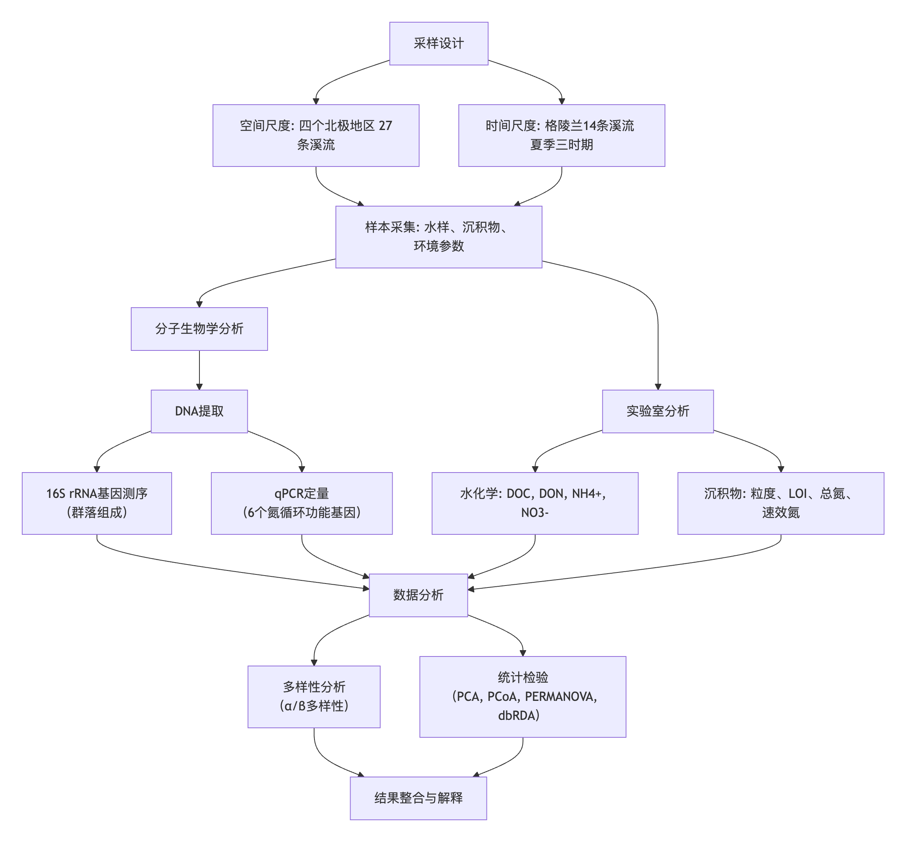
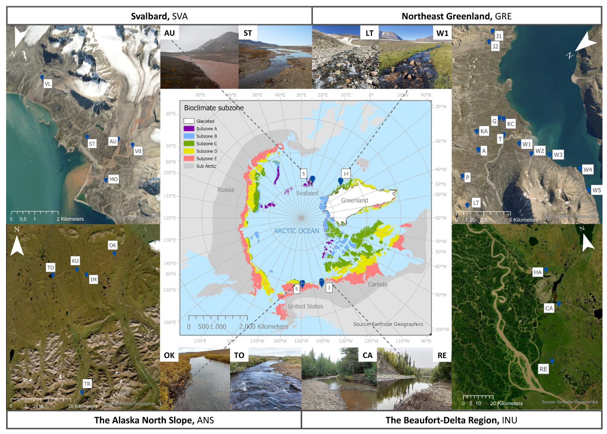
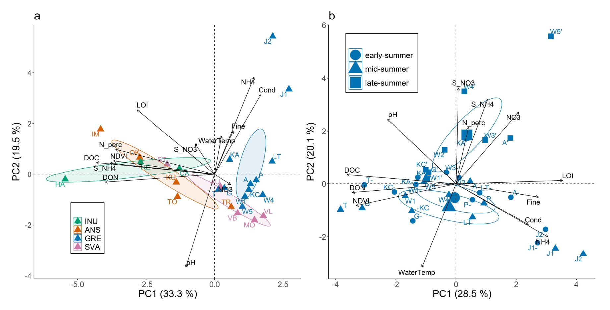
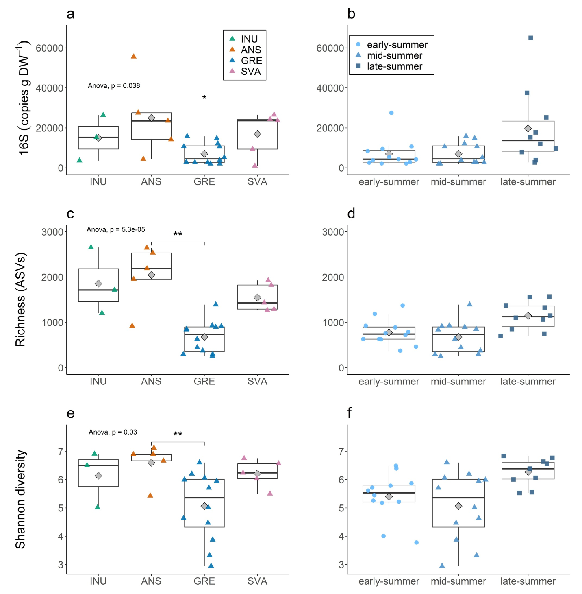
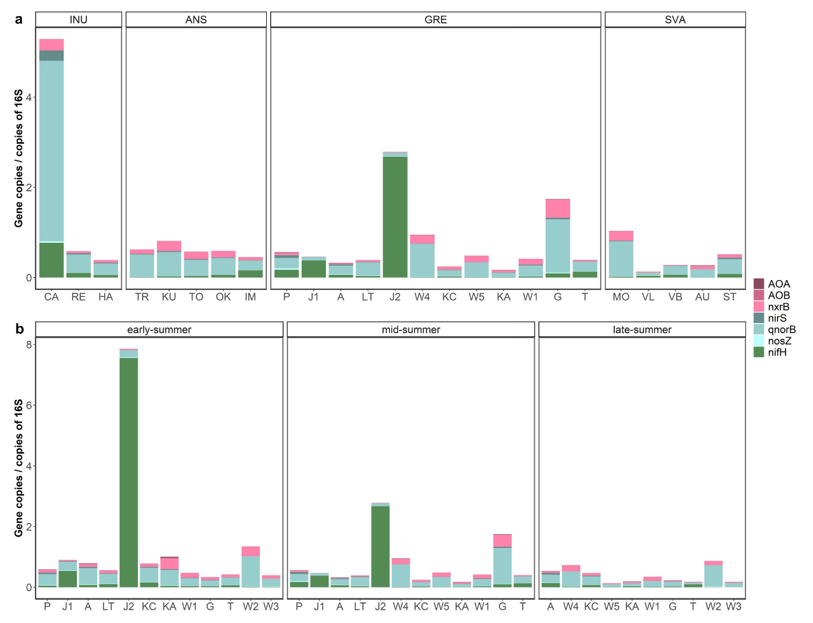
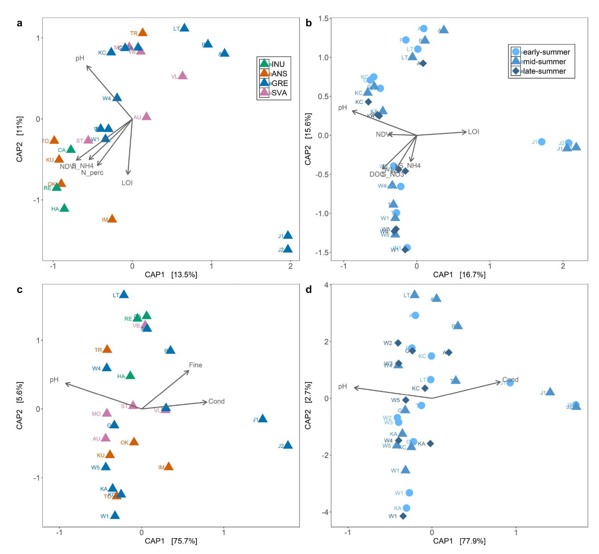

## 背景

北极变暖速度远快于全球平均水平，导致活动层加深、热喀斯特扰动加剧以及景观“绿化”。这些变化改变了向溪流输送的有机质和养分，对下游生态系统产生潜在影响。源头溪流作为景观中的生物地球化学热点，对气候变化极为敏感，但其微生物群落，尤其是河床生物膜，在泛北极尺度上的认知仍很匮乏。

微生物生物膜是溪流养分循环的主要执行者。尽管对北极河流水体的微生物研究已有进展，但对沉积物生物膜，特别是其功能基因地理格局的认识仍显不足。氮通常是北极溪流的限制性养分，其循环过程（固氮、硝化、反硝化）主要由微生物驱动。量化这些过程的关键功能基因（如nifH, amoA, nirS, nosZ等），可作为评估生态系统氮循环潜力的有效指标。

- Holmboe, C. M. H., Riis, T., Han, X., Frossard, A., Romaní, A. M., Kjær, J. B., et al. (2026). Spatial and temporal variability of microbial nitrogen cycling genes in Arctic streams. Global Biogeochemical Cycles, 40, e2025GB008569. https://doi.org/10.1029/2025GB008569
- 期刊：Global Biogeochemical Cycles （IF=5.5）
- 发表时间：2026年2月23日

本研究旨在回答三个核心问题：北极溪流沉积物原核生物群落的丰度、多样性及组成模式如何？关键氮循环功能基因的丰度与分布情况如何？环境因子与地理距离如何影响这些微生物及其功能基因的分布？研究假设严酷环境会限制微生物多样性，群落变异主要由局部环境（特别是碳氮可利用性）而非地理位置驱动，且植被覆盖和季节变化将产生重要影响。

## 材料与方法

### 研究地点与采样

研究区域覆盖从亚北极到高北极的梯度，包括加拿大波弗特-三角洲地区（高亚北极）、美国阿拉斯加北坡（低北极）、格陵兰东北部（高北极）和挪威斯瓦尔巴（高北极）。这四个地区在植被覆盖（以NDVI表征）、气候和永久冻土连续性上存在差异。2011年8月对四个地区进行了空间采样。此外，在格陵兰地区的开冰期（7月初至9月底）按“初夏”、“仲夏”、“夏末”三个时间点进行了重复采样，以探究季节动态。采集了溪流水样和沉积物混合样本，并同步测量了水温、电导率、pH等现场参数。

### 水与沉积物分析

水样经过滤后，分别用于测定溶解性有机碳、总溶解氮、铵和硝酸盐浓度。沉积物样本分析包括粒度组成、烧失量（代表有机质含量）、总氮含量以及氯化钾提取的铵和硝酸盐含量。这些分析为关联微生物数据提供了关键的环境背景变量。

### 分子生物学分析

从沉积物中提取总DNA。通过高通量测序分析16S rRNA基因的V4区，以鉴定原核生物（细菌和古菌）的群落组成，序列被聚类为扩增子序列变异进行分类学分析。同时，使用定量PCR技术，对六个参与氮循环的关键功能基因进行绝对定量，包括固氮基因（nifH）、硝化基因（细菌和古菌的amoA， nxrB）以及反硝化基因（nirS, qnorB, nosZ）。基因丰度以每克沉积物干重的拷贝数表示，并计算了相对于16S rRNA基因的 relative abundance。

### 数据分析

数据分析分为空间（跨四区域比较）和时间（格陵兰三时期比较）两部分。使用主成分分析探索环境变量的格局。通过α多样性指数（丰富度、香农指数）和β多样性分析（基于Bray-Curtis距离的主坐标分析及PERMANOVA检验）比较微生物群落。采用基于距离的冗余分析和变异分割，量化了环境变量与地理距离对原核生物群落及氮功能基因组成变异的解释程度。

## 结果

### 环境变量

环境变量显示出清晰的区域梯度。植被覆盖度（NDVI）和溪水溶解性有机碳浓度在波弗特-三角洲和阿拉斯加北坡地区最高，在格陵兰和斯瓦尔巴较低，且两者显著正相关。主成分分析表明，DOC、DON、NDVI和沉积物铵是驱动区域环境差异的主要因子。在格陵兰的季节尺度上，DOC、NDVI、沉积物有机质和氮含量是主要的变异驱动因素。

### 原核生物丰度、多样性与群落组成

原核生物16S rRNA基因的绝对丰度、分类单元丰富度和香农多样性指数在区域间存在显著差异，其中阿拉斯加北坡地区通常最高，而格陵兰地区最低。然而，尽管丰度和α多样性不同，原核生物群落的组成（β多样性）在四个区域间并未发现显著差异。变形菌门和拟杆菌门在所有地区均为最优势的门。在格陵兰的时间序列中，原核生物的丰度与α多样性指标在三个采样期间无显著差异，但多数溪流在夏末呈现出更高的趋势。与空间尺度类似，原核生物群落的组成在季节间保持稳定，同一溪流在不同时间的差异小于不同溪流之间的差异。

### 氮功能基因

氮功能基因的总丰度与原核生物16S基因丰度高度相关。各功能基因的绝对丰度也呈现区域差异，模式与原核生物丰度相似，即在阿拉斯加北坡最高，格陵兰最低。值得注意的是，尽管绝对丰度不同，但氮功能基因的相对组成（各基因占总功能基因的比例）在区域间无显著差异。在反硝化基因中，qnorB最为丰富。固氮基因nifH在所有区域均被检出，且在受酸性岩石排水影响的格陵兰J1、J2溪流中相对丰度较高。在格陵兰的季节尺度上，多数氮功能基因的丰度未显示显著时间变化，仅nxrB基因的相对丰度在初夏高于夏末，而nirS和nosZ基因的绝对丰度在夏末有所升高。

### 环境驱动因素

统计分析表明，原核生物群落的丰度和α多样性与NDVI、DOC及沉积物总氮含量呈显著正相关。基于距离的冗余分析显示，原核生物群落的组成主要受NDVI、pH、沉积物有机质、铵和总氮驱动，而地理距离的解释力微乎其微。对于氮功能基因的组成，主要的驱动因子是溪水的pH和电导率，细沉积物含量也有一定影响。变异分割分析证实，环境变量解释了微生物群落和功能基因组成变异的绝大部分，地理距离的贡献极小。

## 讨论

### 跨北极溪流沉积物的原核生物群落

本研究发现北极溪流沉积物的原核生物α多样性低于温带地区，支持了微生物多样性随纬度升高而降低的格局。变形菌门和拟杆菌门的优势地位与全球其他淡水沉积物的报道一致。尽管从亚北极到高北极的环境梯度剧烈，但原核生物群落组成并未随地理区域而发生系统性变化，反而在同一地区内不同溪流间的差异可能与跨区域差异一样大。这支持了“万物皆存，环境选择”的微生物生物地理学观点，表明强扩散能力和环境过滤共同塑造了这些群落。研究结果强调，溪流的局部环境条件（尤其是与碳氮输入相关的因子）是决定微生物群落结构的首要因素，其重要性远超地理隔离效应。

植被覆盖通过影响输入溪流的溶解性有机质，间接调控了微生物的丰度和多样性。在格陵兰，两个具有独特地球化学特征（低pH、高电导率、高铵）的溪流（J1, J2）拥有显著不同的原核生物群落，富含铁氧化菌和硫氧化菌，这揭示了地质背景和潜在的酸性岩石排水过程对微生物群落的强烈选择作用。这种局地异质性在气候变暖、冻土融化的背景下可能愈加凸显。

### 跨北极溪流沉积物的氮循环功能潜力

氮功能基因的丰度格局与原核生物总丰度紧密耦合，表明微生物整体数量的增加会带动各功能基因数量的提升。然而，功能基因组成的稳定性暗示，参与不同氮转化过程的微生物类群在北极溪流中广泛存在，具备功能冗余性。一旦环境条件改变，这些预先存在的遗传潜力可能被迅速激活。

较高的固氮基因nifH丰度表明，固氮作用可能是北极淡水生态系统一个被低估的氮输入途径。反硝化基因之间存在强相关性，特别是nxrB与qnorB、nosZ的耦合，提示硝化过程与反硝化过程在这些寡营养溪流中紧密衔接。较低的nirS/nosZ基因比例暗示这些生态系统可能倾向于将硝酸盐完全还原为氮气，而非释放温室气体氧化亚氮。需要指出的是，功能基因的丰度仅代表遗传潜力，未来的研究需结合过程速率测量，以准确评估这些基因表达所实现的实际生态功能。

### 高北极溪流微生物群落与功能的时间动态

在格陵兰，夏末的原核生物多样性有增加趋势，这可能与夏末水文条件稳定、水温适宜、光照充足以及来自增厚活动层的养分释放增加有关。这段时期可能是微生物生长和代谢活动的关键窗口。然而，微生物群落和氮功能基因的组成在夏季保持相对稳定，表明核心功能类群具有时间持续性。这种组成稳定性结合功能基因的持续存在，为生态系统在短生长季内维持必要的氮循环功能提供了基础。仅亚硝酸盐氧化还原酶基因在初夏的相对丰度较高，可能响应了融雪期特殊的氮化学形态。

## 结论与意义

本研究系统揭示了环境特征，特别是集水区植被和溪流有机质浓度，是控制北极溪流沉积物微生物丰度、多样性及氮循环功能潜力的主导因素。尽管存在空间环境梯度，但微生物群落在组成和功能基因构成上展现了高度的泛北极相似性，凸显了环境过滤而非地理限制的核心作用。

研究结果对预测气候变化下的北极溪流生态系统响应具有重要启示。北极的“绿化”、生长季延长以及永久冻土融化，预计将增加陆地有机质和养分向溪流的输送，从而可能提升微生物的整体丰度和活性，增强溪流内部对氮的转化与移除能力。这可能会改变从陆地向沿海海域输送的氮的形态与通量，产生更广泛的生态影响。未来的研究需整合基因、转录、蛋白及过程速率多组学数据，并涵盖目前研究不足的北极区域（如俄罗斯北极），以更全面、机制性地理解快速变化中北极淡水生态系统的微生物驱动机制。
