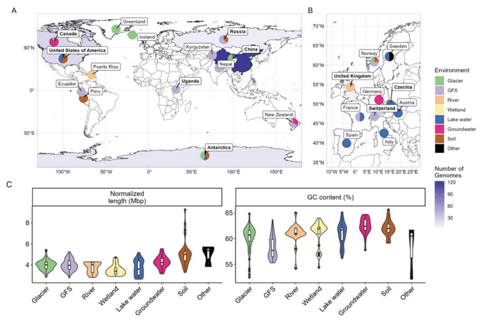
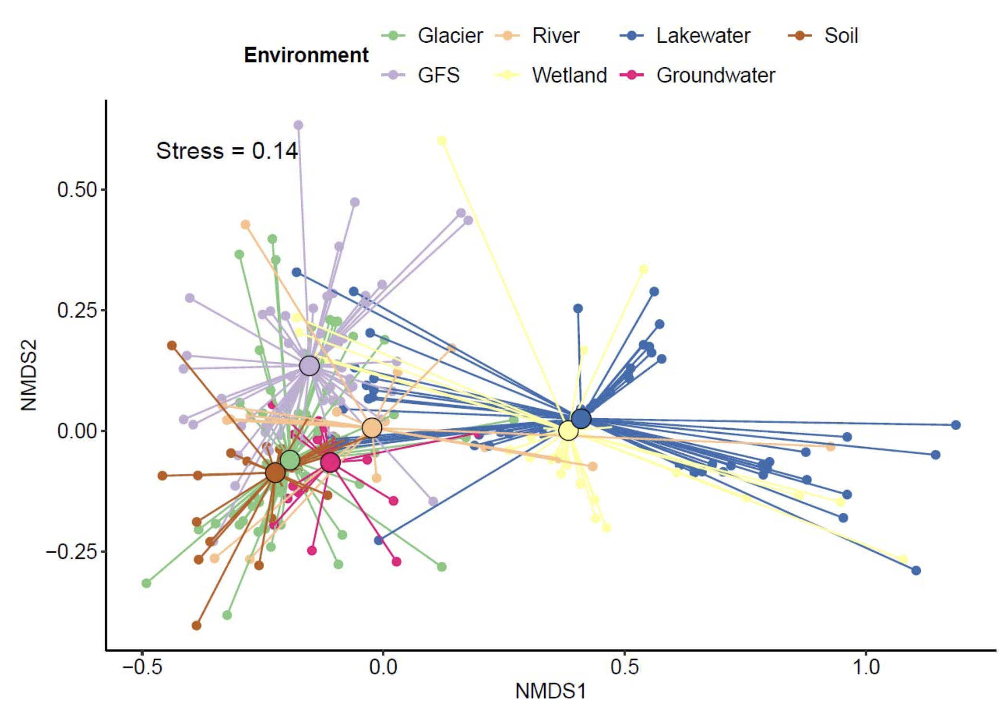
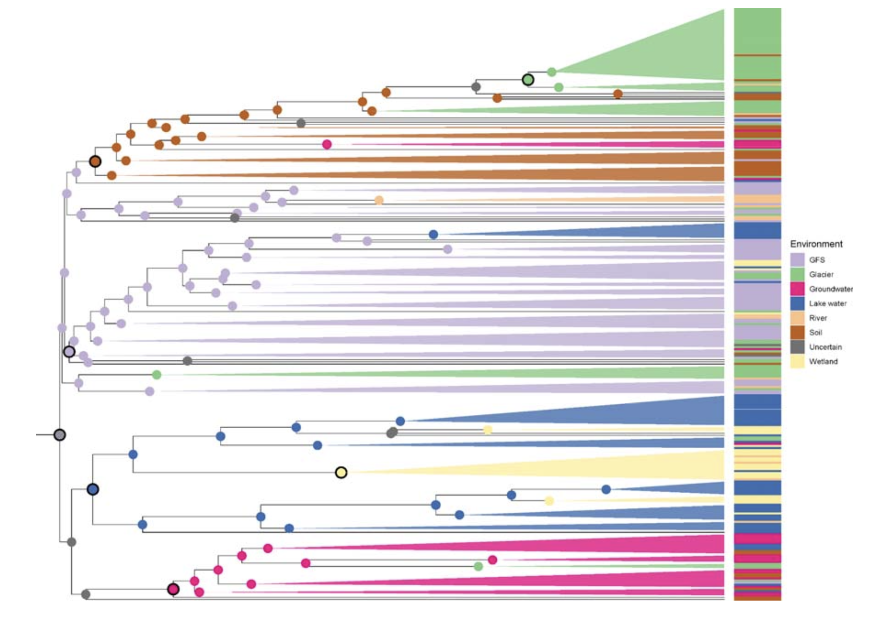
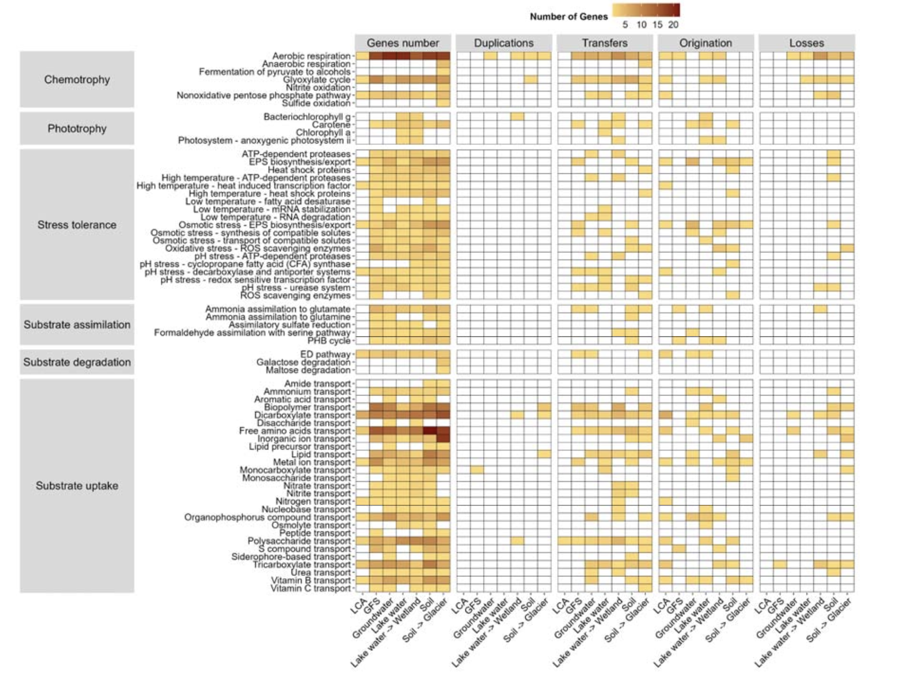
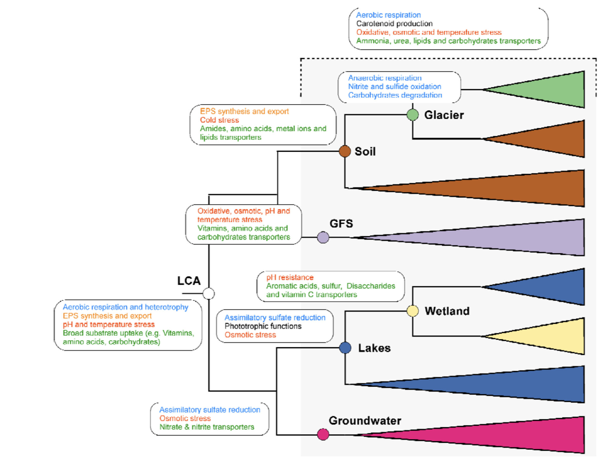

## 背景

生态或生境转换，例如植物登陆、海洋与淡水环境间的转换，是整个生命树演化的重要驱动力。与真核生物相比，细菌生境转换的记录及其对生态和进化的重要性研究有限，主要集中在如海洋-淡水分离、土壤和水生生态系统、宿主关联生活方式或内共生事件等少数事件上。细菌的生境转换通常与由基因组精简化和水平基因转移介导的功能适应相关。尽管生境转换对细菌生态和进化有重要影响，但其基因组基础如何与当今优势细菌类群的成功相关联，在总体上仍研究不足。

高扩散能力、代谢多样性、应激耐受、摄取外源DNA的能力以及允许适应的大量基因库，是成功生境转换的关键要求。此外，冰冻圈环境因其高度的时空异质性以及冰冻与液态生境之间的连通性，可能成为生境转换的热点区域。类似全球雪球地球时期的冰川作用，冰冻圈仍然是微生物生命的高度选择环境。适应冰冻圈条件的微生物谱系能够应对低温、渗透胁迫、辐射胁迫和极端寡营养。

Polaromonas是一个标志性的细菌属，具有全球性分布，广泛报道于众多冰冻圈（如冰川、冻土）和非冰冻圈生态系统（如湿地、地下水）。Polaromonas具有代谢多样性，拥有参与异养过程的基因，能够降解有机碳，甚至一些物种能够降解氢或砷等难降解有机化合物。此外，与原绿球藻等海洋细菌不同，Polaromonas的基因组并未精简，其平均大小为3至5 Mb，GC含量为50-60%，这对冰冻圈类群来说是典型的。比较基因组学揭示了水平基因转移在塑造Polaromonas遗传多样性及其适应寒冷环境潜力中的作用。Polaromonas显然易于长距离扩散，这可能促进了生境转换，并解释了其在高海拔空气和雪中的出现。此外，局部选择压力以及Polaromonas与其他细菌和藻类的相互作用，驱动了该属内的生态位分离和微进化。这种微进化可能导致形成与特定环境相关的Polaromonas系统发育型。最近的一项研究显示，在北极环境中发现的8个Polaromonas与在其他地方（如冰川、地下水和废水）发现的菌株之间存在明确的功能选择，前者倾向于拥有更大的基因组，并增加了与渗透保护和碳水化合物代谢相关的基因。然而，这项研究并未涉及Polaromonas跨冰冻圈环境以及从冰冻圈到非冰冻圈环境的转换和进化历史。

一个与跨环境辐射相关的假说与雪球地球上的生态系统迁移有关，在雪球地球期间，极地-高山生物群系的扩张使得适应性的细菌能够迁移、生存和进化，并在冰期后重新定殖。雪球地球时期对许多谱系的进化和辐射都很重要，并通过生境转换进入冰消后出现的各种环境。因此，直观上可以将冰川视为细菌多样性的摇篮，融水和其中所含的细胞在流经河流、湖泊以及洪水期间进入陆地生态系统，促进了生境转换。此外，冰川也可被视为冰消期间冰冻圈微生物的“避难所”，从而提供长期的寒冷生境。因此，研究人员认为Polaromonas是研究细菌生境转换乃至冰冻圈在其进化中潜在作用的良好模型系统。

Evolutionary radiation of Polaromonas from mountain glaciers downstream
Grégoire Michoud, Aileen Geers, Hannes Peter, Amy C. Thorpe, Zhi-Ping Zhong, Virginia Rich, Tom J. Battin
bioRxiv 2026.02.18.706520; doi: https://doi.org/10.64898/2026.02.18.706520

在这篇研究中，研究人员探索了包含282个来自广泛冰冻圈和非冰冻圈生态系统的高质量基因组的Polaromonas泛基因组。这使得研究人员能够探索Polaromonas种群间的基因组变异广度，并揭示允许这些细菌定殖多样且通常是极端环境的机制。利用系统发育一致性分析，为Polaromonas的基因组进化提供了新见解，评估了其祖先状态以及其在跨越生境转换过程中基因库的重排。总之，该研究结果为一个最成功的细菌类群的生态和进化提供了新的视角，其根源可能在于世界各地的冰川及其溪流，而由于气候变化，这些冰川和溪流正在快速变化。该研究结果支持了冰冻圈在微生物多样化中发挥作用的观点，并对下游生态系统产生了影响。因此，该研究为冰冻圈如何塑造并继续影响全球遗传和生态景观提供了一个微生物学视角。

## 方法

### 微生物图谱
研究人员使用Microbe Atlas数据库来探索Polaromonas在不同环境中的空间分布。由于Polaromonas在某些试剂盒中被发现是潜在污染物，研究人员选择了一个相对较高的丰度阈值（>0.1%相对丰度）来认为其存在。

### 基因组收集
研究人员从不同来源获得了632个Polaromonas基因组，包括来自TPMC、TG2G、英国河流、GROW DB、冰川补给河流的宏基因组组装基因组，以及通过NCBI数据集软件下载的基因组。来自古里雅冰川宏基因组的32个宏基因组组装基因组是使用集成分组和精炼流程重建的。研究人员评估了所有宏基因组组装基因组的分类和质量，然后删除了未被注释为Polaromonas的基因组以及完整度低于70%和污染率高于10%的基因组。为了去除重复基因组，研究人员将其在99%的相似度下去复制，总共得到302个基因组。由于研究人员只对淡水生境感兴趣，删除了从矿山排水、活性污泥、垃圾填埋场、冻土、宿主相关和生物反应器环境中分离的菌株，但培养物种除外，最终得到总共282个基因组。有趣的是，NCBI数据库中有许多被标记为Polaromonas的基因组，实际上并非Polaromonas，而是被GTDB分类为JAAFIP01或JAAFJR01属。由于其独特的基因组内容，研究人员决定将它们从Polaromonas泛基因组分析中排除。由于各数据库中元数据存储方式的不同，研究人员无法进一步详述样本采集的环境类型。此外，许多样本相关的元数据缺失，例如温度、盐度浓度或碳含量。由于最近发布的全球数据集，大多数公开可用的Polaromonas来自青藏高原，其次是瑞士、加拿大和美国。

### 泛基因组分析
选择的282个基因组用Baka、microtrait和eggnog-mapper进行了注释。用Genomad识别了每个基因组上的可移动遗传元件。然后使用PPanGGOLiN创建泛基因组，使用默认参数，除了分区数定义为3。PPanGGOLiN通过mmseqs2将蛋白质聚类为基因家族，身份和覆盖率为80%。这些基因家族随后分为三类：持久基因、壳基因和云基因。然后通过MAFFT软件对齐持久基因家族和壳基因家族。基于基因的存在频率及其基因组邻接，将基因分为持久基因、壳基因和云基因，这些基因几乎存在于所有基因组、中等频率或低频存在。

### 物种树估计与一致性分析
然后，研究人员使用mrBayes为每个基因家族创建基因树。运行马尔可夫链蒙特卡洛分析，生成300,000代，每300代采样一次树，每1,000代评估一次收敛诊断。然后，研究人员使用AleRax，利用从mrBayes获得的基因树推断物种树。构建了初始物种树。为了考虑宏基因组组装基因组中缺失的基因，包含了每个基因组的完整度值的缺失分数文件。为了减少运行时间，研究人员移除了0.5%的最大基因家族，并且只考虑了至少存在于30个基因组中的基因家族。最终的根植物种树是通过基于最大似然的一致性分析方法推断的。然后，利用这个物种树，研究人员用基因树进行了一致性分析，以确定基因重排参数，该参数考虑了基因复制、水平基因转移和基因丢失事件。该分析使用了每个家族模型参数化，允许每个基因家族使用不同的进化模型，并使用100个抽样的基因树以提高鲁棒性。使用PastML进行祖先状态重建以可视化生境进化，该软件计算每个内部节点的祖先状态。研究人员使用R及相关的软件包进行后续分析和绘制图表。

## 结果与讨论

### Polaromonas的分布与多样性

首先，研究人员探索了Polaromonas的空间分布，以评估其在不同环境中定殖和栖息的能力。为此，研究人员分析了来自Microbe Atlas Project的16S rRNA基因数据。研究发现Polaromonas存在于所有大陆和广泛的生态系统中，包括河流、湖泊和水库、地下水、冰川冰和冰雪、土壤、沉积物以及动植物宿主。大多数Polaromonas记录位于水生环境，包括冰川和冰，其次是土壤和沉积物，以及动植物宿主。在海洋或盐湖中，Polaromonas仅在相对丰度较低（<0.1%）的情况下被发现，只有低温和低盐度的河口（如芬兰和南极洲）例外，这表明该属尚未在全球范围内突破盐度屏障。

接着，研究人员编制了基因组列表以研究Polaromonas的泛基因组，包括宏基因组组装基因组、单细胞基因组和从分离株测序获得的基因组。研究人员从NCBI基因库、西藏水生微生物组、西藏冰川微生物组、冰川补给河流微生物组、古里雅冰帽、英国和美国河流微生物组收集了基因组。这些基因组经过质量过滤，并利用基因组分类学数据库确认了分类学。最终保留了来自广泛冰冻圈和非冰冻圈环境的282个非冗余基因组，包括冰川、冰川补给河流、低地河流、湿地、湖泊、地下水、土壤和其他生境。

考虑到污染率和完整度，Polaromonas基因组的平均长度为4.04±0.8 Mbp，平均GC含量为60.4±2.5%。来自不同环境的Polaromonas基因组大小存在差异，来自土壤的基因组显著大于其他环境，地下水和模式菌株的基因组大小与之相似。这些结果符合预期，因为“陆地”基因组往往比“水生”基因组大，而分离株的基因组比宏基因组组装基因组大。GC含量的分布与先前报道相似，在环境间没有显著差异。

### 跨环境的基因组分化

为了探索Polaromonas基因组在不同环境中如何不同，研究人员基于持久基因、壳基因和云基因分析了泛基因组。从282个基因组中共获取了958,785个基因，将其划分为214,664个基因家族，并进一步分为1,905个持久基因家族、11,772个壳基因家族和200,987个云基因家族。平均而言，每个持久基因、壳基因和云基因家族分别存在于61.3±22.7%、7.6±4.9%和0.6±0.6%的基因组中。基于持久基因的存在与否，研究人员观察到了清晰的环境分离。这种环境分离在所有分析的基因类别中均一致观察到，但对于云基因和壳基因最为明显，相比持久基因而言。这种模式可归因于云基因和壳基因在整个泛基因组中共享频率较低，因此可能比持久基因对生物核心功能的重要性更低。因此，它们更可能编码促进适应特定环境条件的功能，从而驱动了更清晰的环境间分离。

有趣的是，研究人员发现一方面来自湖泊和湿地的基因组有明显聚类，另一方面来自冰川补给河流、冰川、土壤、低地河流和地下水的基因组聚类在一起。这表明Polaromonas菌株对不同环境的适应存在差异，表现为基因库的不同。类似的发现已在从土壤到淡水环境的浮霉菌门和从湖泊到海洋的甲基杆菌科的转换中报道。在这些情况下，许多变化是通过基因丢失和基因组精简来适应主要寡营养条件。然而，在此并未观察到基因组减小的迹象，表明适应各种环境的进化模式不同。

### 祖先生境与转换

为了进一步探索生境转换对Polaromonas辐射的重要性，研究人员基于存在于至少30个基因组（即约占泛基因组的10%）中的持久基因和壳基因构建了系统发育树。系统发育分析揭示了四个主要聚类，分别将大多数来自地下水、湖泊和湿地、冰川补给河流、以及土壤和冰川的基因组分组。这种模式表明在生境偏好上存在显著的系统发育保守性，并且亲缘关系密切的谱系在相似环境中存在一致的聚类。因此，环境过滤而非扩散将在塑造微生物组成中起主要作用。事实上，如果扩散更频繁和成功，将会期望看到“混合的”系统发育信号，即相关谱系会出现在多个环境中而没有清晰聚类。相反，环境聚类表明选择压力足够强大，以维持特定生境的谱系，限制其在自身环境之外的成功定殖。这些结果将支持生态位保守性假说，即物种倾向于随时间保留其祖先的生态特征。此外，该结果表明谱系通常仍然特化于其祖先所占据的环境。因此，亲缘关系密切的基因组更可能在相似生境中被发现，而它们跨越生境的转换似乎很少。

接下来，研究人员预测了系统发育树每个内部节点的潜在祖先生境，并推断了Polaromonas的生境转换。有趣的是，分析将Polaromonas系统发育树的根定位在冰川补给河流环境中。研究人员对此发现持谨慎态度，因为接近树根的预测尤其不确定。进一步分析预测，Polaromonas从其假定的祖先生境（冰川补给河流）转换到地下水、湖泊和湿地，以及土壤和冰川。Polaromonas的最近共同祖先在早期祖先阶段就停留在了冰川补给河流，而其他谱系则辐射到土壤，然后到冰川。另一个谱系分化为地下水，最后一个谱系从湖泊转换到湿地。

虽然这些生境转换的广泛模式看起来相对清晰，但也检测到在Polaromonas系统发育树中存在多次转换的迹象。在整个系统发育树中发现了多达10个来自相同环境（例如，河流）的宏基因组组装基因组，这表明某些生境转换发生了多次。预测会发生多次生境转换，这对于宿主相关细菌来说似乎尤为真实。此外，研究人员假设转换与冰消期循环有关，在此期间冰盖为适应寒冷的微生物创造了“气候避难所”。随着冰川的退缩和扩张，通过水文混合的扩散变化很大，这可能促进了某些生境中Polaromonas的遗传混合和多样化。值得注意的是，在整个系统发育树中发现了来自低地河流的基因组，并且通常与来自冰川补给河流的基因组在几个小的宏基因组组装基因组簇中系统发育关系接近。这表明低地河流充当了来自例如土壤或地下水的Polaromonas宏基因组组装基因组的收集者。

### 基因重排

为了深入了解Polaromonas生境转换中可能伴随的基因重排机制，研究人员将重点放在了预测发生主要生境转换的内部节点上。这些转换发生在几个阶段，包括Polaromonas最近共同祖先谱系对冰川补给河流、地下水、湖泊和土壤的适应，以及Polaromonas从湖泊到湿地和从土壤到冰川的转换。

对于每个转换，确定了重复、转移、丢失和起源对每个预测基因家族的相对重要性。虽然基因遗传通常是垂直地从母细胞到子细胞，但原核基因容易受到相对高频率的转移和丢失，重复则较少。转移，无论是通过水平基因转移还是基因重组发生，往往会均质化基因库。基因丢失在原核生物中也很频繁，并且在共生情况下往往会降低细胞的代谢能力，但在生物面临突然的环境挑战时，基因丢失也可以作为一种适应性进化力量，正如“少即是多”假说所阐述的那样。例如，丢失参与环境中可获得化合物生物合成的基因，将使细胞能够将其能量用于其他目的，如生物膜形成。

研究发现转移和丢失主导了基因重排事件，相对于重复和起源而言。这种模式与对原核生物基因重排的一般观察一致。

由于水平转移的数量相对较高，研究人员进一步寻找了此类事件的基因组证据。首先，预测了每个基因组中存在质粒和病毒。由于大多数基因组是由宏基因组组装的，研究人员承认与此分析相关的可能偏差。尽管如此，研究发现平均95.2%的基因组拥有至少一个质粒，范围从土壤的80.6%到河流的100%。此外，许多基因组要么拥有前噬菌体，要么被病毒感染；预测80%的湿地基因组曾被病毒感染，而只有29%的冰川基因组被感染，这可能是由于湿地或土壤中的细胞密度高于冰川。正如预期，这些可移动遗传元件上的大多数基因被预测在生境转换时被转移。这些结果可以解释为什么Polaromonas属是微多样的，即在比物种更精细的系统发育水平上观察到适应性。事实上，病毒对群落间基因库多样性的相关性已有记载，并且认为维持高菌株多样性可防止特定菌株积累资源。可移动遗传元件的高丰度及其在生境转换中的存在，可以通过选择对抗其他种群或允许选定的物种在不同环境中多样化，从而促进Polaromonas物种适应不断变化的环境条件。

### Polaromonas的最近共同祖先

在揭示了Polaromonas的主要生境转换之后，研究人员进一步评估了其最近共同祖先的基因组特征。首先注意到，毫不奇怪，绝大多数基因重排事件是起源。结果表明了一系列生理和代谢特征，使最近共同祖先能够适应多样化和波动的环境条件。最有可能的是，它显示了有氧呼吸和异养能力，允许利用各种有机能源。此外，预测表明它能够合成和输出胞外聚合物，通常与生物膜形成相关。它还拥有与pH胁迫和温度胁迫相关的基因。最后，Polaromonas的最近共同祖先可能拥有多样化的底物摄取系统，包括羧酸盐、简单和复杂碳水化合物、游离氨基酸、金属离子、含氮化合物、有机磷化合物和维生素B的转运蛋白。

总之，这些特征与能够利用广泛底物的生物膜生活方式一致。事实上，这些特征有利于在冰川补给河流中栖息，在那里生物膜减少了湍流引起的微生物细胞侵蚀，并且能源随时间波动。尽管环境预测表明Polaromonas的最近共同祖先栖息在冰川补给河流，但与其他生境转换节点相比，预测其基因组中基因数量相对较少，这使得功能比较具有挑战性。事实上，在这些预测基因组中缺少某个基因不能被视为其真正缺失的确凿证据。因此，研究人员不认为最近共同祖先直接从冰川补给河流转换到其他生态系统；相反，研究人员考虑了最近共同祖先对特定环境的适应，以及从湖泊到湿地和从土壤到冰川的转换。

### 对生境转换的基因组适应

Polaromonas最近共同祖先的特征随着每次向下游水生和陆地生态系统的转换而多样化。总体而言，在各种生境适应和转换节点上的预测节点特异性基因组倾向于拥有比最近共同祖先基因组更多的代谢基因。最近共同祖先下游的基因组以更完整的有氧呼吸机制为特征。在生境转换节点的所有基因组中都存在基本的化能营养功能。还注意到存在参与类胡萝卜素神经孢素生物合成的基因，神经孢素是番茄红素和其他类胡萝卜素生物合成中的中间体，它们参与抵御紫外线辐射和氧化胁迫的保护。除了在最近共同祖先基因组中观察到的许多转运蛋白之外，不同生境转换节点存在的基因组拥有与铵、尿素、生物聚合物、脂质和多糖底物摄取相关的基因。此外，与胁迫相关的基因，如热激蛋白、ATP依赖性蛋白酶、相容性溶质转运和活性氧清除酶，可提供针对高温、高盐条件和氧化损伤的保护。总之，这种基因库使Polaromonas物种能够利用多样的碳和氮源，同时抵御热、渗透、pH和氧化胁迫。这些特征促进了Polaromonas向各种水生和陆地生态系统的辐射。

尽管不同生境转换节点的基因组共享遗传库，但研究人员注意到发生了不同的基因组分化，取决于发现这些基因组的环境。例如，转换到冰川补给河流的基因组拥有许多与适应寒冷温度相关的基因，并且也拥有与氧化和渗透胁迫相关的基因，可能是为了抵消高海拔高紫外线辐射以及冰川补给河流周期性干燥相关氧化还原变化的影响。与氨基酸、肽、糖、有机磷酸盐和维生素转运相关的基因数量升高，共同提示了与藻类的相互作用以及冰川补给河流生物膜内营养物质的循环。有趣的是，这些基因中有相对较高比例被预测是水平转移自其他Polaromonas菌株。研究人员将此解释为Polaromonas对冰川补给河流极端和波动环境的适应性反应。

沿着水文连续体，从Polaromonas祖先转换到湖泊的特点是几个显著重要的基因组修饰，促进了浮游生活方式。事实上，该结果表明Polaromonas基因组在光能营养基因中显著富集，增加了与叶绿素a和g生物合成以及番茄红素和缺氧光系统生物合成相关的功能。这些修饰主要通过起源和基因转移发生，并且未在其他生境转换中发现，突出了Polaromonas的可塑性。预测湿地Polaromonas基因组来源于湖泊基因组，研究人员观察到了对芳香酸、二糖、维生素C和硫化合物等不同转运蛋白的获得，从而扩展了其清除广泛有机分子的能力。湿地基因组还获得了参与pH抗性的基因，如用于膜稳定的环丙烷脂肪酸合酶。总之，许多与湖水不同的基因似乎是水平转移的，这表明对湿地波动环境的适应。

如果正如预测，Polaromonas的最近共同祖先栖息在冰川补给河流，那么它通过与这些水源的持续交换而殖民地下水似乎是直观的。研究人员发现Polaromonas最近共同祖先向地下水的转换伴随着与氮，特别是硝酸盐和亚硝酸盐转运蛋白相关的转运蛋白的扩展。类似地，存在更多胁迫耐受基因。此外，类似于湖泊转换，研究人员发现了同化硫酸盐还原途径的潜力，揭示了硫代谢能力的某些作用。几个与异养、pH胁迫、低温和脂质及生物聚合物转运蛋白相关的基因是通过水平转移获得的。特别是与类胡萝卜素、高温和盐胁迫相关的基因被预测起源于向地下水特定转换时，而非从最近共同祖先遗传而来。

最近共同祖先向土壤的转换以基因组中更高数量的与底物摄取相关的基因为标志，例如酰胺、氨基酸、脂质或金属离子转运系统。这可能反映了对陆地环境中与水生环境中更均质底物相比的营养异质性和斑块性的适应。此外，胁迫耐受机制比其他环境更为发达，包括参与胞外聚合物生物合成和输出能力的基因数量增加。这表明Polaromonas在土壤中也能够形成生物膜，例如，这将使其能够增加养分可用性和耐旱性。还注意到脂肪酸去饱和酶的存在，它们已被证明参与低温胁迫。

当Polaromonas在土壤和冰川之间转换时，研究人员注意到明显的基因组适应。在冰川-冰消循环期间，Polaromonas很可能在冰川和冰前土壤之间反复转换。事实上，与这些循环相关的扩散增加阶段可能促进了这些生境转换。冰川Polaromonas基因组获得了与厌氧呼吸、亚硝酸盐氧化和硫化物氧化相关的基因，表明通过水平转移适应缺氧条件和化能自养代谢。此外，研究人员注意到存在参与半乳糖和麦芽糖降解的基因，表明适应有限碳源的专门碳水化合物代谢。碳水化合物可能源自能够在这些环境中大量繁殖的冰雪藻。有趣的是，冰川中的Polaromonas基因组丢失了一些与单糖、硝酸盐和亚硝酸盐转运相关的基因，可能反映了对冰川中寡营养和氧化条件的适应，在这种环境中此类底物可能比其他环境更稀缺。糖降解基因与相同化合物转运蛋白的丢失并存，可能表明冰川中的Polaromonas可能更倾向于细胞内代谢，而非维持多种转运系统。

总之，该祖先重建表明，标志性和全球分布的细菌属Polaromonas从山顶的冰川补给河流向下游辐射到各种水生和陆地生态系统。Polaromonas的最近共同祖先很可能是一个生物膜形成者，是一种最成功的微生物生活方式，具有将异养和呼吸能力与广泛的底物转运和胁迫响应系统相结合的多功能代谢。这些特征反映了对冰川补给河流和冰川典型的波动和恶劣环境条件的适应。随着Polaromonas谱系多样化向下游殖民水生和陆地生态系统，它们倾向于保留参与胁迫响应和胞外聚合物生物合成的基因，这表明生物膜形成在该细菌属的整个进化历史中仍然是适应多样化环境条件的主要特征。该分析揭示，通过基因获得和丢失以及水平转移实现的适应极大地促进了生境转换。例如湖泊和湿地谱系中光能营养功能和硫代谢的获得，以及地下水和土壤中氮和脂质摄取系统的增强。伴随跨越水生和陆地生态系统的各种转换的独特适应，突出了Polaromonas的基因组可塑性是其成功的关键。该研究结果也揭示了冰川和溪流作为细菌进化和多样性的潜在摇篮的作用。

