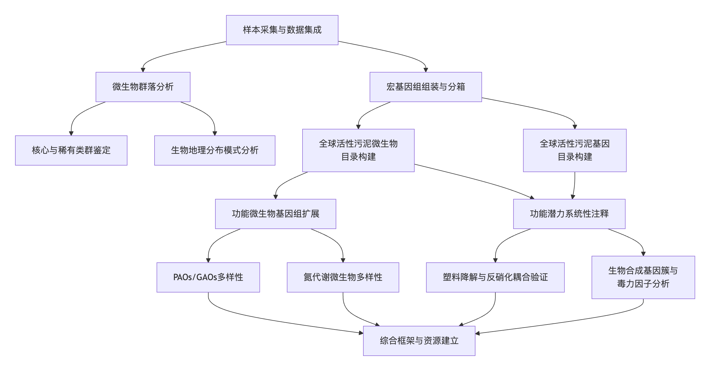
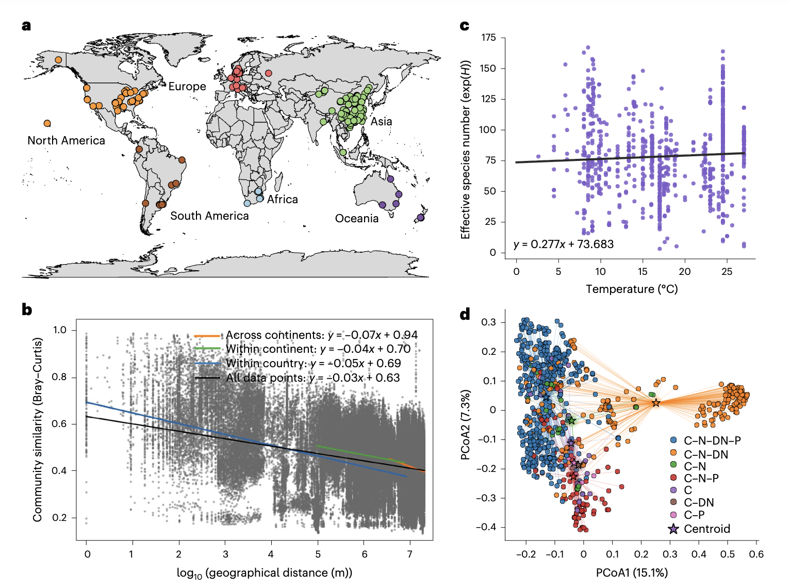
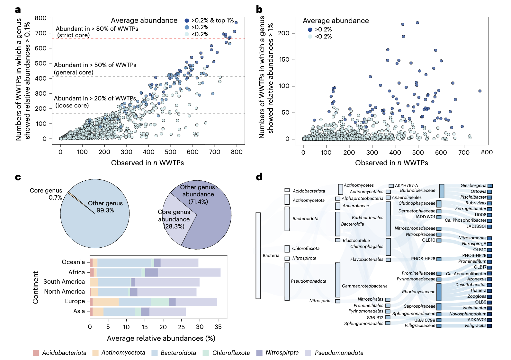
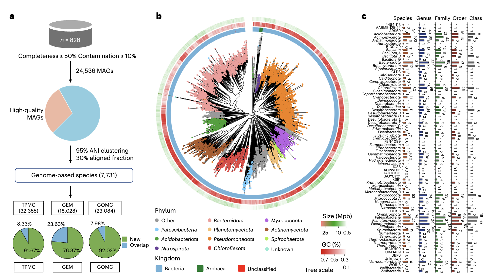
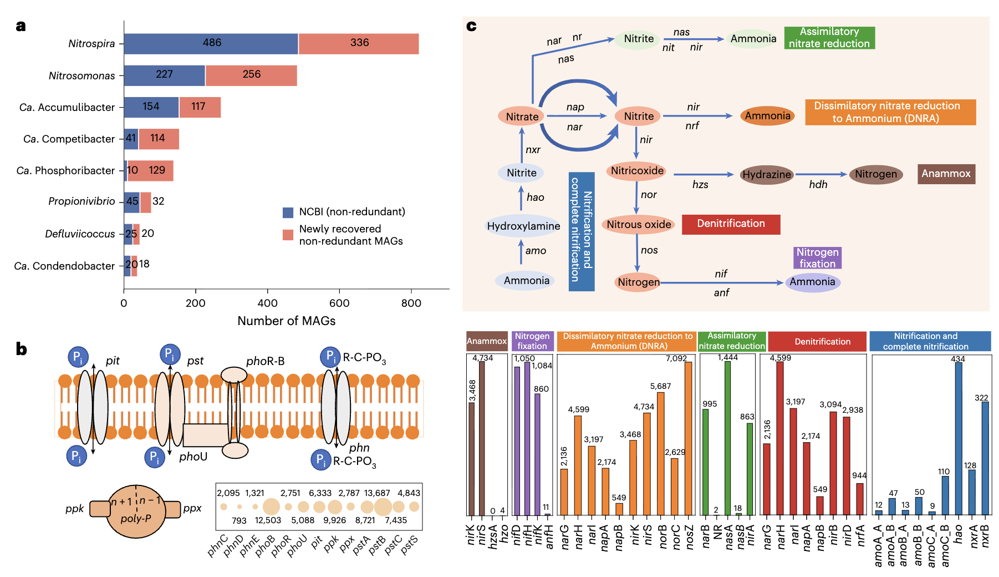
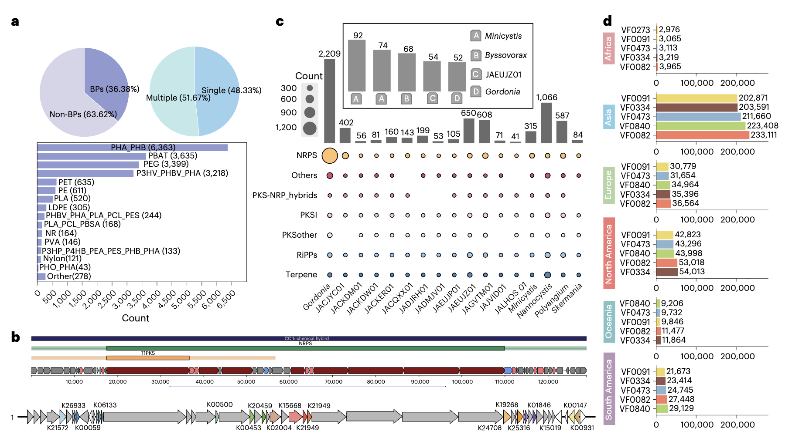

## 背景
工业的快速发展和人口增长加剧了全球水资源短缺。污水处理厂是保护水环境和水资源的重要基础设施，对水资源的可持续性和可及性至关重要。废水中含有污染物和必需元素（如磷和氮），其去除和再利用的潜力尚未被完全发掘。为实现联合国可持续发展目标（目标6：清洁饮水和卫生设施），研究人员致力于通过依赖活性污泥中微生物介导的复杂生化反应来开发创新技术，以提高处理效率。全面理解活性污泥的微生物群落，以及在全局尺度上了解全球污水处理厂中关键微生物的身份、遗传组成、代谢潜力、生物多样性和生物地理分布，对于实现先进的工艺控制和管理、提升可持续性至关重要。

活性污泥中的微生物群落高度复杂且多样。基于16S rRNA基因的扩增子测序技术（如MiDAS数据库）在表征其全球多样性方面取得了进展。然而，这类技术依赖于通用引物和聚合酶链式反应，在表征细菌群落时存在固有偏差，难以区分近缘物种，也无法直接揭示功能，从而限制了我们对微生物代谢能力的深入理解。因此，迫切需要超越基于16S rRNA基因的全局分析，转向能够更准确地将微生物身份与其生态角色和功能联系起来的基因组解析研究。

基于高质量、完整基因组序列的分析能够提供更精细的代谢特征。已有研究利用宏基因组学从特定地区的污水处理厂中恢复了数千个高质量MAGs，揭示了许多关键功能群中未被表征的谱系。然而，现有的基因组解析研究多局限于特定区域或处理工艺，缺乏一个能够捕捉活性污泥微生物群落全部多样性、功能潜力和普遍生态模式的全球视野。例如，已知的聚磷菌仅能解释全规模系统中24-70%的磷去除，这表明在识别关键污染物去除和转化过程的贡献者方面存在巨大空白。同时，污水处理厂中新型氮转化微生物的不断发现，也凸显了系统性筛查活性污泥微生物群落以发现未知类群的必然性。鉴于这些研究空白，开展一项全球性的基因组解析调查势在必行，它能够提供对常见于不同系统且存在差异的微生物身份和功能的深入理解，为未来研究市政污水处理厂活性污泥的微生物学与微生物生态学提供必要的基础数据集。

- Xie, X., Yuan, J., Huang, Y. et al. Metagenome-resolved global microbial diversity and function in activated-sludge wastewater treatment systems. Nat Water 4, 228–240 (2026). https://doi.org/10.1038/s44221-025-00576-8
- 期刊：Nature Water (IF 24.1)
- 发表时间：2026年1月23日

本研究通过对覆盖六大洲的828个污水处理厂活性污泥样本进行选择性采样和整合分析，建立了一个全球尺度的活性污泥宏基因组目录，包含24,536个宏基因组组装基因组和超过2400万个非冗余基因。该目录揭示了12,563个在物种水平上未被定义的MAGs，并绘制了高分辨率的、基因组水平的相对丰度与全球分布图谱。这一全球MAGs集合增强了对包括聚磷菌、硝化菌、反硝化菌在内的功能微生物的现有认知，深化了对废水处理中营养物质去除过程的理解。通过系统注释参与营养物去除、毒力因子、塑料降解和生物合成的基因，并结合系统发育与代谢潜能分析，本研究揭示了大量先前未被充分表征的微生物及其多样性。这项研究为开展靶向的、以基因组为中心的研究提供了一个综合框架和重要资源，可指导定向的废水处理工程和创新工艺的开发。

## 方法
本研究整合了全球采样、宏基因组测序、生物信息学分析和功能验证，系统性地探究了活性污泥微生物组的基因组与功能景观。

**样本采集与数据处理**：研究团队收集了中国31个省份和新加坡的125个活性污泥样本进行宏基因组测序。进一步整合了来自六大洲污水处理厂的703个公共宏基因组数据集，最终构建了一个总计9.728千兆字节的全球活性污泥宏基因组数据集。为无偏地表征微生物群落组成，研究人员在读数水平上进行了分类学注释。为了深入探索活性污泥微生物的功能潜力，对全球宏基因组数据集进行了组装和分箱。

**基因组重建与目录构建**：总计获得了75,352个MAGs，其中24,536个达到中等质量及以上标准，构成了前所未有的全球污水处理厂活性污泥微生物目录。使用95%的平均核苷酸一致性阈值将MAGs划分为7,731个物种。基于GWASMC中预测的编码序列，进一步构建了全球活性污泥基因目录，包含24,136,132个非冗余基因家族。

**功能分析**：通过比对NCycDB、PCycDB、PlasticDB、VFDB等专业数据库，系统鉴定了与氮磷代谢、塑料降解、毒力因子等相关的基因。使用antiSMASH预测了生物合成基因簇。为验证塑料降解与反硝化的耦合潜力，建立了以聚丁二酸丁二醇酯或聚己内酯为唯一固体碳源的反硝化生物膜反应器，并进行宏基因组和宏转录组分析。

**统计分析**：通过非度量多维尺度排序、置换多元方差分析等方法分析群落结构与环境驱动因素。利用香农多样性指数的指数评估α多样性。基于Jaccard和Bray-Curtis距离分析生物地理格局。通过共现网络分析探讨微生物间关联。

## 结果与讨论

### 全球微生物生物地理分布模式

对828个样本的读数水平分析表明，活性污泥微生物群落在全球尺度上呈现出同质化分布的趋势。与自然生态系统中物种丰富度随纬度升高而下降的经典生物地理模式不同，在污水处理厂微生物群落中未观察到纬度效应。地理距离与群落相似性之间存在微弱的负相关关系，在跨大陆比较中最为明显，但整体关系较弱。环境驱动因素分析显示，年均温度对群落结构有可检测但相对细微的影响，而处理工艺类型是群落组成的更强决定因素。采用强化生物除磷工艺的污水处理厂表现出显著更低的组内差异，表明在除磷工艺类型下群落结构趋于收敛。这些发现与之前基于16S rRNA基因扩增子测序的观察结果一致，表明相对于自然系统，污水处理厂相对标准化的运行条件和微生物功能所产生的群落塑造均质化效应，可能缓冲了环境和地理变异的影响，赋予了本研究研究发现的普遍适用性。

### 核心与条件性稀有/丰富微生物群落

在属水平上，从3,456个已鉴定属中，确定了24个满足核心属标准的类群，涵盖了变形菌门、拟杆菌门、放线菌门等多个门类。这些全球核心属虽然仅占所有微生物的一小部分，但占据了可观的总体相对丰度。尽管不同工艺配置的群落组成存在差异，但这些核心类群在所有主要工艺类型中 consistently 代表了17-32%的微生物群落。其中四个属与先前基于16S rRNA基因的分析结果一致，包括Candidatus Accumulibacter、硝化螺菌属、固氮弓菌属和动胶菌属，这证实了它们在活性污泥中的基础性作用。此外，本研究还揭示了之前未被检测到的核心类群。除了核心类群，还有759个属被归类为条件性稀有或丰富属，它们表现出区域和工艺类型的特异性，进一步强调了活性污泥群落既具有全球一致性，又具有区域和工艺类型特异性。

### 全球基因组目录的构建与新颖性

通过宏基因组组装和分箱，研究重建了24,536个MAGs，构成了全球污水处理厂活性污泥微生物目录。这些MAGs在95% ANI阈值下代表7,731个物种。分类学注释显示，GWASMC涵盖了78个门、167个纲、387个目、742个科、1,558个属和1,478个物种。剩余的MAGs未能被归类到已知分类中，其中12,563、2,311、306、95和42个分别代表了新的物种、属、科、目和纲。与GTDB、GEM、TPMC、GOMC等主要基因组目录的全面比较分析表明，GWASMC中具有高度新颖性，75%的代表性物种与这些目录中的任何条目均无法匹配。重要的是，这些未被描述的物种在全球活性污泥微生物群落中占据了相当大的比例，其样本水平映射率平均达12.5%，表明它们具有普遍的流行性和重要性。这凸显了开展针对性基因组解析研究以揭示污水处理厂特异的微生物多样性的必要性。

### GWASMC扩展了已知PAOs和GAOs的基因组景观

GWASMC极大地扩展了参与污水处理关键过程的“明星”功能微生物的基因组多样性。对于除磷过程，聚磷菌Ca. Accumulibacter的目录通过本研究中回收的122个MAGs得到大幅扩展，其中117个是新型的。基于全基因组序列和多聚磷酸盐激酶基因ppk1的系统发育分析显示，新回收的高质量MAGs形成了一个与先前描述类群不同的、深度分支的新进化支。尽管Ca. Accumulibacter在全球污水处理厂中普遍存在，但基因组解析分析揭示了明显的MAGs水平结构，大多数MAGs表现出明确的地理特异性，表明强烈的区域环境适应性。此外，对Ca. Phosphoribacter和Methylophosphatis等其他PAOs类群的基因组收集也显著增加，揭示了其内部的遗传变异和生态模式。鉴于聚磷菌和聚糖菌之间的持续竞争，本研究还回收了大量GAOs的MAGs，为深入理解PAO和GAO的多样性及其竞争互作提供了重要资源。基于GWASGC的基因水平分析进一步揭示了参与磷酸盐代谢的基因广泛存在，为在传统PAOs缺失的系统中识别潜在PAOs提供了宝贵的基因组储备。

### GWASMC揭示了未被探索的氮代谢潜力

通过对综合宏基因组数据集中超过21,000个氮代谢相关基因进行系统注释，研究人员构建了GWASMC中氮转化途径的高分辨率图谱。在硝化过程的第一步，研究回收了包括硝化古菌和氨氧化细菌在内的多种MAGs。值得注意的是，除熟知的AOA和AOB外，还回收了30个新型MAGs，它们编码氨/甲烷单加氧酶基因，其中23个MAGs同时编码hao基因，暗示了它们作为未被识别的AOB的作用。研究还恢复了大量完全氨氧化菌和亚硝酸盐氧化细菌的MAGs，极大扩展了其基因组多样性。种群分析揭示了硝化螺菌和亚硝化单胞菌之间不同的生态位策略和共现模式。此外，研究在98个主要属于绿弯菌门和异常球菌门的MAGs中鉴定出编码亚硝酸盐氧化关键基因nxrAB，这些MAGs广泛分布于全球污水处理厂。鉴于nxrAB理论上可催化亚硝酸盐氧化为硝酸盐及其逆反应，且其中多数预计为异养菌，这一发现凸显了污水处理厂中一个先前未被探索的、 potentially 同时具有硝化和反硝化能力的NOB群落。
对于反硝化过程，研究发现了参与四个步骤的基因在MAGs中分布不均。大多数MAGs仅编码单个反硝化步骤，许多全球核心属通过互补合作参与反硝化，这种分区的基因分布表明了共存谱系间的功能互作依赖性。同时，研究也识别出125个编码完整反硝化途径的MAGs，其中公认的反硝化菌仅占44.8%，其余为未分类的新类群，表明在工艺配置不同的全球处理系统中，完全反硝化菌普遍存在。

### 塑料生物降解潜力探索及其与反硝化的耦合

微塑料是引发全球关注的新型污染物，污水处理厂是其重要的源和汇。研究在8,562个MAGs中鉴定出19,994个塑料降解基因。在属水平上，Ottowia和Rubrivivax显示出广泛的塑料降解潜力，而其他属则表现出“专才”模式。关键的PAOs、GAOs和反硝化菌也编码了多样的塑料降解基因。值得注意的是，即使应用更严格的标准，氮转化类群仍保留这些基因，突显了它们在塑料降解和氮循环中 robust 的双重角色。为验证塑料降解与反硝化的耦合，实验建立了以PBS或PCL为唯一碳源的反硝化生物膜反应器，实现了有效的硝酸盐氮去除。从两个反应器中回收的MAGs分析表明，多个同时编码塑料生物降解和反硝化基因的MAGs占据主导地位，且相关基因被积极转录。这些实验验证的类群在全球污水处理厂中广泛存在，凸显了整合微塑料污染控制与氮去除的潜力。

### 广泛的生物合成潜力与健康风险
活性污泥微生物基因组中编码天然次级代谢产物的BGCs具有发现酶和生化化合物的巨大潜力。通过antiSMASH分析，在所有24,536个MAGs中鉴定出96,241个BGCs，是已知BGCs数据库MiBIG的37倍，凸显了其非凡的多样性。核糖体合成和翻译后修饰肽是最丰富的BGC类别，其次是萜烯类，这与其他水生生态系统形成对比，表明其独特的次级代谢潜力。超过一半的BGCs存在于变形菌门、拟杆菌门和粘菌门中。研究发现，优势且关键的功能细菌并不一定富含BGCs，次级代谢物通常由稀有类群产生。

同时，活性污泥中的细菌也可能对人类健康构成风险。基于毒力因子数据库，共鉴定出13,342,244个推定的毒力因子基因。其中大多数被归类为免疫调节、营养/代谢因子和效应物输送系统类别，这有助于它们在密集群落中生存。这种模式反映了选择压力有利于富含营养的环境适应性，而非宿主感染条件。毒力因子相关基因的分布在各个区域保持一致，表明全球污水处理厂存在共享的生态适应。尽管活性污泥微生物中的VF主要用于支持环境适应，但它们在活性污泥中的持久存在和水平基因转移的潜力，仍然对机会性感染和公共健康构成潜在风险。

## 结论
本研究通过整合来自六大洲828个污水处理厂的宏基因组数据，建立了一个全球性的活性污泥宏基因组数据集。读数水平注释揭示了活性污泥微生物的地理分布特征，并鉴定出全球流行的核心属和条件性稀有/丰富属，为废水处理的基础研究和实际管理提供了关键目标列表。通过组装和分箱，研究重建了24,536个MAGs，构成了GWASMC，并携带超过2400万个非冗余基因家族，实现了对现有功能微生物MAGs和基因数据的重大扩展，包括除磷和脱氮相关类群。这一前所未有的数据集极大地扩展了我们对污水处理厂微生物和遗传景观的认识，将大量先前未被识别和表征的微生物及其多样性纳入可解释的基因组框架，从而有效地阐明了污水处理厂中的“微生物暗物质”。

重要的是，GWASMC不仅仅是一个MAGs的清单，更是一个将系统发育多样性与代谢潜力联系起来的功能图谱。通过系统注释与反硝化、除磷、塑料降解、生物合成能力和毒力因子相关的基因，本研究展示了利用GWASMC系统分析活性污泥群落及其关键成员功能潜力的能力，为废水处理过程的管理和优化提供了可解释的生物学见解。塑料降解基因与完整反硝化途径基因的共现表明，塑料可能作为反硝化的电子供体，这为整合和加强新兴污染控制与营养物去除提供了潜力。这些基于基因组的见解支持从经验性的试错方法，转向更具预测性和针对性的功能微生物及新工艺研究，有助于工艺开发，并使污水处理厂的先进设计和运行受益。

此外，GWASMC为比较基因组学和多组学研究提供了重要的参考。通过提供这个广泛的、功能注释的、源自全球的目录，并识别和定义了功能和生态上关键的类群，本研究为开展靶向的、以基因组为中心的研究和靶向实验验证奠定了基础，最终将指导新型处理工艺和更具韧性、高效和可持续的微生物群落的发展。这是应对日益复杂的环境挑战、提升全球废水处理性能和可持续性的关键一步。