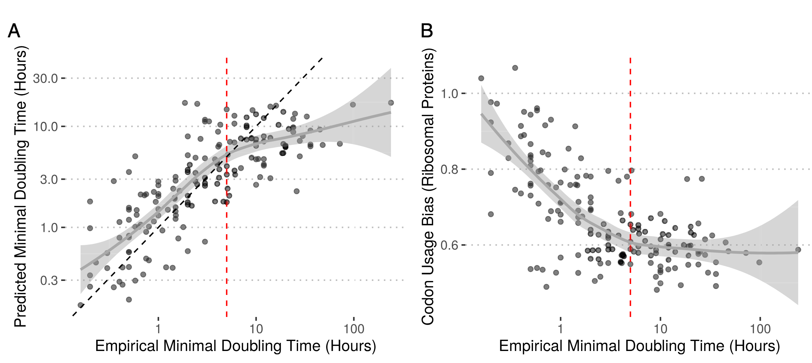
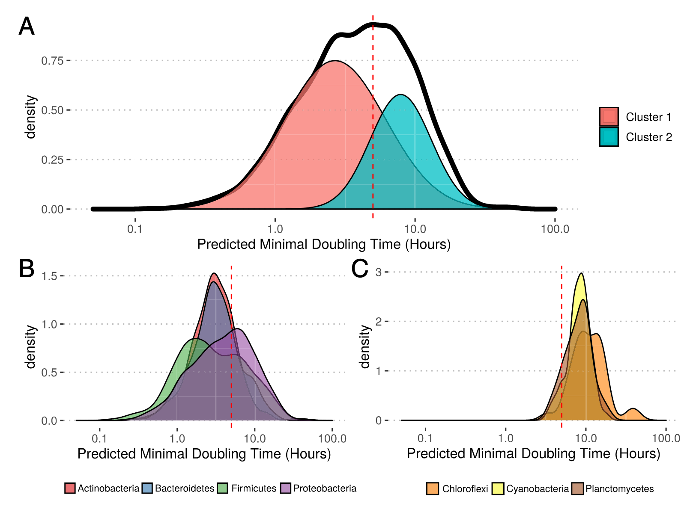
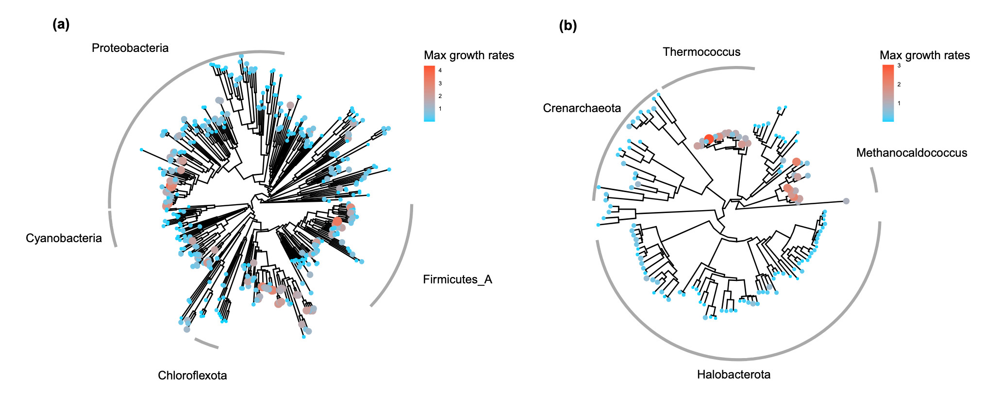
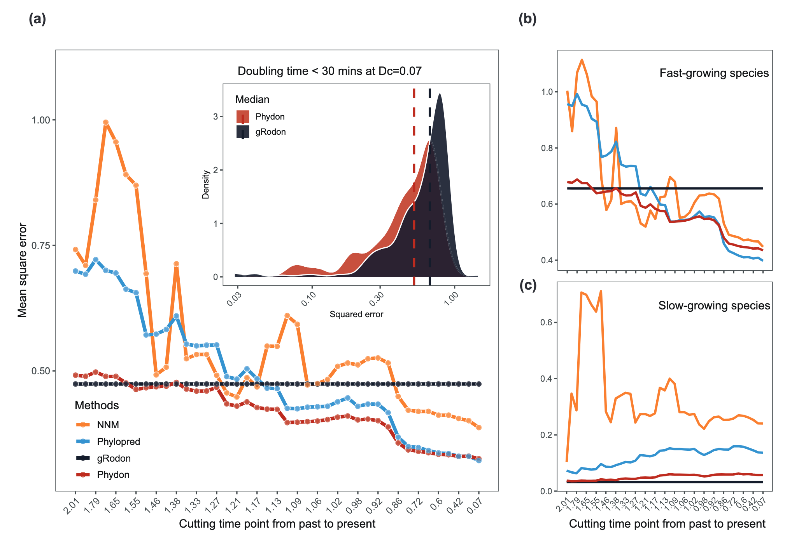
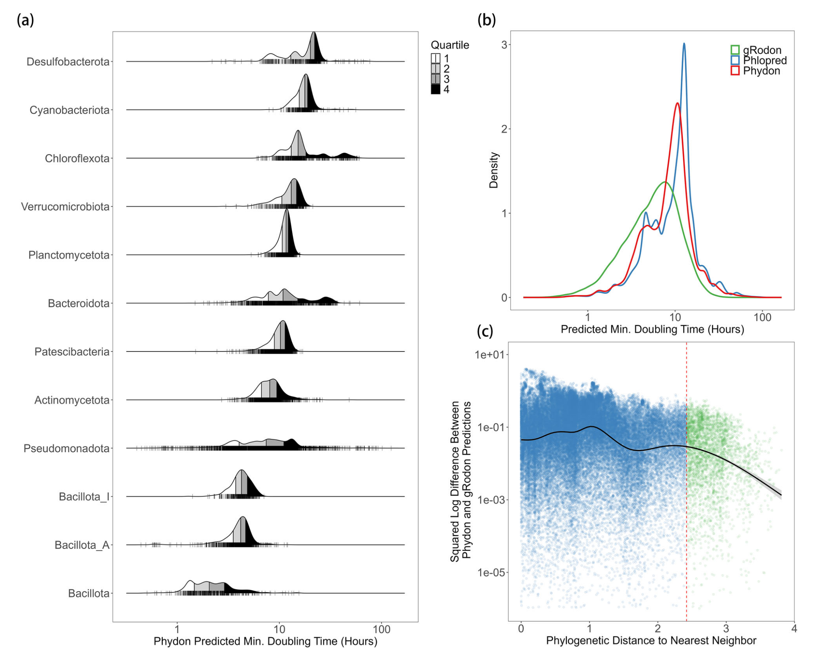

## Introduction

微生物的倍增时间范围极广，从几分钟到数天甚至数年不等。这种生长率的差异是理解微生物生态策略和生态系统功能的关键。传统上，生长率需在实验室最佳条件下通过培养实验测量。然而，绝大多数微生物的适宜培养条件未知，导致我们难以评估微生物生长潜力的全局多样性。基于基因组的最大生长率预测工具提供了一种不依赖于培养状态、大规模调查微生物生长潜力的实用解决方案。

基因组中多个特征与最大生长率相关，包括rRNA操纵子拷贝数、tRNA拷贝数、复制相关基因剂量以及密码子使用偏好。其中，高表达基因的密码子使用偏好是与高生长率相关性最强的基因组指标之一。高表达基因倾向于优先使用与细胞内丰度较高的tRNA相匹配的“最优”密码子，以优化翻译效率，支持蛋白质的快速合成。Vieira-Silva和Rocha基于此开发了growthpred软件，能够从基因组数据预测最大生长率。这几篇文章旨在通过评估密码子使用的更多维度，并提供一个适用于宏基因组群落数据的物种丰度校正方法，以提升预测性能，并利用大规模基因组数据进行更全面的生态学分析。

本文首先介绍gRodon和Phydon两个工具的开发和应用，然后再说一下具体的使用方法。

## 文章介绍（gRodon）

1. Weissman, J. L., Hou, S. & Fuhrman, J. A. Estimating maximal microbial growth rates from cultures, metagenomes, and single cells via codon usage patterns. Proc. Natl. Acad. Sci. 118, e2016810118 (2021).

微生物的最大生长率是其基本生活方式参数，传统上依赖于耗时且难以标准化的实验室培养实验。由于绝大多数微生物（>99%）不可培养，直接测量其生长潜力几乎不可能。作者开发了一个名为gRodon的R包，其核心是通过量化高表达基因（如核糖体蛋白基因）的密码子使用偏好来预测微生物的最大潜在生长率。

gRodon通过结合三个关键密码子使用特征，显著提升了预测精度，相比前人开发的工具growthpred，与实验测量数据的拟合优度更高。利用gRodon，研究人员对来自RefSeq、宏基因组组装基因组和单细胞扩增基因组的超过20万个微生物基因组进行了最大生长率预测，并建立了预测数据库（EGGO）。分析揭示，微生物的最大生长率呈现双峰分布，表明自然界中存在“快速生长”与“慢速生长”两种基本的生长策略类型。此外，研究结果表明，现有的培养菌株和高质量参考基因组库严重偏向于快速生长的“富营养型”微生物，而环境中大量存在的慢速生长“寡营养型”微生物在培养库中代表性严重不足。基于对密码子优化选择信号的观察，研究人员提出了一个基于进化选择压力的寡营养与富营养型微生物的定义。


### 方法

#### 模型拟合
研究人员为数据集中每个物种下载了所有可用的完整基因组。对于每个物种，计算了三个密码子使用统计量在所有对应基因组中的平均值。使用线性模型对经过Box-Cox变换的倍增时间进行拟合，预测变量为三个密码子使用特征。初始模型拟合时排除了嗜热和嗜冷微生物，最终gRodon包中包含一个考虑最适生长温度的选项。

#### 宏基因组数据处理
对原始测序数据进行质控和组装，使用prokka对组装结果进行开放阅读框预测和注释。将 reads 映射到 ORFs 并计算每个 ORF 的覆盖深度。gRodon 在加权和非加权两种模式下运行，在加权模式下，高表达基因的中位数CUB是作为加权中位数计算的，权重对应于该基因的平均覆盖深度。


### 结果

#### 准确预测最大生长率

研究人员从Vieira-Silva和Rocha的数据集中收集了214个有记录最大生长率的物种，并下载了其在RefSeq中的所有完整基因组组装。gRodon模型衡量了三个与密码子使用相关的特征：1) 高表达基因相对于基因组背景的密码子使用偏好；2) 高表达基因之间密码子使用模式的一致性；3) 全基因组的密码子对偏好。这三个特征在多元回归中均与生长率显著相关，且每个新增特征都显著提升了模型对数据的拟合度。



gRodon模型对现有最大生长率数据的拟合优度较高。更重要的是，即使在控制了系统发育结构影响的“区块交叉验证”中，gRodon模型在预测大多数门类的生长率时，也优于基于整个数据集拟合的growthpred模型，这表明其预测能力具有良好的跨谱系泛化能力。

#### 慢速生长者的预测挑战与生态学定义

对于倍增时间非常长的慢速生长微生物，gRodon虽然优于growthpred，但仍倾向于低估其实际倍增时间。在极慢生长的微生物种群中，优化核糖体蛋白转录的选择压力很可能非常低，当选择系数足够小时，遗传漂变将主导进化过程。这在数据中得到体现：当倍增时间超过约5小时后，高表达基因的CUB强度达到一个“基底”，不再随倍增时间的增加而进一步降低。这一观察结果导致了一个重要的生态学定义：研究人员提出，可以将**寡营养型微生物定义为“选择压力对快速最大生长的优化弱到无法观察到生长优化信号（如CUB）的生物体”**，而富营养型微生物则相反。这一基于选择压力是否存在，而非绝对生长率数值的定义，提供了一个清晰的进化框架。

#### EGGO数据库揭示的宏观格局



研究人员构建了EGGO数据库，包含了对超过20万个公开基因组、MAG和SAG的预测生长率。其中，来自RefSeq的分离株基因组的生长率分布大致呈双峰分布，两个峰之间的分界与上述5小时倍增时间阈值基本一致。高斯混合模型也识别出两个主要的微生物类群，平均倍增时间分别为2.7小时和7.9小时，以及一个极小的慢速生长类群。在门类水平上，微生物也大致按生长策略分组，快速生长和慢速生长的门类被5小时的阈值所区分。

#### 环境来源基因组揭示强烈的培养偏好

宏基因组组装基因组和单细胞扩增基因组占据了数据库的相当一部分，它们提供了关于未培养生物生长率分布的重要信息。分析清楚地显示，无论是海洋环境还是宿主相关环境，从同一环境中分离的培养株，其预测的倍增时间都显著短于来自同一环境的MAGs和SAGs。这表明，即使旨在捕获环境完整分类多样性的分离株集合，也未能捕获群落中生长最慢的成员。通过系统发育逻辑回归证实，一个生物体是否被归类为富营养型，对其是否拥有完全测序的分离株基因组有显著的积极影响。换言之，无论属于哪个系统发育类群，生长缓慢的海洋生物在完全测序基因组中的代表性都低于快速生长的生物。

#### 富营养型与寡营养型的功能差异

为了验证两种生长类群对应于不同的选择压力，研究人员设计了一个测试，比较了高度相关物种对中高表达基因同义多态性上纯化选择的强度。结果显示，在富营养型生物中，高表达基因的同义替换率相对于基因组其余部分显著降低，表明存在强烈的纯化选择以维持高翻译效率；而在寡营养型生物中，则几乎没有这种优化迹象。

在基因组功能层面，属于两个自然定义的生长率类群的生物具有明显不同的基因组内容，反映了两种可替代的微生物生活方式。在富营养型基因组中，与转录、碳水化合物转运和代谢相关的基因家族显著富集，这对应于快速获取养分和蛋白质生产的总体策略。而在寡营养型基因组中，与能量产生和转换、复制、重组和修复相关的基因家族则过度富集，对应于能量生产和细胞维持的总体策略。此外，在防御机制上，两种类群也存在系统性差异：许多针对抗菌剂（如抗生素、氧化剂）的防御基因是富营养型特有的，而许多参与抗病毒防御（如DNA结合/降解蛋白）的基因则是寡营养型特有的。

## 文章介绍（Phydon）

微生物的最大生长率是驱动全球生物地球化学循环和构建生态系统模型的关键参数。然而，绝大多数微生物不可培养，其生长潜力难以直接测量。基于基因组特征（特别是密码子使用偏好）的预测工具为此提供了有力手段。

2. Xu, L., Zakem, E. & Weissman, J. L. Improved maximum growth rate prediction from microbial genomes by integrating phylogenetic information. Nat. Commun. 16, 4256 (2025).

本研究提出了一个名为Phydon的新型预测框架。该框架创造性地将基于密码子使用偏好的gRodon模型与基于系统发育亲缘关系的预测模型相结合，通过一个智能加权系统，根据查询基因组与训练集的系统发育距离及其预估生长率，动态地融合两种信息来源。使用系统发育阻断交叉验证方法的评估表明，相较于单一的gRodon模型，Phydon能显著降低预测误差，平均均方误差减少31%，尤其是在有近缘物种参考时提升更为明显。研究人员利用Phydon对GTDB数据库中的111,349个微生物物种代表基因组进行了预测，并整合了最适生长温度信息进行校正，构建了迄今为止规模最大、覆盖最广的微生物最大生长率预测数据库。该数据库清晰地揭示了微生物最大生长率呈现双峰分布，明确区分了快速生长与慢速生长两大类群，为从基因组层面理解微生物的宏观生态策略提供了关键资源。

### 方法

#### 数据准备与系统发育分析
从公开性状数据库中获取548个物种的生长率数据，并从GTDB获取相应的系统发育树。通过随机抽样为每个物种选择最多五个基因组（包含代表基因组）用于分析，以平衡信息量与计算量。评估了数据集中生长率的系统发育信号强度。

#### 模型比较与评估
使用系统发育阻断交叉验证评估模型性能。通过在系统发育树的不同时间点切割，将物种划分为不同数量的进化枝。切割点越晚，进化枝间距离越小。在每次交叉验证中，将一个进化枝作为测试集，其余作为训练集，以此评估模型在外推到新的分类群时的表现。比较了gRodon模型、最近邻模型和基于布朗运动的系统发育预测模型的性能。

#### Phydon模型构建
Phydon模型的核心是加权集成。其预测值为gRodon预测值（\( \tilde{y}_{\text{gRodon}} \)）与系统发育预测值（\( \tilde{y}_{\text{phylopred}} \)）的加权算术平均：\( \tilde{y}_{\text{phydon}} = \tilde{y}_{\text{gRodon}} \times P + \tilde{y}_{\text{phylopred}} \times (1-P) \)。其中，权重P由逻辑回归模型确定，该模型的自变量为gRodon预测值的对数和查询基因组到训练集的平均系统发育距离（\(D_p\)）及其交互项。

### 结果与讨论

#### 模型构建与性能评估



研究人员从一个包含548个有记录生长率物种的数据集出发。该数据集的生长率表现出中等程度的系统发育信号，表明适合开发兼顾基因组与系统发育因素的方法。

通过系统发育阻断交叉验证，研究人员系统评估了gRodon模型与两种系统发育预测模型在不同系统发育距离下的性能。gRodon模型基于密码子使用偏好，其预测误差在不同系统发育距离下保持稳定，证实了该特征作为生长率代理的鲁棒性和良好的跨谱系泛化能力。而基于最近邻和布朗运动模型的系统发育预测方法，其准确性则随着训练集与测试集之间系统发育距离的缩小而显著提高。

关键发现是，两种方法对快速生长和慢速生长物种的预测性能存在明显差异。对于慢速生长物种，gRodon模型在所有系统发育距离上都优于系统发育模型。相反，对于快速生长物种，当有较近的亲缘物种参考时，系统发育模型的预测精度超过了gRodon模型。这一发现表明，优化的预测策略应同时考虑物种的生长潜力和其系统发育背景。

#### Phydon：一种集成预测框架



基于上述分析，研究人员开发了Phydon模型。该模型并非简单地在两种方法间选择，而是通过一个连续权重参数P，计算gRodon预测值与系统发育预测值的加权平均值。权重P由一个逻辑回归模型动态决定，该模型的输入是查询基因组的gRodon初步生长率预测值，以及其到训练集中5个最近物种的平均系统发育距离。这一设计使得Phydon能够智能地调整对两种信息源的依赖程度。

验证结果表明，Phydon模型在大多数情况下实现了比单一模型更低的预测误差。与gRodon模型相比，Phydon将平均均方误差降低了31%。特别值得注意的是，在短系统发育距离（即有近缘参考时）下，Phydon的性能提升尤为显著，而在长距离下其性能与gRodon相当，实现了“扬长避短”的效果。

#### 大规模生长率数据库与宏观格局



利用Phydon，研究人员对GTDB v220数据库中的物种代表基因组进行了系统预测，并结合GenomeSPOT工具提供的最适生长温度进行校正，最终建立了一个包含111,034个温度校正后生长率预测的数据库。该数据库极大地方便了基于扩增子测序的微生物群落功能注释研究。

分析该数据库揭示了几点重要发现。首先，微生物的最大生长率在门类水平上呈现明显的策略分野，例如厚壁菌门多为快速生长者，而蓝细菌门和脱硫杆菌门多为慢速生长者。其次，所有物种的预测生长率呈现出清晰的双峰分布，这与之前使用gRodon的观察一致，但Phydon使得这种类群区分更为明显。这一双峰分布对应了微生物界长期进化形成的两种基本生态策略：快速生长的富营养型和慢速生长的寡营养型。

## 使用教程

### 环境准备：安装R包与依赖

在开始使用Phydon前，需确保R环境已就绪，并正确安装其核心依赖包。**Phydon** 是一个R包，用于从微生物基因组数据中预测最大生长速率，它主要依赖 **gRodon2** 包（用于计算密码子使用偏好CUB）以及 **BiocManager** 管理的一些生物信息学包。

1.1 安装核心依赖
由于Phydon依赖于多个生物信息学包，建议先通过 `BiocManager` 安装这些基础包，这能解决大部分依赖冲突问题。

```r
# 1. 安装BiocManager（如果尚未安装）
if (!requireNamespace("BiocManager", quietly = TRUE)) {
    install.packages("BiocManager")
}

# 2. 安装gRodon2（核心依赖，需从GitHub安装）
if (!requireNamespace("devtools", quietly = TRUE)) {
    install.packages("devtools")
}
devtools::install_github("jlw-ecoevo/gRodon2")

# 3. 安装其他生物信息学依赖
BiocManager::install("Biostrings")
BiocManager::install("coRdon")
install.packages("matrixStats")
```

1.2 安装Phydon
完成依赖安装后，即可从GitHub安装Phydon主包。

```r
# 从GitHub安装Phydon
devtools::install_github("xl0418/Phydon")

# 加载包
library(Phydon)
```

### 数据准备：基因组文件与输入格式

Phydon的输入需要**已注释的基因组文件**，推荐使用 **Prokka** 等工具对原始FASTA文件进行基因结构预测。

2.1 推荐的数据结构
Phydon要求将每个基因组的注释文件（`.ffn` 和 `.gff`）放在以**基因组名**命名的独立文件夹中，结构示例如下：

```
genome_data/                    # 主数据目录
    ├── genome1/                    # 第一个基因组文件夹
    │   ├── genome1.ffn            # 基因序列（CDS，FASTA格式）
│   ├── genome1.gff            # 基因注释文件
│   └── genome1_CDS_names.txt  # 基因名列表（Phydon可自动生成）
├── genome2/
    │   ├── genome2.ffn
│   ├── genome2.gff
│   └── ...
└── ...
```

**注意**：`genome1_CDS_names.txt` 文件是 **gRodon2** 运行所必需的，它包含该基因组中所有CDS的ID列表。如果使用Prokka注释，Phydon会自动尝试通过系统命令（`sed`）从 `.gff` 文件提取生成此文件。**Windows用户** 可能因缺少 `sed` 命令而报错，此时需手动创建该文件，或通过WSL、Cygwin等环境运行。

2.2 创建输入数据框
Phydon的主函数 `Phydon()` 要求输入一个数据框（`data.frame`），必须包含 `gene_location` 和 `genome_name` 两列。

```r
# 假设你的数据目录是 "D:/genome_data"
# 创建数据框
data_info <- data.frame(
    gene_location = c(
        "D:/genome_data/genome1/genome1.ffn",  # 第一列：基因序列文件路径
        "D:/genome_data/genome2/genome2.ffn"
    ),
    genome_name = c("genome1", "genome2")   # 第二列：基因组名称/ID
)

# 可选：如果知道培养温度，可添加第三列
data_info$temperature <- c(20, 25)  # 单位：摄氏度
```

### 运行分析：不同模式的选择

Phydon支持两种主要的运行模式，主要区别在于是否使用系统发育信息。

3.1 模式一：无系统发育信息（仅gRodon）
当你的基因组是**新物种**（在GTDB数据库中无记录）或你**没有系统发育树**时，使用此模式。Phydon将仅基于密码子使用偏好（CUB）进行预测。

```r
# 只使用gRodon进行预测
result_metagenome <- Phydon(
    data_info, 
    gRodon_mode = "metagenome"  # 或 "full" (用于完整基因组)
)
```

**参数说明**：
- **`gRodon_mode`**：
- `"metagenome"`：适用于宏基因组或组装不完整的基因组。
- `"full"`：适用于完整、闭合的基因组。

3.2 模式二：结合系统发育信息（Phydon核心功能）
当你的基因组是**已知物种**（在GTDB中有记录）时，可以结合系统发育信息进行更精准的预测。这需要提供**系统发育树**（`user_tree` 参数）。

```r
# 加载系统发育树（Newick格式）
user_tree <- ape::read.tree("path/to/your/tree.tree")

# 结合系统发育信息进行预测
result_phylo <- Phydon(
    data_info, 
    user_tree = user_tree,  # 传入系统发育树
    gRodon_mode = "metagenome"
)
```

**如何获取系统发育树**：
- 使用 **GTDB-Tk** 对基因组进行分类，其输出目录（`/output/classify/`）中通常包含系统发育树文件。

### 结果解读

运行完成后，`Phydon()` 函数会返回一个数据框，包含每个基因组的预测结果。关键列包括：

- **`gRodon_est`**：仅基于CUB的预测值。
- **`Phylopred_est`**：仅基于系统发育的预测值。
- **`Phydon_est`**：Phydon的最终集成预测值（结合了CUB和系统发育信息）。

4.1 结果示例
```r
# 查看前几行结果
head(result_phylo)

# 输出示例：
#   genome_name gRodon_est Phylopred_est Phydon_est
# 1     genome1       1.23          1.45       1.34
# 2     genome2       0.89          0.92       0.91
```

> **注意**：如果某个基因组在GTDB中无记录，`Phylopred_est` 和 `Phydon_est` 列可能为 `NA`，此时应参考 `gRodon_est` 值。

### 常见问题与排错

5.1 错误：`Error in gRodon...`
- **原因**：通常是因为输入文件格式错误或 `_CDS_names.txt` 文件缺失。
- **解决**：检查每个基因组文件夹下是否有 `.gff` 和 `.ffn` 文件，并确保R有权限读取。对于Windows用户，如果无法自动生成 `_CDS_names.txt`，需手动创建。

5.2 错误：`Error in Phylopred...`
- **原因**：系统发育树与基因组名称不匹配，或树文件格式不正确。
- **解决**：检查 `genome_name` 列中的名称是否与系统发育树中的叶节点名称完全一致（区分大小写和标点）。

5.3 运行速度慢
- **解决**：对于大量基因组，建议在Linux服务器上运行，或使用R的并行计算包（如 `parallel` 或 `future`）分批次处理。
